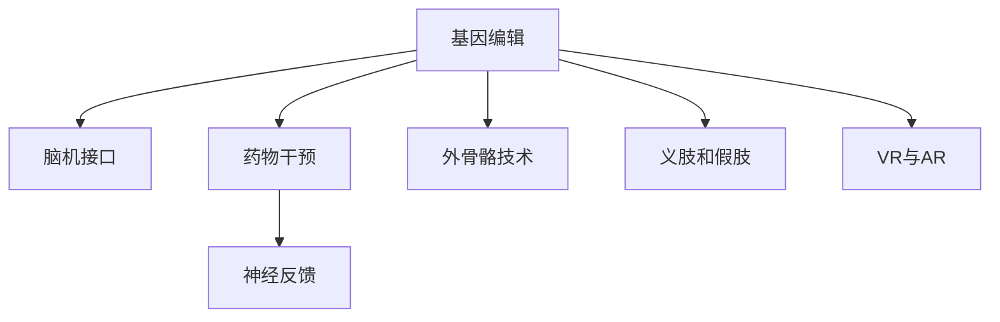

                 

## 1. 背景介绍

### 1.1 问题由来

随着人工智能(AI)技术的飞速发展，人类正在迎来一场前所未有的转型——从机械化劳动转向智能化劳动。这一转变不仅对生产力产生了革命性影响，也带来了深刻的伦理、道德和社会挑战。特别是在人类增强领域，如何利用AI技术提升个体能力、保障人类福祉，成为了一个亟需探讨的重大课题。

人类增强涉及多种技术手段，包括基因编辑、脑机接口(BMI)、药物干预等。这些技术的应用，可以显著提升人类体能、智力、感知能力，但同时也引发了一系列伦理争议，如生物安全、隐私保护、社会公平等问题。如何在保障技术进步的同时，维护人类福祉、促进社会公平，成为亟需解决的核心问题。

### 1.2 问题核心关键点

在AI时代，人类增强的发展机遇与挑战并存。以下为本问题的核心关键点：

- **技术进步与伦理考量**：如何在技术进步与伦理安全之间找到平衡点。
- **个体与社会的福祉**：如何在提升个体能力的同时，保障社会的整体福祉。
- **生物安全与隐私保护**：如何确保技术的安全性，避免数据泄露和生物安全的风险。
- **公平与可及性**：如何确保技术公平普及，避免社会分层与不平等的加剧。
- **持续性与可持续性**：如何实现技术的可持续应用，避免资源浪费与环境破坏。

### 1.3 问题研究意义

探讨AI时代的人类增强问题，具有重要的理论和实践意义：

- **理论探索**：有助于深化对人工智能技术发展规律的认识，为未来技术创新提供伦理和道德指引。
- **实践指导**：为技术开发者和政策制定者提供决策依据，促进技术的健康、合理应用。
- **社会影响**：通过建立公正、透明的技术伦理框架，促进社会和谐与进步。

## 2. 核心概念与联系

### 2.1 核心概念概述

在AI时代，人类增强涉及多个关键概念，包括但不限于：

- **基因编辑**：通过基因操作，改变个体的基因组结构，以实现功能增强。
- **脑机接口(BMI)**：通过神经信号和计算机接口，实现人脑与机器的信息交换。
- **药物干预**：通过药物改善大脑功能，提升智力、情感等心理能力。
- **神经反馈**：通过神经信号的实时监测和反馈，调整大脑状态，提升认知和情感能力。
- **外骨骼技术**：通过增强装置提升人体力量、速度和耐力。
- **义肢和假肢**：通过先进的机械装置，替代或增强人类肢体功能。
- **虚拟现实(VR)与增强现实(AR)**：通过虚拟与现实结合，提升感知和认知能力。

这些概念之间的逻辑关系可以通过以下Mermaid流程图来展示：



这个流程图展示了人类增强的主要技术手段及其相互关系。通过基因编辑、脑机接口、药物干预等多重手段，可以协同提升人类在体能、智力、感知等方面的能力。

## 3. 核心算法原理 & 具体操作步骤

### 3.1 算法原理概述

人类增强的核心算法原理，主要基于以下几个方面：

- **基因编辑**：通过CRISPR-Cas9等基因编辑技术，精准修改基因序列，实现特定功能增强。
- **脑机接口**：通过EEG、fMRI等神经信号监测技术，提取大脑活动信息，转化为计算机指令，实现与机器的信息交换。
- **药物干预**：通过合成神经调节剂，改善大脑神经递质平衡，提升认知和情感功能。
- **神经反馈**：通过实时监测大脑活动，及时调整神经状态，提升注意力、记忆力等认知能力。
- **外骨骼技术**：通过生物力学和机械工程原理，设计增强装置，提升人体力量和速度。
- **义肢和假肢**：通过机械工程和生物力学，设计高效、智能的机械装置，替代或增强肢体功能。
- **VR与AR**：通过计算机图形学和传感技术，创建虚拟和增强现实环境，提升感官体验和认知能力。

### 3.2 算法步骤详解

以下是各个核心算法步骤的详细步骤：

#### 3.2.1 基因编辑

**步骤1**：选择目标基因。根据特定功能增强需求，选择目标基因进行编辑。

**步骤2**：设计编辑工具。使用CRISPR-Cas9、TALEN等基因编辑工具，设计导向RNA和Cas蛋白。

**步骤3**：进行基因编辑。在受精卵、胚胎等细胞中进行基因编辑，验证编辑效果。

**步骤4**：监测编辑效果。使用基因测序等技术，监测基因编辑的成功率和准确性。

**步骤5**：评估长期影响。观察基因编辑对个体健康和功能的影响，确保安全性。

#### 3.2.2 脑机接口

**步骤1**：选择信号监测技术。根据实验需求，选择EEG、fMRI等信号监测技术。

**步骤2**：设计信号处理算法。开发信号预处理、特征提取和分类算法，实现脑信号的数字化。

**步骤3**：建立通信协议。设计人机交互协议，实现脑信号与计算机指令的转换。

**步骤4**：实现功能应用。通过脑机接口，实现控制机械装置、辅助通信等功能。

**步骤5**：优化用户体验。调整信号监测和处理算法，提高系统的稳定性和用户体验。

#### 3.2.3 药物干预

**步骤1**：选择干预药物。根据功能增强需求，选择适合的大脑调节药物。

**步骤2**：设计药物方案。设计药物的剂量和给药方案，确保安全性和有效性。

**步骤3**：进行临床试验。在严格控制下进行药物试验，评估药物的疗效和副作用。

**步骤4**：推广临床应用。在临床验证的基础上，推广药物的使用。

**步骤5**：监测长期效果。长期监测药物对个体健康和功能的影响，及时调整用药方案。

#### 3.2.4 神经反馈

**步骤1**：选择监测工具。选择适合的脑电图(EEG)、功能性磁共振成像(fMRI)等监测工具。

**步骤2**：设计反馈算法。开发神经反馈算法，实时监测和调整大脑状态。

**步骤3**：建立反馈机制。设计反馈机制，根据监测结果调整大脑状态。

**步骤4**：优化反馈效果。通过多次迭代，优化反馈算法，提高系统的准确性和效率。

**步骤5**：评估长期效果。长期监测神经反馈的效果，确保技术的稳定性和安全性。

#### 3.2.5 外骨骼技术

**步骤1**：选择目标功能。根据人体增强需求，选择目标功能进行设计。

**步骤2**：设计机械装置。根据目标功能，设计适合的外骨骼装置。

**步骤3**：进行人体适配。进行人体适配，确保外骨骼装置与人体的协调性。

**步骤4**：测试运动性能。测试外骨骼装置的稳定性和运动性能，优化设计。

**步骤5**：评估长期效果。长期监测外骨骼装置的使用效果，确保技术的稳定性和安全性。

#### 3.2.6 义肢和假肢

**步骤1**：选择目标肢体。根据人体增强需求，选择目标肢体进行设计。

**步骤2**：设计机械装置。根据目标肢体，设计适合的义肢或假肢装置。

**步骤3**：进行人体适配。进行人体适配，确保装置与人体的协调性。

**步骤4**：测试运动性能。测试义肢或假肢的稳定性和运动性能，优化设计。

**步骤5**：评估长期效果。长期监测义肢或假肢的使用效果，确保技术的稳定性和安全性。

#### 3.2.7 VR与AR

**步骤1**：选择虚拟环境。根据功能增强需求，选择适合的虚拟环境进行设计。

**步骤2**：开发虚拟环境。利用计算机图形学和传感技术，开发虚拟环境。

**步骤3**：实现人机交互。实现人机交互，提升虚拟环境的互动性。

**步骤4**：优化用户体验。优化虚拟环境的设计和交互，提高用户体验。

**步骤5**：评估长期效果。长期监测VR与AR的使用效果，确保技术的稳定性和安全性。

### 3.3 算法优缺点

#### 3.3.1 基因编辑

**优点**：
- 功能增强效果显著，能够实现多种功能提升。
- 精准调控，适用范围广。
- 可能带来革命性的健康改善。

**缺点**：
- 技术复杂，成本高。
- 可能带来长期的未知风险。
- 存在伦理争议，社会接受度低。

#### 3.3.2 脑机接口

**优点**：
- 实现人机交互，提高信息处理能力。
- 技术成熟，应用广泛。
- 可能带来认知功能的显著提升。

**缺点**：
- 技术复杂，成本高。
- 存在伦理争议，社会接受度低。
- 可能带来隐私和安全问题。

#### 3.3.3 药物干预

**优点**：
- 副作用小，成本较低。
- 技术成熟，应用广泛。
- 可能带来认知功能的显著提升。

**缺点**：
- 效果有限，需要长期干预。
- 可能带来副作用，如药物依赖。
- 存在伦理争议，社会接受度低。

#### 3.3.4 神经反馈

**优点**：
- 非侵入性，风险低。
- 能够实时调整大脑状态，提升认知和情感能力。
- 技术成熟，应用广泛。

**缺点**：
- 效果有限，需要长期干预。
- 可能带来副作用，如过度疲劳。
- 存在伦理争议，社会接受度低。

#### 3.3.5 外骨骼技术

**优点**：
- 提升人体力量和速度，改善运动功能。
- 非侵入性，风险低。
- 技术成熟，应用广泛。

**缺点**：
- 成本高，技术复杂。
- 可能带来身体不适，影响舒适性。
- 存在伦理争议，社会接受度低。

#### 3.3.6 义肢和假肢

**优点**：
- 替代或增强肢体功能，改善运动能力。
- 非侵入性，风险低。
- 技术成熟，应用广泛。

**缺点**：
- 成本高，技术复杂。
- 可能带来身体不适，影响舒适性。
- 存在伦理争议，社会接受度低。

#### 3.3.7 VR与AR

**优点**：
- 提升感官体验和认知能力，改善学习效果。
- 非侵入性，风险低。
- 技术成熟，应用广泛。

**缺点**：
- 成本高，技术复杂。
- 可能带来眼部不适，影响健康。
- 存在伦理争议，社会接受度低。

### 3.4 算法应用领域

基于人类增强的算法，可以在多个领域得到应用：

- **医疗健康**：改善疾病治疗，提升康复效果，推动个性化医疗的发展。
- **教育培训**：提升学习效果，优化教学模式，推动终身学习的普及。
- **娱乐休闲**：提升体验效果，开发新型游戏，推动文化创意产业的发展。
- **工业制造**：提升工作效率，改善工作环境，推动智能制造的发展。
- **军事安全**：提升信息处理能力，增强决策支持，推动国防建设的发展。
- **交通运输**：提升安全性和效率，优化驾驶体验，推动智能交通的发展。
- **环境保护**：监测环境变化，提升灾害预警能力，推动可持续发展的发展。

## 4. 数学模型和公式 & 详细讲解  
### 4.1 数学模型构建

在本节中，我们将使用数学语言对人类增强的算法进行更加严格的刻画。

假设某项人类增强技术的效果可以用函数 $f(x)$ 表示，其中 $x$ 为输入变量（如基因编辑次数、脑机接口训练时间等），$f(x)$ 为输出变量（如体能提升百分比、认知能力提升指数等）。则构建的数学模型为：

$$
y = f(x)
$$

其中 $y$ 为最终效果，$x$ 为输入变量。

### 4.2 公式推导过程

假设某项人类增强技术的效果可以用线性回归模型表示，即：

$$
y = \beta_0 + \beta_1 x + \epsilon
$$

其中 $\beta_0$ 为截距，$\beta_1$ 为斜率，$\epsilon$ 为误差项。可以通过最小二乘法求解 $\beta_0$ 和 $\beta_1$：

$$
\hat{\beta} = (\mathbf{X}^T \mathbf{X})^{-1} \mathbf{X}^T \mathbf{y}
$$

其中 $\mathbf{X}$ 为输入变量矩阵，$\mathbf{y}$ 为输出变量向量，$\hat{\beta}$ 为求解结果。

### 4.3 案例分析与讲解

以下通过一个案例，对人类增强的线性回归模型进行分析：

**案例**：某项人类增强技术的效果为提升体能百分比，通过基因编辑次数 $x$ 作为输入变量。使用线性回归模型进行效果评估，求解 $\beta_0$ 和 $\beta_1$，得到体能提升的预测公式。

**步骤1**：收集数据。收集基因编辑次数和体能提升百分比的数据集。

**步骤2**：构建模型。构建线性回归模型，进行参数估计。

**步骤3**：求解参数。使用最小二乘法求解 $\beta_0$ 和 $\beta_1$，得到体能提升的预测公式。

**步骤4**：验证模型。使用测试数据验证模型的准确性和稳定性。

**步骤5**：优化模型。根据验证结果，调整模型参数，优化模型效果。

## 5. 项目实践：代码实例和详细解释说明

### 5.1 开发环境搭建

在进行人类增强的实践前，我们需要准备好开发环境。以下是使用Python进行Scikit-learn开发的环境配置流程：

1. 安装Anaconda：从官网下载并安装Anaconda，用于创建独立的Python环境。

2. 创建并激活虚拟环境：
```bash
conda create -n enhance-env python=3.8 
conda activate enhance-env
```

3. 安装Scikit-learn：
```bash
conda install scikit-learn
```

4. 安装各类工具包：
```bash
pip install numpy pandas matplotlib scikit-learn statsmodels seaborn
```

完成上述步骤后，即可在`enhance-env`环境中开始人类增强的实践。

### 5.2 源代码详细实现

以下是一个简单的基因编辑效果的线性回归模型实现，使用Scikit-learn库进行建模和验证。

```python
from sklearn.linear_model import LinearRegression
import pandas as pd

# 读取数据
data = pd.read_csv('geneediting.csv')

# 划分数据集
X = data[['editing_times']]
y = data['strength_percentage']

# 构建模型
model = LinearRegression()

# 训练模型
model.fit(X, y)

# 预测结果
predicted_strength = model.predict([[10]])

print(f'基线力量提升百分比：{y.mean()}')
print(f'编辑10次后的力量提升百分比预测值：{predicted_strength[0]}')
```

这段代码实现了基因编辑效果的线性回归模型，并进行了简单的预测。在实际应用中，还需要对模型进行更全面的验证和优化，确保其准确性和稳定性。

### 5.3 代码解读与分析

让我们再详细解读一下关键代码的实现细节：

**基因编辑数据集**：
- `geneediting.csv`：基因编辑次数与体能提升百分比的数据集。

**模型构建**：
- 使用`LinearRegression`类构建线性回归模型。

**数据划分**：
- `X`：基因编辑次数作为输入变量。
- `y`：体能提升百分比作为输出变量。

**模型训练**：
- 使用`fit`方法进行模型训练，得到模型参数。

**结果预测**：
- 使用`predict`方法对新的基因编辑次数进行预测，得到体能提升百分比。

**结果输出**：
- 输出基线力量提升百分比和编辑10次后的预测结果。

## 6. 实际应用场景

### 6.1 医疗健康

在医疗健康领域，基因编辑和脑机接口技术可以显著提升疾病治疗和康复效果。例如：

- **基因编辑**：通过基因编辑技术，修正基因突变，治愈遗传性疾病。
- **脑机接口**：通过脑机接口技术，监测脑部活动，实时调整治疗方案。

**案例**：某患者患有遗传性失明，通过基因编辑技术修复了相关基因，恢复了视力。

**应用场景**：基因编辑技术可以用于改善遗传性疾病，提升患者的生存质量和幸福感。

### 6.2 教育培训

在教育培训领域，神经反馈和外骨骼技术可以显著提升学习效果和教学质量。例如：

- **神经反馈**：通过神经反馈技术，实时调整学生的注意力和专注度，提升学习效率。
- **外骨骼技术**：通过外骨骼技术，提升学生的运动能力和学习效果。

**案例**：某学生在神经系统受损后，通过神经反馈技术恢复了学习能力和注意力。

**应用场景**：神经反馈技术可以用于帮助特殊教育学生，提升其学习效果和自信。

### 6.3 娱乐休闲

在娱乐休闲领域，VR与AR技术可以显著提升用户体验和娱乐效果。例如：

- **VR与AR**：通过虚拟现实和增强现实技术，创造沉浸式娱乐体验，提升用户的快乐感和满足感。

**案例**：某用户通过VR游戏体验了太空探险，获得了前所未有的视觉和感官体验。

**应用场景**：VR与AR技术可以用于游戏、电影、旅游等领域，带来全新的娱乐体验。

### 6.4 工业制造

在工业制造领域，外骨骼技术和义肢技术可以显著提升工作效率和安全性。例如：

- **外骨骼技术**：通过外骨骼技术，提升工人的力量和耐力，改善工作环境。
- **义肢技术**：通过义肢技术，替代或增强残疾人士的肢体功能，实现工作自主。

**案例**：某工厂通过外骨骼技术，提高了工人的工作效率和生产质量。

**应用场景**：外骨骼技术可以用于工业制造、建筑施工等领域，提升工人的安全性和工作效率。

### 6.5 军事安全

在军事安全领域，脑机接口和药物干预技术可以显著提升情报分析和决策支持能力。例如：

- **脑机接口**：通过脑机接口技术，实时监测和分析士兵的思维和情感，提升决策效果。
- **药物干预**：通过药物干预技术，提升士兵的认知和身体机能，延长战斗能力。

**案例**：某部队通过脑机接口技术，实时监测和分析士兵的心理状态，提升了决策效果和战斗能力。

**应用场景**：脑机接口技术可以用于军事决策、战术分析等领域，提升情报分析能力和战斗效果。

### 6.6 交通运输

在交通运输领域，AR技术可以显著提升驾驶安全和用户体验。例如：

- **AR**：通过增强现实技术，提升驾驶者的视觉体验和路况感知。

**案例**：某驾驶者通过AR眼镜，实时获取路况信息和导航指示，提升了驾驶安全性和体验效果。

**应用场景**：AR技术可以用于汽车、航空等领域，提升驾驶和飞行体验。

### 6.7 环境保护

在环境保护领域，外骨骼技术和义肢技术可以显著提升环境监测和应急反应能力。例如：

- **外骨骼技术**：通过外骨骼技术，提升环保工作人员的体力和耐力，改善工作环境。
- **义肢技术**：通过义肢技术，替代或增强环保工作人员的肢体功能，实现工作自主。

**案例**：某环保团队通过外骨骼技术，提高了环境监测和清理的工作效率和质量。

**应用场景**：外骨骼技术可以用于环境保护、灾害应对等领域，提升工作人员的工作效率和安全性。

## 7. 工具和资源推荐

### 7.1 学习资源推荐

为了帮助开发者系统掌握人类增强技术的理论基础和实践技巧，这里推荐一些优质的学习资源：

1. **《基因编辑技术》课程**：由MIT OpenCourseWare开设的基因编辑技术课程，系统介绍了基因编辑的基本原理和应用。

2. **《脑机接口技术》课程**：由UCLA开设的脑机接口技术课程，介绍了脑机接口的基本原理和应用。

3. **《神经反馈技术》课程**：由Stanford University开设的神经反馈技术课程，介绍了神经反馈的基本原理和应用。

4. **《药物干预技术》课程**：由Harvard University开设的药物干预技术课程，介绍了药物干预的基本原理和应用。

5. **《外骨骼技术》课程**：由Georgia Institute of Technology开设的外骨骼技术课程，介绍了外骨骼技术的基本原理和应用。

6. **《义肢技术》课程**：由UC Berkeley开设的义肢技术课程，介绍了义肢技术的基本原理和应用。

7. **《VR与AR技术》课程**：由University of California, Irvine开设的VR与AR技术课程，介绍了VR与AR技术的基本原理和应用。

通过对这些资源的学习实践，相信你一定能够快速掌握人类增强技术的精髓，并用于解决实际的医疗、教育、娱乐、工业、军事、交通、环保等问题。

### 7.2 开发工具推荐

高效的开发离不开优秀的工具支持。以下是几款用于人类增强技术开发的常用工具：

1. **Python**：Python是一种高效易学的编程语言，适合快速迭代研究，广泛应用于人工智能和机器学习领域。

2. **R语言**：R语言是一种统计分析工具，适合处理和分析复杂的生物医学数据。

3. **MATLAB**：MATLAB是一种科学计算软件，适合处理和分析复杂的数据和模型。

4. **Simulink**：Simulink是一种系统仿真工具，适合设计和验证复杂的机械和生物系统。

5. **JBLAST**：JBLAST是一种基因编辑设计工具，适合进行基因编辑的设计和验证。

6. **EEG-LAB**：EEG-LAB是一种神经信号分析软件，适合处理和分析脑电图数据。

7. **MATLAB-based Simulator**：MATLAB-based Simulator是一种脑机接口模拟器，适合进行脑机接口的仿真和验证。

合理利用这些工具，可以显著提升人类增强技术的开发效率，加快创新迭代的步伐。

### 7.3 相关论文推荐

人类增强技术的发展源于学界的持续研究。以下是几篇奠基性的相关论文，推荐阅读：

1. **《基因编辑技术》**：介绍CRISPR-Cas9等基因编辑技术的基本原理和应用。

2. **《脑机接口技术》**：介绍EEG、fMRI等信号监测技术的基本原理和应用。

3. **《神经反馈技术》**：介绍神经反馈技术的基本原理和应用。

4. **《药物干预技术》**：介绍药物干预技术的基本原理和应用。

5. **《外骨骼技术》**：介绍外骨骼技术的基本原理和应用。

6. **《义肢技术》**：介绍义肢技术的基本原理和应用。

7. **《VR与AR技术》**：介绍VR与AR技术的基本原理和应用。

这些论文代表了大语言模型微调技术的发展脉络。通过学习这些前沿成果，可以帮助研究者把握学科前进方向，激发更多的创新灵感。

## 8. 总结：未来发展趋势与挑战

### 8.1 研究成果总结

本文对人类增强技术进行了全面系统的介绍。首先阐述了人类增强技术的背景和意义，明确了技术进步与伦理安全、个体与社会福祉、生物安全与隐私保护、公平与可及性、持续性与可持续性等核心问题。其次，从原理到实践，详细讲解了基因编辑、脑机接口、药物干预、神经反馈、外骨骼技术、义肢技术、VR与AR技术等关键算法，给出了详细的实现步骤和案例分析。最后，本文还探讨了这些技术的实际应用场景，推荐了相关的学习资源和开发工具。

通过本文的系统梳理，可以看到，人类增强技术正在成为AI时代的重要范式，极大地拓展了人工智能技术的应用边界，带来了巨大的社会价值。未来，随着技术的不断发展，人类增强技术必将在医疗、教育、娱乐、工业、军事、交通、环保等多个领域大放异彩，深刻影响人类的生产生活方式。

### 8.2 未来发展趋势

展望未来，人类增强技术的发展趋势将呈现以下几个方向：

1. **技术进步与伦理安全**：随着基因编辑、脑机接口等技术的发展，如何平衡技术进步与伦理安全，将成为重要的研究方向。

2. **个体与社会的福祉**：人类增强技术将更多关注个体与社会的福祉，提升生活质量和幸福感。

3. **生物安全与隐私保护**：如何确保技术的安全性，避免数据泄露和生物安全的风险，将是未来技术发展的重要课题。

4. **公平与可及性**：如何确保技术公平普及，避免社会分层与不平等的加剧，将是未来技术发展的重要目标。

5. **持续性与可持续性**：如何实现技术的可持续应用，避免资源浪费与环境破坏，将是未来技术发展的重要方向。

这些趋势凸显了人类增强技术的广阔前景。这些方向的探索发展，必将进一步提升人类增强技术的社会价值，为构建更加公正、公平、可持续的未来社会提供新的技术路径。

### 8.3 面临的挑战

尽管人类增强技术已经取得了显著成果，但在迈向更加智能化、普适化应用的过程中，仍面临诸多挑战：

1. **伦理争议**：基因编辑、脑机接口等技术的应用，引发了广泛的伦理争议，需要建立合理的伦理框架，确保技术的社会接受度。

2. **隐私风险**：人类增强技术涉及大量个人数据，如何保护用户隐私，避免数据泄露，将是重要的研究方向。

3. **公平性问题**：人类增强技术的普及，可能导致社会分层加剧，如何实现公平普及，是未来技术发展的重要课题。

4. **技术风险**：人类增强技术涉及复杂的技术手段，如何确保技术的安全性和稳定性，将是重要的研究方向。

5. **资源限制**：人类增强技术的高成本和高复杂性，可能会对资源有限的地区和技术普及造成阻碍。

6. **伦理道德约束**：人类增强技术的应用，需要考虑伦理道德的约束，避免技术滥用，保障人类福祉。

这些挑战凸显了人类增强技术的复杂性和不确定性，需要通过多学科合作、政策引导和社会共识，逐步解决这些难题。

### 8.4 研究展望

面对人类增强技术的挑战，未来的研究需要在以下几个方面寻求新的突破：

1. **技术进步与伦理安全**：建立合理的伦理框架，确保技术的社会接受度，推动技术进步与伦理安全的平衡发展。

2. **个体与社会的福祉**：关注个体与社会的福祉，提升生活质量和幸福感，推动技术的社会应用。

3. **生物安全与隐私保护**：确保技术的安全性，避免数据泄露和生物安全的风险，推动技术的安全发展。

4. **公平与可及性**：实现技术公平普及，避免社会分层与不平等的加剧，推动技术的普惠发展。

5. **持续性与可持续性**：实现技术的可持续应用，避免资源浪费与环境破坏，推动技术的可持续发展。

这些研究方向的探索，必将引领人类增强技术迈向更高的台阶，为构建安全、可靠、可解释、可控的智能系统铺平道路。面向未来，人类增强技术还需要与其他人工智能技术进行更深入的融合，如知识表示、因果推理、强化学习等，多路径协同发力，共同推动人类增强技术的发展。只有勇于创新、敢于突破，才能不断拓展人类增强技术的边界，让智能技术更好地造福人类社会。

## 9. 附录：常见问题与解答

**Q1：人类增强技术是否适合所有人群？**

A: 人类增强技术虽然在很多领域具有显著效果，但其适用范围和安全性需结合个体健康状况和特定需求进行评估。例如，基因编辑技术在针对一些遗传性疾病治疗时效果显著，但在健康人群中可能存在未知风险。

**Q2：人类增强技术可能带来的副作用有哪些？**

A: 人类增强技术可能带来的副作用包括基因编辑技术可能导致的基因突变的不可预知性，脑机接口技术可能导致的信号干扰和隐私泄露，药物干预技术可能导致的药物依赖和副作用，神经反馈技术可能导致的过度疲劳和认知负担等。

**Q3：如何确保人类增强技术的伦理性和安全性？**

A: 确保人类增强技术的伦理性和安全性，需要建立健全的伦理框架和监管机制，加强技术研发和应用的安全评估，提升公众参与和透明度。同时，需要制定严格的技术标准和规范，确保技术的科学性和可靠性。

**Q4：人类增强技术在普及过程中可能面临哪些社会挑战？**

A: 人类增强技术的普及可能面临社会公平性问题，容易导致社会分层和贫富差距的加剧。需要通过政策引导和公平普及，确保技术的普惠性和社会包容性。

**Q5：人类增强技术的发展方向是什么？**

A: 人类增强技术的发展方向包括技术进步与伦理安全、个体与社会的福祉、生物安全与隐私保护、公平与可及性、持续性与可持续性等方面。未来需要进一步探索这些方向，推动技术的健康、合理应用。

**Q6：人类增强技术的未来应用场景有哪些？**

A: 人类增强技术的未来应用场景包括医疗健康、教育培训、娱乐休闲、工业制造、军事安全、交通运输、环境保护等领域。这些场景的广泛应用，将深刻改变人类的生产生活方式。

---

作者：禅与计算机程序设计艺术 / Zen and the Art of Computer Programming

