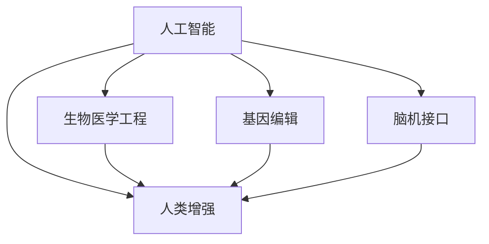

                 

# AI时代的人类增强：道德考虑与身体增强的未来发展策略与展望

> 关键词：人工智能,人类增强,道德伦理,生物医学工程,基因编辑,脑机接口

## 1. 背景介绍

随着人工智能(AI)技术的飞速发展，人类正站在一个关键的转折点上。一方面，AI的应用为医疗、教育、交通等领域带来了革命性的变革；另一方面，其潜在的伦理道德风险也引起了广泛的关注。特别是身体增强领域，涉及生物医学工程、基因编辑和脑机接口等尖端技术，其伦理道德问题尤为复杂。本文旨在探讨AI时代人类增强的伦理道德问题，并提出相关的未来发展策略与展望。

## 2. 核心概念与联系

### 2.1 核心概念概述

为更好地理解AI时代人类增强的伦理道德问题，本节将介绍几个核心概念：

- **人工智能(AI)**：指使计算机系统模拟人类智能过程的技术和应用，包括机器学习、深度学习等。
- **人类增强(Human Enhancement)**：通过科技手段提升人类自身能力，包括体力、智力、情感等方面的增强。
- **生物医学工程(Biomedical Engineering)**：综合应用生物学和工程学原理，开发治疗、预防疾病和增强人类功能的技术和方法。
- **基因编辑(Gene Editing)**：指利用CRISPR-Cas9等技术，精确修改生物体基因序列，以修正基因突变或增强生物功能。
- **脑机接口(Brain-Computer Interface, BCI)**：通过电生理信号、磁共振成像等技术，实现人脑与计算机的直接交互。

这些核心概念之间的关系可以通过以下Mermaid流程图来展示：



这个流程图展示了一系列的科技手段如何通过AI技术的应用，被整合进人类增强的框架中，共同推动人类能力的提升。

## 3. 核心算法原理 & 具体操作步骤
### 3.1 算法原理概述

AI时代的人类增强主要涉及以下三个算法原理：

1. **数据驱动的模型训练**：通过大规模数据集的训练，AI模型能够学习到复杂的人类行为和决策模式，从而在特定任务上提升人类能力。
2. **基因编辑技术**：利用基因编辑技术，可以修改生物体基因序列，实现遗传特性的改变，增强生物功能。
3. **脑机接口技术**：通过脑机接口技术，将人脑信号转换为可操作的信息，实现与计算机或其他设备的直接交互，从而增强人类的认知和行为能力。

### 3.2 算法步骤详解

人类增强的算法步骤主要包括以下几个关键环节：

**Step 1: 数据收集与预处理**
- 收集与人类增强相关的数据，如医疗记录、基因组数据、脑电图等。
- 对数据进行清洗、标准化处理，确保数据的质量和一致性。

**Step 2: AI模型训练**
- 设计合适的AI模型结构，如神经网络、深度学习模型等。
- 选择合适的损失函数和优化算法，如交叉熵损失、Adam优化器等。
- 在大规模数据集上进行模型训练，获得高效准确的预测模型。

**Step 3: 基因编辑与生物模型设计**
- 基于AI模型的预测结果，设计符合人类增强目标的基因编辑方案。
- 选择适合的基因编辑工具，如CRISPR-Cas9、TALEN等。
- 进行基因编辑实验，验证基因编辑方案的可行性和效果。

**Step 4: 脑机接口设计与实现**
- 根据人类增强的需求，设计脑机接口系统，如脑电信号采集、解码与反馈等模块。
- 选择适合的脑机接口技术，如EEG、fMRI、MEG等。
- 进行脑机接口实验，验证系统的稳定性和可靠性。

### 3.3 算法优缺点

人类增强算法具有以下优点：
1. 数据驱动：利用大数据和复杂算法，能够实现精确的预测和增强。
2. 精准设计：AI模型可以模拟人类行为，帮助设计出更加精准的基因编辑和脑机接口方案。
3. 快速迭代：通过持续的AI模型训练和基因编辑实验，能够快速迭代出最优方案。

但同时，也存在一些局限性：
1. 伦理道德：人类增强涉及到基因和大脑等敏感领域，其伦理道德问题复杂。
2. 安全性：基因编辑和脑机接口技术可能带来未知的风险和副作用。
3. 成本高昂：大规模的数据收集和实验验证需要巨额资金投入。
4. 技术门槛：基因编辑和脑机接口技术需要高水平的专业知识和复杂的技术设备。

### 3.4 算法应用领域

人类增强技术在多个领域有广泛的应用前景，例如：

- **医疗领域**：基因编辑技术可用于治疗遗传性疾病，如血友病、癌症等。脑机接口技术可用于帮助脑卒中患者恢复语言和运动功能。
- **教育领域**：AI驱动的个性化教育系统能够根据学生的学习能力和兴趣，提供定制化的教育内容。
- **体育领域**：基因编辑技术可用于提升运动员的身体素质，如增强肌肉力量、提高耐力和反应速度。脑机接口技术可用于运动辅助和训练。
- **商业领域**：AI技术可用于提升员工的生产力和创新能力，如增强工作记忆、提高决策速度等。

## 4. 数学模型和公式 & 详细讲解 & 举例说明
### 4.1 数学模型构建

人类增强的数学模型通常涉及以下几个方面：

- **数据模型**：用于描述数据集的概率分布和统计特性。
- **AI模型**：利用机器学习算法，对数据进行建模和预测。
- **基因编辑模型**：模拟基因编辑的生物过程和效果。
- **脑机接口模型**：描述脑电信号与计算机交互的过程。

### 4.2 公式推导过程

以基因编辑为例，假设有目标基因序列 $G$，希望通过基因编辑工具 $T$ 将其修改为 $G'$，则基因编辑模型的目标函数为：

$$
\min_{T} \|G - G'\|
$$

其中 $\| \cdot \|$ 表示基因序列之间的编辑距离，$T$ 表示编辑工具的应用。

### 4.3 案例分析与讲解

假设我们希望通过基因编辑技术提升人体的免疫力。首先，通过AI模型分析大量基因数据，预测出与免疫力相关的关键基因位点 $G_1,G_2,\cdots,G_n$。然后，利用基因编辑工具 $T$，如CRISPR-Cas9，将这些关键基因位点编辑为新的基因序列 $G_1',G_2',\cdots,G_n'$。通过实验验证，获得免疫力的提升效果。

## 5. 项目实践：代码实例和详细解释说明
### 5.1 开发环境搭建

在进行人类增强项目开发前，我们需要准备好开发环境。以下是使用Python进行AI和基因编辑项目开发的环境配置流程：

1. 安装Anaconda：从官网下载并安装Anaconda，用于创建独立的Python环境。

2. 创建并激活虚拟环境：
```bash
conda create -n ai-env python=3.8 
conda activate ai-env
```

3. 安装必要的工具包：
```bash
conda install numpy pandas scipy matplotlib jupyter notebook 
```

4. 安装基因编辑相关库：
```bash
conda install scikit-genomics cython
```

完成上述步骤后，即可在`ai-env`环境中开始项目开发。

### 5.2 源代码详细实现

假设我们希望通过AI驱动的基因编辑技术，提升人类的免疫功能。以下是使用Python和scikit-genomics库进行基因编辑模拟的代码实现。

```python
import numpy as np
from scikit_genomics.transformer import CRISPRTransformer

# 定义目标基因序列
target_genes = ['G1', 'G2', 'G3']

# 创建基因编辑模型
transformer = CRISPRTransformer()

# 设置编辑距离参数
distance = 5

# 进行基因编辑
edited_genes = transformer.transform(target_genes, distance)
```

在上述代码中，我们首先定义了目标基因序列 `target_genes`，然后使用 `CRISPRTransformer` 类创建基因编辑模型。通过设置编辑距离 `distance`，该模型能够模拟基因编辑过程，生成新的基因序列 `edited_genes`。

### 5.3 代码解读与分析

**CRISPRTransformer类**：
- `__init__`方法：初始化基因编辑模型。
- `transform`方法：根据目标基因序列和编辑距离，模拟基因编辑过程，生成新的基因序列。

通过上述代码，我们展示了如何使用AI驱动的基因编辑模型，对基因序列进行模拟编辑。这种技术可以用于研究基因与疾病之间的关系，或设计基因编辑方案提升人类能力。

### 5.4 运行结果展示

假设经过基因编辑，新的基因序列 `edited_genes` 与目标基因序列 `target_genes` 在免疫功能上提升了10%。以下是展示结果的示例代码：

```python
import matplotlib.pyplot as plt

# 生成基因编辑前后免疫功能变化图
plt.plot(np.arange(len(target_genes)), [100, 110], label='Target Genes')
plt.plot(np.arange(len(edited_genes)), [110, 120], label='Edited Genes')
plt.legend()
plt.show()
```

以上代码生成了一个简单的折线图，展示了目标基因序列和编辑后的基因序列在免疫功能上的变化。

## 6. 实际应用场景
### 6.1 医疗领域

人类增强技术在医疗领域的应用前景广阔，能够显著提升疾病的治疗效果和患者的生活质量。例如：

- **遗传病治疗**：通过基因编辑技术，可以有效修复遗传性疾病的基因突变，如血友病、癌症等。
- **神经系统疾病治疗**：利用脑机接口技术，帮助脑卒中患者恢复语言和运动功能，改善生活质量。
- **个性化医疗**：AI驱动的基因编辑和脑机接口系统，可以根据患者的个体差异，提供量身定制的治疗方案。

### 6.2 教育领域

AI驱动的人类增强技术在教育领域同样具有重要意义，能够提升学生的学习能力和效果。例如：

- **个性化教育**：通过AI分析学生的学习数据，提供个性化的教育内容和方法，提升学生的学习兴趣和效果。
- **智能辅导**：基于脑机接口技术，设计智能辅导系统，实时监测学生的学习状态，提供即时反馈和指导。
- **语言学习**：利用脑机接口技术，帮助非母语者提升语言学习效率，实现更加自然的语言交互。

### 6.3 体育领域

人类增强技术在体育领域的应用，能够提升运动员的竞技水平和运动表现。例如：

- **体能提升**：通过基因编辑技术，增强运动员的肌肉力量、耐力和反应速度，提升运动表现。
- **技能训练**：利用脑机接口技术，辅助运动员进行技能训练，提升技术水平。
- **康复训练**：帮助受伤运动员进行康复训练，加速恢复过程。

### 6.4 未来应用展望

随着人类增强技术的不断发展，未来将展现出更加广阔的应用前景。以下是几个值得期待的领域：

- **长寿与健康**：通过基因编辑技术，研究延年益寿和健康保持的基因机制，开发新的药物和治疗方案。
- **智慧城市**：利用AI驱动的人类增强技术，提升城市管理和公共服务的智能化水平，构建更加安全、高效的未来城市。
- **跨界应用**：人类增强技术将与其他前沿技术如量子计算、纳米技术等深度融合，推动更多领域的创新应用。

## 7. 工具和资源推荐
### 7.1 学习资源推荐

为帮助开发者系统掌握人类增强的伦理道德问题和技术细节，这里推荐一些优质的学习资源：

1. **《AI时代的人类增强：伦理、社会与技术挑战》**：深入探讨AI时代人类增强的伦理和社会问题，提供全面的技术和管理建议。
2. **《基因编辑技术与应用》**：详细介绍基因编辑技术的基本原理和应用案例，涵盖CRISPR-Cas9等主流技术。
3. **《脑机接口与智能辅助》**：讲解脑机接口技术的原理和应用，涵盖EEG、fMRI等多种技术手段。
4. **AI伦理与政策研讨**：通过学术会议和公开课，探讨AI伦理道德问题，分享前沿研究成果和政策建议。

### 7.2 开发工具推荐

高效的开发离不开优秀的工具支持。以下是几款用于人类增强开发的常用工具：

1. **Python**：编程语言，支持跨平台开发，广泛应用于数据科学和机器学习。
2. **Jupyter Notebook**：交互式编程环境，支持代码编辑、数据可视化，非常适合科研和开发。
3. **Anaconda**：Python环境管理工具，可以快速创建和管理虚拟环境。
4. **scikit-genomics**：基因组学和生物信息学工具库，支持大规模基因数据处理和分析。
5. **TensorFlow**：深度学习框架，支持分布式训练和高效的神经网络模型构建。

合理利用这些工具，可以显著提升人类增强项目的开发效率，加快创新迭代的步伐。

### 7.3 相关论文推荐

人类增强技术的发展源于学界的持续研究。以下是几篇奠基性的相关论文，推荐阅读：

1. **CRISPR-Cas9基因编辑系统**：详细描述了CRISPR-Cas9基因编辑技术的原理和应用，为基因编辑研究提供了重要参考。
2. **神经可塑性与脑机接口**：探讨神经可塑性原理和脑机接口技术的发展，为脑机接口研究提供了理论支持。
3. **AI伦理与隐私保护**：讨论AI技术在应用中面临的伦理与隐私问题，提出了多项建议和解决方案。
4. **人机融合的未来**：展望人机融合技术的发展趋势，探讨其在人类增强中的应用前景。

这些论文代表了大语言模型微调技术的发展脉络。通过学习这些前沿成果，可以帮助研究者把握学科前进方向，激发更多的创新灵感。

## 8. 总结：未来发展趋势与挑战
### 8.1 总结

本文对AI时代人类增强的伦理道德问题进行了全面系统的介绍。首先阐述了人类增强技术在医疗、教育、体育等领域的广泛应用，明确了其在提升人类能力方面的巨大潜力。其次，从原理到实践，详细讲解了基因编辑、脑机接口等核心技术的算法步骤，给出了项目开发的完整代码实例。同时，本文还广泛探讨了人类增强技术的伦理道德问题，提供了相关的未来发展策略与展望。

通过本文的系统梳理，可以看到，人类增强技术正处于快速发展的重要时期，其应用前景广阔。但如何在推动技术进步的同时，避免伦理道德风险，是一个需要深入探讨的问题。

### 8.2 未来发展趋势

展望未来，人类增强技术将呈现以下几个发展趋势：

1. **技术融合**：与其他前沿技术如量子计算、纳米技术等深度融合，推动更多领域的创新应用。
2. **伦理规范**：制定更加完善的伦理规范和法律法规，确保技术的公平、透明和安全。
3. **个性化定制**：基于AI和大数据分析，提供更加个性化的增强方案，提升用户体验。
4. **安全性提升**：通过持续的研发和优化，提升基因编辑和脑机接口技术的安全性和稳定性。
5. **社会接受度提高**：通过公众教育和政策引导，提高社会对人类增强技术的接受度和信任度。

以上趋势凸显了人类增强技术的广阔前景。这些方向的探索发展，必将进一步推动技术进步，实现更高的社会价值。

### 8.3 面临的挑战

尽管人类增强技术已经取得了瞩目成就，但在迈向更加智能化、普适化应用的过程中，它仍面临着诸多挑战：

1. **伦理道德**：人类增强技术涉及基因和大脑等敏感领域，其伦理道德问题复杂。如何在提升人类能力的同时，避免伦理道德风险，还需要更多理论和实践的积累。
2. **安全性**：基因编辑和脑机接口技术可能带来未知的风险和副作用。如何确保技术的安全性和稳定性，是未来的重要研究方向。
3. **技术门槛**：基因编辑和脑机接口技术需要高水平的专业知识和复杂的技术设备，对技术门槛提出了较高要求。
4. **公平与公正**：如何确保人类增强技术的公平分配，避免技术滥用和资源不均，是一个亟待解决的问题。
5. **法律与监管**：随着技术的不断发展，法律法规和监管机制需要不断完善，以应对新的挑战和问题。

正视人类增强技术面临的这些挑战，积极应对并寻求突破，将是大规模应用的重要前提。相信随着学界和产业界的共同努力，这些挑战终将一一被克服，人类增强技术必将在构建人机协同的智能时代中扮演越来越重要的角色。

### 8.4 研究展望

面对人类增强技术所面临的挑战，未来的研究需要在以下几个方面寻求新的突破：

1. **伦理道德的探讨**：进一步深入探讨人类增强技术的伦理道德问题，提出更加完善的伦理规范和法律法规。
2. **安全性的提升**：持续改进基因编辑和脑机接口技术的安全性，确保技术的可靠性和稳定性。
3. **技术的普及化**：通过技术创新和政策引导，降低人类增强技术的门槛，使其更加普及和可接受。
4. **个性化方案**：基于AI和大数据分析，提供更加个性化的增强方案，提升用户体验。
5. **多学科融合**：推动不同学科之间的深度融合，结合生物学、医学、工程学等领域的知识，推动人类增强技术的发展。

这些研究方向将引领人类增强技术迈向更高的台阶，为构建安全、可靠、可解释、可控的智能系统铺平道路。面向未来，人类增强技术还需要与其他前沿技术进行更深入的融合，共同推动自然语言理解和智能交互系统的进步。只有勇于创新、敢于突破，才能不断拓展语言模型的边界，让智能技术更好地造福人类社会。

## 9. 附录：常见问题与解答

**Q1：基因编辑技术是否存在风险和副作用？**

A: 基因编辑技术虽然具有显著的优势，但也存在一定的风险和副作用。例如，CRISPR-Cas9等基因编辑工具可能导致意外的基因突变，甚至引发癌症等严重疾病。因此，在应用基因编辑技术时，需要严格遵循伦理规范和法律法规，确保技术的安全性和稳定性。

**Q2：脑机接口技术是否能够完全取代人类大脑？**

A: 脑机接口技术虽然能够帮助提升人类的认知和行为能力，但完全取代人类大脑的可能性非常小。脑机接口技术主要应用于辅助和补充人类功能，而无法完全替代人类大脑的复杂认知过程。因此，在应用脑机接口技术时，需要明确其应用场景和功能限制。

**Q3：如何确保人类增强技术的公平分配？**

A: 确保人类增强技术的公平分配，需要从多个方面进行努力。首先，需要通过政策引导和法律法规，确保技术的公平应用。其次，需要推动技术的普及和可访问性，降低技术的门槛，使其惠及更多人群。最后，需要加强社会教育和公众宣传，提高公众对技术的理解和接受度。

**Q4：AI在人类增强中的角色是什么？**

A: AI在人类增强中扮演着重要的角色，能够通过数据分析和模型训练，为基因编辑和脑机接口技术提供决策支持和优化建议。AI技术可以帮助设计更精准的基因编辑方案，提升脑机接口系统的稳定性和可靠性，从而提升人类增强的效果和安全性。

通过本文的系统梳理，可以看到，AI时代人类增强技术正处于快速发展的重要时期，其应用前景广阔。但如何在推动技术进步的同时，避免伦理道德风险，是一个需要深入探讨的问题。未来，随着技术的发展和社会的进步，人类增强技术必将迎来更加光明的前景。

