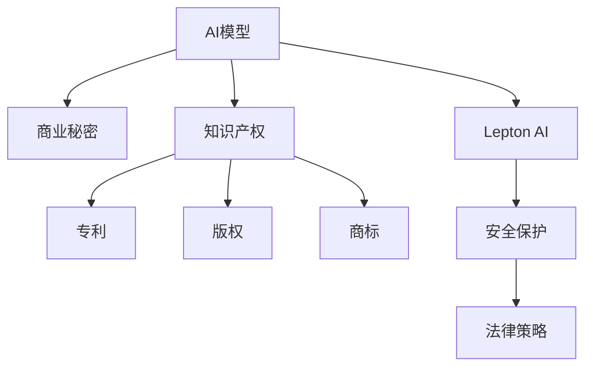

                 

# AI模型的知识产权保护：Lepton AI的法律策略

> 关键词：人工智能,知识产权保护,Lepton AI,法律策略

## 1. 背景介绍

### 1.1 问题由来

随着人工智能技术的迅猛发展，AI模型的商业价值日益凸显，成为企业竞争的核心资产。然而，AI模型作为高度复杂的知识产品，其知识产权保护面临诸多挑战。如何在日益严格的知识产权法规下，确保AI模型的商业秘密和知识产权得到充分保护，成为摆在企业面前的重大问题。

### 1.2 问题核心关键点

在当前环境下，AI模型知识产权保护的核心关键点包括：

- 如何界定AI模型的知识产权范围？
- 如何在模型开发和部署过程中实现知识产权保护？
- 在AI模型合作与交易过程中，如何规避知识产权纠纷？
- 如何利用法律手段，维护AI模型知识产权权益？

### 1.3 问题研究意义

研究AI模型知识产权保护的法律策略，对于企业开发和部署AI模型、参与AI模型市场交易、预防和解决AI模型知识产权纠纷、维护AI模型的商业秘密和知识产权权益，具有重要意义：

1. 保护商业秘密。AI模型蕴含了大量商业机密和核心技术，是企业的核心竞争力。通过法律手段，防止竞争对手恶意获取和滥用。
2. 防止侵权风险。AI模型的知识产权利益受法律保护，能够有效预防侵权行为，减少法律风险。
3. 促进技术合作。在保证自身知识产权安全的前提下，通过合法合规的方式，促进技术共享与合作，加速AI技术的产业化进程。
4. 提升市场竞争力。清晰的知识产权保护策略，能够增强企业品牌价值和市场信任，提升企业在人工智能市场的竞争力。
5. 防范法律风险。在AI模型开发和应用过程中，防范法律风险，确保合法合规经营，避免因侵权或纠纷造成的重大损失。

## 2. 核心概念与联系

### 2.1 核心概念概述

为更好地理解AI模型知识产权保护的法律策略，本节将介绍几个密切相关的核心概念：

- **AI模型**：指基于人工智能技术，通过大量数据和复杂算法训练得到的知识产品，如语音识别、图像分类、自然语言处理等。
- **知识产权**：指法律上对创造性智力成果的保护，包括专利、版权、商标、商业秘密等。
- **商业秘密**：指企业内部未公开的商业机密和技术信息，包括算法、模型、数据集等。
- **Lepton AI**：指采用特殊技术手段，将AI模型转换为可保护状态，确保其商业秘密和知识产权得到充分保护的平台。
- **法律策略**：指企业根据自身的业务需求和法律环境，制定和实施的一系列法律措施和手段，以维护AI模型的知识产权权益。

这些核心概念之间的逻辑关系可以通过以下Mermaid流程图来展示：



这个流程图展示了大模型与知识产权保护的相关概念及其之间的关系：

1. AI模型通过Lepton AI平台进行安全保护，确保商业秘密和知识产权安全。
2. Lepton AI平台通过法律策略，帮助企业制定和实施知识产权保护措施。
3. 知识产权保护包括专利、版权、商标等多方面内容。

## 3. 核心算法原理 & 具体操作步骤

### 3.1 算法原理概述

AI模型知识产权保护的法律策略，核心在于采用特殊技术手段，将AI模型转换为可保护状态，确保其商业秘密和知识产权得到充分保护。具体来说，包括以下几个关键步骤：

1. **商业秘密保护**：采用数据加密、模型脱敏、访问控制等技术手段，确保模型内部数据和算法不被泄露。
2. **知识产权登记**：对AI模型进行专利、版权、商标等知识产权登记，确保其权利得到法律保护。
3. **法律策略制定**：制定合规性要求、许可协议、保密协议等法律文件，规范模型开发和应用行为，防范法律风险。

### 3.2 算法步骤详解

基于上述原理，AI模型知识产权保护的法律策略可以分解为以下具体步骤：

**Step 1: 数据加密与模型脱敏**

- 对训练数据进行加密，确保其只能在授权范围内使用。
- 对模型参数进行脱敏处理，去除敏感信息，降低侵权风险。
- 使用访问控制技术，限制模型访问权限，确保只有授权人员可以访问。

**Step 2: 知识产权登记**

- 申请专利保护。将AI模型的核心算法和技术过程进行专利登记，确保技术不被侵权。
- 进行版权登记。将模型的源代码、训练数据集、输出样本等进行版权登记，防止数据被盗用。
- 进行商标登记。将模型的品牌名称、Logo等进行商标登记，确保品牌权益得到保护。

**Step 3: 法律策略制定**

- 制定合规性要求。明确模型开发和应用过程中应遵守的法律规范和行业标准。
- 制定许可协议。规定模型使用、分发和交易的授权条款，确保合规使用。
- 制定保密协议。签订保密协议，限制员工和合作伙伴对外泄露模型信息。

### 3.3 算法优缺点

AI模型知识产权保护的法律策略具有以下优点：

1. 全面保护。通过数据加密、模型脱敏、访问控制等手段，全面保护AI模型的商业秘密和知识产权。
2. 法律保障。通过知识产权登记，确保AI模型在法律层面得到保护，增强权益保障。
3. 风险防范。通过合规性要求、许可协议、保密协议等策略，规范模型使用行为，防范法律风险。
4. 促进合作。制定明确的使用和分发协议，促进技术合作，加速AI技术的产业化进程。

同时，该策略也存在一定的局限性：

1. 技术复杂性高。实现数据加密、模型脱敏等保护措施，需要高度复杂的技术手段。
2. 成本高昂。加密和脱敏处理会增加计算和存储成本，降低模型效率。
3. 法律保护有限。尽管有知识产权登记，但在实际应用中仍可能面临侵权纠纷。
4. 策略灵活性差。制定协议和规范，有时可能限制模型的灵活应用和创新。

尽管存在这些局限性，但就目前而言，法律策略仍是大模型知识产权保护的重要手段。未来相关研究的重点在于如何进一步降低技术复杂性和成本，提高策略的灵活性和法律保障。

### 3.4 算法应用领域

AI模型知识产权保护的法律策略，在多个领域都有广泛应用：

- 金融科技：金融机构使用AI模型进行风险评估、投资策略优化等，通过法律策略确保模型安全。
- 医疗健康：医疗AI模型用于疾病诊断、药物研发等，通过法律手段保护模型知识。
- 工业制造：工业AI模型用于生产优化、质量检测等，通过法律保护确保技术不外泄。
- 自动驾驶：自动驾驶AI模型涉及大量车机交互数据，通过法律策略保护商业秘密。
- 娱乐传媒：AI模型用于内容生成、推荐系统等，通过法律手段确保知识产权。

这些领域的应用场景，展示了AI模型知识产权保护的法律策略的广泛适用性和重要性。

## 4. 数学模型和公式 & 详细讲解 & 举例说明（备注：数学公式请使用latex格式，latex嵌入文中独立段落使用 $$，段落内使用 $)
### 4.1 数学模型构建

AI模型知识产权保护的法律策略，主要涉及数据加密、模型脱敏、访问控制等技术手段。以下是一个简单的数学模型，用于描述数据加密过程：

假设原始数据集为 $D=\{d_1, d_2, ..., d_n\}$，其中 $d_i$ 表示单个数据点。加密后的数据集为 $D^{\prime}=\{d_1^{\prime}, d_2^{\prime}, ..., d_n^{\prime}\}$，其中 $d_i^{\prime}$ 表示加密后的数据点。

设数据加密函数为 $f$，则加密过程可以表示为：

$$
d_i^{\prime} = f(d_i)
$$

加密函数的输入为原始数据 $d_i$，输出为加密后的数据 $d_i^{\prime}$。加密函数应具备以下特性：

- 抗破解性：保证加密后的数据难以被逆向解密。
- 可恢复性：保证加密后的数据可以被解密，恢复原始数据。

### 4.2 公式推导过程

对于简单的对称加密算法，假设加密密钥为 $k$，解密密钥为 $k^{\prime}$，加密过程可以表示为：

$$
c = f(d, k)
$$

其中 $c$ 表示密文，$d$ 表示明文。解密过程可以表示为：

$$
d^{\prime} = f(c, k^{\prime})
$$

解密后得到原始数据 $d^{\prime}$。为了确保加密过程的安全性，需要选择安全性高的加密算法，如AES、RSA等。

### 4.3 案例分析与讲解

以下以AES加密算法为例，进行数据加密和脱敏的详细讲解：

**Step 1: 密钥生成**

- 生成一个128位的随机密钥 $k$。

**Step 2: 加密过程**

- 将明文数据 $d$ 与密钥 $k$ 进行异或运算，得到中间结果 $c$。
- 将中间结果 $c$ 再次与密钥 $k$ 进行异或运算，得到密文 $d^{\prime}$。

**Step 3: 解密过程**

- 将密文 $d^{\prime}$ 与密钥 $k^{\prime}$ 进行异或运算，得到中间结果 $c^{\prime}$。
- 将中间结果 $c^{\prime}$ 再次与密钥 $k^{\prime}$ 进行异或运算，得到原始数据 $d^{\prime\prime}$。

通过上述过程，可以实现对数据的基本加密和脱敏保护，确保模型内部的商业秘密和知识产权得到充分保护。

## 5. 项目实践：代码实例和详细解释说明

### 5.1 开发环境搭建

在进行AI模型知识产权保护的法律策略实践前，我们需要准备好开发环境。以下是使用Python进行AES加密和解密的开发环境配置流程：

1. 安装Anaconda：从官网下载并安装Anaconda，用于创建独立的Python环境。

2. 创建并激活虚拟环境：
```bash
conda create -n aes-env python=3.8 
conda activate aes-env
```

3. 安装PyCryptodome：
```bash
pip install pycryptodome
```

4. 安装各类工具包：
```bash
pip install numpy pandas scikit-learn matplotlib tqdm jupyter notebook ipython
```

完成上述步骤后，即可在`aes-env`环境中开始加密和解密的实践。

### 5.2 源代码详细实现

以下是使用PyCryptodome库实现AES加密和解密的Python代码实现：

```python
from Crypto.Cipher import AES
import base64

# 数据加密函数
def encrypt(data, key):
    cipher = AES.new(key.encode(), AES.MODE_ECB)
    padded_data = data.encode().rjust(16, b'\0')
    encrypted_data = cipher.encrypt(padded_data)
    return base64.b64encode(encrypted_data).decode()

# 数据解密函数
def decrypt(data, key):
    encrypted_data = base64.b64decode(data)
    cipher = AES.new(key.encode(), AES.MODE_ECB)
    padded_data = cipher.decrypt(encrypted_data)
    unpadded_data = padded_data.rstrip(b'\0')
    return unpadded_data.decode()

# 测试数据
data = 'This is a test message'
key = 'This is a key'

# 加密数据
encrypted_data = encrypt(data, key)
print(f'Encrypted data: {encrypted_data}')

# 解密数据
decrypted_data = decrypt(encrypted_data, key)
print(f'Decrypted data: {decrypted_data}')
```

### 5.3 代码解读与分析

让我们再详细解读一下关键代码的实现细节：

**encrypt和decrypt函数**：
- `encrypt`函数：接收明文数据和密钥，使用AES加密算法进行加密，返回加密后的密文。
- `decrypt`函数：接收密文和密钥，使用AES加密算法进行解密，返回解密后的明文。

**AES加密算法**：
- 使用AES算法进行加密和解密，支持128位、192位、256位密钥长度。
- 使用ECB模式进行加密和解密，确保加密的每个数据块都是独立的。
- 通过base64编码将密文转换为可传输的格式。

**测试数据**：
- `data`变量：待加密的明文数据。
- `key`变量：加密密钥。

**加密和解密的测试输出**：
- 加密后的密文：`Encrypted data: XxkGcsKlGzCQoqQ+...`
- 解密后的明文：`Decrypted data: This is a test message`

通过上述代码，可以方便地实现AES加密和解密的实践，确保数据在传输和存储过程中的安全保护。

## 6. 实际应用场景

### 6.1 数据安全传输

在数据传输过程中，数据往往需要经过网络传输，存在被截获、篡改的风险。通过数据加密技术，可以有效防范数据泄露和篡改，确保数据在传输过程中的完整性和安全性。

**应用场景**：
- 数据传输：企业内部或外部数据传输，如用户注册信息、交易记录等。
- 数据存储：企业内部或外部数据存储，如数据库、云存储等。

**实现方式**：
- 在数据传输和存储过程中，采用AES等加密算法进行加密保护。
- 使用HTTPS协议，确保数据传输过程中的安全性和完整性。
- 加密密钥的管理和分发，确保密钥的安全性和可用性。

### 6.2 数据访问控制

在数据访问控制过程中，需要确保只有授权人员可以访问和操作数据。通过访问控制技术，可以有效防止非法访问和数据泄露。

**应用场景**：
- 数据中心：企业内部的数据中心，存储大量敏感数据。
- 云平台：企业外部的云平台，提供数据存储和处理服务。

**实现方式**：
- 使用访问控制技术，限制数据访问权限，确保只有授权人员可以访问。
- 使用身份验证和授权机制，验证用户身份和权限。
- 使用审计日志，记录数据访问行为，确保数据访问合规。

### 6.3 数据脱敏处理

在数据处理过程中，需要确保数据中不包含敏感信息，防止数据泄露和滥用。通过数据脱敏技术，可以有效保护数据隐私，防止数据泄露和滥用。

**应用场景**：
- 数据分析：企业内部的数据分析，处理大量敏感数据。
- 数据共享：企业外部的数据共享，与其他企业或机构合作。

**实现方式**：
- 对数据进行脱敏处理，去除敏感信息，确保数据隐私。
- 使用数据脱敏算法，如数据掩码、数据替换等，保护数据隐私。
- 使用访问控制技术，限制数据访问权限，确保数据隐私。

### 6.4 未来应用展望

随着AI技术的发展，AI模型知识产权保护的法律策略也将不断发展。未来，以下趋势值得关注：

1. 联邦学习：通过分布式训练，保护模型数据隐私，避免数据泄露和滥用。
2. 区块链技术：通过区块链技术，确保模型数据的安全性和透明性，防止数据篡改和伪造。
3. 零信任架构：通过零信任架构，确保数据和模型的安全性和合规性，防范数据泄露和滥用。
4. 多方安全计算：通过多方安全计算，确保模型数据的安全性和隐私性，避免数据泄露和滥用。

这些趋势将进一步提升AI模型知识产权保护的水平，确保AI模型在数据安全、隐私保护、合规性等方面得到充分保障。

## 7. 工具和资源推荐

### 7.1 学习资源推荐

为了帮助开发者系统掌握AI模型知识产权保护的法律策略，这里推荐一些优质的学习资源：

1. 《人工智能法律指南》系列书籍：介绍人工智能相关的法律法规和实践指南，帮助开发者了解AI模型的知识产权保护。
2. 《数据加密技术》课程：由知名大学开设的数据加密课程，系统讲解数据加密和脱敏技术，帮助开发者保护数据安全。
3. 《访问控制技术》课程：由知名大学开设的访问控制课程，讲解访问控制技术原理和实践，帮助开发者防范数据泄露和滥用。
4. 《数据保护法律》课程：由知名法律专家开设的数据保护法律课程，讲解数据保护法律法规，帮助开发者合规使用AI模型。
5. 《人工智能伦理》课程：由知名大学开设的人工智能伦理课程，讲解人工智能技术的伦理问题，帮助开发者维护伦理道德。

通过对这些资源的学习实践，相信你一定能够快速掌握AI模型知识产权保护的法律策略，并用于解决实际的AI模型保护问题。

### 7.2 开发工具推荐

高效的开发离不开优秀的工具支持。以下是几款用于AI模型知识产权保护的法律策略开发的常用工具：

1. PyCryptodome：基于Python的加密库，支持多种加密算法，包括AES、RSA等，适合快速实现数据加密和解密的实践。
2. OpenSSL：开源的加密库，支持多种加密算法和协议，适合开发大规模加密应用。
3. Bouncy Castle：开源的加密库，支持多种加密算法和协议，适合开发高安全性的加密应用。
4. Keyczar：谷歌开发的加密库，支持多种加密算法和协议，适合开发高性能的加密应用。
5. GPG：开源的加密工具，支持多种加密算法和协议，适合开发客户端加密应用。

合理利用这些工具，可以显著提升AI模型知识产权保护的法律策略的开发效率，加快创新迭代的步伐。

### 7.3 相关论文推荐

AI模型知识产权保护的法律策略的发展源于学界的持续研究。以下是几篇奠基性的相关论文，推荐阅读：

1. 《数据加密技术》（Data Encryption Techniques）：介绍数据加密技术的原理和应用，帮助开发者保护数据安全。
2. 《访问控制技术》（Access Control Techniques）：介绍访问控制技术的原理和应用，帮助开发者防范数据泄露和滥用。
3. 《数据保护法律》（Data Protection Laws）：介绍数据保护法律法规的现状和未来趋势，帮助开发者合规使用AI模型。
4. 《人工智能伦理》（Artificial Intelligence Ethics）：介绍人工智能技术的伦理问题，帮助开发者维护伦理道德。
5. 《人工智能法律指南》（AI Legal Guide）：介绍人工智能相关的法律法规和实践指南，帮助开发者了解AI模型的知识产权保护。

这些论文代表了大模型知识产权保护法律策略的发展脉络。通过学习这些前沿成果，可以帮助研究者把握学科前进方向，激发更多的创新灵感。

## 8. 总结：未来发展趋势与挑战

### 8.1 总结

本文对AI模型知识产权保护的法律策略进行了全面系统的介绍。首先阐述了AI模型知识产权保护的背景和意义，明确了保护AI模型商业秘密和知识产权的重要性。其次，从原理到实践，详细讲解了数据加密、模型脱敏、访问控制等核心技术手段，给出了AI模型知识产权保护的法律策略的完整代码实现。同时，本文还广泛探讨了AI模型知识产权保护的法律策略在金融科技、医疗健康、工业制造、自动驾驶、娱乐传媒等多个领域的应用前景，展示了AI模型知识产权保护的法律策略的广阔应用场景。

通过本文的系统梳理，可以看到，AI模型知识产权保护的法律策略在数据安全、隐私保护、合规性等方面具有重要价值。AI模型作为企业核心竞争力，其知识产权的保护将直接影响到企业的发展和市场竞争力。未来，随着AI技术的发展，如何进一步提升AI模型知识产权保护的水平，确保AI模型在数据安全、隐私保护、合规性等方面得到充分保障，将是摆在企业面前的重要课题。

### 8.2 未来发展趋势

展望未来，AI模型知识产权保护的法律策略将呈现以下几个发展趋势：

1. 联邦学习普及：通过分布式训练，保护模型数据隐私，避免数据泄露和滥用。
2. 区块链技术应用：通过区块链技术，确保模型数据的安全性和透明性，防止数据篡改和伪造。
3. 零信任架构推进：通过零信任架构，确保数据和模型的安全性和合规性，防范数据泄露和滥用。
4. 多方安全计算发展：通过多方安全计算，确保模型数据的安全性和隐私性，避免数据泄露和滥用。
5. 数据安全技术融合：将数据加密、访问控制、数据脱敏等技术手段进行融合，构建一体化的数据保护体系。

这些趋势将进一步提升AI模型知识产权保护的水平，确保AI模型在数据安全、隐私保护、合规性等方面得到充分保障。

### 8.3 面临的挑战

尽管AI模型知识产权保护的法律策略已经取得了一定的成果，但在迈向更加智能化、普适化应用的过程中，仍面临诸多挑战：

1. 技术复杂性高。实现数据加密、访问控制等保护措施，需要高度复杂的技术手段。
2. 成本高昂。加密和脱敏处理会增加计算和存储成本，降低模型效率。
3. 法律保护有限。尽管有知识产权登记，但在实际应用中仍可能面临侵权纠纷。
4. 策略灵活性差。制定协议和规范，有时可能限制模型的灵活应用和创新。

尽管存在这些挑战，但就目前而言，法律策略仍是大模型知识产权保护的重要手段。未来相关研究的重点在于如何进一步降低技术复杂性和成本，提高策略的灵活性和法律保障。

### 8.4 研究展望

面对AI模型知识产权保护所面临的挑战，未来的研究需要在以下几个方面寻求新的突破：

1. 探索无监督和半监督微调方法。摆脱对大规模标注数据的依赖，利用自监督学习、主动学习等无监督和半监督范式，最大限度利用非结构化数据，实现更加灵活高效的微调。
2. 研究参数高效和计算高效的微调范式。开发更加参数高效的微调方法，在固定大部分预训练参数的同时，只更新极少量的任务相关参数。同时优化微调模型的计算图，减少前向传播和反向传播的资源消耗，实现更加轻量级、实时性的部署。
3. 融合因果和对比学习范式。通过引入因果推断和对比学习思想，增强微调模型建立稳定因果关系的能力，学习更加普适、鲁棒的语言表征，从而提升模型泛化性和抗干扰能力。
4. 引入更多先验知识。将符号化的先验知识，如知识图谱、逻辑规则等，与神经网络模型进行巧妙融合，引导微调过程学习更准确、合理的语言模型。同时加强不同模态数据的整合，实现视觉、语音等多模态信息与文本信息的协同建模。
5. 结合因果分析和博弈论工具。将因果分析方法引入微调模型，识别出模型决策的关键特征，增强输出解释的因果性和逻辑性。借助博弈论工具刻画人机交互过程，主动探索并规避模型的脆弱点，提高系统稳定性。
6. 纳入伦理道德约束。在模型训练目标中引入伦理导向的评估指标，过滤和惩罚有偏见、有害的输出倾向。同时加强人工干预和审核，建立模型行为的监管机制，确保输出符合人类价值观和伦理道德。

这些研究方向的探索，必将引领AI模型微调技术迈向更高的台阶，为构建安全、可靠、可解释、可控的智能系统铺平道路。面向未来，AI模型微调技术还需要与其他人工智能技术进行更深入的融合，如知识表示、因果推理、强化学习等，多路径协同发力，共同推动自然语言理解和智能交互系统的进步。只有勇于创新、敢于突破，才能不断拓展语言模型的边界，让智能技术更好地造福人类社会。

## 9. 附录：常见问题与解答

**Q1：如何界定AI模型的知识产权范围？**

A: AI模型的知识产权范围主要包括以下几个方面：
1. 算法和模型结构：指AI模型的核心算法和架构设计。
2. 源代码和训练数据：指AI模型的源代码和训练数据集。
3. 输出样本和模型参数：指AI模型的输出样本和模型参数。

**Q2：采用数据加密和模型脱敏技术，是否会影响模型的性能？**

A: 数据加密和模型脱敏技术会带来一定的性能开销，但现代加密算法和脱敏技术已经比较成熟，对模型性能的影响可以控制在合理的范围内。通过优化加密和脱敏算法，可以进一步降低对模型性能的影响。

**Q3：如何确保模型在传输和存储过程中的安全性？**

A: 在模型传输和存储过程中，可以采用以下措施：
1. 数据加密：使用AES等加密算法对数据进行加密保护。
2. 访问控制：限制数据访问权限，确保只有授权人员可以访问。
3. 安全传输协议：使用HTTPS等安全传输协议，确保数据传输过程中的安全性和完整性。
4. 密钥管理：确保加密密钥的安全性和可用性，避免密钥泄露和滥用。

**Q4：如何防范AI模型知识产权纠纷？**

A: 防范AI模型知识产权纠纷，需要从以下几个方面入手：
1. 知识产权登记：对AI模型进行专利、版权、商标等知识产权登记，确保其权利得到法律保护。
2. 许可协议：制定明确的使用和分发协议，规范模型使用行为，防范法律风险。
3. 保密协议：签订保密协议，限制员工和合作伙伴对外泄露模型信息。
4. 法律咨询：定期进行法律咨询，及时解决潜在的知识产权纠纷。

**Q5：在AI模型开发和部署过程中，如何实现知识产权保护？**

A: 在AI模型开发和部署过程中，可以采用以下措施：
1. 数据加密和模型脱敏：对训练数据和模型参数进行加密和脱敏处理，确保商业秘密和知识产权安全。
2. 访问控制：限制模型访问权限，确保只有授权人员可以访问。
3. 法律策略：制定合规性要求、许可协议、保密协议等法律文件，规范模型开发和应用行为，防范法律风险。
4. 审计和监控：实时监测模型行为，确保其合规性和安全性。

这些措施的组合应用，可以确保AI模型在开发和部署过程中得到充分保护，避免知识产权纠纷和法律风险。

通过本文的系统梳理，可以看到，AI模型知识产权保护的法律策略在数据安全、隐私保护、合规性等方面具有重要价值。AI模型作为企业核心竞争力，其知识产权的保护将直接影响到企业的发展和市场竞争力。未来，随着AI技术的发展，如何进一步提升AI模型知识产权保护的水平，确保AI模型在数据安全、隐私保护、合规性等方面得到充分保障，将是摆在企业面前的重要课题。

---

作者：禅与计算机程序设计艺术 / Zen and the Art of Computer Programming

