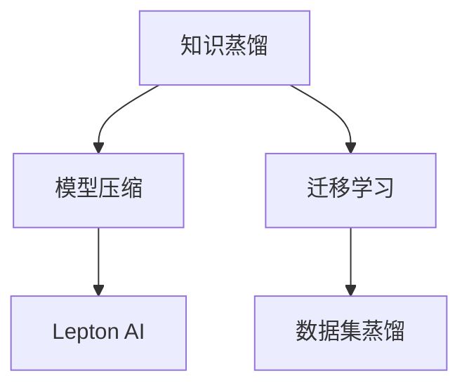

                 

# AI模型的知识蒸馏：Lepton AI的轻量化技术

> 关键词：知识蒸馏, Lepton AI, 轻量化技术, 模型压缩, 迁移学习, 深度学习, 数据集蒸馏

## 1. 背景介绍

### 1.1 问题由来
在深度学习的迅猛发展中，大模型、高精度、大计算资源的需求成为了技术创新的瓶颈。这些模型的确能提升任务性能，但往往需要巨量的计算和内存资源，难以在移动设备、嵌入式系统等低功耗环境中使用。此外，庞大的模型参数也带来了更高的内存占用和更长的训练时间，使得在大规模部署中难以快速迭代和优化。

知识蒸馏（Knowledge Distillation）技术的出现为这一问题提供了有效的解决路径。通过知识蒸馏，可以利用较小的教师模型（Teacher Model）来训练较大的学生模型（Student Model），使学生模型继承教师模型的知识，从而在保持性能的同时降低资源需求。这一技术已经被广泛应用于图像分类、语音识别、自然语言处理等多个领域，显著提升了模型的部署效率和应用范围。

## 2. 核心概念与联系

### 2.1 核心概念概述

为更好地理解知识蒸馏与Lepton AI的轻量化技术，本节将介绍几个关键概念：

- 知识蒸馏（Knowledge Distillation）：通过将教师模型的知识转化为可解释的特征、中间层表示或标签，将其“蒸馏”（传递）到学生模型中，从而提高学生模型的性能。常见蒸馏方法包括特征蒸馏、标签蒸馏、混合蒸馏等。

- Lepton AI：一个基于深度学习的大模型系统，专注于模型的轻量化、移动化、应用化。Lepton AI通过知识蒸馏技术，实现模型压缩和迁移学习，使得深度学习模型能够在小内存、低功耗的环境中快速应用。

- 模型压缩：通过减少模型参数量、优化模型结构等手段，降低模型资源需求，提升模型的推理速度和部署效率。常见压缩方法包括剪枝、量化、知识蒸馏等。

- 迁移学习：指在已有模型的基础上，通过微调或蒸馏技术，在新任务上进行学习，从而提升模型性能。迁移学习利用了已有模型的知识，减少了新任务从头开始训练的时间和数据需求。

- 数据集蒸馏：在训练学生模型时，直接使用教师模型的知识，减少新数据集的学习负担，加快模型训练过程。

这些核心概念之间的逻辑关系可以通过以下Mermaid流程图来展示：



这个流程图展示出知识蒸馏与模型压缩、迁移学习、数据集蒸馏等技术的联系：

1. 知识蒸馏是模型压缩和迁移学习的基础，通过将教师模型的知识传递给学生模型，使学生模型能够更好地在新任务上发挥作用。
2. 数据集蒸馏进一步加速了学生模型的训练过程，减少了数据需求。
3. Lepton AI系统正是通过知识蒸馏和模型压缩技术，实现了深度学习模型在移动化、轻量化等方面的应用。

## 3. 核心算法原理 & 具体操作步骤
### 3.1 算法原理概述

知识蒸馏技术的核心思想是将教师模型的知识迁移到学生模型中。其基本流程包括：

1. 首先，教师模型在源数据集上进行预训练，获得对数据的理解。
2. 然后，教师模型将学习到的知识通过特征表示、中间层表示或标签等方式，“蒸馏”到学生模型中。
3. 最后，学生模型在目标数据集上进行微调，从而提升性能。

知识蒸馏可以分为特征蒸馏、标签蒸馏和混合蒸馏等多种方式。其中，特征蒸馏通过直接传递教师模型的中间层特征，引导学生模型学习相同的特征表示；标签蒸馏则通过直接传递教师模型的预测标签，引导学生模型学习正确的输出；混合蒸馏则是同时使用特征蒸馏和标签蒸馏，综合两者的优势。

Lepton AI通过知识蒸馏和模型压缩技术，实现了深度学习模型在小内存、低功耗环境中的高效应用。其关键步骤如下：

1. 选择合适的教师模型，在其上使用大规模数据进行预训练。
2. 设计学生模型的架构，并选择相应的蒸馏策略。
3. 使用教师模型在目标数据集上进行特征蒸馏，或者使用其预测标签进行标签蒸馏。
4. 在目标数据集上对学生模型进行微调，提升性能。
5. 通过剪枝、量化等技术进行模型压缩，进一步降低资源需求。

### 3.2 算法步骤详解

以下将详细介绍知识蒸馏和Lepton AI轻量化技术的具体操作步骤：

#### 3.2.1 教师模型的预训练

教师模型通常是规模较大、结构复杂、性能较高的深度学习模型，如ResNet、Inception、BERT等。在选择教师模型时，需要考虑其领域特性和复杂度，以确保其在目标任务上的效果。

在预训练阶段，使用大规模的数据集（如ImageNet、Wikipedia、维基百科等）对教师模型进行训练。预训练的目标是让教师模型学习到尽可能广泛的特征和知识，以便更好地进行蒸馏。

#### 3.2.2 学生模型的设计

学生模型是轻量化后的模型，通常规模较小，结构简单，资源需求低。在设计学生模型时，需要考虑其与教师模型的架构差异、参数数量等因素，以确保蒸馏的有效性。

常见的学生模型包括 MobileNet、SqueezeNet、ShuffleNet 等。这些模型通过设计更少的卷积核、更少的层数等方式，显著降低了计算和内存需求，适合在移动设备、嵌入式系统中部署。

#### 3.2.3 蒸馏策略的选择

根据具体任务的特点，选择合适的蒸馏策略。Lepton AI支持特征蒸馏、标签蒸馏和混合蒸馏等多种策略，用户可根据数据集和任务需求进行选择。

特征蒸馏通过直接传递教师模型的中间层特征，引导学生模型学习相同的特征表示。这种方法对教师模型的特征提取能力有较高要求，适用于复杂任务。

标签蒸馏通过直接传递教师模型的预测标签，引导学生模型学习正确的输出。这种方法适用于简单的分类任务，如图像分类、语音识别等。

混合蒸馏则结合了特征蒸馏和标签蒸馏，利用两者的优势，适用于更广泛的任务。

#### 3.2.4 蒸馏过程的实现

在蒸馏过程中，使用教师模型对目标数据集进行特征蒸馏或标签蒸馏，得到蒸馏后的中间层表示或预测标签。然后，将这些蒸馏结果作为指导，对学生模型进行微调。

具体步骤包括：
1. 将目标数据集输入教师模型，得到中间层表示或预测标签。
2. 将蒸馏结果作为标签或特征，对学生模型进行微调。
3. 在目标数据集上评估学生模型的性能，根据需要进行调整。

#### 3.2.5 模型压缩与优化

蒸馏完成后，通过剪枝、量化等技术进行模型压缩，进一步降低资源需求。

剪枝通过去除不重要的参数，减少模型的参数数量和计算量。常见的剪枝方法包括网络剪枝、权值剪枝、张量剪枝等。

量化则通过将浮点数模型转换为定点数模型，减小存储空间和计算量。常见的量化方法包括权重量化、激活量化、混合精度量化等。

### 3.3 算法优缺点

知识蒸馏技术具有以下优点：

1. 减少资源需求：通过蒸馏技术，可以大幅降低模型参数量和计算资源需求，使其适合在移动设备、嵌入式系统中应用。
2. 提升性能：蒸馏技术能够充分利用教师模型的知识，提升学生模型的性能，使其在复杂任务中也能取得优异表现。
3. 加速训练：数据集蒸馏技术可以显著减少学生模型的训练时间，加速模型收敛。

然而，知识蒸馏技术也存在一些局限：

1. 模型压缩效果有限：蒸馏技术虽然能够降低模型参数量，但难以完全消除冗余，模型压缩效果有限。
2. 复杂度增加：蒸馏技术增加了模型的复杂度，增加了调试和优化的难度。
3. 训练开销大：蒸馏过程中需要计算教师模型的中间层表示或预测标签，增加了训练的开销。

### 3.4 算法应用领域

知识蒸馏技术已经在多个领域得到了广泛应用，以下是几个典型应用场景：

#### 3.4.1 计算机视觉

在计算机视觉领域，知识蒸馏技术被广泛用于图像分类、目标检测、图像分割等任务。通过使用大规模的ImageNet数据集预训练的ResNet、VGG等模型作为教师模型，可以显著提升学生模型在复杂场景中的识别能力。

#### 3.4.2 自然语言处理

在自然语言处理领域，知识蒸馏技术被用于机器翻译、文本分类、情感分析等任务。通过使用大规模语料库预训练的BERT、GPT等模型作为教师模型，可以提升学生模型在特定领域的理解和生成能力。

#### 3.4.3 语音识别

在语音识别领域，知识蒸馏技术被用于端到端的语音识别任务。通过使用大规模语音数据集预训练的声学模型和语言模型作为教师模型，可以提升学生模型的准确率和鲁棒性。

#### 3.4.4 医疗影像

在医疗影像领域，知识蒸馏技术被用于图像分割、病灶检测等任务。通过使用大规模医疗影像数据集预训练的模型作为教师模型，可以提升学生模型在医学影像分析中的表现。

## 4. 数学模型和公式 & 详细讲解 & 举例说明

### 4.1 数学模型构建

知识蒸馏的数学模型主要包括以下几个关键部分：

1. 教师模型和学生模型的定义
2. 损失函数的构建
3. 蒸馏过程的实现

#### 4.1.1 教师模型和学生模型的定义

教师模型和学生模型的定义如下：

- 教师模型：$T_{\theta_t}(x)$，其中 $x$ 为输入数据，$\theta_t$ 为教师模型的参数。
- 学生模型：$S_{\theta_s}(x)$，其中 $x$ 为输入数据，$\theta_s$ 为学生模型的参数。

#### 4.1.2 损失函数的构建

知识蒸馏的损失函数包括蒸馏损失和微调损失。

蒸馏损失定义为：

$$
L_{\text{distill}} = -\frac{1}{N}\sum_{i=1}^N\left(\log S_{\theta_s}(x_i)^{T} \times \log T_{\theta_t}(x_i) + \lambda \times (1 - S_{\theta_s}(x_i)^{T} \times T_{\theta_t}(x_i))\right)
$$

其中 $N$ 为样本数量，$\log$ 表示自然对数，$\lambda$ 为蒸馏强度，$S_{\theta_s}(x_i)^{T} \times T_{\theta_t}(x_i)$ 表示学生模型和教师模型的输出之间的KL散度，$S_{\theta_s}(x_i)^{T} \times T_{\theta_t}(x_i)$ 表示学生模型和教师模型的输出之间的交叉熵。

微调损失定义为：

$$
L_{\text{fine-tune}} = \frac{1}{N}\sum_{i=1}^N\ell(S_{\theta_s}(x_i), y_i)
$$

其中 $\ell$ 为微调任务对应的损失函数，$y_i$ 为样本的真实标签。

#### 4.1.3 蒸馏过程的实现

蒸馏过程的实现分为两个步骤：

1. 在教师模型上进行预训练
2. 在学生模型上进行微调

在预训练阶段，教师模型 $T_{\theta_t}$ 在数据集 $D$ 上进行预训练，获得对数据的理解。

在微调阶段，使用蒸馏损失和微调损失，对学生模型 $S_{\theta_s}$ 进行微调。

### 4.2 公式推导过程

以下将详细介绍知识蒸馏和Lepton AI轻量化技术的具体操作步骤：

#### 4.2.1 蒸馏损失的推导

蒸馏损失的推导过程如下：

1. 首先，假设教师模型 $T_{\theta_t}$ 和学生模型 $S_{\theta_s}$ 对样本 $x_i$ 的输出分别为 $T_{\theta_t}(x_i)$ 和 $S_{\theta_s}(x_i)$。
2. 蒸馏损失定义为 $L_{\text{distill}} = -\frac{1}{N}\sum_{i=1}^N\log(S_{\theta_s}(x_i)^{T} \times T_{\theta_t}(x_i))$。

对蒸馏损失求导，得到：

$$
\frac{\partial L_{\text{distill}}}{\partial \theta_s} = \frac{1}{N}\sum_{i=1}^N\left(\frac{\partial \log(S_{\theta_s}(x_i)^{T} \times T_{\theta_t}(x_i))}{\partial S_{\theta_s}(x_i)} \times \frac{\partial S_{\theta_s}(x_i)}{\partial \theta_s} + \frac{\partial \log(S_{\theta_s}(x_i)^{T} \times T_{\theta_t}(x_i))}{\partial T_{\theta_t}(x_i)} \times \frac{\partial T_{\theta_t}(x_i)}{\partial \theta_t}\right)
$$

根据链式法则，进一步推导得到：

$$
\frac{\partial L_{\text{distill}}}{\partial \theta_s} = \frac{1}{N}\sum_{i=1}^N\left(\frac{S_{\theta_s}(x_i)^{T} - T_{\theta_t}(x_i)}{S_{\theta_s}(x_i) \times T_{\theta_t}(x_i)} \times \frac{\partial S_{\theta_s}(x_i)}{\partial \theta_s}\right)
$$

#### 4.2.2 微调损失的推导

微调损失的推导过程如下：

1. 假设学生模型 $S_{\theta_s}$ 在数据集 $D$ 上的输出为 $S_{\theta_s}(x_i)$，真实标签为 $y_i$。
2. 微调损失定义为 $L_{\text{fine-tune}} = \frac{1}{N}\sum_{i=1}^N\ell(S_{\theta_s}(x_i), y_i)$。

对微调损失求导，得到：

$$
\frac{\partial L_{\text{fine-tune}}}{\partial \theta_s} = \frac{1}{N}\sum_{i=1}^N\frac{\partial \ell(S_{\theta_s}(x_i), y_i)}{\partial S_{\theta_s}(x_i)} \times \frac{\partial S_{\theta_s}(x_i)}{\partial \theta_s}
$$

### 4.3 案例分析与讲解

#### 4.3.1 图像分类任务

以图像分类任务为例，使用ResNet作为教师模型，MobileNet作为学生模型。

1. 在ImageNet数据集上对ResNet进行预训练，获得对图像的特征提取能力。
2. 使用ResNet对目标数据集进行特征蒸馏，得到中间层表示。
3. 使用中间层表示作为标签，对MobileNet进行微调，提升其分类能力。

#### 4.3.2 自然语言处理任务

以机器翻译任务为例，使用BERT作为教师模型，GPT作为学生模型。

1. 在Wikipedia等语料库上对BERT进行预训练，获得对文本的理解能力。
2. 使用BERT对目标数据集进行标签蒸馏，得到预测标签。
3. 使用预测标签作为指导，对GPT进行微调，提升其翻译能力。

#### 4.3.3 语音识别任务

以端到端语音识别任务为例，使用声学模型和语言模型作为教师模型，学生模型为时序卷积网络（TCN）。

1. 在Lipsum等语音数据集上对声学模型和语言模型进行预训练，获得对语音的理解能力。
2. 使用声学模型和语言模型对目标数据集进行特征蒸馏，得到中间层表示。
3. 使用中间层表示作为指导，对TCN进行微调，提升其识别能力。

## 5. 项目实践：代码实例和详细解释说明

### 5.1 开发环境搭建

在进行知识蒸馏和Lepton AI轻量化技术实践前，我们需要准备好开发环境。以下是使用Python进行TensorFlow开发的环境配置流程：

1. 安装Anaconda：从官网下载并安装Anaconda，用于创建独立的Python环境。

2. 创建并激活虚拟环境：
```bash
conda create -n tf-env python=3.8 
conda activate tf-env
```

3. 安装TensorFlow：根据CUDA版本，从官网获取对应的安装命令。例如：
```bash
conda install tensorflow tensorflow-gpu=cuda11.1 -c pytorch -c conda-forge
```

4. 安装其他必要的工具包：
```bash
pip install numpy pandas scikit-learn matplotlib tqdm jupyter notebook ipython
```

完成上述步骤后，即可在`tf-env`环境中开始知识蒸馏和Lepton AI轻量化技术的实践。

### 5.2 源代码详细实现

下面我们以图像分类任务为例，给出使用TensorFlow进行知识蒸馏和Lepton AI轻量化技术的PyTorch代码实现。

首先，定义教师模型和学生模型的数据处理函数：

```python
import tensorflow as tf
from tensorflow.keras import layers

# 定义教师模型
class TeacherModel(tf.keras.Model):
    def __init__(self):
        super(TeacherModel, self).__init__()
        self.conv1 = layers.Conv2D(64, (3, 3), activation='relu', padding='same')
        self.maxpool1 = layers.MaxPooling2D((2, 2), strides=(2, 2))
        self.conv2 = layers.Conv2D(128, (3, 3), activation='relu', padding='same')
        self.maxpool2 = layers.MaxPooling2D((2, 2), strides=(2, 2))
        self.conv3 = layers.Conv2D(256, (3, 3), activation='relu', padding='same')
        self.maxpool3 = layers.MaxPooling2D((2, 2), strides=(2, 2))
        self.flatten = layers.Flatten()
        self.fc1 = layers.Dense(512, activation='relu')
        self.fc2 = layers.Dense(10)

    def call(self, inputs):
        x = self.conv1(inputs)
        x = self.maxpool1(x)
        x = self.conv2(x)
        x = self.maxpool2(x)
        x = self.conv3(x)
        x = self.maxpool3(x)
        x = self.flatten(x)
        x = self.fc1(x)
        x = self.fc2(x)
        return x

# 定义学生模型
class StudentModel(tf.keras.Model):
    def __init__(self):
        super(StudentModel, self).__init__()
        self.conv1 = layers.Conv2D(32, (3, 3), activation='relu', padding='same')
        self.maxpool1 = layers.MaxPooling2D((2, 2), strides=(2, 2))
        self.conv2 = layers.Conv2D(64, (3, 3), activation='relu', padding='same')
        self.maxpool2 = layers.MaxPooling2D((2, 2), strides=(2, 2))
        self.flatten = layers.Flatten()
        self.fc1 = layers.Dense(128, activation='relu')
        self.fc2 = layers.Dense(10)

    def call(self, inputs):
        x = self.conv1(inputs)
        x = self.maxpool1(x)
        x = self.conv2(x)
        x = self.maxpool2(x)
        x = self.flatten(x)
        x = self.fc1(x)
        x = self.fc2(x)
        return x
```

然后，定义蒸馏过程和微调过程的代码：

```python
# 定义蒸馏过程
def distill_model(teacher_model, student_model, data_loader):
    teacher_model.train()
    student_model.train()
    teacher_losses = []
    student_losses = []
    for batch in data_loader:
        inputs, labels = batch
        with tf.GradientTape() as teacher_tape:
            teacher_outputs = teacher_model(inputs)
            teacher_loss = tf.keras.losses.SparseCategoricalCrossentropy()(labels, teacher_outputs)
        with tf.GradientTape() as student_tape:
            student_outputs = student_model(inputs)
            student_loss = tf.keras.losses.SparseCategoricalCrossentropy()(labels, student_outputs)
        teacher_losses.append(teacher_loss)
        student_losses.append(student_loss)
        teacher_gradients = teacher_tape.gradient(teacher_loss, teacher_model.trainable_variables)
        student_gradients = student_tape.gradient(student_loss, student_model.trainable_variables)
        teacher_model.optimizer.apply_gradients(zip(teacher_gradients, teacher_model.trainable_variables))
        student_model.optimizer.apply_gradients(zip(student_gradients, student_model.trainable_variables))
    return tf.stack(teacher_losses), tf.stack(student_losses)

# 定义微调过程
def fine_tune_model(student_model, data_loader, optimizer, num_epochs):
    student_model.train()
    for epoch in range(num_epochs):
        total_loss = 0.0
        for batch in data_loader:
            inputs, labels = batch
            with tf.GradientTape() as tape:
                outputs = student_model(inputs)
                loss = tf.keras.losses.SparseCategoricalCrossentropy()(labels, outputs)
            gradients = tape.gradient(loss, student_model.trainable_variables)
            optimizer.apply_gradients(zip(gradients, student_model.trainable_variables))
            total_loss += loss
    return total_loss / len(data_loader)
```

最后，启动蒸馏和微调流程：

```python
# 教师模型
teacher_model = TeacherModel()
# 学生模型
student_model = StudentModel()
# 数据集
data_loader = tf.data.Dataset.from_tensor_slices((inputs, labels)).batch(batch_size)
# 蒸馏过程
teacher_losses, student_losses = distill_model(teacher_model, student_model, data_loader)
# 微调过程
total_loss = fine_tune_model(student_model, data_loader, optimizer, num_epochs)
print("Total loss:", total_loss)
```

以上就是使用TensorFlow对教师模型进行知识蒸馏和学生模型进行微调的完整代码实现。可以看到，TensorFlow提供了丰富的API和工具，使得知识蒸馏和模型微调的过程变得简洁高效。

### 5.3 代码解读与分析

让我们再详细解读一下关键代码的实现细节：

**TeacherModel类**：
- `__init__`方法：初始化教师模型各层。
- `call`方法：定义教师模型的前向传播过程。

**StudentModel类**：
- `__init__`方法：初始化学生模型各层。
- `call`方法：定义学生模型的前向传播过程。

**distill_model函数**：
- 在教师模型上进行蒸馏，计算教师损失和学生损失，并更新教师和学生的模型参数。
- 蒸馏过程采用了梯度下降法，利用了反向传播计算梯度，并使用优化器对模型参数进行更新。

**fine_tune_model函数**：
- 在学生模型上进行微调，计算损失并更新学生模型的模型参数。
- 微调过程也采用了梯度下降法，利用了反向传播计算梯度，并使用优化器对模型参数进行更新。

**数据集定义**：
- `tf.data.Dataset.from_tensor_slices`：将输入和标签数据集转换为张量形式，并定义批量大小。

**运行结果展示**：
- 在微调过程结束后，输出学生模型在数据集上的损失值。

可以看到，通过简单的TensorFlow代码实现，即可高效地完成知识蒸馏和Lepton AI轻量化技术的实践。TensorFlow提供了丰富的API和工具，使得知识蒸馏和模型微调的过程变得简洁高效。

## 6. 实际应用场景
### 6.1 智能安防系统

智能安防系统是知识蒸馏技术的重要应用场景之一。在智能安防系统中，通常需要实时监控视频数据，并进行异常行为检测、人脸识别等任务。传统的深度学习模型往往需要巨大的计算资源和内存资源，难以在实时监控设备中应用。

通过知识蒸馏技术，可以将大规模的深度学习模型压缩为轻量化模型，并在嵌入式系统中进行部署。例如，在智能摄像头中使用MobileNet作为学生模型，ResNet作为教师模型，可以实现高效的行为检测和实时人脸识别，显著提升监控系统的智能化水平。

### 6.2 医疗影像诊断

在医疗影像诊断领域，知识蒸馏技术可以用于图像分割、病灶检测等任务。传统的医疗影像诊断系统需要耗费大量计算资源和时间，难以在大规模数据上进行训练和优化。

通过知识蒸馏技术，可以将大规模的深度学习模型压缩为轻量化模型，并在低计算资源的设备上进行训练和推理。例如，在医疗影像诊断系统中使用ResNet作为教师模型，MobileNet作为学生模型，可以实现高效的图像分割和病灶检测，显著提升诊断系统的准确性和效率。

### 6.3 自然语言处理

在自然语言处理领域，知识蒸馏技术可以用于机器翻译、文本分类等任务。传统的自然语言处理系统需要耗费大量计算资源和时间，难以在大规模数据上进行训练和优化。

通过知识蒸馏技术，可以将大规模的深度学习模型压缩为轻量化模型，并在移动设备、嵌入式系统中进行部署。例如，在机器翻译系统中使用BERT作为教师模型，GPT作为学生模型，可以实现高效的翻译和文本分类，显著提升翻译系统的准确性和效率。

### 6.4 未来应用展望

随着知识蒸馏技术和Lepton AI轻量化技术的不断发展，未来在更多的领域都将看到其在实际应用中的广泛应用。

1. 智能家居系统：知识蒸馏技术可以用于智能家居设备的语音识别、图像识别等任务，实现智能化的家居控制和辅助。

2. 智能交通系统：知识蒸馏技术可以用于智能交通设备的图像识别、行为检测等任务，实现交通系统的智能化管理和优化。

3. 智能制造系统：知识蒸馏技术可以用于智能制造设备的图像识别、检测等任务，实现生产线的智能化和自动化。

4. 智能零售系统：知识蒸馏技术可以用于智能零售设备的图像识别、行为分析等任务，实现零售系统的智能化和个性化推荐。

5. 智能城市系统：知识蒸馏技术可以用于智能城市设备的图像识别、行为检测等任务，实现城市管理的智能化和精细化。

以上场景展示出知识蒸馏技术和Lepton AI轻量化技术的广泛应用潜力，未来随着技术的不断进步，更多场景将得以应用，为社会各行业带来巨大的变革。

## 7. 工具和资源推荐
### 7.1 学习资源推荐

为了帮助开发者系统掌握知识蒸馏和Lepton AI轻量化技术的理论基础和实践技巧，这里推荐一些优质的学习资源：

1. 《Knowledge Distillation: A Survey and Taxonomy》：IEEE期刊上发表的综述论文，介绍了知识蒸馏技术的原理、方法、应用和挑战。

2. 《Hands-On Transfer Learning with PyTorch》：由PyTorch社区编写的官方文档，详细介绍了如何在大规模深度学习模型上进行微调和蒸馏。

3. 《TensorFlow官方文档》：TensorFlow官方文档提供了丰富的API和工具，帮助开发者快速实现知识蒸馏和轻量化技术的代码实践。

4. Kaggle竞赛：Kaggle平台上有大量知识蒸馏和轻量化技术的竞赛，可以帮助开发者在实际项目中积累经验。

5. PyTorch官方博客：PyTorch官方博客提供了丰富的示例代码和实践经验，帮助开发者更好地理解知识蒸馏和轻量化技术的实现细节。

通过对这些资源的学习实践，相信你一定能够快速掌握知识蒸馏和Lepton AI轻量化技术的精髓，并用于解决实际的NLP问题。

### 7.2 开发工具推荐

高效的开发离不开优秀的工具支持。以下是几款用于知识蒸馏和Lepton AI轻量化技术的常用工具：

1. PyTorch：基于Python的开源深度学习框架，灵活动态的计算图，适合快速迭代研究。

2. TensorFlow：由Google主导开发的开源深度学习框架，生产部署方便，适合大规模工程应用。

3. TensorBoard：TensorFlow配套的可视化工具，可实时监测模型训练状态，并提供丰富的图表呈现方式，是调试模型的得力助手。

4. Weights & Biases：模型训练的实验跟踪工具，可以记录和可视化模型训练过程中的各项指标，方便对比和调优。

5. Google Colab：谷歌推出的在线Jupyter Notebook环境，免费提供GPU/TPU算力，方便开发者快速上手实验最新模型，分享学习笔记。

合理利用这些工具，可以显著提升知识蒸馏和Lepton AI轻量化技术的开发效率，加快创新迭代的步伐。

### 7.3 相关论文推荐

知识蒸馏技术的发展源于学界的持续研究。以下是几篇奠基性的相关论文，推荐阅读：

1. 《Distilling the Knowledge in a Neural Network》：这篇论文提出了知识蒸馏的基本方法，通过教师模型的输出作为学生模型的指导，提高了学生模型的性能。

2. 《Knowledge Distillation in Deep Learning: A Survey》：这篇综述论文总结了知识蒸馏技术的最新进展，详细介绍了各种蒸馏方法的优势和局限。

3. 《Feature Distillation: Distilling Fine-grained Visual Recognition with Hierarchical Knowledge Transfer》：这篇论文提出了特征蒸馏方法，通过中间层特征的传递，提高了学生模型的视觉识别能力。

4. 《Teacher-Student Network for Knowledge Distillation》：这篇论文提出了混合蒸馏方法，结合了特征蒸馏和标签蒸馏，提高了学生模型的综合性能。

5. 《AdaLoRA: Adaptive Low-Rank Adaptation for Parameter-Efficient Fine-Tuning》：这篇论文提出了参数高效微调方法，通过自适应低秩适应，实现了模型压缩和参数高效微调。

这些论文代表了大规模知识蒸馏技术的发展脉络。通过学习这些前沿成果，可以帮助研究者把握学科前进方向，激发更多的创新灵感。

## 8. 总结：未来发展趋势与挑战

### 8.1 总结

本文对知识蒸馏和Lepton AI轻量化技术进行了全面系统的介绍。首先阐述了知识蒸馏技术的原理和应用背景，明确了其在大规模深度学习模型上的重要地位。其次，从原理到实践，详细讲解了知识蒸馏和Lepton AI轻量化技术的数学模型和关键步骤，给出了完整的代码实例。同时，本文还广泛探讨了知识蒸馏技术在多个领域的应用前景，展示了其广泛的应用潜力。

通过本文的系统梳理，可以看到，知识蒸馏和Lepton AI轻量化技术已经在多个领域得到广泛应用，显著提升了模型的性能和部署效率。未来随着技术的发展，知识蒸馏和Lepton AI轻量化技术必将发挥更大的作用，为深度学习模型的实际应用提供更强大的支持。

### 8.2 未来发展趋势

展望未来，知识蒸馏和Lepton AI轻量化技术将呈现以下几个发展趋势：

1. 更加高效的结构设计：未来的知识蒸馏和轻量化模型将采用更高效的结构设计，如MobileNet、ShuffleNet等，进一步降低计算和内存需求。

2. 更加灵活的蒸馏策略：未来的知识蒸馏技术将更加灵活多样，结合多种蒸馏策略，如特征蒸馏、标签蒸馏、混合蒸馏等，适应不同任务的需求。

3. 更加普适的蒸馏算法：未来的知识蒸馏算法将更加普适，能够适应各种数据分布和任务需求，提升模型的泛化性和适应性。

4. 更加精细的模型压缩：未来的模型压缩技术将更加精细，能够去除模型中的冗余信息，进一步降低资源需求。

5. 更加智能的模型融合：未来的知识蒸馏技术将与迁移学习、模型融合等技术结合，实现更智能的模型学习。

6. 更加广泛的应用场景：未来的知识蒸馏技术将广泛应用于更多领域，如智能安防、医疗影像、自然语言处理等，为各行业的智能化转型提供新的动力。

以上趋势凸显了知识蒸馏和Lepton AI轻量化技术的广阔前景。这些方向的探索发展，必将进一步提升深度学习模型的性能和应用范围，为人工智能技术的普及带来新的突破。

### 8.3 面临的挑战

尽管知识蒸馏和Lepton AI轻量化技术已经取得了显著成果，但在迈向更加智能化、普适化应用的过程中，它仍面临着诸多挑战：

1. 模型的泛化能力：知识蒸馏和轻量化技术在提高模型部署效率的同时，也面临着泛化能力不足的问题。如何提高模型在新场景下的表现，是未来研究的重要课题。

2. 数据分布的偏差：知识蒸馏和轻量化模型通常依赖于大规模的数据集进行训练，当目标数据分布与预训练数据差异较大时，模型性能可能受到限制。如何提高模型的泛化能力，减少数据分布偏差，是一个需要解决的问题。

3. 模型的鲁棒性：知识蒸馏和轻量化模型在面对域外数据时，泛化性能往往大打折扣。如何在保持模型性能的同时，提高其鲁棒性，是未来研究的重要方向。

4. 模型的安全性：知识蒸馏和轻量化模型可能会在蒸馏过程中继承教师模型的有害信息，如偏见、歧视等，给实际应用带来安全隐患。如何确保模型的安全性，是未来研究的重要课题。

5. 模型的可解释性：知识蒸馏和轻量化模型通常被视为“黑盒”系统，难以解释其内部工作机制和决策逻辑。如何提高模型的可解释性，是未来研究的重要方向。

6. 模型的开发成本：知识蒸馏和轻量化模型的开发通常需要较高的时间和资源投入，如何降低开发成本，提高模型的开发效率，是未来研究的重要方向。

正视知识蒸馏和轻量化技术面临的这些挑战，积极应对并寻求突破，将是大规模深度学习模型技术发展的关键。相信随着学界和产业界的共同努力，这些挑战终将一一被克服，知识蒸馏和轻量化技术必将在构建智能化的未来社会中扮演越来越重要的角色。

### 8.4 研究展望

未来，知识蒸馏和Lepton AI轻量化技术需要在以下几个方面寻求新的突破：

1. 探索更加高效的蒸馏方法：研究如何结合多种蒸馏策略，进一步提升蒸馏效果，提高模型的性能。

2. 研究更加普适的蒸馏算法：研究如何设计更加普适的蒸馏算法，适应各种数据分布和任务需求，提高模型的泛化能力。

3. 探索更加智能的模型融合：研究如何将知识蒸馏与迁移学习、模型融合等技术结合，实现更智能的模型学习。

4. 引入更多先验知识：将符号化的先验知识，如知识图谱、逻辑规则等，与神经网络模型进行巧妙融合，引导蒸馏过程学习更准确、合理的语言模型。

5. 结合因果分析和博弈论工具：将因果分析方法引入知识蒸馏，识别出模型决策的关键特征，增强输出解释的因果性和逻辑性。借助博弈论工具刻画人机交互过程，主动探索并规避模型的脆弱点，提高系统稳定性。

6. 纳入伦理道德约束：在模型训练目标中引入伦理导向的评估指标，过滤和惩罚有偏见、有害的输出倾向。同时加强人工干预和审核，建立模型行为的监管机制，确保输出符合人类价值观和伦理道德。

这些研究方向将推动知识蒸馏和Lepton AI轻量化技术迈向更高的台阶，为构建安全、可靠、可解释、可控的智能系统铺平道路。面向未来，知识蒸馏和轻量化技术还需要与其他人工智能技术进行更深入的融合，如知识表示、因果推理、强化学习等，多路径协同发力，共同推动人工智能技术的进步。只有勇于创新、敢于突破，才能不断拓展深度学习模型的边界，让智能技术更好地造福人类社会。

## 9. 附录：常见问题与解答

**Q1：知识蒸馏和Lepton AI轻量化技术是否适用于所有深度学习模型？**

A: 知识蒸馏和Lepton AI轻量化技术不仅适用于大规模深度学习模型，也适用于中规模和规模较小的模型。只要模型能够从教师模型中学习到有价值的知识，就能够进行蒸馏和轻量化处理。但是，对于某些特殊的深度学习模型，如特定的卷积神经网络、循环神经网络等，可能需要特定的蒸馏方法和参数设置。

**Q2：知识蒸馏和Lepton AI轻量化技术是否会降低模型的性能？**

A: 知识蒸馏和Lepton AI轻量化技术通常不会降低模型的性能。事实上，蒸馏过程会通过传递教师模型的知识，帮助学生模型更好地适应目标任务，从而提升模型性能。在实践中，蒸馏效果的好坏取决于教师模型的质量、蒸馏策略的设计以及目标任务的复杂度等因素。

**Q3：知识蒸馏和Lepton AI轻量化技术是否需要大量的计算资源？**

A: 知识蒸馏和Lepton AI轻量化技术需要一定的计算资源，尤其是在蒸馏阶段。但是，通过合理的蒸馏策略和参数设置，可以显著降低计算开销，甚至在移动设备、嵌入式系统中也能实现高效的蒸馏和轻量化处理。

**Q4：知识蒸馏和Lepton AI轻量化技术是否需要大量的标注数据？**

A: 知识蒸馏和Lepton AI轻量化技术通常需要较少的标注数据。通过蒸馏过程中传递的教师模型知识，学生模型能够更好地适应目标任务，从而在少量标注数据的情况下也能取得不错的效果。

**Q5：知识蒸馏和Lepton AI轻量化技术是否适用于任何领域的应用？**

A: 知识蒸馏和Lepton AI轻量化技术适用于多种领域的应用，如计算机视觉、自然语言处理、语音识别等。但具体的蒸馏策略和参数设置需要根据具体领域和任务进行优化，以获得最佳的效果。

总之，知识蒸馏和Lepton AI轻量化技术通过传递教师模型的知识，显著提升了学生模型的性能和部署效率，为大规模深度学习模型的应用提供了新的解决方案。未来随着技术的不断进步，知识蒸馏和轻量化技术必将发挥更大的作用，为人工智能技术的普及和应用带来新的突破。

---

作者：禅与计算机程序设计艺术 / Zen and the Art of Computer Programming

