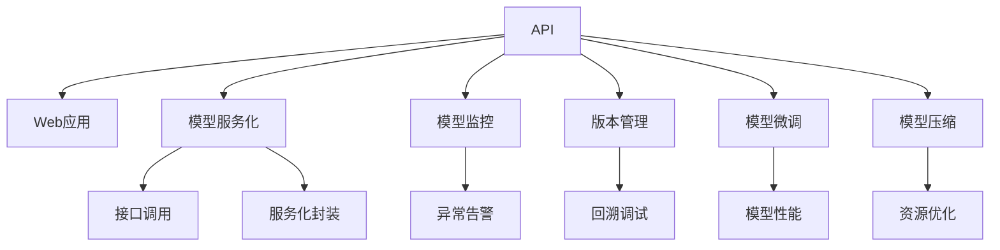

                 

# AI模型部署：构建API和Web应用

> 关键词：API部署, Web应用, 模型服务化, 模型监控, 模型微调, 模型压缩

## 1. 背景介绍

### 1.1 问题由来

随着人工智能技术的不断发展，模型训练的精度和效果得到了显著提升。但模型本身并非最终产品，其应用价值需要通过模型部署才能发挥出来。模型部署不仅包含模型的训练与推理，还涵盖了模型版本管理、服务化封装、接口调用、资源优化、监控告警等一系列环节。对于AI产品经理、架构师、工程师等技术工作者而言，如何将模型有效、便捷地部署至生产环境，并持续提升用户体验与模型效果，是一个重要的技术挑战。

### 1.2 问题核心关键点

模型部署的核心在于：
1. **模型服务化**：将模型封装成标准化的API服务，便于内部系统和第三方系统调用。
2. **接口调用**：保证模型调用接口的健壮性和高效性，满足高并发、低延迟的需求。
3. **资源优化**：通过模型裁剪、量化、缓存等技术手段，优化模型推理资源占用，提升系统性能。
4. **监控告警**：实时监控模型运行状态，设置异常告警阈值，确保服务稳定性。
5. **版本管理**：记录模型历史版本信息，便于回溯、调试和更新。

### 1.3 问题研究意义

模型部署的合理性和高效性，直接影响AI产品的市场竞争力。一个稳定、可靠、高效的模型部署系统，可以显著提升用户体验，促进AI技术在各个垂直行业的落地应用。

- **降低应用开发成本**：通过模型部署，开发者不必从头开发应用系统，而是可以依赖现成的API服务。
- **提升模型效果**：部署后的模型通常经过了调优和优化，能够提供更精准的预测结果。
- **加速应用开发**：模型服务化简化了应用开发流程，快速迭代和上线的需求得以实现。
- **支持持续迭代**：模型部署系统应支持动态更新和版本管理，确保模型服务的时效性和稳定性。

## 2. 核心概念与联系

### 2.1 核心概念概述

为更好地理解AI模型部署的原理和架构，本节将介绍几个关键概念及其相互关系：

- **API**：应用程序接口，用于定义服务接口和参数，并对外提供数据输入和输出。
- **Web应用**：基于浏览器的网页应用，采用HTTP请求方式调用API服务。
- **模型服务化**：将模型封装为标准化的API服务，便于内部系统和第三方系统调用。
- **接口调用**：通过网络请求的方式，向API服务提交模型输入，获取模型输出。
- **服务化封装**：将模型服务封装成标准化的RESTful API或gRPC服务，便于集成调用。
- **模型监控**：实时监控模型运行状态，设置异常告警阈值，确保服务稳定性。
- **版本管理**：记录模型历史版本信息，便于回溯、调试和更新。
- **模型微调**：根据实际应用场景，对模型进行优化，提升模型性能。
- **模型压缩**：通过模型裁剪、量化等技术手段，减小模型推理资源占用。

这些核心概念之间的逻辑关系可以通过以下Mermaid流程图来展示：



这个流程图展示了大模型部署的核心概念及其之间的关系：

1. API提供标准化的服务接口，供Web应用调用。
2. 模型服务化是将模型封装成标准化的API服务，便于内部系统和第三方系统调用。
3. 接口调用是通过网络请求的方式，向API服务提交模型输入，获取模型输出。
4. 服务化封装是将模型服务封装成标准化的RESTful API或gRPC服务，便于集成调用。
5. 模型监控是实时监控模型运行状态，设置异常告警阈值，确保服务稳定性。
6. 版本管理记录模型历史版本信息，便于回溯、调试和更新。
7. 模型微调是根据实际应用场景，对模型进行优化，提升模型性能。
8. 模型压缩通过模型裁剪、量化等技术手段，减小模型推理资源占用。

这些概念共同构成了AI模型部署的核心框架，使得模型能够有效地在实际应用中发挥其作用。通过理解这些核心概念，我们可以更好地把握AI模型部署的原理和实现细节。

## 3. 核心算法原理 & 具体操作步骤
### 3.1 算法原理概述

AI模型部署的原理在于，将训练好的模型封装为标准化的API服务，供外部系统调用。具体步骤如下：

1. **模型选择**：选择适合的模型架构和算法。
2. **模型训练**：在标注数据上训练模型。
3. **模型评估**：在验证集上评估模型性能。
4. **模型导出**：将模型导出为标准格式，如TensorFlow SavedModel、PyTorch TorchScript等。
5. **服务封装**：将导出的模型封装为API服务，如RESTful API、gRPC服务。
6. **接口调用**：通过HTTP或gRPC协议，向API服务提交模型输入，获取模型输出。
7. **模型监控**：实时监控API服务状态，设置异常告警阈值。
8. **版本管理**：记录模型历史版本信息，便于回溯、调试和更新。

### 3.2 算法步骤详解

#### 3.2.1 模型选择与训练

选择适合的任务和数据，选择合适的模型架构和算法进行训练。以下是示例代码：

```python
import tensorflow as tf
from tensorflow.keras import layers

# 定义模型结构
model = tf.keras.Sequential([
    layers.Dense(64, activation='relu', input_shape=(input_size,)),
    layers.Dense(1, activation='sigmoid'),
])

# 编译模型
model.compile(optimizer='adam', loss='binary_crossentropy', metrics=['accuracy'])

# 加载数据
train_data = tf.keras.utils.get_file('train.csv', 'http://example.com/train.csv')
train_dataset = tf.data.Dataset.from_tensor_slices(train_data)

# 训练模型
model.fit(train_dataset, epochs=10, batch_size=32)
```

#### 3.2.2 模型评估与导出

在训练完成后，使用验证集对模型进行评估，并保存导出模型。以下是示例代码：

```python
from tensorflow.keras.models import save_model

# 加载验证集数据
val_data = tf.keras.utils.get_file('val.csv', 'http://example.com/val.csv')
val_dataset = tf.data.Dataset.from_tensor_slices(val_data)

# 评估模型
val_loss, val_acc = model.evaluate(val_dataset)

# 保存模型
save_model(model, 'model.h5')
```

#### 3.2.3 服务封装与接口调用

将导出的模型封装为API服务，供外部系统调用。以下是示例代码：

```python
import flask

# 加载模型
model = tf.keras.models.load_model('model.h5')

# 创建Flask应用
app = flask.Flask(__name__)

# 定义API接口
@app.route('/predict', methods=['POST'])
def predict():
    # 获取输入数据
    data = request.json['data']
    # 调用模型进行预测
    result = model.predict(data)
    # 返回预测结果
    return {'result': result.tolist()}

# 启动应用
if __name__ == '__main__':
    app.run()
```

#### 3.2.4 模型监控与异常告警

实时监控API服务状态，设置异常告警阈值，确保服务稳定性。以下是示例代码：

```python
import psutil

# 监控CPU使用率
while True:
    cpu_percent = psutil.cpu_percent(interval=1)
    if cpu_percent > 90:
        # 发送告警
        print('CPU使用率过高，CPU使用率：', cpu_percent)
```

#### 3.2.5 版本管理与回溯调试

记录模型历史版本信息，便于回溯、调试和更新。以下是示例代码：

```python
import datetime

# 记录版本信息
def record_version(version):
    timestamp = datetime.datetime.now().strftime('%Y-%m-%d %H:%M:%S')
    with open('model_version.txt', 'a') as f:
        f.write(f'{timestamp} version {version}\n')

# 更新版本信息
record_version('v1.0.0')
```

### 3.3 算法优缺点

AI模型部署的优点包括：
1. **便捷性**：模型部署后，可以便捷地进行模型调用，无需从头开发应用系统。
2. **稳定性**：模型部署系统通常会经过严格的测试和优化，提供稳定可靠的服务。
3. **可扩展性**：部署后的模型可以根据实际需求进行动态更新和扩展。
4. **易维护性**：模型部署系统通常采用标准化的API接口，便于维护和升级。

然而，模型部署也存在一定的缺点：
1. **数据依赖**：模型部署依赖于训练数据的质量和标注数据，数据问题可能会影响模型效果。
2. **性能优化**：模型推理通常需要较高的计算资源，需要优化模型以提升性能。
3. **安全问题**：模型部署后，需要关注模型安全性和隐私保护，避免模型被滥用或攻击。

### 3.4 算法应用领域

AI模型部署技术广泛应用于以下几个领域：

1. **金融风控**：用于金融交易的实时风控，评估交易风险。
2. **医疗诊断**：用于医疗影像的图像识别和诊断，辅助医生进行疾病诊断和治疗方案推荐。
3. **智能客服**：用于智能客服系统中的自然语言理解和生成，提升客户服务体验。
4. **推荐系统**：用于推荐系统的商品推荐，提升用户满意度。
5. **安全监控**：用于视频图像中的行为识别和安全监控，保障公共安全。
6. **供应链管理**：用于供应链中的预测和优化，提升物流效率。
7. **智慧城市**：用于智慧城市中的数据处理和决策支持，提升城市管理水平。

这些领域中，AI模型部署技术的广泛应用，显著提升了各行业的智能化水平和效率。

## 4. 数学模型和公式 & 详细讲解 & 举例说明
### 4.1 数学模型构建

本节将使用数学语言对AI模型部署的数学模型进行更加严格的刻画。

假设模型输入为 $x$，输出为 $y$，训练数据集为 $D=\{(x_i, y_i)\}_{i=1}^N$。定义模型 $M$ 在数据样本 $(x,y)$ 上的损失函数为 $\ell(M(x),y)$，则在数据集 $D$ 上的经验风险为：

$$
\mathcal{L}(M) = \frac{1}{N}\sum_{i=1}^N \ell(M(x_i),y_i)
$$

模型部署的优化目标是使经验风险最小化，即找到最优模型：

$$
M^* = \mathop{\arg\min}_{M} \mathcal{L}(M)
$$

在实践中，我们通常使用基于梯度的优化算法（如SGD、Adam等）来近似求解上述最优化问题。设 $\eta$ 为学习率，$\lambda$ 为正则化系数，则模型参数的更新公式为：

$$
\theta \leftarrow \theta - \eta \nabla_{\theta}\mathcal{L}(\theta) - \eta\lambda\theta
$$

其中 $\nabla_{\theta}\mathcal{L}(\theta)$ 为损失函数对模型参数的梯度，可通过反向传播算法高效计算。

### 4.2 公式推导过程

以下我们以二分类任务为例，推导梯度下降算法的公式。

假设模型 $M_{\theta}$ 在输入 $x$ 上的输出为 $\hat{y}=M_{\theta}(x) \in [0,1]$，表示样本属于正类的概率。真实标签 $y \in \{0,1\}$。则二分类交叉熵损失函数定义为：

$$
\ell(M_{\theta}(x),y) = -[y\log \hat{y} + (1-y)\log (1-\hat{y})]
$$

将其代入经验风险公式，得：

$$
\mathcal{L}(M_{\theta}) = -\frac{1}{N}\sum_{i=1}^N [y_i\log M_{\theta}(x_i)+(1-y_i)\log(1-M_{\theta}(x_i))]
$$

根据链式法则，损失函数对模型参数 $\theta_k$ 的梯度为：

$$
\frac{\partial \mathcal{L}(M_{\theta})}{\partial \theta_k} = -\frac{1}{N}\sum_{i=1}^N (\frac{y_i}{M_{\theta}(x_i)}-\frac{1-y_i}{1-M_{\theta}(x_i)}) \frac{\partial M_{\theta}(x_i)}{\partial \theta_k}
$$

其中 $\frac{\partial M_{\theta}(x_i)}{\partial \theta_k}$ 可进一步递归展开，利用自动微分技术完成计算。

在得到损失函数的梯度后，即可带入模型参数更新公式，完成模型的迭代优化。重复上述过程直至收敛，最终得到适应生产环境的模型参数 $\theta^*$。

### 4.3 案例分析与讲解

假设我们需要部署一个用于金融风控的分类模型，步骤如下：

1. **数据预处理**：将金融交易数据进行清洗和特征工程，转化为模型输入。
2. **模型训练**：使用标注数据对模型进行训练，得到初始模型参数 $\theta_0$。
3. **模型评估**：在验证集上评估模型性能，得到模型参数 $\theta_1$。
4. **模型导出**：将训练好的模型导出为标准格式，如TensorFlow SavedModel、PyTorch TorchScript等。
5. **服务封装**：将导出的模型封装为API服务，如RESTful API、gRPC服务。
6. **接口调用**：通过HTTP或gRPC协议，向API服务提交金融交易数据，获取预测结果。
7. **模型监控**：实时监控API服务状态，设置异常告警阈值。
8. **版本管理**：记录模型历史版本信息，便于回溯、调试和更新。

## 5. 项目实践：代码实例和详细解释说明
### 5.1 开发环境搭建

在进行模型部署实践前，我们需要准备好开发环境。以下是使用Python进行Flask开发的环境配置流程：

1. 安装Anaconda：从官网下载并安装Anaconda，用于创建独立的Python环境。

2. 创建并激活虚拟环境：
```bash
conda create -n flask-env python=3.8 
conda activate flask-env
```

3. 安装Flask：
```bash
pip install flask
```

4. 安装相关依赖：
```bash
pip install tensorflow-gpu
pip install numpy pandas scikit-learn
```

完成上述步骤后，即可在`flask-env`环境中开始模型部署实践。

### 5.2 源代码详细实现

下面我们以一个基于TensorFlow的金融风控分类模型为例，给出其部署代码实现。

首先，定义模型结构：

```python
import tensorflow as tf

# 定义模型结构
model = tf.keras.Sequential([
    tf.keras.layers.Dense(64, activation='relu', input_shape=(input_size,)),
    tf.keras.layers.Dense(1, activation='sigmoid'),
])

# 编译模型
model.compile(optimizer='adam', loss='binary_crossentropy', metrics=['accuracy'])
```

接着，训练模型：

```python
# 加载数据
train_data = tf.keras.utils.get_file('train.csv', 'http://example.com/train.csv')
train_dataset = tf.data.Dataset.from_tensor_slices(train_data)

# 训练模型
model.fit(train_dataset, epochs=10, batch_size=32)
```

然后，评估模型：

```python
# 加载验证集数据
val_data = tf.keras.utils.get_file('val.csv', 'http://example.com/val.csv')
val_dataset = tf.data.Dataset.from_tensor_slices(val_data)

# 评估模型
val_loss, val_acc = model.evaluate(val_dataset)

# 保存模型
save_model(model, 'model.h5')
```

最后，将模型封装为Flask API服务：

```python
from flask import Flask, request, jsonify

# 加载模型
model = tf.keras.models.load_model('model.h5')

# 创建Flask应用
app = Flask(__name__)

# 定义API接口
@app.route('/predict', methods=['POST'])
def predict():
    # 获取输入数据
    data = request.json['data']
    # 调用模型进行预测
    result = model.predict(data)
    # 返回预测结果
    return jsonify({'result': result.tolist()})

# 启动应用
if __name__ == '__main__':
    app.run()
```

### 5.3 代码解读与分析

让我们再详细解读一下关键代码的实现细节：

**定义模型结构**：
- 使用TensorFlow的Sequential模型定义模型结构，包含两个全连接层，输出一个sigmoid激活的分类结果。

**训练模型**：
- 加载训练数据，使用Dataset.from_tensor_slices加载数据，使用fit函数训练模型。

**评估模型**：
- 加载验证集数据，使用evaluate函数评估模型性能，保存模型。

**封装API服务**：
- 加载模型，使用Flask创建RESTful API服务，定义/predict接口，接收POST请求，调用模型预测，返回预测结果。

可以看到，Flask结合TensorFlow使得模型部署的代码实现变得简洁高效。开发者可以将更多精力放在数据处理、模型优化等高层逻辑上，而不必过多关注底层的实现细节。

当然，工业级的系统实现还需考虑更多因素，如模型的保存和部署、超参数的自动搜索、更灵活的API接口设计等。但核心的模型部署流程基本与此类似。

## 6. 实际应用场景
### 6.1 智能客服系统

基于大模型微调的对话技术，可以广泛应用于智能客服系统的构建。传统客服往往需要配备大量人力，高峰期响应缓慢，且一致性和专业性难以保证。而使用微调后的对话模型，可以7x24小时不间断服务，快速响应客户咨询，用自然流畅的语言解答各类常见问题。

在技术实现上，可以收集企业内部的历史客服对话记录，将问题和最佳答复构建成监督数据，在此基础上对预训练对话模型进行微调。微调后的对话模型能够自动理解用户意图，匹配最合适的答案模板进行回复。对于客户提出的新问题，还可以接入检索系统实时搜索相关内容，动态组织生成回答。如此构建的智能客服系统，能大幅提升客户咨询体验和问题解决效率。

### 6.2 金融舆情监测

金融机构需要实时监测市场舆论动向，以便及时应对负面信息传播，规避金融风险。传统的人工监测方式成本高、效率低，难以应对网络时代海量信息爆发的挑战。基于大语言模型微调的文本分类和情感分析技术，为金融舆情监测提供了新的解决方案。

具体而言，可以收集金融领域相关的新闻、报道、评论等文本数据，并对其进行主题标注和情感标注。在此基础上对预训练语言模型进行微调，使其能够自动判断文本属于何种主题，情感倾向是正面、中性还是负面。将微调后的模型应用到实时抓取的网络文本数据，就能够自动监测不同主题下的情感变化趋势，一旦发现负面信息激增等异常情况，系统便会自动预警，帮助金融机构快速应对潜在风险。

### 6.3 个性化推荐系统

当前的推荐系统往往只依赖用户的历史行为数据进行物品推荐，无法深入理解用户的真实兴趣偏好。基于大语言模型微调技术，个性化推荐系统可以更好地挖掘用户行为背后的语义信息，从而提供更精准、多样的推荐内容。

在实践中，可以收集用户浏览、点击、评论、分享等行为数据，提取和用户交互的物品标题、描述、标签等文本内容。将文本内容作为模型输入，用户的后续行为（如是否点击、购买等）作为监督信号，在此基础上微调预训练语言模型。微调后的模型能够从文本内容中准确把握用户的兴趣点。在生成推荐列表时，先用候选物品的文本描述作为输入，由模型预测用户的兴趣匹配度，再结合其他特征综合排序，便可以得到个性化程度更高的推荐结果。

### 6.4 未来应用展望

随着AI模型部署技术的不断发展，基于模型服务化的应用场景将不断拓展，为各行各业带来变革性影响。

在智慧医疗领域，基于模型服务化的医疗问答、病历分析、药物研发等应用将提升医疗服务的智能化水平，辅助医生诊疗，加速新药开发进程。

在智能教育领域，模型服务化可应用于作业批改、学情分析、知识推荐等方面，因材施教，促进教育公平，提高教学质量。

在智慧城市治理中，模型服务化可用于城市事件监测、舆情分析、应急指挥等环节，提高城市管理的自动化和智能化水平，构建更安全、高效的未来城市。

此外，在企业生产、社会治理、文娱传媒等众多领域，基于模型服务化的AI应用也将不断涌现，为经济社会发展注入新的动力。相信随着技术的日益成熟，模型服务化必将在构建人机协同的智能时代中扮演越来越重要的角色。

## 7. 工具和资源推荐
### 7.1 学习资源推荐

为了帮助开发者系统掌握AI模型部署的理论基础和实践技巧，这里推荐一些优质的学习资源：

1. **《TensorFlow模型部署实战》**：介绍TensorFlow模型部署的最佳实践，包括模型服务化、API接口设计、模型监控等技术。

2. **《深度学习实战》**：涵盖深度学习模型的训练、推理、部署等各个环节，并结合实际应用案例进行讲解。

3. **《模型服务化技术详解》**：介绍模型服务化的技术细节和最佳实践，涵盖模型导出、API封装、监控告警等环节。

4. **《Keras深度学习》**：介绍Keras框架的模型训练和部署，并结合实际应用案例进行讲解。

5. **《深度学习与人工智能》**：涵盖深度学习模型的训练、推理、部署等各个环节，并结合实际应用案例进行讲解。

通过对这些资源的学习实践，相信你一定能够快速掌握AI模型部署的精髓，并用于解决实际的AI产品开发问题。

### 7.2 开发工具推荐

高效的开发离不开优秀的工具支持。以下是几款用于AI模型部署开发的常用工具：

1. **TensorFlow**：基于Python的开源深度学习框架，生产部署方便，支持多种模型和算法。

2. **Flask**：基于Python的轻量级Web框架，支持RESTful API接口设计和部署。

3. **gRPC**：开源的高性能跨语言远程过程调用框架，支持模型服务化部署。

4. **Prometheus**：开源的系统监控工具，支持实时监控模型运行状态。

5. **Kubernetes**：开源的容器编排平台，支持模型服务的自动部署和扩展。

6. **ElasticSearch**：开源的搜索引擎，支持海量数据的存储和检索。

合理利用这些工具，可以显著提升AI模型部署的开发效率，加快创新迭代的步伐。

### 7.3 相关论文推荐

AI模型部署技术的发展源于学界的持续研究。以下是几篇奠基性的相关论文，推荐阅读：

1. **《TensorFlow模型部署指南》**：介绍TensorFlow模型部署的最佳实践，涵盖模型服务化、API接口设计、模型监控等技术。

2. **《Keras模型服务化技术》**：介绍Keras框架的模型服务化部署，涵盖模型导出、API封装、监控告警等环节。

3. **《模型服务化技术详解》**：介绍模型服务化的技术细节和最佳实践，涵盖模型导出、API封装、监控告警等环节。

4. **《深度学习模型的部署与优化》**：介绍深度学习模型的训练、推理、部署等各个环节，并结合实际应用案例进行讲解。

5. **《深度学习与人工智能》**：涵盖深度学习模型的训练、推理、部署等各个环节，并结合实际应用案例进行讲解。

这些论文代表了大模型部署技术的发展脉络。通过学习这些前沿成果，可以帮助研究者把握学科前进方向，激发更多的创新灵感。

## 8. 总结：未来发展趋势与挑战
### 8.1 总结

本文对AI模型部署的原理和实践进行了全面系统的介绍。首先阐述了模型部署的背景和意义，明确了模型服务化的重要性和实现细节。其次，从原理到实践，详细讲解了模型服务化的数学原理和关键步骤，给出了模型部署任务开发的完整代码实例。同时，本文还探讨了模型服务化在多个行业领域的应用前景，展示了模型服务化的巨大潜力。最后，本文精选了模型服务化的各类学习资源，力求为开发者提供全方位的技术指引。

通过本文的系统梳理，可以看到，AI模型部署的合理性和高效性，直接影响AI产品的市场竞争力。一个稳定、可靠、高效的模型部署系统，可以显著提升用户体验，促进AI技术在各个垂直行业的落地应用。

### 8.2 未来发展趋势

展望未来，AI模型部署技术将呈现以下几个发展趋势：

1. **模型服务化普及**：越来越多的企业将采用模型服务化的方式，提供便捷、高效、可靠的服务。
2. **多模态模型服务**：基于多模态数据（如文本、图像、视频等）的模型服务，将提升模型的智能水平。
3. **低延迟模型服务**：实时服务和高并发场景下的模型服务，需要进一步优化模型推理速度和资源占用。
4. **联邦学习**：通过边缘计算和联邦学习技术，实现模型的本地化部署和数据隐私保护。
5. **自动化调参**：基于自动化调参技术，优化模型参数，提升模型性能和泛化能力。
6. **可解释性增强**：通过模型压缩和可解释性技术，增强模型的解释能力，提高系统的透明度和可信度。

这些趋势凸显了AI模型部署技术的广阔前景。这些方向的探索发展，必将进一步提升AI产品的智能化水平和用户体验，为各个垂直行业带来深远影响。

### 8.3 面临的挑战

尽管AI模型部署技术已经取得了显著进展，但在迈向更加智能化、普适化应用的过程中，仍面临诸多挑战：

1. **数据隐私保护**：模型服务化涉及大量的数据传输和存储，数据隐私和安全问题亟需解决。
2. **模型鲁棒性不足**：模型服务化过程中，模型可能面临对抗攻击和环境变化的影响，鲁棒性需要进一步提升。
3. **模型性能优化**：模型推理通常需要较高的计算资源，需要优化模型以提升性能。
4. **系统可靠性问题**：模型服务化需要高度可靠的系统架构和监控告警机制，避免服务中断和异常。
5. **模型更新维护**：模型服务化需要高效的版本管理机制，支持动态更新和回溯调试。

这些挑战需要从技术、管理和伦理等多个层面进行综合解决，才能真正实现AI模型的广泛应用和落地。

### 8.4 研究展望

面对AI模型部署所面临的挑战，未来的研究需要在以下几个方面寻求新的突破：

1. **隐私保护技术**：开发更加安全的模型传输和存储技术，保护数据隐私和安全。
2. **鲁棒性增强**：引入鲁棒性增强技术，如对抗训练、剪枝等，提升模型鲁棒性和泛化能力。
3. **高效推理优化**：开发更加高效的模型推理技术，提升模型服务性能。
4. **系统架构优化**：设计更加可靠的系统架构和监控告警机制，提升模型服务的稳定性。
5. **模型版本管理**：开发更加高效的模型版本管理机制，支持动态更新和回溯调试。

这些研究方向将推动AI模型部署技术的不断进步，为构建安全、可靠、高效的AI系统奠定坚实基础。

## 9. 附录：常见问题与解答

**Q1：AI模型部署是否适用于所有应用场景？**

A: AI模型部署在大多数应用场景中都能取得不错的效果，特别是对于数据量较小的场景。但对于一些特定领域，如医疗、金融等，模型部署需要经过针对性的优化，以确保模型的准确性和鲁棒性。

**Q2：模型部署过程中如何优化资源占用？**

A: 模型部署过程中，可以通过模型裁剪、量化、缓存等技术手段，优化模型推理资源占用，提升系统性能。具体来说：
1. 模型裁剪：去除不必要的层和参数，减小模型尺寸，加快推理速度。
2. 量化加速：将浮点模型转为定点模型，压缩存储空间，提高计算效率。
3. 缓存机制：使用缓存技术，减少重复计算，提升系统响应速度。

**Q3：模型服务化过程中如何保证数据隐私？**

A: 模型服务化过程中，需要采用数据加密、匿名化等技术手段，保护数据隐私。具体来说：
1. 数据加密：使用加密技术，对传输和存储的数据进行加密处理。
2. 数据匿名化：对数据进行匿名化处理，去除敏感信息。
3. 访问控制：限制对数据的访问权限，防止未经授权的访问。

**Q4：模型服务化过程中如何提高模型鲁棒性？**

A: 模型服务化过程中，需要引入鲁棒性增强技术，如对抗训练、剪枝等，提升模型鲁棒性和泛化能力。具体来说：
1. 对抗训练：引入对抗样本，提高模型鲁棒性，防止模型被误导。
2. 剪枝技术：去除模型中的冗余参数，提升模型的鲁棒性和泛化能力。

**Q5：模型部署过程中如何提高系统可靠性？**

A: 模型部署过程中，需要设计可靠的系统架构和监控告警机制，提升模型服务的稳定性。具体来说：
1. 系统架构优化：采用高可用架构，如负载均衡、故障转移等，提升系统的可靠性。
2. 监控告警机制：实时监控模型运行状态，设置异常告警阈值，确保服务稳定性。
3. 自动化调参：使用自动化调参技术，优化模型参数，提升模型性能和鲁棒性。

这些技术手段能够显著提升AI模型部署系统的稳定性和可靠性，确保模型服务的高效运行。

---

作者：禅与计算机程序设计艺术 / Zen and the Art of Computer Programming

