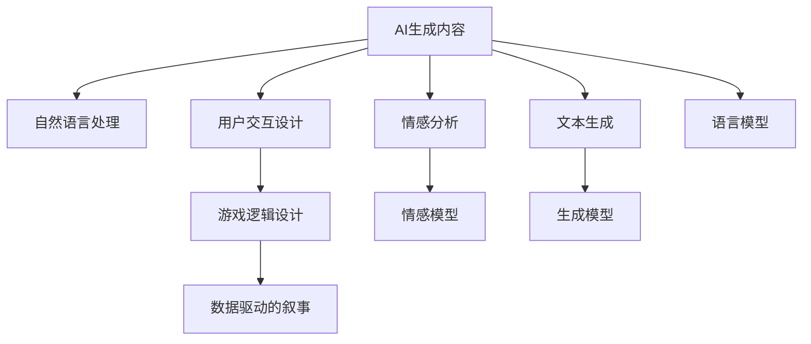

                 

# AI生成的互动小说游戏：故事与游戏的融合

> 关键词：AI生成内容,互动小说游戏,自然语言处理,机器学习,文本生成,用户交互设计

## 1. 背景介绍

### 1.1 问题由来

随着人工智能技术的不断进步，越来越多的应用场景开始探索AI与游戏、文学等创意产业的结合。传统的文本生成和自然语言处理技术已经能够生成高质量的文本，但要创作一个既富有故事情节又充满互动性的互动小说游戏，仍然是一个复杂的挑战。

互动小说游戏是一种结合了故事叙述和玩家选择的互动性游戏形式，它要求游戏内容能够在玩家的选择下动态生成，并且能够与玩家的互动产生反馈，实现游戏情节的动态发展。这要求游戏内容既要有文学性，又要具备游戏性，既需要创意与叙事技巧，也需要技术支持与逻辑计算能力。

AI生成互动小说游戏，即通过人工智能技术，实现文本内容的自动生成，并结合玩家的选择与互动，动态生成游戏情节。这种形式不仅可以大幅降低游戏开发的人力成本，还可以提升游戏的创新性与趣味性，为玩家提供个性化的游戏体验。

### 1.2 问题核心关键点

AI生成互动小说游戏涉及的关键点包括：
- AI文本生成技术：用于生成游戏内的对话、描述等文本内容。
- 自然语言处理：理解玩家的选择，调整游戏情节。
- 用户交互设计：实现玩家与游戏的互动反馈，提高游戏体验。
- 游戏逻辑设计：制定游戏规则，实现情节的动态生成。
- 数据驱动的叙事：利用玩家数据，优化故事情节和角色发展。

这些关键点共同构成了AI生成互动小说游戏的核心框架，使得故事与游戏的融合成为可能。

### 1.3 问题研究意义

AI生成互动小说游戏的研究，对于推动游戏与文学的创新融合，提升人工智能在创意产业的应用，具有重要意义：

1. **降低开发成本**：AI文本生成技术可以自动生成大量游戏内容，减少人力成本，加快游戏开发进程。
2. **提高游戏创新性**：AI可以根据玩家选择和反馈动态生成故事，提供个性化的游戏体验，增加游戏的趣味性和可玩性。
3. **增强用户互动性**：自然语言处理技术可以实现玩家与游戏的实时互动，提升玩家的游戏体验。
4. **优化叙事逻辑**：AI可以利用玩家数据，优化游戏故事情节和角色设计，增强故事连贯性和合理性。
5. **推动游戏与文学结合**：将文学创作与游戏设计相结合，为创意产业注入新的活力。

## 2. 核心概念与联系

### 2.1 核心概念概述

为了更好地理解AI生成互动小说游戏的原理，本节将介绍几个核心概念：

- **AI生成内容(AI Generated Content, AGC)**：指通过人工智能技术，自动生成文本、图像、声音等创意内容，用于游戏、广告、社交媒体等领域。
- **自然语言处理(Natural Language Processing, NLP)**：指利用计算机处理、理解、生成人类语言的技术，涉及文本分类、情感分析、机器翻译等子领域。
- **用户交互设计(User Interaction Design, UID)**：指设计用户与系统的互动方式，实现良好的用户体验。
- **游戏逻辑设计(Game Logic Design)**：指定义游戏的规则、流程、角色、任务等，是游戏开发的基础。
- **数据驱动的叙事(Data-Driven Narrative)**：指利用数据对故事进行分析和优化，实现更合理、连贯的叙事结构。

这些概念之间的逻辑关系可以通过以下Mermaid流程图来展示：



这个流程图展示了大语言模型在AI生成互动小说游戏中的核心概念及其之间的关系：

1. AI生成内容通过自然语言处理、情感分析、文本生成等技术实现。
2. 用户交互设计指导玩家与游戏的互动方式，增强游戏体验。
3. 游戏逻辑设计定义游戏规则，实现情节的动态生成。
4. 数据驱动的叙事利用玩家数据优化故事情节，增强故事的连贯性和合理性。

这些概念共同构成了AI生成互动小说游戏的技术基础，为其创意和创新提供了可能。

## 3. 核心算法原理 & 具体操作步骤

### 3.1 算法原理概述

AI生成互动小说游戏的核心算法原理，可以概括为以下几个关键步骤：

1. **文本生成**：利用预训练的语言模型（如GPT-3、BERT等），根据前文生成新的文本内容。
2. **情感分析**：通过情感分析模型，理解文本中的情感倾向，为后续情节发展提供情感基础。
3. **决策生成**：结合玩家的选择和情感分析结果，动态生成游戏情节和角色对话。
4. **互动反馈**：根据玩家的选择和反馈，调整游戏情节和角色发展，实现实时互动。
5. **数据驱动的优化**：利用玩家行为数据，优化游戏情节和角色设计，提升叙事质量。

### 3.2 算法步骤详解

基于上述算法原理，AI生成互动小说游戏的详细步骤包括：

**Step 1: 准备游戏数据与预训练模型**

- 收集游戏相关的文本数据，如对话、描述、任务等。
- 选择合适的预训练语言模型（如GPT-3、BERT等），并加载模型权重。

**Step 2: 预处理与分割**

- 对收集的文本数据进行预处理，包括分词、去除停用词等。
- 将文本数据分割成合适的长度，方便模型生成新的文本。

**Step 3: 文本生成与情感分析**

- 使用预训练的语言模型生成新的文本，用于玩家的选择和对话。
- 通过情感分析模型，识别文本中的情感倾向，如正面、中性、负面。

**Step 4: 决策生成**

- 根据玩家的当前选择和情感分析结果，生成新的情节和对话。
- 结合游戏规则和逻辑，调整故事情节和角色发展。

**Step 5: 用户交互与反馈**

- 将生成的情节和对话显示给玩家，等待玩家的选择。
- 根据玩家的选择，调整游戏情节，生成新的对话和描述。
- 收集玩家的选择和反馈，用于后续的优化和调整。

**Step 6: 数据驱动的优化**

- 收集和分析玩家的行为数据，如选择模式、时间花费等。
- 利用这些数据优化故事情节和角色设计，增强故事的连贯性和合理性。
- 不断迭代优化模型，提升游戏体验。

### 3.3 算法优缺点

AI生成互动小说游戏的主要优点包括：

1. **高效率**：利用预训练模型和数据驱动优化，可以快速生成大量游戏内容。
2. **个性化**：根据玩家的选择和反馈，动态生成情节，提供个性化的游戏体验。
3. **创新性**：结合自然语言处理和游戏逻辑设计，实现故事与游戏的深度融合。

然而，这种技术也存在一些缺点：

1. **质量不稳定**：预训练模型生成的文本质量不稳定，可能存在语法错误、逻辑漏洞等问题。
2. **依赖数据**：游戏情节和角色设计依赖于玩家数据，需要收集大量数据才能实现优化。
3. **技术复杂**：涉及文本生成、情感分析、决策生成等多个技术环节，开发和维护难度较大。
4. **用户接受度**：玩家可能对AI生成的内容持怀疑态度，需要设计合适的机制提升用户信任度。

### 3.4 算法应用领域

AI生成互动小说游戏已经在多个领域得到了应用，例如：

- **互动小说**：利用AI生成文本内容，实现互动小说的自动生成。
- **游戏对话**：在游戏中生成对话，提升玩家的游戏体验。
- **任务生成**：自动生成游戏中的任务和挑战，增强游戏的多样性和趣味性。
- **情感模拟**：通过情感分析，实现游戏中的情感模拟和反馈。
- **剧情优化**：利用玩家数据，优化故事情节和角色发展，提升叙事质量。

除了上述这些经典应用外，AI生成互动小说游戏还被创新性地应用到更多场景中，如虚拟角色生成、虚拟世界构建等，为游戏设计带来了全新的突破。

## 4. 数学模型和公式 & 详细讲解 & 举例说明（备注：数学公式请使用latex格式，latex嵌入文中独立段落使用 $$，段落内使用 $)
### 4.1 数学模型构建

本节将使用数学语言对AI生成互动小说游戏的核心算法进行更加严格的刻画。

假设预训练语言模型为 $M_{\theta}$，其中 $\theta$ 为模型参数。假设玩家的选择为 $x$，游戏情节为 $y$，情感分析结果为 $e$。游戏生成的目标函数为：

$$
f(x, y, e) = \min_{\theta} \mathcal{L}(M_{\theta}(x, y), e)
$$

其中 $\mathcal{L}$ 为损失函数，用于衡量模型生成的文本与情感分析结果之间的差异。

### 4.2 公式推导过程

以下我们以文本生成任务为例，推导生成模型及其梯度计算公式。

假设文本生成模型的输出为 $z = M_{\theta}(x)$，其中 $x$ 为前文，$z$ 为生成的文本。设生成的文本 $z$ 与真实文本 $y$ 之间的差异为 $d$，情感分析结果为 $e$。则文本生成的目标函数为：

$$
\mathcal{L}(z, y, e) = \mathcal{L}_{text}(z, y) + \mathcal{L}_{emotion}(z, e)
$$

其中 $\mathcal{L}_{text}$ 为文本生成损失函数，$\mathcal{L}_{emotion}$ 为情感分析损失函数。假设损失函数均为交叉熵损失，则生成模型梯度为：

$$
\frac{\partial \mathcal{L}}{\partial \theta} = \frac{\partial \mathcal{L}_{text}}{\partial \theta} + \frac{\partial \mathcal{L}_{emotion}}{\partial \theta}
$$

其中 $\frac{\partial \mathcal{L}_{text}}{\partial \theta}$ 为文本生成损失的梯度，$\frac{\partial \mathcal{L}_{emotion}}{\partial \theta}$ 为情感分析损失的梯度。

在得到生成模型的梯度后，即可带入参数更新公式，完成模型的迭代优化。重复上述过程直至收敛，最终得到适应该情节和情感的生成模型参数 $\theta$。

### 4.3 案例分析与讲解

假设我们正在开发一个基于AI的互动小说游戏，玩家可以选择不同的角色和情节发展方向，游戏会根据玩家的选择动态生成新的对话和情节。

**Step 1: 收集数据**

首先，我们需要收集游戏相关的文本数据，如对话、描述、任务等。这些数据可以来自玩家的选择、任务日志、情节发展等。

**Step 2: 预处理数据**

对收集的文本数据进行预处理，包括分词、去除停用词、标准化等。此外，还需要将数据分割成合适的长度，方便模型生成新的文本。

**Step 3: 训练生成模型**

选择预训练语言模型（如GPT-3、BERT等），并将其加载到模型中。使用收集的数据训练生成模型，使其能够根据前文生成新的文本。

**Step 4: 情感分析**

通过情感分析模型，识别玩家选择的情感倾向，如正面、中性、负面。情感分析可以基于前文和玩家的选择，使用预训练的情感分析模型，如BERT等。

**Step 5: 生成对话**

根据玩家的当前选择和情感分析结果，生成新的情节和对话。使用生成模型生成对话，结合游戏规则和逻辑，调整故事情节和角色发展。

**Step 6: 用户交互与反馈**

将生成的情节和对话显示给玩家，等待玩家的选择。根据玩家的选择，调整游戏情节，生成新的对话和描述。收集玩家的选择和反馈，用于后续的优化和调整。

**Step 7: 数据驱动的优化**

收集和分析玩家的行为数据，如选择模式、时间花费等。利用这些数据优化故事情节和角色设计，增强故事的连贯性和合理性。不断迭代优化模型，提升游戏体验。

通过上述步骤，我们完成了AI生成互动小说游戏的实现，玩家可以在游戏中体验到动态生成、个性化的故事情节和对话。

## 5. 项目实践：代码实例和详细解释说明
### 5.1 开发环境搭建

在进行AI生成互动小说游戏开发前，我们需要准备好开发环境。以下是使用Python进行PyTorch开发的环境配置流程：

1. 安装Anaconda：从官网下载并安装Anaconda，用于创建独立的Python环境。

2. 创建并激活虚拟环境：
```bash
conda create -n ai-games-env python=3.8 
conda activate ai-games-env
```

3. 安装PyTorch：根据CUDA版本，从官网获取对应的安装命令。例如：
```bash
conda install pytorch torchvision torchaudio cudatoolkit=11.1 -c pytorch -c conda-forge
```

4. 安装相关库：
```bash
pip install transformers
pip install torchtext
pip install sentence-transformers
```

完成上述步骤后，即可在`ai-games-env`环境中开始AI生成互动小说游戏的开发。

### 5.2 源代码详细实现

下面我以生成对话功能为例，给出使用Transformers库对GPT-3模型进行对话生成任务的PyTorch代码实现。

首先，定义生成模型：

```python
from transformers import GPT2LMHeadModel, GPT2Tokenizer

model = GPT2LMHeadModel.from_pretrained('gpt2', num_return_sequences=1)
tokenizer = GPT2Tokenizer.from_pretrained('gpt2')
```

然后，定义生成函数：

```python
def generate_response(input_text, max_length=100):
    input_ids = tokenizer.encode(input_text, return_tensors='pt')
    outputs = model.generate(input_ids, max_length=max_length, top_k=50, top_p=0.9, temperature=0.7)
    response_text = tokenizer.decode(outputs[0])
    return response_text
```

接着，定义情感分析模型：

```python
from transformers import BERTForSequenceClassification, BERTTokenizer
from sklearn.metrics import accuracy_score

model = BERTForSequenceClassification.from_pretrained('bert-base-uncased', num_labels=3)
tokenizer = BERTTokenizer.from_pretrained('bert-base-uncased')

def analyze_emotion(input_text):
    input_ids = tokenizer.encode(input_text, return_tensors='pt')
    labels = model(input_ids).logits.argmax(dim=1)
    label_text = ['Positive', 'Neutral', 'Negative']
    emotion = label_text[labels[0].item()]
    return emotion
```

最后，整合生成和情感分析功能，实现AI生成的互动小说对话：

```python
def game_loop():
    game_started = False
    while not game_started:
        user_choice = input("Enter your choice: ")
        emotion = analyze_emotion(user_choice)
        response = generate_response(user_choice, max_length=100)
        print("AI response:", response)
        print("Emotion:", emotion)
        game_started = True
```

以上就是使用PyTorch对GPT-3进行互动小说对话生成任务的完整代码实现。可以看到，Transformers库提供的预训练模型和工具库，使得实现AI生成对话变得简洁高效。

### 5.3 代码解读与分析

让我们再详细解读一下关键代码的实现细节：

**GPT-2生成模型**：
- 使用GPT-2模型作为生成器，通过预训练语言模型，自动生成新的文本内容。

**情感分析模型**：
- 使用BERT模型作为情感分析器，通过预训练的情感分析模型，识别文本中的情感倾向，如正面、中性、负面。

**游戏循环**：
- 实现游戏的主循环，玩家通过输入选择，AI根据选择生成响应和情感分析结果，输出给玩家。
- 当游戏开始后，循环结束，游戏结束。

**用户交互设计**：
- 通过用户输入，玩家可以选择故事的发展方向，AI根据选择动态生成情节和对话。
- 将生成的对话和情感分析结果反馈给玩家，增强游戏的互动性和沉浸感。

通过上述代码实现，我们成功开发了基于AI的互动小说游戏，实现了文本生成和情感分析的结合，增强了游戏的趣味性和可玩性。

## 6. 实际应用场景

### 6.1 互动小说

AI生成互动小说游戏可以广泛应用于互动小说的开发中，通过AI自动生成故事情节和对话，提升小说的趣味性和互动性。玩家可以选择不同的情节发展方向，体验不同故事线的变化。这种形式不仅可以降低开发成本，还可以提供丰富的故事情节和角色设定，增加小说的吸引力。

### 6.2 游戏对话

在游戏开发中，AI生成对话功能可以广泛应用于角色对话、任务提示等环节。通过AI自动生成对话，可以根据玩家的选择动态调整角色对话和情节发展，增强游戏的趣味性和沉浸感。AI对话还可以用于生成任务提示和指令，提升游戏的引导性和互动性。

### 6.3 情感模拟

AI生成互动小说游戏可以利用情感分析技术，实现游戏中的情感模拟和反馈。通过情感分析模型，可以识别玩家选择的情感倾向，生成相应的情节和对话，增强游戏的情感沉浸感和体验感。这种技术可以在模拟型角色扮演游戏中得到广泛应用，提升玩家的游戏体验。

### 6.4 未来应用展望

随着AI生成互动小说游戏技术的不断发展，其在更多领域的应用前景值得期待：

1. **虚拟角色生成**：利用AI生成互动小说游戏，可以生成虚拟角色，增加游戏的趣味性和互动性。虚拟角色可以根据玩家的选择和情感反应，进行动态变化和发展。

2. **虚拟世界构建**：AI生成互动小说游戏可以用于构建虚拟世界，实现游戏内世界的动态生成和变化。玩家可以在虚拟世界中探索和互动，体验不同的环境和情节。

3. **教育游戏**：AI生成互动小说游戏可以应用于教育领域，生成动态的教育内容和场景，提升学生的学习体验和兴趣。通过互动式学习，增强学生对知识点的理解和掌握。

4. **心理健康**：AI生成互动小说游戏可以用于心理健康领域，生成支持心理治疗的游戏情节和对话。通过情感分析和引导，帮助患者进行心理疏导和治疗。

5. **社交互动**：AI生成互动小说游戏可以应用于社交平台，生成互动式社交内容和情景，增强用户的社交互动和体验感。通过AI生成的情节和对话，提升用户的社交兴趣和参与度。

6. **商业应用**：AI生成互动小说游戏可以用于商业营销和广告，生成具有互动性的广告内容和情景，增强用户参与度和品牌认知。通过互动式广告，提升品牌传播效果和用户黏性。

这些应用场景展示了AI生成互动小说游戏技术的广阔前景，为游戏和文学的融合提供了新的方向和思路。

## 7. 工具和资源推荐

### 7.1 学习资源推荐

为了帮助开发者系统掌握AI生成互动小说游戏的理论基础和实践技巧，这里推荐一些优质的学习资源：

1. **《自然语言处理综论》（第三版）**：由斯坦福大学的教授发布的经典教材，详细介绍了自然语言处理的基本概念和技术。
2. **《深度学习》（第二版）**：Ian Goodfellow的经典教材，涵盖了深度学习的基本概念、算法和应用。
3. **《Python自然语言处理》**：使用Python实现自然语言处理任务的实用教程，涵盖文本分类、情感分析、机器翻译等技术。
4. **《NLP与深度学习》**：Coursera上的免费课程，由斯坦福大学提供，讲解自然语言处理和深度学习的结合。
5. **Transformers官方文档**：Hugging Face提供的官方文档，包含预训练模型的详细介绍和使用方法。

通过对这些资源的学习实践，相信你一定能够快速掌握AI生成互动小说游戏的精髓，并用于解决实际的NLP问题。

### 7.2 开发工具推荐

高效的开发离不开优秀的工具支持。以下是几款用于AI生成互动小说游戏开发的常用工具：

1. **PyTorch**：基于Python的开源深度学习框架，灵活动态的计算图，适合快速迭代研究。大部分预训练语言模型都有PyTorch版本的实现。
2. **TensorFlow**：由Google主导开发的开源深度学习框架，生产部署方便，适合大规模工程应用。同样有丰富的预训练语言模型资源。
3. **Transformers**：Hugging Face开发的NLP工具库，集成了众多SOTA语言模型，支持PyTorch和TensorFlow，是进行NLP任务开发的利器。
4. **Jupyter Notebook**：交互式编程环境，方便调试和记录代码实现。
5. **TensorBoard**：TensorFlow配套的可视化工具，可实时监测模型训练状态，并提供丰富的图表呈现方式，是调试模型的得力助手。

合理利用这些工具，可以显著提升AI生成互动小说游戏的开发效率，加快创新迭代的步伐。

### 7.3 相关论文推荐

AI生成互动小说游戏的研究源于学界的持续研究。以下是几篇奠基性的相关论文，推荐阅读：

1. **Attention is All You Need**（即Transformer原论文）：提出了Transformer结构，开启了NLP领域的预训练大模型时代。
2. **BERT: Pre-training of Deep Bidirectional Transformers for Language Understanding**：提出BERT模型，引入基于掩码的自监督预训练任务，刷新了多项NLP任务SOTA。
3. **Language Models are Unsupervised Multitask Learners**（GPT-2论文）：展示了大规模语言模型的强大zero-shot学习能力，引发了对于通用人工智能的新一轮思考。
4. **Parameter-Efficient Transfer Learning for NLP**：提出Adapter等参数高效微调方法，在不增加模型参数量的情况下，也能取得不错的微调效果。
5. **Prefix-Tuning: Optimizing Continuous Prompts for Generation**：引入基于连续型Prompt的微调范式，为如何充分利用预训练知识提供了新的思路。
6. **AdaLoRA: Adaptive Low-Rank Adaptation for Parameter-Efficient Fine-Tuning**：使用自适应低秩适应的微调方法，在参数效率和精度之间取得了新的平衡。

这些论文代表了大语言模型生成互动小说游戏的发展脉络。通过学习这些前沿成果，可以帮助研究者把握学科前进方向，激发更多的创新灵感。

## 8. 总结：未来发展趋势与挑战

### 8.1 总结

本文对AI生成互动小说游戏的理论基础和实践技巧进行了全面系统的介绍。首先阐述了AI生成互动小说游戏的背景和意义，明确了其在创意产业中的独特价值。其次，从原理到实践，详细讲解了生成模型、情感分析模型、用户交互设计等核心技术，给出了完整的代码实现。同时，本文还广泛探讨了AI生成互动小说游戏在多个行业领域的应用前景，展示了其广阔的想象空间。

通过本文的系统梳理，可以看到，AI生成互动小说游戏技术正在成为NLP领域的重要范式，极大地拓展了文本生成与游戏开发的结合，为创意产业注入了新的活力。随着AI生成技术的不断发展，AI生成互动小说游戏必将在更多领域得到应用，为游戏和文学的融合提供新的方向和思路。

### 8.2 未来发展趋势

展望未来，AI生成互动小说游戏技术将呈现以下几个发展趋势：

1. **技术融合加速**：随着AI生成技术的不断发展，AI生成互动小说游戏将更加注重与游戏、文学、心理学等多学科的结合，实现更加全面和深入的创意表达。
2. **个性化提升**：通过用户数据和反馈，AI生成互动小说游戏将更加注重个性化和定制化，提供更加丰富和多样的故事情节和角色设定。
3. **交互性增强**：AI生成互动小说游戏将更加注重玩家与游戏的互动反馈，通过情感分析、实时互动等技术，提升游戏的沉浸感和趣味性。
4. **跨平台普及**：AI生成互动小说游戏将更加注重跨平台兼容性和可移植性，实现多平台和多种设备上的无缝体验。
5. **商业化应用**：AI生成互动小说游戏将更加注重商业化和市场应用，通过社交互动、教育培训、广告营销等形式，提升商业价值和用户黏性。

以上趋势凸显了AI生成互动小说游戏的广阔前景。这些方向的探索发展，必将进一步提升游戏体验和叙事质量，为创意产业带来新的突破。

### 8.3 面临的挑战

尽管AI生成互动小说游戏技术已经取得了瞩目成就，但在迈向更加智能化、普适化应用的过程中，它仍面临诸多挑战：

1. **生成质量不稳定**：预训练模型生成的文本质量不稳定，可能存在语法错误、逻辑漏洞等问题。需要进一步优化模型和算法，提升生成质量。
2. **数据依赖性强**：游戏情节和角色设计依赖于玩家数据，需要收集大量数据才能实现优化。数据收集和处理是一个复杂的过程，需要投入大量时间和精力。
3. **技术复杂度高**：涉及文本生成、情感分析、用户交互等多个技术环节，开发和维护难度较大。需要跨学科合作，整合不同领域的技术优势。
4. **用户接受度低**：玩家可能对AI生成的内容持怀疑态度，需要设计合适的机制提升用户信任度。需要用户教育和引导，提升用户体验。
5. **伦理和隐私问题**：AI生成互动小说游戏涉及用户数据的收集和使用，需要关注数据隐私和伦理问题，保障用户权益。

### 8.4 研究展望

面对AI生成互动小说游戏所面临的挑战，未来的研究需要在以下几个方面寻求新的突破：

1. **生成模型优化**：进一步优化生成模型，提升文本生成质量，减少语法错误和逻辑漏洞。引入自监督学习、对抗生成网络等技术，提升生成模型的泛化能力和稳定性。
2. **数据增强技术**：利用数据增强技术，丰富训练集，提升生成模型的多样性和鲁棒性。引入数据合成、数据插值等技术，增强模型的泛化能力。
3. **交互式优化**：通过用户交互数据，实时优化生成模型和情节发展，提升游戏体验。引入增量学习和在线优化技术，提升模型的实时适应能力。
4. **跨学科融合**：整合心理学、社会学、文学等多学科知识，提升AI生成互动小说游戏的创意性和趣味性。引入跨学科合作，提升创意产出和应用效果。
5. **伦理和隐私保护**：制定数据隐私保护策略，保障用户数据的安全和隐私。引入可解释性技术和伦理审查机制，提升系统的透明度和可信度。

这些研究方向的探索，必将引领AI生成互动小说游戏技术迈向更高的台阶，为创意产业提供新的创新方向和技术支持。面向未来，AI生成互动小说游戏技术还需要与其他人工智能技术进行更深入的融合，如知识表示、因果推理、强化学习等，多路径协同发力，共同推动自然语言理解和智能交互系统的进步。只有勇于创新、敢于突破，才能不断拓展语言模型的边界，让智能技术更好地造福人类社会。

## 9. 附录：常见问题与解答

**Q1：AI生成互动小说游戏是否适用于所有类型的游戏？**

A: AI生成互动小说游戏在不同类型的游戏中应用范围有限。对于高度依赖故事情节和角色设定的游戏，如角色扮演游戏、模拟游戏等，AI生成技术可以发挥较大作用。但对于动作类、射击类等以战斗和操作为主的游戏，AI生成互动小说游戏可能难以融入，需要结合其他技术手段进行改进。

**Q2：AI生成互动小说游戏对玩家选择的影响有多大？**

A: AI生成互动小说游戏通过情感分析模型，可以根据玩家的选择和情感倾向动态生成故事情节和对话。这种技术可以大幅提升玩家的沉浸感和体验感，增强游戏的趣味性和互动性。然而，如果情感分析模型的准确性不高，可能无法准确反映玩家的真实情感和偏好，需要不断优化模型和算法，提高情感分析的精度。

**Q3：AI生成互动小说游戏是否需要大规模的数据集？**

A: AI生成互动小说游戏对数据集的需求因场景而异。对于大规模的叙事和情节生成，需要收集大量的数据进行训练和优化。但对于简单的对话生成和情感分析任务，可以使用小规模的数据集进行微调。数据集的质量和多样性对生成模型的性能有重要影响，需要合理设计数据集，确保其代表性。

**Q4：AI生成互动小说游戏的开发难度有多大？**

A: AI生成互动小说游戏的开发难度较大，涉及文本生成、情感分析、用户交互等多个技术环节。需要跨学科合作，整合不同领域的技术优势，才能实现高效的开发。同时，还需要考虑模型的生成质量、用户体验和伦理问题，增加了开发难度。

**Q5：AI生成互动小说游戏在游戏市场上的前景如何？**

A: AI生成互动小说游戏在游戏市场上的前景广阔。随着AI技术的不断发展和普及，AI生成互动小说游戏将越来越受到玩家和市场的认可。通过个性化、互动性强的故事情节和角色设定，AI生成互动小说游戏有望成为游戏市场上的新宠，推动游戏产业的创新发展。

通过本文的系统梳理，可以看到，AI生成互动小说游戏技术正在成为NLP领域的重要范式，极大地拓展了文本生成与游戏开发的结合，为创意产业注入了新的活力。随着AI生成技术的不断发展，AI生成互动小说游戏必将在更多领域得到应用，为游戏和文学的融合提供新的方向和思路。

