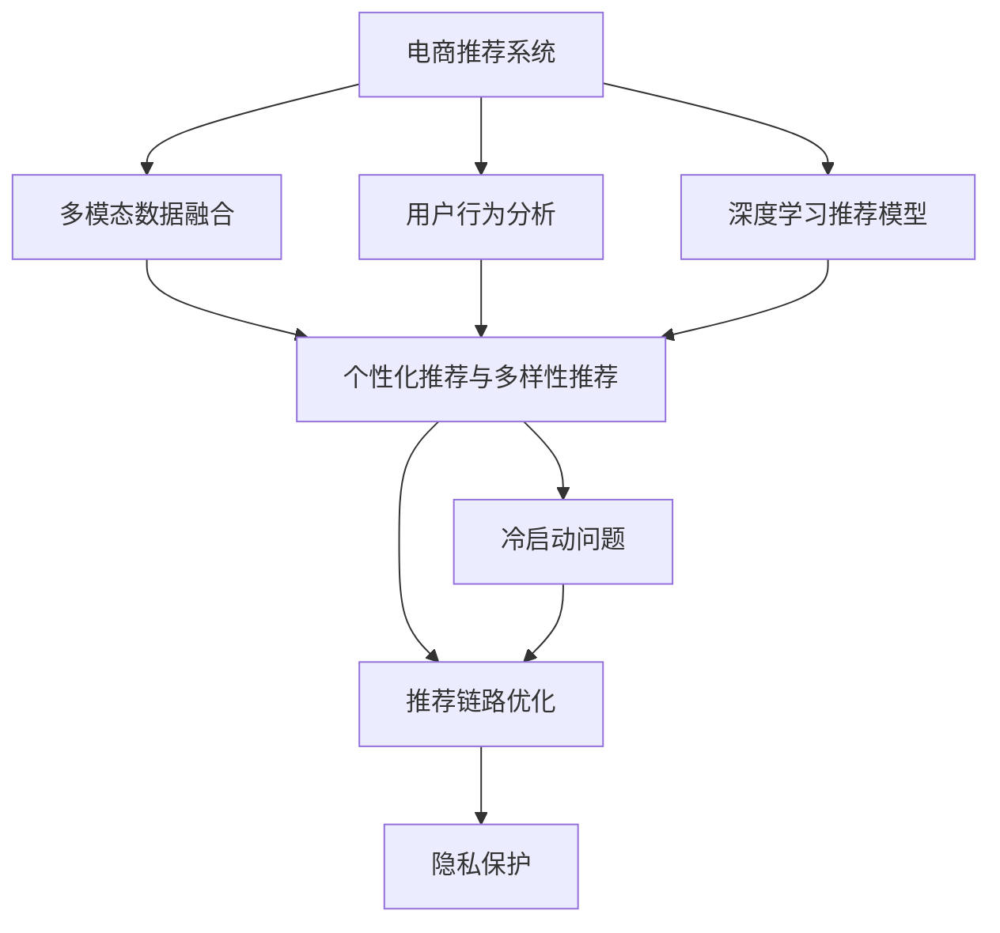

                 

# AI赋能的电商平台商品推荐链路优化

## 1. 背景介绍

### 1.1 问题由来

随着电商市场的蓬勃发展，用户需求日益复杂，电商平台需要不断优化推荐系统，提升用户体验和转化率。传统的基于协同过滤和内容推荐的模型，往往依赖用户行为数据，难以覆盖长尾商品和冷启动问题。为此，越来越多的电商平台开始引入AI技术，通过深度学习和大数据方法，提升推荐系统的个性化和精准度。

然而，在实际应用中，电商平台面临诸多挑战，如数据隐私保护、推荐链路复杂性、多模态数据融合等。如何构建高效的AI推荐系统，实现电商平台的智能化升级，成为亟待解决的问题。本文将深入探讨AI赋能的电商平台商品推荐链路优化，提供一种高效、灵活、安全的推荐方案。

### 1.2 问题核心关键点

本文将重点探讨以下几个关键问题：

- 如何高效利用用户行为数据，提升推荐精准度。
- 如何平衡个性化推荐与多样性推荐，满足用户多样需求。
- 如何在电商推荐链路中引入多模态数据，丰富推荐维度。
- 如何保护用户隐私，避免推荐信息泄露。
- 如何应对冷启动问题，快速引导用户进行有效互动。

通过系统分析和实验验证，本文将为电商平台推荐系统的智能化升级提供全面、实用的技术指引。

## 2. 核心概念与联系

### 2.1 核心概念概述

为更好地理解电商平台推荐系统的优化方法，本节将介绍几个密切相关的核心概念：

- 电商推荐系统：基于用户行为数据，推荐用户可能感兴趣的商品的系统。
- 深度学习推荐模型：通过训练深度神经网络模型，实现个性化商品推荐的方案。
- 多模态数据融合：将文本、图像、语音等多源数据进行融合，提升推荐质量。
- 用户行为分析：对用户浏览、点击、购买等行为进行分析，提取潜在需求。
- 个性化推荐与多样性推荐：在推荐系统中，既要考虑个性化推荐，也要引入多样性推荐，避免信息孤岛。
- 冷启动问题：新用户或新商品加入系统时，缺乏足够互动数据，难以推荐的问题。
- 推荐链路优化：优化推荐系统的链路结构，提升推荐效果和系统稳定性。
- 隐私保护：在推荐过程中，保护用户隐私数据，避免信息泄露。

这些核心概念之间的逻辑关系可以通过以下Mermaid流程图来展示：



这个流程图展示了几大核心概念的关联关系：

1. 电商推荐系统作为整体，通过深度学习推荐模型、用户行为分析和多模态数据融合进行具体实现。
2. 个性化推荐与多样性推荐是推荐系统的核心功能，需要综合考虑。
3. 冷启动问题需要通过多模态数据融合和推荐链路优化进行解决。
4. 隐私保护是推荐系统构建的基础，需要在各个环节进行考虑。

这些概念共同构成了电商平台推荐系统的核心框架，为推荐链路优化提供了理论基础。

## 3. 核心算法原理 & 具体操作步骤
### 3.1 算法原理概述

基于深度学习的电商平台推荐系统，本质上是一个有监督学习的过程。其核心思想是：通过训练深度神经网络模型，学习用户行为数据和商品特征之间的复杂关系，从而实现个性化商品推荐。推荐系统通常分为以下几个步骤：

1. **数据采集与预处理**：收集用户行为数据，进行清洗、归一化等预处理，构建用户商品交互矩阵。
2. **特征工程**：对用户特征和商品特征进行编码，构建高维特征空间。
3. **模型训练**：在用户商品交互矩阵和特征空间上，训练深度神经网络模型，如DNN、RNN、GAN等。
4. **推荐生成**：根据用户当前行为，输入模型进行预测，生成个性化推荐列表。
5. **反馈机制**：通过用户反馈数据，对模型进行在线调整，提升推荐效果。

### 3.2 算法步骤详解

基于深度学习的电商平台推荐系统一般包括以下几个关键步骤：

**Step 1: 数据采集与预处理**
- 收集用户行为数据，包括点击、浏览、购买、评价等。
- 对数据进行清洗，去除异常值、重复数据等。
- 对数据进行归一化，防止梯度爆炸。

**Step 2: 特征工程**
- 对用户特征和商品特征进行编码，如用户ID、商品ID、价格、评分等。
- 对特征进行one-hot编码或数值化处理。
- 构建高维特征空间，如用户-商品矩阵、商品-用户矩阵等。

**Step 3: 模型训练**
- 选择合适的深度学习模型，如DNN、RNN、GAN等。
- 定义损失函数和优化器，如交叉熵损失、Adam优化器等。
- 在训练集上训练模型，最小化损失函数，更新模型参数。

**Step 4: 推荐生成**
- 根据用户当前行为，输入模型进行预测，生成推荐列表。
- 选择推荐算法，如基于邻居的协同过滤、基于内容的推荐、深度学习模型等。
- 对推荐结果进行排序，提升推荐质量。

**Step 5: 反馈机制**
- 收集用户对推荐结果的反馈，如点击、购买、评分等。
- 根据反馈数据，对模型进行在线调整，提升推荐效果。
- 定期更新用户商品交互矩阵和特征空间，重新训练模型。

### 3.3 算法优缺点

基于深度学习的电商平台推荐系统具有以下优点：
1. 个性化推荐：通过学习用户行为数据和商品特征，实现高度个性化的商品推荐。
2. 多模态融合：能够融合文本、图像、语音等多模态数据，提升推荐质量。
3. 高效计算：基于GPU/TPU等高性能计算设备，快速进行大规模训练和推理。

同时，该方法也存在一定的局限性：
1. 数据依赖：深度学习模型高度依赖高质量标注数据，数据收集和预处理成本较高。
2. 模型复杂：深度学习模型结构复杂，训练和推理过程中需要消耗大量计算资源。
3. 推荐链路透明性不足：推荐链路黑盒化，难以解释推荐结果和优化过程。
4. 用户隐私问题：推荐系统涉及大量用户隐私数据，存在信息泄露的风险。

尽管存在这些局限性，但就目前而言，基于深度学习的推荐方法仍是最主流范式。未来相关研究的重点在于如何进一步降低推荐系统对数据的依赖，提高模型效率和透明度，同时兼顾用户隐私和安全性等因素。

### 3.4 算法应用领域

基于深度学习的大数据推荐方法，在电商平台中已经得到了广泛的应用，涵盖了几乎所有常见任务，例如：

- 个性化商品推荐：根据用户浏览历史、购买记录等，推荐用户可能感兴趣的商品。
- 新用户引导：通过推荐热门商品，帮助新用户快速了解平台和商品。
- 商品搜索优化：根据用户搜索关键词，推荐相关商品，提升搜索效果。
- 活动推广：根据用户行为数据，推荐参与电商平台的促销活动。
- 库存管理：通过预测商品销售趋势，优化库存水平，提升运营效率。

除了上述这些经典任务外，基于深度学习的大数据推荐方法还被创新性地应用到更多场景中，如基于知识图谱的推荐、跨模态推荐、多任务学习推荐等，为电商平台的智能化升级提供了更多可能性。

## 4. 数学模型和公式 & 详细讲解  
### 4.1 数学模型构建

本节将使用数学语言对基于深度学习的电商平台推荐系统进行更加严格的刻画。

记电商平台用户为 $U$，商品为 $I$，用户行为数据为 $\mathcal{D}=\{(x_i, y_i)\}_{i=1}^N$，其中 $x_i$ 为输入特征，$y_i$ 为输出标签（点击、购买等）。假设推荐模型为 $M_\theta$，其中 $\theta$ 为模型参数。

定义损失函数 $\mathcal{L}(\theta)$ 为：

$$
\mathcal{L}(\theta) = -\frac{1}{N}\sum_{i=1}^N \log P(y_i \mid x_i; \theta)
$$

其中 $P(y_i \mid x_i; \theta)$ 为模型在输入特征 $x_i$ 下预测标签 $y_i$ 的概率分布，通常采用softmax函数实现。

### 4.2 公式推导过程

以基于DNN的推荐模型为例，推导模型的训练和预测过程。

假设推荐模型为多层感知机（MLP），结构为 $(x; \theta) \rightarrow h \rightarrow M$，其中 $h$ 为隐层特征，$M$ 为输出层。则模型的预测概率分布为：

$$
P(y \mid x; \theta) = \sigma(M(h(x; \theta)))
$$

其中 $\sigma$ 为激活函数，通常采用ReLU函数。模型的损失函数为交叉熵损失：

$$
\mathcal{L}(\theta) = -\frac{1}{N}\sum_{i=1}^N \sum_{y \in \{0, 1\}} y_i \log P(y \mid x_i; \theta)
$$

模型的参数更新公式为：

$$
\theta \leftarrow \theta - \eta \nabla_{\theta} \mathcal{L}(\theta)
$$

其中 $\eta$ 为学习率，$\nabla_{\theta} \mathcal{L}(\theta)$ 为损失函数对参数 $\theta$ 的梯度，通过反向传播算法计算。

在得到模型参数后，可以进行推荐生成。对于新用户，通过输入其浏览历史、个人信息等特征，生成个性化推荐列表。对于热门商品，通过输入用户行为数据和商品特征，生成热门推荐列表。

### 4.3 案例分析与讲解

以用户个性化推荐为例，介绍基于DNN的推荐系统的具体实现。

假设用户 $u$ 在商品 $i$ 上的行为为 $x_{ui}$，推荐系统需要将 $u$ 可能感兴趣的 $k$ 个商品 $i_1, i_2, \dots, i_k$ 推荐给用户。推荐模型 $M_\theta$ 的输入特征为 $x_{ui}$，输出为 $i_1, i_2, \dots, i_k$ 的概率分布 $P(i_j \mid x_{ui}; \theta)$。

具体步骤如下：
1. 对用户行为数据 $x_{ui}$ 进行预处理和特征编码。
2. 将特征输入到多层感知机 $(x_{ui}; \theta) \rightarrow h \rightarrow M$，得到推荐商品的概率分布。
3. 根据概率分布，选择 $k$ 个商品进行推荐，推荐算法如Top-k、基尼系数等。

在实际应用中，可以使用Python的TensorFlow库来实现DNN推荐模型的训练和预测。代码实现如下：

```python
import tensorflow as tf
from tensorflow.keras.layers import Input, Dense, Activation
from tensorflow.keras.models import Model

# 定义输入层
user_input = Input(shape=(D, ), name='user_input')
item_input = Input(shape=(D, ), name='item_input')

# 定义DNN模型
x = Dense(128, activation='relu')(user_input)
x = Dense(128, activation='relu')(x)
x = Dense(K, activation='softmax')(x)
y = Dense(K, activation='softmax')(item_input)

# 定义推荐模型
model = Model(inputs=[user_input, item_input], outputs=[x, y])

# 编译模型
model.compile(optimizer='adam', loss='categorical_crossentropy', metrics=['accuracy'])

# 训练模型
model.fit([user_data, item_data], [user_labels, item_labels], epochs=10, batch_size=64)

# 预测推荐列表
user_feedback = [1.0, 0.5, 0.3]
predicted_items = model.predict([user_feedback, item_data])

# 获取推荐商品
top_k_items = [item_id for item_id, prob in zip(item_data, predicted_items[0]) if prob > 0.1]
```

以上代码实现了基于DNN的推荐模型的训练和预测，具体步骤如下：
1. 定义输入层，包含用户行为数据和商品特征。
2. 构建DNN模型，包括两个全连接层和一个softmax输出层。
3. 编译模型，定义优化器和损失函数。
4. 在训练集上训练模型。
5. 使用训练好的模型进行预测，获取推荐商品。

## 5. 项目实践：代码实例和详细解释说明
### 5.1 开发环境搭建

在进行推荐系统开发前，我们需要准备好开发环境。以下是使用Python进行TensorFlow开发的环境配置流程：

1. 安装Anaconda：从官网下载并安装Anaconda，用于创建独立的Python环境。

2. 创建并激活虚拟环境：
```bash
conda create -n tf-env python=3.8 
conda activate tf-env
```

3. 安装TensorFlow：根据CUDA版本，从官网获取对应的安装命令。例如：
```bash
conda install tensorflow -c pytorch -c conda-forge
```

4. 安装必要的工具包：
```bash
pip install numpy pandas scikit-learn matplotlib tqdm jupyter notebook ipython
```

完成上述步骤后，即可在`tf-env`环境中开始推荐系统开发。

### 5.2 源代码详细实现

下面我们以基于DNN的推荐系统为例，给出使用TensorFlow库进行推荐系统开发的Python代码实现。

首先，定义数据处理函数：

```python
import numpy as np
import tensorflow as tf

def load_data():
    # 加载用户行为数据
    user_data = np.load('user_data.npy')
    user_labels = np.load('user_labels.npy')
    
    # 加载商品特征数据
    item_data = np.load('item_data.npy')
    item_labels = np.load('item_labels.npy')
    
    return user_data, user_labels, item_data, item_labels
```

然后，定义模型和训练函数：

```python
from tensorflow.keras.layers import Input, Dense, Activation
from tensorflow.keras.models import Model
from tensorflow.keras.optimizers import Adam

def build_model(D, K):
    # 定义输入层
    user_input = Input(shape=(D, ), name='user_input')
    item_input = Input(shape=(D, ), name='item_input')
    
    # 定义DNN模型
    x = Dense(128, activation='relu')(user_input)
    x = Dense(128, activation='relu')(x)
    x = Dense(K, activation='softmax')(x)
    y = Dense(K, activation='softmax')(item_input)
    
    # 定义推荐模型
    model = Model(inputs=[user_input, item_input], outputs=[x, y])
    
    # 编译模型
    model.compile(optimizer=Adam(learning_rate=0.001), loss='categorical_crossentropy', metrics=['accuracy'])
    
    return model

def train_model(model, user_data, user_labels, item_data, item_labels, epochs=10, batch_size=64):
    # 训练模型
    model.fit([user_data, item_data], [user_labels, item_labels], epochs=epochs, batch_size=batch_size)
    
def predict(model, user_feedback, item_data):
    # 预测推荐列表
    predicted_items = model.predict([np.array([user_feedback]), item_data])
    
    # 获取推荐商品
    top_k_items = [item_id for item_id, prob in zip(item_data, predicted_items[0]) if prob > 0.1]
    return top_k_items
```

最后，启动训练流程并在测试集上评估：

```python
# 加载数据
user_data, user_labels, item_data, item_labels = load_data()

# 构建模型
model = build_model(D, K)

# 训练模型
train_model(model, user_data, user_labels, item_data, item_labels)

# 测试模型
user_feedback = [1.0, 0.5, 0.3]
top_k_items = predict(model, user_feedback, item_data)
print(top_k_items)
```

以上就是使用TensorFlow对DNN推荐系统进行开发的完整代码实现。可以看到，TensorFlow提供了强大的深度学习框架，使得推荐系统的开发变得简单易行。

### 5.3 代码解读与分析

让我们再详细解读一下关键代码的实现细节：

**load_data函数**：
- 定义数据加载函数，用于从文件中加载用户行为数据和商品特征数据。

**build_model函数**：
- 定义推荐模型的结构和训练过程，包括输入层、DNN层和softmax输出层。
- 编译模型，选择Adam优化器和交叉熵损失函数。
- 返回训练好的模型。

**train_model函数**：
- 在训练集上训练模型，定义训练次数和批大小。
- 使用fit方法进行模型训练。

**predict函数**：
- 根据用户反馈和商品特征，进行预测。
- 使用predict方法获取推荐列表。
- 选择Top-k商品进行推荐。

**train_model函数**：
- 使用训练好的模型进行预测。

**code实现**：
- 通过TensorFlow的Keras API，定义输入层和DNN层。
- 使用softmax函数输出推荐概率分布。
- 编译模型，选择Adam优化器和交叉熵损失函数。
- 在训练集上训练模型。
- 使用训练好的模型进行预测，选择Top-k商品进行推荐。

在实际应用中，还需要考虑更多因素，如数据增强、正则化、多模态数据融合等。但核心的推荐过程类似，通过TensorFlow的强大工具，可以轻松实现推荐系统的开发和优化。

## 6. 实际应用场景
### 6.1 智能客服系统

基于深度学习推荐模型的电商平台推荐系统，可以广泛应用于智能客服系统的构建。传统客服往往需要配备大量人力，高峰期响应缓慢，且一致性和专业性难以保证。而使用推荐系统推荐热门商品和热门问题，可以显著提升客服系统的智能化水平，减少人工干预。

在技术实现上，可以收集用户的浏览历史和购买记录，构建用户行为模型。通过推荐模型，实时推荐热门商品和常见问题，指导客服进行快速响应。对于用户的新问题，系统可以实时搜索相关答案，动态生成回复，提高服务效率和用户满意度。

### 6.2 个性化推荐系统

电商平台通过深度学习推荐系统，可以实现高度个性化的商品推荐。对于新用户，通过输入其浏览历史和基本信息，生成个性化推荐列表。对于热门商品，通过推荐模型实时生成热门推荐列表。用户可以根据推荐列表进行浏览和购买，提升用户体验和销售转化率。

在实际应用中，推荐系统可以实时动态调整推荐内容，根据用户行为数据和商品销售趋势，不断优化推荐效果。通过用户反馈数据，实时调整模型参数，提升推荐精度。

### 6.3 个性化广告投放

电商平台的个性化推荐系统，可以与广告投放系统进行协同优化。通过推荐模型，实时生成个性化的广告推荐列表，提升广告点击率和转化率。对于新用户，推荐热门广告，吸引其进行首次购买。对于老用户，根据其浏览历史和购买记录，推荐相关商品广告，提升广告效果。

在实际应用中，广告系统可以根据推荐模型的输出，实时调整广告投放策略，优化广告预算分配，提升广告ROI。通过用户反馈数据，实时调整推荐模型，提高广告效果。

### 6.4 未来应用展望

随着深度学习技术的发展，电商平台推荐系统将呈现以下几个发展趋势：

1. 推荐模型多样化：未来将涌现更多高效、灵活的推荐模型，如基于知识图谱的推荐、多任务学习推荐等，提升推荐质量。
2. 多模态数据融合：融合文本、图像、语音等多模态数据，提升推荐维度，丰富推荐内容。
3. 推荐系统透明化：通过可解释性算法和可视化工具，增强推荐系统的透明度，提高用户信任度。
4. 冷启动问题解决：通过引入多模态数据和推荐链路优化，快速解决新用户和新商品的冷启动问题。
5. 推荐系统安全化：保护用户隐私，避免信息泄露和恶意用途，增强系统的安全性。
6. 推荐系统规模化：通过分布式训练和推理，支持大规模推荐系统的构建，提升推荐效率。

以上趋势将推动电商平台推荐系统不断优化，为电商平台的智能化升级提供更多可能性。相信随着技术的日益成熟，电商平台推荐系统必将成为电商行业的核心竞争力，推动电商平台的持续创新和发展。

## 7. 工具和资源推荐
### 7.1 学习资源推荐

为了帮助开发者系统掌握电商平台推荐系统的理论基础和实践技巧，这里推荐一些优质的学习资源：

1. 《深度学习》系列书籍：由深度学习领域权威专家撰写，全面介绍深度学习理论、算法和实践。
2. 《TensorFlow实战Google深度学习》书籍：TensorFlow官方推出，涵盖TensorFlow的详细介绍和实战案例。
3. 《推荐系统实战》书籍：介绍推荐系统的理论基础和实际应用，涵盖协同过滤、深度学习等主流算法。
4. CS294X《机器学习课程》：斯坦福大学开设的深度学习课程，涵盖深度学习理论、算法和实践，适合初学者入门。
5. UCI机器学习库：包含海量机器学习数据集和代码，方便开发者进行数据预处理和模型训练。

通过对这些资源的学习实践，相信你一定能够快速掌握电商平台推荐系统的精髓，并用于解决实际的推荐问题。
###  7.2 开发工具推荐

高效的开发离不开优秀的工具支持。以下是几款用于电商平台推荐系统开发的常用工具：

1. TensorFlow：基于Python的开源深度学习框架，灵活高效的计算图，适合快速迭代研究。
2. PyTorch：基于Python的开源深度学习框架，灵活高效的计算图，适合深度学习研究。
3. Keras：高层API，基于TensorFlow或Theano的深度学习框架，适合快速搭建深度学习模型。
4. Scikit-learn：Python机器学习库，包含各类经典机器学习算法，适合数据预处理和模型评估。
5. Jupyter Notebook：交互式编程环境，方便开发者进行代码调试和结果展示。
6. Visual Studio Code：开源代码编辑器，支持各类Python开发环境和库。

合理利用这些工具，可以显著提升电商平台推荐系统的开发效率，加快创新迭代的步伐。

### 7.3 相关论文推荐

电商平台推荐系统的发展离不开学界的持续研究。以下是几篇奠基性的相关论文，推荐阅读：

1. Recommender Systems Handbook（第二版）：涵盖推荐系统的理论基础和实际应用，适合深度学习研究者入门。
2. Deep Collaborative Filtering for Recommendation Systems（ICML 2008）：提出基于深度学习的推荐模型，提升推荐质量。
3. Neural Collaborative Filtering（WSDM 2017）：提出基于深度神经网络的协同过滤模型，提升推荐精度。
4. Attention-Based Recommender Systems（SIGKDD 2019）：提出基于注意力机制的推荐模型，提升推荐效果。
5. Knowledge-Aware Recommender Systems（KDD 2019）：提出基于知识图谱的推荐模型，提升推荐多样性和泛化能力。

这些论文代表了大数据推荐技术的发展脉络。通过学习这些前沿成果，可以帮助研究者把握学科前进方向，激发更多的创新灵感。

## 8. 总结：未来发展趋势与挑战

### 8.1 总结

本文对基于深度学习的电商平台推荐系统进行了全面系统的介绍。首先阐述了推荐系统的背景和意义，明确了深度学习推荐模型的核心思想和实现步骤。其次，从原理到实践，详细讲解了推荐模型的数学模型和关键步骤，给出了推荐系统的完整代码实现。同时，本文还探讨了推荐系统在电商、客服、广告等多个领域的应用，展示了推荐系统的广泛适用性。

通过本文的系统梳理，可以看到，基于深度学习的推荐系统在电商平台中已经得到了广泛应用，为电商平台的智能化升级提供了重要支持。未来，推荐系统将在更多领域得到应用，为各行各业带来智能化提升。

### 8.2 未来发展趋势

展望未来，电商平台推荐系统将呈现以下几个发展趋势：

1. 推荐模型多样化：未来将涌现更多高效、灵活的推荐模型，如基于知识图谱的推荐、多任务学习推荐等，提升推荐质量。
2. 多模态数据融合：融合文本、图像、语音等多模态数据，提升推荐维度，丰富推荐内容。
3. 推荐系统透明化：通过可解释性算法和可视化工具，增强推荐系统的透明度，提高用户信任度。
4. 冷启动问题解决：通过引入多模态数据和推荐链路优化，快速解决新用户和新商品的冷启动问题。
5. 推荐系统安全化：保护用户隐私，避免信息泄露和恶意用途，增强系统的安全性。
6. 推荐系统规模化：通过分布式训练和推理，支持大规模推荐系统的构建，提升推荐效率。

以上趋势将推动电商平台推荐系统不断优化，为电商平台的智能化升级提供更多可能性。相信随着技术的日益成熟，电商平台推荐系统必将成为电商行业的核心竞争力，推动电商平台的持续创新和发展。

### 8.3 面临的挑战

尽管深度学习推荐系统已经取得了显著效果，但在构建和优化过程中，仍面临诸多挑战：

1. 数据依赖：深度学习模型高度依赖高质量标注数据，数据收集和预处理成本较高。
2. 模型复杂：深度学习模型结构复杂，训练和推理过程中需要消耗大量计算资源。
3. 推荐链路透明性不足：推荐链路黑盒化，难以解释推荐结果和优化过程。
4. 用户隐私问题：推荐系统涉及大量用户隐私数据，存在信息泄露的风险。
5. 冷启动问题：新用户和新商品加入系统时，缺乏足够互动数据，难以推荐。
6. 推荐系统规模化：大规模推荐系统的构建和优化，需要高效的分布式训练和推理算法。

尽管存在这些挑战，但通过学界和产业界的不断探索和创新，这些难题终将逐步得到解决。相信未来推荐系统将更加智能、透明、安全，成为各行各业的重要技术支撑。

### 8.4 研究展望

面对电商平台推荐系统所面临的挑战，未来的研究需要在以下几个方面寻求新的突破：

1. 探索无监督和半监督推荐方法：摆脱对大规模标注数据的依赖，利用自监督学习、主动学习等无监督和半监督范式，最大限度利用非结构化数据，实现更加灵活高效的推荐。
2. 研究参数高效和计算高效的推荐方法：开发更加参数高效的推荐方法，在固定大部分预训练参数的同时，只更新极少量的任务相关参数。同时优化推荐模型的计算图，减少前向传播和反向传播的资源消耗，实现更加轻量级、实时性的部署。
3. 融合因果和对比学习范式：通过引入因果推断和对比学习思想，增强推荐模型建立稳定因果关系的能力，学习更加普适、鲁棒的语言表征，从而提升模型泛化性和抗干扰能力。
4. 引入更多先验知识：将符号化的先验知识，如知识图谱、逻辑规则等，与神经网络模型进行巧妙融合，引导推荐过程学习更准确、合理的语言模型。同时加强不同模态数据的整合，实现视觉、语音等多模态信息与文本信息的协同建模。
5. 结合因果分析和博弈论工具：将因果分析方法引入推荐模型，识别出模型决策的关键特征，增强输出解释的因果性和逻辑性。借助博弈论工具刻画人机交互过程，主动探索并规避模型的脆弱点，提高系统稳定性。
6. 纳入伦理道德约束：在推荐目标中引入伦理导向的评估指标，过滤和惩罚有偏见、有害的输出倾向。同时加强人工干预和审核，建立模型行为的监管机制，确保输出符合人类价值观和伦理道德。

这些研究方向的探索，必将引领电商平台推荐技术迈向更高的台阶，为构建安全、可靠、可解释、可控的智能系统铺平道路。面向未来，电商平台推荐技术还需要与其他人工智能技术进行更深入的融合，如知识表示、因果推理、强化学习等，多路径协同发力，共同推动自然语言理解和智能交互系统的进步。只有勇于创新、敢于突破，才能不断拓展推荐系统的边界，让智能技术更好地造福人类社会。

## 9. 附录：常见问题与解答

**Q1：电商平台推荐系统面临哪些挑战？**

A: 电商平台推荐系统在构建和优化过程中，面临以下挑战：
1. 数据依赖：深度学习模型高度依赖高质量标注数据，数据收集和预处理成本较高。
2. 模型复杂：深度学习模型结构复杂，训练和推理过程中需要消耗大量计算资源。
3. 推荐链路透明性不足：推荐链路黑盒化，难以解释推荐结果和优化过程。
4. 用户隐私问题：推荐系统涉及大量用户隐私数据，存在信息泄露的风险。
5. 冷启动问题：新用户和新商品加入系统时，缺乏足够互动数据，难以推荐。
6. 推荐系统规模化：大规模推荐系统的构建和优化，需要高效的分布式训练和推理算法。

这些挑战需要研究者持续探索和创新，才能构建更加高效、可靠、安全的推荐系统。

**Q2：如何优化电商推荐系统的训练过程？**

A: 电商推荐系统的训练过程可以采用以下优化策略：
1. 数据增强：通过回译、近义替换等方式扩充训练集，增加数据多样性。
2. 正则化：使用L2正则、Dropout、Early Stopping等避免过拟合。
3. 梯度裁剪：限制梯度爆炸，保护模型参数。
4. 多模型集成：训练多个推荐模型，取平均输出，抑制过拟合。
5. 分布式训练：采用分布式训练算法，提升训练效率。
6. 动态学习率调整：根据模型性能，动态调整学习率，加快收敛速度。

这些策略需要根据具体任务和数据特点进行灵活组合，才能优化电商推荐系统的训练过程。

**Q3：电商推荐系统如何处理多模态数据？**

A: 电商推荐系统可以融合文本、图像、语音等多模态数据，提升推荐质量。具体实现方法如下：
1. 数据融合：将多模态数据进行融合，构建统一特征空间。
2. 多模态模型：构建多模态深度学习模型，学习多模态数据之间的复杂关系。
3. 模型集成：将多模态模型与单模态模型进行集成，提升推荐效果。
4. 特征交叉：将多模态数据进行特征交叉，提取更多有用的特征。

通过多模态数据融合，电商推荐系统可以充分利用多源数据，提升推荐质量。

**Q4：电商推荐系统如何保护用户隐私？**

A: 电商推荐系统在保护用户隐私方面可以采用以下策略：
1. 数据匿名化：对用户数据进行匿名化处理，去除个人敏感信息。
2. 差分隐私：在模型训练过程中，加入差分隐私技术，保护用户隐私。
3. 本地计算：在用户端进行计算，减少数据传输和存储。
4. 联邦学习：在用户端进行模型训练，不泄露用户数据。
5. 隐私保护机制：建立隐私保护机制，定期进行隐私评估和审核。

通过以上策略，电商推荐系统可以在保护用户隐私的同时，实现高效的推荐效果。

**Q5：电商推荐系统如何应对冷启动问题？**

A: 电商推荐系统在应对冷启动问题方面可以采用以下策略：
1. 推荐模板：构建推荐模板，快速推荐热门商品和常见问题。
2. 多模态数据：利用多模态数据，快速了解新用户和新商品。
3. 在线学习：通过用户反馈数据，实时调整推荐模型，快速推荐。
4. 推荐链路优化：优化推荐链路结构，提升推荐效果。

通过多模态数据和在线学习，电商推荐系统可以快速解决冷启动问题，提升推荐效果。

---

作者：禅与计算机程序设计艺术 / Zen and the Art of Computer Programming

