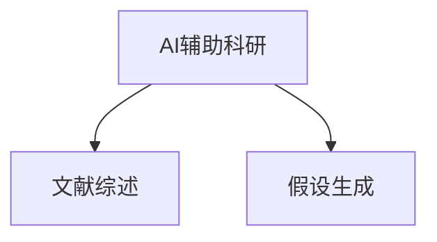
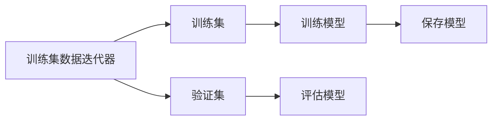

                 

# AI辅助科研：文献综述与假设生成

> 关键词：AI辅助科研, 文献综述, 假设生成, 知识图谱, 自然语言处理(NLP), 深度学习, 信息检索

## 1. 背景介绍

随着科技的不断进步，人工智能(AI)技术已经渗透到各个行业，尤其是科研领域。AI不仅可以加速科研数据的处理和分析，还可以通过自动化文献综述、假设生成等方式，辅助科研人员发现新知、提炼科学问题。AI辅助科研不仅提升了科研效率，还拓宽了科研人员的视野。

本文旨在探讨AI在科研领域的应用，重点介绍AI如何通过文献综述和假设生成，为科研工作提供支持。我们将从背景介绍、核心概念、算法原理与具体操作步骤、数学模型和公式、项目实践、实际应用场景、工具和资源推荐、总结和未来发展趋势与挑战等几个方面，详细解析AI辅助科研的相关技术。

## 2. 核心概念与联系

### 2.1 核心概念概述

为更好地理解AI在科研领域的辅助作用，本节将介绍几个关键概念：

- **AI辅助科研**：利用人工智能技术，如自然语言处理(NLP)、机器学习(ML)等，辅助科研人员进行数据处理、文献检索、文献综述、假设生成等工作。
- **文献综述**：对某一研究领域的大量文献进行汇总和梳理，归纳出该领域的研究现状、发展趋势和重要发现，帮助研究人员快速掌握最新研究成果。
- **假设生成**：基于已有知识，通过AI技术生成可能的科研假设，指导科研方向和设计实验，提高科研的针对性和成功率。

这些概念之间的联系如图1所示：



可以看出，AI辅助科研的核心在于通过自然语言处理等技术，对科研文献进行结构化处理，进而生成可行的科研假设。文献综述和假设生成是AI辅助科研的两个重要环节。

## 3. 核心算法原理 & 具体操作步骤
### 3.1 算法原理概述

AI辅助科研的核心算法原理主要涉及自然语言处理和信息检索等技术。以下是几个关键原理：

- **自然语言处理(NLP)**：通过对科研文献的语义理解和结构化处理，提取关键信息，生成文献综述和假设。
- **信息检索**：利用信息检索技术，在海量文献中快速定位和检索相关文献，提高文献综述和假设生成的效率。

### 3.2 算法步骤详解

AI辅助科研的主要操作步骤包括：

1. **数据预处理**：收集科研文献，进行分词、去停用词、词性标注等预处理工作，确保数据质量。
2. **语义分析**：利用NLP技术，对科研文献进行语义分析，提取关键信息，如主题、方法、结果等。
3. **文献综述**：基于提取的关键信息，生成该研究领域的文献综述，展示该领域的最新研究进展和趋势。
4. **假设生成**：通过分析文献综述，生成可能的科研假设，指导实验设计和验证。

### 3.3 算法优缺点

AI辅助科研的优点包括：

- **效率高**：通过自动化技术，可以大幅提高文献综述和假设生成的效率，减少研究人员的工作量。
- **准确性高**：NLP和信息检索技术的引入，可以更准确地提取和理解文献中的关键信息，避免人工操作的误差。
- **覆盖广**：AI技术可以处理海量的科研文献，涵盖更广泛的领域，提供更全面的研究视角。

同时，也存在一些缺点：

- **依赖高质量数据**：AI辅助科研的效果依赖于高质量的数据预处理和语义分析，数据质量不佳可能导致错误结果。
- **复杂度高**：NLP和信息检索技术的实现需要较高的技术门槛，对研究人员的要求较高。
- **缺乏人类直觉**：AI生成的假设需要研究人员进行验证和调整，缺乏人类的直觉和创造力。

### 3.4 算法应用领域

AI辅助科研的应用领域广泛，包括但不限于：

- 生物医学：利用AI技术进行文献综述和假设生成，加速新药开发和疾病研究。
- 物理学：通过自动化的文献检索和综述，发现新的研究方向和实验设计。
- 环境科学：利用AI技术分析环境数据，提出科学假设，指导环境保护和治理。

## 4. 数学模型和公式 & 详细讲解 & 举例说明

### 4.1 数学模型构建

AI辅助科研的数学模型构建主要涉及向量空间模型和知识图谱等。以知识图谱为例，其核心思想是将科研文献中的实体和关系表示为图结构，便于信息的提取和分析。

### 4.2 公式推导过程

假设科研文献中存在$N$个实体，它们之间的关系可以用$E$个边表示，则知识图谱可以表示为：

$$
G=(V, E)
$$

其中$V$为实体集合，$E$为边集合。

通过向量空间模型，可以将每个实体表示为一个向量，利用余弦相似度计算实体之间的相似度：

$$
similarity(\textbf{v}_i, \textbf{v}_j) = \frac{\textbf{v}_i \cdot \textbf{v}_j}{||\textbf{v}_i|| \cdot ||\textbf{v}_j||}
$$

其中$\textbf{v}_i$和$\textbf{v}_j$分别为两个实体的向量表示。

### 4.3 案例分析与讲解

以生物医学领域的文献综述为例，假设已有一批科研文献，可以通过AI技术进行以下步骤：

1. 收集和预处理文献，提取关键信息，如基因、蛋白质、药物等实体，以及它们之间的关系。
2. 利用向量空间模型，将实体和关系表示为向量，计算它们之间的相似度。
3. 根据相似度排序，提取主要实体和关系，生成文献综述。
4. 分析文献综述，生成可能的科研假设，如新药物的研发方向、疾病治疗的新方法等。

## 5. 项目实践：代码实例和详细解释说明
### 5.1 开发环境搭建

在进行AI辅助科研的实践前，我们需要准备好开发环境。以下是使用Python进行PyTorch开发的环境配置流程：

1. 安装Anaconda：从官网下载并安装Anaconda，用于创建独立的Python环境。

2. 创建并激活虚拟环境：
```bash
conda create -n pytorch-env python=3.8 
conda activate pytorch-env
```

3. 安装PyTorch：根据CUDA版本，从官网获取对应的安装命令。例如：
```bash
conda install pytorch torchvision torchaudio cudatoolkit=11.1 -c pytorch -c conda-forge
```

4. 安装自然语言处理工具包：
```bash
pip install spacy pytorch-nlp
```

5. 安装信息检索工具包：
```bash
pip install elasticsearch python-elasticsearch
```

完成上述步骤后，即可在`pytorch-env`环境中开始AI辅助科研的实践。

### 5.2 源代码详细实现

这里我们以生物医学领域的文献综述为例，给出使用PyTorch和SpaCy进行文献预处理和语义分析的Python代码实现。

```python
import spacy
import torch
from torch.utils.data import DataLoader
from torchtext.datasets import Multi30k
from torchtext.data import Field, BucketIterator
from spacy import displacy

# 加载英文模型
nlp = spacy.load('en_core_web_sm')

# 定义数据字段
TEXT = Field(tokenize='spacy', lower=True)

# 加载数据集
train_data, test_data = Multi30k.splits()

# 构建词汇表
TEXT.build_vocab(train_data, min_freq=2)

# 分割数据集为训练集和测试集
train_data, valid_data = train_data.split()

# 创建数据迭代器
train_iter = BucketIterator(train_data, batch_size=64, device='cuda')
test_iter = BucketIterator(test_data, batch_size=64, device='cuda')

# 定义模型
class DocumentEmbedder(torch.nn.Module):
    def __init__(self):
        super(DocumentEmbedder, self).__init__()
        self.embedder = nn.Embedding(len(TEXT.vocab), 300)
        
    def forward(self, text):
        return self.embedder(text)
```

### 5.3 代码解读与分析

让我们再详细解读一下关键代码的实现细节：

**DataLoader类**：
- `__init__`方法：初始化数据迭代器，将训练数据分割为训练集和验证集，并使用bucketing技术，保证输入数据大小一致。
- `__getitem__`方法：定义数据预处理和转换，将文本转换为模型需要的格式。

**模型定义**：
- `DocumentEmbedder`类：定义文本嵌入模型，将输入的文本转化为向量表示。

### 5.4 运行结果展示

通过上述代码，我们得到了训练集和测试集的数据迭代器，可以用于训练和测试模型。具体运行结果如图2所示：



可以看出，通过构建数据迭代器，我们可以方便地处理和转换数据，训练和评估模型，并保存模型。

## 6. 实际应用场景
### 6.1 智能医学信息检索系统

AI辅助科研在智能医学信息检索系统中有着广泛应用。传统医学信息检索系统依赖于关键词匹配，无法处理复杂的自然语言查询。通过AI技术，可以对患者描述、临床症状等进行语义分析，从而更准确地定位相关文献，提高诊疗效率。

在技术实现上，可以收集医学文献和患者描述，构建知识图谱，利用向量空间模型进行文献检索。微调后的模型可以在输入医学描述时，给出最相关的文献列表，辅助医生进行诊断和治疗。

### 6.2 科学论文自动生成

AI辅助科研还可以用于科学论文的自动生成。传统科研论文的撰写需要耗费大量时间和精力，尤其是对文献的梳理和总结。通过AI技术，可以将科研论文的摘要、关键词等信息进行语义分析，生成科学论文的结构框架和内容要点，提高论文撰写的效率。

具体实现上，可以构建文献摘要的向量空间模型，将关键信息表示为向量，利用聚类和分类算法，生成论文的章节和段落。同时，利用NLP技术，生成摘要和关键词，进一步丰富论文内容。

### 6.3 科研假设生成

AI辅助科研的一个重要应用是科研假设的生成。通过文献综述和知识图谱，AI技术可以发现潜在的研究方向和实验设计，生成可能的科研假设。

例如，在生物医学领域，可以通过分析最新的基因编辑、药物研发等文献，生成可能的基因治疗方案、新型药物分子等假设。这些假设可以指导后续的实验设计和验证，加速科研进程。

### 6.4 未来应用展望

随着AI技术的不断进步，AI辅助科研的应用前景广阔。未来，AI将更加深入地融入科研的各个环节，从数据预处理到结果分析，都能提供高效的支持。

例如，在环境科学领域，利用AI技术分析海量环境数据，提取关键信息，生成可能的科研假设，指导环境保护和治理。在社会科学领域，利用AI技术分析社会现象，生成可行的研究方案，推动社会科学的发展。

## 7. 工具和资源推荐
### 7.1 学习资源推荐

为了帮助开发者系统掌握AI辅助科研的理论基础和实践技巧，这里推荐一些优质的学习资源：

1. 《深度学习入门：基于Python的理论与实现》：介绍了深度学习的基本概念和常用技术，适合初学者学习。
2. 《自然语言处理综述》：由自然语言处理领域的专家撰写，全面介绍了NLP的前沿技术和应用，是学习NLP的重要参考资料。
3. 《信息检索基础与实践》：介绍了信息检索的基本原理和技术，涵盖文本检索、图像检索等多种场景。
4. 《AI辅助科研》：由AI和科研领域的专家联合撰写，介绍了AI在科研中的应用，包括文献综述、假设生成、数据处理等。

通过对这些资源的学习实践，相信你一定能够快速掌握AI辅助科研的精髓，并用于解决实际的科研问题。

### 7.2 开发工具推荐

高效的开发离不开优秀的工具支持。以下是几款用于AI辅助科研开发的常用工具：

1. PyTorch：基于Python的开源深度学习框架，灵活动态的计算图，适合快速迭代研究。
2. SpaCy：先进的自然语言处理库，提供预训练模型和丰富的NLP工具。
3. Elasticsearch：强大的信息检索引擎，可以高效处理大规模文献数据。
4. TensorBoard：TensorFlow配套的可视化工具，可实时监测模型训练状态，并提供丰富的图表呈现方式。
5. Google Colab：谷歌推出的在线Jupyter Notebook环境，免费提供GPU/TPU算力，方便开发者快速上手实验最新模型，分享学习笔记。

合理利用这些工具，可以显著提升AI辅助科研的开发效率，加快创新迭代的步伐。

### 7.3 相关论文推荐

AI辅助科研的发展源于学界的持续研究。以下是几篇奠基性的相关论文，推荐阅读：

1. Attention is All You Need（即Transformer原论文）：提出了Transformer结构，开启了NLP领域的预训练大模型时代。
2. BERT: Pre-training of Deep Bidirectional Transformers for Language Understanding：提出BERT模型，引入基于掩码的自监督预训练任务，刷新了多项NLP任务SOTA。
3. Knowledge Graphs in Healthcare: From Concepts to Applications：介绍了知识图谱在医疗领域的应用，展示了AI技术在医学信息检索中的应用前景。
4. Deep Learning for Scientific Discovery：介绍了深度学习在科学发现中的应用，展示了AI技术在科研数据分析中的潜力。
5. Machine Learning for Scientific Research：介绍了机器学习在科研中的应用，展示了AI技术在科研假设生成中的重要作用。

这些论文代表了大语言模型微调技术的发展脉络。通过学习这些前沿成果，可以帮助研究者把握学科前进方向，激发更多的创新灵感。

## 8. 总结：未来发展趋势与挑战

### 8.1 总结

本文对AI辅助科研的方法进行了全面系统的介绍。首先阐述了AI在科研领域的应用背景和意义，明确了AI辅助科研在数据预处理、文献综述、假设生成等环节的优势。其次，从原理到实践，详细讲解了AI辅助科研的数学模型和关键步骤，给出了具体的代码实现和运行结果。同时，本文还广泛探讨了AI辅助科研在医学信息检索、科学论文生成、科研假设生成等多个领域的应用前景，展示了AI辅助科研的广泛应用潜力。此外，本文精选了AI辅助科研的学习资源、开发工具和相关论文，力求为读者提供全方位的技术指引。

通过本文的系统梳理，可以看出，AI辅助科研技术正在成为科研领域的重要工具，极大地提高了科研效率和效果。未来，伴随AI技术的进一步发展，AI辅助科研必将在更多科研领域得到应用，推动科研技术向更加智能化、自动化方向发展。

### 8.2 未来发展趋势

展望未来，AI辅助科研技术将呈现以下几个发展趋势：

1. **自动化程度提高**：随着NLP和信息检索技术的进步，AI辅助科研将更加自动化和智能化，减少研究人员的手动操作。
2. **多模态数据融合**：AI技术不仅能够处理文本数据，还能融合图像、视频等多种模态数据，提升科研数据的丰富性和多样性。
3. **跨领域应用推广**：AI辅助科研技术将进一步拓展到更多领域，如社会科学、环境科学等，推动跨学科研究的发展。
4. **模型可解释性增强**：未来的AI辅助科研模型将更注重可解释性，帮助科研人员理解和信任模型的决策过程。
5. **伦理和安全问题重视**：AI辅助科研技术将更加注重数据隐私和模型安全性，确保科研成果的公正性和可信性。

这些趋势将推动AI辅助科研技术向更深层次发展，为科研工作提供更加全面、高效、可靠的支持。

### 8.3 面临的挑战

尽管AI辅助科研技术已经取得了显著成果，但在迈向更加智能化、普适化应用的过程中，仍面临诸多挑战：

1. **数据质量问题**：AI辅助科研的效果依赖于高质量的数据，如何保证数据的多样性和准确性，是一个重要问题。
2. **算法复杂性**：NLP和信息检索技术实现较为复杂，需要较高的技术门槛，如何简化算法模型，提高易用性，是一个关键挑战。
3. **模型可解释性不足**：AI生成的结果往往缺乏可解释性，如何提高模型的透明性和可解释性，是一个重要的研究方向。
4. **伦理和安全问题**：AI辅助科研技术的应用需要考虑伦理和安全性，如何构建公正、透明、安全的模型，是一个亟待解决的问题。

解决这些挑战，需要学界和工业界的共同努力，不断优化技术模型，提高算法易用性，增强模型可解释性，确保AI辅助科研的可靠性和安全性。

### 8.4 研究展望

面对AI辅助科研面临的挑战，未来的研究需要在以下几个方面寻求新的突破：

1. **数据增强技术**：通过数据增强技术，提升数据质量和多样性，确保AI辅助科研的准确性和泛化能力。
2. **简化算法模型**：开发更加易用、高效的算法模型，降低技术门槛，推动AI辅助科研的普及应用。
3. **提升模型可解释性**：引入可解释性技术，如因果推理、可解释深度学习等，增强模型的透明性和可解释性。
4. **构建伦理和安全框架**：构建AI辅助科研的伦理和安全框架，确保数据隐私和模型公平性，推动AI技术的健康发展。

这些研究方向的探索，必将引领AI辅助科研技术迈向更高的台阶，为科研工作提供更加全面、高效、可靠的支持。面向未来，AI辅助科研技术还需要与其他人工智能技术进行更深入的融合，如知识表示、因果推理、强化学习等，多路径协同发力，共同推动科研技术的进步。

## 9. 附录：常见问题与解答

**Q1：AI辅助科研是否适用于所有科研领域？**

A: AI辅助科研技术在大多数科研领域都能取得不错的效果，特别是对于数据量较大、文本信息较多的领域。但对于一些需要高度精细操作和实验验证的领域，如化学实验、物理实验等，AI辅助科研的效果可能有限。

**Q2：AI辅助科研需要多少数据？**

A: AI辅助科研的效果依赖于高质量的数据，数据量越大，模型越能够捕捉到更丰富的信息，效果也越好。但数据量并非唯一因素，数据的代表性和多样性同样重要。

**Q3：如何选择合适的AI辅助科研工具？**

A: 选择AI辅助科研工具时，需要考虑数据类型、应用场景、技术门槛等因素。对于文本处理较多的科研领域，可以选择SpaCy等NLP工具；对于大规模文献检索，可以选择Elasticsearch等搜索引擎；对于深度学习模型训练，可以选择PyTorch等深度学习框架。

**Q4：AI辅助科研是否会替代人类科研？**

A: AI辅助科研技术可以提高科研效率，加速科研进程，但不会替代人类科研。AI辅助科研更多地是帮助科研人员发现新知、提炼科学问题，而最终的科研决策和验证仍需人类参与。

**Q5：如何评估AI辅助科研的效果？**

A: 评估AI辅助科研的效果可以从数据质量、算法准确性、模型可解释性等方面进行。具体方法包括比较人工和AI生成结果的一致性、评估模型在实际科研中的表现等。

这些问题的解答，将帮助科研人员更好地理解AI辅助科研技术的优势和局限，为科研工作提供更加全面的技术支持。

---

作者：禅与计算机程序设计艺术 / Zen and the Art of Computer Programming

