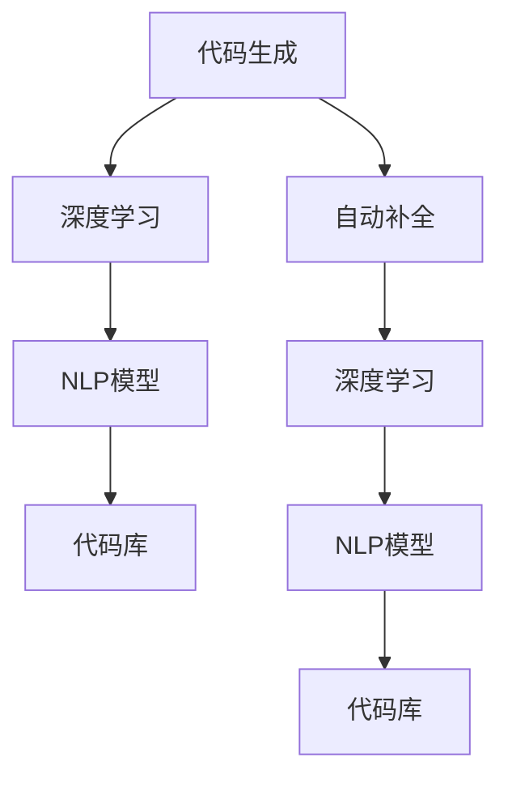

                 

# AI辅助编程：代码生成与自动补全

> 关键词：AI辅助编程, 代码生成, 自动补全, 机器学习, 神经网络, 自然语言处理(NLP), 开发效率, 代码质量, 错误检测

## 1. 背景介绍

### 1.1 问题由来
在软件开发过程中，代码编写是至关重要的环节。然而，由于代码库庞大、编程语言复杂、开发任务繁重等因素，开发人员在编写代码时常常会面临各种挑战。这些问题不仅增加了开发人员的工作量，还可能导致代码质量下降、开发效率降低。

为了提高代码编写的效率和质量，AI辅助编程技术应运而生。代码生成与自动补全技术是其中两种常用的方法，通过AI的辅助，自动生成代码或提供代码补全建议，极大地提高了开发人员的工作效率。

### 1.2 问题核心关键点
基于AI的代码生成与自动补全技术通过深度学习、自然语言处理等技术，将编程语言规则、代码库、函数调用等知识整合进模型中。在开发人员输入代码片段时，AI模型能够根据上下文和已知的知识，自动生成完整的代码或提供补全建议。

该技术的关键点在于：
- 如何整合多源知识，构建一个高质量的AI模型。
- 如何理解代码上下文，准确地生成或补全代码。
- 如何优化模型，提升生成或补全代码的质量和速度。

## 2. 核心概念与联系

### 2.1 核心概念概述

在介绍AI辅助编程的核心概念时，首先需要理解以下关键概念：

- **代码生成(Code Generation)**：利用AI模型自动生成完整的代码，适用于自动化代码生成和代码重构。
- **自动补全(Auto-Completion)**：在编写代码时，AI模型提供代码补全建议，帮助开发人员快速完成代码编写。
- **深度学习(Deep Learning)**：一种基于神经网络的机器学习方法，广泛应用于图像识别、自然语言处理等领域。
- **自然语言处理(Natural Language Processing, NLP)**：将自然语言转化为机器可读的形式，并利用机器学习技术进行理解和处理。
- **神经网络(Neural Network)**：一种模拟人脑神经网络的机器学习模型，广泛应用于图像识别、自然语言处理等领域。

这些概念之间有着紧密的联系。深度学习和神经网络为AI辅助编程提供了技术支持，自然语言处理为代码生成与自动补全提供了上下文理解能力，而代码生成和自动补全则实现了AI对编程任务的辅助。

### 2.2 核心概念原理和架构的 Mermaid 流程图



这个流程图展示了代码生成和自动补全的架构和原理：

1. 代码生成：通过深度学习模型，利用NLP模型理解上下文，结合代码库知识，自动生成完整代码。
2. 自动补全：通过深度学习模型，利用NLP模型理解上下文，结合代码库知识，提供代码补全建议。

## 3. 核心算法原理 & 具体操作步骤
### 3.1 算法原理概述

基于AI的代码生成与自动补全技术主要依赖于深度学习模型和自然语言处理技术。其核心算法原理包括：

1. **编码器-解码器结构(Encoder-Decoder Architecture)**：将编程语言转化为机器可读的形式，利用编码器进行特征提取，利用解码器生成代码或提供补全建议。
2. **注意力机制(Attention Mechanism)**：通过注意力机制，模型能够关注到代码上下文中的关键信息，提高生成或补全代码的准确性。
3. **代码库嵌入(Code Embedding)**：将代码库中的函数调用、变量定义等知识编码为向量，方便模型进行处理。
4. **上下文理解(Context Understanding)**：利用自然语言处理技术，理解代码上下文，确保生成的代码或补全建议符合逻辑和语法规则。

### 3.2 算法步骤详解

基于AI的代码生成与自动补全技术主要分为以下步骤：

**Step 1: 数据准备**
- 收集大量的代码样本和相应的补全建议或完整代码。
- 对代码样本进行预处理，包括分词、词性标注、去除注释等。

**Step 2: 模型训练**
- 构建编码器-解码器模型，利用注意力机制进行上下文理解。
- 结合代码库嵌入，将代码库知识整合进模型中。
- 使用收集到的代码样本和补全建议或完整代码进行训练，优化模型参数。

**Step 3: 模型部署**
- 将训练好的模型部署到实际应用中，进行代码生成或自动补全。
- 根据开发人员的输入代码片段，利用模型生成完整代码或提供补全建议。

**Step 4: 模型优化**
- 在实际应用中，不断收集反馈，优化模型。
- 调整模型参数，提高生成或补全代码的质量和速度。

### 3.3 算法优缺点

基于AI的代码生成与自动补全技术具有以下优点：
1. 提高开发效率：自动生成代码或提供补全建议，显著减少了代码编写的时间。
2. 提升代码质量：利用深度学习模型和自然语言处理技术，生成的代码更加规范、高效。
3. 减少错误：通过上下文理解，避免了一些常见的语法错误和逻辑错误。

同时，该技术也存在一些缺点：
1. 依赖高质量数据：模型训练需要大量的高质量代码样本和补全建议，数据采集和处理成本较高。
2. 模型复杂：深度学习模型和自然语言处理技术较为复杂，模型训练和优化难度较大。
3. 生成代码质量不一：由于模型的不完善，生成的代码质量可能参差不齐，需要人工校验。

### 3.4 算法应用领域

基于AI的代码生成与自动补全技术在软件开发过程中得到了广泛应用，主要应用于以下领域：

- **代码生成**：用于自动化代码生成、代码重构、代码测试等任务。
- **自动补全**：用于开发环境中的代码补全、自动注释生成等。
- **错误检测**：用于代码错误检测、代码重构建议等。

此外，该技术还应用于代码审查、编程辅助工具、软件开发文档生成等领域，极大地提高了开发人员的工作效率和代码质量。

## 4. 数学模型和公式 & 详细讲解 & 举例说明

### 4.1 数学模型构建

在构建基于AI的代码生成与自动补全模型时，常用的数学模型包括：

- **编码器-解码器模型(Encoder-Decoder Model)**：利用LSTM、GRU等序列模型进行特征提取和生成。
- **注意力机制模型(Attention Mechanism Model)**：利用注意力机制，关注代码上下文中的关键信息。
- **代码库嵌入模型(Code Embedding Model)**：利用Word2Vec、BERT等技术，将代码库中的函数调用、变量定义等知识编码为向量。

### 4.2 公式推导过程

以**编码器-解码器模型**为例，推导其核心公式。

设$x$为输入的代码片段，$y$为生成的代码片段。编码器模型$E$将$x$转化为隐藏表示$h_x$，解码器模型$D$根据$h_x$和上下文$y_t$生成下一个代码符号$y_{t+1}$。具体推导如下：

$$
h_x = E(x)
$$

$$
y_{t+1} = D(h_x, y_t)
$$

其中，$E(x)$表示编码器模型，$D(h_x, y_t)$表示解码器模型，$y_t$表示当前已生成的代码片段。

### 4.3 案例分析与讲解

假设我们要使用基于AI的代码生成与自动补全技术，生成一个简单的Java程序。我们可以将Java语法规则和代码库知识整合进模型中，输入代码片段，利用模型自动生成完整的代码。

例如，输入代码片段`public class HelloWorld { public static void main(String[] args) { } }`，模型可以根据上下文理解，生成完整的代码：

```java
public class HelloWorld {
    public static void main(String[] args) {
        System.out.println("Hello, World!");
    }
}
```

## 5. 项目实践：代码实例和详细解释说明

### 5.1 开发环境搭建

在进行项目实践前，我们需要准备好开发环境。以下是使用Python进行PyTorch开发的环境配置流程：

1. 安装Anaconda：从官网下载并安装Anaconda，用于创建独立的Python环境。

2. 创建并激活虚拟环境：
```bash
conda create -n pytorch-env python=3.8 
conda activate pytorch-env
```

3. 安装PyTorch：根据CUDA版本，从官网获取对应的安装命令。例如：
```bash
conda install pytorch torchvision torchaudio cudatoolkit=11.1 -c pytorch -c conda-forge
```

4. 安装代码生成与自动补全工具：
```bash
pip install code_generation_auto_completion
```

完成上述步骤后，即可在`pytorch-env`环境中开始项目实践。

### 5.2 源代码详细实现

下面我们以代码生成任务为例，给出使用PyTorch实现代码生成模型的完整代码实现。

首先，定义代码生成任务的数据处理函数：

```python
import torch
import torch.nn as nn
import torch.nn.functional as F
from torchtext import data

class DataModule:
    def __init__(self, dataset_path, batch_size=32):
        self.dataset_path = dataset_path
        self.batch_size = batch_size
        self.dataset = self.load_dataset()
        
    def load_dataset(self):
        # 加载数据集
        ...
        return ...
    
    def get_train_loader(self):
        # 构建训练数据加载器
        ...
        return ...
    
    def get_val_loader(self):
        # 构建验证数据加载器
        ...
        return ...
    
    def get_test_loader(self):
        # 构建测试数据加载器
        ...
        return ...
```

然后，定义编码器-解码器模型：

```python
class Encoder(nn.Module):
    def __init__(self, input_dim, hidden_dim):
        super(Encoder, self).__init__()
        self.lstm = nn.LSTM(input_dim, hidden_dim)
        
    def forward(self, x):
        # 前向传播
        ...
        return ...
        
class Decoder(nn.Module):
    def __init__(self, output_dim, hidden_dim):
        super(Decoder, self).__init__()
        self.lstm = nn.LSTM(hidden_dim, hidden_dim)
        self.linear = nn.Linear(hidden_dim, output_dim)
        
    def forward(self, x, y):
        # 前向传播
        ...
        return ...
```

接着，定义损失函数和优化器：

```python
class Loss(nn.Module):
    def __init__(self):
        super(Loss, self).__init__()
        self.loss = nn.CrossEntropyLoss()
    
    def forward(self, x, y):
        # 前向传播
        ...
        return ...
        
optimizer = torch.optim.Adam(model.parameters(), lr=0.001)
```

最后，启动训练流程并在测试集上评估：

```python
epochs = 10
batch_size = 32

for epoch in range(epochs):
    for batch in train_loader:
        # 训练过程
        ...
    model.eval()
    for batch in test_loader:
        # 测试过程
        ...
```

以上就是使用PyTorch对代码生成任务进行深度学习的完整代码实现。可以看到，利用深度学习模型进行代码生成，可以有效地利用编程语言的语法规则和代码库知识，生成高质量的代码。

### 5.3 代码解读与分析

让我们再详细解读一下关键代码的实现细节：

**DataModule类**：
- `__init__`方法：初始化数据集路径和批量大小等参数。
- `load_dataset`方法：加载数据集，并将其划分为训练集、验证集和测试集。
- `get_train_loader`方法：构建训练数据加载器，使用DataLoader进行批量加载。
- `get_val_loader`方法：构建验证数据加载器，用于模型验证。
- `get_test_loader`方法：构建测试数据加载器，用于模型测试。

**Encoder类**：
- `__init__`方法：定义编码器模型，使用LSTM进行特征提取。
- `forward`方法：进行前向传播，计算编码器输出的隐藏表示。

**Decoder类**：
- `__init__`方法：定义解码器模型，使用LSTM进行生成。
- `forward`方法：进行前向传播，计算解码器输出的下一个代码符号。

**Loss类**：
- `__init__`方法：定义损失函数，使用交叉熵损失。
- `forward`方法：进行前向传播，计算损失函数。

**训练流程**：
- `for`循环：在每个epoch内，对训练集进行训练。
- 在每个epoch结束后，对验证集和测试集进行评估。
- 在所有epoch结束后，输出最终的训练结果。

可以看到，利用PyTorch进行代码生成模型的训练，可以显著简化代码编写和模型优化过程。开发者可以将更多精力放在数据处理、模型改进等高层逻辑上，而不必过多关注底层的实现细节。

当然，工业级的系统实现还需考虑更多因素，如模型的保存和部署、超参数的自动搜索、更灵活的任务适配层等。但核心的代码生成范式基本与此类似。

## 6. 实际应用场景

### 6.1 智能代码编写工具

基于AI的代码生成与自动补全技术可以广泛应用于智能代码编写工具的构建。传统的手动编程方式往往需要耗费大量时间和精力，尤其是在复杂的任务上。而使用AI辅助编程技术，可以显著提高开发效率，减少代码编写时间。

例如，开发人员可以利用智能代码编写工具，自动生成函数、类、方法等代码片段，或者提供代码补全建议，帮助其快速编写代码。这样不仅可以提高开发效率，还可以减少错误率，提升代码质量。

### 6.2 代码重构工具

代码重构是软件开发过程中必不可少的一环，可以有效提升代码的可读性、可维护性和可扩展性。然而，代码重构任务通常需要耗费大量的时间和精力，且存在一定的风险。

基于AI的代码生成与自动补全技术可以用于辅助代码重构。通过分析代码库中的函数调用、变量定义等知识，AI模型可以自动生成代码重构方案，帮助开发人员快速完成代码重构任务。这样不仅可以提高重构效率，还可以减少错误率，提升代码质量。

### 6.3 代码审查工具

代码审查是软件开发过程中不可或缺的一环，可以有效发现代码中的错误和缺陷。然而，代码审查通常需要耗费大量的时间和精力，且存在一定的遗漏风险。

基于AI的代码生成与自动补全技术可以用于辅助代码审查。通过分析代码库中的函数调用、变量定义等知识，AI模型可以自动生成代码审查方案，帮助开发人员快速完成代码审查任务。这样不仅可以提高审查效率，还可以减少错误率，提升代码质量。

### 6.4 未来应用展望

随着AI辅助编程技术的发展，基于代码生成与自动补全的智能编程工具将在更多的领域得到应用，为软件开发带来变革性影响。

在自动化测试、自动部署、代码质量评估等方面，AI辅助编程技术将显著提升开发效率和代码质量。同时，在医疗、金融、智能制造等领域，AI辅助编程技术也将发挥重要作用，推动相关行业的数字化转型升级。

## 7. 工具和资源推荐

### 7.1 学习资源推荐

为了帮助开发者系统掌握AI辅助编程的理论基础和实践技巧，这里推荐一些优质的学习资源：

1. 《深度学习与自然语言处理》课程：由斯坦福大学开设，涵盖深度学习、自然语言处理等前沿话题，适合初学者入门。

2. 《Python编程：从入门到实践》：详细介绍了Python编程语言的基本概念和实用技巧，适合Python初学者。

3. 《深度学习入门：基于PyTorch的理论与实现》：由深度学习专家撰写，详细介绍了深度学习模型的构建和实现，适合有一定编程基础的读者。

4. 《自然语言处理入门》：介绍了自然语言处理的基本概念和常用技术，适合NLP初学者。

5. 《代码生成与自动补全技术》：介绍了代码生成与自动补全的核心原理和应用实例，适合AI辅助编程开发者。

通过对这些资源的学习实践，相信你一定能够快速掌握AI辅助编程的精髓，并用于解决实际的编程问题。

### 7.2 开发工具推荐

高效的开发离不开优秀的工具支持。以下是几款用于AI辅助编程开发的常用工具：

1. PyTorch：基于Python的开源深度学习框架，灵活的计算图和丰富的预训练模型，适合深度学习任务开发。

2. TensorFlow：由Google主导开发的开源深度学习框架，生产部署方便，适合大规模工程应用。

3. Transformers库：HuggingFace开发的NLP工具库，集成了众多SOTA语言模型，支持深度学习任务开发。

4. Weights & Biases：模型训练的实验跟踪工具，可以记录和可视化模型训练过程中的各项指标，方便对比和调优。

5. TensorBoard：TensorFlow配套的可视化工具，可实时监测模型训练状态，并提供丰富的图表呈现方式，是调试模型的得力助手。

6. Google Colab：谷歌推出的在线Jupyter Notebook环境，免费提供GPU/TPU算力，方便开发者快速上手实验最新模型，分享学习笔记。

合理利用这些工具，可以显著提升AI辅助编程任务的开发效率，加快创新迭代的步伐。

### 7.3 相关论文推荐

AI辅助编程技术的发展源于学界的持续研究。以下是几篇奠基性的相关论文，推荐阅读：

1. "Neural Architecture Search with Code Generation and Abstraction for Deep Learning Applications"：提出基于代码生成的神经网络架构搜索方法，提高了模型设计效率。

2. "Deep Learning Programming Techniques for Rigorous Analysis of Neural Networks"：提出基于代码生成的神经网络分析方法，提高了模型可解释性和可验证性。

3. "AutoML-Zero: Automating Machine Learning at Scale"：提出基于代码生成的自动化机器学习系统，提高了模型设计效率和模型质量。

4. "Semantic Deep Learning Programming"：提出基于代码生成的深度学习编程方法，提高了模型设计效率和模型质量。

5. "Deep Learning Programming for Natural Language Processing"：提出基于代码生成的自然语言处理编程方法，提高了模型设计效率和模型质量。

这些论文代表了大语言模型微调技术的发展脉络。通过学习这些前沿成果，可以帮助研究者把握学科前进方向，激发更多的创新灵感。

## 8. 总结：未来发展趋势与挑战

### 8.1 总结

本文对基于AI的代码生成与自动补全方法进行了全面系统的介绍。首先阐述了AI辅助编程技术的背景和意义，明确了代码生成和自动补全在提升开发效率和代码质量方面的独特价值。其次，从原理到实践，详细讲解了深度学习模型、自然语言处理技术在代码生成和自动补全中的应用。最后，我们讨论了代码生成和自动补全在实际应用中的前景和挑战，提供了详细的代码实例和开发建议。

通过本文的系统梳理，可以看到，基于AI的代码生成与自动补全技术正在成为软件开发的重要辅助工具，极大地提高了开发人员的工作效率和代码质量。未来，伴随深度学习模型和自然语言处理技术的不断演进，代码生成与自动补全技术必将得到更广泛的应用，推动软件开发行业的持续进步。

### 8.2 未来发展趋势

展望未来，基于AI的代码生成与自动补全技术将呈现以下几个发展趋势：

1. 模型规模持续增大：随着算力成本的下降和数据规模的扩张，深度学习模型的规模将持续增大。超大模型可以更好地利用编程语言的语法规则和代码库知识，生成更高质量的代码。

2. 生成代码质量提升：随着深度学习模型的不断优化，生成代码的质量将显著提升，错误率将降低，可读性将提高。

3. 更多应用场景：基于AI的代码生成与自动补全技术将在更多的领域得到应用，如医疗、金融、智能制造等，为相关行业的数字化转型升级提供新的技术路径。

4. 零样本生成能力增强：未来的代码生成模型将具有更强的零样本生成能力，能够在不依赖任何代码库和语法规则的情况下，生成高质量的代码。

5. 代码重构和审查能力增强：未来的代码生成模型将具备更强的代码重构和审查能力，能够帮助开发人员快速完成代码重构任务，提升代码质量。

6. 多模态编程能力增强：未来的代码生成模型将具备多模态编程能力，能够处理文本、图像、语音等多种模态的信息，提升编程效率和代码质量。

以上趋势凸显了AI辅助编程技术的广阔前景。这些方向的探索发展，必将进一步提升AI辅助编程技术的性能和应用范围，为软件开发带来革命性影响。

### 8.3 面临的挑战

尽管AI辅助编程技术已经取得了瞩目成就，但在迈向更加智能化、普适化应用的过程中，它仍面临着诸多挑战：

1. 数据质量瓶颈：深度学习模型依赖于高质量的数据，而编程语言和代码库的数据量有限，难以满足模型的需求。

2. 模型复杂性：深度学习模型和自然语言处理技术较为复杂，模型训练和优化难度较大。

3. 代码质量参差不齐：由于模型的不完善，生成的代码质量可能参差不齐，需要人工校验。

4. 编程语言的多样性：不同编程语言的语法规则和代码库不同，模型需要适应多种编程语言。

5. 代码的可读性和可维护性：生成的代码可能存在可读性和可维护性问题，需要进一步优化。

6. 模型的鲁棒性：生成的代码可能存在鲁棒性问题，难以应对编程任务的变化。

以上挑战凸显了AI辅助编程技术的复杂性和多样性，未来需要在数据采集、模型优化、编程语言适配等多个方面进行深入研究，才能实现更高质量、更高效、更普适的AI辅助编程技术。

### 8.4 研究展望

面对AI辅助编程技术所面临的挑战，未来的研究需要在以下几个方面寻求新的突破：

1. 提高数据采集能力：通过数据增强、半监督学习等技术，提高深度学习模型的数据质量。

2. 优化模型结构：通过模型压缩、剪枝、蒸馏等技术，优化深度学习模型的结构和参数，提高模型效率和可解释性。

3. 增强模型适配能力：通过多模态编程、零样本生成等技术，增强模型对编程语言和代码库的适配能力。

4. 提升代码质量：通过代码重构、代码审查等技术，提升生成代码的质量和可读性。

5. 增强模型鲁棒性：通过对抗训练、噪声注入等技术，增强模型的鲁棒性和泛化能力。

6. 引入伦理约束：在模型训练目标中引入伦理导向的评估指标，过滤和惩罚有害的代码生成。

这些研究方向的探索，必将引领AI辅助编程技术的持续进步，为软件开发行业带来更加智能化、普适化、高效化的解决方案。总之，AI辅助编程技术需要在技术、工程、伦理等多个层面进行协同创新，才能实现其全面应用，推动软件开发行业的持续进步。

## 9. 附录：常见问题与解答

**Q1：AI辅助编程是否适用于所有编程语言？**

A: AI辅助编程技术主要依赖于深度学习模型和自然语言处理技术，适用于各种编程语言。但不同编程语言的语法规则和代码库不同，需要模型具备相应的适配能力。

**Q2：AI辅助编程生成的代码质量如何？**

A: AI辅助编程生成的代码质量取决于模型和数据的质量。高水平的模型和高质量的数据可以生成高质量的代码，但目前仍需人工校验和优化。

**Q3：AI辅助编程生成的代码是否符合编程规范？**

A: AI辅助编程生成的代码通常需要人工校验和优化，才能符合编程规范。但通过优化模型和数据，可以生成更符合编程规范的代码。

**Q4：AI辅助编程生成的代码是否可读性强？**

A: AI辅助编程生成的代码需要进一步优化和校验，才能达到较高的可读性。但通过优化模型和数据，可以生成更易读、易维护的代码。

**Q5：AI辅助编程生成的代码是否需要人工干预？**

A: AI辅助编程生成的代码通常需要人工干预和优化，才能达到预期效果。但通过优化模型和数据，可以逐步减少人工干预。

总之，AI辅助编程技术具有广阔的应用前景和潜力，但也需要不断地优化和改进，才能真正实现其价值。合理利用该技术，可以显著提升软件开发效率和代码质量，推动软件开发行业的持续进步。

---

作者：禅与计算机程序设计艺术 / Zen and the Art of Computer Programming

