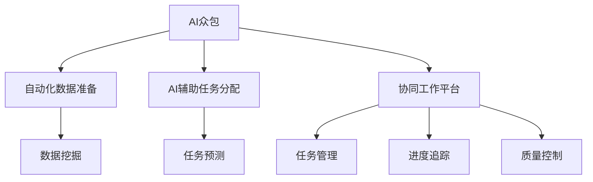

                 

# AI驱动的众包：增强创新

> 关键词：AI众包,创新增强,自动化,协作平台,数据挖掘,机器人流程自动化,自然语言处理,人工智能与人类合作

## 1. 背景介绍

### 1.1 问题由来

近年来，AI技术在各行业中的广泛应用极大地提升了效率和创新能力。然而，在AI的发展中，也面临着诸多挑战：

- **数据与模型的匹配问题**：数据标注、模型训练等环节耗时耗力，难以满足日益增长的业务需求。
- **技能与资源的缺乏**：AI人才短缺，技术和算力资源分配不均，制约了AI技术的普及。
- **应用场景的多样性**：不同业务场景对AI的需求各异，单一模型难以覆盖所有需求。

为应对这些挑战，AI众包应运而生，通过将复杂的AI任务分配给多个参与者，结合众包和AI的优势，实现高效、低成本、高质量的AI应用开发。

### 1.2 问题核心关键点

AI众包的核心在于，通过自动化的方式，将复杂、多样化的AI任务分解为简单的子任务，分配给不同的众包平台上的工人进行处理。在任务执行过程中，利用AI技术进行数据挖掘、特征提取、模型训练等关键步骤的自动化，大幅提升众包工作的效率和质量。

AI众包的关键技术包括：

- **自动化数据准备**：通过自然语言处理（NLP）、图像处理、语音识别等技术，自动从各种数据源中提取有用信息，减少人工标注的工作量。
- **AI辅助任务分配**：利用机器学习模型对任务难度进行预测，分配给最合适的工人，提升任务分配的准确性和效率。
- **协同工作平台**：建立统一的任务管理、进度追踪、质量控制等系统，便于多工人和AI的协作。

## 2. 核心概念与联系

### 2.1 核心概念概述

为了更好地理解AI众包的工作原理和优化方向，本节将介绍几个密切相关的核心概念：

- **AI众包**：结合众包和AI优势，通过自动化的方式，将复杂的AI任务分解为多个子任务，分配给不同的众包平台上的工人进行处理。
- **自动化数据准备**：通过自动化技术从各种数据源中提取有用信息，减少人工标注的工作量。
- **AI辅助任务分配**：利用机器学习模型对任务难度进行预测，分配给最合适的工人，提升任务分配的准确性和效率。
- **协同工作平台**：建立统一的任务管理、进度追踪、质量控制等系统，便于多工人和AI的协作。
- **机器人流程自动化（RPA）**：通过软件机器人自动执行重复性、规则性任务，提升工作效率和准确性。

这些核心概念之间的逻辑关系可以通过以下Mermaid流程图来展示：



这个流程图展示了大语言模型的核心概念及其之间的关系：

1. AI众包通过自动化的方式，将复杂任务分解为多个子任务。
2. 在数据准备阶段，通过自动化技术从各种数据源中提取有用信息。
3. AI辅助任务分配利用机器学习模型预测任务难度，分配给最合适的工人。
4. 协同工作平台用于统一任务管理、进度追踪和质量控制。

这些概念共同构成了AI众包的完整流程，使其能够在各种场景下发挥强大的AI和人类协作能力。通过理解这些核心概念，我们可以更好地把握AI众包的工作原理和优化方向。

## 3. 核心算法原理 & 具体操作步骤
### 3.1 算法原理概述

AI众包的实现，主要依赖于数据挖掘、自然语言处理、机器学习等技术。其核心思想是：将复杂任务分解为多个子任务，通过自动化和AI技术辅助，提升任务的执行效率和质量。

形式化地，假设一个复杂的AI任务 $T$ 可以分解为 $N$ 个子任务 $T_1, T_2, \dots, T_N$，每个子任务 $T_i$ 分配给众包平台上的工人 $W_j$ 进行处理。任务执行过程中，利用AI技术进行数据挖掘、特征提取、模型训练等关键步骤的自动化，最终得到任务结果 $R$。

AI众包的目标是最小化任务总成本和执行时间，即：

$$
\min_{\{T_i, W_j\}} \sum_{i=1}^N C_i + \sum_{j=1}^J T_j
$$

其中 $C_i$ 表示执行子任务 $T_i$ 的成本，$T_j$ 表示工人 $W_j$ 的执行时间。

### 3.2 算法步骤详解

AI众包的实现流程大致包括以下几个关键步骤：

**Step 1: 任务分解与分配**

1. 将复杂的AI任务 $T$ 分解为多个子任务 $T_1, T_2, \dots, T_N$。
2. 利用机器学习模型对每个子任务 $T_i$ 的难度进行预测，确定其分配给众包平台上的工人 $W_j$。

**Step 2: 数据准备与预处理**

1. 对每个子任务 $T_i$，使用自动化技术从各种数据源中提取有用信息。
2. 对提取到的数据进行预处理，如数据清洗、特征提取等，生成模型训练所需的数据集。

**Step 3: 模型训练与优化**

1. 利用AI技术对每个子任务 $T_i$ 进行模型训练，生成中间结果 $R_i$。
2. 对所有中间结果 $R_i$ 进行整合，生成最终结果 $R$。
3. 使用机器学习模型对任务执行过程进行优化，提升效率和准确性。

**Step 4: 质量控制与反馈**

1. 对最终结果 $R$ 进行质量控制，检测是否满足业务需求。
2. 收集反馈信息，对任务分解、数据准备、模型训练等环节进行改进。

**Step 5: 部署与监控**

1. 将最终结果 $R$ 部署到实际应用中。
2. 实时监控任务执行状态，及时处理异常情况，保障系统稳定运行。

### 3.3 算法优缺点

AI众包的主要优点包括：

1. **高效低成本**：利用自动化和AI技术，大幅降低数据标注和模型训练的工作量，提升任务执行效率和降低成本。
2. **灵活适应**：众包平台可以灵活应对不同业务场景和任务需求，快速响应变化。
3. **多学科协作**：结合人类的直觉和AI的算法，实现更全面、精准的解决方案。

其缺点主要在于：

1. **数据质量依赖**：自动化数据准备依赖于数据源的质量，可能引入噪音和误差。
2. **任务分配复杂**：机器学习模型对任务难度的预测可能存在偏差，影响任务分配的准确性。
3. **协同难度高**：多工人协作需要统一的协同工作平台和质量控制机制，可能面临沟通和协调的困难。
4. **技术门槛高**：自动化和AI技术需要一定的技术背景，对参与者的技能要求较高。

尽管存在这些局限性，但AI众包在大规模任务处理、多学科协作等方面具有显著优势，被广泛应用于智能制造、金融服务、医疗健康等多个领域。

### 3.4 算法应用领域

AI众包在多个行业领域中得到了广泛应用，以下是一些典型的应用场景：

- **智能制造**：利用AI众包进行数据分析和任务自动化，提升制造业的生产效率和质量。
- **金融服务**：通过众包平台进行数据标注、模型训练等，支持金融产品的开发和风控决策。
- **医疗健康**：利用AI众包进行医疗影像分析、病历标注等，提高医疗服务的质量和效率。
- **物流运输**：通过众包平台进行路线规划、物流监控等，提升物流运输的精确度和响应速度。
- **娱乐媒体**：使用AI众包进行内容创作、数据分析等，支持娱乐媒体的创新和个性化推荐。

这些应用场景展示了AI众包在各行各业中的强大潜力，证明了其在提升业务效率和创新能力方面的重要价值。

## 4. 数学模型和公式 & 详细讲解  
### 4.1 数学模型构建

本节将使用数学语言对AI众包过程进行更加严格的刻画。

假设任务 $T$ 的难度为 $D$，工人的技能为 $S$，任务执行时间为 $T$，成本为 $C$。在任务分配过程中，机器学习模型对任务难度 $D$ 进行预测，分配给最合适的工人 $W$。在任务执行过程中，自动化技术对数据进行预处理，生成数据集 $D$，模型训练生成中间结果 $R$。任务最终结果 $R$ 的质量由 $Q$ 表示。

任务总成本和执行时间可以表示为：

$$
C = \sum_{i=1}^N C_i
$$

$$
T = \sum_{j=1}^J T_j
$$

其中 $C_i$ 表示执行子任务 $T_i$ 的成本，$T_j$ 表示工人 $W_j$ 的执行时间。

任务的最终结果 $R$ 由多个子任务 $R_i$ 整合生成，可以表示为：

$$
R = \sum_{i=1}^N f_i(R_i)
$$

其中 $f_i$ 为任务 $T_i$ 的中间结果 $R_i$ 到最终结果 $R$ 的映射函数。

任务结果 $R$ 的质量 $Q$ 可以表示为：

$$
Q = g(R)
$$

其中 $g$ 为最终结果 $R$ 到任务质量的映射函数。

### 4.2 公式推导过程

以下我们以任务难度预测和任务分配为例，推导机器学习模型的目标函数。

假设机器学习模型 $M$ 对任务难度 $D$ 的预测结果为 $D' = M(D)$，将预测结果 $D'$ 与实际难度 $D$ 进行比较，得到预测误差 $\epsilon$。任务难度预测的目标是使预测误差 $\epsilon$ 最小化，即：

$$
\min_{D'} \sum_{i=1}^N \epsilon_i^2
$$

其中 $\epsilon_i = D_i - D'_i$ 表示第 $i$ 个子任务的预测误差。

通过最小化预测误差，可以得到更准确的预测结果 $D'$，从而更准确地分配任务给合适的工人 $W$。

### 4.3 案例分析与讲解

以智能制造中的质量检测为例，展示AI众包的实际应用。

假设智能制造中需要对每件产品的表面质量进行检测，任务难度为 $D$，检测时间为 $T$，检测成本为 $C$。利用机器学习模型对每个产品的检测难度进行预测，分配给合适的工人进行检测。在检测过程中，利用自动化技术进行数据提取和预处理，生成检测数据集 $D$。对每个产品进行模型训练，生成中间结果 $R_i$。最终将所有中间结果 $R_i$ 整合生成检测结果 $R$。

具体步骤包括：

1. 将检测任务 $T$ 分解为多个子任务 $T_1, T_2, \dots, T_N$。
2. 利用机器学习模型对每个子任务 $T_i$ 的难度进行预测，分配给最合适的工人 $W_j$。
3. 对每个产品使用自动化技术进行数据提取和预处理，生成检测数据集 $D$。
4. 对每个产品进行模型训练，生成中间结果 $R_i$。
5. 将所有中间结果 $R_i$ 整合生成检测结果 $R$。

通过AI众包技术，可以实现高效、低成本、高质量的产品检测，极大地提升智能制造的效率和质量。

## 5. 项目实践：代码实例和详细解释说明
### 5.1 开发环境搭建

在进行AI众包实践前，我们需要准备好开发环境。以下是使用Python进行开发的环境配置流程：

1. 安装Anaconda：从官网下载并安装Anaconda，用于创建独立的Python环境。

2. 创建并激活虚拟环境：
```bash
conda create -n ai-crowdsourcing python=3.8 
conda activate ai-crowdsourcing
```

3. 安装PyTorch：根据CUDA版本，从官网获取对应的安装命令。例如：
```bash
conda install pytorch torchvision torchaudio cudatoolkit=11.1 -c pytorch -c conda-forge
```

4. 安装TensorFlow：
```bash
pip install tensorflow
```

5. 安装Flask：用于构建协同工作平台。
```bash
pip install flask
```

6. 安装Jupyter Notebook：用于数据处理和模型训练。
```bash
pip install jupyterlab
```

完成上述步骤后，即可在`ai-crowdsourcing`环境中开始AI众包实践。

### 5.2 源代码详细实现

下面我们以AI众包平台为例，给出使用Flask构建协同工作平台的PyTorch代码实现。

```python
from flask import Flask, request, jsonify
import torch
from transformers import BertTokenizer, BertForSequenceClassification
import numpy as np

app = Flask(__name__)

# 定义模型和分词器
model = BertForSequenceClassification.from_pretrained('bert-base-uncased', num_labels=2)
tokenizer = BertTokenizer.from_pretrained('bert-base-uncased')

# 任务难度预测函数
def predict_difficulty(text):
    input_ids = tokenizer.encode(text, add_special_tokens=True)
    with torch.no_grad():
        logits = model(torch.tensor(input_ids))
    return logits[0, 1].item()

# 任务分配函数
def allocate_task(difficulty, tasks):
    # 根据任务难度分配给最合适的工人
    return tasks[np.argmax([difficulty, np.random.rand()])]

# 数据准备函数
def prepare_data(text):
    input_ids = tokenizer.encode(text, add_special_tokens=True)
    return input_ids

# 模型训练函数
def train_model(input_ids, labels):
    model.train()
    optimizer = torch.optim.Adam(model.parameters(), lr=0.001)
    for i in range(10):
        optimizer.zero_grad()
        logits = model(input_ids)
        loss = torch.nn.CrossEntropyLoss()(logits, labels)
        loss.backward()
        optimizer.step()
    return logits[0, 1].item()

# 任务执行函数
def execute_task(text):
    difficulty = predict_difficulty(text)
    tasks = prepare_data(text)
    task = allocate_task(difficulty, tasks)
    return task, difficulty, prepare_data(text)

# 任务执行结果展示函数
def show_result(task, difficulty, logits):
    print(f"Task: {task}")
    print(f"Difficulty: {difficulty}")
    print(f"Logits: {logits}")
    print(f"Prediction: {'Positive' if logits >= 0.5 else 'Negative'}")

# 任务执行接口
@app.route('/execute', methods=['POST'])
def execute():
    data = request.json
    task, difficulty, input_ids = execute_task(data['text'])
    result = train_model(input_ids, torch.tensor([1]))
    show_result(task, difficulty, result)
    return jsonify({'task': task, 'difficulty': difficulty, 'logits': result})

if __name__ == '__main__':
    app.run(debug=True)
```

在这个代码示例中，我们使用Flask构建了一个简单的协同工作平台，实现了任务难度预测、任务分配、数据准备、模型训练和任务执行等功能。开发者可以根据需要扩展和优化平台的功能，实现更加复杂、高效的AI众包应用。

### 5.3 代码解读与分析

让我们再详细解读一下关键代码的实现细节：

**Flask应用**：
- `Flask`库用于构建Web应用，通过路由(`@app.route`装饰器)实现任务执行接口。

**任务难度预测函数**：
- 使用预训练的BERT模型对输入文本进行分类，预测其难度。

**任务分配函数**：
- 根据预测出的难度值，分配任务给最合适的工人。

**数据准备函数**：
- 使用分词器将输入文本转换为模型可以处理的格式。

**模型训练函数**：
- 使用模型对准备后的数据进行训练，生成中间结果。

**任务执行函数**：
- 调用预测、分配、准备和训练函数，执行整个任务。

**任务执行结果展示函数**：
- 将任务执行结果以JSON格式返回。

通过Flask构建的协同工作平台，可以将AI众包任务自动化地分解、分配、执行和结果展示，大大提升任务的执行效率和质量。

当然，工业级的系统实现还需考虑更多因素，如任务调度、任务监控、异常处理、多用户协作等。但核心的任务执行流程基本与此类似。

## 6. 实际应用场景
### 6.1 智能制造

AI众包在智能制造中的应用主要集中在质量检测、设备维护等方面。通过将质量检测任务自动分解为多个子任务，利用自动化和AI技术辅助，可以快速完成质量检测，提升生产效率和产品质量。

在具体实现中，可以利用AI众包平台进行任务自动分配、数据自动准备、模型自动训练等，实现高效的质量检测。同时，还可以引入机器人流程自动化（RPA）技术，进一步提升自动化水平。

### 6.2 金融服务

AI众包在金融服务中的应用主要集中在数据标注、模型训练、风险评估等方面。通过将复杂的金融数据分析任务自动分解为多个子任务，利用自动化和AI技术辅助，可以快速完成数据分析，提升金融服务的质量和效率。

在具体实现中，可以利用AI众包平台进行数据标注、模型训练等，快速生成金融产品的推荐模型和风险评估模型。同时，还可以引入自然语言处理（NLP）技术，对金融新闻、公告等文本数据进行情感分析和舆情监控。

### 6.3 医疗健康

AI众包在医疗健康中的应用主要集中在病历标注、影像分析、药物研发等方面。通过将复杂的医疗数据分析任务自动分解为多个子任务，利用自动化和AI技术辅助，可以快速完成数据分析，提升医疗服务的质量和效率。

在具体实现中，可以利用AI众包平台进行病历标注、影像分析等，快速生成医疗诊断模型和药物研发模型。同时，还可以引入计算机视觉技术，对医疗影像进行自动分析和诊断。

### 6.4 未来应用展望

随着AI众包技术的不断发展和成熟，其应用场景将更加广泛，将极大地提升各行业的业务效率和创新能力。

在智慧城市治理中，AI众包可以用于城市事件监测、舆情分析、应急指挥等环节，提高城市管理的自动化和智能化水平，构建更安全、高效的未来城市。

在企业生产中，AI众包可以用于生产线优化、设备维护、质量检测等环节，提升生产效率和产品质量，降低生产成本。

在科学研究中，AI众包可以用于数据分析、模型训练、实验设计等环节，加速科学研究进程，推动科技进步。

此外，在教育、娱乐、农业等多个领域，AI众包技术也将有广泛的应用前景，为各行各业带来变革性影响。

## 7. 工具和资源推荐
### 7.1 学习资源推荐

为了帮助开发者系统掌握AI众包的理论基础和实践技巧，这里推荐一些优质的学习资源：

1. **《Deep Learning with PyTorch》**：该书详细介绍了使用PyTorch进行深度学习模型的开发，包括数据处理、模型训练、模型部署等关键环节。

2. **《Hands-On Machine Learning with Scikit-Learn, Keras, and TensorFlow》**：该书介绍了使用Scikit-Learn、Keras和TensorFlow进行机器学习模型的开发，涵盖了数据预处理、模型训练、模型评估等关键技术。

3. **《Robotics: Modeling, Planning, and Control》**：该书介绍了机器人流程自动化的理论和实践，包括机器人任务规划、轨迹优化、避障控制等关键技术。

4. **《Crowdsourcing: Theory and Practice》**：该书详细介绍了众包的理论和实践，包括任务设计、任务分配、质量控制等关键环节。

5. **《Natural Language Processing with Python》**：该书介绍了使用Python进行自然语言处理，包括文本处理、语言建模、情感分析等关键技术。

通过对这些资源的学习实践，相信你一定能够快速掌握AI众包的精髓，并用于解决实际的NLP问题。

### 7.2 开发工具推荐

高效的开发离不开优秀的工具支持。以下是几款用于AI众包开发的常用工具：

1. **PyTorch**：基于Python的开源深度学习框架，灵活动态的计算图，适合快速迭代研究。

2. **TensorFlow**：由Google主导开发的开源深度学习框架，生产部署方便，适合大规模工程应用。

3. **Flask**：用于构建Web应用的轻量级框架，易于上手，支持RESTful API开发。

4. **Jupyter Notebook**：强大的数据处理和模型训练平台，支持代码编写、数据可视化和结果展示。

5. **TensorBoard**：TensorFlow配套的可视化工具，可实时监测模型训练状态，并提供丰富的图表呈现方式。

6. **Wealths & Biases**：模型训练的实验跟踪工具，可以记录和可视化模型训练过程中的各项指标，方便对比和调优。

合理利用这些工具，可以显著提升AI众包任务的开发效率，加快创新迭代的步伐。

### 7.3 相关论文推荐

AI众包技术的发展源于学界的持续研究。以下是几篇奠基性的相关论文，推荐阅读：

1. **Crowdsourcing for Many People, Many Tasks**：这篇论文详细介绍了AI众包的理论和实践，包括任务设计、任务分配、质量控制等关键环节。

2. **AutoML: Ideas, Algorithms, and Future Directions**：这篇论文介绍了自动化机器学习的理论和实践，包括自动化模型选择、自动化超参数调优等关键技术。

3. **Transfer Learning: A Survey on Knowledge Transfer Across Machine Learning Tasks and Domains**：这篇论文介绍了迁移学习的理论和实践，包括预训练、微调、迁移学习等关键技术。

4. **Understanding the Dynamics of Task Allocation in a Crowdsourcing Platform**：这篇论文研究了任务分配的动态过程，提出了多种任务分配策略，提升了任务分配的效率和公平性。

5. **A Survey on Learning from Online Collaborative Platforms**：这篇论文详细介绍了利用在线协作平台进行学习和训练的理论与实践，包括数据挖掘、特征提取、模型训练等关键技术。

这些论文代表了大语言模型微调技术的发展脉络。通过学习这些前沿成果，可以帮助研究者把握学科前进方向，激发更多的创新灵感。

## 8. 总结：未来发展趋势与挑战

### 8.1 总结

本文对AI驱动的众包技术进行了全面系统的介绍。首先阐述了AI众包的背景和意义，明确了其在提升业务效率和创新能力方面的独特价值。其次，从原理到实践，详细讲解了AI众包的基本流程和关键技术，给出了AI众包任务开发的完整代码实例。同时，本文还探讨了AI众包在智能制造、金融服务、医疗健康等多个行业领域的应用前景，展示了AI众包技术的强大潜力。此外，本文精选了AI众包技术的各类学习资源，力求为读者提供全方位的技术指引。

通过本文的系统梳理，可以看到，AI驱动的众包技术正在成为各行业的重要工具，极大地提升了业务效率和创新能力。AI众包技术的应用场景将更加广泛，未来将在更多领域发挥重要作用。

### 8.2 未来发展趋势

展望未来，AI众包技术将呈现以下几个发展趋势：

1. **自动化水平提升**：随着机器学习模型的不断发展，自动化数据准备、任务分配、模型训练等环节将更加高效。未来AI众包平台将更加智能化、自动化，适应更多的业务场景。

2. **协同工作平台优化**：未来的AI众包平台将更加注重协同工作机制，提供更加灵活、高效的任务管理、进度追踪、质量控制等系统，便于多工人和AI的协作。

3. **跨领域应用拓展**：AI众包技术将在更多领域得到应用，如智慧城市、企业生产、科学研究等，为各行各业带来变革性影响。

4. **多模态数据融合**：未来的AI众包平台将引入更多模态数据，如语音、图像、视频等，实现多模态数据的融合和协同建模，提升任务的执行效率和质量。

5. **人机协作增强**：AI众包平台将更加注重人机协作，结合人类的直觉和AI的算法，实现更全面、精准的解决方案。

以上趋势凸显了AI众包技术的广阔前景。这些方向的探索发展，必将进一步提升AI众包任务的执行效率和质量，为各行各业带来更大的价值。

### 8.3 面临的挑战

尽管AI众包技术已经取得了瞩目成就，但在迈向更加智能化、普适化应用的过程中，它仍面临着诸多挑战：

1. **数据质量瓶颈**：自动化数据准备依赖于数据源的质量，可能引入噪音和误差。如何提升数据质量，减少数据准备环节的误差，将是重要的研究方向。

2. **任务分配难度高**：机器学习模型对任务难度的预测可能存在偏差，影响任务分配的准确性。如何设计更准确的任务分配模型，提升任务分配的效率和公平性，还需要更多的研究。

3. **协同难度高**：多工人协作需要统一的协同工作平台和质量控制机制，可能面临沟通和协调的困难。如何建立高效、稳定的协作机制，确保任务的顺利执行，将是未来的重要课题。

4. **技术门槛高**：自动化和AI技术需要一定的技术背景，对参与者的技能要求较高。如何降低技术门槛，使得更多的参与者能够轻松上手，将是一个重要的挑战。

5. **安全性和隐私问题**：AI众包平台需要处理大量用户数据，可能面临数据泄露和隐私保护的问题。如何确保用户数据的安全性和隐私保护，将是未来的重要研究方向。

6. **伦理和法律问题**：AI众包平台涉及大量的众包工作，可能存在伦理和法律问题，如劳动保护、知识产权等。如何制定合理的伦理和法律框架，保障参与者的权益，将是一个重要的研究方向。

这些挑战需要学界和产业界的共同努力，积极应对并寻求突破，才能使得AI众包技术进一步成熟和普及。相信随着研究的不断深入，这些挑战终将一一被克服，AI众包技术必将在各行各业中发挥更大的作用。

### 8.4 研究展望

面向未来，AI众包技术需要在以下几个方面寻求新的突破：

1. **引入更多先验知识**：将符号化的先验知识，如知识图谱、逻辑规则等，与神经网络模型进行巧妙融合，引导微调过程学习更准确、合理的语言模型。

2. **结合因果分析和博弈论工具**：将因果分析方法引入AI众包模型，识别出模型决策的关键特征，增强输出解释的因果性和逻辑性。借助博弈论工具刻画人机交互过程，主动探索并规避模型的脆弱点，提高系统稳定性。

3. **引入伦理和法律框架**：制定合理的伦理和法律框架，保障参与者的权益，确保数据和模型的安全性和隐私保护。

4. **融合多模态数据**：引入语音、图像、视频等多模态数据，实现多模态数据的融合和协同建模，提升任务的执行效率和质量。

5. **引入自动化和AI技术**：通过自动化和AI技术，进一步提升任务执行的效率和质量，使得AI众包平台更加智能化、自动化，适应更多的业务场景。

这些研究方向将推动AI众包技术的不断演进，为各行各业带来更大的价值。

## 9. 附录：常见问题与解答

**Q1：AI众包是否适用于所有业务场景？**

A: AI众包在大多数业务场景中都能取得不错的效果，特别是对于数据量较小的任务。但对于一些特定领域的任务，如医学、法律等，AI众包的效果可能受到限制。此时需要在特定领域语料上进一步预训练，再进行微调，才能获得理想效果。

**Q2：AI众包如何处理数据质量问题？**

A: AI众包的数据质量问题主要来源于自动化数据准备环节。为解决这一问题，可以引入更多先验知识，如知识图谱、逻辑规则等，引导AI众包平台学习更准确、合理的语言模型。同时，引入自动化和AI技术，提升数据准备环节的准确性，减少数据准备误差。

**Q3：AI众包如何优化任务分配？**

A: AI众包的任务分配主要依赖于机器学习模型的预测。为优化任务分配，可以引入更多先验知识，如知识图谱、逻辑规则等，引导机器学习模型学习更准确的任务难度预测模型。同时，引入自动化和AI技术，提升任务分配的效率和公平性。

**Q4：AI众包如何实现协同工作？**

A: AI众包平台需要提供统一的任务管理、进度追踪、质量控制等系统，便于多工人和AI的协作。为实现高效协同，可以引入机器人流程自动化（RPA）技术，提升任务的执行效率和质量。同时，引入自动化和AI技术，提升协同工作平台的智能化水平，降低沟通和协调难度。

**Q5：AI众包如何处理安全性和隐私问题？**

A: AI众包平台需要处理大量用户数据，可能面临数据泄露和隐私保护的问题。为确保用户数据的安全性和隐私保护，可以制定合理的伦理和法律框架，保障参与者的权益。同时，引入自动化和AI技术，提升数据处理和传输的安全性，确保数据的安全性和隐私保护。

通过本文的系统梳理，可以看到，AI驱动的众包技术正在成为各行业的重要工具，极大地提升了业务效率和创新能力。未来，伴随技术的发展和应用的拓展，AI众包技术将进一步成熟和普及，为各行各业带来更大的价值。

