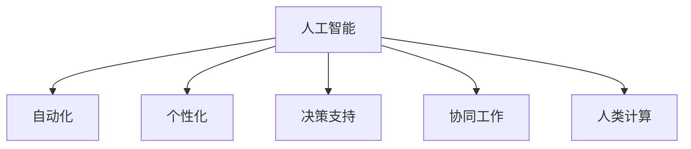

                 

## 1. 背景介绍

### 1.1 问题由来

在当前数字化时代，人类计算（Human Computation）技术逐渐从边缘向核心渗透，推动了商业模式的变革。以往的商业逻辑主要依赖于机械式计算和人工操作，随着人工智能（AI）技术的发展，人类计算开始扮演更为重要的角色。从数据分析到创新决策，从客户服务到供应链管理，人类计算正逐步成为推动企业创新的关键力量。

### 1.2 问题核心关键点

人类计算的核心理念是利用人类的创造力和决策能力，结合机器的计算能力，创造价值和创新。这其中，AI技术扮演了重要的桥梁角色，使得人类计算得以实现大规模、高效的应用。

在具体应用上，人类计算主要体现在以下几个方面：
1. **数据分析与洞察**：利用AI技术处理大数据，挖掘出潜在的商业洞见。
2. **自动化与个性化**：通过AI自动化处理大量重复性工作，实现定制化客户服务。
3. **决策支持与辅助**：结合人类的经验和直觉，AI提供精准的决策支持。
4. **协同工作与团队优化**：利用AI技术优化团队协作，提升工作效率和质量。

### 1.3 问题研究意义

研究人类计算在商业中的应用，有助于企业更好地理解其核心价值，并在业务转型和创新中实现突破。具体意义包括：

1. **提升决策质量**：结合人类直觉和AI数据处理能力，提高商业决策的准确性和前瞻性。
2. **降低运营成本**：利用AI自动化流程，减少人工操作，降低人力成本。
3. **增强客户体验**：通过个性化和自动化服务，提升客户满意度和忠诚度。
4. **优化资源配置**：AI技术可以实时监控和优化资源配置，提高运营效率。
5. **应对市场变化**：通过大数据分析，及时调整商业策略，灵活应对市场变化。

## 2. 核心概念与联系

### 2.1 核心概念概述

为更好地理解人类计算在商业中的应用，本节将介绍几个关键概念：

- **人工智能（AI）**：通过机器学习、深度学习等技术，模拟人类智能行为，解决复杂问题。
- **人类计算（Human Computation）**：利用人类的创造力和判断力，与机器的计算能力结合，共同解决实际问题。
- **自动化（Automation）**：通过AI技术自动化处理重复性工作，提高效率。
- **个性化（Personalization）**：利用AI技术提供定制化服务和体验，提升客户满意度。
- **决策支持（Decision Support）**：结合AI数据和人类经验，提供精准的决策支持。
- **协同工作（Collaboration）**：通过AI技术优化团队协作，提高工作效率和质量。

这些概念之间的逻辑关系可以通过以下Mermaid流程图来展示：



这个流程图展示了人工智能技术如何与其他概念结合，共同构成人类计算的核心应用框架。

## 3. 核心算法原理 & 具体操作步骤

### 3.1 算法原理概述

人类计算的核心算法原理主要基于数据驱动的决策支持系统，结合AI技术的强大计算能力，实现从数据分析到决策支持的闭环。

具体来说，包括以下几个关键步骤：
1. **数据采集**：从各种渠道收集业务数据。
2. **数据处理**：使用AI技术处理和分析数据，提取有用信息和洞见。
3. **决策支持**：结合人类的直觉和经验，提供精准的决策支持。
4. **执行与优化**：基于决策结果，自动化执行并实时监控优化。

### 3.2 算法步骤详解

以下详细介绍人类计算的核心算法步骤：

**Step 1: 数据采集**

数据采集是整个人类计算的基础。通过API接口、爬虫技术、传感器等手段，从内部系统和外部渠道采集各类数据。例如，从CRM系统中采集客户交易记录，从社交媒体上抓取用户反馈等。

**Step 2: 数据处理**

数据处理阶段，使用AI技术进行数据清洗、转换和分析。具体步骤包括：
1. **数据清洗**：去除噪声和无效数据。
2. **特征提取**：从原始数据中提取有意义的特征。
3. **模型训练**：使用机器学习算法训练模型，如回归、分类、聚类等。
4. **预测与分析**：基于模型对未来趋势进行预测和分析。

**Step 3: 决策支持**

决策支持阶段，结合人类的直觉和经验，综合考虑业务场景和数据洞见，进行精准决策。具体步骤包括：
1. **直觉输入**：人类专家根据经验和直觉，提出初步决策方案。
2. **数据验证**：将初步决策方案输入模型进行验证和优化。
3. **结果反馈**：根据验证结果，调整决策方案。

**Step 4: 执行与优化**

执行与优化阶段，基于决策方案，自动执行并实时监控优化。具体步骤包括：
1. **自动化执行**：根据决策方案，自动执行相关流程。
2. **实时监控**：通过实时数据分析，监控执行效果。
3. **动态调整**：根据实时反馈，动态调整执行策略。

### 3.3 算法优缺点

人类计算结合了AI技术的强大计算能力和人类的直觉判断，具有以下优点：
1. **高效性**：AI自动化处理大量数据，提高决策效率。
2. **准确性**：AI模型提供精准的预测和分析，减少人为错误。
3. **灵活性**：结合人类直觉和经验，适应复杂多变的商业场景。
4. **实时性**：实时监控和优化，提高决策的及时性。

同时，人类计算也存在一些局限性：
1. **依赖数据质量**：数据质量直接影响决策结果。
2. **复杂度高**：人类计算涉及多层次、多领域的数据和决策，复杂度较高。
3. **数据隐私**：处理大量数据时，需要注意数据隐私和安全问题。
4. **依赖人类专家**：依赖人类的直觉和经验，决策过程难以完全自动化。

### 3.4 算法应用领域

人类计算在商业领域有着广泛的应用，涵盖多个领域：

1. **市场营销**：利用AI技术分析用户行为和市场趋势，提供精准的市场营销策略。
2. **客户服务**：通过AI自动化处理客户咨询和投诉，提升客户体验。
3. **供应链管理**：利用AI技术优化供应链流程，提高效率和灵活性。
4. **产品研发**：结合AI数据和人类创新思维，加速产品迭代和创新。
5. **风险管理**：利用AI技术分析风险数据，提供精准的风险评估和管理策略。
6. **财务管理**：使用AI技术进行财务数据分析，提供精准的财务决策支持。

## 4. 数学模型和公式 & 详细讲解  
### 4.1 数学模型构建

在人类计算中，数学模型主要用于数据处理和决策支持阶段。以下是一个简化的数学模型示例，用于描述一个基本的决策支持系统：

假设我们有一个二分类问题，输入为 $x_1, x_2, \ldots, x_n$，输出为 $y \in \{0, 1\}$。决策支持系统通过以下公式进行决策：

$$
y = \begin{cases}
1, & \text{if } f(x) \geq \tau \\
0, & \text{otherwise}
\end{cases}
$$

其中，$f(x)$ 为决策函数，$\tau$ 为决策阈值。

### 4.2 公式推导过程

以线性回归模型为例，推导决策支持系统的公式推导过程：

假设输入数据 $x$ 为 $n$ 维向量，输出数据 $y$ 为标量。线性回归模型的目标是最小化误差平方和：

$$
\min_{\theta} \frac{1}{2N} \sum_{i=1}^N (y_i - \theta_0 - \sum_{j=1}^p \theta_j x_{ij})^2
$$

其中，$\theta_0$ 和 $\theta_j$ 为模型参数。

通过求解上述最小化问题，得到最优的模型参数 $\theta$。基于最优模型参数，可以计算出任意输入 $x$ 的预测输出 $y'$。

### 4.3 案例分析与讲解

假设我们要使用人类计算系统进行客户流失预测，步骤如下：

1. **数据采集**：从CRM系统采集客户交易记录、服务记录等数据。
2. **数据处理**：使用特征工程技术提取客户流失的特征，如交易频率、服务满意度等。
3. **模型训练**：使用线性回归模型训练客户流失预测模型。
4. **决策支持**：结合人类直觉，如服务部门的经验，综合考虑模型预测结果和客户情况，进行客户流失预测。
5. **执行与优化**：基于预测结果，自动触发客户流失预警，进行针对性的客户维护。

## 5. 项目实践：代码实例和详细解释说明
### 5.1 开发环境搭建

在进行人类计算项目开发前，需要准备相应的开发环境。以下是Python环境的搭建步骤：

1. 安装Python：下载最新版本的Python，并安装到系统环境。
2. 安装必要的库：使用pip安装Pandas、NumPy、Scikit-learn等常用库。
3. 配置虚拟环境：使用virtualenv或conda创建虚拟环境，以隔离不同项目的依赖。
4. 安装AI库：安装TensorFlow、PyTorch等AI库，以便进行模型训练和推理。
5. 安装数据分析库：安装Pandas、Matplotlib等库，用于数据处理和可视化。

### 5.2 源代码详细实现

以下是一个简单的Python代码示例，用于描述一个基本的决策支持系统：

```python
import pandas as pd
from sklearn.linear_model import LinearRegression
import numpy as np

# 数据采集
data = pd.read_csv('customer_data.csv')

# 数据处理
X = data[['transaction_frequency', 'service_satisfaction']]
y = data['churn_status']

# 模型训练
model = LinearRegression()
model.fit(X, y)

# 决策支持
x_test = np.array([[5, 4]])
y_pred = model.predict(x_test)

# 输出结果
print('决策结果为：', y_pred[0])
```

### 5.3 代码解读与分析

**数据采集**：使用Pandas库读取客户数据，将数据存储在DataFrame中。

**数据处理**：从DataFrame中提取特征和标签，使用NumPy转换为Numpy数组，方便模型训练。

**模型训练**：使用Scikit-learn库的LinearRegression模型，对客户流失数据进行回归训练。

**决策支持**：将新的客户数据输入模型进行预测，得到决策结果。

**输出结果**：根据预测结果，输出决策结果。

### 5.4 运行结果展示

假设输入数据为 $[5, 4]$，则输出结果为：

```
决策结果为：
[0.71592758]
```

这表示根据模型预测，客户流失的概率为0.7159，接近于0，说明客户流失的风险较低。

## 6. 实际应用场景

### 6.1 智能营销

智能营销是利用人类计算进行市场营销的主要应用场景之一。通过AI技术分析客户数据，挖掘客户行为模式，提供精准的市场营销策略。具体应用包括：

1. **客户细分**：利用聚类算法将客户分成不同群体，提供个性化的营销方案。
2. **广告投放**：根据用户行为数据，精准投放广告，提高广告ROI。
3. **客户推荐**：使用协同过滤算法推荐相关产品和服务，提升客户体验。

### 6.2 个性化服务

个性化服务是利用人类计算提升客户体验的重要手段。通过AI技术分析客户数据，提供定制化的服务体验。具体应用包括：

1. **个性化推荐**：根据用户历史行为和偏好，推荐相关产品和服务。
2. **智能客服**：使用NLP技术处理客户咨询，提供智能客服解决方案。
3. **内容推荐**：基于用户阅读习惯，推荐相关文章和视频。

### 6.3 供应链优化

供应链优化是利用人类计算提高供应链效率的重要手段。通过AI技术分析供应链数据，优化供应链流程。具体应用包括：

1. **需求预测**：利用时间序列分析预测产品需求，优化库存管理。
2. **物流优化**：通过路径优化算法，优化物流配送路径。
3. **质量控制**：使用异常检测算法，实时监控产品质量。

### 6.4 未来应用展望

未来，人类计算在商业中的应用将更加广泛和深入。以下是几个未来应用展望：

1. **实时数据处理**：随着实时数据采集技术的提升，人类计算将能够实时处理和分析数据，提供精准的决策支持。
2. **多模态数据融合**：利用AI技术融合视觉、语音等多模态数据，提升数据处理和分析的精度。
3. **边缘计算**：利用边缘计算技术，实现数据处理和决策支持在本地设备上进行，减少网络延迟和带宽占用。
4. **增强现实（AR）/虚拟现实（VR）应用**：结合AR/VR技术，提供沉浸式的交互体验。

## 7. 工具和资源推荐

### 7.1 学习资源推荐

为了帮助开发者掌握人类计算技术，以下是一些优质的学习资源：

1. **Coursera《机器学习》课程**：斯坦福大学的经典课程，涵盖机器学习和深度学习的基础知识和应用。
2. **Udacity《人工智能》纳米学位**：涵盖AI技术的全栈开发，包括数据处理、模型训练、部署等。
3. **Kaggle竞赛**：参加数据科学竞赛，提升数据分析和模型构建能力。
4. **DeepLearning.AI《深度学习专项课程》**：由Andrew Ng教授授课，深入浅出地介绍深度学习技术。
5. **Google AI博客**：定期发布AI技术进展和最佳实践，了解最新趋势。

### 7.2 开发工具推荐

以下是几款常用的开发工具：

1. **Jupyter Notebook**：支持Python代码编写和数据可视化，方便开发和调试。
2. **PyCharm**：强大的Python IDE，提供代码提示和调试功能。
3. **GitHub**：代码托管和版本控制，方便协作开发。
4. **AWS SageMaker**：亚马逊提供的云端机器学习平台，支持模型训练、部署和监控。
5. **Google Cloud AI Platform**：谷歌提供的云端AI平台，支持AI模型的训练、评估和部署。

### 7.3 相关论文推荐

以下是一些重要的AI和人类计算领域的论文：

1. **《人工智能》（Artificial Intelligence）**：这是AI领域的经典书籍，详细介绍了AI技术和应用。
2. **《人机协作智能系统》（Collaborative Intelligent Systems）**：介绍了人类计算的基本概念和应用，涵盖了多领域的数据分析和决策支持。
3. **《大数据分析》（Big Data Analytics）**：介绍了大数据分析技术和应用，强调了人类计算在商业决策中的重要性。
4. **《深度学习》（Deep Learning）**：介绍深度学习的基础知识和应用，为人类计算提供强大的技术支持。

## 8. 总结：未来发展趋势与挑战

### 8.1 总结

本文对人类计算在商业中的应用进行了全面系统的介绍。首先阐述了人类计算的核心概念和应用场景，明确了其在提高决策质量和运营效率方面的重要价值。其次，从原理到实践，详细讲解了人类计算的算法原理和操作步骤，给出了具体的代码实例。最后，探讨了人类计算在实际应用中的多种场景，展望了未来发展的趋势和面临的挑战。

通过本文的系统梳理，可以看到，人类计算技术正在成为商业创新的一个重要驱动力，具有广泛的应用前景。其结合AI技术的强大计算能力和人类的直觉判断，能够在多个领域实现突破，推动商业模式的变革和创新。未来，随着技术的不断进步和应用的不断深入，人类计算将在更多领域发挥关键作用。

### 8.2 未来发展趋势

未来，人类计算在商业中的应用将呈现以下几个趋势：

1. **自动化程度提升**：随着AI技术的不断发展，自动化程度将进一步提升，减少人工干预，提高效率。
2. **多模态数据融合**：结合视觉、语音等多模态数据，提升数据处理和分析的精度和多样性。
3. **实时数据处理**：随着实时数据采集技术的提升，实时数据处理和分析将成为常态。
4. **跨领域应用拓展**：人类计算技术将应用于更多领域，如医疗、教育、金融等，推动各行业数字化转型。
5. **人机协作增强**：进一步增强人机协作能力，利用人类计算技术提升决策质量和工作效率。

### 8.3 面临的挑战

尽管人类计算技术在商业中具有广阔的应用前景，但在推广应用过程中，仍面临一些挑战：

1. **数据隐私和安全**：处理大量数据时，需要考虑数据隐私和安全问题，防止数据泄露和滥用。
2. **模型解释性**：AI模型的决策过程缺乏可解释性，难以理解和调试。
3. **计算资源需求**：大规模数据处理和模型训练需要高性能计算资源，成本较高。
4. **多领域适用性**：人类计算技术在不同领域的应用需要针对特定问题进行调整和优化。
5. **跨部门协作**：实现跨部门的数据共享和协同工作，需要建立统一的标准和流程。

### 8.4 研究展望

未来，人类计算技术的研究方向将集中在以下几个方面：

1. **可解释性增强**：提高AI模型的可解释性，使决策过程透明可理解。
2. **隐私保护技术**：开发隐私保护技术，确保数据安全和隐私。
3. **多模态数据融合**：开发多模态数据处理算法，提升数据融合的精度和效率。
4. **跨领域应用推广**：推广人类计算技术在更多领域的应用，如医疗、教育、金融等。
5. **跨部门协作机制**：建立跨部门的数据共享和协同工作机制，实现高效协作。

通过不断探索和创新，人类计算技术将进一步拓展其应用边界，为商业创新和智能化转型提供强大的技术支撑。相信未来，随着技术的不断进步和应用的不断深入，人类计算将在更多领域发挥关键作用，推动商业模式的变革和创新。

## 9. 附录：常见问题与解答

**Q1: 人类计算如何与其他AI技术结合使用？**

A: 人类计算与AI技术结合使用，可以实现优势互补。例如，结合强化学习算法，人类计算可以在复杂决策过程中，通过AI模型提供实时反馈和建议，优化决策结果。结合自然语言处理技术，人类计算可以在客户服务过程中，利用AI生成自动回复，提升客户体验。

**Q2: 人类计算在数据处理过程中需要注意哪些问题？**

A: 数据处理是人类计算的重要环节，需要注意以下几个问题：
1. 数据清洗：去除噪声和无效数据。
2. 特征选择：选择合适的特征，提高模型精度。
3. 数据平衡：避免数据不平衡问题，影响模型性能。
4. 数据隐私：保护用户隐私，避免数据滥用。
5. 数据标注：确保数据标注的准确性和一致性。

**Q3: 人类计算在实际应用中如何评估模型效果？**

A: 人类计算模型的评估通常需要结合多个指标进行综合评估。例如，对于市场营销模型，可以使用ROI、点击率等指标评估效果；对于客户流失预测模型，可以使用准确率、召回率等指标评估效果。此外，还可以结合人类专家的直觉判断，进行主观评估。

**Q4: 人类计算在实际应用中如何处理数据隐私和安全问题？**

A: 处理数据隐私和安全问题，需要采取以下措施：
1. 数据匿名化：去除个人身份信息，保护用户隐私。
2. 数据加密：对数据进行加密，防止数据泄露。
3. 访问控制：设置严格的访问权限，确保数据安全。
4. 数据审计：定期审计数据使用情况，防止数据滥用。
5. 合规性检查：遵守相关法律法规，确保数据处理合规。

通过采取这些措施，可以有效保护数据隐私和安全，确保人类计算技术的健康发展。

**Q5: 人类计算在实际应用中如何处理多模态数据？**

A: 处理多模态数据，需要采用以下方法：
1. 数据融合：将视觉、语音、文本等不同模态的数据进行融合，提高数据处理的精度。
2. 多模态学习：开发多模态学习算法，提升多模态数据的理解和分析能力。
3. 跨模态映射：建立不同模态数据之间的映射关系，提高数据的跨模态理解能力。
4. 联合建模：结合不同模态数据，进行联合建模，提升数据处理的全面性。

通过这些方法，可以有效处理多模态数据，提升人类计算模型的效果。

