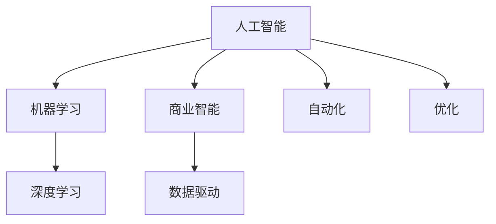

                 

# AI驱动的创新：人类计算在商业中的应用

> 关键词：人工智能,商业应用,人类计算,创新驱动,商业模式,数据驱动,机器学习,深度学习,商业智能,决策支持系统,大数据分析

## 1. 背景介绍

### 1.1 问题由来
随着人工智能(AI)技术的飞速发展，AI驱动的创新正在重新定义各个领域的商业模式和运营方式。特别是在商业领域，人工智能为公司提供了前所未有的机会，以更高效的方式处理数据、优化运营、提升客户体验，从而获得竞争优势。这一转变不仅仅体现在技术层面的突破，更改变了企业的决策制定方式和市场响应速度。

### 1.2 问题核心关键点
AI在商业应用中的关键点包括：

- **数据驱动决策**：AI能够处理和分析海量数据，提供有价值的洞察，帮助企业做出更加科学和精准的决策。
- **自动化与优化**：自动化流程可以显著提高工作效率，而优化算法可以帮助企业在资源配置、供应链管理等方面实现最优解。
- **个性化服务**：利用AI分析用户行为和偏好，提供定制化的产品和服务，提高客户满意度和忠诚度。
- **智能客服与营销**：AI客服和营销工具可以实现24小时在线服务，提升用户体验，并通过预测分析增强销售策略。
- **风险管理与合规**：AI在风险识别、欺诈检测和合规监控方面的应用，有助于保护企业资产和声誉。

### 1.3 问题研究意义
研究AI在商业领域的应用，对于推动企业转型升级、提升市场竞争力具有重要意义：

1. **提高运营效率**：AI可以自动化处理繁琐的任务，解放人力资源，提高企业的运营效率。
2. **优化产品与服务**：AI通过数据分析，帮助企业理解市场需求，开发更符合客户需求的产品和服务。
3. **强化市场响应能力**：AI技术可以实时分析市场动态，帮助企业快速响应市场变化，把握商机。
4. **增强风险控制能力**：AI在风险评估和欺诈检测中的应用，可以有效降低企业面临的财务和运营风险。
5. **促进创新与创造**：AI可以加速新产品开发和流程改进，推动企业持续创新。

## 2. 核心概念与联系

### 2.1 核心概念概述

为了深入理解AI在商业中的应用，需要了解以下几个核心概念：

- **人工智能(Artificial Intelligence, AI)**：通过计算机模拟人类智能过程，实现信息的处理、理解和决策的技术。
- **机器学习(Machine Learning, ML)**：AI的一个重要分支，使用算法和统计模型，让计算机通过数据学习进行决策。
- **深度学习(Deep Learning, DL)**：机器学习的一个分支，利用多层神经网络模拟人类视觉、听觉等复杂任务的决策过程。
- **商业智能(Business Intelligence, BI)**：通过数据分析、可视化工具和技术，帮助企业进行决策支持。
- **数据驱动(Data-Driven)**：决策过程中依赖大量数据和分析，而非经验和直觉。
- **自动化(Automation)**：利用AI技术自动执行常规和重复性任务，提高效率。
- **优化(Optimization)**：通过算法寻找最优解，最大化企业的收益和效率。

这些概念通过一定的逻辑关系，构成了AI在商业应用的框架。以下Mermaid流程图展示了这些概念之间的联系：



## 3. 核心算法原理 & 具体操作步骤

### 3.1 算法原理概述

AI在商业应用中的算法原理通常涉及机器学习、深度学习等技术。这些技术通过数据驱动的决策支持，帮助企业在运营、销售、客户服务等各个环节中实现自动化和优化。具体来说，AI算法可以分为以下几个步骤：

1. **数据收集与预处理**：从不同渠道收集相关数据，并对数据进行清洗、归一化和特征工程。
2. **模型训练与优化**：使用机器学习或深度学习算法，对数据进行训练，优化模型参数以适应特定任务。
3. **模型部署与监控**：将训练好的模型部署到实际应用中，并实时监控模型性能，进行必要的更新和调整。

### 3.2 算法步骤详解

以客户推荐系统为例，详细讲解AI在商业中的具体操作步骤：

1. **数据收集**：
   - 从用户的浏览历史、购买记录、评价反馈等渠道，收集用户行为数据。
   - 使用SQL数据库或大数据平台进行数据存储和管理。

2. **数据预处理**：
   - 对收集到的数据进行去重、缺失值处理、异常值检测等清洗工作。
   - 使用特征工程提取有意义的特征，如用户的兴趣偏好、购买频率、最近购买时间等。

3. **模型训练**：
   - 选择推荐算法，如协同过滤、基于内容的推荐等。
   - 使用历史数据进行模型训练，通过交叉验证等方法选择最优模型。
   - 调整模型参数，优化模型性能。

4. **模型部署**：
   - 将训练好的模型部署到推荐系统平台。
   - 通过API接口实现实时推荐。

5. **性能监控与优化**：
   - 实时监控推荐系统的性能指标，如点击率、转化率等。
   - 根据监控结果进行模型更新和参数调整，持续优化推荐效果。

### 3.3 算法优缺点

AI在商业应用中的算法具有以下优点：

- **高效处理大量数据**：AI可以快速处理和分析海量数据，帮助企业快速做出决策。
- **精准预测和优化**：通过算法模型，AI可以预测用户行为和市场趋势，优化资源配置。
- **自动化执行**：AI可以实现自动化的操作，减少人为错误，提高效率。

同时，这些算法也存在一些局限性：

- **数据依赖性**：AI的性能高度依赖于数据的质量和完整性，数据偏差可能影响模型效果。
- **模型复杂性**：深度学习等复杂算法对计算资源和数据量要求较高，成本较高。
- **模型可解释性**：AI模型的决策过程往往缺乏透明度，难以解释。
- **技术门槛**：开发和维护AI系统需要专业的技术团队，对企业而言有一定的技术门槛。

### 3.4 算法应用领域

AI在商业中的应用领域广泛，涵盖了以下几个方面：

- **零售与电商**：利用AI进行个性化推荐、库存管理、价格优化等。
- **金融与保险**：使用AI进行风险评估、欺诈检测、智能投顾等。
- **制造业**：通过AI进行供应链优化、质量控制、设备维护等。
- **医疗健康**：AI在疾病预测、个性化治疗、医疗影像分析等方面的应用。
- **人力资源**：使用AI进行员工招聘、绩效评估、培训规划等。
- **物流与运输**：AI在路线规划、配送优化、货物追踪等方面的应用。

## 4. 数学模型和公式 & 详细讲解 & 举例说明

### 4.1 数学模型构建

以下以客户推荐系统为例，构建推荐算法的数学模型：

假设用户集为 $U$，物品集为 $I$，用户对物品的评分矩阵为 $R_{ui}$，其中 $r_{ui} \in [0,1]$。目标是为新用户 $u$ 推荐物品 $i$。推荐算法可以表示为：

$$
f(u,i) = \sum_{j \in I} R_{uj} \alpha_j + \sum_{j \in I} R_{uj} \beta_j f(v_j,i)
$$

其中 $\alpha_j$ 和 $\beta_j$ 是模型参数，$f(v_j,i)$ 是物品 $i$ 的特征表示，$v_j$ 是与 $i$ 相关的物品集。

### 4.2 公式推导过程

对于协同过滤算法，其推导过程如下：

1. **用户-物品相似度计算**：
   - 计算用户 $u$ 与物品 $i$ 的相似度 $s_{ui}$，可以通过余弦相似度或皮尔逊相关系数计算得到。
   
2. **推荐分数计算**：
   - 利用相似度计算用户 $u$ 对物品 $i$ 的推荐分数 $r_{ui} = s_{ui} \times r_{ui}$。

3. **推荐排序**：
   - 将所有物品 $i$ 的推荐分数排序，选择前 $K$ 个物品进行推荐。

### 4.3 案例分析与讲解

以亚马逊的推荐系统为例，分析其推荐算法的实现细节：

1. **数据采集**：
   - 从用户浏览历史、购买记录中收集数据。
   - 存储在亚马逊的内部数据库中。

2. **模型训练**：
   - 使用协同过滤算法，对用户和物品进行相似度计算。
   - 结合物品特征，计算推荐分数。

3. **模型部署**：
   - 部署模型到推荐系统服务中。
   - 实时响应用户的推荐请求。

4. **性能监控与优化**：
   - 监控推荐系统的点击率、转化率等指标。
   - 根据用户反馈进行模型优化。

## 5. 项目实践：代码实例和详细解释说明

### 5.1 开发环境搭建

以下是使用Python进行TensorFlow开发的环境配置流程：

1. 安装Anaconda：从官网下载并安装Anaconda，用于创建独立的Python环境。

2. 创建并激活虚拟环境：
```bash
conda create -n tf-env python=3.8 
conda activate tf-env
```

3. 安装TensorFlow：根据CUDA版本，从官网获取对应的安装命令。例如：
```bash
conda install tensorflow tensorflow-gpu=2.5 -c conda-forge
```

4. 安装各类工具包：
```bash
pip install numpy pandas scikit-learn matplotlib tqdm jupyter notebook ipython
```

完成上述步骤后，即可在`tf-env`环境中开始AI项目的开发。

### 5.2 源代码详细实现

以下是一个简单的TensorFlow代码示例，用于构建和训练一个协同过滤推荐模型：

```python
import tensorflow as tf
from tensorflow.keras.layers import Dense, Input, Embedding, dot, add
from tensorflow.keras.models import Model
from tensorflow.keras.optimizers import Adam

# 定义模型
user_input = Input(shape=(1,))
item_input = Input(shape=(1,))
user_embedding = Embedding(input_dim=num_users, output_dim=embedding_dim)(user_input)
item_embedding = Embedding(input_dim=num_items, output_dim=embedding_dim)(item_input)
similarity = dot([user_embedding, item_embedding], axes=(1, 1))
rating = tf.keras.layers.Multiply()([similarity, rating])

# 定义损失函数和优化器
model.compile(optimizer=Adam(), loss='mse')

# 训练模型
model.fit((user_indices, item_indices), ratings, epochs=num_epochs, batch_size=batch_size)

# 使用模型进行预测
user_id = tf.constant([user_indices])
item_id = tf.constant([item_indices])
user_embedding = model.layers[1](user_id)
item_embedding = model.layers[2](item_id)
similarity = dot([user_embedding, item_embedding], axes=(1, 1))
rating = tf.keras.layers.Multiply()([similarity, rating])
recommended_items = tf.top_k(rating, k=num_recommends)[1]
```

### 5.3 代码解读与分析

让我们再详细解读一下关键代码的实现细节：

**用户输入与物品输入**：
- `user_input`和`item_input`分别表示用户和物品的输入，形状为(1,)。

**嵌入层**：
- `Embedding`层将用户和物品的输入转换为向量表示，`num_users`和`num_items`为嵌入层的输入维度。
- `embedding_dim`为嵌入层的输出维度，一般建议选择100-200。

**相似度计算**：
- 使用点积计算用户和物品的相似度，即$similarity = \dot([user_embedding, item_embedding], axes=(1, 1))$。

**预测分数**：
- 利用相似度和物品评分计算推荐分数，即$rating = \text{Multiply}(similarity, rating)$。

**损失函数与优化器**：
- 使用均方误差作为损失函数。
- 使用Adam优化器进行模型训练。

**模型训练**：
- `model.fit`方法用于训练模型，`user_indices`和`item_indices`为训练数据。

**模型预测**：
- 使用模型对新的用户和物品进行预测，输出推荐分数。
- `top_k`方法返回推荐分数最高的前`num_recommends`个物品。

## 6. 实际应用场景

### 6.1 智能客服系统

智能客服系统是AI在商业应用中的一个典型场景。传统的客服需要大量人力，高峰期响应缓慢，且服务质量难以保证。智能客服系统通过AI技术，可以7x24小时不间断服务，快速响应客户咨询，用自然流畅的语言解答各类常见问题。

1. **语音识别**：
   - 使用TensorFlow等深度学习框架，训练语音识别模型，将客户的语音转换为文本。

2. **意图识别**：
   - 使用NLP技术，训练意图识别模型，识别客户的问题意图。

3. **信息检索**：
   - 利用自然语言处理技术，检索知识库和FAQ库，提供相关问题的解答。

4. **交互对话**：
   - 通过对话模型，与客户进行自然语言对话，解答问题并提供解决方案。

5. **结果反馈与优化**：
   - 收集客户的反馈数据，不断优化对话模型和语音识别模型，提升服务质量。

### 6.2 金融风险管理

金融行业需要实时监测市场风险，及时发现和防范潜在的金融风险。AI在金融风险管理中的应用主要体现在以下几个方面：

1. **欺诈检测**：
   - 使用机器学习模型，对交易数据进行异常检测，识别潜在的欺诈行为。

2. **信用评估**：
   - 利用深度学习模型，分析客户的财务数据和行为数据，进行信用评估和授信决策。

3. **市场预测**：
   - 通过分析历史数据和实时数据，使用机器学习模型预测市场趋势，帮助投资决策。

4. **风险量化**：
   - 利用优化算法，量化风险指标，如VaR和ES，为风险管理提供量化依据。

### 6.3 医疗健康诊断

AI在医疗健康领域的应用也日益广泛，主要体现在以下几个方面：

1. **影像分析**：
   - 使用卷积神经网络对医学影像进行分析和诊断，如CT、MRI等。

2. **疾病预测**：
   - 通过机器学习模型，对患者的电子病历和生理数据进行分析，预测潜在疾病。

3. **个性化治疗**：
   - 利用深度学习模型，分析患者基因和临床数据，制定个性化治疗方案。

4. **药物研发**：
   - 通过机器学习模型，筛选药物候选分子，加速新药研发进程。

## 7. 工具和资源推荐

### 7.1 学习资源推荐

为了帮助开发者系统掌握AI在商业中的应用，这里推荐一些优质的学习资源：

1. **《深度学习》课程**：斯坦福大学开设的深度学习课程，涵盖深度学习的基础理论和实践技巧。
2. **TensorFlow官方文档**：提供全面的TensorFlow教程和API文档，适合新手入门和进阶学习。
3. **Kaggle竞赛平台**：提供大量开源的机器学习竞赛项目，通过实践项目提升技术水平。
4. **Coursera和Udacity**：提供多个AI和机器学习相关的课程，涵盖从基础到高级的各个层次。

### 7.2 开发工具推荐

高效的开发离不开优秀的工具支持。以下是几款用于AI商业应用开发的常用工具：

1. **Jupyter Notebook**：免费的交互式编程环境，支持Python、R等多种编程语言，便于开发和调试。
2. **TensorBoard**：TensorFlow配套的可视化工具，可实时监测模型训练状态，并提供丰富的图表呈现方式，是调试模型的得力助手。
3. **PyCharm**：Python IDE，提供丰富的插件和集成开发环境，适合大型项目开发。
4. **Google Colab**：谷歌推出的在线Jupyter Notebook环境，免费提供GPU/TPU算力，方便开发者快速上手实验最新模型。
5. **Keras和PyTorch**：灵活的深度学习框架，支持快速的模型开发和实验。

### 7.3 相关论文推荐

AI在商业应用中的技术发展得益于学界的持续研究。以下是几篇奠基性的相关论文，推荐阅读：

1. **《深度学习》论文**：Yann LeCun等，详细介绍了深度学习的基本原理和应用。
2. **《机器学习实战》书籍**：Peter Harrington，提供了大量的机器学习实战项目，适合动手实践。
3. **《人工智能商业应用》书籍**：David Schwab，探讨了AI在商业应用中的各种实际案例和成功经验。
4. **《AI：一个产品管理者的指南》书籍**：Tony O'Denel，介绍了AI在产品管理和运营中的应用。

## 8. 总结：未来发展趋势与挑战

### 8.1 总结

本文对AI在商业领域的应用进行了全面系统的介绍。首先阐述了AI驱动的创新的背景和意义，明确了AI在优化运营、提升客户体验、强化市场响应能力等方面的作用。其次，从原理到实践，详细讲解了AI在推荐系统、智能客服、金融风险管理、医疗健康诊断等实际应用中的具体实现方法和步骤。同时，本文还探讨了AI在商业应用中的学习资源、开发工具和相关论文，力求为读者提供全方位的技术指引。

通过本文的系统梳理，可以看到，AI在商业领域的应用前景广阔，技术手段多样。AI不仅提升了企业的运营效率和客户满意度，还为创新和决策提供了新的工具和方法。未来，伴随AI技术的不断进步，企业将更加依赖AI驱动的创新，实现从传统模式向智能化、自动化转型的跨越。

### 8.2 未来发展趋势

展望未来，AI在商业领域的应用将呈现以下几个发展趋势：

1. **自动化与智能化并进**：AI不仅实现自动化操作，还通过智能决策支持，提升企业的运营效率和决策水平。
2. **多模态融合**：AI将更多地融合视觉、语音、文本等多种模态数据，提供更全面、深入的分析与决策支持。
3. **实时性与动态性增强**：实时数据流处理技术的发展，使得AI能够实现对市场动态的即时响应，提高决策的实时性和动态性。
4. **个性化与定制化提升**：AI技术能够根据用户的个性化需求，提供定制化的产品和服务，提升用户体验。
5. **跨领域应用扩展**：AI在商业领域的应用将从单一行业向更多领域扩展，如金融、零售、医疗等，推动全行业数字化转型。

### 8.3 面临的挑战

尽管AI在商业领域的应用取得了显著成效，但在实现全面落地和优化过程中，仍面临诸多挑战：

1. **数据隐私与安全**：AI处理大量敏感数据，如何保护用户隐私和数据安全，是一个亟待解决的问题。
2. **模型可解释性**：AI模型往往缺乏透明性和可解释性，难以让用户理解其决策过程，需要开发更透明的模型解释方法。
3. **技术门槛高**：AI技术复杂，开发和维护成本较高，需要企业具备较强的技术实力和团队。
4. **计算资源限制**：AI模型的训练和推理需要大量计算资源，如何降低成本，提高资源利用效率，是一个重要的研究方向。
5. **算法偏见与公平性**：AI模型可能存在偏见和歧视，需要开发公平、透明的算法，确保模型决策的公正性。

### 8.4 研究展望

面对AI在商业应用中的挑战，未来的研究需要在以下几个方面寻求新的突破：

1. **提升数据隐私保护能力**：开发更高效、安全的隐私保护技术，如差分隐私、联邦学习等，保障数据安全和用户隐私。
2. **增强模型可解释性**：开发可解释性更强、透明性更高的AI模型，如LIME、SHAP等，提升用户信任和接受度。
3. **降低技术门槛**：通过开源工具和平台，降低AI技术应用的门槛，促进广泛应用。
4. **优化计算资源利用**：研究和应用更高效的计算技术，如混合精度训练、模型压缩、模型并行等，降低计算成本。
5. **消除算法偏见**：开发公平、透明的算法，消除算法偏见，确保模型决策的公正性。

这些研究方向的探索，将推动AI在商业应用中更加成熟和稳定，为企业的智能化转型提供更强大的技术支持。总之，AI驱动的创新将深刻影响商业领域的各个方面，未来发展前景广阔，但也面临诸多挑战，需要学界和产业界共同努力，推动AI技术不断进步。

## 9. 附录：常见问题与解答

**Q1：AI在商业应用中是否需要大量标注数据？**

A: AI在商业应用中通常需要大量标注数据进行模型训练和优化。标注数据的数量和质量直接影响模型的性能和应用效果。数据标注成本高，但数据质量对AI系统性能的提升至关重要，应根据实际需求和预算合理规划。

**Q2：AI在商业应用中的计算资源要求如何？**

A: AI在商业应用中的计算资源要求较高，尤其是深度学习模型。需要高性能的GPU/TPU等硬件支持，同时需要优化模型结构和算法，以提高计算效率和降低成本。

**Q3：AI在商业应用中的部署方式有哪些？**

A: AI在商业应用中的部署方式多样，主要包括云部署、本地部署、混合部署等。云部署方便扩展和管理，本地部署安全性高，混合部署可以兼顾两者。需要根据实际需求和业务场景选择合适的部署方式。

**Q4：AI在商业应用中如何保证模型安全？**

A: 在AI商业应用中，保证模型安全非常重要。主要措施包括：
1. 数据加密：对数据进行加密存储和传输，防止数据泄露。
2. 模型防护：通过对抗训练等方法提升模型的鲁棒性，防止模型被攻击。
3. 用户隐私保护：采用差分隐私、联邦学习等技术，保护用户隐私。

**Q5：AI在商业应用中的技术门槛如何？**

A: AI在商业应用中的技术门槛较高，需要具备一定的技术基础和团队支持。对于中小企业，可以通过使用开源工具和平台，降低技术门槛，加速AI应用落地。同时，应注重人才培养和技术积累，提升技术能力。

---

作者：禅与计算机程序设计艺术 / Zen and the Art of Computer Programming

