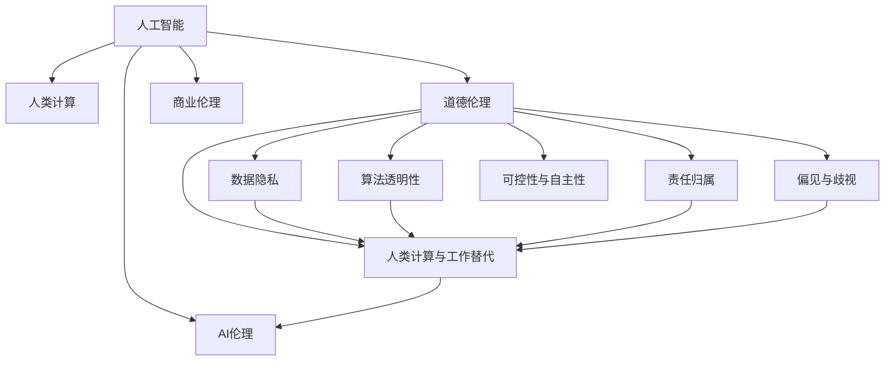
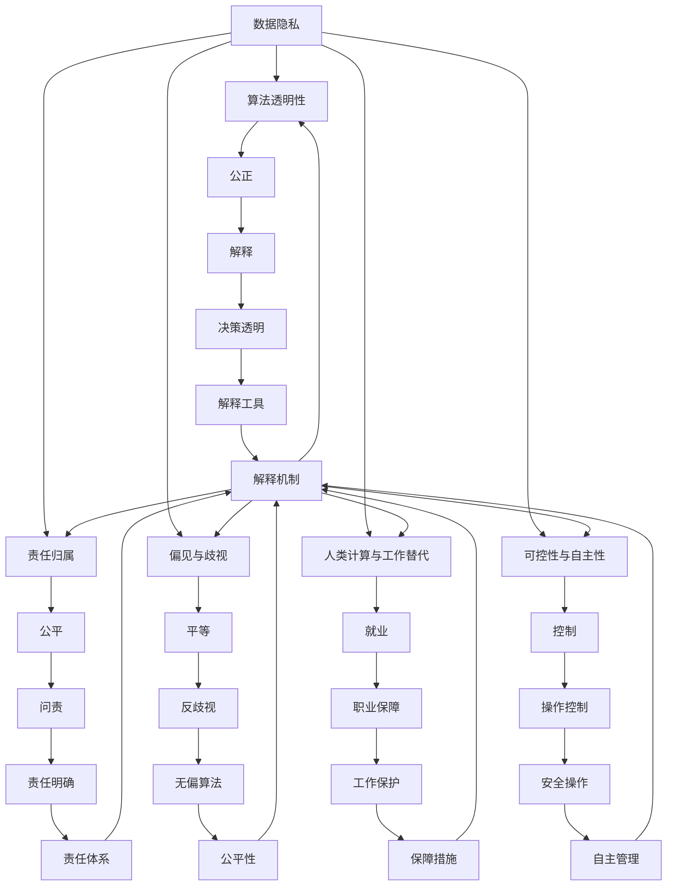

                 

# AI驱动的创新：人类计算在商业中的道德考虑因素与创新

## 1. 背景介绍

### 1.1 问题由来

在当今数字化经济时代，人工智能(AI)技术的应用日益广泛，深刻影响着各行各业的运营模式。AI驱动的自动化、智能化解决方案正在重塑业务流程，带来显著的效率提升和成本节约。然而，随着AI技术的普及，一系列道德伦理问题也随之涌现，挑战着人类社会的公平正义原则。

商业领域尤其如此，AI技术的引入既提供了创新发展的契机，也带来了复杂的道德考量。如何在商业中平衡技术进步与伦理道德，成为亟需探讨和解决的问题。

### 1.2 问题核心关键点

本节的焦点在于分析AI在商业应用中的道德问题，并探讨如何兼顾技术创新与伦理道德，构建负责任的商业AI生态。这涉及以下几个关键点：

1. **数据隐私与安全**：AI系统依赖于大量数据，数据隐私和安全问题尤为突出。如何在数据收集和处理过程中保护用户隐私，防止数据泄露和滥用，是商业AI应用中必须解决的难题。

2. **算法透明性与可解释性**：商业决策依赖于AI模型的预测结果，如何确保模型决策的透明性和可解释性，避免黑箱操作，是维护公平和公正的基石。

3. **责任归属与问责机制**：AI系统在商业应用中的决策错误可能导致严重后果，如何明确责任归属，建立健全问责机制，保障商业活动的道德底线。

4. **偏见与歧视**：AI模型可能会因数据偏差而产生偏见，导致不公正的商业决策。如何识别和消除模型中的偏见，确保商业活动的公平性，是AI伦理的重要课题。

5. **人类计算与工作替代**：AI自动化和智能化的趋势，可能引发大规模工作岗位的替代，如何平衡自动化与就业的关系，避免社会不公，是AI技术应用中的道德挑战。

6. **可控性与自主性**：AI系统在商业应用中，可能拥有部分自主决策权。如何在商业活动中保障人类对AI系统的控制权，防止其滥用，是确保AI伦理的关键。

## 2. 核心概念与联系

### 2.1 核心概念概述

为更好地理解AI在商业中的道德考量，我们需要明确几个核心概念：

- **人工智能(AI)**：通过算法和数据处理实现的人类智能行为，能够执行复杂任务，如识别、决策、预测等。

- **人类计算(Computing for Humanity)**：强调AI技术服务于人类福祉，提升社会效率，推动人类进步的使命。

- **道德伦理**：指导人类行为和决策的价值规范，包括公正、平等、尊重等基本原则。

- **商业伦理**：商业活动中的道德标准和行为规范，强调公平竞争、诚信经营、客户保护等。

- **AI伦理**：在AI技术开发和应用中，如何维护数据隐私、算法透明、责任归属、公平性、就业、自主性等道德原则。

这些概念之间的联系如图1所示：



图1：核心概念之间的联系

### 2.2 核心概念原理和架构的 Mermaid 流程图



图2：核心概念原理和架构的 Mermaid 流程图

## 3. 核心算法原理 & 具体操作步骤

### 3.1 算法原理概述

AI在商业中的应用，通常遵循数据驱动的决策模式。基于大量数据，通过机器学习或深度学习算法训练模型，然后部署到实际业务场景中，自动或半自动地执行商业决策。这一过程可以分为以下几个步骤：

1. **数据收集与处理**：从业务系统中收集相关数据，并进行清洗、整理和标注。
2. **模型训练与优化**：选择合适的算法，使用训练数据集训练模型，通过交叉验证等方法优化模型性能。
3. **模型部署与监控**：将训练好的模型部署到业务系统中，进行实际应用，同时监控模型表现，及时调整参数或重新训练。
4. **决策执行与反馈**：模型根据输入数据输出决策结果，执行到业务流程中，并根据反馈调整模型。

### 3.2 算法步骤详解

以下详细描述AI在商业应用中的具体操作步骤：

**Step 1: 数据收集与处理**

- **数据来源**：商业运营中的各种数据，包括客户交易记录、供应链数据、市场调研数据、客户反馈数据等。
- **数据清洗**：去除噪声、异常值，确保数据的质量和一致性。
- **数据标注**：对部分数据进行人工标注，用于模型训练的监督信号。
- **数据预处理**：将数据转换为模型所需的格式，如特征提取、归一化、编码等。

**Step 2: 模型训练与优化**

- **选择算法**：根据任务特性，选择适合的机器学习或深度学习算法，如线性回归、决策树、支持向量机、卷积神经网络、循环神经网络等。
- **训练过程**：使用标注数据训练模型，通过迭代优化算法更新模型参数，如梯度下降、随机梯度下降等。
- **交叉验证**：将数据集分为训练集和验证集，使用交叉验证技术评估模型泛化性能，调整模型参数。
- **超参数调优**：选择合适的超参数，如学习率、正则化系数、批次大小等，优化模型表现。

**Step 3: 模型部署与监控**

- **模型集成**：将训练好的模型集成到业务系统中，作为自动化决策的核心组件。
- **实时监控**：实时监控模型在实际应用中的表现，如准确率、召回率、F1分数等。
- **异常检测**：设置异常检测机制，及时发现模型异常表现，防止错误决策。
- **模型更新**：根据业务需求和反馈，定期更新模型，提升其性能。

**Step 4: 决策执行与反馈**

- **决策输出**：模型根据输入数据自动输出决策结果，如客户推荐、库存管理、风险评估等。
- **执行与验证**：将决策结果应用于业务流程，验证其准确性和实用性。
- **反馈循环**：根据实际效果，收集反馈数据，用于模型再训练和优化。

### 3.3 算法优缺点

AI在商业应用中具有以下优点：

- **效率提升**：自动化处理大量数据，提升决策速度和处理效率。
- **成本节约**：减少人力成本，降低运营成本。
- **精准决策**：基于数据分析，提升决策的精准性和可靠性。
- **数据驱动**：通过数据驱动决策，减少主观偏见。

同时，AI在商业应用中也存在一些缺点：

- **数据隐私**：收集和处理大量数据，涉及用户隐私问题。
- **算法透明性**：模型决策过程复杂，难以解释和理解。
- **偏见与歧视**：模型可能会因数据偏差而产生偏见。
- **责任归属**：模型决策错误时，责任归属不明确。
- **工作替代**：自动化可能引发大规模工作岗位的替代。

### 3.4 算法应用领域

AI在商业中的应用领域非常广泛，涵盖了以下几个主要方面：

1. **客户管理**：通过数据分析和机器学习，实现客户细分、需求预测、个性化推荐等。
2. **风险管理**：利用AI模型进行信用评估、欺诈检测、风险预警等。
3. **供应链优化**：通过数据分析和预测，优化库存管理、物流配送等。
4. **市场分析**：利用AI技术进行市场调研、竞争对手分析、消费者行为预测等。
5. **客户服务**：通过AI驱动的聊天机器人、智能客服系统，提升客户服务效率和质量。
6. **人力资源管理**：利用AI进行员工招聘、绩效评估、培训推荐等。

## 4. 数学模型和公式 & 详细讲解 & 举例说明

### 4.1 数学模型构建

本节将使用数学语言对AI在商业中的道德考量进行严格刻画。

设商业决策系统由数据集 $D=\{x_i, y_i\}_{i=1}^N$ 和模型 $M$ 组成，其中 $x_i$ 为输入数据，$y_i$ 为决策结果。模型 $M$ 的输出为 $\hat{y} = M(x)$。

假设模型的损失函数为 $L(y, \hat{y})$，则期望风险为：

$$
R(M) = \mathbb{E}_{(x,y) \sim D} L(y, M(x))
$$

商业决策系统的目标是最小化期望风险 $R(M)$，即：

$$
M^* = \mathop{\arg\min}_{M} R(M)
$$

为了确保模型决策的透明性和公平性，需要在模型中加入一些道德约束条件，如：

1. **公平性约束**：保证不同群体之间的决策结果公平，避免偏见。
2. **透明度约束**：确保模型决策过程可解释，避免黑箱操作。
3. **隐私保护约束**：在数据收集和处理过程中，保护用户隐私，防止数据泄露。
4. **责任归属约束**：明确决策错误的责任归属，建立问责机制。
5. **就业保障约束**：平衡自动化与就业，保障员工权益。

### 4.2 公式推导过程

以公平性约束为例，假设模型在两个群体 $G_1$ 和 $G_2$ 上的决策结果分别为 $\hat{y}_{G_1}$ 和 $\hat{y}_{G_2}$，公平性约束可以表示为：

$$
\mathbb{E}_{(x,y) \sim D} |\hat{y}_{G_1} - \hat{y}_{G_2}| = 0
$$

即模型在两个群体上的决策结果期望值相等。

将上式转化为优化问题，得到：

$$
\min_{M} \mathbb{E}_{(x,y) \sim D} |\hat{y}_{G_1} - \hat{y}_{G_2}|
$$

在实际应用中，可以通过引入公平性指标，如Demographic Parity Index (DPI) 和 Equalized Odds，来衡量和优化模型的公平性。

### 4.3 案例分析与讲解

以下以客户推荐系统为例，分析AI在商业应用中的道德问题。

**案例背景**：某电商网站通过AI系统进行个性化推荐，提升用户体验和销售额。

**数据收集**：收集用户浏览记录、购买历史、用户画像等数据。

**模型训练**：使用机器学习算法训练推荐模型，优化模型参数。

**模型部署**：将训练好的模型部署到网站中，实现实时推荐。

**道德考量**：

- **数据隐私**：收集用户浏览数据时，如何保护用户隐私，防止数据泄露。
- **算法透明性**：用户如何理解和信任模型的推荐结果，模型是否可解释。
- **偏见与歧视**：模型推荐结果是否因性别、年龄等因素产生偏见。
- **责任归属**：推荐结果错误时，责任应由谁承担。
- **就业保障**：AI推荐系统是否导致客户服务人员岗位减少。

通过案例分析，我们可以看到AI在商业应用中的道德问题具有复杂性和多样性。如何在技术进步与伦理道德之间找到平衡，是商业AI应用的关键挑战。

## 5. 项目实践：代码实例和详细解释说明

### 5.1 开发环境搭建

在进行商业AI应用开发前，我们需要准备好开发环境。以下是使用Python进行TensorFlow开发的环境配置流程：

1. 安装Anaconda：从官网下载并安装Anaconda，用于创建独立的Python环境。

2. 创建并激活虚拟环境：
```bash
conda create -n tf-env python=3.8 
conda activate tf-env
```

3. 安装TensorFlow：根据CUDA版本，从官网获取对应的安装命令。例如：
```bash
conda install tensorflow tensorflow-gpu cudatoolkit=11.1 -c pytorch -c conda-forge
```

4. 安装各类工具包：
```bash
pip install numpy pandas scikit-learn matplotlib tqdm jupyter notebook ipython
```

完成上述步骤后，即可在`tf-env`环境中开始商业AI应用的开发。

### 5.2 源代码详细实现

下面我们以推荐系统为例，给出使用TensorFlow进行商业AI开发的PyTorch代码实现。

首先，定义推荐系统模型：

```python
import tensorflow as tf
from tensorflow.keras.layers import Input, Dense, Embedding
from tensorflow.keras.models import Model

# 定义输入层
input_user = Input(shape=(1,), name='user')
input_item = Input(shape=(1,), name='item')

# 定义用户和物品嵌入层
user_embedding = Embedding(input_dim=1000, output_dim=16, name='user_embedding')
item_embedding = Embedding(input_dim=1000, output_dim=16, name='item_embedding')

# 定义预测层
predictions = Dense(1, activation='sigmoid', name='predictions')(user_embedding(user_input) + item_embedding(item_input))

# 定义模型
model = Model(inputs=[input_user, input_item], outputs=predictions)

# 编译模型
model.compile(optimizer='adam', loss='binary_crossentropy', metrics=['accuracy'])

# 打印模型结构
model.summary()
```

然后，定义训练和评估函数：

```python
from tensorflow.keras.preprocessing.text import Tokenizer
from tensorflow.keras.preprocessing.sequence import pad_sequences

# 加载数据
train_data = load_train_data()
test_data = load_test_data()

# 数据预处理
tokenizer = Tokenizer(num_words=1000)
user_tokenizer = Tokenizer(num_words=1000)
item_tokenizer = Tokenizer(num_words=1000)

user_tokenizer.fit_on_texts(train_data['user_ids'])
item_tokenizer.fit_on_texts(train_data['item_ids'])

train_user_ids = user_tokenizer.texts_to_sequences(train_data['user_ids'])
train_item_ids = item_tokenizer.texts_to_sequences(train_data['item_ids'])
test_user_ids = user_tokenizer.texts_to_sequences(test_data['user_ids'])
test_item_ids = item_tokenizer.texts_to_sequences(test_data['item_ids'])

train_user_input = pad_sequences(train_user_ids, maxlen=100, padding='post')
train_item_input = pad_sequences(train_item_ids, maxlen=100, padding='post')
test_user_input = pad_sequences(test_user_ids, maxlen=100, padding='post')
test_item_input = pad_sequences(test_item_ids, maxlen=100, padding='post')

# 定义训练函数
def train(model, train_data, val_data, epochs, batch_size):
    model.fit([train_user_input, train_item_input], train_data['labels'], epochs=epochs, batch_size=batch_size, validation_data=([val_user_input, val_item_input], val_data['labels']))
    return model

# 定义评估函数
def evaluate(model, test_data):
    predictions = model.predict([test_user_input, test_item_input])
    return predictions
```

最后，启动训练流程并在测试集上评估：

```python
epochs = 10
batch_size = 32

# 加载模型
model = load_model()

# 训练模型
trained_model = train(model, train_data, val_data, epochs, batch_size)

# 评估模型
test_predictions = evaluate(trained_model, test_data)

# 打印评估结果
print('Test Accuracy:', test_predictions.mean())
```

以上就是使用TensorFlow进行商业AI应用的代码实现。可以看到，通过TensorFlow，我们可以轻松搭建和训练推荐系统模型，提升商业决策的精准性和效率。

### 5.3 代码解读与分析

让我们再详细解读一下关键代码的实现细节：

**推荐系统模型定义**：
- `Input`层：定义用户和物品的输入层。
- `Embedding`层：将用户和物品的ID序列转换为向量表示。
- `Dense`层：定义预测层，输出推荐结果的概率。
- `Model`类：将各层组合成完整的推荐系统模型。
- `compile`方法：编译模型，定义优化器、损失函数和评估指标。

**数据预处理**：
- `Tokenizer`类：将文本数据转换为ID序列。
- `pad_sequences`函数：对ID序列进行填充，确保统一长度。

**训练函数**：
- `fit`方法：使用训练数据训练模型，同时指定验证数据和迭代轮数。

**评估函数**：
- `predict`方法：使用测试数据评估模型。

**训练和评估流程**：
- 加载模型和数据。
- 使用训练函数训练模型。
- 使用评估函数评估模型。
- 输出评估结果。

可以看到，TensorFlow提供了强大的模型构建和训练工具，可以轻松实现商业AI应用的开发。开发者只需专注于算法选择和数据处理，即可高效构建商业决策系统。

当然，工业级的系统实现还需考虑更多因素，如模型的保存和部署、超参数的自动搜索、多模型集成等。但核心的商业AI应用开发流程基本与此类似。

## 6. 实际应用场景

### 6.1 智能客服系统

智能客服系统通过AI技术，实现自动应答和问题解决，提升客户服务效率和体验。

**应用场景**：某电商平台的智能客服系统。

**技术实现**：收集历史客服对话记录，使用语言模型进行文本处理，训练推荐模型进行问题匹配和回答生成。

**道德考量**：

- **数据隐私**：在对话记录中如何保护客户隐私。
- **算法透明性**：客服系统是否能够解释其回答依据。
- **偏见与歧视**：系统回答是否因性别、地域等因素产生偏见。
- **责任归属**：回答错误时，责任由谁承担。
- **就业保障**：智能客服是否导致客服人员岗位减少。

**未来展望**：通过持续训练和优化，智能客服系统将逐渐替代简单重复的客服工作，但复杂问题仍需人工介入，确保服务质量。

### 6.2 金融风险管理

金融风险管理通过AI技术，实现实时监控和预警，降低风险损失。

**应用场景**：某银行的信用风险管理系统。

**技术实现**：收集客户交易记录和信用数据，使用机器学习模型进行风险评估和预警。

**道德考量**：

- **数据隐私**：在客户数据收集和处理过程中如何保护隐私。
- **算法透明性**：模型评估结果是否可解释。
- **偏见与歧视**：模型评估是否因种族、性别等因素产生偏见。
- **责任归属**：风险评估错误时，责任由谁承担。
- **就业保障**：AI系统是否导致风险管理岗位减少。

**未来展望**：通过持续优化和监督，AI系统将提升风险管理的精准性，但仍有大量决策需要人工干预。

### 6.3 智能供应链管理

智能供应链管理通过AI技术，实现库存优化和物流调度，提升运营效率。

**应用场景**：某物流公司的仓库管理系统。

**技术实现**：收集仓库数据和订单信息，使用AI算法进行库存预测和调拨优化。

**道德考量**：

- **数据隐私**：在数据收集过程中如何保护员工隐私。
- **算法透明性**：系统决策过程是否可解释。
- **偏见与歧视**：系统调拨是否因地域、季节等因素产生偏见。
- **责任归属**：决策错误时，责任由谁承担。
- **就业保障**：AI系统是否导致仓库岗位减少。

**未来展望**：通过持续训练和优化，AI系统将提升库存管理效率，但需要定期审计系统决策，确保公正性。

## 7. 工具和资源推荐

### 7.1 学习资源推荐

为了帮助开发者系统掌握AI在商业中的道德考量，这里推荐一些优质的学习资源：

1. 《人工智能伦理与决策》系列博文：由人工智能伦理专家撰写，全面介绍AI伦理问题及其解决方案。

2. CS229《机器学习》课程：斯坦福大学开设的机器学习明星课程，涵盖数据隐私、算法透明、公平性等伦理问题。

3. 《人工智能的道德边界》书籍：深度剖析AI技术在商业应用中的伦理挑战，提出系统性的解决方案。

4. AI Ethics in Practice系列讲座：由业内专家主持，深入探讨AI在商业中的伦理应用和实践。

5. IEEE AI & Ethics资源库：提供AI伦理标准、指南、案例分析等资源，供开发者参考。

通过对这些资源的学习实践，相信你一定能够全面掌握AI在商业中的伦理问题，并用于构建负责任的商业AI生态。

### 7.2 开发工具推荐

高效的开发离不开优秀的工具支持。以下是几款用于商业AI应用开发的常用工具：

1. TensorFlow：由Google主导开发的开源深度学习框架，生产部署方便，适合大规模工程应用。

2. PyTorch：基于Python的开源深度学习框架，灵活动态的计算图，适合快速迭代研究。

3. Keras：基于TensorFlow的高级神经网络API，简化了模型构建和训练过程。

4. Jupyter Notebook：轻量级的交互式编程环境，方便调试和展示代码。

5. Weights & Biases：模型训练的实验跟踪工具，可以记录和可视化模型训练过程中的各项指标，方便对比和调优。

6. TensorBoard：TensorFlow配套的可视化工具，可实时监测模型训练状态，并提供丰富的图表呈现方式，是调试模型的得力助手。

合理利用这些工具，可以显著提升商业AI应用开发的效率，加快创新迭代的步伐。

### 7.3 相关论文推荐

AI在商业中的应用源于学界的持续研究。以下是几篇奠基性的相关论文，推荐阅读：

1. "Data Privacy: Foundations, Practices, and Challenges"：IEEE期刊论文，探讨数据隐私保护的技术和策略。

2. "Algorithms of Trust: Fairness, Accountability, and Transparency in Machine Learning"：IJCAI论文，分析机器学习算法的公平性和可解释性问题。

3. "Ethical AI: What Can We Learn From the TIK Debate?"：Towards Data Science博客文章，通过德国TIK委员会的案例，探讨AI伦理的实践应用。

4. "AI Ethics: The Way Forward"：Nature评论文章，讨论AI伦理的未来发展方向。

5. "Fairness and Accountability in Machine Learning: A Conceptual Review and a Model for Evaluation"：IEEE交易文章，提出评估机器学习模型公平性的模型和方法。

这些论文代表了大语言模型微调技术的发展脉络。通过学习这些前沿成果，可以帮助研究者把握学科前进方向，激发更多的创新灵感。

## 8. 总结：未来发展趋势与挑战

### 8.1 总结

本文对AI在商业中的应用进行全面系统的介绍。首先阐述了AI在商业中的道德问题，明确了商业AI应用中需要关注的几个关键点。其次，从原理到实践，详细讲解了AI在商业中的道德考量，给出了具体的代码实现和案例分析。同时，本文还探讨了AI在智能客服、金融风险管理、智能供应链管理等实际应用场景中的道德问题，展示了AI技术在商业中的广泛应用。

通过本文的系统梳理，可以看到，AI在商业应用中的道德问题具有复杂性和多样性。如何在技术进步与伦理道德之间找到平衡，是商业AI应用的关键挑战。

### 8.2 未来发展趋势

展望未来，AI在商业中的应用将呈现以下几个发展趋势：

1. **智能协同**：AI系统将与人类协同工作，提升决策的精准性和公正性。
2. **数据隐私保护**：通过隐私保护技术，如差分隐私、联邦学习等，保护用户隐私，确保数据安全。
3. **透明可解释**：开发可解释性AI模型，增强决策过程的透明度，减少黑箱操作。
4. **公平与正义**：建立公平性评估和监督机制，确保AI系统的决策公正，避免偏见和歧视。
5. **责任体系**：建立健全责任归属机制，明确AI系统的责任主体，保障用户权益。
6. **就业保障**：平衡自动化与就业，确保AI技术带来的是共赢而非失业。

这些趋势凸显了商业AI应用的广阔前景，但也提出了新的挑战。如何在技术创新与伦理道德之间找到平衡，将是AI技术未来发展的重要课题。

### 8.3 面临的挑战

尽管AI在商业中的应用已经取得了显著进展，但在迈向更加智能化、普适化应用的过程中，仍面临诸多挑战：

1. **数据隐私保护**：商业运营中涉及大量敏感数据，如何确保数据隐私和安全，避免数据泄露和滥用，是商业AI应用的核心难题。
2. **算法透明性**：AI模型的复杂性和黑箱操作，导致其决策难以理解和解释，降低用户信任。
3. **公平与正义**：AI系统可能因数据偏差而产生偏见，导致不公正的决策。如何识别和消除模型中的偏见，确保商业活动的公平性，是AI伦理的重要课题。
4. **责任归属**：AI系统在商业应用中的决策错误可能导致严重后果，如何明确责任归属，建立健全问责机制，保障商业活动的道德底线。
5. **就业保障**：AI自动化和智能化的趋势，可能引发大规模工作岗位的替代，如何平衡自动化与就业，避免社会不公，是AI技术应用中的道德挑战。
6. **技术复杂性**：AI技术的复杂性要求高水平的人才和技术支持，如何降低技术门槛，提高商业AI应用的普及性和可行性，是亟待解决的问题。

面对这些挑战，需要学界、企业和社会共同努力，寻找平衡点，确保AI技术在商业应用中的道德使用。

### 8.4 研究展望

面对未来商业AI应用的道德挑战，未来的研究需要在以下几个方面寻求新的突破：

1. **隐私保护技术**：开发更高效、更安全的隐私保护技术，如差分隐私、联邦学习等，确保数据隐私和安全。

2. **可解释性模型**：开发更透明、更可解释的AI模型，增强决策过程的透明度，减少黑箱操作。

3. **公平性评估**：建立健全公平性评估和监督机制，确保AI系统的决策公正，避免偏见和歧视。

4. **责任归属机制**：建立明确的责任归属机制，确保AI系统的决策责任主体明确，保障用户权益。

5. **就业保障措施**：平衡自动化与就业，确保AI技术带来的是共赢而非失业，制定就业保障措施，保护员工权益。

6. **技术普及**：降低AI技术的复杂性，提高商业AI应用的普及性和可行性，使更多人能够受益于AI技术。

这些研究方向将引领商业AI应用走向更加成熟和负责任的阶段，为构建人机协同的智能商业生态奠定坚实基础。

## 9. 附录：常见问题与解答

**Q1：AI在商业应用中如何保护数据隐私？**

A: AI在商业应用中保护数据隐私主要通过以下几种方式：

1. **数据匿名化**：在数据处理前，对敏感数据进行匿名化处理，如去除个人标识符、脱敏处理等。
2. **差分隐私**：在数据发布前，加入噪声干扰，确保无法通过单个数据点推断出原始数据。
3. **联邦学习**：在分布式环境中，数据不在同一个地方集中，而是通过分布式计算实现模型训练，保护数据隐私。
4. **数据加密**：在数据传输和存储过程中，使用加密技术保护数据安全。

**Q2：如何确保AI算法的透明性和可解释性？**

A: 确保AI算法的透明性和可解释性主要通过以下几种方式：

1. **可解释性模型**：选择可解释性较高的模型，如决策树、线性回归等，减少黑箱操作。
2. **解释工具**：开发解释工具，如LIME、SHAP等，生成模型决策的解释说明，帮助理解模型行为。
3. **透明度指标**：建立透明度指标，如决策路径、特征权重等，评估模型的可解释性。
4. **用户反馈**：收集用户反馈，调整模型参数，优化解释效果。

**Q3：如何在AI系统中消除偏见和歧视？**

A: 在AI系统中消除偏见和歧视主要通过以下几种方式：

1. **数据预处理**：在数据收集和处理过程中，使用公平性指标检测和过滤偏见数据。
2. **算法改进**：设计公平性约束条件，优化模型训练过程，确保模型输出公正。
3. **公平性评估**：使用公平性指标评估模型性能，检测和修正偏见。
4. **多模型集成**：通过多个模型的组合，减少单模型偏见的影响。

**Q4：AI系统在商业应用中的责任归属如何确定？**

A: AI系统在商业应用中的责任归属主要通过以下几种方式：

1. **明确责任主体**：在系统设计和开发阶段，明确责任主体，如开发团队、运营团队等。
2. **责任保险**：引入责任保险机制，为AI系统的错误决策提供保障。
3. **审计和监督**：建立审计和监督机制，定期审查系统决策，发现和纠正错误。
4. **用户同意**：在用户使用前，明确告知系统决策的风险和责任，获取用户同意。

**Q5：AI自动化对就业的影响如何控制？**

A: AI自动化对就业的影响控制主要通过以下几种方式：

1. **技能培训**：提供技能培训，帮助员工适应新的工作岗位和工具。
2. **职位转换**：将自动化替代的岗位转移到新的业务领域，如数据分析、技术支持等。
3. **灵活就业**：引入灵活就业模式，如兼职、自由职业等，平衡自动化与就业。
4. **社会保障**：完善社会保障体系，提供失业保障和再就业支持。

---

作者：禅与计算机程序设计艺术 / Zen and the Art of Computer Programming

