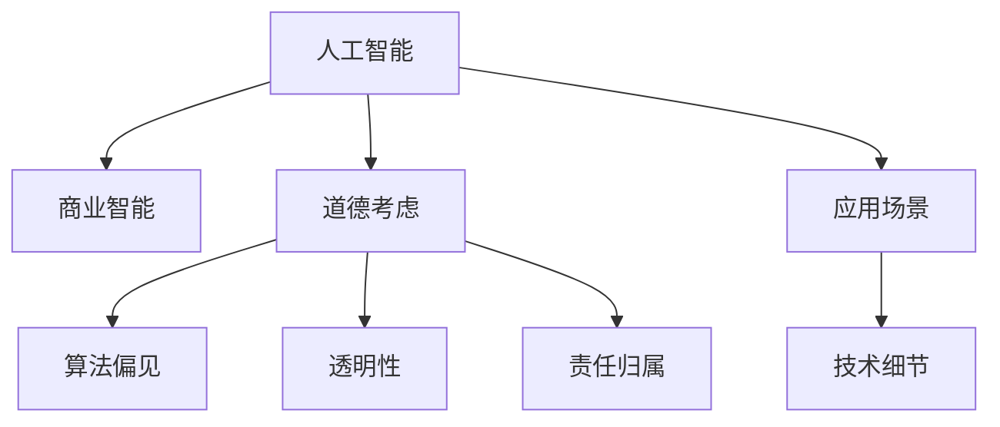

                 

# AI驱动的创新：人类计算在商业中的道德考虑因素与应用前景分析

## 1. 背景介绍

### 1.1 问题由来
随着人工智能（AI）技术的迅猛发展，AI在商业应用中的地位变得越来越重要。然而，AI的发展和应用也引发了一系列复杂的道德和伦理问题。这些问题包括但不限于数据隐私、算法偏见、决策透明度、责任归属等。这些问题不仅影响到AI技术的可持续发展，还影响到其在商业中的广泛应用。本文旨在探讨AI在商业应用中的道德考虑因素，并分析其应用前景。

### 1.2 问题核心关键点
本文关注的核心问题包括：
- AI在商业中的应用现状和潜力
- 数据隐私、算法偏见等道德问题及其对商业的影响
- 如何在商业应用中确保AI的透明性和责任归属
- AI在商业中面临的挑战与机遇

### 1.3 问题研究意义
研究AI在商业中的应用，不仅有助于企业提升运营效率和创新能力，还可以帮助社会更好地理解和利用AI技术。同时，通过对AI道德问题的深入探讨，可以为AI技术的健康发展提供指导和规范。

## 2. 核心概念与联系

### 2.1 核心概念概述

为更好地理解AI在商业中的道德考虑因素，本节将介绍几个密切相关的核心概念：

- **人工智能（AI）**：指模拟人类智能的计算机系统，涵盖机器学习、深度学习、自然语言处理等技术。AI技术通过大数据分析和计算，实现了自动化的决策和任务执行。

- **商业智能（BI）**：指利用数据分析和可视化技术，帮助企业洞察商业洞察，支持决策制定和运营优化。AI技术在BI中的应用，能够提高数据的处理和分析效率，提升商业决策的科学性和准确性。

- **道德（Ethics）**：指指导人类行为的道德原则和规范。在AI应用中，道德问题涉及数据隐私、算法公正性、决策透明度等方面。

- **算法偏见（Algorithmic Bias）**：指算法在处理数据时所表现出的对某些群体或属性的不公平对待。算法偏见不仅影响AI的性能，还可能引发歧视和不公平问题。

- **透明性（Transparency）**：指AI系统在处理数据和生成决策时的可解释性。透明性有助于增强用户对AI系统的信任，确保决策的合理性和公正性。

- **责任归属（Accountability）**：指在AI系统中，当出现错误或问题时，能够明确责任主体的能力。责任归属问题关系到AI系统的可信赖度和法律责任。

这些核心概念之间的逻辑关系可以通过以下Mermaid流程图来展示：



这个流程图展示了这个核心概念之间的联系：

1. AI技术为商业智能提供强大的分析能力。
2. 商业应用中，AI面临道德问题，需要确保算法偏见、透明性和责任归属。
3. AI的应用场景和技术细节影响着其道德考虑因素。

## 3. 核心算法原理 & 具体操作步骤
### 3.1 算法原理概述

AI在商业应用中，通常采用监督学习和无监督学习等算法，通过分析历史数据和用户行为，预测未来趋势和优化决策。

### 3.2 算法步骤详解

AI在商业应用中的算法步骤通常包括以下几个关键步骤：

1. **数据准备**：收集和清洗商业数据，构建训练集和测试集。
2. **模型选择**：选择适合的AI算法，如回归、分类、聚类等。
3. **模型训练**：使用训练集数据，训练AI模型，获取参数。
4. **模型评估**：使用测试集数据，评估模型性能，调整参数。
5. **模型部署**：将训练好的模型部署到实际应用中，进行商业决策和预测。
6. **监控优化**：实时监控模型表现，根据新数据和业务需求，定期优化和更新模型。

### 3.3 算法优缺点

AI在商业应用中的算法优点包括：

- **自动化决策**：AI能够快速处理和分析大量数据，提供自动化决策支持。
- **提高效率**：AI可以优化业务流程，减少人工干预，提高运营效率。
- **预测分析**：AI能够预测市场趋势和用户行为，帮助企业制定战略。

然而，AI算法也存在以下缺点：

- **数据依赖**：AI模型的性能依赖于训练数据的质量和数量，数据偏差可能导致模型偏见。
- **解释性不足**：黑盒模型缺乏可解释性，难以解释决策过程。
- **法律和伦理风险**：AI在处理敏感数据时，可能涉及隐私保护和伦理问题。
- **技术复杂性**：AI算法的实现和维护需要高水平的技术支持。

### 3.4 算法应用领域

AI在商业中的应用领域非常广泛，包括但不限于：

- **客户关系管理（CRM）**：通过分析客户数据，提升客户满意度和忠诚度。
- **市场营销**：预测市场需求，优化广告投放策略，提高营销效果。
- **供应链管理**：优化库存管理，提高供应链效率，减少成本。
- **财务分析**：预测市场波动，识别风险，支持决策。
- **人力资源管理**：招聘、培训、绩效评估等。
- **风险管理**：识别和防范金融风险，保障企业安全。

## 4. 数学模型和公式 & 详细讲解  
### 4.1 数学模型构建

在商业应用中，常用的AI算法包括回归、分类、聚类等。以下以回归模型为例，介绍其数学模型构建。

假设我们有一个样本集 $D = \{(x_i, y_i)\}_{i=1}^N$，其中 $x_i$ 是输入特征向量，$y_i$ 是目标变量。回归模型的目标是最小化预测值与实际值之间的差距。常用的回归模型包括线性回归、岭回归、LASSO回归等。

线性回归模型的目标函数为：

$$
\min_{\theta} \sum_{i=1}^N (y_i - \theta^T x_i)^2
$$

其中，$\theta$ 是模型的参数向量，$x_i$ 是输入特征向量，$y_i$ 是目标变量。

### 4.2 公式推导过程

线性回归模型的梯度下降优化公式为：

$$
\theta \leftarrow \theta - \alpha \frac{1}{N} \sum_{i=1}^N (y_i - \theta^T x_i) x_i
$$

其中，$\alpha$ 是学习率，$N$ 是样本数量，$x_i$ 是输入特征向量，$y_i$ 是目标变量。

### 4.3 案例分析与讲解

以某电商平台的数据为例，假设我们想预测用户的购买概率。收集用户的历史行为数据，包括浏览次数、购物车添加次数、购买次数等。构建线性回归模型，将历史行为数据作为输入特征，将购买次数作为目标变量。使用训练集数据训练模型，并在测试集上评估模型性能。通过不断地调整模型参数和优化算法，提高模型的预测准确性。

## 5. 项目实践：代码实例和详细解释说明
### 5.1 开发环境搭建

在进行商业AI项目开发前，我们需要准备好开发环境。以下是使用Python进行Scikit-Learn开发的环境配置流程：

1. 安装Anaconda：从官网下载并安装Anaconda，用于创建独立的Python环境。

2. 创建并激活虚拟环境：
```bash
conda create -n ai-env python=3.8 
conda activate ai-env
```

3. 安装Scikit-Learn：
```bash
pip install scikit-learn
```

4. 安装各类工具包：
```bash
pip install numpy pandas scikit-learn matplotlib tqdm jupyter notebook ipython
```

完成上述步骤后，即可在`ai-env`环境中开始商业AI项目的开发。

### 5.2 源代码详细实现

以下是一个简单的回归模型示例代码，用于预测电商用户的购买概率。

```python
import pandas as pd
from sklearn.linear_model import LinearRegression
from sklearn.metrics import mean_squared_error

# 加载数据
data = pd.read_csv('user_behavior.csv')

# 划分训练集和测试集
train_data = data.sample(frac=0.8, random_state=0)
test_data = data.drop(train_data.index)

# 构建特征向量
train_x = train_data[['browsing_count', 'add_to_cart_count']]
test_x = test_data[['browsing_count', 'add_to_cart_count']]

# 目标变量
train_y = train_data['purchase_count']
test_y = test_data['purchase_count']

# 构建模型
model = LinearRegression()

# 训练模型
model.fit(train_x, train_y)

# 评估模型
train_score = model.score(train_x, train_y)
test_score = model.score(test_x, test_y)

print('Train score:', train_score)
print('Test score:', test_score)

# 预测新用户购买概率
new_user = pd.DataFrame({'browsing_count': 10, 'add_to_cart_count': 5})
predict_proba = model.predict(new_user)
print('Prediction:', predict_proba)
```

### 5.3 代码解读与分析

让我们再详细解读一下关键代码的实现细节：

- `pd.read_csv`：使用pandas库加载CSV格式的数据。
- `train_data.sample(frac=0.8, random_state=0)`：随机选择80%的数据作为训练集，20%作为测试集。
- `train_x = train_data[['browsing_count', 'add_to_cart_count']]`：选择特征向量。
- `train_y = train_data['purchase_count']`：选择目标变量。
- `model = LinearRegression()`：构建线性回归模型。
- `model.fit(train_x, train_y)`：训练模型。
- `model.score(train_x, train_y)`：评估模型在训练集上的表现。
- `model.score(test_x, test_y)`：评估模型在测试集上的表现。
- `predict_proba = model.predict(new_user)`：使用模型对新用户进行预测。

## 6. 实际应用场景
### 6.1 智能客服系统

智能客服系统可以通过AI技术，实现对客户问题的自动识别和解答。收集历史客服数据，使用监督学习算法训练模型，对新客户的问题进行分类和回答。

### 6.2 市场营销分析

市场营销分析可以使用AI算法，预测市场需求和广告效果。收集历史销售数据和广告数据，构建预测模型，优化广告投放策略，提升广告ROI。

### 6.3 供应链管理优化

供应链管理优化可以使用AI算法，预测库存需求和物流成本。收集历史库存和物流数据，构建预测模型，优化库存管理和物流调度，提高供应链效率。

### 6.4 风险管理

风险管理可以使用AI算法，识别和预测金融风险。收集历史交易数据和市场数据，构建预测模型，识别风险点，制定风险控制策略。

### 6.5 未来应用展望

随着AI技术的不断进步，商业应用将更加广泛和深入。AI将在数据分析、决策支持、运营优化等方面发挥重要作用，为企业带来更高的效率和创新能力。同时，AI技术的广泛应用也将带来更多的道德和伦理问题，需要企业在应用过程中更加注重道德考虑和合规性。

## 7. 工具和资源推荐
### 7.1 学习资源推荐

为了帮助开发者系统掌握AI在商业应用中的道德考虑因素，以下是一些优质的学习资源：

1. 《人工智能伦理与道德》系列博文：由AI伦理专家撰写，深入浅出地介绍了AI伦理、道德和法律问题。

2. 《商业智能与数据分析》课程：由知名大学开设的在线课程，涵盖数据处理、模型构建、决策分析等内容。

3. 《数据科学与机器学习》书籍：全面介绍了数据科学和机器学习的基本概念和方法，适合初学者和进阶者。

4. 《人工智能商业应用》白皮书：由行业协会发布的权威报告，提供了AI在商业应用的现状和趋势分析。

5. 《数据隐私保护与合规》书籍：介绍数据隐私保护和合规的法律法规和最佳实践，为AI应用提供合规指导。

通过对这些资源的学习实践，相信你一定能够系统掌握AI在商业应用中的道德考虑因素，并用于解决实际的AI问题。

### 7.2 开发工具推荐

高效的开发离不开优秀的工具支持。以下是几款用于AI商业应用开发的常用工具：

1. Python：作为AI开发的主流语言，Python具有强大的数据处理和分析能力，适合各种AI应用场景。

2. Scikit-Learn：开源机器学习库，提供丰富的算法和工具，支持数据预处理、模型构建、评估等。

3. TensorFlow：由Google主导开发的深度学习框架，生产部署方便，适合大规模工程应用。

4. PyTorch：灵活的深度学习框架，适合研究和原型开发。

5. Jupyter Notebook：交互式编程环境，支持代码编写、数据可视化、结果展示等。

合理利用这些工具，可以显著提升AI商业应用开发的效率，加快创新迭代的步伐。

### 7.3 相关论文推荐

AI在商业应用的研究源于学界的持续研究。以下是几篇奠基性的相关论文，推荐阅读：

1. 《人工智能伦理与道德框架》：提出了AI伦理和道德的基本框架，为AI应用提供指导。

2. 《AI在商业中的伦理挑战》：探讨了AI在商业应用中的伦理问题，提出了应对策略。

3. 《数据隐私保护技术》：介绍数据隐私保护的技术方法，为AI应用提供合规指导。

4. 《AI商业应用的成功案例》：分析了多个成功的AI商业应用案例，提供了借鉴和启示。

这些论文代表了大语言模型微调技术的发展脉络。通过学习这些前沿成果，可以帮助研究者把握学科前进方向，激发更多的创新灵感。

## 8. 总结：未来发展趋势与挑战
### 8.1 总结

本文对AI在商业应用中的道德考虑因素进行了全面系统的介绍。首先阐述了AI在商业应用中的现状和潜力，明确了道德问题在AI应用中的重要性。其次，从原理到实践，详细讲解了AI在商业应用中的算法步骤和实际应用。同时，本文还广泛探讨了AI在商业应用中的道德考虑因素，展示了AI在商业中的广泛应用前景。

通过本文的系统梳理，可以看到，AI在商业应用中虽然带来了巨大的创新和效率提升，但也面临着诸多道德和伦理问题。如何在商业应用中确保AI的透明性、责任归属，避免偏见和歧视，是AI应用中亟需解决的问题。

### 8.2 未来发展趋势

展望未来，AI在商业应用中的发展趋势将呈现以下几个方向：

1. **自动化决策**：AI将在更多商业场景中发挥自动化决策作用，提升运营效率和决策科学性。

2. **数据隐私保护**：数据隐私保护技术将不断提升，确保用户数据的合规和安全。

3. **伦理和道德框架**：AI伦理和道德框架将不断完善，指导AI应用中的道德行为。

4. **透明性和可解释性**：AI系统的透明性和可解释性将不断增强，提升用户信任和决策可靠性。

5. **跨领域融合**：AI技术与大数据、物联网、区块链等技术的融合，将拓展AI应用的广度和深度。

6. **持续学习和优化**：AI系统将具备持续学习和自我优化的能力，适应数据和业务需求的变化。

以上趋势凸显了AI在商业应用中的广阔前景。这些方向的探索发展，必将进一步提升AI技术的商业价值，推动商业智能化进程。

### 8.3 面临的挑战

尽管AI在商业应用中取得了显著成就，但在迈向更加智能化、普适化应用的过程中，仍面临诸多挑战：

1. **数据隐私**：如何在收集和处理数据时保护用户隐私，避免数据滥用。

2. **算法偏见**：如何在算法设计中避免偏见，确保算法的公正性。

3. **决策透明性**：如何提高AI系统的透明性，确保决策过程的可解释性。

4. **责任归属**：如何在AI系统中明确责任归属，确保责任的可追溯性。

5. **技术复杂性**：如何降低AI技术的应用门槛，使其更易于部署和维护。

6. **道德和法律问题**：如何在AI应用中应对伦理和法律问题，确保合规性和道德性。

正视AI在商业应用中面临的这些挑战，积极应对并寻求突破，将是AI技术健康发展的重要保障。

### 8.4 研究展望

面向未来，AI在商业应用中的研究需要在以下几个方面寻求新的突破：

1. **数据隐私保护技术**：开发更先进的数据隐私保护技术，确保用户数据的安全和合规。

2. **公平性算法**：研究公平性算法，减少算法偏见，确保算法的公正性。

3. **可解释AI**：开发可解释AI模型，增强AI系统的透明性和可解释性。

4. **跨领域融合**：探索AI与其他技术的融合，拓展AI应用领域和深度。

5. **道德和法律框架**：建立AI应用的道德和法律框架，指导AI应用的道德行为。

这些研究方向将推动AI技术在商业应用中的健康发展和广泛应用，为社会带来更多创新和进步。

## 9. 附录：常见问题与解答

**Q1：AI在商业应用中如何保护用户隐私？**

A: 保护用户隐私是AI应用中非常重要的问题。可以通过以下措施保护用户隐私：

1. **数据匿名化**：在数据收集和处理过程中，去除或模糊化个人标识信息，确保数据匿名化。

2. **数据加密**：使用加密技术保护数据在传输和存储过程中的安全。

3. **访问控制**：限制数据访问权限，确保只有授权人员可以访问敏感数据。

4. **隐私保护算法**：使用差分隐私等隐私保护算法，确保数据处理过程中的隐私保护。

5. **合规性审查**：定期进行隐私保护合规性审查，确保数据处理过程符合法律法规。

**Q2：AI在商业应用中如何避免算法偏见？**

A: 算法偏见是AI应用中的重要问题。可以通过以下措施避免算法偏见：

1. **数据清洗**：在数据收集和处理过程中，清洗掉可能带有偏见的数据。

2. **多样性数据**：确保训练数据的多样性，覆盖不同群体和属性的数据。

3. **公平性算法**：使用公平性算法，减少算法偏见，确保算法的公正性。

4. **透明性**：提高算法透明性，便于发现和纠正算法偏见。

5. **定期审查**：定期审查算法性能和偏见，及时发现和修正问题。

**Q3：AI在商业应用中如何确保决策透明性？**

A: 确保AI系统的决策透明性是AI应用中的关键问题。可以通过以下措施确保决策透明性：

1. **可解释模型**：使用可解释模型，如线性回归、决策树等，便于解释决策过程。

2. **可视化工具**：使用可视化工具，展示AI系统的决策过程和结果。

3. **规则和逻辑**：在设计AI系统时，加入明确的规则和逻辑，便于解释决策依据。

4. **用户反馈**：收集用户反馈，了解AI系统的决策效果和问题，持续改进系统。

5. **透明度报告**：定期发布透明度报告，公开AI系统的决策过程和结果。

**Q4：AI在商业应用中如何明确责任归属？**

A: 明确AI系统的责任归属是AI应用中的重要问题。可以通过以下措施明确责任归属：

1. **系统设计**：在设计AI系统时，明确各个组件的功能和责任。

2. **审计和监控**：定期进行系统审计和监控，确保系统运行正常，责任明确。

3. **合同和协议**：通过合同和协议明确AI系统应用中的责任归属。

4. **事故处理**：制定事故处理流程，明确事故发生时的责任归属和处理措施。

5. **合规性审查**：定期进行合规性审查，确保系统符合法律法规和伦理标准。

**Q5：AI在商业应用中如何降低技术复杂性？**

A: 降低AI技术的应用门槛，使其更易于部署和维护，是AI应用中的重要问题。可以通过以下措施降低技术复杂性：

1. **用户友好接口**：开发用户友好的接口，降低用户使用难度。

2. **自动化部署**：使用自动化工具和平台，简化部署和维护过程。

3. **文档和教程**：提供详细的文档和教程，帮助用户快速上手。

4. **社区支持**：建立社区支持，提供技术支持和资源共享。

5. **持续集成和持续交付**：采用持续集成和持续交付（CI/CD）流程，确保系统稳定性和可维护性。

总之，AI在商业应用中，虽然带来了巨大的创新和效率提升，但也面临着诸多道德和伦理问题。如何在商业应用中确保AI的透明性、责任归属，避免偏见和歧视，是AI应用中亟需解决的问题。通过不断优化和改进AI技术，使其更加合规、透明、公正，才能在商业应用中发挥更大的价值。

---

作者：禅与计算机程序设计艺术 / Zen and the Art of Computer Programming

