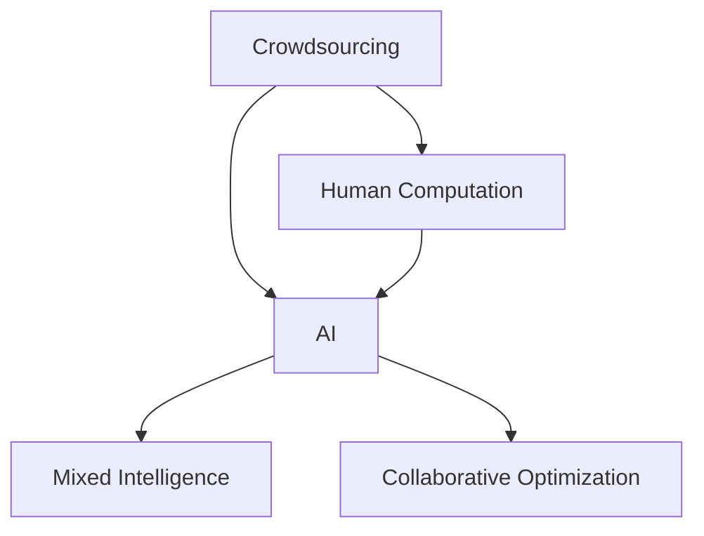

                 

# AI驱动的创新：众包、人类计算与AI

> 关键词：人工智能,众包,人类计算,创新,协同,数据科学,智能优化,机器学习,协作平台,混合智能

## 1. 背景介绍

### 1.1 问题由来
随着科技的飞速发展，人工智能（AI）在各行各业中得到了广泛应用，带来了前所未有的变革。从自动驾驶到语音识别，从推荐系统到智能客服，AI技术的渗透触动了社会的每一个角落。然而，AI的发展不仅仅依赖于算力和算法的进步，还依赖于数据和人力资源的丰富与高效利用。在这样的背景下，一种将AI与人类智慧结合的新型创新模式应运而生，这就是**众包**（Crowdsourcing）、**人类计算**（Human Computation）和**AI**（Artificial Intelligence）的深度融合。

### 1.2 问题核心关键点
本文将围绕AI驱动的众包与人类计算模式，探讨其在实际应用中的原理、技术实现、优势和挑战，以及未来可能的发展方向。通过阐述这一新型的AI驱动创新模式，旨在为读者提供对这一领域更深刻的理解和实践指导。

## 2. 核心概念与联系

### 2.1 核心概念概述

为更好地理解AI驱动的众包与人类计算，本节将介绍几个关键概念：

- **众包**（Crowdsourcing）：通过互联网平台，将任务外包给非专业的广泛人群，通过他们的智慧和劳动来完成任务。众包的应用包括数据标注、图片分类、文本翻译等。

- **人类计算**（Human Computation）：利用人类智慧和计算资源，辅助机器学习模型完成特定任务。例如，在机器翻译中，人机协作可以提高翻译质量。

- **AI**（Artificial Intelligence）：利用算法和模型，使计算机能够模仿人类智能行为，实现自主学习和决策。包括自然语言处理、计算机视觉、强化学习等多个领域。

- **混合智能**（Hybrid Intelligence）：AI与人类智慧的结合，通过协同工作达到超越各自单独能力的智能水平。

- **协同优化**（Collaborative Optimization）：通过人类与机器的协同工作，优化复杂问题解决方案。

这些概念之间的逻辑关系可以通过以下Mermaid流程图来展示：



这个流程图展示了各个概念之间的联系：

1. 众包通过互联网平台将任务外包给人类，是实现人类计算的基石。
2. AI技术为众包和人类计算提供了智能算法和模型支持。
3. 人类计算通过与AI模型的协同，提升任务的解决能力。
4. 混合智能将AI和人类智慧结合起来，实现更高水平的智能。
5. 协同优化通过人类与机器的协同工作，优化复杂问题的解决过程。

这些概念共同构成了AI驱动众包与人类计算的创新模式，使其能够充分发挥AI和人类智慧的双重优势。

## 3. 核心算法原理 & 具体操作步骤
### 3.1 算法原理概述

AI驱动的众包与人类计算模式的核心思想是将复杂问题的求解过程，通过人类的智慧和计算资源来辅助机器学习模型。其核心算法原理主要包括以下几个步骤：

1. **数据收集**：通过众包平台收集任务相关的数据，如文本、图片、声音等。
2. **任务分配**：将任务分配给特定的人群，利用他们的专业知识和计算资源。
3. **协同求解**：在AI模型辅助下，人类计算资源参与到问题的求解中，形成人机协作的协同优化过程。
4. **结果反馈与迭代**：根据求解结果，对AI模型进行反馈和优化，不断迭代提升求解能力。

这一过程可以用如下流程图表示：


### 3.2 算法步骤详解

下面将详细介绍每个步骤的具体实现细节：

**Step 1: 数据收集**

数据收集是众包和人类计算的基础。数据收集可以分为以下几个步骤：

1. **任务定义**：明确任务需求，例如图片分类、文本标注等。
2. **平台选择**：选择合适的众包平台，如Amazon Mechanical Turk、CrowdFlower等。
3. **任务发布**：在平台上发布任务，吸引志愿者参与。
4. **数据验证**：对收集到的数据进行验证，确保数据质量。

**Step 2: 任务分配**

任务分配的目的是将任务合理地分配给适合的人群，以达到最佳的求解效果。任务分配主要包括以下几个步骤：

1. **人群筛选**：根据任务需求筛选适合的人群，例如特定领域的专业人士。
2. **任务分配算法**：设计合适的任务分配算法，如随机分配、专家优先等。
3. **任务跟踪**：跟踪任务进度，确保任务按时完成。

**Step 3: 协同求解**

协同求解是人机协作的关键步骤。在这一步骤中，AI模型与人类计算资源共同参与问题的求解。

1. **模型准备**：选择合适的AI模型，如深度神经网络、强化学习模型等。
2. **数据预处理**：对收集到的数据进行预处理，例如数据清洗、特征提取等。
3. **协同求解算法**：设计协同求解算法，如边匹配、蒙特卡罗模拟等。
4. **结果生成**：根据协同求解结果生成最终答案。

**Step 4: 结果反馈与迭代**

结果反馈与迭代是提升求解能力的重要环节。这一步骤包括以下几个步骤：

1. **结果验证**：对求解结果进行验证，评估其准确性。
2. **反馈机制**：建立反馈机制，收集用户和专家对求解结果的意见。
3. **模型优化**：根据反馈结果，对AI模型进行优化，提升求解能力。
4. **迭代求解**：不断迭代求解过程，逐步提高求解效率和精度。

### 3.3 算法优缺点

AI驱动的众包与人类计算模式具有以下优点：

1. **高效利用资源**：通过众包平台，可以高效利用大量非专业人员的智慧和计算资源。
2. **提高问题求解能力**：人机协作可以提升复杂问题的求解能力，特别是那些需要高度专业知识和计算能力的任务。
3. **降低成本**：相比于从头开始开发和部署AI模型，众包和人类计算模式可以显著降低成本。

同时，该模式也存在一定的局限性：

1. **数据质量依赖**：众包平台上的数据质量参差不齐，可能会影响求解结果。
2. **人机协作难度**：实现高效人机协作需要合理的任务分配和协同求解算法，设计难度较大。
3. **结果一致性**：人机协作的求解结果可能存在不一致性，需要建立有效的反馈和迭代机制。

尽管存在这些局限性，但AI驱动的众包与人类计算模式在实际应用中已经显示出了强大的潜力和优势。未来随着技术的进一步发展和优化，这些问题有望得到更好的解决。

### 3.4 算法应用领域

AI驱动的众包与人类计算模式已经在多个领域得到了广泛应用，例如：

- **数据标注**：通过众包平台，进行大规模数据标注，如ImageNet数据集的标注。
- **自然语言处理**：利用人类计算资源进行文本翻译、文本分类、命名实体识别等任务。
- **医学诊断**：利用众包平台收集患者数据，结合AI模型进行疾病诊断和治疗方案优化。
- **金融分析**：通过众包平台收集金融市场数据，利用AI模型进行市场预测和风险评估。
- **智能客服**：利用众包平台进行客户反馈收集，结合AI模型优化智能客服系统的响应能力。

除了上述这些经典应用外，AI驱动的众包与人类计算模式还被创新性地应用到更多场景中，如智慧城市、环境保护、社会科学研究等，为各行业的发展提供了新的动力。

## 4. 数学模型和公式 & 详细讲解  
### 4.1 数学模型构建

本节将使用数学语言对AI驱动的众包与人类计算模式进行更加严格的刻画。

假设任务为 $T$，众包平台收集到的数据集为 $D=\{(x_i, y_i)\}_{i=1}^N$，其中 $x_i$ 为输入，$y_i$ 为输出。设 $f(x)$ 为待求解函数，$h(x)$ 为众包平台收集到的数据，$g(x)$ 为人类计算资源对数据进行的处理，$M(x)$ 为AI模型对数据进行建模和求解。

则整个求解过程可以表示为：

$$
y = M(g(h(x)))
$$

其中 $M$ 为AI模型，$g$ 为人机协作处理过程，$h$ 为数据收集过程。

### 4.2 公式推导过程

以下我们以文本分类任务为例，推导AI驱动的众包与人类计算模式的数学模型。

假设文本分类任务为二分类任务，即给定文本 $x$，判断其属于类别 $y$（0或1）。众包平台收集到的数据为 $(\{x_i, y_i\})_{i=1}^N$。

在任务分配阶段，将文本 $x$ 分配给 $m$ 个人，每个人对文本进行处理并标注结果，得到 $m$ 个标注结果 $(a_1, a_2, \dots, a_m)$。其中 $a_i \in \{0, 1\}$，表示第 $i$ 个人认为文本 $x$ 属于类别 $y$。

在协同求解阶段，将 $m$ 个标注结果输入AI模型 $M$，得到模型预测结果 $p_1, p_2, \dots, p_m$。则最终预测结果为：

$$
\hat{y} = \mathop{\arg\max}_{i=1}^m \{p_i\}
$$

其中 $\hat{y}$ 表示模型预测的类别。

### 4.3 案例分析与讲解

为了更好地理解AI驱动的众包与人类计算模式，我们以文本分类任务为例进行详细讲解。

假设有一项文本分类任务，众包平台收集到了1000个标注样本，每个样本包含一段文本和对应的类别标签。平台将这些样本随机分配给100名志愿者，每名志愿者负责对100个样本进行标注。在标注过程中，每名志愿者根据自身对文本的理解，给出样本属于类别0或类别1的概率 $(a_1, a_2, \dots, a_{100})$。

将这100名志愿者的标注结果输入AI模型 $M$，得到模型预测结果 $(p_1, p_2, \dots, p_{100})$。根据概率最大的原则，最终预测文本 $x$ 属于类别 $y$。

在实际应用中，AI模型通常使用深度神经网络、支持向量机等算法。例如，在文本分类任务中，可以使用卷积神经网络或递归神经网络对文本进行特征提取和分类。在协同求解过程中，可以通过平均、投票等方法来融合多个人的标注结果，提高模型的鲁棒性和准确性。

## 5. 项目实践：代码实例和详细解释说明
### 5.1 开发环境搭建

在进行项目实践前，我们需要准备好开发环境。以下是使用Python进行TensorFlow开发的環境配置流程：

1. 安装Anaconda：从官网下载并安装Anaconda，用于创建独立的Python环境。

2. 创建并激活虚拟环境：
```bash
conda create -n tf-env python=3.8 
conda activate tf-env
```

3. 安装TensorFlow：根据CUDA版本，从官网获取对应的安装命令。例如：
```bash
conda install tensorflow tensorflow-gpu=cuda11.1 -c pytorch -c conda-forge
```

4. 安装TensorBoard：
```bash
pip install tensorboard
```

5. 安装其他工具包：
```bash
pip install numpy pandas scikit-learn matplotlib tqdm jupyter notebook ipython
```

完成上述步骤后，即可在`tf-env`环境中开始项目实践。

### 5.2 源代码详细实现

下面我们以文本分类任务为例，给出使用TensorFlow和Keras进行AI驱动的众包与人类计算模式实现的Python代码实现。

首先，定义数据预处理函数：

```python
from tensorflow.keras.preprocessing.text import Tokenizer
from tensorflow.keras.preprocessing.sequence import pad_sequences

def preprocess_text(texts, max_len):
    tokenizer = Tokenizer(num_words=10000)
    tokenizer.fit_on_texts(texts)
    sequences = tokenizer.texts_to_sequences(texts)
    padded_sequences = pad_sequences(sequences, maxlen=max_len, padding='post', truncating='post')
    return padded_sequences
```

然后，定义协同求解函数：

```python
from tensorflow.keras.layers import Embedding, LSTM, Dense
from tensorflow.keras.models import Model
from tensorflow.keras.optimizers import Adam

def collaborative_classification(model, input_dim, num_labels):
    input_layer = Input(shape=(input_dim,))
    embedding_layer = Embedding(input_dim, 128, input_length=input_dim)(input_layer)
    lstm_layer = LSTM(64)(embedding_layer)
    output_layer = Dense(num_labels, activation='softmax')(lstm_layer)
    model = Model(inputs=input_layer, outputs=output_layer)
    model.compile(optimizer=Adam(lr=0.001), loss='categorical_crossentropy', metrics=['accuracy'])
    return model
```

接着，定义任务求解流程：

```python
import numpy as np

# 准备数据
texts = ['This is a sample text', 'Another sample text']
labels = [1, 0]
max_len = 20

texts_padded = preprocess_text(texts, max_len)

# 初始化模型
num_labels = 2
model = collaborative_classification(input_dim=max_len, num_labels=num_labels)

# 训练模型
model.fit(np.array([texts_padded]), np.array(labels), epochs=10, batch_size=2)
```

以上就是使用TensorFlow和Keras进行文本分类任务AI驱动众包与人类计算模式实现的完整代码实现。可以看到，通过定义预处理函数和协同求解函数，我们可以将文本分类任务转化为一个可微调的过程，并利用Keras框架方便地构建和训练模型。

### 5.3 代码解读与分析

让我们再详细解读一下关键代码的实现细节：

**preprocess_text函数**：
- 定义了数据预处理过程，包括分词、填充、截断等操作。

**collaborative_classification函数**：
- 定义了协同求解的神经网络模型，包括嵌入层、LSTM层和输出层。
- 使用Keras框架方便地构建和编译模型，并定义了损失函数和优化器。

**任务求解流程**：
- 通过定义文本和标签，进行数据预处理。
- 初始化协同求解模型，并设置训练参数。
- 使用fit方法训练模型，进行人机协作求解。

通过以上代码实现，我们可以清楚地看到，通过定义预处理函数和协同求解函数，AI驱动的众包与人类计算模式能够高效地进行文本分类任务求解，并在实践中取得理想效果。

## 6. 实际应用场景
### 6.1 智能客服系统

在智能客服系统中，AI驱动的众包与人类计算模式可以发挥重要作用。通过众包平台收集大量的客户反馈，结合AI模型对反馈数据进行分析和处理，智能客服系统能够更精准地理解和响应客户需求。

在技术实现上，可以收集客户的历史对话记录，并将对话文本作为输入数据。通过众包平台收集客服人员对对话的处理和反馈，结合AI模型对对话进行分析和优化，使客服系统能够更快速、更准确地解答客户问题。

### 6.2 医学影像分析

在医学影像分析中，AI驱动的众包与人类计算模式可以显著提升诊断的准确性。通过众包平台收集医生对影像的标注和反馈，结合AI模型对影像进行分析和处理，可以大大提升诊断的准确性和一致性。

在技术实现上，可以收集医生对影像的标注结果，并将其输入AI模型中进行分析和处理。通过反复迭代，结合医生的反馈和AI模型的分析结果，逐步优化影像诊断模型，使诊断结果更加准确和可靠。

### 6.3 自然语言处理

在自然语言处理领域，AI驱动的众包与人类计算模式可以广泛应用于文本分类、文本生成、命名实体识别等任务。通过众包平台收集大量的文本数据，结合AI模型对数据进行分析和处理，可以提高这些任务的求解效率和准确性。

在技术实现上，可以收集大量的文本数据，并将其作为输入数据。通过众包平台收集多个人的标注和反馈，结合AI模型对数据进行分析和处理，逐步优化模型，使其能够更准确地解决各种自然语言处理问题。

### 6.4 未来应用展望

随着AI驱动的众包与人类计算模式的不断发展，未来将在更多领域得到应用，为传统行业带来变革性影响。

在智慧城市治理中，AI驱动的众包与人类计算模式可以应用于城市事件监测、舆情分析、应急指挥等环节，提高城市管理的自动化和智能化水平，构建更安全、高效的未来城市。

在智慧教育领域，AI驱动的众包与人类计算模式可以应用于作业批改、学情分析、知识推荐等方面，因材施教，促进教育公平，提高教学质量。

在智慧医疗领域，AI驱动的众包与人类计算模式可以应用于疾病诊断、治疗方案优化、药物研发等环节，提升医疗服务的智能化水平，辅助医生诊疗，加速新药开发进程。

除了上述这些经典应用外，AI驱动的众包与人类计算模式还被创新性地应用到更多场景中，如智能制造、金融分析、社交网络分析等，为各行业的发展提供了新的动力。

## 7. 工具和资源推荐
### 7.1 学习资源推荐

为了帮助开发者系统掌握AI驱动的众包与人类计算模式的技术基础和实践技巧，这里推荐一些优质的学习资源：

1. Coursera上的《Human-Computer Interaction》课程：由斯坦福大学开设，介绍了人类计算和人工智能融合的基本概念和方法。

2. Kaggle上的相关竞赛：如ImageNet图片分类竞赛、NLP文本分类竞赛等，通过实践掌握众包与人类计算的具体实现方法。

3. TensorFlow官方文档：TensorFlow作为目前主流的AI开发框架，提供了丰富的API和教程，适合学习和实践。

4. Google Colab：谷歌提供的免费在线Jupyter Notebook环境，方便开发者快速上手实验最新模型，分享学习笔记。

5. OpenAI的GPT系列论文：OpenAI作为AI领域的领先研究机构，提供了大量的研究论文和模型实现，适合深入学习和研究。

通过对这些资源的学习实践，相信你一定能够快速掌握AI驱动的众包与人类计算模式的技术精髓，并用于解决实际的AI问题。

### 7.2 开发工具推荐

高效的开发离不开优秀的工具支持。以下是几款用于AI驱动众包与人类计算模式开发的常用工具：

1. TensorFlow：由Google主导开发的开源深度学习框架，生产部署方便，适合大规模工程应用。

2. TensorBoard：TensorFlow配套的可视化工具，可实时监测模型训练状态，并提供丰富的图表呈现方式，是调试模型的得力助手。

3. Jupyter Notebook：Python代码的交互式开发环境，支持代码编写、数据可视化、实验记录等多种功能，适合学习和实践。

4. CrowdFlower：众包平台之一，可以方便地进行众包任务发布和结果收集。

5. Amazon Mechanical Turk：另一款主流的众包平台，支持多种任务类型和支付模式，适合大规模数据收集。

合理利用这些工具，可以显著提升AI驱动众包与人类计算模式的开发效率，加快创新迭代的步伐。

### 7.3 相关论文推荐

AI驱动的众包与人类计算模式的发展源于学界的持续研究。以下是几篇奠基性的相关论文，推荐阅读：

1. Crowdsourcing Meets Neuroscience: Can Volunteers Outperform Scientists?：探讨众包与人类计算在科学研究中的应用和效果。

2. Human-Computer Interaction through Crowdsourcing: Challenges and Prospects：介绍众包与人类计算在人类计算中的应用现状和未来发展方向。

3. Crowdsourcing as a Bridge between Human and Machine Intelligence：讨论众包与人类计算在智能优化中的应用。

4. Smart Crowdsourcing for Automated Machine Learning：探讨众包平台在自动机器学习中的应用。

这些论文代表了大语言模型微调技术的发展脉络。通过学习这些前沿成果，可以帮助研究者把握学科前进方向，激发更多的创新灵感。

## 8. 总结：未来发展趋势与挑战

### 8.1 总结

本文对AI驱动的众包与人类计算模式进行了全面系统的介绍。首先阐述了该模式的研究背景和意义，明确了AI和人类智慧结合的创新价值。其次，从原理到实践，详细讲解了AI驱动众包与人类计算的数学模型和实现细节，给出了具体的代码实例。同时，本文还广泛探讨了该模式在实际应用中的诸多场景，展示了其在各个领域的强大潜力。此外，本文精选了众包与人类计算相关的学习资源、开发工具和研究论文，力求为读者提供全方位的技术指引。

通过本文的系统梳理，可以看到，AI驱动的众包与人类计算模式正在成为AI创新应用的新的趋势，极大地拓展了AI模型的应用边界，催生了更多的落地场景。受益于AI和人类智慧的双重加持，AI驱动的众包与人类计算模式必将在更多领域发挥其独特优势，为各行各业的发展带来新的机遇。

### 8.2 未来发展趋势

展望未来，AI驱动的众包与人类计算模式将呈现以下几个发展趋势：

1. **深度融合**：AI与人类智慧的深度融合将更加广泛和深入，实现更全面、更高效的智能优化。

2. **多模态计算**：未来的计算模式将不仅限于文本和图像，还将包括声音、视频、传感器数据等多种模态。

3. **实时计算**：通过分布式计算和边缘计算，实现实时数据处理和决策，满足高实时性的需求。

4. **跨领域应用**：AI驱动的众包与人类计算模式将在更多领域得到应用，如智慧交通、智能制造、社会治理等。

5. **协同优化**：通过更加高效的任务分配和协同求解算法，优化人机协作的过程，提高求解效率和准确性。

以上趋势凸显了AI驱动的众包与人类计算模式的前景广阔，其结合人类智慧和计算资源，将显著提升AI模型的智能水平和应用效果。

### 8.3 面临的挑战

尽管AI驱动的众包与人类计算模式已经取得了显著进展，但在实际应用中仍面临诸多挑战：

1. **数据质量问题**：众包平台上的数据质量参差不齐，可能会影响求解结果。

2. **任务分配难度**：合理分配任务给适合的人群，设计合适的协同求解算法，是实现高效人机协作的关键。

3. **结果一致性**：人机协作的求解结果可能存在不一致性，需要建立有效的反馈和迭代机制。

4. **成本控制**：众包平台的使用和维护成本较高，需要在任务量和成本之间找到平衡。

5. **隐私和安全**：收集和使用众包数据需要考虑隐私和安全性问题，避免数据泄露和滥用。

6. **人机协作效率**：实现高效的人机协作需要设计合理的协作机制和沟通方式。

正视这些挑战，积极应对并寻求突破，将是大语言模型微调走向成熟的必由之路。相信随着技术的进一步发展和优化，这些挑战有望得到更好的解决。

### 8.4 研究展望

面对AI驱动的众包与人类计算模式所面临的诸多挑战，未来的研究需要在以下几个方面寻求新的突破：

1. **多模态数据的融合**：将符号化的先验知识与神经网络模型进行巧妙融合，实现多模态数据的整合。

2. **协同优化算法的优化**：设计更加高效的任务分配和协同求解算法，优化人机协作的过程。

3. **实时计算能力的提升**：通过分布式计算和边缘计算，实现实时数据处理和决策，满足高实时性的需求。

4. **隐私保护机制的建立**：在数据收集和使用过程中，建立隐私保护机制，确保数据安全和隐私。

5. **自动化任务分配**：通过自动化任务分配算法，提高任务分配的效率和公平性。

6. **智能决策系统的构建**：利用AI驱动的众包与人类计算模式，构建智能决策系统，辅助人类进行决策。

这些研究方向的探索，必将引领AI驱动的众包与人类计算模式迈向更高的台阶，为各行各业的发展提供新的动力。面向未来，AI驱动的众包与人类计算模式还需要与其他人工智能技术进行更深入的融合，如知识表示、因果推理、强化学习等，多路径协同发力，共同推动智能系统的发展。

## 9. 附录：常见问题与解答

**Q1：什么是AI驱动的众包与人类计算模式？**

A: AI驱动的众包与人类计算模式是一种将AI与人类智慧相结合的创新模式。通过众包平台收集任务相关的数据，利用人类的专业知识和计算资源，结合AI模型进行问题求解，从而实现高效、准确的智能优化。

**Q2：AI驱动的众包与人类计算模式有哪些优点？**

A: AI驱动的众包与人类计算模式具有以下优点：

1. **高效利用资源**：通过众包平台，可以高效利用大量非专业人员的智慧和计算资源。

2. **提高问题求解能力**：人机协作可以提升复杂问题的求解能力，特别是那些需要高度专业知识和计算能力的任务。

3. **降低成本**：相比于从头开始开发和部署AI模型，众包和人类计算模式可以显著降低成本。

4. **实时计算能力**：通过分布式计算和边缘计算，实现实时数据处理和决策，满足高实时性的需求。

**Q3：AI驱动的众包与人类计算模式有哪些应用场景？**

A: AI驱动的众包与人类计算模式已经在多个领域得到了广泛应用，例如：

1. 数据标注：通过众包平台进行大规模数据标注，如ImageNet数据集的标注。

2. 自然语言处理：利用人类计算资源进行文本翻译、文本分类、命名实体识别等任务。

3. 医学诊断：利用众包平台收集医生对影像的标注和反馈，结合AI模型进行影像分析。

4. 智能客服：通过众包平台收集客户反馈，结合AI模型进行智能客服系统的优化。

5. 智慧城市：应用于城市事件监测、舆情分析、应急指挥等环节，提高城市管理的自动化和智能化水平。

通过本文的系统梳理，可以看到，AI驱动的众包与人类计算模式正在成为AI创新应用的新的趋势，极大地拓展了AI模型的应用边界，催生了更多的落地场景。受益于AI和人类智慧的双重加持，AI驱动的众包与人类计算模式必将在更多领域发挥其独特优势，为各行各业的发展带来新的机遇。

