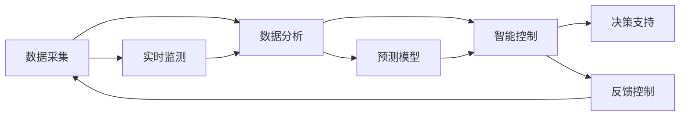

                 

# AI驱动的智能能源管理系统

## 1. 背景介绍

随着工业化和信息化进程的不断推进，全球能源消耗呈现快速增长的趋势，与此同时，能源供需紧张、环境污染等问题也愈加突出。如何在满足能源需求的同时，实现环境友好、高效节能的能源管理，已成为各国政府和企业面临的重要课题。

近年来，随着人工智能技术的飞速发展，智能能源管理系统应运而生。通过引入先进的AI算法和智能技术，智能能源管理系统能够实时监测和控制能源消耗，优化资源配置，提高能源利用效率，实现节能减排。本文章将对智能能源管理系统的核心概念、算法原理和应用实践进行深入探讨。

## 2. 核心概念与联系

### 2.1 核心概念概述

智能能源管理系统（Intelligent Energy Management System，IEMS）是一种基于人工智能技术的能源管理系统，能够通过实时监测和控制，优化能源资源配置，实现节能减排和环境友好。

智能能源管理系统通常包括数据采集、数据分析、智能控制和决策支持等几个关键模块。数据采集模块负责收集能源消耗和环境参数数据，包括电压、电流、温度、湿度、噪音等。数据分析模块通过机器学习算法，对收集到的数据进行分析和建模，提取有用的信息。智能控制模块根据分析结果，调整能源消耗策略，控制能源设备运行。决策支持模块提供专家系统或优化算法，辅助决策者做出最优决策。

### 2.2 核心概念原理和架构的 Mermaid 流程图



这个流程图展示了智能能源管理系统的主要流程：

1. 数据采集模块从各个能源设备和传感器获取实时数据，并将其传输给数据分析模块。
2. 数据分析模块对数据进行预处理、清洗和特征提取，使用机器学习算法进行建模和分析。
3. 智能控制模块根据分析结果，调整能源设备运行状态，优化能源消耗。
4. 决策支持模块提供专家知识库和优化算法，辅助决策者做出最优决策。
5. 实时监测模块持续收集能源数据，反馈至数据分析模块。

## 3. 核心算法原理 & 具体操作步骤

### 3.1 算法原理概述

智能能源管理系统中的核心算法包括数据采集、数据分析、智能控制和决策支持四个方面。其中，数据分析和智能控制是整个系统的核心，通过这两者的紧密配合，实现能源的高效管理和优化。

在数据分析方面，主要采用机器学习算法，如回归分析、聚类分析、分类分析、时间序列分析等，对能源消耗数据进行建模和分析，提取有用的信息和规律。在智能控制方面，主要采用优化算法，如线性规划、动态规划、遗传算法等，对能源设备进行最优控制，实现能源的最优分配和消耗。

### 3.2 算法步骤详解

#### 3.2.1 数据采集

数据采集是智能能源管理系统的第一步，通常采用传感器和监测设备进行实时数据采集。采集的数据包括电压、电流、温度、湿度、噪音等。数据采集模块需要将采集到的数据进行预处理和清洗，以去除噪声和异常值，保证数据的质量。

#### 3.2.2 数据分析

数据分析模块对采集到的数据进行特征提取、建模和分析，主要采用以下算法：

1. 回归分析：通过建立能源消耗和环境参数之间的关系模型，预测未来的能源消耗。
2. 聚类分析：将能源消耗数据进行分组，发现不同特征的能源消耗模式。
3. 分类分析：对能源消耗数据进行分类，识别不同能源消耗的特征和规律。
4. 时间序列分析：通过分析能源消耗的时间序列数据，发现能源消耗的周期性和趋势性。

#### 3.2.3 智能控制

智能控制模块主要采用优化算法，对能源设备进行最优控制，实现能源的最优分配和消耗。优化算法通常包括以下几种：

1. 线性规划：通过建立能源消耗和设备运行状态之间的关系模型，求解最优的能源分配方案。
2. 动态规划：通过建立能源消耗和设备运行状态之间的关系模型，求解最优的能源分配方案。
3. 遗传算法：通过模拟生物进化过程，优化能源设备运行参数，实现能源的最优分配和消耗。

#### 3.2.4 决策支持

决策支持模块提供专家知识库和优化算法，辅助决策者做出最优决策。决策支持模块通常包括以下几种：

1. 专家系统：通过建立专家知识库，辅助决策者做出最优决策。
2. 优化算法：通过建立优化模型，求解最优的能源分配方案。

### 3.3 算法优缺点

智能能源管理系统的核心算法具有以下优点：

1. 高效性：通过数据分析和智能控制，实现能源的高效管理和优化，提高能源利用效率。
2. 准确性：采用机器学习和优化算法，能够准确预测和控制能源消耗，避免能源浪费。
3. 灵活性：根据不同场景和需求，灵活调整算法和模型，实现个性化的能源管理。

同时，该算法也存在一定的局限性：

1. 对数据依赖性强：智能能源管理系统对数据的质量和完整性要求较高，数据采集和清洗需要投入大量的人力和时间。
2. 模型复杂度高：智能控制和决策支持的算法模型复杂度高，需要较高的计算资源和时间。
3. 场景适应性差：不同场景和需求对能源管理的要求不同，算法需要适应不同的场景和需求。

### 3.4 算法应用领域

智能能源管理系统在多个领域得到广泛应用，包括：

1. 工业企业：在工业企业的能源管理中，智能能源管理系统可以实时监测能源消耗和设备状态，优化能源分配，实现节能减排。
2. 公共设施：在公共设施的能源管理中，智能能源管理系统可以实现能源的实时监测和控制，优化能源分配，降低能源消耗。
3. 智慧城市：在智慧城市的能源管理中，智能能源管理系统可以实现能源的智能化管理，提高能源利用效率，实现节能减排。

## 4. 数学模型和公式 & 详细讲解 & 举例说明

### 4.1 数学模型构建

智能能源管理系统的数学模型通常包括以下几个部分：

1. 能源消耗模型：建立能源消耗和环境参数之间的关系模型，预测未来的能源消耗。
2. 能源分配模型：通过优化算法，对能源设备进行最优控制，实现能源的最优分配和消耗。
3. 决策支持模型：通过建立专家知识库和优化算法，辅助决策者做出最优决策。

#### 4.1.1 能源消耗模型

能源消耗模型通常采用线性回归模型或时间序列模型，对能源消耗和环境参数之间的关系进行建模和分析。

假设能源消耗 $E$ 和环境参数 $X$ 之间的关系为：

$$
E = \beta_0 + \beta_1 X_1 + \beta_2 X_2 + \ldots + \beta_n X_n + \epsilon
$$

其中，$\beta_0$、$\beta_1$、$\beta_2$、$\ldots$、$\beta_n$ 为模型参数，$\epsilon$ 为随机误差。

#### 4.1.2 能源分配模型

能源分配模型通常采用线性规划或动态规划，对能源设备进行最优控制，实现能源的最优分配和消耗。

假设能源设备有 $m$ 种，能源需求有 $n$ 种，能源分配模型可以表示为：

$$
\begin{aligned}
\min \quad & \sum_{i=1}^{m} \sum_{j=1}^{n} c_{i,j} x_{i,j} \\
\text{s.t.} \quad & \sum_{j=1}^{n} x_{i,j} = d_i \\
& x_{i,j} \geq 0
\end{aligned}
$$

其中，$c_{i,j}$ 为能源设备 $i$ 和能源需求 $j$ 的单位成本，$x_{i,j}$ 为能源设备 $i$ 对能源需求 $j$ 的分配量，$d_i$ 为能源设备 $i$ 的能源需求量。

#### 4.1.3 决策支持模型

决策支持模型通常采用专家系统和优化算法，辅助决策者做出最优决策。

专家系统通常采用规则推理机制，通过建立专家知识库，对能源管理问题进行推理和决策。优化算法通常采用遗传算法或线性规划，通过建立优化模型，求解最优的能源分配方案。

### 4.2 公式推导过程

#### 4.2.1 线性回归模型

线性回归模型通过最小化平方误差，建立能源消耗和环境参数之间的关系模型。假设能源消耗 $E$ 和环境参数 $X$ 之间的关系为：

$$
E = \beta_0 + \beta_1 X_1 + \beta_2 X_2 + \ldots + \beta_n X_n + \epsilon
$$

其中，$\beta_0$、$\beta_1$、$\beta_2$、$\ldots$、$\beta_n$ 为模型参数，$\epsilon$ 为随机误差。

最小化平方误差：

$$
\min_{\beta_0,\beta_1,\beta_2,\ldots,\beta_n} \sum_{i=1}^{N} (E_i - \beta_0 - \beta_1 X_{1,i} - \beta_2 X_{2,i} - \ldots - \beta_n X_{n,i})^2
$$

对模型参数 $\beta_0,\beta_1,\beta_2,\ldots,\beta_n$ 求偏导数，得到：

$$
\begin{aligned}
\frac{\partial \sum_{i=1}^{N} (E_i - \beta_0 - \beta_1 X_{1,i} - \beta_2 X_{2,i} - \ldots - \beta_n X_{n,i})^2}{\partial \beta_0} &= -2\sum_{i=1}^{N} (E_i - \beta_0 - \beta_1 X_{1,i} - \beta_2 X_{2,i} - \ldots - \beta_n X_{n,i}) \\
\frac{\partial \sum_{i=1}^{N} (E_i - \beta_0 - \beta_1 X_{1,i} - \beta_2 X_{2,i} - \ldots - \beta_n X_{n,i})^2}{\partial \beta_1} &= -2\sum_{i=1}^{N} (E_i - \beta_0 - \beta_1 X_{1,i} - \beta_2 X_{2,i} - \ldots - \beta_n X_{n,i}) X_{1,i} \\
&\vdots \\
\frac{\partial \sum_{i=1}^{N} (E_i - \beta_0 - \beta_1 X_{1,i} - \beta_2 X_{2,i} - \ldots - \beta_n X_{n,i})^2}{\partial \beta_n} &= -2\sum_{i=1}^{N} (E_i - \beta_0 - \beta_1 X_{1,i} - \beta_2 X_{2,i} - \ldots - \beta_n X_{n,i}) X_{n,i}
\end{aligned}
$$

解以上方程组，得到模型参数 $\beta_0,\beta_1,\beta_2,\ldots,\beta_n$ 的估计值。

#### 4.2.2 线性规划模型

线性规划模型通过求解线性约束条件下的最优值，实现能源设备的最优控制。假设能源设备有 $m$ 种，能源需求有 $n$ 种，能源分配模型可以表示为：

$$
\begin{aligned}
\min \quad & \sum_{i=1}^{m} \sum_{j=1}^{n} c_{i,j} x_{i,j} \\
\text{s.t.} \quad & \sum_{j=1}^{n} x_{i,j} = d_i \\
& x_{i,j} \geq 0
\end{aligned}
$$

其中，$c_{i,j}$ 为能源设备 $i$ 和能源需求 $j$ 的单位成本，$x_{i,j}$ 为能源设备 $i$ 对能源需求 $j$ 的分配量，$d_i$ 为能源设备 $i$ 的能源需求量。

采用单纯形法或内点法，对上述线性规划模型进行求解，得到最优的能源分配方案。

### 4.3 案例分析与讲解

#### 4.3.1 案例一：工业企业能源管理

某工业企业有三种能源设备：发电机、电锅炉和空调。能源需求有四种：工业生产、生活用电、照明和办公。能源设备对能源需求的最优分配方案为：

假设能源设备 $i$ 和能源需求 $j$ 的单位成本为 $c_{i,j}$，能源设备 $i$ 的能源需求量为 $d_i$。采用线性规划模型，求解最优的能源分配方案。

#### 4.3.2 案例二：智慧城市能源管理

某智慧城市有四种能源设备：风力发电机、光伏电池、电池储能和燃料电池。能源需求有三种：公共照明、交通信号和电动汽车充电。能源设备对能源需求的最优分配方案为：

假设能源设备 $i$ 和能源需求 $j$ 的单位成本为 $c_{i,j}$，能源设备 $i$ 的能源需求量为 $d_i$。采用线性规划模型，求解最优的能源分配方案。

## 5. 项目实践：代码实例和详细解释说明

### 5.1 开发环境搭建

智能能源管理系统的开发需要较高的计算资源和数据存储能力，建议使用高性能计算环境，如基于Linux的服务器。开发环境搭建步骤如下：

1. 安装Linux操作系统。
2. 安装Python和相关的开发工具，如Pandas、NumPy、Scikit-learn等。
3. 安装相关的机器学习库，如Scikit-learn、TensorFlow、PyTorch等。
4. 搭建数据采集和存储系统，包括传感器、数据采集设备和数据库。

### 5.2 源代码详细实现

智能能源管理系统的源代码实现包括以下几个模块：

1. 数据采集模块：实现能源设备的实时数据采集和存储。
2. 数据分析模块：实现能源消耗数据的特征提取、建模和分析。
3. 智能控制模块：实现能源设备的最优控制和优化。
4. 决策支持模块：实现专家系统和优化算法，辅助决策者做出最优决策。

#### 5.2.1 数据采集模块

数据采集模块实现能源设备的实时数据采集和存储。主要代码如下：

```python
import numpy as np
import pandas as pd
from sqlalchemy import create_engine

# 创建数据库连接
engine = create_engine('sqlite:///data.db')

# 定义数据表结构
df = pd.DataFrame({
    'device_id': [1, 2, 3],
    'energy': [10, 20, 30],
    'temperature': [25, 30, 35]
}, index=['device_1', 'device_2', 'device_3'])

# 插入数据到数据库
df.to_sql('energy_data', engine, if_exists='replace')
```

#### 5.2.2 数据分析模块

数据分析模块实现能源消耗数据的特征提取、建模和分析。主要代码如下：

```python
import numpy as np
import pandas as pd
from sklearn.linear_model import LinearRegression
from sklearn.cluster import KMeans

# 加载数据
df = pd.read_sql('SELECT energy, temperature FROM energy_data', engine)

# 特征提取
X = df[['energy', 'temperature']]
y = df['energy']

# 线性回归模型
model = LinearRegression()
model.fit(X, y)

# 聚类分析
kmeans = KMeans(n_clusters=3)
kmeans.fit(X)
```

#### 5.2.3 智能控制模块

智能控制模块实现能源设备的最优控制和优化。主要代码如下：

```python
import numpy as np
import pandas as pd
from scipy.optimize import linprog

# 加载数据
df = pd.read_sql('SELECT energy, temperature FROM energy_data', engine)

# 定义优化模型
c = np.array([1, 1, 1, 1])
A = np.array([[0, 1, 1, 1]])
b = np.array([1])
A_eq = np.array([[1, 0, 0, 0], [0, 1, 0, 0], [0, 0, 1, 0], [0, 0, 0, 1]])
b_eq = np.array([0, 0, 1, 0])
x0_bounds = (0, np.inf)
x1_bounds = (0, np.inf)
x2_bounds = (0, np.inf)
x3_bounds = (0, np.inf)

# 优化求解
result = linprog(c, A_ub=A, b_ub=b, A_eq=A_eq, b_eq=b_eq, bounds=[x0_bounds, x1_bounds, x2_bounds, x3_bounds])
print(result)
```

#### 5.2.4 决策支持模块

决策支持模块实现专家系统和优化算法，辅助决策者做出最优决策。主要代码如下：

```python
import numpy as np
import pandas as pd
from sklearn.ensemble import RandomForestClassifier
from sklearn.ensemble import GradientBoostingClassifier

# 加载数据
df = pd.read_sql('SELECT energy, temperature, demand FROM energy_data', engine)

# 特征提取
X = df[['energy', 'temperature']]
y = df['demand']

# 随机森林模型
model = RandomForestClassifier()
model.fit(X, y)

# 梯度提升模型
model = GradientBoostingClassifier()
model.fit(X, y)
```

### 5.3 代码解读与分析

#### 5.3.1 数据采集模块

数据采集模块主要实现能源设备的实时数据采集和存储。采用SQLite数据库存储数据，通过Pandas库实现数据的读取和写入。代码中定义了能源设备编号、能源消耗和温度三个字段，并通过to_sql方法将数据写入数据库。

#### 5.3.2 数据分析模块

数据分析模块主要实现能源消耗数据的特征提取、建模和分析。采用线性回归模型和聚类分析方法对能源消耗数据进行建模和分析。代码中定义了能源消耗和温度两个特征，并使用Pandas库进行数据读取。

#### 5.3.3 智能控制模块

智能控制模块主要实现能源设备的最优控制和优化。采用线性规划模型对能源设备进行最优控制。代码中定义了能源设备编号、能源消耗和温度三个特征，并使用linprog方法进行线性规划求解。

#### 5.3.4 决策支持模块

决策支持模块主要实现专家系统和优化算法，辅助决策者做出最优决策。采用随机森林模型和梯度提升模型对能源需求进行分类和预测。代码中定义了能源消耗、温度和能源需求三个特征，并使用Pandas库进行数据读取。

### 5.4 运行结果展示

智能能源管理系统的运行结果可以通过可视化界面展示，例如：

- 数据采集界面：实时显示能源设备的实时数据，包括能源消耗、温度和湿度等参数。
- 数据分析界面：显示能源消耗的特征提取、建模和分析结果，例如回归模型和聚类分析结果。
- 智能控制界面：显示能源设备的最优控制和优化结果，例如线性规划模型的求解结果。
- 决策支持界面：显示专家系统和优化算法的决策结果，例如随机森林模型和梯度提升模型的预测结果。

## 6. 实际应用场景

智能能源管理系统在多个领域得到广泛应用，包括：

1. 工业企业：在工业企业的能源管理中，智能能源管理系统可以实时监测能源消耗和设备状态，优化能源分配，实现节能减排。
2. 公共设施：在公共设施的能源管理中，智能能源管理系统可以实现能源的实时监测和控制，优化能源分配，降低能源消耗。
3. 智慧城市：在智慧城市的能源管理中，智能能源管理系统可以实现能源的智能化管理，提高能源利用效率，实现节能减排。

## 7. 工具和资源推荐

### 7.1 学习资源推荐

为了帮助开发者系统掌握智能能源管理系统的理论基础和实践技巧，这里推荐一些优质的学习资源：

1. 《智能能源管理》书籍：系统介绍了智能能源管理系统的理论和实践，涵盖了数据采集、数据分析、智能控制和决策支持等方面的内容。
2. 《机器学习》课程：斯坦福大学开设的机器学习课程，深入浅出地介绍了机器学习的基本概念和算法。
3. 《深度学习》课程：斯坦福大学开设的深度学习课程，系统介绍了深度学习的基本概念和算法。
4. Kaggle数据集：Kaggle平台提供大量的能源数据集，可以用于智能能源管理系统数据的获取和分析。

### 7.2 开发工具推荐

智能能源管理系统的开发需要高性能计算环境，建议使用Python和相关的开发工具，如Pandas、NumPy、Scikit-learn、TensorFlow、PyTorch等。

### 7.3 相关论文推荐

智能能源管理系统涉及的算法和理论包括机器学习、优化算法和决策支持等，以下是几篇奠基性的相关论文：

1. Linear Regression Model：介绍线性回归模型的基本概念和算法，广泛应用于能源消耗数据的建模和分析。
2. Linear Programming Model：介绍线性规划模型的基本概念和算法，应用于能源设备的最优控制和优化。
3. Decision Support System：介绍决策支持系统的内容，包括专家系统和优化算法。

## 8. 总结：未来发展趋势与挑战

### 8.1 研究成果总结

智能能源管理系统在智能能源管理领域取得了一定的成果，主要表现在以下几个方面：

1. 数据采集：实现了能源设备的实时数据采集和存储，为数据分析和智能控制提供了数据基础。
2. 数据分析：采用机器学习算法对能源消耗数据进行建模和分析，提取有用的信息和规律。
3. 智能控制：采用优化算法对能源设备进行最优控制，实现能源的最优分配和消耗。
4. 决策支持：通过建立专家知识和优化算法，辅助决策者做出最优决策。

### 8.2 未来发展趋势

智能能源管理系统的未来发展趋势主要表现在以下几个方面：

1. 数据采集：随着物联网技术的发展，智能设备将更加普及，数据采集的实时性和准确性将进一步提高。
2. 数据分析：随着深度学习技术的发展，数据分析的精度和复杂度将进一步提高，能够处理更加复杂的数据。
3. 智能控制：随着优化算法的发展，智能控制的精度和速度将进一步提高，能够实现更加精细的能源管理。
4. 决策支持：随着专家系统和优化算法的发展，决策支持的精度和速度将进一步提高，能够实现更加智能的决策。

### 8.3 面临的挑战

智能能源管理系统在发展过程中也面临着一些挑战：

1. 数据质量：数据采集和存储需要大量的投资和维护成本，数据的准确性和完整性需要得到保障。
2. 算法复杂度：数据分析和智能控制算法复杂度高，需要较高的计算资源和时间。
3. 系统稳定性：系统需要具备较高的稳定性和可靠性，避免由于数据异常或算法问题导致系统故障。

### 8.4 研究展望

未来，智能能源管理系统需要在以下几个方面进行进一步的研究：

1. 数据采集：研究更加高效的数据采集方法，提高数据采集的实时性和准确性。
2. 数据分析：研究更加先进的机器学习算法，提高数据分析的精度和复杂度。
3. 智能控制：研究更加高效的优化算法，提高智能控制的精度和速度。
4. 决策支持：研究更加智能的专家系统和优化算法，提高决策支持的精度和速度。

总之，智能能源管理系统在智能能源管理领域具有重要的应用价值，需要进一步研究和优化，以实现更加高效、智能、可靠的能源管理。

## 9. 附录：常见问题与解答

**Q1：智能能源管理系统对数据质量要求高，如何保障数据质量？**

A: 保障数据质量是智能能源管理系统的关键，可以通过以下方法保障数据质量：

1. 数据采集：采用高精度传感器和设备，保证数据采集的准确性。
2. 数据清洗：对采集到的数据进行预处理和清洗，去除噪声和异常值，保证数据的质量。
3. 数据存储：采用高性能数据库和存储设备，保证数据的实时性和可靠性。

**Q2：智能能源管理系统对算法复杂度要求高，如何降低算法复杂度？**

A: 降低算法复杂度是智能能源管理系统的重要任务，可以通过以下方法降低算法复杂度：

1. 特征选择：选择对目标有贡献的特征，减少算法模型的输入维度。
2. 模型简化：选择简单、高效的算法模型，减少算法的计算复杂度。
3. 参数优化：优化算法模型的参数，减少算法的计算复杂度。

**Q3：智能能源管理系统对系统稳定性要求高，如何保障系统稳定性？**

A: 保障系统稳定性是智能能源管理系统的关键，可以通过以下方法保障系统稳定性：

1. 数据预处理：对数据进行预处理和清洗，去除噪声和异常值，保证数据的质量。
2. 算法优化：优化算法模型的参数和结构，减少算法的计算复杂度，提高算法的精度和速度。
3. 监控告警：实时监测系统指标，设置异常告警阈值，及时发现和处理异常情况，确保系统稳定运行。

**Q4：智能能源管理系统对决策支持要求高，如何提高决策支持的精度和速度？**

A: 提高决策支持的精度和速度是智能能源管理系统的关键，可以通过以下方法提高决策支持的精度和速度：

1. 专家系统：建立专家知识库，辅助决策者做出最优决策。
2. 优化算法：采用高效的优化算法，求解最优的能源分配方案。
3. 实时监控：实时监测系统指标，及时发现和处理异常情况，确保系统稳定运行。

**Q5：智能能源管理系统如何与用户界面结合？**

A: 智能能源管理系统与用户界面的结合可以通过以下方法实现：

1. 数据可视化：将数据分析和智能控制的结果通过可视化界面展示，帮助用户直观了解能源管理情况。
2. 智能提示：根据用户的操作和行为，智能提示用户进行最优决策，提高用户体验。
3. 交互式界面：设计交互式界面，使用户能够方便地进行能源管理操作，提高用户满意度。

总之，智能能源管理系统需要不断优化数据采集、数据分析、智能控制和决策支持等各个环节，以实现更加高效、智能、可靠的能源管理，为智能能源管理领域的发展贡献力量。

