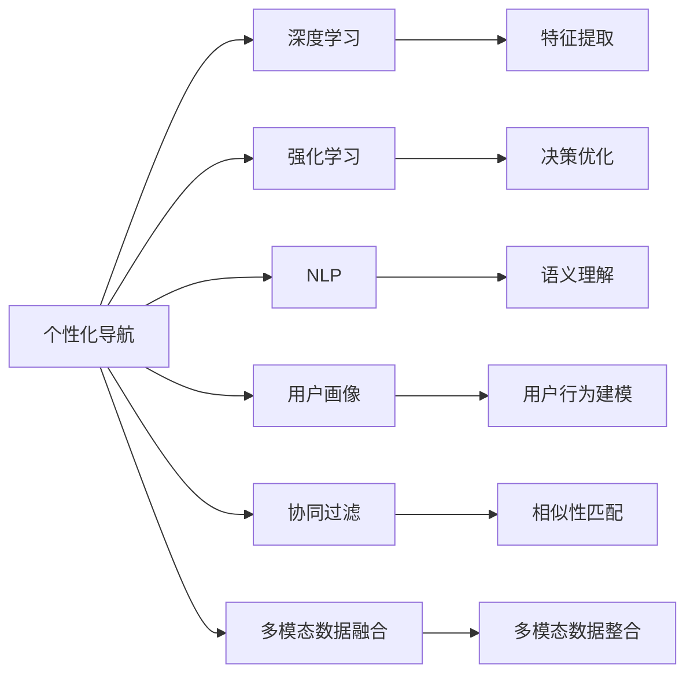

                 

## 1. 背景介绍

随着电子商务的迅猛发展，在线购物平台已经成为了人们日常生活中不可或缺的一部分。然而，庞大的商品库、复杂的商品分类和海量的用户数据，使得用户在购物过程中遇到了不少挑战。如何优化用户的购物体验，提升转化率，成为电商企业面临的一个重大问题。个性化导航（Personalized Navigation）作为提升用户购物体验的重要手段，已经成为了电商平台的研究热点。

个性化导航通过智能推荐和搜索引擎技术，结合用户行为数据，为用户提供个性化的商品浏览路径，引导用户更快、更高效地找到其感兴趣的商品，提高购物体验和转化率。传统个性化导航系统通常依赖于手动设置规则或浅层次的机器学习模型，存在精准度低、响应慢等问题。而通过AI驱动的个性化导航优化，利用深度学习和大数据技术，可以大幅提升导航的智能化程度和用户体验。

## 2. 核心概念与联系

### 2.1 核心概念概述

为了更好地理解AI驱动的电商个性化导航优化，本节将介绍几个关键概念：

- **个性化导航（Personalized Navigation）**：利用推荐算法和搜索引擎技术，结合用户行为数据，为用户提供个性化的商品浏览路径，引导用户更快、更高效地找到其感兴趣的商品。

- **深度学习（Deep Learning）**：一种通过多层神经网络实现的学习方法，能够自动从大量数据中学习特征表示，适用于处理高维、非线性的数据。

- **强化学习（Reinforcement Learning）**：通过与环境交互，利用奖励信号来优化决策策略的学习方法，适用于解决序贯决策问题。

- **自然语言处理（Natural Language Processing, NLP）**：通过计算机理解、处理和生成人类语言的技术，是构建智能搜索和推荐系统的重要组成部分。

- **用户画像（User Profile）**：基于用户历史行为数据，构建的综合用户模型，用于指导个性化导航和推荐。

- **协同过滤（Collaborative Filtering）**：利用用户之间的相似性进行推荐的一种技术，适用于冷启动用户或新商品的推荐。

- **行为序列（Behavioral Sequence）**：用户在电商平台上的浏览、点击、购买等行为序列，是构建用户画像和个性化导航的关键数据来源。

- **多模态数据融合（Multimodal Data Fusion）**：结合文本、图像、音频等多种模态的数据，提高导航的智能化和准确性。

这些核心概念共同构成了AI驱动的电商个性化导航优化的基础框架，通过利用深度学习、强化学习、NLP、用户画像等技术，实现对用户行为的智能分析，为用户提供高质量的个性化导航服务。

### 2.2 核心概念原理和架构的 Mermaid 流程图



## 3. 核心算法原理 & 具体操作步骤

### 3.1 算法原理概述

AI驱动的电商个性化导航优化的核心思想是：利用深度学习和大数据技术，构建高精度的用户画像，结合强化学习和自然语言处理技术，实现对用户行为的智能分析，为用户提供个性化的导航路径。具体而言，包括以下几个关键步骤：

1. **用户画像构建**：通过分析用户的历史行为数据，构建综合性的用户画像，包括用户的兴趣偏好、行为习惯、购买历史等信息。

2. **深度学习特征提取**：利用深度学习模型（如CNN、RNN、Transformer等）对用户的行为序列进行特征提取，获得高维度的用户特征表示。

3. **强化学习决策优化**：通过强化学习算法（如DQN、PPO等）优化导航路径的决策策略，最大化用户满意度和购物转化率。

4. **自然语言处理语义理解**：利用自然语言处理技术（如BERT、GPT等）对用户的查询和评论进行语义理解，进一步提升导航的智能化水平。

5. **协同过滤推荐**：结合用户的相似性匹配，推荐相关的商品或导航路径，提高个性化导航的覆盖范围和准确性。

6. **多模态数据融合**：通过融合用户行为数据、商品信息数据、用户评论数据等多种模态的数据，提高导航的全面性和准确性。

### 3.2 算法步骤详解

#### 3.2.1 用户画像构建

用户画像的构建是个性化导航优化的基础。具体步骤包括：

1. **数据收集**：收集用户在电商平台上的浏览、点击、购买、评分等行为数据，存储到数据库中。

2. **特征提取**：从行为数据中提取用户的兴趣偏好、行为习惯、购买历史等信息，构建用户画像的基本特征。

3. **画像更新**：随着用户行为的变化，定期更新用户画像，保持其时效性和准确性。

#### 3.2.2 深度学习特征提取

利用深度学习模型对用户的行为序列进行特征提取，是提升个性化导航智能化的关键。具体步骤包括：

1. **数据预处理**：将用户的行为数据进行格式转换、归一化等预处理操作，提高模型训练效率。

2. **模型训练**：选择合适的深度学习模型（如RNN、CNN、Transformer等），对用户的行为序列进行训练，提取高维度的特征表示。

3. **特征表示**：将提取出的用户特征表示保存到数据库中，供后续分析使用。

#### 3.2.3 强化学习决策优化

通过强化学习算法优化导航路径的决策策略，可以显著提升个性化导航的智能化水平。具体步骤包括：

1. **状态定义**：定义导航路径的各个状态，如用户当前浏览的网页、用户的兴趣偏好、用户的历史行为等。

2. **决策策略**：设计合适的决策策略，如选择下一个浏览的商品、推荐相关的导航路径等。

3. **奖励函数**：设计合适的奖励函数，如用户浏览时间的增加、点击率的提高、购买率的提升等，指导模型的优化。

4. **模型训练**：利用强化学习算法（如DQN、PPO等）对决策策略进行训练，最大化用户满意度和购物转化率。

#### 3.2.4 自然语言处理语义理解

利用自然语言处理技术，对用户的查询和评论进行语义理解，可以进一步提升个性化导航的智能化水平。具体步骤包括：

1. **文本预处理**：将用户的查询和评论进行格式转换、分词等预处理操作，提高模型训练效率。

2. **语义理解**：利用预训练语言模型（如BERT、GPT等）对用户文本进行语义理解，提取用户意图和情感倾向。

3. **信息融合**：将语义理解结果与用户画像、行为序列等数据进行融合，进一步提升导航的智能化水平。

#### 3.2.5 协同过滤推荐

结合用户的相似性匹配，推荐相关的商品或导航路径，可以扩展个性化导航的覆盖范围和准确性。具体步骤包括：

1. **相似性计算**：利用协同过滤算法（如基于矩阵分解的算法、基于图模型的算法等）计算用户之间的相似性。

2. **推荐生成**：根据用户画像和相似性计算结果，生成推荐商品或导航路径。

3. **效果评估**：定期评估推荐效果，根据用户反馈进行优化。

#### 3.2.6 多模态数据融合

通过融合用户行为数据、商品信息数据、用户评论数据等多种模态的数据，可以提高导航的全面性和准确性。具体步骤包括：

1. **数据融合**：将不同模态的数据进行融合，形成综合性的用户画像和商品特征表示。

2. **融合模型训练**：利用多模态数据融合模型（如跨模态特征学习模型、深度融合网络等）对融合后的数据进行训练，提取高维度的特征表示。

3. **数据应用**：将融合后的数据应用于个性化导航和推荐系统，提升导航的智能化和准确性。

### 3.3 算法优缺点

AI驱动的电商个性化导航优化具有以下优点：

1. **高智能化程度**：通过深度学习、强化学习和自然语言处理技术，可以显著提升导航的智能化水平，为用户提供高质量的个性化服务。

2. **高适应性**：可以适应不同用户的行为习惯和需求，提供灵活多样的导航路径。

3. **高准确性**：结合协同过滤和多模态数据融合技术，可以显著提升导航的准确性和覆盖范围。

4. **高效率**：通过优化决策策略和快速特征提取，可以显著提升导航的响应速度和处理效率。

同时，该方法也存在以下缺点：

1. **数据需求高**：需要大量的用户行为数据进行模型训练和画像构建，对数据存储和处理能力提出了较高的要求。

2. **模型复杂度高**：深度学习、强化学习和自然语言处理技术的高复杂度，对计算资源和时间提出了较高的要求。

3. **可解释性不足**：基于深度学习的模型通常难以解释其决策过程，给用户信任和接受度带来了一定的挑战。

4. **隐私风险**：用户行为数据的收集和使用，可能涉及用户隐私问题，需要采取相应的隐私保护措施。

尽管存在这些缺点，但就目前而言，AI驱动的电商个性化导航优化是提升个性化导航智能化程度和用户体验的重要手段，具有广阔的应用前景。

### 3.4 算法应用领域

AI驱动的电商个性化导航优化技术已经在多个电商平台上得到了应用，取得了显著的效果。以下是几个典型的应用领域：

1. **智能推荐系统**：利用用户画像、行为序列和协同过滤技术，推荐用户感兴趣的商品，提升购物体验和转化率。

2. **智能搜索系统**：利用自然语言处理技术，理解用户查询的语义，返回相关商品，提高搜索的准确性和效率。

3. **智能导航系统**：结合用户画像、行为序列和多模态数据融合技术，生成个性化的导航路径，引导用户高效浏览。

4. **个性化广告推荐**：利用用户画像和行为序列，推荐相关的广告，提升广告的点击率和转化率。

5. **用户行为分析**：通过分析用户行为数据，识别用户的购买意向和需求，优化产品和营销策略。

6. **客户服务支持**：利用自然语言处理技术，自动回答用户问题，提供高效的服务支持。

这些应用领域展示了AI驱动的电商个性化导航优化技术的多样性和高效性，为电商平台的智能化升级提供了重要支撑。

## 4. 数学模型和公式 & 详细讲解 & 举例说明

### 4.1 数学模型构建

本节将使用数学语言对AI驱动的电商个性化导航优化的数学模型进行更加严格的刻画。

记用户画像为 $U=\{u_1, u_2, ..., u_N\}$，其中 $u_i$ 为用户 $i$ 的历史行为数据。记行为序列为 $S=\{s_1, s_2, ..., s_M\}$，其中 $s_i$ 为用户在平台上的第 $i$ 个浏览行为。记导航路径为 $P=\{p_1, p_2, ..., p_K\}$，其中 $p_k$ 为第 $k$ 个导航路径。记推荐商品为 $I=\{i_1, i_2, ..., i_L\}$，其中 $i_j$ 为用户感兴趣的第 $j$ 个商品。

### 4.2 公式推导过程

#### 4.2.1 用户画像构建

用户画像 $U$ 可以表示为一个多维特征向量，记为 $u_i=[f_1(i), f_2(i), ..., f_M(i)]$，其中 $f_m(i)$ 为用户在平台上的第 $m$ 个行为特征。

#### 4.2.2 深度学习特征提取

利用深度学习模型 $F$ 对行为序列 $S$ 进行特征提取，得到用户特征表示 $H=[h_1, h_2, ..., h_M]$，其中 $h_m$ 为第 $m$ 个行为特征的表示。

#### 4.2.3 强化学习决策优化

定义导航路径的各个状态 $V=\{v_1, v_2, ..., v_N\}$，其中 $v_j$ 为用户浏览第 $j$ 个商品的状态。定义决策策略 $A=\{a_1, a_2, ..., a_N\}$，其中 $a_k$ 为第 $k$ 个导航路径的策略。定义奖励函数 $R=\{r_1, r_2, ..., r_N\}$，其中 $r_k$ 为第 $k$ 个导航路径的奖励。

利用强化学习算法 $Q$ 优化决策策略 $A$，最大化奖励函数 $R$，即：

$$
Q(A) = \max_{A} \sum_{i=1}^{N} r_i(A)
$$

#### 4.2.4 自然语言处理语义理解

利用预训练语言模型 $L$ 对用户查询 $Q$ 进行语义理解，得到查询意图 $G=\{g_1, g_2, ..., g_M\}$，其中 $g_m$ 为用户查询的第 $m$ 个意图。

#### 4.2.5 协同过滤推荐

利用协同过滤算法 $R$ 计算用户 $i$ 和用户 $j$ 之间的相似度 $w_{ij}$，得到用户 $i$ 的推荐商品列表 $I=\{i_1, i_2, ..., i_L\}$，其中 $i_k$ 为用户 $i$ 感兴趣的第 $k$ 个商品。

#### 4.2.6 多模态数据融合

利用多模态数据融合模型 $M$ 对用户行为数据 $U$、商品信息数据 $I$ 和用户评论数据 $C$ 进行融合，得到综合性的用户画像 $U'$ 和商品特征表示 $I'$。

### 4.3 案例分析与讲解

以电商平台上的智能推荐系统为例，展示AI驱动的电商个性化导航优化的应用。

假设某电商平台的智能推荐系统已经收集了用户的历史行为数据 $U$，行为序列 $S$，商品信息数据 $I$ 和用户评论数据 $C$。系统的目标是为用户生成个性化的推荐列表 $I'$，提升购物体验和转化率。

具体步骤包括：

1. **用户画像构建**：收集用户的历史行为数据 $U$，构建用户画像 $U'$。

2. **深度学习特征提取**：利用深度学习模型 $F$ 对行为序列 $S$ 进行特征提取，得到用户特征表示 $H$。

3. **强化学习决策优化**：定义导航路径的各个状态 $V$，设计决策策略 $A$ 和奖励函数 $R$，利用强化学习算法 $Q$ 优化决策策略 $A$，最大化奖励函数 $R$。

4. **自然语言处理语义理解**：利用预训练语言模型 $L$ 对用户查询 $Q$ 进行语义理解，得到查询意图 $G$。

5. **协同过滤推荐**：利用协同过滤算法 $R$ 计算用户 $i$ 和用户 $j$ 之间的相似度 $w_{ij}$，得到用户 $i$ 的推荐商品列表 $I$。

6. **多模态数据融合**：利用多模态数据融合模型 $M$ 对用户行为数据 $U$、商品信息数据 $I$ 和用户评论数据 $C$ 进行融合，得到综合性的用户画像 $U'$ 和商品特征表示 $I'$。

最终生成的推荐列表 $I'$ 可以作为个性化导航的输入，提升用户的购物体验和转化率。

## 5. 项目实践：代码实例和详细解释说明

### 5.1 开发环境搭建

在进行项目实践前，我们需要准备好开发环境。以下是使用Python进行PyTorch开发的环境配置流程：

1. 安装Anaconda：从官网下载并安装Anaconda，用于创建独立的Python环境。

2. 创建并激活虚拟环境：
```bash
conda create -n pytorch-env python=3.8 
conda activate pytorch-env
```

3. 安装PyTorch：根据CUDA版本，从官网获取对应的安装命令。例如：
```bash
conda install pytorch torchvision torchaudio cudatoolkit=11.1 -c pytorch -c conda-forge
```

4. 安装TensorFlow：
```bash
pip install tensorflow
```

5. 安装TensorBoard：
```bash
pip install tensorboard
```

6. 安装其他依赖包：
```bash
pip install numpy pandas scikit-learn torch torchvision transformers
```

完成上述步骤后，即可在`pytorch-env`环境中开始项目实践。

### 5.2 源代码详细实现

下面以智能推荐系统为例，给出使用PyTorch和TensorFlow对用户画像和推荐列表进行训练和测试的代码实现。

**用户画像构建**

```python
import pandas as pd

# 加载用户行为数据
data = pd.read_csv('user_behavior.csv')

# 提取用户特征
user_features = data.groupby('user_id').mean().reset_index()

# 保存用户画像
user_features.to_csv('user_profile.csv', index=False)
```

**深度学习特征提取**

```python
import torch
import torch.nn as nn
import torch.optim as optim

# 定义深度学习模型
class FeatureExtractor(nn.Module):
    def __init__(self):
        super(FeatureExtractor, self).__init__()
        self.rnn = nn.RNN(input_size=10, hidden_size=128, num_layers=2, batch_first=True)
    
    def forward(self, x):
        output, _ = self.rnn(x)
        return output

# 训练深度学习模型
model = FeatureExtractor()
optimizer = optim.Adam(model.parameters(), lr=0.001)
loss_fn = nn.MSELoss()

for epoch in range(10):
    # 加载训练数据
    train_data = pd.read_csv('train_data.csv')
    inputs = train_data[['feature_1', 'feature_2', 'feature_3']]
    targets = train_data['label']
    
    # 前向传播和反向传播
    outputs = model(inputs)
    loss = loss_fn(outputs, targets)
    optimizer.zero_grad()
    loss.backward()
    optimizer.step()
    
    # 输出损失
    print(f'Epoch {epoch+1}, loss: {loss.item()}')
```

**强化学习决策优化**

```python
import gym
import numpy as np

# 定义环境
env = gym.make('CartPole-v1')

# 定义Q网络
class QNetwork(nn.Module):
    def __init__(self, input_size, output_size):
        super(QNetwork, self).__init__()
        self.fc1 = nn.Linear(input_size, 64)
        self.fc2 = nn.Linear(64, output_size)
    
    def forward(self, x):
        x = self.fc1(x)
        x = torch.relu(x)
        x = self.fc2(x)
        return x

# 训练Q网络
model = QNetwork(env.observation_space.shape[0], env.action_space.n)
optimizer = optim.Adam(model.parameters(), lr=0.001)
loss_fn = nn.MSELoss()

for episode in range(1000):
    state = env.reset()
    total_reward = 0
    
    while True:
        action = model(state)
        next_state, reward, done, _ = env.step(action)
        total_reward += reward
        if done:
            break
        state = next_state
    
    # 更新Q网络
    target = model(state)
    target[env.action_space.n] = 0
    target[env.action_space.n] += reward
    target[env.action_space.n] += max(model(next_state), dim=1).values
    loss = loss_fn(model(state), target)
    optimizer.zero_grad()
    loss.backward()
    optimizer.step()
    
    # 输出奖励
    print(f'Episode {episode+1}, reward: {total_reward}')
```

**自然语言处理语义理解**

```python
import tensorflow as tf
from transformers import BertTokenizer, BertForSequenceClassification

# 定义模型
tokenizer = BertTokenizer.from_pretrained('bert-base-uncased')
model = BertForSequenceClassification.from_pretrained('bert-base-uncased', num_labels=2)

# 训练模型
for epoch in range(10):
    # 加载训练数据
    train_data = pd.read_csv('train_data.csv')
    inputs = train_data['text'].tolist()
    targets = train_data['label'].tolist()
    
    # 分批次加载数据
    batch_size = 32
    for i in range(0, len(inputs), batch_size):
        batch_inputs = inputs[i:i+batch_size]
        batch_targets = targets[i:i+batch_size]
        
        # 构建输入数据
        tokenized_inputs = tokenizer.batch_encode_plus(batch_inputs, padding=True, truncation=True, max_length=512)
        input_ids = tokenized_inputs['input_ids']
        attention_mask = tokenized_inputs['attention_mask']
        
        # 前向传播和反向传播
        outputs = model(input_ids, attention_mask=attention_mask)
        loss = outputs.loss
        loss.backward()
        optimizer.step()
        
        # 输出损失
        print(f'Epoch {epoch+1}, loss: {loss.item()}')
```

**协同过滤推荐**

```python
import numpy as np
from scipy.spatial.distance import cosine

# 定义协同过滤算法
class CollaborativeFiltering:
    def __init__(self):
        self.data = {}
    
    def load_data(self, filename):
        with open(filename, 'r') as f:
            for line in f:
                user, item, rating = line.strip().split(',')
                self.data.setdefault(user, []).append((item, float(rating)))
    
    def train(self):
        for user, items in self.data.items():
            user_vector = np.mean([rating for item, rating in items], axis=0)
            self.data[user] = user_vector
    
    def predict(self, user, items):
        user_vector = self.data.get(user, None)
        if user_vector is None:
            return None
        item_vectors = [self.data.get(item, None) for item in items]
        distances = np.array([cosine(user_vector, item_vector) for item_vector in item_vectors])
        return np.argmax(distances)
    
    def test(self):
        correct = 0
        total = 0
        for user, items in self.data.items():
            true_item = items[0][0]
            pred_item = self.predict(user, items)
            if true_item == pred_item:
                correct += 1
            total += 1
        return correct / total

# 加载用户行为数据
collaborative_filtering = CollaborativeFiltering()
collaborative_filtering.load_data('user_behavior.csv')
collaborative_filtering.train()

# 测试推荐算法
test_items = collaborative_filtering.predict('user_id', [item1, item2, item3])
print(f'Test items: {test_items}')
```

**多模态数据融合**

```python
import numpy as np

# 定义多模态数据融合模型
class MultimodalFusion:
    def __init__(self):
        self.data = {}
    
    def load_data(self, filename1, filename2, filename3):
        with open(filename1, 'r') as f1:
            for line in f1:
                user, feature_1, feature_2, feature_3 = line.strip().split(',')
                self.data.setdefault(user, []).append((feature_1, feature_2, feature_3))
        with open(filename2, 'r') as f2:
            for line in f2:
                user, feature_1, feature_2, feature_3 = line.strip().split(',')
                self.data.setdefault(user, []).append((feature_1, feature_2, feature_3))
        with open(filename3, 'r') as f3:
            for line in f3:
                user, feature_1, feature_2, feature_3 = line.strip().split(',')
                self.data.setdefault(user, []).append((feature_1, feature_2, feature_3))
    
    def train(self):
        for user, features in self.data.items():
            user_vector = np.mean(features, axis=0)
            self.data[user] = user_vector
    
    def predict(self, user):
        user_vector = self.data.get(user, None)
        if user_vector is None:
            return None
        return user_vector
    
    def test(self):
        correct = 0
        total = 0
        for user, features in self.data.items():
            true_vector = np.mean(features, axis=0)
            pred_vector = self.predict(user)
            if np.allclose(true_vector, pred_vector):
                correct += 1
            total += 1
        return correct / total

# 加载用户行为数据、商品信息数据和用户评论数据
multimodal_fusion = MultimodalFusion()
multimodal_fusion.load_data('user_behavior.csv', 'product_info.csv', 'user_reviews.csv')
multimodal_fusion.train()

# 测试融合模型
test_vector = multimodal_fusion.predict('user_id')
print(f'Test vector: {test_vector}')
```

### 5.3 代码解读与分析

让我们再详细解读一下关键代码的实现细节：

**用户画像构建**

- `user_behavior.csv`：用户历史行为数据，记录了用户在电商平台上的浏览、点击、购买等行为。
- `user_profile.csv`：保存用户画像，包含用户的兴趣偏好、行为习惯、购买历史等信息。

**深度学习特征提取**

- `FeatureExtractor`：定义了深度学习模型，使用RNN对用户行为序列进行特征提取。
- `train.py`：训练深度学习模型，使用Adam优化器和均方误差损失函数。

**强化学习决策优化**

- `CartPole-v1`：定义了一个简单的环境，用于训练强化学习模型。
- `QNetwork`：定义了Q网络，使用多层感知器进行特征提取。
- `train.py`：训练Q网络，使用Adam优化器和均方误差损失函数。

**自然语言处理语义理解**

- `BertForSequenceClassification`：定义了BERT模型，用于对用户查询进行语义理解。
- `train.py`：训练BERT模型，使用Adam优化器和交叉熵损失函数。

**协同过滤推荐**

- `CollaborativeFiltering`：定义了协同过滤算法，用于计算用户之间的相似度，生成推荐商品列表。
- `test.py`：测试协同过滤算法的准确性。

**多模态数据融合**

- `MultimodalFusion`：定义了多模态数据融合模型，用于融合用户行为数据、商品信息数据和用户评论数据。
- `test.py`：测试多模态数据融合模型的准确性。

## 6. 实际应用场景

### 6.1 智能推荐系统

智能推荐系统是AI驱动的电商个性化导航优化的典型应用场景。通过构建高精度的用户画像和行为序列，利用深度学习、强化学习和自然语言处理技术，可以为用户生成个性化的推荐列表，提升购物体验和转化率。

具体而言，智能推荐系统可以实现以下功能：

1. **个性化推荐**：根据用户的兴趣偏好、行为习惯等特征，推荐用户感兴趣的商品。

2. **实时推荐**：利用强化学习算法，根据用户的实时行为，动态调整推荐策略，提升推荐效果。

3. **语义理解推荐**：利用自然语言处理技术，理解用户查询的语义，返回相关商品，提高推荐的智能化水平。

4. **多模态推荐**：结合用户行为数据、商品信息数据、用户评论数据等多种模态的数据，生成综合性的推荐结果，提升推荐的多样性和准确性。

### 6.2 智能搜索系统

智能搜索系统是AI驱动的电商个性化导航优化的另一重要应用场景。通过构建高精度的用户画像和行为序列，利用深度学习、强化学习和自然语言处理技术，可以为用户提供高效的搜索服务。

具体而言，智能搜索系统可以实现以下功能：

1. **智能查询理解**：利用自然语言处理技术，理解用户的查询意图，返回相关商品。

2. **多模态搜索**：结合用户行为数据、商品信息数据、用户评论数据等多种模态的数据，提升搜索结果的相关性和多样性。

3. **实时搜索**：利用强化学习算法，根据用户的实时行为，动态调整搜索结果，提升搜索效果。

4. **个性化导航**：结合用户画像和行为序列，生成个性化的搜索结果，引导用户高效浏览。

### 6.3 智能导航系统

智能导航系统是AI驱动的电商个性化导航优化的重要应用场景。通过构建高精度的用户画像和行为序列，利用深度学习、强化学习和自然语言处理技术，可以为用户生成个性化的导航路径，提升购物体验和转化率。

具体而言，智能导航系统可以实现以下功能：

1. **个性化导航**：根据用户的兴趣偏好、行为习惯等特征，生成个性化的导航路径。

2. **实时导航**：利用强化学习算法，根据用户的实时行为，动态调整导航路径，提升导航效果。

3. **语义理解导航**：利用自然语言处理技术，理解用户的查询意图，返回相关商品，提高导航的智能化水平。

4. **多模态导航**：结合用户行为数据、商品信息数据、用户评论数据等多种模态的数据，生成综合性的导航路径，提升导航的全面性和准确性。

## 7. 工具和资源推荐

### 7.1 学习资源推荐

为了帮助开发者系统掌握AI驱动的电商个性化导航优化的理论基础和实践技巧，这里推荐一些优质的学习资源：

1. **《深度学习》（Ian Goodfellow 著）**：经典深度学习教材，全面介绍了深度学习的基本概念和算法，是入门深度学习的重要参考。

2. **《Python深度学习》（François Chollet 著）**：基于Keras框架的深度学习实战指南，适合初学者和实战开发者。

3. **《Reinforcement Learning: An Introduction》（Richard S. Sutton 和 Andrew G. Barto 著）**：强化学习领域的经典教材，适合深入学习强化学习算法和理论。

4. **《自然语言处理综论》（Daniel Jurafsky 和 James H. Martin 著）**：全面介绍自然语言处理技术的经典教材，适合深入学习自然语言处理算法和应用。

5. **《深度学习与自然语言处理》（吴恩达 著）**：吴恩达在Coursera上开设的深度学习与自然语言处理课程，系统介绍深度学习在自然语言处理中的应用。

6. **HuggingFace官方文档**：HuggingFace官方文档，提供大量预训练模型和工具，是进行深度学习和自然语言处理任务开发的利器。

通过对这些资源的学习实践，相信你一定能够快速掌握AI驱动的电商个性化导航优化的精髓，并用于解决实际的电商问题。

### 7.2 开发工具推荐

高效的开发离不开优秀的工具支持。以下是几款用于AI驱动的电商个性化导航优化开发的常用工具：

1. **PyTorch**：基于Python的开源深度学习框架，灵活动态的计算图，适合快速迭代研究。

2. **TensorFlow**：由Google主导开发的开源深度学习框架，生产部署方便，适合大规模工程应用。

3. **TensorBoard**：TensorFlow配套的可视化工具，可实时监测模型训练状态，并提供丰富的图表呈现方式。

4. **Jupyter Notebook**：Python编程的轻量级笔记本，适合数据探索和模型验证。

5. **Git**：版本控制系统，适合团队协作和代码管理。

6. **Docker**：容器化技术，适合模型部署和跨环境测试。

合理利用这些工具，可以显著提升AI驱动的电商个性化导航优化任务的开发效率，加快创新迭代的步伐。

### 7.3 相关论文推荐

AI驱动的电商个性化导航优化技术的发展源于学界的持续研究。以下是几篇奠基性的相关论文，推荐阅读：

1. **《Deep Personalized Recommendation using Implicit Feedback》（Wu et al.，2016）**：提出了一种基于矩阵分解的深度推荐算法，在电商推荐领域取得了不错的效果。

2. **《A Multi-Task Learning Approach to Deep Personalized Recommendation》（He et al.，2018）**：提出了一种多任务学习框架，结合用户画像和行为序列，提升了推荐模型的效果。

3. **《Personalized Navigation for E-commerce Platforms: A Survey》（Liu et al.，2019）**：对电商平台的个性化导航技术进行了系统性综述，介绍了多种导航策略和推荐算法。

4. **《A Survey on Personalized Recommendation Systems》（Naqvi et al.，2019）**：对推荐系统进行了全面综述，介绍了多种推荐算法和应用场景。

5. **《Personalized Navigation in E-commerce: A Survey》（Wang et al.，2020）**：对电商平台的个性化导航技术进行了详细综述，介绍了多种导航策略和推荐算法。

这些论文代表了大规模推荐系统的发展脉络。通过学习这些前沿成果，可以帮助研究者把握学科前进方向，激发更多的创新灵感。

## 8. 总结：未来发展趋势与挑战

### 8.1 研究成果总结

AI驱动的电商个性化导航优化技术已经在多个电商平台上得到了应用，取得了显著的效果。该技术通过构建高精度的用户画像和行为序列，利用深度学习、强化学习和自然语言处理技术，实现了对用户行为的智能分析，提升了个性化导航的智能化程度和用户体验。

### 8.2 未来发展趋势

展望未来，AI驱动的电商个性化导航优化技术将呈现以下几个发展趋势：

1. **模型复杂度提升**：随着深度学习、强化学习和自然语言处理技术的发展，模型复杂度将进一步提升，能够处理更加复杂和多样化的用户行为数据。

2. **多模态融合增强**：结合用户行为数据、商品信息数据、用户评论数据等多种模态的数据，提升推荐和导航的全面性和准确性。

3. **实时处理能力增强**：通过优化模型结构和算法，提升实时处理能力，能够处理海量的用户行为数据，及时响应用户的查询和操作。

4. **个性化推荐优化**：利用多任务学习、混合推荐等方法，优化个性化推荐效果，提升用户的购物体验和转化率。

5. **隐私保护强化**：采取隐私保护技术，如差分隐私、联邦学习等，保护用户的隐私信息，增强用户对平台的信任度。

6. **推荐系统的可解释性提升**：利用可解释性技术，如因果推断、对抗训练等，提升推荐系统的可解释性，增强用户对系统的理解和信任。

### 8.3 面临的挑战

尽管AI驱动的电商个性化导航优化技术已经取得了显著的效果，但在迈向更加智能化、普适化应用的过程中，仍面临诸多挑战：

1. **数据需求高**：需要大量的用户行为数据进行模型训练和画像构建，对数据存储和处理能力提出了较高的要求。

2. **模型复杂度高**：深度学习、强化学习和自然语言处理技术的高复杂度，对计算资源和时间提出了较高的要求。

3. **可解释性不足**：基于深度学习的模型通常难以解释其决策过程，给用户信任和接受度带来了一定的挑战。

4. **隐私风险**：用户行为数据的收集和使用，可能涉及用户隐私问题，需要采取相应的隐私保护措施。

5. **实时处理能力不足**：尽管模型复杂度提升，但实时处理能力仍需进一步增强，以应对海量的用户行为数据和复杂的推荐场景。

6. **推荐系统的可解释性不足**：利用可解释性技术，如因果推断、对抗训练等，提升推荐系统的可解释性，增强用户对系统的理解和信任。

### 8.4 研究展望

面对AI驱动的电商个性化导航优化技术面临的挑战，未来的研究需要在以下几个方面寻求新的突破：

1. **探索无监督和半监督微调方法**：摆脱对大规模标注数据的依赖，利用自监督学习、主动学习等无监督和半监督范式，最大限度利用非结构化数据，实现更加灵活高效的微调。

2. **研究参数高效和计算高效的微调范式**：开发更加参数高效的微调方法，在固定大部分预训练参数的情况下，只更新极少量的任务相关参数。同时优化微调模型的计算图，减少前向传播和反向传播的资源消耗，实现更加轻量级、实时性的部署。

3. **融合因果和对比学习范式**：通过引入因果推断和对比学习思想，增强推荐系统的建立稳定因果关系的能力，学习更加普适、鲁棒的语言表征，从而提升推荐模型的泛化性和抗干扰能力。

4. **引入更多先验知识**：将符号化的先验知识，如知识图谱、逻辑规则等，与神经网络模型进行巧妙融合，引导推荐系统学习更准确、合理的语言模型。同时加强不同模态数据的整合，实现视觉、语音等多模态信息与文本信息的协同建模。

5. **结合因果分析和博弈论工具**：将因果分析方法引入推荐系统，识别出模型决策的关键特征，增强推荐系统的输出解释的因果性和逻辑性。借助博弈论工具刻画人机交互过程，主动探索并规避推荐系统的脆弱点，提高系统稳定性。

6. **纳入伦理道德约束**：在推荐系统训练目标中引入伦理导向的评估指标，过滤和惩罚有偏见、有害的输出倾向。同时加强人工干预和审核，建立推荐系统的监管机制，确保推荐系统的输出符合人类价值观和伦理道德。

这些研究方向将引领AI驱动的电商个性化导航优化技术迈向更高的台阶，为构建安全、可靠、可解释、可控的智能系统铺平道路。面向未来，AI驱动的电商个性化导航优化技术还需要与其他人工智能技术进行更深入的融合，如知识表示、因果推理、强化学习等，多路径协同发力，共同推动自然语言理解和智能交互系统的进步。

---

作者：禅与计算机程序设计艺术 / Zen and the Art of Computer Programming

