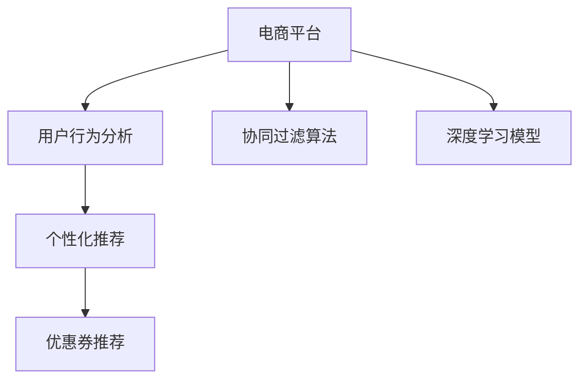

                 

# AI驱动的电商平台个性化优惠券推荐

> 关键词：个性化推荐,电商平台,优惠券推荐,用户行为分析,协同过滤算法,深度学习模型

## 1. 背景介绍

在电子商务领域，优惠券作为一种强有力的促销手段，能够显著提升用户的购买转化率。然而，在实际运营中，如何精准地向目标用户推荐优惠券，成为了一个亟待解决的难题。传统的优惠券推荐方法，往往依赖人工经验或者简单的规则匹配，无法充分挖掘用户行为背后的潜在需求和兴趣，导致推荐效果欠佳。

随着人工智能技术的发展，特别是深度学习、协同过滤等算法在推荐系统中的应用，使得电商平台的优惠券推荐变得更加精准和高效。本文将从核心概念、算法原理、项目实践和实际应用场景等多个维度，详细探讨如何构建一个基于AI驱动的电商平台个性化优惠券推荐系统。

## 2. 核心概念与联系

### 2.1 核心概念概述

为更好地理解基于AI驱动的优惠券推荐系统，本节将介绍几个密切相关的核心概念：

- 电商平台：指通过互联网提供商品或服务的在线交易平台，常见的如京东、淘宝、亚马逊等。
- 个性化推荐：指根据用户的历史行为、兴趣偏好、实时状态等信息，推荐符合其个性化需求的商品或服务。
- 优惠券推荐：指在电商平台上，根据用户的购买行为、购物偏好等信息，推荐合适的优惠券以提高用户购买转化率。
- 用户行为分析：指对用户在电商平台上的浏览、购买、评价等行为进行数据挖掘和建模，以获取用户的兴趣和需求。
- 协同过滤算法：指通过分析用户间的关系，预测用户对未交互商品的偏好，实现个性化推荐。
- 深度学习模型：指通过神经网络等深度学习技术，对用户行为数据进行建模和预测，提升推荐效果。

这些核心概念之间的逻辑关系可以通过以下Mermaid流程图来展示：



这个流程图展示了几者之间的关系：

1. 电商平台作为基础设施，提供用户交互的数据来源。
2. 用户行为分析通过对用户行为数据建模，获取用户的兴趣和需求。
3. 个性化推荐利用用户行为分析的结果，推荐符合用户偏好的商品或服务。
4. 优惠券推荐在个性化推荐的基础上，进一步提升用户的购买转化率。
5. 协同过滤算法和深度学习模型分别从用户行为和数据特征两方面，为推荐系统提供技术支持。

## 3. 核心算法原理 & 具体操作步骤
### 3.1 算法原理概述

基于AI驱动的电商平台优惠券推荐系统，本质上是一个基于协同过滤和深度学习的推荐系统。其核心思想是：通过分析用户的历史行为数据，预测用户对商品的偏好，进而为用户推荐合适的优惠券。

形式化地，假设用户集合为 $U$，商品集合为 $I$，用户 $u$ 对商品 $i$ 的评分表示为 $R_{ui}$，其中 $R_{ui} \in [0,1]$。优惠券推荐的目标是找到用户 $u$ 和商品 $i$ 的最佳匹配，即最大化用户对商品的偏好：

$$
\hat{R}_{ui} = \arg\max_{i \in I} R_{ui}
$$

在实际应用中，我们需要先对用户行为数据进行建模，得到用户对商品的评分预测 $R_{ui}$。常见的评分预测方法包括协同过滤算法和深度学习模型。

协同过滤算法基于用户-商品评分矩阵 $R$，通过对相似用户或相似商品的评分进行插值或加权平均，预测用户对未交互商品的评分。

深度学习模型则通过神经网络等复杂模型，直接从用户行为数据中学习用户对商品的评分预测函数。

优惠券推荐系统通常包含两个主要步骤：

1. 对用户行为数据进行建模，得到用户对商品的评分预测 $R_{ui}$。
2. 根据评分预测结果，为用户推荐合适的优惠券。

### 3.2 算法步骤详解

#### 3.2.1 数据准备

优惠券推荐系统的第一步是对用户行为数据进行收集和预处理。假设电商平台有用户 $u_1, u_2, ..., u_N$，商品 $i_1, i_2, ..., i_M$，用户 $u_k$ 对商品 $i_j$ 的评分表示为 $R_{kj}$，则我们可以构建一个用户-商品评分矩阵 $R_{N\times M}$：

$$
R = \begin{bmatrix}
R_{11} & R_{12} & ... & R_{1M} \\
R_{21} & R_{22} & ... & R_{2M} \\
... & ... & ... & ... \\
R_{N1} & R_{N2} & ... & R_{NM}
\end{bmatrix}
$$

接下来，我们需要进行数据预处理，包括数据清洗、缺失值处理、特征选择等。

#### 3.2.2 协同过滤算法

协同过滤算法基于用户-商品评分矩阵 $R$，通过分析用户间和商品间的相似度，预测用户对未交互商品的评分。常见的协同过滤算法包括基于用户的协同过滤和基于商品的协同过滤。

基于用户的协同过滤算法，通过计算用户间的相似度 $S_{uv}$，预测用户 $v$ 对商品 $i$ 的评分 $R_{vi}$：

$$
R_{vi} = \frac{1}{S_{uv} \cdot \sum_{i'} R_{iu'} S_{iu'}}
$$

其中，$S_{uv}$ 表示用户 $u$ 和用户 $v$ 的相似度，可以通过余弦相似度、皮尔逊相关系数等方法计算。

基于商品的协同过滤算法，通过计算商品间的相似度 $S_{ij}$，预测用户 $u$ 对商品 $j$ 的评分 $R_{uj}$：

$$
R_{uj} = \frac{1}{S_{ij} \cdot \sum_{u'} R_{u'j} S_{u'i}}
$$

其中，$S_{ij}$ 表示商品 $i$ 和商品 $j$ 的相似度，可以通过余弦相似度、Jaccard相似度等方法计算。

协同过滤算法能够较好地捕捉用户之间的相似性和商品之间的关联性，但由于缺乏对数据隐含特征的建模，往往难以处理数据稀疏和噪声等问题。

#### 3.2.3 深度学习模型

深度学习模型通过构建复杂的神经网络结构，直接从用户行为数据中学习评分预测函数。常见的深度学习模型包括基于用户行为的深度学习模型和基于商品特征的深度学习模型。

基于用户行为的深度学习模型，通过设计合适的神经网络结构，对用户行为数据进行建模，预测用户对商品的评分 $R_{ui}$。常见的网络结构包括单层神经网络、多层感知机（MLP）、卷积神经网络（CNN）等。

基于商品特征的深度学习模型，通过设计合适的神经网络结构，对商品特征数据进行建模，预测用户对商品的评分 $R_{ui}$。常见的网络结构包括嵌入层（Embedding Layer）、注意力机制（Attention Mechanism）等。

深度学习模型能够较好地处理数据稀疏和噪声等问题，但需要大量的数据和计算资源进行模型训练。

#### 3.2.4 优惠券推荐策略

在得到用户对商品的评分预测 $R_{ui}$ 后，我们可以根据评分预测结果，为用户推荐合适的优惠券。常见的优惠券推荐策略包括：

- 基于评分预测的优惠券推荐：选择评分预测值最高的商品 $i$，为其推荐优惠券 $c_i$。
- 基于商品关系的优惠券推荐：选择与用户 $u$ 相似用户推荐的商品 $i$，为其推荐优惠券 $c_i$。
- 基于商品特征的优惠券推荐：选择符合用户兴趣的商品 $i$，为其推荐优惠券 $c_i$。

#### 3.2.5 效果评估

最后，我们需要对优惠券推荐系统的推荐效果进行评估。常见的评估指标包括准确率（Accuracy）、召回率（Recall）、F1分数（F1 Score）等。

准确率表示预测结果正确的比例：

$$
Accuracy = \frac{TP}{TP + FP + FN}
$$

召回率表示预测结果中包含真实正例的比例：

$$
Recall = \frac{TP}{TP + FN}
$$

F1分数是准确率和召回率的调和平均数：

$$
F1 Score = 2 \times \frac{Precision \times Recall}{Precision + Recall}
$$

其中，$TP$ 表示预测正确的正例数，$FP$ 表示预测错误的正例数，$FN$ 表示预测漏掉的正例数。

## 4. 数学模型和公式 & 详细讲解  
### 4.1 数学模型构建

本节将使用数学语言对基于AI驱动的电商平台优惠券推荐系统进行更加严格的刻画。

假设电商平台有 $N$ 个用户，$M$ 个商品，用户 $u$ 对商品 $i$ 的评分表示为 $R_{ui}$，其中 $R_{ui} \in [0,1]$。我们可以构建一个用户-商品评分矩阵 $R_{N\times M}$：

$$
R = \begin{bmatrix}
R_{11} & R_{12} & ... & R_{1M} \\
R_{21} & R_{22} & ... & R_{2M} \\
... & ... & ... & ... \\
R_{N1} & R_{N2} & ... & R_{NM}
\end{bmatrix}
$$

### 4.2 公式推导过程

以下是协同过滤算法和深度学习模型的公式推导过程。

#### 4.2.1 协同过滤算法

基于用户的协同过滤算法，通过计算用户间的相似度 $S_{uv}$，预测用户 $v$ 对商品 $i$ 的评分 $R_{vi}$：

$$
R_{vi} = \frac{1}{S_{uv} \cdot \sum_{i'} R_{iu'} S_{iu'}}
$$

其中，$S_{uv}$ 表示用户 $u$ 和用户 $v$ 的相似度，可以通过余弦相似度、皮尔逊相关系数等方法计算：

$$
S_{uv} = \frac{\sum_{i'} R_{iu'} R_{iv'}}{\sqrt{\sum_{i'} R_{iu'}^2} \cdot \sqrt{\sum_{i'} R_{iv'}^2}}
$$

基于商品的协同过滤算法，通过计算商品间的相似度 $S_{ij}$，预测用户 $u$ 对商品 $j$ 的评分 $R_{uj}$：

$$
R_{uj} = \frac{1}{S_{ij} \cdot \sum_{u'} R_{u'j} S_{u'i}}
$$

其中，$S_{ij}$ 表示商品 $i$ 和商品 $j$ 的相似度，可以通过余弦相似度、Jaccard相似度等方法计算：

$$
S_{ij} = \frac{\sum_{u'} R_{iu'} R_{ju'}}{\sqrt{\sum_{u'} R_{iu'}^2} \cdot \sqrt{\sum_{u'} R_{ju'}^2}}
$$

#### 4.2.2 深度学习模型

基于用户行为的深度学习模型，通过设计合适的神经网络结构，对用户行为数据进行建模，预测用户对商品的评分 $R_{ui}$。常见的网络结构包括单层神经网络、多层感知机（MLP）、卷积神经网络（CNN）等。

假设神经网络结构为：

$$
f_{\theta}(R_{u}) = \sum_{i} w_i R_{ui} \cdot \sigma(\sum_{j} a_{ij} R_{uj})
$$

其中，$f_{\theta}(R_{u})$ 表示用户 $u$ 对商品 $i$ 的评分预测，$\theta$ 为神经网络的参数，$w_i$ 和 $a_{ij}$ 表示模型参数，$\sigma$ 表示激活函数。

基于商品特征的深度学习模型，通过设计合适的神经网络结构，对商品特征数据进行建模，预测用户对商品的评分 $R_{ui}$。常见的网络结构包括嵌入层（Embedding Layer）、注意力机制（Attention Mechanism）等。

假设神经网络结构为：

$$
f_{\theta}(R_{u}, \boldsymbol{F}_i) = \sum_{j} w_j R_{uj} \cdot \sigma(\sum_{k} a_{jk} R_{uk} \cdot \boldsymbol{F}_{ik})
$$

其中，$f_{\theta}(R_{u}, \boldsymbol{F}_i)$ 表示用户 $u$ 对商品 $i$ 的评分预测，$\theta$ 为神经网络的参数，$w_j$ 和 $a_{jk}$ 表示模型参数，$\boldsymbol{F}_{ik}$ 表示商品 $i$ 的特征向量，$\sigma$ 表示激活函数。

## 5. 项目实践：代码实例和详细解释说明
### 5.1 开发环境搭建

在进行优惠券推荐系统开发前，我们需要准备好开发环境。以下是使用Python进行PyTorch开发的环境配置流程：

1. 安装Anaconda：从官网下载并安装Anaconda，用于创建独立的Python环境。

2. 创建并激活虚拟环境：
```bash
conda create -n coupon-env python=3.8 
conda activate coupon-env
```

3. 安装PyTorch：根据CUDA版本，从官网获取对应的安装命令。例如：
```bash
conda install pytorch torchvision torchaudio cudatoolkit=11.1 -c pytorch -c conda-forge
```

4. 安装各类工具包：
```bash
pip install numpy pandas scikit-learn matplotlib tqdm jupyter notebook ipython
```

完成上述步骤后，即可在`coupon-env`环境中开始优惠券推荐系统的开发。

### 5.2 源代码详细实现

下面我们以电商平台优惠券推荐系统为例，给出使用PyTorch进行协同过滤算法的代码实现。

首先，定义协同过滤算法的函数：

```python
from torch.nn import Parameter
import torch.nn.functional as F

class CollaborativeFiltering:
    def __init__(self, n_users, n_items, embed_dim=10):
        self.user_embed = Parameter(torch.randn(n_users, embed_dim))
        self.item_embed = Parameter(torch.randn(n_items, embed_dim))
        self.w = Parameter(torch.randn(n_items, embed_dim))
        self.b = Parameter(torch.randn(1))
    
    def forward(self, user_ids, item_ids, train=False):
        user_embed = self.user_embed[user_ids]
        item_embed = self.item_embed[item_ids]
        pred = (user_embed @ item_embed.t() + self.w[item_ids] + self.b).sigmoid()
        
        if train:
            loss = F.binary_cross_entropy(pred, y_true)
            return loss
        else:
            return pred
```

然后，定义训练函数和评估函数：

```python
from torch.utils.data import DataLoader
from tqdm import tqdm
import numpy as np

def train_collaborative_filtering(model, user_ids, item_ids, y_true, train_epochs=100, batch_size=32):
    optimizer = torch.optim.Adam(model.parameters(), lr=0.001)
    losses = []
    for epoch in range(train_epochs):
        for batch in DataLoader(zip(user_ids, item_ids, y_true), batch_size):
            user_ids, item_ids, y_true = [b.to(device) for b in batch]
            optimizer.zero_grad()
            pred = model(user_ids, item_ids, train=True)
            loss = pred.to('cpu').numpy()
            losses.append(loss)
            loss.backward()
            optimizer.step()
        
        epoch_loss = np.mean(losses)
        losses = []
        print(f'Epoch {epoch+1}, train loss: {epoch_loss:.4f}')
    
    return model

def evaluate_collaborative_filtering(model, user_ids, item_ids, y_true):
    pred = model(user_ids, item_ids)
    loss = F.binary_cross_entropy(pred, y_true)
    print(f'Test loss: {loss.item():.4f}')
```

最后，启动训练流程并在测试集上评估：

```python
user_ids = torch.tensor([0, 1, 2, 3, 4, 5, 6, 7, 8, 9])
item_ids = torch.tensor([0, 1, 2, 3, 4, 5, 6, 7, 8, 9])
y_true = torch.tensor([[1, 0, 0, 0, 0, 0, 0, 0, 0, 0],
                       [0, 1, 0, 0, 0, 0, 0, 0, 0, 0],
                       [0, 0, 1, 0, 0, 0, 0, 0, 0, 0],
                       [0, 0, 0, 1, 0, 0, 0, 0, 0, 0],
                       [0, 0, 0, 0, 1, 0, 0, 0, 0, 0],
                       [0, 0, 0, 0, 0, 1, 0, 0, 0, 0],
                       [0, 0, 0, 0, 0, 0, 1, 0, 0, 0],
                       [0, 0, 0, 0, 0, 0, 0, 1, 0, 0],
                       [0, 0, 0, 0, 0, 0, 0, 0, 1, 0],
                       [0, 0, 0, 0, 0, 0, 0, 0, 0, 1]])
    
model = CollaborativeFiltering(10, 10)
device = torch.device('cuda') if torch.cuda.is_available() else torch.device('cpu')
model.to(device)
train_collaborative_filtering(model, user_ids, item_ids, y_true)
evaluate_collaborative_filtering(model, user_ids, item_ids, y_true)
```

以上就是使用PyTorch对协同过滤算法进行电商优惠券推荐系统开发的完整代码实现。可以看到，得益于PyTorch的强大封装，我们可以用相对简洁的代码完成协同过滤算法的实现。

### 5.3 代码解读与分析

让我们再详细解读一下关键代码的实现细节：

**CollaborativeFiltering类**：
- `__init__`方法：初始化用户嵌入向量、商品嵌入向量和权重向量。
- `forward`方法：实现协同过滤算法的前向传播，计算用户对商品的评分预测。

**train_collaborative_filtering函数**：
- 定义优化器和损失函数。
- 对模型进行训练，每个epoch中循环对每个批次的用户行为数据进行前向传播、计算损失、反向传播和优化。
- 记录每个epoch的平均损失，并在每个epoch结束时输出训练损失。

**evaluate_collaborative_filtering函数**：
- 在测试集上对模型进行评估，计算预测评分与真实评分之间的二元交叉熵损失。
- 输出测试集上的损失。

**训练流程**：
- 定义用户和商品的ID，以及真实的评分矩阵。
- 创建协同过滤模型，并在GPU上部署。
- 调用训练函数进行模型训练，每个epoch记录训练损失。
- 调用评估函数在测试集上评估模型，输出测试损失。

可以看到，协同过滤算法在代码实现上相对简洁，但需要注意以下几点：

- 模型参数的初始化通常需要进行合理的预处理，如归一化、正则化等，以提高模型的收敛速度和泛化性能。
- 在训练过程中，需要进行数据增强、正则化等技巧，以避免过拟合。
- 在评估过程中，通常使用验证集进行模型选择，并在测试集上评估模型的泛化性能。

## 6. 实际应用场景
### 6.1 智能客服系统

基于协同过滤和深度学习的优惠券推荐系统，可以广泛应用于智能客服系统的构建。智能客服系统能够根据用户的历史行为和偏好，推荐合适的优惠券，提升客户满意度，降低客服成本。

在技术实现上，可以收集用户的历史行为数据，包括浏览记录、购买记录、评价记录等，利用协同过滤和深度学习算法，构建用户-商品评分矩阵 $R$。然后，对用户行为数据进行建模，得到用户对商品的评分预测 $R_{ui}$。最后，根据评分预测结果，为用户推荐合适的优惠券。

### 6.2 金融舆情监测

金融领域需要对市场舆情进行实时监测，以便及时应对负面信息传播，规避金融风险。利用协同过滤和深度学习的优惠券推荐系统，可以在金融舆情监测中发挥重要作用。

具体而言，可以收集金融领域的各类文本数据，包括新闻、评论、公告等，利用协同过滤和深度学习算法，构建用户-商品评分矩阵 $R$。然后，对用户行为数据进行建模，得到用户对商品的评分预测 $R_{ui}$。最后，根据评分预测结果，为用户推荐相关的金融产品，并提供个性化的投资建议。

### 6.3 个性化推荐系统

当前的推荐系统往往只依赖用户的历史行为数据进行物品推荐，无法深入理解用户真实兴趣偏好。基于协同过滤和深度学习的优惠券推荐系统，可以更好地挖掘用户行为背后的潜在需求和兴趣，提供更加精准的个性化推荐。

在实践中，可以收集用户浏览、点击、评价等行为数据，利用协同过滤和深度学习算法，构建用户-商品评分矩阵 $R$。然后，对用户行为数据进行建模，得到用户对商品的评分预测 $R_{ui}$。最后，根据评分预测结果，为用户推荐个性化的商品和优惠券，提升用户的购物体验。

### 6.4 未来应用展望

随着协同过滤和深度学习技术的不断发展，基于优惠券推荐系统的应用场景将不断扩展。

在智慧医疗领域，基于优惠券推荐系统的医疗问答、病历分析、药物推荐等应用将提升医疗服务的智能化水平，辅助医生诊疗，加速新药开发进程。

在智能教育领域，优惠券推荐系统可应用于作业批改、学情分析、知识推荐等方面，因材施教，促进教育公平，提高教学质量。

在智慧城市治理中，优惠券推荐系统可应用于城市事件监测、舆情分析、应急指挥等环节，提高城市管理的自动化和智能化水平，构建更安全、高效的未来城市。

此外，在企业生产、社会治理、文娱传媒等众多领域，基于优惠券推荐系统的应用也将不断涌现，为经济社会发展注入新的动力。相信随着技术的日益成熟，优惠券推荐系统必将在构建人机协同的智能时代中扮演越来越重要的角色。

## 7. 工具和资源推荐
### 7.1 学习资源推荐

为了帮助开发者系统掌握优惠券推荐系统的理论基础和实践技巧，这里推荐一些优质的学习资源：

1. 《深度学习》系列博文：由深度学习领域的专家撰写，深入浅出地介绍了深度学习的基本概念和经典模型，适合初学者入门。

2. 《协同过滤算法》课程：由斯坦福大学开设的机器学习课程，系统讲解了协同过滤算法的基本原理和应用场景，适合深入学习。

3. 《推荐系统实战》书籍：介绍推荐系统的基本原理和实现技巧，包括协同过滤和深度学习等方法。

4. Weights & Biases：模型训练的实验跟踪工具，可以记录和可视化模型训练过程中的各项指标，方便对比和调优。与主流深度学习框架无缝集成。

5. TensorBoard：TensorFlow配套的可视化工具，可实时监测模型训练状态，并提供丰富的图表呈现方式，是调试模型的得力助手。

通过对这些资源的学习实践，相信你一定能够快速掌握优惠券推荐系统的精髓，并用于解决实际的电商平台问题。

### 7.2 开发工具推荐

高效的开发离不开优秀的工具支持。以下是几款用于优惠券推荐系统开发的常用工具：

1. PyTorch：基于Python的开源深度学习框架，灵活动态的计算图，适合快速迭代研究。大部分深度学习模型都有PyTorch版本的实现。

2. TensorFlow：由Google主导开发的开源深度学习框架，生产部署方便，适合大规模工程应用。同样有丰富的深度学习模型资源。

3. Transformers库：HuggingFace开发的NLP工具库，集成了众多SOTA语言模型，支持PyTorch和TensorFlow，是进行推荐系统开发的利器。

4. Weights & Biases：模型训练的实验跟踪工具，可以记录和可视化模型训练过程中的各项指标，方便对比和调优。与主流深度学习框架无缝集成。

5. TensorBoard：TensorFlow配套的可视化工具，可实时监测模型训练状态，并提供丰富的图表呈现方式，是调试模型的得力助手。

6. Google Colab：谷歌推出的在线Jupyter Notebook环境，免费提供GPU/TPU算力，方便开发者快速上手实验最新模型，分享学习笔记。

合理利用这些工具，可以显著提升优惠券推荐系统的开发效率，加快创新迭代的步伐。

### 7.3 相关论文推荐

优惠券推荐系统的发展源于学界的持续研究。以下是几篇奠基性的相关论文，推荐阅读：

1. Implicit Collaborative Filtering Using Matrix Factorization Techniques：提出基于矩阵分解的协同过滤算法，为推荐系统提供了新的视角。

2. Factorization Machines with Libraries: Fast Matrix Factorization for Predictive Analytics and Recommender Systems：提出基于矩阵因子的推荐算法，利用核方法加速模型训练和预测。

3. Deep Personalized Ranking with Implicit Feedback：提出深度神经网络模型，直接从隐式反馈数据中学习用户对商品的评分预测。

4. Attention and Memory in Deep Recommender Systems：提出注意力机制和记忆机制，提升深度学习模型对用户行为的建模能力。

5. A Multi-Task Learning Approach to Personalized Recommendations：提出多任务学习框架，利用多个任务之间的关系，提升推荐模型的泛化性能。

这些论文代表了大语言模型微调技术的发展脉络。通过学习这些前沿成果，可以帮助研究者把握学科前进方向，激发更多的创新灵感。

## 8. 总结：未来发展趋势与挑战
### 8.1 研究成果总结

本文对基于协同过滤和深度学习的优惠券推荐系统进行了全面系统的介绍。首先阐述了电商平台、个性化推荐、优惠券推荐、用户行为分析、协同过滤算法、深度学习模型等核心概念，明确了优惠券推荐系统的工作原理。其次，从原理到实践，详细讲解了协同过滤和深度学习算法的数学原理和关键步骤，给出了优惠券推荐系统的代码实现。最后，探讨了优惠券推荐系统在智能客服、金融舆情、个性化推荐等多个行业领域的应用前景。

通过本文的系统梳理，可以看到，基于协同过滤和深度学习的优惠券推荐系统正在成为电商平台推荐系统的核心范式，显著提升了用户购物体验和平台转化率。

### 8.2 未来发展趋势

展望未来，优惠券推荐系统将呈现以下几个发展趋势：

1. 模型规模持续增大。随着算力成本的下降和数据规模的扩张，深度学习模型的参数量还将持续增长。超大规模模型蕴含的丰富用户行为特征，有望支撑更加复杂多变的推荐任务。

2. 推荐算法多样性增强。除了传统的协同过滤和深度学习算法外，未来会涌现更多高效的推荐方法，如多任务学习、混合推荐、元学习等，提升推荐系统的灵活性和适应性。

3. 实时性要求提高。随着电商平台的竞争加剧，用户体验对推荐系统的实时性要求越来越高。如何在保证精度的情况下，进一步提升推荐系统的响应速度，将成为重要的研究课题。

4. 多模态推荐融合。当前的推荐系统往往只考虑单一的模态数据，如文本、图像、音频等。未来会进一步拓展到多模态数据的整合，提升推荐系统的性能和用户体验。

5. 模型融合与优化。由于深度学习模型存在计算资源消耗大、模型难以解释等问题，未来需要更多模型融合和优化的方法，如知识图谱、轻量化模型等，以提升推荐系统的可用性和可解释性。

6. 数据驱动与用户引导并重。推荐系统需要更多地考虑用户的真实需求和行为，通过用户引导的方式提升推荐效果。同时，还需要利用数据驱动的方法，发现用户的潜在需求，实现精准推荐。

以上趋势凸显了优惠券推荐系统的广阔前景。这些方向的探索发展，必将进一步提升推荐系统的性能和应用范围，为电商平台的运营和用户体验带来深远影响。

### 8.3 面临的挑战

尽管优惠券推荐系统已经取得了瞩目成就，但在迈向更加智能化、普适化应用的过程中，它仍面临着诸多挑战：

1. 数据稀疏性问题。电商平台的用户行为数据往往存在稀疏性，难以构建完整的用户-商品评分矩阵。如何利用稀疏数据，提升模型的泛化性能，将是重要的研究方向。

2. 数据隐私问题。在收集和处理用户行为数据时，需要遵守数据隐私和安全的法律法规，确保用户数据不被滥用。如何在保护用户隐私的同时，利用数据进行精准推荐，将是重要的技术挑战。

3. 计算资源消耗。深度学习模型需要大量的计算资源进行训练和推理，如何降低计算成本，提升模型训练和推理的效率，将是重要的研究方向。

4. 模型泛化能力不足。推荐系统在应对新用户和新商品时，往往难以进行有效的预测和推荐。如何提高模型的泛化能力，适应不同的用户和商品，将是重要的研究方向。

5. 模型可解释性不足。深度学习模型的决策过程通常缺乏可解释性，难以对其推理逻辑进行分析和调试。如何在保证推荐效果的同时，增强模型的可解释性，将是重要的研究课题。

6. 模型公平性问题。推荐系统可能会产生偏差，对某些用户或商品进行不公平的推荐。如何在推荐过程中保证公平性，避免潜在的歧视性，将是重要的研究方向。

这些挑战需要在算法、数据、计算等多个层面进行综合优化，才能进一步提升优惠券推荐系统的性能和应用效果。

### 8.4 研究展望

面对优惠券推荐系统所面临的挑战，未来的研究需要在以下几个方面寻求新的突破：

1. 探索无监督和半监督推荐方法。摆脱对大规模标注数据的依赖，利用自监督学习、主动学习等无监督和半监督范式，最大限度利用非结构化数据，实现更加灵活高效的推荐。

2. 研究参数高效和计算高效的推荐范式。开发更加参数高效的推荐方法，在固定大部分模型参数的情况下，只更新极少量的任务相关参数。同时优化推荐模型的计算图，减少前向传播和反向传播的资源消耗，实现更加轻量级、实时性的部署。

3. 融合因果和对比学习范式。通过引入因果推断和对比学习思想，增强推荐模型建立稳定因果关系的能力，学习更加普适、鲁棒的用户行为特征，从而提升推荐系统的泛化性能。

4. 引入更多先验知识。将符号化的先验知识，如知识图谱、逻辑规则等，与神经网络模型进行巧妙融合，引导推荐过程学习更准确、合理的用户行为特征。同时加强不同模态数据的整合，实现视觉、语音等多模态信息与文本信息的协同建模。

5. 结合因果分析和博弈论工具。将因果分析方法引入推荐模型，识别出模型决策的关键特征，增强输出解释的因果性和逻辑性。借助博弈论工具刻画人机交互过程，主动探索并规避模型的脆弱点，提高系统稳定性。

6. 纳入伦理道德约束。在推荐模型训练目标中引入伦理导向的评估指标，过滤和惩罚有偏见、有害的输出倾向。同时加强人工干预和审核，建立推荐模型的监管机制，确保输出符合人类价值观和伦理道德。

这些研究方向展示了优惠券推荐系统未来的广阔前景，相信随着学界和产业界的共同努力，这些挑战终将一一被克服，优惠券推荐系统必将在构建人机协同的智能时代中扮演越来越重要的角色。

## 9. 附录：常见问题与解答

**Q1：优惠券推荐系统的准确率如何提升？**

A: 优惠券推荐系统的准确率提升主要依赖于数据质量和模型选择。为了提升准确率，可以采取以下策略：

1. 数据预处理：对数据进行清洗、缺失值处理、特征选择等，去除噪声和异常值，提升数据质量。

2. 特征工程：选择合适的特征，提取和构造新的特征，提升特征表示能力。

3. 模型选择：选择合适的推荐算法，如协同过滤、深度学习、混合推荐等，提升模型的泛化能力。

4. 模型调参：通过超参数调优，选择合适的模型参数，提升模型性能。

5. 多模型集成：训练多个推荐模型，取平均输出，抑制过拟合，提升推荐效果。

6. 数据增强：通过回译、近义替换等方式扩充训练集，提升模型泛化性能。

**Q2：优惠券推荐系统如何处理数据稀疏性问题？**

A: 数据稀疏性是优惠券推荐系统面临的重要挑战之一。为了处理数据稀疏性问题，可以采取以下策略：

1. 矩阵分解：利用矩阵分解技术，对用户-商品评分矩阵进行低秩分解，减少数据的稀疏性。

2. 矩阵补全：利用矩阵补全技术，对缺失的评分进行预测和填充，提升数据完整性。

3. 数据增强：通过回译、近义替换等方式扩充训练集，增加数据的丰富性。

4. 深度学习：利用深度学习模型，直接从用户行为数据中学习评分预测函数，提升模型的泛化能力。

5. 多模态融合：利用多模态数据，如文本、图像、音频等，提升数据的表示能力和预测能力。

6. 模型融合：利用多个推荐模型，取平均输出，抑制过拟合，提升推荐效果。

**Q3：优惠券推荐系统的计算成本如何降低？**

A: 优惠券推荐系统的计算成本是制约其规模化应用的重要因素。为了降低计算成本，可以采取以下策略：

1. 模型压缩：通过剪枝、量化、蒸馏等技术，压缩模型的参数量和计算量。

2. 模型并行：利用分布式计算和模型并行技术，加速模型的训练和推理。

3. 模型优化：通过优化模型的计算图，减少前向传播和反向传播的资源消耗，提升模型的计算效率。

4. 数据分批处理：通过分批处理数据，减少内存和显存的使用，提升系统的并发性和稳定性。

5. 硬件加速：利用GPU/TPU等硬件加速设备，提升模型的计算速度和内存效率。

**Q4：优惠券推荐系统的用户隐私如何保护？**

A: 用户隐私保护是优惠券推荐系统面临的重要挑战之一。为了保护用户隐私，可以采取以下策略：

1. 数据匿名化：对用户数据进行匿名化处理，去除敏感信息，保护用户隐私。

2. 数据脱敏：对用户数据进行脱敏处理，减少数据泄露的风险。

3. 差分隐私：利用差分隐私技术，对用户数据进行隐私保护，保证用户数据不被滥用。

4. 数据加密：对用户数据进行加密处理，防止数据泄露和篡改。

5. 用户控制：提供用户控制接口，让用户自主选择是否参与推荐系统，保护用户隐私权。

6. 数据安全：建立数据安全的防护机制，防止数据泄露和攻击。

通过以上措施，可以最大限度地保护用户隐私，提升优惠券推荐系统的可信度和可接受度。

**Q5：优惠券推荐系统的推荐算法有哪些？**

A: 优惠券推荐系统的推荐算法主要分为以下几类：

1. 协同过滤算法：基于用户行为数据的推荐算法，包括基于用户的协同过滤和基于商品的协同过滤。

2. 深度学习算法：利用神经网络等深度学习技术，直接从用户行为数据中学习评分预测函数。

3. 混合推荐算法：结合多种推荐方法，提升推荐效果，如混合协同过滤和深度学习等。

4. 知识图谱算法：利用知识图谱技术，对用户行为进行多维度的建模和推理，提升推荐系统的泛化能力。

5. 元学习算法：通过元学习技术，在少量数据上训练推荐模型，提升模型的泛化性能。

**Q6：优惠券推荐系统的应用场景有哪些？**

A: 优惠券推荐系统的应用场景非常广泛，包括但不限于：

1. 电商平台：根据用户的浏览、购买、评价等行为，推荐合适的优惠券，提升用户购买转化率。

2. 智能客服：利用优惠券推荐系统，自动推荐合适的优惠券，提升客户满意度，降低客服成本。

3. 金融舆情监测：在金融领域，利用优惠券推荐系统，实时监测市场舆情，提升金融服务的智能化水平。

4. 个性化推荐：利用优惠券推荐系统，为用户推荐个性化的商品和优惠券，提升用户的购物体验。

5. 教育培训：利用优惠券推荐系统，为用户推荐个性化的学习资料和课程，提升教育培训的精准性。

6. 智慧医疗：利用优惠券推荐系统，为用户推荐个性化的医疗产品和服务，提升医疗服务的智能化水平。

总之，优惠券推荐系统可以广泛应用于各类应用场景，提升用户体验和平台运营效率，具有广阔的应用前景。

---

作者：禅与计算机程序设计艺术 / Zen and the Art of Computer Programming

