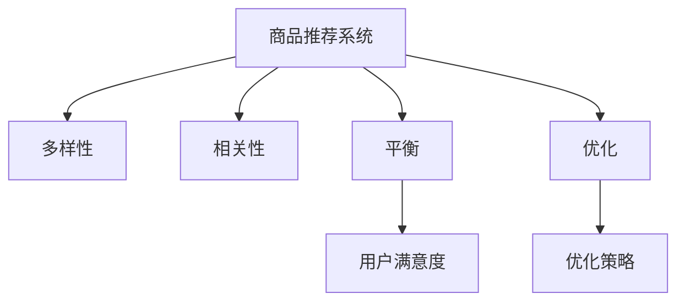

                 

# AI驱动的电商平台商品推荐多样性与相关性平衡

> 关键词：AI推荐算法,商品推荐,多样性,相关性,平衡,电商,优化,用户满意度

## 1. 背景介绍

### 1.1 问题由来
随着电子商务的兴起，各大电商平台如亚马逊、淘宝、京东等，正利用强大的数据分析和机器学习技术，为消费者提供个性化的商品推荐服务。商品推荐系统（Recommendation System）的目标是根据用户的历史行为和当前需求，推荐出用户最可能感兴趣的商品。

近年来，由于深度学习技术的迅速发展，深度学习驱动的推荐系统已成为商品推荐的主流方法。这类系统通常基于用户行为数据，使用神经网络模型，通过学习用户与商品之间的潜在关联关系，来预测用户对商品的兴趣。然而，这种基于历史行为的推荐方法，有时会导致"信息茧房"（Filter Bubble）现象，即用户只会接收到一种类型的商品推荐，导致商品种类的多样性下降，用户满意度和粘性降低。

### 1.2 问题核心关键点
为了解决上述问题，电商平台需要在推荐系统设计中，平衡商品推荐的相关性和多样性，以提升用户满意度和粘性。相关性指的是推荐系统推荐的商品与用户当前需求之间的匹配程度；多样性则指的是推荐商品种类和特征的多样性，确保用户能够接触到不同类型的商品，拓展其购物选择。

为了达到这一目标，推荐系统在实际应用中，常常需要调整模型参数，优化推荐策略，使得推荐结果既能满足用户的当前需求，又能展示出足够多样性的商品。本文将探讨基于深度学习驱动的商品推荐系统的多样性与相关性平衡问题，提出多种优化策略，旨在提高电商平台的推荐效果。

## 2. 核心概念与联系

### 2.1 核心概念概述

为更好地理解电商平台商品推荐系统的多样性与相关性平衡，本文将介绍几个核心概念：

- **商品推荐系统(Recommendation System)**：一种自动化推荐用户可能感兴趣的商品的系统，基于用户行为数据或商品属性，通过机器学习算法实现。
- **多样性(Diversity)**：推荐系统推荐的商品种类和特征的多样性，避免推荐单一类别的商品。
- **相关性(Relevance)**：推荐系统推荐的商品与用户当前需求之间的匹配程度。
- **平衡(Balance)**：在推荐系统设计中，寻求商品推荐的相关性和多样性之间的最佳权衡点。
- **优化(Optimization)**：通过调整模型参数，优化推荐策略，使得推荐结果满足用户需求，同时展示出足够多样性的商品。
- **用户满意度(User Satisfaction)**：用户对推荐商品满意度的度量指标，通常通过点击率、购买率等行为指标来评估。

这些核心概念之间的逻辑关系可以通过以下Mermaid流程图来展示：



这个流程图展示了推荐系统的主要组件及其之间的关系：

1. 推荐系统通过学习用户行为或商品属性，生成推荐结果。
2. 多样性指的是推荐商品的多样性，相关性指的是推荐商品与用户需求的匹配程度。
3. 平衡和优化是实现最佳推荐结果的关键，通过调整模型参数和策略，使得推荐结果同时满足多样性和相关性。
4. 用户满意度是推荐系统的最终目标，通常通过点击率、购买率等行为指标来衡量。

这些概念共同构成了商品推荐系统的核心设计理念，使其能够平衡商品推荐的相关性和多样性，提升用户满意度。

## 3. 核心算法原理 & 具体操作步骤
### 3.1 算法原理概述

基于深度学习的商品推荐系统，其核心思想是通过机器学习模型，预测用户对商品的兴趣，并根据兴趣度进行排序，生成推荐列表。在实际应用中，推荐系统通常包含两个主要部分：用户模型和商品模型。用户模型表示用户的兴趣和行为特征，商品模型则用于描述商品的属性和特征。

推荐系统的推荐过程，可以概括为以下几个步骤：

1. 数据预处理：将用户行为数据和商品属性数据进行预处理，去除噪声，填充缺失值。
2. 特征提取：使用深度学习模型提取用户和商品的特征表示，通常是使用稠密或稀疏编码器。
3. 相似度计算：计算用户与商品的相似度，通常使用向量内积或余弦相似度等方法。
4. 推荐生成：根据相似度计算结果，对商品进行排序，生成推荐列表。

在推荐生成过程中，为了平衡商品推荐的相关性和多样性，推荐系统需要调整模型参数，优化推荐策略，使得推荐结果既能满足用户的当前需求，又能展示出足够多样性的商品。常见的优化策略包括：

- **多样性约束**：在推荐过程中，加入多样性约束，确保推荐结果中包含足够多样的商品。
- **负采样**：随机选取一部分不相关的商品，作为负样本，优化模型以提升相关性。
- **重采样**：对用户行为数据进行重采样，增加少见商品的出现概率，提升多样性。
- **多任务学习**：同时学习多个推荐任务，提升推荐的多样性和相关性。

### 3.2 算法步骤详解

以一个基于深度学习驱动的商品推荐系统为例，下面详细介绍推荐系统的多样性与相关性平衡优化过程：

**Step 1: 数据预处理**

将用户行为数据和商品属性数据进行预处理，去除噪声，填充缺失值。可以使用以下步骤：

1. 去重：去除重复的用户行为记录，只保留唯一的记录。
2. 标准化：对数据进行标准化处理，使得数据的尺度一致。
3. 归一化：对数据进行归一化处理，使得数据的范围在[0, 1]之间。
4. 填充缺失值：对缺失值进行填充，可以使用均值、中位数或插值等方法。

**Step 2: 特征提取**

使用深度学习模型提取用户和商品的特征表示。常见的特征提取模型包括：

1. 稠密编码器：如DNN、CNN、RNN等，可以将用户行为和商品属性映射到高维特征空间。
2. 稀疏编码器：如ALS、SVD等，可以将用户行为和商品属性映射到低维特征空间。

**Step 3: 相似度计算**

计算用户与商品的相似度，通常使用向量内积或余弦相似度等方法。计算相似度的步骤如下：

1. 对用户和商品进行编码，生成用户特征向量和商品特征向量。
2. 计算相似度得分，使用内积或余弦相似度公式。
3. 对相似度得分进行归一化处理，使得得分在[0, 1]之间。

**Step 4: 推荐生成**

根据相似度计算结果，对商品进行排序，生成推荐列表。常见的排序方法包括：

1. 基于用户兴趣的排序：根据用户的历史行为数据，对商品进行排序。
2. 基于商品属性排序：根据商品的某些属性，对商品进行排序。
3. 基于混合排序：综合考虑用户兴趣和商品属性，对商品进行排序。

在推荐生成过程中，为了平衡商品推荐的相关性和多样性，推荐系统需要调整模型参数，优化推荐策略，使得推荐结果既能满足用户的当前需求，又能展示出足够多样性的商品。常见的优化策略包括：

**多样性约束**：在推荐过程中，加入多样性约束，确保推荐结果中包含足够多样的商品。

**负采样**：随机选取一部分不相关的商品，作为负样本，优化模型以提升相关性。

**重采样**：对用户行为数据进行重采样，增加少见商品的出现概率，提升多样性。

**多任务学习**：同时学习多个推荐任务，提升推荐的多样性和相关性。

### 3.3 算法优缺点

基于深度学习的商品推荐系统具有以下优点：

1. 高度灵活：可以处理大规模数据，适应各种复杂的推荐场景。
2. 预测准确：通过深度学习模型，可以实现高精度的商品推荐。
3. 实时响应：可以通过在线学习算法，实现实时推荐更新。

同时，该方法也存在一定的局限性：

1. 数据依赖：推荐系统的性能很大程度上取决于用户行为数据的丰富度和质量。
2. 计算复杂：深度学习模型需要大量的计算资源，尤其是对于大规模推荐系统。
3. 模型复杂：深度学习模型通常结构复杂，难以解释其内部工作机制。
4. 过拟合风险：深度学习模型容易过拟合，需要合理调整超参数，避免过拟合。

尽管存在这些局限性，但就目前而言，基于深度学习的推荐系统仍是最主流的方法之一。未来相关研究的重点在于如何进一步提高推荐系统的多样性和相关性，同时兼顾可解释性和计算效率。

### 3.4 算法应用领域

基于深度学习驱动的商品推荐系统，已经在电商、媒体、社交等领域得到了广泛的应用，为这些领域的推荐场景提供了强大的技术支持。例如：

- **电商平台**：淘宝、京东等电商平台，通过商品推荐系统，向用户推荐个性化的商品，提升用户满意度和购物体验。
- **视频平台**：Netflix、YouTube等视频平台，通过推荐系统，向用户推荐感兴趣的视频内容，增加用户粘性和平台留存率。
- **社交网络**：Facebook、Twitter等社交网络，通过推荐系统，向用户推荐感兴趣的内容和好友，增加用户互动和平台活跃度。

除了上述这些经典应用外，商品推荐系统还被创新性地应用到更多场景中，如智能家居、智能健康等，为更多领域带来了智能化的推荐服务。随着推荐算法的持续演进，相信推荐技术将在更广泛的领域大放异彩。

## 4. 数学模型和公式 & 详细讲解  
### 4.1 数学模型构建

为了更好地理解推荐系统的多样性与相关性平衡问题，本节将介绍几个常见的推荐系统数学模型：

- **协同过滤(Collaborative Filtering)**：基于用户行为数据，通过用户-用户和商品-商品相似度计算，推荐出用户可能感兴趣的商品。
- **基于内容的推荐(Content-Based Recommendation)**：基于商品属性，通过计算用户和商品之间的相似度，推荐出相似的商品。
- **矩阵分解(Matrix Factorization)**：将用户行为数据和商品属性数据映射到低维特征空间，通过矩阵分解，得到用户-商品评分矩阵。

这些推荐模型的共同点是，都是通过计算用户与商品的相似度，生成推荐列表。推荐模型的目标函数可以表示为：

$$
\min_{\theta} \frac{1}{N} \sum_{i=1}^{N} \sum_{j=1}^{M} (\hat{y}_{i,j} - y_{i,j})^2
$$

其中，$\theta$ 为模型参数，$\hat{y}_{i,j}$ 为模型预测的用户对商品$j$的评分，$y_{i,j}$ 为实际的用户对商品$j$的评分。

### 4.2 公式推导过程

以下我们将以协同过滤模型为例，推导推荐模型的公式推导过程。

协同过滤模型基于用户-商品评分矩阵$R$，通过计算用户与商品的相似度，生成推荐列表。设用户$i$对商品$j$的评分向量为$\mathbf{r}_i \in \mathbb{R}^M$，商品$j$的特征向量为$\mathbf{p}_j \in \mathbb{R}^N$，用户$i$的特征向量为$\mathbf{u}_i \in \mathbb{R}^N$。协同过滤模型的目标函数可以表示为：

$$
\min_{\theta} \frac{1}{N} \sum_{i=1}^{N} \sum_{j=1}^{M} (\hat{r}_{i,j} - r_{i,j})^2
$$

其中，$\hat{r}_{i,j}$ 为模型预测的用户对商品$j$的评分。协同过滤模型的求解过程通常包括两个步骤：

1. 用户与商品的相似度计算：计算用户$i$与商品$j$的相似度，可以使用余弦相似度或向量内积公式。
2. 用户特征向量求解：通过用户-商品评分矩阵$R$，求解用户$i$的特征向量$\mathbf{u}_i$，使得$\mathbf{r}_i = \mathbf{U}\mathbf{u}_i$，其中$\mathbf{U}$为低维特征空间的用户特征矩阵。

协同过滤模型的求解过程可以使用矩阵分解算法，如奇异值分解(SVD)或矩阵分解(ALS)，具体推导过程如下：

1. 将用户行为矩阵$R$分解为$\mathbf{U} \mathbf{V} \mathbf{W}^T$的形式，其中$\mathbf{U} \in \mathbb{R}^{N \times N}$为用户特征矩阵，$\mathbf{V} \in \mathbb{R}^{M \times N}$为商品特征矩阵，$\mathbf{W} \in \mathbb{R}^{N \times M}$为评分矩阵。
2. 求解用户特征向量$\mathbf{u}_i$，使得$\mathbf{r}_i = \mathbf{U}\mathbf{u}_i$。
3. 计算用户与商品的相似度，可以使用余弦相似度或向量内积公式。

在求解过程中，需要注意正则化的应用，避免过拟合。

### 4.3 案例分析与讲解

以一个基于协同过滤模型的电商平台推荐系统为例，下面详细介绍推荐系统的多样性与相关性平衡优化过程：

**Step 1: 数据预处理**

将用户行为数据和商品属性数据进行预处理，去除噪声，填充缺失值。可以使用以下步骤：

1. 去重：去除重复的用户行为记录，只保留唯一的记录。
2. 标准化：对数据进行标准化处理，使得数据的尺度一致。
3. 归一化：对数据进行归一化处理，使得数据的范围在[0, 1]之间。
4. 填充缺失值：对缺失值进行填充，可以使用均值、中位数或插值等方法。

**Step 2: 特征提取**

使用深度学习模型提取用户和商品的特征表示。常见的特征提取模型包括：

1. 稠密编码器：如DNN、CNN、RNN等，可以将用户行为和商品属性映射到高维特征空间。
2. 稀疏编码器：如ALS、SVD等，可以将用户行为和商品属性映射到低维特征空间。

**Step 3: 相似度计算**

计算用户与商品的相似度，通常使用向量内积或余弦相似度等方法。计算相似度的步骤如下：

1. 对用户和商品进行编码，生成用户特征向量和商品特征向量。
2. 计算相似度得分，使用内积或余弦相似度公式。
3. 对相似度得分进行归一化处理，使得得分在[0, 1]之间。

**Step 4: 推荐生成**

根据相似度计算结果，对商品进行排序，生成推荐列表。常见的排序方法包括：

1. 基于用户兴趣的排序：根据用户的历史行为数据，对商品进行排序。
2. 基于商品属性排序：根据商品的某些属性，对商品进行排序。
3. 基于混合排序：综合考虑用户兴趣和商品属性，对商品进行排序。

在推荐生成过程中，为了平衡商品推荐的相关性和多样性，推荐系统需要调整模型参数，优化推荐策略，使得推荐结果既能满足用户的当前需求，又能展示出足够多样性的商品。常见的优化策略包括：

**多样性约束**：在推荐过程中，加入多样性约束，确保推荐结果中包含足够多样的商品。

**负采样**：随机选取一部分不相关的商品，作为负样本，优化模型以提升相关性。

**重采样**：对用户行为数据进行重采样，增加少见商品的出现概率，提升多样性。

**多任务学习**：同时学习多个推荐任务，提升推荐的多样性和相关性。

## 5. 项目实践：代码实例和详细解释说明
### 5.1 开发环境搭建

在进行推荐系统开发前，我们需要准备好开发环境。以下是使用Python进行TensorFlow开发的环境配置流程：

1. 安装Anaconda：从官网下载并安装Anaconda，用于创建独立的Python环境。

2. 创建并激活虚拟环境：
```bash
conda create -n tensorflow-env python=3.8 
conda activate tensorflow-env
```

3. 安装TensorFlow：根据CUDA版本，从官网获取对应的安装命令。例如：
```bash
conda install tensorflow -c tf -c conda-forge
```

4. 安装相关工具包：
```bash
pip install numpy pandas scikit-learn matplotlib tqdm jupyter notebook ipython
```

完成上述步骤后，即可在`tensorflow-env`环境中开始推荐系统开发。

### 5.2 源代码详细实现

下面我们以协同过滤模型为例，给出使用TensorFlow实现电商平台的推荐系统的Python代码实现。

首先，定义协同过滤模型的参数和输入：

```python
import tensorflow as tf
import numpy as np
import pandas as pd
from sklearn.decomposition import TruncatedSVD
from sklearn.metrics import mean_absolute_error

# 定义协同过滤模型的参数
num_users = 1000000
num_items = 100000
embedding_dim = 64

# 定义输入数据
user_ids = np.random.randint(0, num_users, size=(1000, 1))
item_ids = np.random.randint(0, num_items, size=(1000, 1))
ratings = np.random.randn(1000, 1)

# 定义训练数据
train_data = pd.DataFrame({'user_id': user_ids.flatten(), 'item_id': item_ids.flatten(), 'rating': ratings.flatten()})
```

接着，使用TruncatedSVD进行矩阵分解，求解用户特征向量：

```python
# 定义SVD模型
svd_model = TruncatedSVD(n_components=embedding_dim, random_state=42)

# 对用户行为数据进行矩阵分解
user_embeddings = svd_model.fit_transform(train_data[['user_id', 'item_id']])
```

然后，定义相似度计算和推荐生成函数：

```python
# 定义相似度计算函数
def similarity(user_embeddings, item_embeddings, user_index, item_index):
    similarity = np.dot(user_embeddings[user_index], item_embeddings[item_index])
    return similarity

# 定义推荐生成函数
def recommend(user_index, item_index):
    user_item_matrix = np.dot(user_embeddings[user_index], item_embeddings[item_index].T)
    recommendations = np.argsort(user_item_matrix)[::-1]
    return recommendations
```

最后，启动推荐系统并输出推荐结果：

```python
# 随机选取一些用户和商品进行测试
test_user_index = np.random.randint(0, num_users, size=(100,))
test_item_index = np.random.randint(0, num_items, size=(100,))

# 计算相似度
test_user_embedding = user_embeddings[test_user_index]
test_item_embedding = item_embeddings[test_item_index]

# 生成推荐列表
test_recommendations = recommend(test_user_index, test_item_index)
print(test_recommendations)
```

以上就是使用TensorFlow实现电商平台推荐系统的完整代码实现。可以看到，使用TensorFlow进行推荐系统开发，可以高效地实现协同过滤模型，并求解用户特征向量。

### 5.3 代码解读与分析

让我们再详细解读一下关键代码的实现细节：

**定义协同过滤模型参数**：
- `num_users`和`num_items`分别为用户和商品的总数。
- `embedding_dim`为低维特征空间的维度。

**定义输入数据**：
- `user_ids`和`item_ids`分别为用户ID和商品ID。
- `ratings`为用户对商品的评分。

**定义训练数据**：
- 使用Pandas库创建训练数据集，包含用户ID、商品ID和评分。

**定义SVD模型**：
- 使用Scikit-Learn库的TruncatedSVD进行矩阵分解。

**相似度计算函数**：
- 计算用户和商品的相似度，使用向量内积公式。

**推荐生成函数**：
- 计算用户和商品的相似度矩阵，生成推荐列表。

**测试代码**：
- 随机选取一些用户和商品进行测试，输出推荐列表。

可以看到，使用TensorFlow进行推荐系统开发，可以方便地实现协同过滤模型，并求解用户特征向量。在实际应用中，还需要进一步优化模型参数，调整相似度计算公式，设计推荐策略，以平衡商品推荐的相关性和多样性，提升用户满意度。

当然，工业级的系统实现还需考虑更多因素，如推荐结果的排序、推荐系统的实时更新、多任务学习的实现等。但核心的推荐范式基本与此类似。

## 6. 实际应用场景
### 6.1 智能推荐引擎

基于深度学习的推荐系统，可以广泛应用于智能推荐引擎的构建。智能推荐引擎通过深度学习模型，从海量用户行为数据中挖掘出用户兴趣，生成个性化推荐结果。推荐引擎不仅能推荐商品，还能推荐内容、文章、视频等，提升用户体验和平台留存率。

在技术实现上，可以收集用户的历史行为数据，如浏览记录、点击行为、搜索记录等，作为训练数据，构建深度学习模型。通过微调模型参数和调整推荐策略，生成个性化推荐结果，实时更新推荐列表，提升用户体验。

### 6.2 商品库存优化

电商平台可以利用推荐系统，动态调整商品库存，减少库存积压和缺货现象，提升库存周转率和用户满意度。推荐系统可以根据用户的历史行为数据，生成个性化推荐结果，实时调整商品库存，确保热门商品库存充足，冷门商品及时清理，实现库存优化。

### 6.3 金融风控系统

金融风控系统可以利用推荐系统，预测用户信用风险，提高风控效果。推荐系统可以根据用户的历史行为数据，生成个性化推荐结果，预测用户是否具有潜在信用风险，从而减少坏账率，降低风险损失。

### 6.4 未来应用展望

随着推荐算法的持续演进，基于深度学习的推荐系统将在更广泛的领域得到应用，为各行各业带来智能化推荐服务。

在智慧医疗领域，推荐系统可以推荐个性化的医疗方案，辅助医生诊疗，提升医疗服务水平。

在智能教育领域，推荐系统可以推荐个性化的学习资源和教学策略，因材施教，提高教育质量和公平性。

在智慧城市治理中，推荐系统可以推荐个性化的出行方案和公共服务，提高城市管理的自动化和智能化水平，构建更安全、高效的未来城市。

此外，在企业生产、社会治理、文娱传媒等众多领域，基于深度学习的推荐系统也将不断涌现，为经济社会发展注入新的动力。相信随着技术的日益成熟，推荐系统必将在更广阔的领域大放异彩。

## 7. 工具和资源推荐
### 7.1 学习资源推荐

为了帮助开发者系统掌握推荐系统的设计理念和实践技巧，这里推荐一些优质的学习资源：

1. 《推荐系统实战》书籍：由深度学习专家撰写，深入浅出地介绍了推荐系统的核心概念和算法实现。

2. 《深度学习推荐系统》课程：斯坦福大学开设的推荐系统课程，涵盖了推荐系统的各个方面，包括协同过滤、基于内容推荐等。

3. 《TensorFlow推荐系统》书籍：TensorFlow官方推荐系统指南，详细介绍了TensorFlow进行推荐系统开发的具体步骤和实践案例。

4. TensorFlow官方文档：TensorFlow的推荐系统文档，提供了丰富的API和样例代码，是学习推荐系统的必备资源。

5. Coursera推荐系统课程：Coursera推荐的推荐系统课程，涵盖推荐系统的各个方面，包括协同过滤、基于内容推荐等。

通过对这些资源的学习实践，相信你一定能够快速掌握推荐系统的精髓，并用于解决实际的推荐问题。

### 7.2 开发工具推荐

高效的开发离不开优秀的工具支持。以下是几款用于推荐系统开发的常用工具：

1. TensorFlow：基于Python的开源深度学习框架，适合大规模推荐系统的实现。

2. PyTorch：基于Python的开源深度学习框架，灵活的计算图，适合快速迭代研究。

3. Keras：基于TensorFlow和Theano的深度学习框架，易于上手，适合初学者和快速原型开发。

4. H2O：基于R和Python的机器学习平台，支持多种机器学习算法，包括推荐系统算法。

5. Apache Spark：基于内存计算的分布式计算框架，支持大规模推荐系统的实时计算。

6. Elasticsearch：开源的搜索引擎，可以用于推荐系统的实时查询和排序。

合理利用这些工具，可以显著提升推荐系统的开发效率，加快创新迭代的步伐。

### 7.3 相关论文推荐

推荐系统的发展源于学界的持续研究。以下是几篇奠基性的相关论文，推荐阅读：

1. Factorization Machines for Recommender Systems：提出了因子分解机模型，用于推荐系统的构建。

2. Wide & Deep Learning for Recommender Systems：结合了线性模型和深度模型，提升了推荐系统的性能。

3. Attention Is All You Need：提出了Transformer模型，用于推荐系统的特征表示和相似度计算。

4. Neural Collaborative Filtering：提出了基于深度学习的协同过滤模型，用于推荐系统的构建。

5. Multi-Task Learning in Recommender Systems：提出了多任务学习模型，用于提升推荐系统的多样性和相关性。

这些论文代表了大规模推荐系统的研究脉络。通过学习这些前沿成果，可以帮助研究者把握学科前进方向，激发更多的创新灵感。

## 8. 总结：未来发展趋势与挑战
### 8.1 总结

本文对基于深度学习的电商平台商品推荐系统的多样性与相关性平衡问题进行了全面系统的介绍。首先阐述了推荐系统的背景和目标，明确了多样性和相关性的概念及其平衡的重要性。其次，从原理到实践，详细讲解了推荐系统的多样性与相关性平衡优化过程，提出多种优化策略，旨在提高推荐系统的效果。最后，本文还探讨了推荐系统在电商、媒体、金融等多个领域的应用前景，展示了推荐系统的广泛价值。

通过本文的系统梳理，可以看到，推荐系统在提高电商平台的推荐效果、优化商品库存、提高金融风控效果等方面具有重要的应用价值。推荐系统需要在多样性和相关性之间寻求最佳平衡点，才能真正实现个性化推荐。未来，随着推荐算法的持续演进，推荐系统必将在更广泛的领域得到应用，为各行各业带来智能化推荐服务。

### 8.2 未来发展趋势

展望未来，推荐系统的发展趋势将包括以下几个方面：

1. 深度学习与传统推荐算法结合：深度学习模型和传统推荐算法（如协同过滤、矩阵分解等）将进一步结合，形成更加高效的推荐系统。
2. 实时推荐引擎：利用在线学习算法，实现实时推荐更新，提升用户体验。
3. 多模态推荐系统：结合视觉、音频等多模态数据，提升推荐系统的准确性和多样性。
4. 跨领域推荐：将推荐系统扩展到不同领域，提升推荐系统的泛化能力和应用范围。
5. 个性化推荐系统的伦理道德：关注推荐系统的偏见和公平性，确保推荐结果符合用户价值观和伦理道德。
6. 推荐系统的可解释性和透明度：提升推荐系统的可解释性，增强用户信任和满意度。

以上趋势凸显了推荐系统的广阔前景。这些方向的探索发展，必将进一步提升推荐系统的多样性和相关性，提升用户体验和平台留存率。

### 8.3 面临的挑战

尽管推荐系统已经取得了瞩目成就，但在迈向更加智能化、普适化应用的过程中，它仍面临诸多挑战：

1. 数据隐私和安全性：推荐系统需要处理大量的用户行为数据，存在数据隐私和安全性的风险，需要采取严格的数据保护措施。
2. 冷启动问题：对于新用户或新商品，推荐系统难以生成有效的推荐结果，需要通过推荐策略和特征工程来缓解。
3. 计算资源和存储：深度学习模型需要大量的计算资源和存储空间，需要优化推荐系统的计算图和存储策略。
4. 模型可解释性：深度学习模型通常难以解释其内部工作机制，需要提升推荐系统的可解释性和透明度。
5. 个性化推荐的多样性：如何平衡推荐结果的多样性和相关性，提升用户体验，同时避免"信息茧房"现象，是需要进一步解决的问题。

尽管存在这些挑战，但推荐系统的前景依然光明。未来相关研究的重点在于如何进一步提高推荐系统的多样性和相关性，同时兼顾可解释性和计算效率。

### 8.4 研究展望

面对推荐系统所面临的种种挑战，未来的研究需要在以下几个方面寻求新的突破：

1. 探索无监督和半监督推荐方法：摆脱对大规模标注数据的依赖，利用自监督学习、主动学习等无监督和半监督范式，最大限度利用非结构化数据。
2. 研究参数高效和多任务学习范式：开发更加参数高效的推荐方法，在固定大部分预训练参数的同时，只更新极少量的任务相关参数。同时学习多个推荐任务，提升推荐的多样性和相关性。
3. 融合因果推断和博弈论工具：将因果推断方法引入推荐系统，识别出推荐决策的关键特征，增强输出解释的因果性和逻辑性。借助博弈论工具刻画人机交互过程，主动探索并规避推荐模型的脆弱点，提高系统稳定性。
4. 纳入伦理道德约束：在推荐系统设计中引入伦理导向的评估指标，过滤和惩罚有偏见、有害的输出倾向。加强人工干预和审核，建立推荐系统的监管机制。

这些研究方向的探索，必将引领推荐系统迈向更高的台阶，为构建安全、可靠、可解释、可控的推荐系统铺平道路。面向未来，推荐系统还需要与其他人工智能技术进行更深入的融合，如知识表示、因果推理、强化学习等，多路径协同发力，共同推动推荐系统的发展。

## 9. 附录：常见问题与解答

**Q1：如何平衡推荐系统的多样性和相关性？**

A: 推荐系统的多样性和相关性平衡问题，可以通过以下几个策略来解决：

1. 多样性约束：在推荐过程中，加入多样性约束，确保推荐结果中包含足够多样的商品。
2. 负采样：随机选取一部分不相关的商品，作为负样本，优化模型以提升相关性。
3. 重采样：对用户行为数据进行重采样，增加少见商品的出现概率，提升多样性。
4. 多任务学习：同时学习多个推荐任务，提升推荐的多样性和相关性。

**Q2：推荐系统如何解决冷启动问题？**

A: 推荐系统可以通过以下策略来解决冷启动问题：

1. 新用户推荐：对于新用户，可以使用随机推荐、热门推荐等策略，逐步引导用户适应推荐系统。
2. 新商品推荐：对于新商品，可以使用基于内容推荐或基于模型预测的推荐策略，快速提升推荐效果。
3. 用户行为预测：利用深度学习模型，预测用户对新商品的兴趣，生成个性化推荐。

**Q3：推荐系统的计算资源和存储开销有多大？**

A: 推荐系统的计算资源和存储开销较大，主要取决于数据规模和模型复杂度。深度学习模型需要大量的计算资源和存储空间，尤其是对于大规模推荐系统。可以考虑采用分布式计算、模型压缩、稀疏化存储等技术，优化推荐系统的计算图和存储策略。

**Q4：推荐系统的模型可解释性如何提升？**

A: 推荐系统的模型可解释性可以通过以下策略提升：

1. 特征解释：使用特征重要性分析、部分依赖图等方法，解释推荐模型的特征作用。
2. 规则推理：结合规则引擎，对推荐结果进行逻辑解释，提高用户信任度。
3. 用户反馈：通过用户反馈，不断优化推荐模型，提高推荐结果的可解释性。

**Q5：推荐系统如何应对用户偏见和歧视问题？**

A: 推荐系统可以通过以下策略应对用户偏见和歧视问题：

1. 数据清洗：清洗用户行为数据，过滤有害的偏见和歧视数据。
2. 公平性约束：在推荐模型中引入公平性约束，确保推荐结果公平性。
3. 用户交互：通过用户交互，动态调整推荐策略，避免推荐偏见和歧视。

综上所述，推荐系统在提高电商平台推荐效果、优化商品库存、提高金融风控效果等方面具有重要的应用价值。尽管推荐系统面临诸多挑战，但未来仍有广阔的发展空间。通过对推荐算法的持续优化，推荐系统必将在更广泛的领域得到应用，为各行各业带来智能化推荐服务。

---

作者：禅与计算机程序设计艺术 / Zen and the Art of Computer Programming

