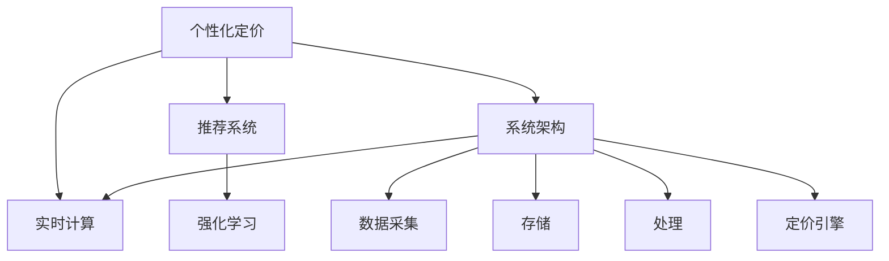

                 

# AI驱动的电商平台实时个性化定价系统

## 1. 背景介绍

### 1.1 问题由来

随着电子商务市场的快速发展，电商平台之间的竞争日益激烈，客户忠诚度和留存率成为商家们关注的焦点。传统的固定价格策略不再适应多变的市场需求，个性化定价系统正逐渐成为电商平台的标配。通过实时、动态的个性化定价，电商平台能够更准确地捕捉消费者行为和需求，提升销售转化率，优化用户体验，从而在激烈的市场竞争中占据有利位置。

个性化定价系统要求系统能够根据用户行为数据和市场情况实时调整商品价格，实现“一人一价”的定价策略。然而，构建这样一个系统面临诸多挑战：如何收集、处理和分析大量用户数据？如何高效计算个性化价格？如何保证系统响应速度和稳定性？

### 1.2 问题核心关键点

个性化定价系统的核心在于如何结合用户行为数据和市场环境，实时计算出每个用户的个性化价格。为此，需要构建一个高效、可靠的定价算法，并将其集成到电商平台的业务流程中。具体来说，个性化定价系统应具备以下几个特点：

1. **实时性**：能够实时响应用户行为和市场变化，快速更新商品价格。
2. **准确性**：能够根据用户行为和市场数据准确计算个性化价格，提高转化率。
3. **可扩展性**：能够处理大规模用户数据和商品信息，具备良好的扩展性。
4. **稳定性**：系统应具备高可用性和鲁棒性，保证在高峰期和异常情况下的正常运行。
5. **安全性**：保护用户隐私，防止数据泄露和系统攻击。

## 2. 核心概念与联系

### 2.1 核心概念概述

为更好地理解AI驱动的个性化定价系统，本文将介绍几个密切相关的核心概念：

1. **个性化定价**：根据用户的行为数据和市场环境，动态调整商品价格，实现“一人一价”的定价策略。
2. **实时计算**：通过高效算法和计算资源，实时响应市场变化和用户行为，保证定价系统的实时性。
3. **推荐系统**：利用机器学习模型，根据用户历史行为和偏好推荐商品，辅助定价决策。
4. **强化学习**：通过不断试错和优化，逐步学习最优的定价策略，提升系统性能。
5. **系统架构**：包括数据采集、存储、处理和定价引擎等多个模块，确保系统的可靠性和可扩展性。

这些核心概念之间的逻辑关系可以通过以下Mermaid流程图来展示：



这个流程图展示了个性化定价系统的核心概念及其之间的关系：

1. 个性化定价是系统的最终目标，通过实时计算和推荐系统辅助，逐步优化定价策略。
2. 实时计算是系统响应速度的保障，依赖推荐系统和强化学习的支持。
3. 推荐系统利用用户行为数据，辅助定价决策，提升定价的准确性。
4. 强化学习通过不断优化，逐步学习最优定价策略，提升系统性能。
5. 系统架构包括数据采集、存储、处理和定价引擎等多个模块，确保系统的可靠性。

## 3. 核心算法原理 & 具体操作步骤
### 3.1 算法原理概述

个性化定价系统通常采用机器学习或深度学习算法，结合用户行为数据和市场环境，实时计算每个用户的个性化价格。核心算法原理包括：

1. **特征工程**：从用户行为数据和市场环境数据中提取特征，构建输入向量。
2. **模型训练**：基于历史数据，训练定价模型，预测用户对不同价格的反应。
3. **实时预测**：根据用户当前行为和市场环境，实时预测用户愿意支付的价格。
4. **定价策略**：结合实时预测结果和市场约束，制定每个用户的个性化价格。

### 3.2 算法步骤详解

个性化定价系统的实现一般包括以下几个关键步骤：

**Step 1: 数据采集与预处理**
- 收集用户行为数据（如浏览历史、购买记录、点击率等）和市场环境数据（如竞争对手价格、促销活动等）。
- 对数据进行清洗和预处理，去除噪声和异常值，确保数据的准确性和完整性。

**Step 2: 特征工程**
- 从用户行为数据和市场环境数据中提取特征，构建输入向量。
- 利用One-Hot编码、归一化等技术，对特征进行预处理和标准化。

**Step 3: 模型训练**
- 选择合适的机器学习模型（如线性回归、决策树、神经网络等），基于历史数据进行模型训练。
- 使用交叉验证等技术评估模型性能，选择合适的超参数。

**Step 4: 实时预测**
- 根据用户当前行为和市场环境，实时计算输入向量。
- 使用训练好的模型进行预测，输出用户愿意支付的价格。

**Step 5: 定价策略**
- 结合实时预测结果和市场约束（如最低价格、最高价格等），制定每个用户的个性化价格。
- 对定价结果进行后处理，确保定价策略合理且可行。

**Step 6: 系统集成与部署**
- 将定价系统集成到电商平台业务流程中，实时更新商品价格。
- 部署系统，确保在高并发和高峰期能够正常运行。

### 3.3 算法优缺点

个性化定价系统具有以下优点：
1. 提升销售转化率。通过个性化定价，精准捕捉用户需求，提高销售转化率。
2. 优化用户体验。动态调整价格，满足用户期望，提升用户满意度。
3. 提高市场竞争力。实时响应市场变化，保持价格优势。
4. 数据驱动决策。基于用户行为数据和市场环境，制定最优定价策略。

同时，该系统也存在一定的局限性：
1. 依赖高质量数据。个性化定价的效果很大程度上取决于数据质量，获取高质量用户行为和市场环境数据成本较高。
2. 计算复杂度高。实时计算每个用户的个性化价格，计算复杂度较高。
3. 模型过拟合风险。模型基于历史数据训练，可能过拟合训练数据，导致预测结果不准确。
4. 模型更新频繁。用户行为和市场环境变化较快，模型需要频繁更新，维护成本较高。
5. 系统复杂度高。涉及数据采集、处理、特征工程、模型训练等多个环节，系统复杂度较高。

尽管存在这些局限性，但个性化定价系统仍是大数据驱动的电商系统的核心模块，具有重要的应用价值。未来相关研究的重点在于如何进一步降低系统计算复杂度，提高数据利用效率，同时兼顾系统的可扩展性和稳定性。

### 3.4 算法应用领域

个性化定价系统已经在电商、旅游、航空等多个领域得到了广泛应用，为提升用户转化率和市场竞争力做出了显著贡献。具体应用场景包括：

1. **电商零售**：根据用户浏览、购买、评价等行为数据，实时调整商品价格，提升用户购买率。
2. **旅游酒店**：根据用户搜索历史、预订记录、用户反馈等数据，实时调整房间价格，优化资源配置。
3. **航空交通**：根据用户历史预订记录、航班延误情况等数据，实时调整机票价格，提高用户体验。
4. **金融服务**：根据用户投资行为、市场趋势等数据，实时调整产品价格，提升客户满意度。
5. **医疗健康**：根据患者历史就诊记录、病情变化等数据，实时调整药品价格，优化医疗资源。

此外，个性化定价系统还被创新性地应用于更多场景中，如广告投放、保险定价、能源交易等，为各行各业带来了全新的价值创造方式。随着数据的不断丰富和技术的进步，个性化定价系统必将在更多领域得到应用，驱动经济社会发展。

## 4. 数学模型和公式 & 详细讲解 & 举例说明
### 4.1 数学模型构建

个性化定价系统的数学模型通常包含以下几个关键组成部分：

1. **用户行为特征**：包括用户的浏览历史、点击率、购买记录等。
2. **市场环境特征**：包括竞争对手价格、促销活动、节假日等。
3. **定价模型**：用于预测用户对不同价格的反应。

### 4.2 公式推导过程

以线性回归模型为例，假设用户对商品的价格 $P$ 的预测函数为：

$$
y = \theta_0 + \theta_1 \cdot X_1 + \theta_2 \cdot X_2 + \cdots + \theta_n \cdot X_n
$$

其中 $y$ 为用户对商品价格的预测值，$X_i$ 为第 $i$ 个特征向量，$\theta_i$ 为特征系数。模型训练的目标是最小化损失函数：

$$
L(\theta) = \frac{1}{2N} \sum_{i=1}^N (y_i - P_i)^2
$$

其中 $P_i$ 为用户 $i$ 对商品价格的实际购买金额。

在得到最优特征系数 $\theta$ 后，可以使用该模型进行实时定价预测。假设用户当前行为数据为 $x = (x_1, x_2, \cdots, x_n)$，则实时定价预测值为：

$$
y = \theta_0 + \theta_1 \cdot x_1 + \theta_2 \cdot x_2 + \cdots + \theta_n \cdot x_n
$$

### 4.3 案例分析与讲解

假设有一个电商平台，收集了用户的历史浏览记录和购买记录，并实时获取市场环境数据（如竞争对手价格、促销活动等）。电商平台使用线性回归模型进行定价预测，具体步骤如下：

1. **数据采集与预处理**：收集用户行为数据（如浏览历史、购买记录等）和市场环境数据（如竞争对手价格、促销活动等），并进行清洗和预处理。
2. **特征工程**：从用户行为数据和市场环境数据中提取特征，构建输入向量。
3. **模型训练**：使用历史数据训练线性回归模型，预测用户对不同价格的反应。
4. **实时预测**：根据用户当前行为数据和市场环境数据，实时计算预测值。
5. **定价策略**：结合实时预测结果和市场约束，制定每个用户的个性化价格。
6. **系统集成与部署**：将定价系统集成到电商平台业务流程中，实时更新商品价格。

## 5. 项目实践：代码实例和详细解释说明
### 5.1 开发环境搭建

在进行个性化定价系统开发前，我们需要准备好开发环境。以下是使用Python进行Scikit-learn开发的环境配置流程：

1. 安装Anaconda：从官网下载并安装Anaconda，用于创建独立的Python环境。

2. 创建并激活虚拟环境：
```bash
conda create -n pricing-env python=3.8 
conda activate pricing-env
```

3. 安装Scikit-learn：
```bash
pip install scikit-learn
```

4. 安装TensorFlow：
```bash
pip install tensorflow
```

5. 安装各类工具包：
```bash
pip install numpy pandas scikit-learn matplotlib tqdm jupyter notebook ipython
```

完成上述步骤后，即可在`pricing-env`环境中开始开发实践。

### 5.2 源代码详细实现

下面我们以线性回归模型为例，给出使用Scikit-learn进行个性化定价的Python代码实现。

首先，定义数据预处理和特征提取函数：

```python
import pandas as pd
from sklearn.preprocessing import StandardScaler
from sklearn.linear_model import LinearRegression

# 读取数据
data = pd.read_csv('user_data.csv')

# 数据预处理
features = data[['feature1', 'feature2', 'feature3']]
labels = data['label']

# 标准化特征
scaler = StandardScaler()
features = scaler.fit_transform(features)

# 划分训练集和测试集
train_features = features[:800]
train_labels = labels[:800]
test_features = features[800:]
test_labels = labels[800:]
```

然后，定义模型训练和预测函数：

```python
# 训练模型
model = LinearRegression()
model.fit(train_features, train_labels)

# 预测
predictions = model.predict(test_features)
```

最后，在测试集上评估模型性能：

```python
from sklearn.metrics import mean_squared_error

# 评估模型性能
mse = mean_squared_error(test_labels, predictions)
print(f'Mean Squared Error: {mse:.2f}')
```

以上代码展示了使用Scikit-learn进行个性化定价的完整流程，从数据预处理、模型训练到模型评估。可以看到，Scikit-learn提供了丰富的机器学习工具，可以快速搭建和训练个性化定价模型。

### 5.3 代码解读与分析

让我们再详细解读一下关键代码的实现细节：

**数据预处理和特征提取**：
- 使用Pandas读取数据文件，提取特征和标签。
- 对特征进行标准化处理，避免不同特征尺度不一致。
- 划分训练集和测试集，确保模型在未见过的数据上评估性能。

**模型训练**：
- 使用Scikit-learn提供的LinearRegression模型进行训练。
- 调用fit方法进行模型拟合，得到特征系数。

**模型预测**：
- 使用训练好的模型进行实时预测，计算预测值。

**模型评估**：
- 使用均方误差评估模型在测试集上的性能，衡量预测值与真实值之间的差距。

**系统集成与部署**：
- 将模型集成到电商平台的业务流程中，实时更新商品价格。
- 部署系统，确保在高并发和高峰期能够正常运行。

## 6. 实际应用场景
### 6.1 智能客服系统

个性化定价系统在智能客服系统中也有广泛应用。智能客服系统可以通过实时分析用户行为数据，动态调整客服响应策略，提高用户满意度。

具体而言，当用户通过智能客服系统查询商品价格时，系统可以实时计算出每个用户的个性化价格，并提供给客服人员。客服人员根据系统给出的价格信息，进行灵活调整，提供个性化的服务，提升用户购买率。同时，系统还可以根据用户的历史行为数据，预测其购买意愿，辅助客服人员进行销售推荐。

### 6.2 金融交易平台

金融交易平台需要对用户的投资行为进行实时分析，制定最优的定价策略，以提高交易量和用户满意度。个性化定价系统可以在金融交易平台中发挥重要作用。

具体而言，系统可以实时监控用户的投资行为（如下单、撤单、交易量等），根据市场环境（如行情、市场情绪等）进行动态定价，提供最优的交易机会。同时，系统还可以利用机器学习模型，预测用户对不同价格的反应，优化交易策略，提高交易效率和收益。

### 6.3 在线教育平台

在线教育平台需要对学生的学习行为进行实时分析，制定个性化的学习路径和定价策略，提高学生的学习效果。个性化定价系统可以在在线教育平台中发挥重要作用。

具体而言，系统可以实时监控学生的学习行为（如学习时间、完成作业情况等），根据学生的学习效果进行动态定价，提供个性化的学习资源和优惠策略，提升学生的学习效果和满意度。同时，系统还可以利用机器学习模型，预测学生的学习进度和需求，优化课程推荐和定价策略，提高平台的转化率和用户黏性。

### 6.4 未来应用展望

随着个性化定价技术的不断进步，未来将在更多领域得到应用，为各行各业带来变革性影响。

在智慧医疗领域，个性化定价系统可以根据患者的健康数据，制定个性化的医疗服务定价策略，提高医疗服务的质量和效率。在智能制造领域，系统可以根据设备的运行数据，制定个性化的维护和保养定价策略，降低维护成本，提高设备利用率。在智慧农业领域，系统可以根据农作物的生长数据，制定个性化的施肥和灌溉定价策略，提高农作物的产量和质量。

此外，在企业生产、社会治理、文娱传媒等众多领域，个性化定价系统也将不断涌现，为各行各业带来全新的价值创造方式。相信随着技术的日益成熟，个性化定价系统必将在构建人机协同的智能时代中扮演越来越重要的角色。

## 7. 工具和资源推荐
### 7.1 学习资源推荐

为了帮助开发者系统掌握个性化定价技术的理论基础和实践技巧，这里推荐一些优质的学习资源：

1. 《Python机器学习》系列书籍：由著名数据科学家Sebastian Raschka和Vahid Mirjalili合著，全面介绍了机器学习的基础理论和实践技巧。
2. 《TensorFlow实战》系列书籍：由Google TensorFlow团队成员撰写，详细介绍了TensorFlow的使用方法和最佳实践。
3. 《深度学习》课程（如Coursera上的吴恩达课程）：斯坦福大学开设的深度学习入门课程，深入浅出地讲解了深度学习的基本概念和经典模型。
4. Kaggle：全球最大的数据科学竞赛平台，提供大量实践数据集和挑战，帮助开发者锻炼实战能力。
5. Scikit-learn官方文档：Scikit-learn官方提供的详细文档，涵盖了各种机器学习算法的使用方法和示例代码。

通过对这些资源的学习实践，相信你一定能够快速掌握个性化定价技术的精髓，并用于解决实际的业务问题。
###  7.2 开发工具推荐

高效的开发离不开优秀的工具支持。以下是几款用于个性化定价系统开发的常用工具：

1. Jupyter Notebook：开源的交互式笔记本环境，支持代码编辑、运行和数据可视化，是进行机器学习实验的得力助手。
2. PyCharm：功能强大的Python IDE，支持版本控制、代码调试、性能分析等功能，是Python开发的首选工具。
3. TensorFlow：由Google主导开发的深度学习框架，提供了丰富的工具和库，支持深度学习模型的构建和训练。
4. Scikit-learn：基于NumPy的Python机器学习库，提供了丰富的机器学习算法和工具，支持模型训练、特征工程等任务。
5. H2O.ai：提供了一个易于使用的机器学习平台，支持多种机器学习算法和数据处理功能，支持分布式计算。

合理利用这些工具，可以显著提升个性化定价系统的开发效率，加快创新迭代的步伐。

### 7.3 相关论文推荐

个性化定价技术的发展源于学界的持续研究。以下是几篇奠基性的相关论文，推荐阅读：

1. "Adaptive Linear Models" by Friedman：提出了Adaboost算法，通过不断调整模型参数，提升模型的预测能力。
2. "The Elements of Statistical Learning" by Hastie, Tibshirani and Friedman：全面介绍了统计学习的基本理论和算法，包括线性回归、决策树等。
3. "Convex Optimization" by Boyd and Vandenberghe：介绍了凸优化理论的基本概念和算法，是优化问题的研究基础。
4. "Machine Learning Yearning" by Andrew Ng：由深度学习领域的领军人物Andrew Ng撰写，全面介绍了机器学习项目的规划、执行和评估方法。
5. "Optimization by Vector Space Methods" by Johnson：介绍了向量空间方法在优化问题中的应用，是优化算法研究的重要参考资料。

这些论文代表了个性化定价技术的发展脉络。通过学习这些前沿成果，可以帮助研究者把握学科前进方向，激发更多的创新灵感。

## 8. 总结：未来发展趋势与挑战
### 8.1 总结

本文对AI驱动的个性化定价系统进行了全面系统的介绍。首先阐述了个性化定价系统的研究背景和意义，明确了系统在电商、金融、教育等多个领域的重要价值。其次，从原理到实践，详细讲解了个性化定价的数学模型和算法步骤，给出了模型训练和实时预测的完整代码实例。同时，本文还广泛探讨了个性化定价系统在实际应用中的多种场景，展示了系统的广泛应用前景。

通过本文的系统梳理，可以看到，个性化定价系统在大数据驱动的电商系统中具备重要的应用价值，能够根据用户行为数据和市场环境，实时计算个性化价格，提升销售转化率和用户体验。未来，随着技术的不断进步，个性化定价系统必将在更多领域得到应用，为各行各业带来变革性影响。

### 8.2 未来发展趋势

展望未来，个性化定价系统将呈现以下几个发展趋势：

1. **数据驱动决策**：随着大数据技术的不断发展，个性化定价系统将更多依赖数据驱动的决策，结合用户行为数据、市场环境数据等多个维度，制定最优的定价策略。
2. **实时计算与存储**：随着计算资源的不断提升，个性化定价系统将实现实时计算与存储，确保系统的响应速度和处理能力。
3. **多模态融合**：个性化定价系统将结合多种数据源和多种模态信息，如文本、图像、视频等，提高系统的全面性和鲁棒性。
4. **智能推荐与决策**：个性化定价系统将更多结合推荐系统和强化学习等智能算法，提升系统的推荐能力和决策效果。
5. **优化与迭代**：个性化定价系统将不断优化和迭代，结合用户反馈和市场变化，逐步提高系统的性能和效果。

以上趋势凸显了个性化定价系统的广阔前景。这些方向的探索发展，必将进一步提升系统的性能和应用范围，为各行各业带来全新的价值创造方式。

### 8.3 面临的挑战

尽管个性化定价系统已经取得了瞩目成就，但在迈向更加智能化、普适化应用的过程中，它仍面临着诸多挑战：

1. **数据质量问题**：个性化定价的效果很大程度上取决于数据质量，获取高质量用户行为和市场环境数据成本较高。如何进一步降低系统对数据的依赖，将是一大难题。
2. **系统复杂性**：个性化定价系统涉及多个数据源和多种模态信息，系统复杂性较高。如何降低系统复杂度，提高系统的稳定性和可扩展性，还需要更多研究和实践的积累。
3. **实时计算与响应**：个性化定价系统需要实时计算每个用户的个性化价格，计算复杂度较高。如何提高系统的实时计算能力和响应速度，还需要更多的优化和改进。
4. **模型鲁棒性**：模型基于历史数据训练，可能过拟合训练数据，导致预测结果不准确。如何提高模型的鲁棒性，避免灾难性遗忘，还需要更多的研究和实践。
5. **用户隐私保护**：个性化定价系统需要收集和处理大量用户数据，如何保护用户隐私，防止数据泄露和系统攻击，是系统安全和隐私保护的重要问题。

### 8.4 研究展望

面对个性化定价系统面临的挑战，未来的研究需要在以下几个方面寻求新的突破：

1. **数据增强与补全**：结合数据增强和补全技术，提高数据的质量和多样性，增强系统的鲁棒性和泛化能力。
2. **模型融合与优化**：结合多种机器学习模型，进行模型融合和优化，提升系统的性能和鲁棒性。
3. **实时计算与优化**：结合分布式计算和高效算法，提高系统的实时计算能力和响应速度。
4. **智能推荐与决策**：结合推荐系统和强化学习等智能算法，提升系统的推荐能力和决策效果。
5. **隐私保护与安全**：结合数据匿名化和加密技术，保护用户隐私，防止数据泄露和系统攻击。

这些研究方向的探索，必将引领个性化定价系统走向更高的台阶，为各行各业带来更加全面、精准、智能的定价解决方案。面向未来，个性化定价系统需要不断优化和迭代，结合新的技术手段，提升系统的性能和效果，驱动经济社会的发展和进步。总之，个性化的定价系统需要从数据、算法、工程、业务等多个维度协同发力，才能真正实现人工智能技术在垂直行业的规模化落地。相信随着技术的日益成熟，个性化定价系统必将在构建人机协同的智能时代中扮演越来越重要的角色。

## 9. 附录：常见问题与解答

**Q1：个性化定价系统如何处理冷启动问题？**

A: 个性化定价系统在初期面临冷启动问题，即无法利用用户历史行为数据进行定价。此时可以结合推荐系统，根据用户画像和市场环境数据，进行初步定价。随着用户行为数据的不断积累，系统将逐步优化定价策略，提升系统的性能和效果。

**Q2：个性化定价系统如何避免过拟合？**

A: 个性化定价系统容易过拟合历史数据，导致预测结果不准确。可以通过以下方法避免过拟合：
1. 数据增强：通过回译、近义替换等方式扩充训练集。
2. 正则化：使用L2正则、Dropout等技术，避免模型过拟合。
3. 交叉验证：使用交叉验证方法评估模型性能，选择最优模型。
4. 模型融合：结合多种模型进行融合，提升系统的鲁棒性。

**Q3：个性化定价系统在高峰期如何保证系统性能？**

A: 个性化定价系统在高峰期面临高并发和大量计算需求，容易出现系统性能下降和故障。可以采用以下方法保证系统性能：
1. 负载均衡：采用负载均衡技术，合理分配计算资源，确保系统的高可用性。
2. 缓存优化：使用缓存技术，减少数据库查询次数，提升系统的响应速度。
3. 分布式计算：采用分布式计算技术，提高系统的计算能力和扩展性。
4. 自动扩缩容：根据系统负载动态调整计算资源，确保系统的稳定性和性能。

**Q4：个性化定价系统如何保护用户隐私？**

A: 个性化定价系统需要收集和处理大量用户数据，如何保护用户隐私，防止数据泄露和系统攻击，是系统安全和隐私保护的重要问题。可以采用以下方法保护用户隐私：
1. 数据匿名化：对用户数据进行匿名化处理，保护用户隐私。
2. 加密技术：使用加密技术，保护用户数据在传输和存储过程中的安全性。
3. 访问控制：采用访问控制技术，限制用户数据访问权限，防止数据泄露。
4. 安全审计：定期进行安全审计，及时发现和修复系统漏洞，提升系统的安全性。

**Q5：个性化定价系统如何优化模型性能？**

A: 个性化定价系统需要不断优化模型性能，提升系统的预测准确度和鲁棒性。可以采用以下方法优化模型性能：
1. 特征工程：优化特征选择和提取方法，提升模型的预测能力。
2. 模型融合：结合多种模型进行融合，提升系统的鲁棒性。
3. 正则化：使用L2正则、Dropout等技术，避免模型过拟合。
4. 交叉验证：使用交叉验证方法评估模型性能，选择最优模型。
5. 超参数优化：采用网格搜索、贝叶斯优化等方法，优化模型超参数，提升模型性能。

这些方法可以结合具体应用场景，灵活应用，逐步优化个性化定价系统的性能，提高系统的可靠性和有效性。总之，个性化定价系统需要从数据、算法、工程、业务等多个维度协同发力，才能真正实现人工智能技术在垂直行业的规模化落地。相信随着技术的日益成熟，个性化定价系统必将在构建人机协同的智能时代中扮演越来越重要的角色。

