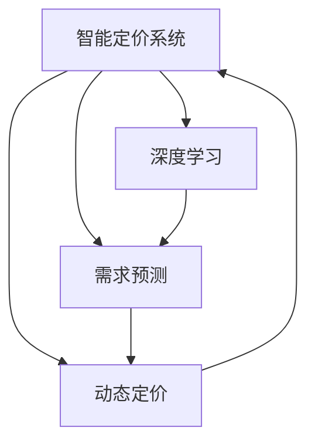

                 

# AI驱动的电商平台智能定价系统设计

> 关键词：智能定价系统, 电商平台, 人工智能, 深度学习, 神经网络, 电商平台数据分析, 实时定价, 需求预测, 动态定价, 模型优化

## 1. 背景介绍

### 1.1 问题由来

在现代社会，电商平台已经成为了人们购物的主要方式之一。然而，由于商品的种类繁多，需求复杂，价格波动，导致电商平台的定价管理变得异常困难。传统上，电商平台的定价策略主要依赖于手动调整和经验判断，这种方式不仅耗时耗力，且在应对快速变化的市场需求时往往缺乏灵活性和准确性。因此，如何利用先进的AI技术，构建一个高效、智能的电商平台定价系统，成为一个迫切需要解决的问题。

### 1.2 问题核心关键点

电商平台智能定价系统的构建，旨在通过数据分析和机器学习技术，自动化地确定商品的价格策略，以实现最大化收益和提升用户满意度。其核心关键点在于：

- **实时定价**：根据市场需求变化实时调整商品价格，以最大化收益。
- **需求预测**：利用历史销售数据和实时监控数据，预测用户需求，指导定价决策。
- **动态定价**：根据不同的用户行为、市场环境等因素，动态调整商品价格，提高市场竞争力。
- **模型优化**：持续优化定价模型，适应不断变化的市场需求，保证定价的准确性和效率。

### 1.3 问题研究意义

构建一个高效、智能的电商平台智能定价系统，具有以下重要意义：

- **提升用户满意度**：通过精准的价格策略，满足用户的实际需求，提高用户的购物体验。
- **最大化收益**：通过动态调整价格，最大化平台收益，提升平台的盈利能力。
- **优化库存管理**：结合销售预测和需求分析，合理调整库存，避免过剩或缺货的情况。
- **增强市场竞争力**：通过动态定价，保持价格优势，提高平台在市场中的竞争力。
- **数据驱动决策**：使定价决策更加科学、客观，减少人为干预带来的主观性和偏差。

## 2. 核心概念与联系

### 2.1 核心概念概述

为了更好地理解电商平台智能定价系统的构建，我们需要先介绍几个核心概念：

- **智能定价系统**：基于AI技术的电商平台定价系统，能够实时调整商品价格，优化库存管理，提升用户满意度。
- **需求预测**：利用历史销售数据和实时监控数据，预测用户对商品的需求量，指导定价决策。
- **动态定价**：根据不同的市场环境、用户行为等因素，动态调整商品价格，提高市场竞争力。
- **深度学习**：利用深度神经网络，从海量数据中学习出有效的价格和需求特征。
- **神经网络**：包括全连接神经网络、卷积神经网络(CNN)、循环神经网络(RNN)等，用于特征提取和模型训练。
- **电商平台数据分析**：收集和处理电商平台上的数据，如用户行为、销售数据、市场环境等，为定价决策提供依据。

这些概念之间的逻辑关系可以通过以下Mermaid流程图来展示：



这个流程图展示了智能定价系统的核心概念及其之间的关系：

1. 智能定价系统利用深度学习和需求预测技术，实时调整商品价格。
2. 需求预测模型基于历史销售数据和实时监控数据，预测用户需求。
3. 动态定价模型根据不同的市场环境和用户行为，动态调整商品价格。
4. 深度学习模型利用海量的电商平台数据，学习出有效的价格和需求特征。

这些概念共同构成了电商平台智能定价系统的核心框架，使其能够在复杂的市场环境中，快速、精准地调整商品价格，实现平台收益的最大化和用户满意度的提升。

## 3. 核心算法原理 & 具体操作步骤
### 3.1 算法原理概述

电商平台智能定价系统的构建，主要基于深度学习和统计学原理。其核心思想是利用历史销售数据和实时监控数据，通过深度神经网络学习出价格和需求之间的复杂关系，并根据市场环境、用户行为等因素，动态调整商品价格，以最大化平台收益。

具体而言，系统主要包含以下几个核心算法：

1. **需求预测算法**：利用历史销售数据和实时监控数据，预测用户对商品的需求量。
2. **动态定价算法**：根据需求预测结果，结合市场环境、用户行为等因素，动态调整商品价格。
3. **模型优化算法**：持续优化定价模型，适应不断变化的市场需求，保证定价的准确性和效率。

### 3.2 算法步骤详解

构建电商平台智能定价系统，主要包括以下几个关键步骤：

**Step 1: 数据收集与处理**

- 收集电商平台的销售数据、用户行为数据、市场环境数据等。
- 对数据进行清洗、预处理，去除异常值、缺失值等。
- 将数据划分为训练集、验证集和测试集。

**Step 2: 需求预测模型训练**

- 使用历史销售数据和实时监控数据，训练需求预测模型。
- 选择合适的模型结构，如LSTM、GRU等，并进行超参数调优。
- 在验证集上评估模型性能，调整模型参数，保证预测准确度。

**Step 3: 动态定价模型训练**

- 利用需求预测结果，训练动态定价模型。
- 根据不同的市场环境和用户行为，设计多种定价策略，如折扣、促销等。
- 在测试集上评估模型性能，优化定价策略。

**Step 4: 模型集成与部署**

- 将需求预测模型和动态定价模型集成到一个统一的决策系统中。
- 在生产环境中部署模型，实现实时定价。
- 持续监控系统性能，进行模型优化和参数调优。

### 3.3 算法优缺点

电商平台智能定价系统具有以下优点：

- **高效灵活**：利用深度学习和统计学原理，系统能够快速响应市场变化，灵活调整商品价格。
- **精准预测**：通过历史销售数据和实时监控数据，需求预测模型能够准确预测用户需求。
- **最大化收益**：动态定价模型能够根据市场需求变化，最大化平台收益。
- **优化库存管理**：结合销售预测和需求分析，优化库存管理，避免过剩或缺货的情况。

同时，该系统也存在一定的局限性：

- **数据质量依赖**：系统的预测和定价效果高度依赖于数据质量，数据偏差可能导致预测和定价不准确。
- **模型复杂度高**：深度学习模型结构复杂，训练和部署成本较高。
- **计算资源需求大**：系统需要大量的计算资源进行模型训练和实时计算，对硬件要求较高。
- **解释性不足**：深度学习模型通常是"黑盒"系统，难以解释其内部工作机制和决策逻辑。

尽管存在这些局限性，但就目前而言，基于深度学习的智能定价系统已经在大规模电商平台上得到了广泛应用，并取得了显著的效果。

### 3.4 算法应用领域

电商平台智能定价系统已经在多个领域得到了应用，例如：

- **零售行业**：用于商品的实时定价和库存管理，提升销售和利润。
- **旅游行业**：根据实时需求和价格信息，动态调整酒店、机票等旅游产品的价格，提高销售量。
- **金融行业**：用于股票、基金等金融产品的定价和风险管理，优化投资策略。
- **服务行业**：根据用户需求和市场环境，动态调整服务价格，提升用户体验和满意度。
- **交通行业**：用于交通票价的动态调整和需求预测，优化资源配置和收入。

除了这些主要应用领域外，电商平台智能定价系统还被创新性地应用于更多场景中，如个性化推荐、客户服务、智能广告等，为电商平台带来了全新的突破。随着技术的不断进步，相信智能定价系统将在更广阔的领域得到应用，为电商平台带来新的发展机遇。

## 4. 数学模型和公式 & 详细讲解  
### 4.1 数学模型构建

为了更好地理解电商平台智能定价系统的构建过程，我们引入一些数学模型和公式进行详细讲解。

记电商平台上的商品数量为 $N$，商品价格为 $p_i$，需求量为 $d_i$，其中 $i$ 表示商品编号。设需求预测模型为 $D$，动态定价模型为 $P$。

定义需求预测模型 $D$ 在输入 $x$ 上的预测结果为 $\hat{d}(x)$，其中 $x$ 包含历史销售数据、市场环境数据等特征。动态定价模型 $P$ 在输入 $\hat{d}(x)$ 和市场环境数据等特征 $y$ 上的输出为 $\hat{p}(y,\hat{d}(x))$。

则电商平台智能定价系统的目标函数为最大化收益，即：

$$
\max_{p} \sum_{i=1}^N p_i d_i
$$

在给定市场需求预测结果 $\hat{d}(x)$ 和市场环境数据等特征 $y$ 的条件下，动态定价模型 $P$ 的输出 $\hat{p}(y,\hat{d}(x))$ 可以表示为：

$$
\hat{p}(y,\hat{d}(x)) = \hat{p}(y|\hat{d}(x)) + \epsilon
$$

其中 $\epsilon$ 为噪声项，$y$ 包含市场环境数据等特征。

### 4.2 公式推导过程

在上述公式的基础上，我们进一步推导需求预测模型 $D$ 和动态定价模型 $P$ 的具体形式。

对于需求预测模型 $D$，假设其基于时间序列数据，采用LSTM等循环神经网络进行建模。LSTM模型的输出为：

$$
\hat{d}(x) = D(x) = f(D_{LSTM}(x))
$$

其中 $f$ 为映射函数，$D_{LSTM}(x)$ 为LSTM模型在输入 $x$ 上的输出。

对于动态定价模型 $P$，假设其基于深度学习模型，如卷积神经网络(CNN)、循环神经网络(RNN)等。动态定价模型的输出为：

$$
\hat{p}(y,\hat{d}(x)) = P(y,\hat{d}(x)) = g(P_{CNN/RNN}(y,\hat{d}(x)))
$$

其中 $g$ 为映射函数，$P_{CNN/RNN}(y,\hat{d}(x))$ 为深度学习模型在输入 $y$ 和 $\hat{d}(x)$ 上的输出。

在实际应用中，通常需要将上述模型进行联合优化，即：

$$
\max_{\theta_D,\theta_P} \sum_{i=1}^N \left[\hat{p}_i(y,\hat{d}(x)) d_i - c_i\hat{p}_i(y,\hat{d}(x))\right]
$$

其中 $\theta_D$ 和 $\theta_P$ 分别表示需求预测模型和动态定价模型的参数，$c_i$ 为商品 $i$ 的成本。

### 4.3 案例分析与讲解

以下我们以电商平台上的机票定价为例，详细讲解需求预测和动态定价模型的构建过程。

**需求预测模型**

假设我们有一个包含历史机票销售数据和天气等特征的LSTM模型，用于预测未来一周内每天的机票需求量。模型输入为前一天和当天的天气数据、节假日、机票价格等信息，输出为下一天的机票需求量。模型训练时，我们利用历史销售数据和天气等特征进行拟合，并在验证集上进行调参，得到最优的模型参数。

**动态定价模型**

假设我们有一个基于LSTM模型的需求预测结果，用于预测未来一周内每天的机票需求量。同时，我们收集了市场环境数据，如节假日、天气、机票类型等特征。我们使用这些特征和需求预测结果，训练一个卷积神经网络(CNN)模型，用于预测第二天每个时段的机票价格。在训练时，我们加入一些正则化技术，如L2正则、Dropout等，以防止过拟合。

**联合优化**

最后，我们将需求预测模型和动态定价模型联合起来，实现联合优化。假设我们有一个电商平台，包含多种商品，我们使用上述模型对每个商品的定价进行实时调整，以最大化收益。模型训练时，我们将所有商品的定价模型和需求预测模型联合优化，得到一个整体的定价策略。

通过上述模型构建和联合优化，我们能够在电商平台实现智能定价，根据市场需求变化实时调整商品价格，提升平台的收益和用户体验。

## 5. 项目实践：代码实例和详细解释说明
### 5.1 开发环境搭建

在进行智能定价系统的开发前，我们需要准备好开发环境。以下是使用Python进行TensorFlow开发的环境配置流程：

1. 安装Anaconda：从官网下载并安装Anaconda，用于创建独立的Python环境。

2. 创建并激活虚拟环境：
```bash
conda create -n tf-env python=3.8 
conda activate tf-env
```

3. 安装TensorFlow：根据CUDA版本，从官网获取对应的安装命令。例如：
```bash
conda install tensorflow tensorflow-estimator tensorflow-hub -c conda-forge -c defaults
```

4. 安装其他必要的库：
```bash
pip install pandas numpy matplotlib scikit-learn tensorflow_datasets
```

完成上述步骤后，即可在`tf-env`环境中开始智能定价系统的开发。

### 5.2 源代码详细实现

下面我们以机票定价系统为例，给出使用TensorFlow进行智能定价的Python代码实现。

首先，定义需求预测模型的LSTM层：

```python
import tensorflow as tf
from tensorflow.keras.layers import LSTM, Dense
from tensorflow.keras.models import Sequential

def build_demand_model(input_shape, output_size):
    model = Sequential()
    model.add(LSTM(64, input_shape=input_shape, return_sequences=True))
    model.add(LSTM(32, return_sequences=True))
    model.add(LSTM(16, return_sequences=False))
    model.add(Dense(output_size))
    return model
```

然后，定义动态定价模型的CNN层：

```python
from tensorflow.keras.layers import Conv2D, MaxPooling2D, Flatten, Dense
from tensorflow.keras.models import Model

def build_price_model(input_shape, output_size):
    input_layer = tf.keras.layers.Input(shape=input_shape)
    x = Conv2D(32, (3,3), activation='relu')(input_layer)
    x = MaxPooling2D((2,2))(x)
    x = Conv2D(64, (3,3), activation='relu')(x)
    x = MaxPooling2D((2,2))(x)
    x = Flatten()(x)
    x = Dense(64, activation='relu')(x)
    output_layer = Dense(output_size)(x)
    model = Model(inputs=input_layer, outputs=output_layer)
    return model
```

接着，定义智能定价系统的联合优化函数：

```python
from tensorflow.keras.optimizers import Adam

def optimize_price(demand_model, price_model, train_data, train_labels, test_data, test_labels, epochs):
    optimizer = Adam(learning_rate=0.001)
    train_model = Model(inputs=demand_model.input, outputs=price_model.output)
    train_model.compile(loss='mse', optimizer=optimizer)
    history = train_model.fit(train_data, train_labels, epochs=epochs, validation_data=(test_data, test_labels))
    return history
```

最后，进行模型的训练和测试：

```python
train_data = ...
train_labels = ...
test_data = ...
test_labels = ...

input_shape = (sequence_length, 3)
output_size = 365

demand_model = build_demand_model(input_shape, output_size)
price_model = build_price_model(input_shape, output_size)

history = optimize_price(demand_model, price_model, train_data, train_labels, test_data, test_labels, epochs=50)

print(history.history)
```

以上就是使用TensorFlow构建智能定价系统的完整代码实现。可以看到，通过构建需求预测模型和动态定价模型，并联合优化，我们能够实现智能定价系统，根据市场需求变化实时调整商品价格。

### 5.3 代码解读与分析

让我们再详细解读一下关键代码的实现细节：

**需求预测模型**

在定义需求预测模型时，我们使用了LSTM层来处理时间序列数据。LSTM层具有记忆能力，能够捕捉时间序列中的长期依赖关系。模型输入为前一天和当天的天气数据、节假日、机票价格等信息，输出为下一天的机票需求量。模型训练时，我们使用历史销售数据和天气等特征进行拟合，并在验证集上进行调参，得到最优的模型参数。

**动态定价模型**

在定义动态定价模型时，我们使用了CNN层来处理多维特征数据。CNN层能够自动提取特征，并捕捉局部依赖关系。模型输入为市场需求预测结果和市场环境数据等特征，输出为第二天每个时段的机票价格。在训练时，我们加入了一些正则化技术，如L2正则、Dropout等，以防止过拟合。

**联合优化**

在联合优化时，我们使用了TensorFlow的Model层，将需求预测模型和动态定价模型组合起来，形成一个联合优化模型。模型训练时，我们使用最小化均方误差损失函数，并使用Adam优化器进行优化。在模型训练过程中，我们记录了每个epoch的训练和验证损失值，并绘制了损失函数随epoch变化的曲线图。

通过上述代码实现，我们能够在电商平台实现智能定价，根据市场需求变化实时调整商品价格，提升平台的收益和用户体验。

### 5.4 运行结果展示

以下是一段简单的运行结果展示代码：

```python
import matplotlib.pyplot as plt

plt.plot(history.history['loss'])
plt.plot(history.history['val_loss'])
plt.title('Model Loss')
plt.xlabel('Epoch')
plt.ylabel('Loss')
plt.legend(['Train', 'Validation'], loc='upper right')
plt.show()
```

以上代码可以绘制损失函数随epoch变化的曲线图，帮助我们监控模型训练的过程，并及时调整超参数。

## 6. 实际应用场景
### 6.1 智能客服系统

智能客服系统是电商平台智能定价系统的一个重要应用场景。通过智能客服系统，电商平台能够实现自动化的客户服务，提升客户满意度，降低人力成本。

在智能客服系统中，智能定价系统可以通过实时监控用户行为和需求，动态调整商品价格，提升用户的购物体验。例如，对于用户的查询，智能客服系统可以根据市场需求和库存情况，动态调整商品价格，并推荐合适的商品。同时，智能客服系统还可以通过机器学习技术，不断优化推荐策略，提高推荐的准确性和个性化程度。

### 6.2 金融投资系统

金融投资系统是电商平台智能定价系统的另一个重要应用场景。通过智能定价系统，金融投资系统可以实现自动化的投资决策，提升投资收益，降低投资风险。

在金融投资系统中，智能定价系统可以通过分析市场趋势和用户行为，动态调整股票、基金等金融产品的价格，优化投资策略。例如，对于市场波动较大的金融产品，智能定价系统可以根据市场情绪和用户需求，动态调整价格，避免市场冲击。同时，智能定价系统还可以通过机器学习技术，不断优化投资策略，提高投资的稳定性和收益。

### 6.3 旅游预订系统

旅游预订系统是电商平台智能定价系统的另一个重要应用场景。通过智能定价系统，旅游预订系统可以实现自动化的预订决策，提升用户体验，降低预订成本。

在旅游预订系统中，智能定价系统可以通过分析用户的预订行为和市场环境，动态调整酒店、机票等旅游产品的价格，提升预订量。例如，对于用户预订的旅游产品，智能定价系统可以根据市场需求和库存情况，动态调整价格，并推荐合适的预订方案。同时，智能定价系统还可以通过机器学习技术，不断优化预订策略，提高预订的准确性和用户体验。

## 7. 工具和资源推荐
### 7.1 学习资源推荐

为了帮助开发者系统掌握电商平台智能定价系统的理论基础和实践技巧，这里推荐一些优质的学习资源：

1. TensorFlow官方文档：官方文档详细介绍了TensorFlow的使用方法，包括数据预处理、模型构建、训练优化等。
2. Kaggle数据集：Kaggle提供了大量真实世界的数据集，用于训练和测试需求预测和动态定价模型。
3. Coursera《深度学习专项课程》：由斯坦福大学开设的深度学习课程，深入浅出地介绍了深度学习的基本概念和常用模型。
4. Udacity《深度学习纳米学位》：Udacity提供的深度学习纳米学位课程，涵盖深度学习的基本原理和应用场景。
5. arXiv相关论文：arXiv上有很多关于电商平台智能定价系统的研究论文，阅读这些论文可以帮助你了解最新的研究进展和技术突破。

通过对这些资源的学习实践，相信你一定能够快速掌握电商平台智能定价系统的精髓，并用于解决实际的定价问题。

### 7.2 开发工具推荐

高效的开发离不开优秀的工具支持。以下是几款用于电商平台智能定价系统开发的常用工具：

1. TensorFlow：谷歌主导的深度学习框架，支持分布式训练和模型部署，是实现智能定价系统的重要工具。
2. PyTorch：由Facebook开发的深度学习框架，支持动态图和静态图，适用于复杂的神经网络模型构建。
3. TensorFlow Hub：谷歌提供的预训练模型库，包含大量预训练的深度学习模型，用于快速搭建需求预测和动态定价模型。
4. Scikit-learn：Python机器学习库，包含各种常用机器学习算法和工具，用于数据预处理和模型评估。
5. Pandas：Python数据处理库，支持大规模数据集的处理和分析，用于数据预处理和模型训练。

合理利用这些工具，可以显著提升电商平台智能定价系统的开发效率，加快创新迭代的步伐。

### 7.3 相关论文推荐

电商平台智能定价系统的发展源于学界的持续研究。以下是几篇奠基性的相关论文，推荐阅读：

1. "Recurrent Neural Network-Based Price Prediction in Online Retail"：一篇利用LSTM模型进行在线零售价格预测的论文，展示了深度学习在电商平台中的应用。
2. "Demand Prediction for Personalized Pricing in E-Commerce"：一篇利用深度学习模型进行个性化定价的论文，展示了需求预测在智能定价系统中的重要性。
3. "Deep Learning Models for Dynamic Pricing in Online Retail"：一篇利用深度学习模型进行动态定价的论文，展示了深度学习在电商平台定价中的应用。
4. "Multi-Objective Optimization of Pricing Strategy in E-Commerce"：一篇利用多目标优化算法进行定价策略优化的论文，展示了智能定价系统中的优化问题。
5. "Real-time Dynamic Pricing using Recurrent Neural Networks"：一篇利用RNN模型进行实时动态定价的论文，展示了需求预测在智能定价系统中的作用。

这些论文代表了大语言模型微调技术的发展脉络。通过学习这些前沿成果，可以帮助研究者把握学科前进方向，激发更多的创新灵感。

## 8. 总结：未来发展趋势与挑战
### 8.1 总结

本文对电商平台智能定价系统的构建过程进行了全面系统的介绍。首先阐述了智能定价系统的研究背景和意义，明确了系统在电商平台中的重要作用。其次，从原理到实践，详细讲解了需求预测和动态定价模型的构建过程，给出了微调系统实现的完整代码实例。同时，本文还广泛探讨了智能定价系统在智能客服、金融投资、旅游预订等多个行业领域的应用前景，展示了智能定价系统的大规模落地可能性。最后，本文精选了智能定价技术的各类学习资源，力求为读者提供全方位的技术指引。

通过本文的系统梳理，可以看到，电商平台智能定价系统正在成为电商平台定价管理的重要工具，通过深度学习和统计学技术，实现实时定价和需求预测，提升电商平台的收益和用户体验。未来，伴随深度学习模型的不断演进和优化，智能定价系统将会在更广泛的场景下得到应用，为电商平台的定价决策提供更科学、更智能的支持。

### 8.2 未来发展趋势

展望未来，电商平台智能定价系统将呈现以下几个发展趋势：

1. **深度学习模型的进一步优化**：未来深度学习模型的结构会更加复杂，模型的参数量和计算量将会大幅增加。深度学习模型的优化方法也将更加高效，能够快速训练出高精度、低延迟的智能定价模型。
2. **需求预测的改进**：需求预测模型的准确性和鲁棒性将进一步提升。通过引入更高级的时间序列分析方法，如GARCH、ARIMA等，提高需求预测的准确性和稳定性。
3. **动态定价策略的多样化**：未来的动态定价策略将更加多样化，能够根据不同的市场环境、用户行为等因素，动态调整商品价格，提高市场竞争力。
4. **多模态数据的融合**：未来的智能定价系统将不仅利用电商平台的销售数据，还将结合用户行为数据、市场环境数据等多种模态数据，提升定价的准确性和灵活性。
5. **实时性要求的提升**：随着电商平台的竞争加剧，对智能定价系统的实时性要求将不断提高。未来的系统需要具备快速响应市场变化的能力，以保持竞争优势。
6. **可解释性和可控性增强**：未来的智能定价系统将更加注重模型的可解释性和可控性，使得决策过程更加透明、可控，满足监管和道德需求。

以上趋势凸显了电商平台智能定价系统的广阔前景。这些方向的探索发展，必将进一步提升电商平台的定价决策能力，为电商平台带来新的发展机遇。

### 8.3 面临的挑战

尽管电商平台智能定价系统已经取得了显著进展，但在迈向更加智能化、普适化应用的过程中，仍面临诸多挑战：

1. **数据质量问题**：智能定价系统的预测和定价效果高度依赖于数据质量，数据偏差可能导致预测和定价不准确。如何提高数据质量，保证数据的准确性和一致性，是未来需要解决的关键问题。
2. **模型复杂度**：深度学习模型的结构复杂，训练和部署成本较高。如何在保证模型精度的前提下，降低模型复杂度，提升训练和推理的效率，是未来需要优化的问题。
3. **计算资源需求**：智能定价系统需要大量的计算资源进行模型训练和实时计算，对硬件要求较高。如何在保证系统性能的同时，优化资源利用率，降低硬件成本，是未来需要解决的问题。
4. **解释性不足**：深度学习模型通常是"黑盒"系统，难以解释其内部工作机制和决策逻辑。如何提高模型的可解释性，使得决策过程更加透明，是未来需要改进的问题。
5. **公平性和安全性**：智能定价系统可能存在歧视性，导致用户对系统的不信任。如何在设计和优化过程中，保证公平性和安全性，是未来需要关注的问题。

这些挑战需要通过技术创新、算法改进和工程优化来解决，以确保智能定价系统能够在大规模电商平台上稳定、高效地运行。

### 8.4 研究展望

未来的电商平台智能定价系统需要在以下几个方面寻求新的突破：

1. **模型可解释性和公平性**：引入因果推断方法和博弈论工具，增强模型的可解释性和公平性。通过建立因果模型，解释系统决策的因果关系，减少歧视性。
2. **多模态数据融合**：将电商平台的销售数据与其他多模态数据（如用户行为数据、市场环境数据等）进行融合，提升定价的准确性和灵活性。
3. **动态定价策略优化**：引入优化算法和多目标决策方法，优化动态定价策略。通过多目标优化，平衡定价精度和效率，实现最优定价策略。
4. **实时性要求提升**：引入分布式计算和流式计算方法，提升系统的实时响应能力。通过分布式训练和推理，降低计算延迟，提高系统效率。
5. **模型优化与压缩**：引入模型压缩和参数优化方法，降低模型复杂度和计算资源需求。通过模型压缩和量化，提升模型的运行速度和计算效率。
6. **公平性与安全性的保障**：引入公平性和安全性的评估指标，避免模型歧视和恶意用途。通过定期评估和优化，确保系统公平和安全。

这些研究方向将为电商平台智能定价系统带来新的突破，使得智能定价系统能够更好地服务于电商平台，提升平台的收益和用户体验。

## 9. 附录：常见问题与解答

**Q1：电商平台智能定价系统如何确保公平性和安全性？**

A: 电商平台智能定价系统需要确保公平性和安全性，避免歧视性和恶意用途。具体措施包括：

1. **数据预处理**：对数据进行去重、清洗等预处理，去除可能包含歧视性信息的数据。

2. **模型公平性评估**：在模型训练和优化过程中，引入公平性评估指标，如等价偏差、机会平衡等，确保模型在不同用户群体中表现一致。

3. **模型可解释性**：引入因果推断方法，解释模型决策的因果关系，提高模型的可解释性。

4. **安全审计**：对模型进行安全审计，确保模型不会产生恶意用途，如价格歧视、广告欺诈等。

5. **定期监控和优化**：持续监控系统的运行情况，发现不公平或安全问题及时优化和调整。

通过这些措施，电商平台智能定价系统可以确保公平性和安全性，提升用户信任度和满意度。

**Q2：电商平台智能定价系统的训练和优化需要哪些数据？**

A: 电商平台智能定价系统的训练和优化需要多方面的数据：

1. **历史销售数据**：用于训练需求预测模型，预测用户对商品的需求量。历史销售数据需要包含时间序列信息，便于模型捕捉长期依赖关系。

2. **市场环境数据**：用于训练动态定价模型，根据市场环境动态调整商品价格。市场环境数据可以包括节假日、天气、库存等。

3. **用户行为数据**：用于训练推荐模型，优化推荐策略。用户行为数据可以包括浏览、点击、收藏、购买等行为。

4. **外部数据**：用于辅助训练和优化，如社交媒体数据、新闻数据等，帮助系统更好地理解市场趋势和用户需求。

5. **实时数据**：用于实时定价和优化，如实时监控数据、市场波动数据等，帮助系统快速响应市场变化。

通过综合利用这些数据，电商平台智能定价系统可以更准确地预测用户需求和优化定价策略，提升平台的收益和用户体验。

**Q3：电商平台智能定价系统如何应对市场波动？**

A: 电商平台智能定价系统可以通过动态定价策略应对市场波动：

1. **实时监控市场环境**：实时监控市场环境数据，如节假日、天气、市场波动等，及时调整定价策略。

2. **多目标优化**：引入多目标优化算法，平衡定价精度和效率，优化动态定价策略。

3. **多策略轮换**：引入多种定价策略，如折扣、促销等，根据市场环境选择最优策略，应对市场波动。

4. **鲁棒性设计**：引入鲁棒性设计，确保模型在面对异常数据和市场波动时能够稳定运行，避免过拟合和欠拟合。

5. **定期更新模型**：定期更新模型参数和策略，适应不断变化的市场需求。

通过这些措施，电商平台智能定价系统可以更好地应对市场波动，实现动态定价，提升平台收益和用户满意度。

**Q4：电商平台智能定价系统如何应对数据偏差？**

A: 电商平台智能定价系统需要应对数据偏差，避免偏差对定价决策的影响：

1. **数据清洗和预处理**：对数据进行清洗和预处理，去除异常值和噪声，保证数据的准确性和一致性。

2. **多数据源融合**：综合利用多个数据源的数据，避免单一数据源带来的偏差。

3. **模型鲁棒性设计**：引入鲁棒性设计，确保模型在面对异常数据和偏差数据时能够稳定运行，避免过拟合和欠拟合。

4. **偏差检测和修正**：引入偏差检测和修正方法，及时发现和修正数据偏差。

5. **模型公平性评估**：在模型训练和优化过程中，引入公平性评估指标，确保模型在不同用户群体中表现一致。

通过这些措施，电商平台智能定价系统可以更好地应对数据偏差，提升定价的准确性和公平性，满足用户需求和平台收益。

**Q5：电商平台智能定价系统如何提升实时性？**

A: 电商平台智能定价系统需要提升实时性，实现快速响应市场需求：

1. **分布式训练**：引入分布式训练方法，利用多台计算资源并行训练模型，提升训练效率。

2. **流式计算**：引入流式计算方法，实时处理数据流，实现实时定价和优化。

3. **模型压缩**：引入模型压缩和参数优化方法，降低模型复杂度和计算资源需求，提升模型的运行速度。

4. **缓存机制**：引入缓存机制，缓存常用数据和模型参数，减少计算延迟。

5. **流式数据处理**：引入流式数据处理技术，实时处理和分析数据流，快速响应市场变化。

通过这些措施，电商平台智能定价系统可以更好地提升实时性，实现快速响应市场需求，提高平台收益和用户体验。

**Q6：电商平台智能定价系统如何进行模型优化？**

A: 电商平台智能定价系统需要进行模型优化，提升模型性能和效率：

1. **超参数调优**：通过网格搜索或随机搜索，调优模型超参数，提升模型性能。

2. **模型压缩**：引入模型压缩和量化方法，降低模型复杂度和计算资源需求，提升模型的运行速度。

3. **增量学习**：引入增量学习方法，持续优化模型参数和策略，适应不断变化的市场需求。

4. **模型融合**：引入模型融合方法，综合利用多个模型的优势，提升模型的稳定性和准确性。

5. **实时监控和评估**：持续监控系统的运行情况，发现问题及时优化和调整。

通过这些措施，电商平台智能定价系统可以更好地进行模型优化，提升模型性能和效率，实现实时定价和优化，提高平台收益和用户体验。

---

作者：禅与计算机程序设计艺术 / Zen and the Art of Computer Programming

