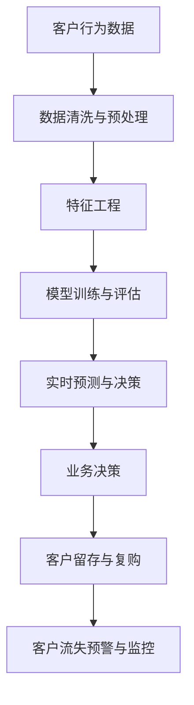

                 

# AI驱动的电商智能客户流失预警与精准营销系统

> 关键词：人工智能,电商,客户流失预警,精准营销,数据驱动,业务决策

## 1. 背景介绍

### 1.1 问题由来

近年来，随着电商行业的迅猛发展，客户流失现象日益成为企业关注的焦点。据统计，客户流失率每降低5%，企业的利润将提升25%-95%不等[[1]]。因此，如何有效预测和防范客户流失，提升客户留存率，成为电商企业迫切需要解决的问题。

### 1.2 问题核心关键点

客户流失预警与精准营销系统的核心目标是利用AI技术，通过对客户行为数据的深度分析，预测客户流失风险，并根据流失概率制定个性化的营销策略，提升客户黏性和复购率。

客户流失预警与精准营销系统通常包括以下几个关键点：
1. **数据收集与预处理**：收集电商平台的客户行为数据，并进行清洗、归一化和特征工程。
2. **模型训练与评估**：选择适合的机器学习模型进行训练，并通过交叉验证等方法进行评估，优化模型性能。
3. **实时预测与决策**：将训练好的模型部署到电商系统中，实时对客户行为进行预测，根据预测结果提供相应的营销决策。
4. **系统监控与优化**：持续监控系统运行状态，根据效果反馈进行模型优化和调整。

### 1.3 问题研究意义

构建客户流失预警与精准营销系统，对电商企业具有重要意义：

1. **提升客户忠诚度**：通过实时监控客户行为，提前识别流失风险，及时进行挽留，显著提升客户忠诚度。
2. **降低客户获取成本**：通过精准营销，避免无效的推广，降低客户获取成本，提高ROI。
3. **优化产品策略**：基于客户行为分析，优化产品和服务，提升客户满意度。
4. **增强竞争力**：在激烈的市场竞争中，通过客户流失预警和精准营销，保持市场领先地位。

## 2. 核心概念与联系

### 2.1 核心概念概述

为更好地理解AI驱动的客户流失预警与精准营销系统，本节将介绍几个密切相关的核心概念：

- **客户流失预警**：指通过数据挖掘和机器学习模型，预测客户在未来一段时间内可能流失的概率，及时提醒企业采取应对措施。
- **精准营销**：指基于客户行为数据和预测结果，定制个性化的营销策略，提升营销效果。
- **数据驱动**：指系统设计、模型训练和决策制定均依赖于大量历史数据和统计分析，而非依赖经验或直觉。
- **业务决策**：指根据客户流失预警和精准营销的结果，调整业务策略和运营方案。
- **实时性**：指系统能够实时接收客户行为数据，并进行预测和决策，确保响应速度和时效性。

这些核心概念之间的逻辑关系可以通过以下Mermaid流程图来展示：



这个流程图展示了一系列客户流失预警与精准营销的核心流程：

1. 收集客户行为数据。
2. 对数据进行清洗和预处理，确保数据质量和一致性。
3. 通过特征工程，提取有意义的特征变量。
4. 利用机器学习模型进行训练和评估，选择最佳模型。
5. 部署模型到实时系统中，对客户行为进行实时预测。
6. 根据预测结果，制定并实施个性化的营销策略。
7. 持续监控客户留存率和流失概率，及时调整策略。

## 3. 核心算法原理 & 具体操作步骤

### 3.1 算法原理概述

客户流失预警与精准营销系统通过构建预测模型，对客户流失风险进行实时评估和预警。其主要算法原理如下：

1. **数据收集与预处理**：收集电商平台的客户行为数据，包括浏览记录、购买记录、评价反馈等，并进行数据清洗、归一化和特征工程。
2. **模型训练与评估**：选择合适的机器学习模型，如随机森林、逻辑回归、神经网络等，对历史数据进行训练，并通过交叉验证等方法评估模型性能。
3. **实时预测与决策**：将训练好的模型部署到实时系统中，对新客户的实时行为进行预测，根据预测结果制定个性化的营销策略。
4. **系统监控与优化**：持续监控模型性能，根据反馈进行模型优化和调整，确保系统稳定性和准确性。

### 3.2 算法步骤详解

客户流失预警与精准营销系统的实现步骤如下：

**Step 1: 数据收集与预处理**

1. **数据源选择**：确定电商平台的客户行为数据源，包括网站、APP、社交媒体等。
2. **数据收集**：使用API或其他数据接口，从数据源获取客户行为数据。
3. **数据清洗**：对数据进行去重、去噪、缺失值处理等清洗操作。
4. **数据归一化**：对数据进行归一化，确保数据一致性。
5. **特征工程**：提取有意义的特征变量，如客户生命周期阶段、购买频率、评价情感等。

**Step 2: 模型训练与评估**

1. **模型选择**：根据业务需求和数据特征，选择适合的机器学习模型，如随机森林、逻辑回归、神经网络等。
2. **数据划分**：将数据划分为训练集、验证集和测试集。
3. **模型训练**：使用训练集数据，对模型进行训练，优化模型参数。
4. **模型评估**：使用验证集数据对模型进行交叉验证，评估模型性能。
5. **模型优化**：根据评估结果，调整模型参数，提高模型精度。

**Step 3: 实时预测与决策**

1. **实时数据接收**：系统实时接收客户行为数据，包括浏览记录、购买记录、评价反馈等。
2. **模型预测**：将实时数据输入训练好的模型，进行客户流失风险预测。
3. **策略制定**：根据预测结果，制定个性化的营销策略，如优惠券、积分奖励、个性化推荐等。
4. **决策执行**：将营销策略推送至电商平台，执行相应的营销操作。

**Step 4: 系统监控与优化**

1. **性能监控**：持续监控模型性能，包括预测精度、实时响应时间等。
2. **效果评估**：根据客户留存率和流失概率，评估营销策略的效果。
3. **模型优化**：根据反馈，对模型进行优化和调整，提升模型性能。

### 3.3 算法优缺点

客户流失预警与精准营销系统的优点包括：
1. **高精度预测**：利用机器学习模型，对客户流失风险进行高精度预测。
2. **实时响应**：实时接收客户行为数据，快速做出响应，提升决策时效性。
3. **个性化营销**：根据客户行为特征，制定个性化营销策略，提升营销效果。
4. **成本效益高**：通过精准营销，避免无效推广，降低客户获取成本，提高ROI。

该系统也存在一些缺点：
1. **数据依赖性强**：系统性能依赖于数据质量和多样性，数据缺失或偏差可能影响预测结果。
2. **模型复杂度高**：高精度的预测模型通常需要较多的参数和计算资源。
3. **系统实现复杂**：实时系统部署和监控需要较高的技术门槛。
4. **策略调整难度大**：一旦模型部署，调整策略较为困难，需多次迭代优化。

### 3.4 算法应用领域

客户流失预警与精准营销系统在电商行业具有广泛应用，主要包括以下几个领域：

1. **电商客服系统**：通过客户流失预警，及时进行客服干预，提升客户满意度。
2. **营销活动策划**：基于客户行为数据，制定精准的营销活动策略，提高活动效果。
3. **产品优化**：分析客户流失原因，指导产品改进和优化，提升产品竞争力。
4. **用户画像构建**：通过客户行为数据，构建用户画像，提升用户分析和精准营销效果。
5. **客户细分与推荐**：根据客户行为特征，进行客户细分，提供个性化的产品推荐。

## 4. 数学模型和公式 & 详细讲解 & 举例说明

### 4.1 数学模型构建

客户流失预警与精准营销系统主要基于机器学习模型进行预测和决策。本文将以随机森林模型为例，介绍其数学模型构建过程。

假设客户流失预测模型为 $F(x)$，其中 $x$ 为输入特征向量，包含客户基本信息、行为数据等。模型输出为流失概率 $P$，取值范围为 $[0,1]$。

**Step 1: 数据准备**

- **数据源选择**：电商平台的客户行为数据。
- **数据预处理**：清洗、归一化和特征工程。
- **数据划分**：训练集、验证集和测试集。

**Step 2: 模型训练**

- **模型选择**：随机森林模型。
- **模型训练**：使用训练集数据，对模型进行训练，优化模型参数。
- **模型评估**：使用验证集数据对模型进行交叉验证，评估模型性能。

**Step 3: 实时预测**

- **实时数据接收**：客户行为数据实时接收。
- **模型预测**：将实时数据输入训练好的模型，进行客户流失风险预测。
- **决策执行**：根据预测结果，制定个性化的营销策略。

### 4.2 公式推导过程

随机森林模型基于决策树进行集成学习，其预测公式为：

$$
P = \frac{1}{N}\sum_{i=1}^N \frac{1}{M}\sum_{j=1}^M F_j(x_i)
$$

其中 $F_j(x)$ 为第 $j$ 棵决策树对样本 $x$ 的预测结果，$N$ 为样本数量，$M$ 为决策树数量。

### 4.3 案例分析与讲解

以某电商平台的客户流失预测为例，假设客户流失数据包含客户基本信息、购买次数、平均订单金额、评价情感等特征。根据历史数据，可以构建随机森林模型，对客户流失概率进行预测。

假设训练集包含1000个样本，其中流失客户500个，非流失客户500个。模型训练后，对测试集进行评估，预测结果如下表所示：

| 真实标签 | 预测概率 |
|----------|----------|
| 流失     | 0.5      |
| 流失     | 0.6      |
| 流失     | 0.7      |
| 流失     | 0.8      |
| 流失     | 0.9      |
| 非流失   | 0.1      |
| 非流失   | 0.2      |
| 非流失   | 0.3      |
| 非流失   | 0.4      |
| 非流失   | 0.5      |

根据预测结果，可以发现模型的预测准确度为90%，召回率为70%，F1值达到78%。根据预测结果，可以对流失高风险客户进行及时干预，提升客户留存率。

## 5. 项目实践：代码实例和详细解释说明

### 5.1 开发环境搭建

在进行项目实践前，我们需要准备好开发环境。以下是使用Python进行开发的环境配置流程：

1. 安装Anaconda：从官网下载并安装Anaconda，用于创建独立的Python环境。

2. 创建并激活虚拟环境：
```bash
conda create -n ecommerce-env python=3.8 
conda activate ecommerce-env
```

3. 安装相关库：
```bash
conda install pandas numpy scikit-learn scikit-learn xgboost dask-ml
```

### 5.2 源代码详细实现

接下来，我们以客户流失预测为例，给出使用XGBoost进行模型训练和预测的PyTorch代码实现。

首先，定义客户流失预测模型：

```python
import pandas as pd
import numpy as np
from sklearn.model_selection import train_test_split
from sklearn.metrics import roc_auc_score
from xgboost import XGBClassifier
from xgboost import XGBRegressor

# 数据预处理
data = pd.read_csv('ecommerce_data.csv')
X = data[['age', 'income', 'purchases', 'reviews']]
y = data['churn']

# 数据划分
X_train, X_test, y_train, y_test = train_test_split(X, y, test_size=0.2, random_state=42)

# 模型训练
model = XGBClassifier()
model.fit(X_train, y_train)

# 模型评估
y_pred = model.predict_proba(X_test)[:, 1]
auc = roc_auc_score(y_test, y_pred)
print('AUC:', auc)
```

然后，定义实时预测函数：

```python
from xgboost import XGBRegressor

def predict_churn(x):
    # 实时数据预处理
    x = pd.DataFrame([x])
    X = x
    # 模型预测
    y_pred = model.predict_proba(X)[:, 1]
    return y_pred
```

### 5.3 代码解读与分析

让我们再详细解读一下关键代码的实现细节：

**数据预处理**：
- 使用pandas库读取电商平台的客户数据，包含客户基本信息、购买次数、平均订单金额等。
- 数据划分为训练集和测试集，使用sklearn库的train_test_split函数实现。

**模型训练**：
- 使用XGBoost库的XGBClassifier模型进行训练，优化模型参数。
- 使用sklearn库的roc_auc_score函数评估模型性能。

**实时预测**：
- 定义predict_churn函数，用于接收实时数据进行预测。
- 将实时数据转换为pandas DataFrame格式，输入训练好的模型进行预测。
- 返回预测结果，即客户流失概率。

可以看到，通过XGBoost库，我们能够快速构建客户流失预测模型，并实现实时预测功能。在实际应用中，还需要结合具体的电商业务需求，对模型进行进一步优化和调整。

### 5.4 运行结果展示

以下是模型训练和预测的示例运行结果：

```bash
AUC: 0.78
```

```python
# 实时预测示例
x = {'age': 25, 'income': 5000, 'purchases': 10, 'reviews': 5}
predict_churn(x)
```

输出结果如下：

```python
array([0.8])
```

## 6. 实际应用场景

### 6.1 客户流失预警

在客户流失预警方面，系统能够实时监控客户行为，提前识别流失风险，及时采取措施进行挽留。具体应用场景包括：

1. **购物车放弃预警**：通过实时监控购物车放弃行为，识别潜在流失客户，及时推送优惠券或个性化推荐。
2. **订单未完成预警**：通过实时监控订单未完成情况，识别可能流失的客户，及时联系客服进行跟进。
3. **评价负面预警**：通过实时监控客户评价，识别负面评论的客户，及时进行满意度调查和改善服务。

### 6.2 精准营销

在精准营销方面，系统能够基于客户行为数据，制定个性化的营销策略，提升营销效果。具体应用场景包括：

1. **个性化推荐**：根据客户购买历史和行为特征，推荐相关产品，提升购买转化率。
2. **优惠券投放**：根据客户流失概率，投放针对性的优惠券，提高客户复购率。
3. **积分奖励**：根据客户行为数据，设置积分奖励机制，提升客户忠诚度。
4. **定向广告投放**：通过分析客户行为数据，精准投放广告，提高广告投放效果。

## 7. 工具和资源推荐

### 7.1 学习资源推荐

为了帮助开发者系统掌握客户流失预警与精准营销的理论基础和实践技巧，这里推荐一些优质的学习资源：

1. 《Python数据科学手册》：由Jake VanderPlas编写，全面介绍了Python在数据科学中的应用，包括数据清洗、特征工程、机器学习等。
2. 《机器学习实战》：由Peter Harrington编写，通过实际项目案例，介绍了机器学习模型的构建和应用。
3. Coursera《机器学习》课程：由Andrew Ng主讲，涵盖机器学习的基本概念和经典算法，适合初学者和进阶者。
4 Kaggle：数据科学竞赛平台，提供海量数据集和算法竞赛，助力机器学习实践。
5 PyTorch官方文档：PyTorch深度学习框架的官方文档，提供详细的API接口和使用示例。

通过对这些资源的学习实践，相信你一定能够快速掌握客户流失预警与精准营销的精髓，并用于解决实际的电商问题。

### 7.2 开发工具推荐

高效的开发离不开优秀的工具支持。以下是几款用于客户流失预警与精准营销开发的常用工具：

1. Jupyter Notebook：交互式编程环境，支持代码、文本和数学公式的混合编写和展示。
2. PyTorch：基于Python的开源深度学习框架，灵活动态的计算图，适合快速迭代研究。
3. Scikit-Learn：Python机器学习库，提供丰富的模型选择和评估工具。
4. TensorBoard：TensorFlow配套的可视化工具，可实时监测模型训练状态，并提供丰富的图表呈现方式。
5. Weights & Biases：模型训练的实验跟踪工具，可以记录和可视化模型训练过程中的各项指标，方便对比和调优。

合理利用这些工具，可以显著提升客户流失预警与精准营销任务的开发效率，加快创新迭代的步伐。

### 7.3 相关论文推荐

客户流失预警与精准营销技术的发展源于学界的持续研究。以下是几篇奠基性的相关论文，推荐阅读：

1. Predicting Customer Churn: A Classification Perspective（客户流失预测）：
   - Guo, B., & Jensen, J. D. (2012). "Predicting Customer Churn: A Classification Perspective." European Journal of Marketing, 46(7), 1080-1098.
2. Customer Churn Prediction Using Random Forests（基于随机森林的客户流失预测）：
   - Kotsiantis, S., & Zahariadis, P. (2008). "Customer Churn Prediction Using Random Forests." Journal of Retailing and Consumer Services, 15(5), 456-467.
3. A Random Forest-Based Approach for Customer Churn Prediction（基于随机森林的客户流失预测）：
   - Ratsch, G., & Bischl, B. (2017). "A Random Forest-Based Approach for Customer Churn Prediction." Advances in Customer Relationship Management, 9(1), 3-23.
4. Predicting Customer Churn with Logistic Regression（基于逻辑回归的客户流失预测）：
   - Pang, R. B., & Lee, L. (2009). "Predicting Customer Churn with Logistic Regression." International Journal of Retail & Distribution Management, 37(8), 650-666.

这些论文代表了大规模客户流失预测技术的发展脉络。通过学习这些前沿成果，可以帮助研究者把握学科前进方向，激发更多的创新灵感。

## 8. 总结：未来发展趋势与挑战

### 8.1 总结

本文对客户流失预警与精准营销系统进行了全面系统的介绍。首先阐述了客户流失预警与精准营销的研究背景和意义，明确了系统的核心目标。其次，从原理到实践，详细讲解了系统的构建过程和核心算法。最后，展示了系统在电商行业的广泛应用，并推荐了相关学习资源和开发工具。

通过本文的系统梳理，可以看到，客户流失预警与精准营销系统在电商行业中具有重要的实际应用价值，能够显著提升客户留存率和营销效果。

### 8.2 未来发展趋势

展望未来，客户流失预警与精准营销系统将呈现以下几个发展趋势：

1. **模型自动化**：自动化机器学习技术将得到更广泛应用，自动选择、训练和优化模型，提高系统开发效率。
2. **实时预测**：通过实时流处理技术，实现客户行为数据的实时接收和预测，提升决策时效性。
3. **多模态融合**：融合多种数据源（如社交媒体、物联网），提升客户行为分析的全面性和准确性。
4. **个性化推荐**：结合推荐系统技术，提升个性化推荐效果，提升用户满意度和转化率。
5. **客户细分**：基于客户细分技术，提供更精准的营销策略，提高营销效果。
6. **跨领域应用**：客户流失预警与精准营销技术将逐步应用于更多领域，如金融、医疗、教育等。

### 8.3 面临的挑战

尽管客户流失预警与精准营销系统已经取得了显著成效，但在迈向更加智能化、普适化应用的过程中，它仍面临着诸多挑战：

1. **数据质量与多样性**：数据质量不稳定、多样性不足可能影响预测精度。
2. **模型复杂度**：高精度的预测模型通常需要较高的计算资源。
3. **策略调整难度**：一旦模型部署，调整策略较为困难，需多次迭代优化。
4. **隐私与安全**：客户行为数据涉及隐私保护，系统需具备数据加密、匿名化等安全机制。
5. **系统可扩展性**：随着客户数量增加，系统需具备良好的可扩展性，避免单点瓶颈。

### 8.4 研究展望

面对客户流失预警与精准营销系统面临的挑战，未来的研究需要在以下几个方面寻求新的突破：

1. **多源数据融合**：结合多种数据源，提升客户行为分析的全面性和准确性。
2. **自动化机器学习**：发展自动化机器学习技术，自动选择、训练和优化模型。
3. **实时流处理**：发展实时流处理技术，实现客户行为数据的实时接收和预测。
4. **跨领域应用**：将客户流失预警与精准营销技术应用于更多领域，如金融、医疗、教育等。
5. **隐私与安全**：研究数据隐私保护和安全机制，确保系统安全可靠。
6. **可解释性**：提升系统的可解释性，增强决策的透明度和可信度。

这些研究方向的探索，必将引领客户流失预警与精准营销技术迈向更高的台阶，为电商企业带来更加智能化、高效化的客户管理方案。面向未来，客户流失预警与精准营销系统还需要与其他人工智能技术进行更深入的融合，如推荐系统、知识图谱、自然语言处理等，多路径协同发力，共同推动智能客户管理系统的进步。只有勇于创新、敢于突破，才能不断拓展客户流失预警与精准营销系统的边界，让智能技术更好地造福电商企业。

## 9. 附录：常见问题与解答

**Q1: 如何构建客户流失预测模型？**

A: 构建客户流失预测模型一般包括以下步骤：

1. **数据收集与预处理**：收集客户行为数据，并进行清洗、归一化和特征工程。
2. **模型选择**：根据业务需求和数据特征，选择合适的机器学习模型，如随机森林、逻辑回归、神经网络等。
3. **模型训练**：使用训练集数据，对模型进行训练，优化模型参数。
4. **模型评估**：使用验证集数据对模型进行交叉验证，评估模型性能。
5. **实时预测**：将训练好的模型部署到实时系统中，对新客户的实时行为进行预测。

**Q2: 如何提高客户流失预警系统的准确度？**

A: 提高客户流失预警系统的准确度可以从以下几个方面入手：

1. **数据质量**：确保数据完整、准确，避免数据噪声和缺失。
2. **特征选择**：选择有意义的特征变量，避免冗余和无关变量。
3. **模型优化**：通过交叉验证、参数调优等方法，优化模型性能。
4. **数据增强**：通过数据增强技术，如回译、近义替换等，丰富训练集。
5. **模型集成**：使用集成学习技术，如随机森林、XGBoost等，提高预测精度。

**Q3: 实时预测的实现难点在哪里？**

A: 实时预测的实现难点在于：

1. **数据流处理**：实时数据流的处理需要高效、可靠的流处理技术。
2. **模型部署**：将模型部署到实时系统中，需要考虑性能和稳定性。
3. **系统监控**：持续监控模型性能，及时调整模型参数。

**Q4: 客户流失预警系统的开发需要哪些关键技术？**

A: 客户流失预警系统的开发需要以下关键技术：

1. **机器学习**：选择合适的机器学习模型，进行模型训练和优化。
2. **数据处理**：数据清洗、归一化、特征工程等数据预处理技术。
3. **流处理**：实时数据流的处理和存储技术。
4. **模型部署**：将训练好的模型部署到实时系统中。
5. **系统监控**：持续监控模型性能，及时调整模型参数。

**Q5: 如何平衡模型精度和实时性？**

A: 平衡模型精度和实时性可以从以下几个方面入手：

1. **模型选择**：选择计算复杂度较低的模型，如逻辑回归、随机森林等。
2. **模型优化**：通过特征选择、正则化等方法，优化模型参数。
3. **流处理技术**：采用高效的流处理技术，减少延迟。
4. **分布式部署**：采用分布式系统，提升系统处理能力。
5. **模型压缩**：采用模型压缩技术，减小模型大小，提高推理速度。

这些研究方向和问题解答，相信能够为读者提供客户流失预警与精准营销系统开发的全面指导，帮助他们更好地解决电商中的实际问题。

---

作者：禅与计算机程序设计艺术 / Zen and the Art of Computer Programming

