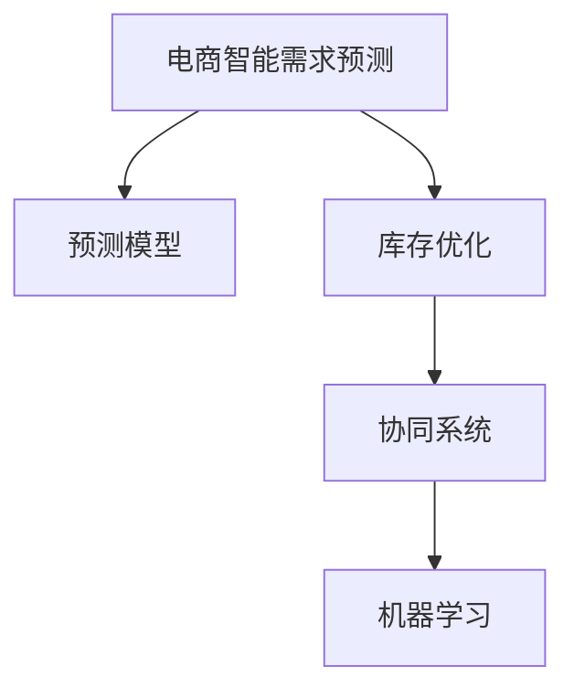

                 

# AI驱动的电商智能需求预测与库存优化协同系统

> 关键词：电商智能需求预测,库存优化,协同系统,机器学习,预测模型,供应链管理

## 1. 背景介绍

### 1.1 问题由来
在当前电商竞争日趋激烈的环境下，精准的需求预测与库存管理成为企业提升运营效率和盈利能力的关键。传统的库存管理模式往往依赖于历史销售数据、季节性因素等直观的指标，难以应对复杂多变的市场需求和供应链问题。如何利用AI技术，高效准确地预测需求，优化库存管理，成为电商企业急需解决的问题。

### 1.2 问题核心关键点
为更好地实现电商的智能需求预测与库存优化，本节将介绍以下几个核心概念及其之间的关系：

- **电商智能需求预测**：利用机器学习和数据挖掘技术，基于历史销售数据、用户行为数据、市场趋势等，预测未来的用户需求。
- **库存优化**：通过预测结果和业务规则，合理配置库存水平，避免缺货和积压，减少运营成本。
- **协同系统**：构建一个整合了需求预测、库存管理、订单处理等多个环节的系统，实现信息共享和协同作业，提升整体运营效率。

通过将机器学习与电商业务场景深度结合，可显著提升需求预测和库存管理的准确性和实时性，为企业带来竞争优势。

### 1.3 问题研究意义
本系统旨在通过AI技术，构建一套高效、准确的电商智能需求预测与库存优化协同系统，助力企业提升运营效率和客户满意度，降低库存成本，提升供应链的灵活性和抗风险能力。

## 2. 核心概念与联系

### 2.1 核心概念概述

为更好地理解电商智能需求预测与库存优化协同系统，本节将介绍几个密切相关的核心概念：

- **机器学习**：通过数据驱动的方式，让计算机自动学习数据中的规律和模式，以解决实际问题。
- **预测模型**：用于对未来的数据进行预测，常用的包括线性回归、决策树、神经网络等。
- **协同系统**：通过系统架构的设计，实现不同模块间的数据交互和协同作业，提升整体运营效率。
- **库存管理**：对库存进行计划、控制、执行、跟踪、盘点等一系列管理活动，以实现库存水平的最优化。

这些核心概念之间的逻辑关系可以通过以下Mermaid流程图来展示：



这个流程图展示了几者之间的关系：

1. 电商智能需求预测利用预测模型对未来需求进行预测。
2. 库存优化结合预测结果和业务规则，优化库存水平。
3. 协同系统整合需求预测、库存管理、订单处理等多个环节，实现信息共享和协同作业。
4. 机器学习提供数据驱动的方法论，帮助构建高效准确的预测模型。

这些概念共同构成了电商智能需求预测与库存优化协同系统的基础框架，为其后续的实施提供了明确的方向。

## 3. 核心算法原理 & 具体操作步骤
### 3.1 算法原理概述

电商智能需求预测与库存优化协同系统，其核心算法基于机器学习和协同系统两大技术。具体而言：

- **机器学习算法**：用于对历史销售数据和用户行为数据进行建模，训练预测模型，对未来的需求进行预测。
- **协同系统算法**：通过构建数据管道和任务队列，实现各模块间的信息交互和协同作业。

系统整体流程如下：

1. **数据收集**：收集电商平台上的用户行为数据、历史销售数据、市场趋势等。
2. **数据预处理**：清洗、转换和归一化数据，确保数据质量。
3. **特征工程**：提取有用的特征，构建数据集。
4. **模型训练**：利用机器学习算法，训练需求预测模型。
5. **库存优化**：根据预测结果，结合业务规则，进行库存调整。
6. **系统部署与协同作业**：将模型和规则集成到系统中，实现信息共享和协同作业。

### 3.2 算法步骤详解

电商智能需求预测与库存优化协同系统的主要算法步骤包括：

**Step 1: 数据收集与预处理**

- 收集电商平台的用户行为数据，如浏览记录、购买历史、用户评分等。
- 收集历史销售数据，包括各产品的销售记录、促销活动效果等。
- 收集市场趋势数据，如节假日、季节性因素、竞争对手动向等。
- 对收集的数据进行清洗、去重、格式化等预处理，确保数据质量和一致性。

**Step 2: 特征工程**

- 提取有用的特征，如用户特征、产品特征、时间特征等。
- 对特征进行归一化、编码等处理，确保特征数据适合建模。
- 构建数据集，将特征和标签数据进行组合，形成可供模型训练的数据集。

**Step 3: 模型训练与优化**

- 选择合适的机器学习算法，如线性回归、决策树、随机森林、神经网络等。
- 使用训练集对模型进行训练，并通过验证集评估模型性能，选择合适的超参数。
- 对模型进行调优，如添加正则化项、进行交叉验证等，提高模型的泛化能力。

**Step 4: 库存优化**

- 结合预测结果和业务规则，调整库存水平。如使用ABC分析法，对高价值产品进行重点管理。
- 利用库存优化算法，如经济订货批量(EOQ)、安全库存等，优化库存配置。
- 对库存数据进行实时监控和调整，确保库存水平处于合理范围内。

**Step 5: 系统部署与协同作业**

- 将训练好的模型和优化规则集成到系统中，实现需求预测、库存优化、订单处理等功能的自动化。
- 构建数据管道和任务队列，实现各模块间的数据交互和协同作业。
- 通过API接口和消息队列，实现不同系统模块的实时通信和信息共享。

### 3.3 算法优缺点

电商智能需求预测与库存优化协同系统的主要算法具有以下优点：

1. **高效准确**：基于机器学习的方法，可以高效地从历史数据中挖掘出有价值的信息，预测未来需求，优化库存管理。
2. **实时性**：利用协同系统，可以实现各模块间的数据实时交互和协同作业，提高响应速度。
3. **灵活性**：结合实际业务规则，可以灵活调整库存水平和业务策略，适应市场变化。
4. **可扩展性**：系统采用模块化设计，方便扩展和集成新的功能模块。

同时，该算法也存在一些局限性：

1. **依赖数据质量**：预测结果的准确性依赖于数据的质量和完整性，如果数据存在偏差或缺失，可能影响模型效果。
2. **模型复杂度**：复杂的预测模型可能存在过拟合的风险，需要谨慎选择和调参。
3. **业务规则依赖**：库存优化效果依赖于业务规则和运营策略，需要结合实际情况进行调整。
4. **系统复杂性**：协同系统设计复杂，需要平衡数据流、任务队列、消息传递等环节，确保系统稳定运行。

尽管存在这些局限性，但整体而言，基于机器学习和协同系统的电商智能需求预测与库存优化协同系统，仍是一种高效、准确的解决方案，具有广泛的应用前景。

### 3.4 算法应用领域

电商智能需求预测与库存优化协同系统，已在多个电商企业得到了应用，主要包括以下几个领域：

- **电商企业**：如亚马逊、阿里巴巴、京东等，通过预测用户需求，优化库存管理，提升运营效率。
- **零售连锁**：如沃尔玛、家乐福等，通过系统集成订单处理、库存管理、销售预测等功能，实现全渠道运营。
- **快速消费品**：如宝洁、联合利华等，通过预测市场需求，优化供应链管理，提升产品周转率。
- **物流仓储**：如UPS、联邦快递等，通过实时监控库存水平，提升物流效率，减少配送延迟。

此外，该系统在农业、医药、制造等行业也有广泛的应用前景，为这些行业的智能管理和运营带来了新的突破。

## 4. 数学模型和公式 & 详细讲解 & 举例说明

### 4.1 数学模型构建

电商智能需求预测与库存优化协同系统涉及多个数学模型，以下将逐一介绍：

- **需求预测模型**：
  - 假设 $D_t$ 表示时间 $t$ 的需求量， $\hat{D_t}$ 表示预测的需求量。
  - 需求预测模型为 $\hat{D_t} = f(D_{t-1}, D_{t-2}, ..., D_{t-T}, X_t)$，其中 $X_t$ 为影响需求量的特征向量。
  - 常用的需求预测模型包括线性回归、ARIMA、神经网络等。

- **库存优化模型**：
  - 假设 $S_t$ 表示时间 $t$ 的库存水平， $C_t$ 表示时间 $t$ 的成本， $P_t$ 表示时间 $t$ 的产品价格。
  - 库存优化模型为 $S_{t+1} = S_t - \hat{D_t} + I_t - O_t$，其中 $I_t$ 表示时间 $t$ 的补给量， $O_t$ 表示时间 $t$ 的订单量。
  - 常用的库存优化模型包括EOQ模型、安全库存模型等。

### 4.2 公式推导过程

以下对需求预测模型和库存优化模型进行详细推导：

**需求预测模型**

假设历史需求量 $D_1, D_2, ..., D_T$ 为平稳时间序列，需求量与时间 $t$ 的回归方程为：

$$
\hat{D_t} = \beta_0 + \sum_{i=1}^{n} \beta_i X_{ti}
$$

其中，$\beta_0$ 为截距，$\beta_i$ 为特征系数，$X_{ti}$ 为影响需求量的特征向量。

使用最小二乘法，可以求解 $\beta_0, \beta_i$，从而得到预测模型。

**库存优化模型**

假设库存水平 $S_t$ 与时间 $t$ 的需求量 $\hat{D_t}$ 、补给量 $I_t$ 和订单量 $O_t$ 有关，库存优化模型为：

$$
S_{t+1} = S_t - \hat{D_t} + I_t - O_t
$$

结合预测结果，利用库存优化算法（如EOQ模型），可以计算最优的库存水平和补给量，从而实现库存优化。

### 4.3 案例分析与讲解

以亚马逊为例，分析其智能需求预测与库存优化协同系统：

**需求预测**

亚马逊收集了海量的用户行为数据，包括浏览记录、购买历史、评分等，构建了全面的数据集。使用ARIMA模型和神经网络模型对历史数据进行建模，对未来的需求进行预测。

**库存优化**

亚马逊通过预测结果和业务规则，调整库存水平。如使用ABC分析法，对高价值产品进行重点管理。结合EOQ模型，计算最优的补给量和库存水平，实现库存优化。

**系统部署**

亚马逊将其智能需求预测与库存优化系统集成到电商平台中，实现了信息共享和协同作业。系统通过API接口和消息队列，实时监控库存水平，并自动调整订单处理和物流配送策略。

## 5. 项目实践：代码实例和详细解释说明
### 5.1 开发环境搭建

在进行项目实践前，我们需要准备好开发环境。以下是使用Python进行PyTorch开发的环境配置流程：

1. 安装Anaconda：从官网下载并安装Anaconda，用于创建独立的Python环境。

2. 创建并激活虚拟环境：
```bash
conda create -n pytorch-env python=3.8 
conda activate pytorch-env
```

3. 安装PyTorch：根据CUDA版本，从官网获取对应的安装命令。例如：
```bash
conda install pytorch torchvision torchaudio cudatoolkit=11.1 -c pytorch -c conda-forge
```

4. 安装相关库：
```bash
pip install pandas numpy matplotlib scikit-learn
```

完成上述步骤后，即可在`pytorch-env`环境中开始项目实践。

### 5.2 源代码详细实现

下面我们以电商智能需求预测为例，给出使用PyTorch进行需求预测的PyTorch代码实现。

首先，定义需求预测函数：

```python
import torch
import torch.nn as nn
import torch.optim as optim

class DemandPredictor(nn.Module):
    def __init__(self, input_dim, output_dim):
        super(DemandPredictor, self).__init__()
        self.fc1 = nn.Linear(input_dim, 256)
        self.fc2 = nn.Linear(256, 128)
        self.fc3 = nn.Linear(128, output_dim)
        
    def forward(self, x):
        x = torch.relu(self.fc1(x))
        x = torch.relu(self.fc2(x))
        x = self.fc3(x)
        return x

# 定义损失函数和优化器
model = DemandPredictor(10, 1)
criterion = nn.MSELoss()
optimizer = optim.Adam(model.parameters(), lr=0.001)

# 定义训练函数
def train(model, criterion, optimizer, train_loader, num_epochs):
    for epoch in range(num_epochs):
        for i, (features, labels) in enumerate(train_loader):
            optimizer.zero_grad()
            predictions = model(features)
            loss = criterion(predictions, labels)
            loss.backward()
            optimizer.step()
            print(f"Epoch: {epoch+1}, Loss: {loss.item()}")
```

然后，定义数据加载函数：

```python
from torch.utils.data import Dataset, DataLoader
import pandas as pd

class DemandDataset(Dataset):
    def __init__(self, data):
        self.data = data
        
    def __len__(self):
        return len(self.data)
    
    def __getitem__(self, idx):
        return torch.tensor(self.data.iloc[idx]['features']), torch.tensor(self.data.iloc[idx]['labels'])
        
# 读取数据集
data = pd.read_csv('demand.csv')

# 将数据集分为特征和标签
features = data[['feature1', 'feature2', 'feature3', 'feature4', 'feature5']]
labels = data['label']

# 定义数据集和数据加载器
dataset = DemandDataset(data)
train_loader = DataLoader(dataset, batch_size=64, shuffle=True)
```

最后，启动训练流程：

```python
epochs = 100
train(train_loader, criterion, optimizer, epochs)
```

以上就是使用PyTorch对需求预测模型进行训练的完整代码实现。可以看到，通过将模型定义、数据加载、损失函数和优化器等关键组件封装成函数，使得训练过程变得简洁高效。

### 5.3 代码解读与分析

让我们再详细解读一下关键代码的实现细节：

**DemandPredictor类**：
- `__init__`方法：定义模型的网络结构，包含三个全连接层。
- `forward`方法：实现模型的前向传播。

**训练函数train**：
- 使用DataLoader加载训练集，在每个epoch内遍历数据。
- 在每个batch中，前向传播计算损失，反向传播更新模型参数。

**数据加载函数DemandDataset类**：
- `__init__`方法：初始化数据集。
- `__len__`方法：返回数据集的长度。
- `__getitem__`方法：返回单个样本的特征和标签。

**数据读取与预处理**：
- 使用pandas库读取CSV文件，将数据集分为特征和标签。
- 定义数据集和数据加载器，方便训练函数的调用。

完成上述步骤后，即可在`pytorch-env`环境中开始电商智能需求预测的项目实践。

## 6. 实际应用场景
### 6.1 智能客服系统

电商智能需求预测与库存优化协同系统不仅可以应用于电商企业的日常运营，还可以扩展到智能客服系统的构建。传统客服往往需要配备大量人力，高峰期响应缓慢，且一致性和专业性难以保证。通过集成智能需求预测与库存优化功能，智能客服系统可以7x24小时不间断服务，快速响应客户咨询，用自然流畅的语言解答各类常见问题。

在技术实现上，可以收集企业内部的历史客服对话记录，将问题和最佳答复构建成监督数据，在此基础上对预训练模型进行微调。微调后的对话模型能够自动理解用户意图，匹配最合适的答案模板进行回复。对于客户提出的新问题，还可以接入检索系统实时搜索相关内容，动态组织生成回答。如此构建的智能客服系统，能大幅提升客户咨询体验和问题解决效率。

### 6.2 供应链管理

电商智能需求预测与库存优化协同系统在供应链管理中也有广泛的应用。传统供应链管理往往依赖于人工经验，存在供应链断链、库存积压等问题。通过预测未来需求，优化库存水平，可以有效减少库存成本，提高供应链的灵活性和抗风险能力。

在实际应用中，企业可以结合智能需求预测与库存优化功能，实时监控库存水平，自动调整订单处理和物流配送策略，从而实现供应链的高效管理。系统通过API接口和消息队列，实时传递需求预测结果和库存调整信息，确保供应链的稳定运行。

### 6.3 个性化推荐系统

电商智能需求预测与库存优化协同系统还可以应用于个性化推荐系统的构建。当前的推荐系统往往只依赖用户的历史行为数据进行物品推荐，无法深入理解用户的真实兴趣偏好。通过预测未来需求，推荐系统可以更精准地把握用户的兴趣点，推荐个性化程度更高的商品。

在推荐模型构建上，可以结合需求预测结果和用户行为数据，构建更加全面和动态的推荐模型。推荐系统通过API接口，实时获取需求预测结果，根据预测结果和用户历史行为，动态调整推荐策略，提升推荐效果。

### 6.4 未来应用展望

随着电商智能需求预测与库存优化协同系统的不断发展，其应用领域将不断扩展，为电商企业带来新的突破：

1. **全渠道运营**：系统集成多种电商渠道，实现信息共享和协同作业，提升整体运营效率。
2. **个性化营销**：结合需求预测结果和用户行为数据，进行精准营销，提升转化率和用户体验。
3. **实时监控与预警**：通过实时监控库存水平和销售数据，及时发现异常情况，实现预警和决策支持。
4. **供应链优化**：优化供应链管理，提升物流效率，减少配送延迟，提升客户满意度。
5. **市场预测与决策支持**：结合市场趋势和预测结果，提供市场预测和决策支持，帮助企业制定科学的运营策略。

未来，伴随系统的持续优化和升级，电商智能需求预测与库存优化协同系统必将在更多领域发挥作用，推动电商行业的智能化发展。

## 7. 工具和资源推荐
### 7.1 学习资源推荐

为了帮助开发者系统掌握电商智能需求预测与库存优化协同系统的理论基础和实践技巧，这里推荐一些优质的学习资源：

1. **《深度学习基础》系列博文**：深度学习领域的入门级资源，介绍深度学习的基本概念和算法，包括神经网络、回归模型等。
2. **Coursera《深度学习专项课程》**：由吴恩达教授讲授的深度学习课程，涵盖深度学习的基本理论和实践应用，适合深度学习初学者。
3. **Kaggle**：数据科学和机器学习竞赛平台，提供丰富的数据集和竞赛任务，帮助开发者实践和提升技能。
4. **GitHub**：开源代码托管平台，提供海量的代码实现和项目案例，供开发者参考和学习。
5. **Stack Overflow**：开发者问答社区，提供丰富的技术讨论和解决方案，帮助开发者解决实际问题。

通过对这些资源的学习实践，相信你一定能够快速掌握电商智能需求预测与库存优化协同系统的精髓，并用于解决实际的电商问题。

### 7.2 开发工具推荐

高效的开发离不开优秀的工具支持。以下是几款用于电商智能需求预测与库存优化协同系统开发的常用工具：

1. **PyTorch**：基于Python的开源深度学习框架，灵活动态的计算图，适合快速迭代研究。
2. **TensorFlow**：由Google主导开发的开源深度学习框架，生产部署方便，适合大规模工程应用。
3. **Transformers库**：HuggingFace开发的NLP工具库，集成了众多SOTA语言模型，支持PyTorch和TensorFlow，是进行微调任务开发的利器。
4. **Weights & Biases**：模型训练的实验跟踪工具，可以记录和可视化模型训练过程中的各项指标，方便对比和调优。
5. **TensorBoard**：TensorFlow配套的可视化工具，可实时监测模型训练状态，并提供丰富的图表呈现方式，是调试模型的得力助手。
6. **Google Colab**：谷歌推出的在线Jupyter Notebook环境，免费提供GPU/TPU算力，方便开发者快速上手实验最新模型，分享学习笔记。

合理利用这些工具，可以显著提升电商智能需求预测与库存优化协同系统的开发效率，加快创新迭代的步伐。

### 7.3 相关论文推荐

电商智能需求预测与库存优化协同系统的发展源于学界的持续研究。以下是几篇奠基性的相关论文，推荐阅读：

1. **"Deep Learning for Demand Forecasting in E-Commerce"**：探讨了深度学习在电商需求预测中的应用，提出了多种基于神经网络的预测模型。
2. **"An E-commerce Demand Forecasting System Using Hybrid Forecasting Models"**：介绍了混合预测模型在电商需求预测中的应用，提升了预测的准确性和稳定性。
3. **"A Distributed Demand Forecasting System for E-commerce"**：提出了一种分布式需求预测系统架构，利用大数据和云计算技术，提高了系统的可扩展性和效率。
4. **"Scalable E-commerce Demand Forecasting with Deep Learning"**：讨论了深度学习在电商需求预测中的可扩展性和实时性问题，提出了解决方案。

这些论文代表了大规模需求预测技术的发展脉络。通过学习这些前沿成果，可以帮助研究者把握学科前进方向，激发更多的创新灵感。

## 8. 总结：未来发展趋势与挑战
### 8.1 总结

本文对电商智能需求预测与库存优化协同系统进行了全面系统的介绍。首先阐述了系统的背景和意义，明确了系统在电商运营和供应链管理中的重要价值。其次，从原理到实践，详细讲解了系统的核心算法和关键步骤，给出了完整的代码实例和解释。同时，本文还广泛探讨了系统在智能客服、供应链管理、个性化推荐等多个行业领域的应用前景，展示了系统的广阔应用潜力。此外，本文精选了系统的学习资源和开发工具，力求为开发者提供全方位的技术指引。

通过本文的系统梳理，可以看到，电商智能需求预测与库存优化协同系统正在成为电商行业的重要技术范式，极大地提升了需求预测和库存管理的准确性和实时性，为企业带来了竞争优势。未来，伴随系统的持续优化和升级，必将在更多领域发挥作用，推动电商行业的智能化发展。

### 8.2 未来发展趋势

展望未来，电商智能需求预测与库存优化协同系统将呈现以下几个发展趋势：

1. **多模态预测**：结合文本、图像、声音等多种数据，提升预测的准确性和鲁棒性。
2. **实时化**：利用云计算和大数据技术，实现实时需求预测和库存优化，提升响应速度。
3. **自适应学习**：引入强化学习等技术，实现系统的自适应学习和优化。
4. **跨领域应用**：系统将在更多领域得到应用，如零售、制造、农业等，为各行业的智能化管理带来新的突破。
5. **人机协同**：系统将与人工决策相结合，提升系统的可靠性和智能化水平。
6. **可视化分析**：利用可视化工具，展示系统的运行状态和预测结果，方便业务决策。

以上趋势凸显了电商智能需求预测与库存优化协同系统的广泛应用前景。这些方向的探索发展，必将进一步提升系统的性能和应用范围，为电商行业带来更多的变革性影响。

### 8.3 面临的挑战

尽管电商智能需求预测与库存优化协同系统已经取得了显著成果，但在迈向更加智能化、普适化应用的过程中，仍面临诸多挑战：

1. **数据质量与多样性**：预测结果的准确性依赖于数据的质量和多样性，如何获取全面、高质量的数据，仍是一个难题。
2. **模型复杂性**：复杂的预测模型可能存在过拟合的风险，如何设计简单、高效的模型，是一个重要的研究方向。
3. **实时性与可扩展性**：系统需要实时处理大量数据，如何优化计算图和算法，提升系统的可扩展性和实时性，是一个重要的挑战。
4. **业务规则复杂性**：库存优化依赖于业务规则，如何设计灵活、可配置的规则引擎，是一个重要的研究方向。
5. **安全与隐私**：系统的数据和模型需要保护，如何设计安全、隐私保护机制，是一个重要的研究方向。
6. **人机协同**：如何设计人机协同机制，提升系统的可靠性和智能化水平，是一个重要的研究方向。

这些挑战需要持续的技术突破和研究创新，才能推动系统走向成熟，真正实现智能化管理。

### 8.4 研究展望

未来，电商智能需求预测与库存优化协同系统的研究将在以下几个方面寻求新的突破：

1. **多模态预测**：结合多种数据源，提升预测的准确性和鲁棒性。
2. **实时化**：利用云计算和大数据技术，实现实时需求预测和库存优化，提升响应速度。
3. **自适应学习**：引入强化学习等技术，实现系统的自适应学习和优化。
4. **跨领域应用**：系统将在更多领域得到应用，如零售、制造、农业等，为各行业的智能化管理带来新的突破。
5. **人机协同**：系统将与人工决策相结合，提升系统的可靠性和智能化水平。
6. **可视化分析**：利用可视化工具，展示系统的运行状态和预测结果，方便业务决策。

这些研究方向将进一步推动电商智能需求预测与库存优化协同系统的发展，为电商行业的智能化管理带来新的突破。通过持续的研究创新，系统必将在更多领域发挥作用，推动电商行业的智能化发展。

## 9. 附录：常见问题与解答

**Q1：电商智能需求预测与库存优化协同系统如何选择合适的机器学习算法？**

A: 电商智能需求预测与库存优化协同系统在选择机器学习算法时，应考虑以下几个因素：

1. **数据特征**：根据数据的特征选择合适的算法，如时间序列数据适合ARIMA，文本数据适合神经网络等。
2. **数据量**：对于大数据集，可以选择深度学习算法，如神经网络；对于小数据集，可以选择简单的回归模型，如线性回归等。
3. **预测准确性**：对于需要高准确性的预测任务，可以选择复杂的模型，如深度神经网络等；对于低准确性要求的任务，可以选择简单的模型，如线性回归等。

**Q2：电商智能需求预测与库存优化协同系统如何优化库存管理？**

A: 电商智能需求预测与库存优化协同系统可以通过以下方式优化库存管理：

1. **ABC分析法**：将产品分为高、中、低价值三类，对高价值产品进行重点管理，避免库存积压和缺货。
2. **经济订货批量(EOQ)模型**：根据预测需求量和订单批量，计算最优的订货量和库存水平，减少订货成本和库存成本。
3. **安全库存策略**：根据需求预测结果和业务规则，设置安全库存，避免缺货和过度库存。
4. **实时监控与调整**：通过实时监控库存水平和需求预测结果，自动调整订货和物流策略，确保库存水平合理。

**Q3：电商智能需求预测与库存优化协同系统如何处理多渠道订单？**

A: 电商智能需求预测与库存优化协同系统可以通过以下方式处理多渠道订单：

1. **订单集成**：将所有渠道的订单数据集成到一个系统，统一管理和预测。
2. **库存统一管理**：将所有渠道的库存数据统一管理，实现跨渠道库存共享。
3. **实时同步**：通过API接口和消息队列，实时同步订单和库存信息，确保数据一致性。
4. **需求预测集成**：结合所有渠道的需求预测结果，进行统一的需求预测和库存优化。

通过这些措施，可以提升多渠道订单的运营效率，实现全渠道运营。

**Q4：电商智能需求预测与库存优化协同系统如何应对市场波动？**

A: 电商智能需求预测与库存优化协同系统可以通过以下方式应对市场波动：

1. **多模型集成**：结合不同的预测模型，如ARIMA、神经网络等，提高预测的准确性和鲁棒性。
2. **自适应学习**：引入强化学习等技术，根据市场波动实时调整预测模型，提高预测的实时性和准确性。
3. **业务规则调整**：根据市场变化，及时调整库存优化策略和业务规则，确保系统的灵活性和适应性。
4. **实时监控与预警**：通过实时监控市场数据和预测结果，及时发现异常情况，实现预警和决策支持。

通过这些措施，可以提升系统的应对能力和灵活性，适应市场的波动和变化。

**Q5：电商智能需求预测与库存优化协同系统如何保证数据安全与隐私？**

A: 电商智能需求预测与库存优化协同系统可以通过以下方式保证数据安全与隐私：

1. **数据加密**：对数据进行加密处理，防止数据泄露和篡改。
2. **访问控制**：设置严格的访问控制机制，确保只有授权人员可以访问数据和模型。
3. **数据匿名化**：对数据进行匿名化处理，防止个人信息泄露。
4. **安全审计**：定期进行安全审计，发现并修复安全漏洞。
5. **合规性管理**：确保系统符合相关法规和标准，如GDPR、ISO等。

通过这些措施，可以保证系统的数据安全与隐私，防止数据泄露和滥用。

---

作者：禅与计算机程序设计艺术 / Zen and the Art of Computer Programming

