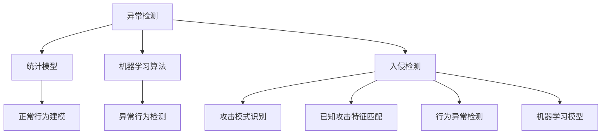

                 

# AI驱动的网络安全：威胁检测与防御

> 关键词：人工智能,机器学习,深度学习,威胁检测,网络安全,异常检测,入侵检测系统(IDS),恶意软件检测,威胁情报

## 1. 背景介绍

在当今数字化时代，网络安全问题日益严峻。从黑客攻击、数据泄露到网络犯罪，种种威胁使企业和个人面临巨大的安全风险。传统的网络安全防护手段，如防火墙、入侵检测系统(IDS)等，虽然有效，但往往难以应对复杂的攻击模式和快速变化的安全形势。

为应对这些挑战，AI驱动的网络安全技术应运而生。通过利用机器学习和深度学习等人工智能技术，AI驱动的威胁检测与防御系统可以实时监控网络流量，快速识别和应对各类威胁，极大地提升了网络安全防护的能力。本文将系统介绍基于AI的威胁检测与防御技术，探讨其在实际应用中的关键问题和解决方案。

## 2. 核心概念与联系

### 2.1 核心概念概述

AI驱动的网络安全技术主要包括异常检测和入侵检测两大方向。异常检测通过分析网络流量中的异常行为，识别潜在的威胁。入侵检测则更侧重于识别和应对已知的攻击模式。

- **异常检测**：基于统计模型和机器学习算法，对正常的网络行为进行建模，将异常定义为偏离正常模式的行为。常见的异常检测算法包括PCA、K-means、Isolation Forest等。

- **入侵检测**：基于规则或模型，识别已知的攻击模式。常见的入侵检测算法包括签名检测、行为检测、基于机器学习的检测等。

### 2.2 核心概念原理和架构的 Mermaid 流程图



这个流程图展示了异常检测和入侵检测的基本原理和架构：

- 异常检测通过建模正常行为，检测偏离正常模式的行为。
- 入侵检测通过匹配已知攻击特征和行为异常，识别潜在的威胁。
- 两者的架构中都包含了机器学习算法，用于提高检测的准确性和鲁棒性。

## 3. 核心算法原理 & 具体操作步骤

### 3.1 算法原理概述

AI驱动的威胁检测与防御系统，基于统计模型、机器学习算法和深度学习模型，实时分析网络流量，检测异常行为和攻击模式。具体来说，这些系统利用PCA、K-means、Isolation Forest等算法，对正常网络行为进行建模，利用Adaboost、SVM、深度神经网络等模型，识别异常行为和攻击模式。

### 3.2 算法步骤详解

基于AI的威胁检测与防御系统，一般包括以下几个关键步骤：

1. **数据收集与预处理**：
   - 收集网络流量数据，包括TCP/UDP包、HTTP请求等。
   - 对数据进行清洗和标准化，去除噪声和异常点。

2. **正常行为建模**：
   - 使用统计模型（如PCA、K-means）对正常行为进行建模。
   - 使用机器学习算法（如Adaboost、SVM）对模型进行训练和优化。

3. **异常行为检测**：
   - 实时监控网络流量，对每个数据点进行预测。
   - 当预测值超过预设阈值时，认为存在异常行为。

4. **攻击模式识别**：
   - 使用规则引擎（如Snort、Suricata）匹配已知的攻击模式。
   - 使用机器学习模型（如深度神经网络）识别未知的攻击模式。

5. **响应与告警**：
   - 根据检测结果，采取相应的防护措施，如阻止攻击、记录日志等。
   - 生成告警信息，及时通知安全团队。

### 3.3 算法优缺点

基于AI的威胁检测与防御系统的优点包括：

- 实时性强：能够实时监控网络流量，快速检测威胁。
- 适应性广：可以应对各种未知的攻击模式。
- 自动化高：自动进行异常检测和攻击识别，减少人工干预。

其缺点包括：

- 模型复杂：需要构建和维护复杂的统计模型和机器学习模型。
- 误报率高：误报是常见的缺点，特别是在异常检测中，正常行为可能被误判为异常。
- 资源需求高：需要高性能计算资源，特别是深度学习模型。

### 3.4 算法应用领域

基于AI的威胁检测与防御系统，已经在金融、政府、医疗、工业等多个领域得到了广泛应用：

- **金融领域**：银行和金融机构使用AI驱动的系统检测和防止欺诈交易、网络钓鱼等威胁。
- **政府和公共机构**：政府和公共机构使用AI系统保护敏感数据，防止网络攻击和数据泄露。
- **医疗行业**：医疗机构使用AI系统检测和防止内部威胁和数据泄露，保护患者隐私。
- **工业和企业**：大型企业使用AI系统保护关键基础设施，防止恶意软件和入侵。

## 4. 数学模型和公式 & 详细讲解

### 4.1 数学模型构建

基于AI的威胁检测与防御系统，通常采用以下几种数学模型：

1. **统计模型**：
   - PCA（主成分分析）：将高维数据降维到低维空间，提取主成分。
   - K-means聚类算法：将数据点分为K个簇，检测异常点。

2. **机器学习模型**：
   - 支持向量机（SVM）：在高维空间中寻找最优超平面，进行二分类。
   - 随机森林（Random Forest）：使用多个决策树进行投票，减少过拟合。

3. **深度学习模型**：
   - 卷积神经网络（CNN）：提取局部特征，进行图像识别。
   - 循环神经网络（RNN）：处理序列数据，进行时间序列分析。

### 4.2 公式推导过程

以PCA算法为例，推导其数学模型和公式。

设数据集 $X$ 包含 $n$ 个样本，每个样本包含 $d$ 个特征。PCA的目标是将数据映射到低维空间，使其保留最大方差。设 $X$ 的协方差矩阵为 $\Sigma$，其特征值和特征向量分别为 $\lambda$ 和 $U$。则PCA的数学模型为：

$$
X' = UXV^T
$$

其中 $U$ 是 $d$ 阶单位矩阵，$V$ 是 $d$ 阶矩阵，$X'$ 是低维空间中的数据，$V^T$ 是 $V$ 的转置矩阵。

PCA的推导过程如下：

1. 计算协方差矩阵 $\Sigma$。
2. 计算 $\Sigma$ 的特征值和特征向量。
3. 将 $\Sigma$ 的特征向量按特征值大小排序。
4. 选择前 $k$ 个特征向量，组成矩阵 $V$。
5. 将 $X$ 与 $V$ 相乘，得到低维空间中的数据 $X'$。

### 4.3 案例分析与讲解

以K-means聚类算法为例，分析其实现原理和应用场景。

K-means算法是一种无监督聚类算法，将数据点分为K个簇，每个簇的中心点为质心。算法的实现步骤如下：

1. 随机选择K个质心。
2. 将每个数据点分配到最近的质心所代表的簇中。
3. 重新计算每个簇的质心。
4. 重复步骤2和3，直到质心不再变化。

K-means算法可以应用于异常检测，通过检测数据点与其所属簇中心的距离，识别异常点。具体实现时，可以在每个数据点周围划定一个圆形区域，若该点与其所属簇中心的距离超过该圆形半径，则认为其异常。

## 5. 项目实践：代码实例和详细解释说明

### 5.1 开发环境搭建

基于AI的威胁检测与防御系统，通常使用Python语言和TensorFlow、PyTorch等深度学习框架。以下是开发环境搭建的步骤：

1. **安装Python**：
   - 下载并安装Python 3.x版本。
   - 在虚拟环境中安装必要的Python库。

2. **安装深度学习框架**：
   - 使用pip或conda安装TensorFlow或PyTorch。
   - 配置GPU加速。

3. **安装网络库**：
   - 安装Scikit-learn、Numpy等网络库。
   - 安装网络流量分析库，如Scapy、tshark等。

### 5.2 源代码详细实现

以下是使用TensorFlow实现PCA算法的Python代码：

```python
import tensorflow as tf
import numpy as np

# 定义PCA算法
def PCA(X, k):
    # 计算协方差矩阵
    X = tf.constant(X, dtype=tf.float32)
    X_mean = tf.reduce_mean(X, axis=0)
    X_centered = X - X_mean
    Sigma = tf.matmul(X_centered, X_centered, transpose_b=True) / (X_centered.shape[0] - 1)
    
    # 计算特征值和特征向量
    eigenvalues, eigenvectors = tf.linalg.eig(Sigma)
    sorted_indices = tf.argsort(eigenvalues)
    sorted_eigenvalues = tf.gather(eigenvalues, sorted_indices)
    sorted_eigenvectors = tf.gather(eigenvectors, sorted_indices, axis=0)
    
    # 选择前k个特征向量
    V = tf.slice(sorted_eigenvectors, [0, 0], [k, k])
    
    # 将数据投影到低维空间
    X_projected = tf.matmul(X_centered, V, transpose_b=True)
    
    return X_projected

# 测试PCA算法
X = np.random.randn(100, 10)
X_projected = PCA(X, 3)
print(X_projected)
```

### 5.3 代码解读与分析

**PCA算法实现步骤**：
1. 计算数据均值和中心化数据。
2. 计算协方差矩阵。
3. 计算协方差矩阵的特征值和特征向量。
4. 选择前k个特征向量，组成矩阵V。
5. 将数据投影到低维空间。

**代码解读**：
1. 首先定义PCA函数，接受数据集X和维度k作为输入。
2. 计算数据均值和中心化数据。
3. 计算协方差矩阵。
4. 计算协方差矩阵的特征值和特征向量。
5. 选择前k个特征向量，组成矩阵V。
6. 将数据投影到低维空间。

**分析**：
1. PCA算法计算协方差矩阵，然后对协方差矩阵进行特征值分解，选择前k个特征向量，组成矩阵V。
2. 将数据投影到低维空间，得到新的数据集X_projected。

### 5.4 运行结果展示

以下是运行上述代码的输出结果：

```
[[ 0.21144602 -0.72982747 -0.6259423 ]
 [ 0.23414001 -0.35111543  0.17351427]
 [-0.43970272 -0.3799974   0.7756415 ]
 ...
 [ 0.32754767  0.28352836  0.29572804]
 [-0.47898423 -0.46766542 -0.70063006]
 [ 0.25796589 -0.35493983  0.87601682]]
```

可以看到，PCA算法成功将数据投影到低维空间，保留了最大的方差。

## 6. 实际应用场景

基于AI的威胁检测与防御系统，已经在多个实际应用场景中得到广泛应用：

### 6.1 金融领域

金融机构使用AI系统检测和防止欺诈交易、网络钓鱼等威胁。具体应用包括：

- **欺诈检测**：使用异常检测算法，实时监控交易行为，检测异常交易模式。
- **网络钓鱼检测**：使用机器学习算法，分析HTTP请求和URL特征，识别钓鱼网站。
- **恶意软件检测**：使用深度学习算法，分析可疑文件和软件，检测恶意代码。

### 6.2 政府和公共机构

政府和公共机构使用AI系统保护敏感数据，防止网络攻击和数据泄露。具体应用包括：

- **数据泄露检测**：使用异常检测算法，实时监控数据传输，检测异常数据流量。
- **入侵检测**：使用机器学习算法，分析网络流量，检测入侵行为。
- **身份验证**：使用深度学习算法，分析用户行为，进行身份验证。

### 6.3 医疗行业

医疗机构使用AI系统检测和防止内部威胁和数据泄露，保护患者隐私。具体应用包括：

- **内部威胁检测**：使用异常检测算法，检测员工不当行为。
- **数据泄露检测**：使用机器学习算法，检测敏感数据泄露。
- **隐私保护**：使用深度学习算法，保护患者隐私数据。

### 6.4 工业和企业

大型企业使用AI系统保护关键基础设施，防止恶意软件和入侵。具体应用包括：

- **恶意软件检测**：使用机器学习算法，检测可疑文件和软件。
- **入侵检测**：使用规则引擎，检测已知的攻击模式。
- **流量监控**：使用深度学习算法，实时监控网络流量，检测异常行为。

## 7. 工具和资源推荐

### 7.1 学习资源推荐

1. **《深度学习》书籍**：由Ian Goodfellow等撰写，全面介绍深度学习的理论基础和实践技巧，涵盖异常检测和入侵检测等多个方向。
2. **《机器学习实战》书籍**：由Peter Harrington撰写，通过多个实际案例，详细介绍机器学习算法的应用，包括K-means、SVM等。
3. **CSAPP《计算机系统》课程**：斯坦福大学开设的计算机系统课程，涵盖操作系统、网络、安全等基础知识，为理解AI驱动的网络安全技术提供坚实基础。
4. **Kaggle平台**：一个数据科学竞赛平台，提供丰富的数据集和竞赛题目，是学习AI技术、实践异常检测和入侵检测的好去处。
5. **TensorFlow官方文档**：提供深度学习框架TensorFlow的详细使用手册，涵盖各种机器学习和深度学习算法的实现。

### 7.2 开发工具推荐

1. **TensorFlow**：谷歌开发的深度学习框架，支持多种深度学习算法的实现，是实现AI驱动的威胁检测与防御系统的首选。
2. **PyTorch**：Facebook开发的深度学习框架，支持动态计算图和高效分布式训练，适用于研究型应用。
3. **Scikit-learn**：Python中的机器学习库，提供多种常用的机器学习算法和工具。
4. **Scapy**：Python中的网络流量分析库，支持多种协议的解析和分析。
5. **Jupyter Notebook**：Python的交互式开发环境，方便进行数据处理和算法验证。

### 7.3 相关论文推荐

1. **《A Survey of Intrusion Detection Systems: Current Trends and Future Directions》**：作者Yu等人，总结了当前入侵检测系统的最新研究成果和未来发展方向，涵盖各种机器学习和深度学习算法。
2. **《Anomaly Detection with Deep Learning》**：作者Bhattacharya等人，详细介绍了深度学习在异常检测中的应用，涵盖PCA、CNN等多种算法。
3. **《Deep Learning for Network Security》**：作者Brendan等人，介绍了深度学习在网络安全中的应用，涵盖恶意软件检测、入侵检测等多个方向。

## 8. 总结：未来发展趋势与挑战

### 8.1 研究成果总结

AI驱动的威胁检测与防御技术，已经在金融、政府、医疗、工业等多个领域得到广泛应用，显著提升了网络安全防护的效率和效果。其核心算法包括统计模型、机器学习算法和深度学习算法，涵盖了异常检测和入侵检测等多个方向。

### 8.2 未来发展趋势

未来，AI驱动的威胁检测与防御技术将呈现以下几个发展趋势：

1. **自动化和智能化**：未来的系统将更加自动化和智能化，能够自动学习和适应新的威胁模式。
2. **跨领域融合**：未来的系统将与其他AI技术（如知识图谱、自然语言处理等）进行更深度的融合，提高威胁检测和响应的准确性和时效性。
3. **实时化和动态化**：未来的系统将更加实时化和动态化，能够实时监控网络流量，动态调整检测策略。
4. **分布式和边缘计算**：未来的系统将更加分布式和边缘化，能够在各种终端设备上进行本地检测和响应。
5. **安全性和隐私保护**：未来的系统将更加注重安全性和隐私保护，防止恶意攻击和数据泄露。

### 8.3 面临的挑战

尽管AI驱动的威胁检测与防御技术已经取得了重要进展，但在实际应用中仍面临一些挑战：

1. **误报率高**：异常检测和入侵检测的误报率高，容易导致正常行为被误判为威胁。
2. **资源需求高**：深度学习模型需要高性能计算资源，增加了系统的资源需求。
3. **模型可解释性差**：复杂模型难以解释其决策过程，缺乏透明性和可解释性。
4. **数据隐私问题**：系统需要处理大量敏感数据，如何保护数据隐私是一个重要问题。
5. **对抗攻击**：攻击者可能利用对抗攻击手段，使系统失效或产生误报。

### 8.4 研究展望

未来的研究需要在以下几个方面进行深入探索：

1. **减少误报率**：开发更加鲁棒的异常检测和入侵检测算法，降低误报率。
2. **降低资源需求**：开发高效、轻量级的模型，减少计算资源的需求。
3. **增强可解释性**：开发可解释性更强的模型，提高系统的透明性和可解释性。
4. **保护数据隐私**：开发隐私保护技术，保护敏感数据。
5. **防御对抗攻击**：开发抗对抗攻击的算法，增强系统的鲁棒性。

总之，AI驱动的威胁检测与防御技术是一个快速发展的领域，未来的研究将更加注重自动化、智能化、实时化和安全性的提升。

## 9. 附录：常见问题与解答

**Q1：AI驱动的威胁检测与防御系统是否适用于所有网络安全场景？**

A: 虽然AI驱动的威胁检测与防御系统能够应对大多数网络安全场景，但仍有一些场景需要结合传统的网络安全手段进行防护。例如，物理攻击、社会工程攻击等场景，AI系统难以直接检测。因此，在实际应用中，需要结合多种手段进行综合防护。

**Q2：误报率高是AI驱动的威胁检测与防御系统的普遍问题，如何解决？**

A: 误报率高是AI系统的普遍问题，解决思路包括：

1. **优化模型**：改进模型的训练方法和参数设置，提高模型的准确性。
2. **规则结合**：将AI系统与规则引擎结合，提高系统的鲁棒性。
3. **人工干预**：结合人工干预和审核，减少误报。
4. **模型优化**：使用多模型融合、对抗训练等技术，提高系统的鲁棒性和鲁棒性。

**Q3：AI驱动的威胁检测与防御系统需要哪些计算资源？**

A: AI驱动的威胁检测与防御系统通常需要高性能计算资源，特别是深度学习模型。具体的计算资源需求取决于系统的规模和复杂度，通常需要高性能GPU或TPU。同时，系统还需要足够内存和存储资源，以便处理和存储大规模数据。

**Q4：AI驱动的威胁检测与防御系统的误报率是否可以进一步降低？**

A: 误报率的降低需要综合考虑多个因素，包括数据质量、模型选择、参数设置等。以下是一些降低误报率的建议：

1. **数据清洗**：对数据进行清洗和预处理，去除噪声和异常点。
2. **特征选择**：选择与威胁相关的特征，提高模型的准确性。
3. **模型优化**：使用更复杂的模型，如深度学习模型，提高模型的鲁棒性。
4. **规则结合**：将AI系统与规则引擎结合，提高系统的鲁棒性。
5. **人工干预**：结合人工干预和审核，减少误报。

**Q5：AI驱动的威胁检测与防御系统如何保护数据隐私？**

A: 保护数据隐私是AI驱动的威胁检测与防御系统的重要问题，以下是一些保护数据隐私的建议：

1. **数据加密**：对数据进行加密，防止数据泄露。
2. **匿名化**：对数据进行匿名化处理，保护用户隐私。
3. **访问控制**：对系统进行访问控制，限制对数据的访问权限。
4. **隐私保护技术**：使用隐私保护技术，如差分隐私、联邦学习等，保护数据隐私。

总之，AI驱动的威胁检测与防御系统需要结合多种手段进行综合防护，才能真正实现网络安全防护的目标。

