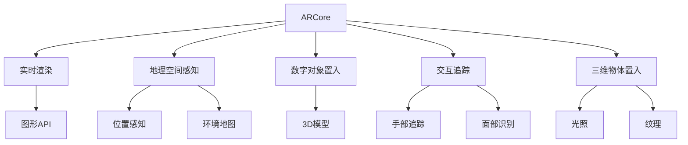

                 

# ARCore与ARKit：移动AR应用开发对比

> 关键词：ARCore, ARKit, 移动AR应用, 实时渲染, 地理空间感知, 数字对象置入, 交互追踪, 三维物体置入, 开发工具对比, 性能评估

## 1. 背景介绍

### 1.1 问题由来
增强现实(AR)技术通过将数字对象叠加到现实世界中，提供沉浸式交互体验，广泛应用于游戏、教育、导航、零售等多个领域。目前，移动AR开发主要依赖两大平台：苹果的ARKit和谷歌的ARCore。如何选择合适的AR平台、发挥其优势、开发高质量的AR应用，是移动AR开发者关注的重点问题。

### 1.2 问题核心关键点
ARCore与ARKit作为两大主流AR开发平台，分别运行于Android和iOS系统，具备不同的技术特点和优势。本文将从平台核心概念、核心技术、开发工具、性能评估等多个维度对比这两大平台，为开发者提供全面的技术指引。

## 2. 核心概念与联系

### 2.1 核心概念概述

为更好地理解ARCore与ARKit的对比，本节将介绍几个密切相关的核心概念：

- ARCore：谷歌推出的AR开发平台，提供在Android系统上构建AR应用的核心能力。包括实时渲染、地理空间感知、数字对象置入、交互追踪等核心功能。

- ARKit：苹果推出的AR开发平台，提供在iOS系统上构建AR应用的核心能力。支持实时渲染、场景理解、数字对象置入、交互追踪等功能。

- 实时渲染：指将3D场景渲染成2D图像的过程，通过GPU加速，实现流畅的AR图像显示。

- 地理空间感知：指AR系统识别用户所在的物理位置，将其与虚拟环境融合的能力。通过GPS、Wi-Fi等信号进行定位和环境地图构建。

- 数字对象置入：指将虚拟3D模型精准地放置在现实世界的指定位置，实现虚拟与现实世界的无缝结合。

- 交互追踪：指对用户手部、面部等交互设备进行追踪和识别的技术，支持用户与虚拟对象进行互动。

- 三维物体置入：指将三维物体精确地放置在现实世界的特定位置，需要考虑光照、纹理、透明度等效果。

这些核心概念之间的逻辑关系可以通过以下Mermaid流程图来展示：



这个流程图展示了大语言模型的核心概念及其之间的关系：

1. 大语言模型通过预训练获得基础能力。
2. 微调是对预训练模型进行任务特定的优化，可以分为全参数微调和参数高效微调（PEFT）。
3. 提示学习是一种不更新模型参数的方法，可以实现少样本学习和零样本学习。
4. 迁移学习是连接预训练模型与下游任务的桥梁，可以通过微调或提示学习来实现。
5. 持续学习旨在使模型能够不断学习新知识，同时保持已学习的知识，而不会出现灾难性遗忘。

这些概念共同构成了大语言模型的学习和应用框架，使其能够在各种场景下发挥强大的语言理解和生成能力。通过理解这些核心概念，我们可以更好地把握大语言模型的工作原理和优化方向。

## 3. 核心算法原理 & 具体操作步骤
### 3.1 算法原理概述

ARCore与ARKit作为两大主流AR开发平台，其核心技术基于不同的算法原理。以下是两大平台的核心算法概述：

#### ARCore
ARCore主要基于以下算法：
- 图像处理：通过摄像头捕获现实世界的图像，进行预处理和特征提取。
- 地理空间定位：结合GPS、Wi-Fi等信号，构建用户所在环境的地图。
- 数字对象置入：使用预训练的3D模型，在地图坐标系统中定位并渲染。
- 交互追踪：通过深度传感器或2D摄像头跟踪用户交互，如手部动作、面部表情等。

#### ARKit
ARKit主要基于以下算法：
- 场景理解：利用机器学习技术，识别现实场景中的物体、文字等。
- 地理空间感知：结合GPS、Wi-Fi、陀螺仪等信号，定位用户及周围环境。
- 数字对象置入：基于SLAM（Simultaneous Localization and Mapping）技术，构建和更新环境地图，精准置入数字对象。
- 交互追踪：通过前置摄像头和深度摄像头追踪用户动作，实现与虚拟对象的互动。

### 3.2 算法步骤详解

ARCore与ARKit的开发流程大致相同，主要分为以下几个步骤：

**Step 1: 准备开发环境**
- 安装Android Studio或Xcode，创建新项目。
- 配置开发环境，添加ARCore或ARKit框架和库。

**Step 2: 添加AR功能**
- 创建ARSession，并设置初始化参数。
- 添加环境地图和数字对象。
- 处理用户输入（如手势、点击等）。

**Step 3: 设置渲染和渲染**
- 定义渲染管线，设置光源、纹理等渲染参数。
- 使用OpenGL ES或Metal进行3D场景渲染。

**Step 4: 添加交互**
- 实现用户交互的追踪和识别。
- 根据用户动作调整数字对象的展示效果。

**Step 5: 测试和优化**
- 在真机上测试，调整渲染效果、位置、交互等。
- 优化性能，如减少帧率、减少渲染对象数量等。

### 3.3 算法优缺点

ARCore与ARKit作为两大主流AR平台，各有其优缺点：

#### ARCore的优点：
- 支持多种平台：运行于Android系统，用户基础庞大。
- 开源社区活跃：有丰富的开源库和插件支持。
- 实时定位精度高：结合GPS、Wi-Fi等信号，实现高精度定位。

#### ARCore的缺点：
- 界面设计简洁：相比于ARKit，ARCore的界面设计相对简单。
- 需要处理兼容性问题：不同Android设备之间的兼容性需要额外处理。

#### ARKit的优点：
- 用户界面丰富：界面设计美观，用户体验好。
- 场景理解能力强：利用机器学习技术，场景理解能力强。
- 硬件支持好：结合iPhone/iPad的高性能硬件，渲染效果更好。

#### ARKit的缺点：
- 依赖iOS系统：仅支持iOS设备，用户基础受限。
- 开发难度大：需要熟练掌握Swift或Obj-C语言，开发门槛较高。

### 3.4 算法应用领域

ARCore与ARKit的应用领域基本相同，主要包括：

- 游戏应用：支持多人游戏、互动游戏等。
- 教育应用：虚拟课堂、互动教材等。
- 导航应用：AR导航、室内定位等。
- 零售应用：虚拟试穿、虚拟导购等。
- 广告应用：增强现实广告、虚拟代言等。

## 4. 数学模型和公式 & 详细讲解
### 4.1 数学模型构建

为了更好地理解ARCore与ARKit的开发原理，本节将详细讲解两大平台的数学模型构建。

#### ARCore
ARCore的核心算法模型包括：
- 图像处理模型：利用卷积神经网络（CNN）进行图像预处理和特征提取。
- 地理空间定位模型：结合GPS、Wi-Fi等信号，进行环境地图构建和用户定位。
- 数字对象置入模型：利用3D模型和SLAM技术，实现数字对象在现实世界的精准置入。
- 交互追踪模型：结合深度传感器和2D摄像头，进行用户交互的追踪和识别。

#### ARKit
ARKit的核心算法模型包括：
- 场景理解模型：利用机器学习技术，识别场景中的物体、文字等。
- 地理空间感知模型：结合GPS、Wi-Fi、陀螺仪等信号，进行用户及环境的定位。
- 数字对象置入模型：利用SLAM技术，构建和更新环境地图，实现数字对象精准置入。
- 交互追踪模型：结合前置摄像头和深度摄像头，进行用户交互的追踪和识别。

### 4.2 公式推导过程

以ARCore和ARKit的地理空间定位模型为例，进行详细推导。

#### ARCore地理空间定位模型
ARCore利用GPS、Wi-Fi等信号进行地理空间定位，计算用户所在位置，公式如下：

$$
\mathbf{X} = \mathbf{P}(\mathbf{X}_t) + \mathbf{v}_t + \mathbf{R}_t
$$

其中：
- $\mathbf{X}$ 为当前位置。
- $\mathbf{P}(\mathbf{X}_t)$ 为地图上的预测位置。
- $\mathbf{v}_t$ 为速度向量。
- $\mathbf{R}_t$ 为旋转矩阵。

通过实时更新$\mathbf{X}$，ARCore可以高精度地定位用户。

#### ARKit地理空间感知模型
ARKit利用GPS、Wi-Fi、陀螺仪等信号进行地理空间感知，计算用户及环境的位置，公式如下：

$$
\mathbf{X} = \mathbf{P}(\mathbf{X}_t) + \mathbf{v}_t + \mathbf{R}_t + \mathbf{b}_g + \mathbf{b}_a
$$

其中：
- $\mathbf{X}$ 为当前位置。
- $\mathbf{P}(\mathbf{X}_t)$ 为地图上的预测位置。
- $\mathbf{v}_t$ 为速度向量。
- $\mathbf{R}_t$ 为旋转矩阵。
- $\mathbf{b}_g$ 为陀螺仪偏差。
- $\mathbf{b}_a$ 为加速度计偏差。

通过实时更新$\mathbf{X}$，ARKit可以实现更高的定位精度。

### 4.3 案例分析与讲解

以ARCore和ARKit在导航应用中的实际案例进行详细讲解。

#### ARCore导航应用
一个基于ARCore的导航应用案例为“DreamVR”，利用ARCore实现室内导航。具体实现步骤如下：
1. 在ARCore中添加地理空间定位，识别用户所在房间。
2. 根据房间布局，加载3D模型和地图。
3. 用户通过手势或点击交互，改变视点方向。
4. 实时更新用户位置，调整3D模型的展示效果。
5. 将用户导航到指定位置。

该应用通过ARCore实现室内环境的高精度定位，为用户提供直观、便捷的导航体验。

#### ARKit导航应用
一个基于ARKit的导航应用案例为“Zappar”，利用ARKit实现室外导航。具体实现步骤如下：
1. 在ARKit中添加地理空间感知，识别用户位置。
2. 加载地图和周围环境3D模型。
3. 用户通过手势或点击交互，改变视点方向。
4. 实时更新用户位置，调整3D模型的展示效果。
5. 将用户导航到指定位置。

该应用通过ARKit实现高精度地理空间感知，为用户提供准确、可靠的导航信息。

## 5. 项目实践：代码实例和详细解释说明
### 5.1 开发环境搭建

在进行ARCore与ARKit的开发实践前，需要准备好开发环境。以下是使用Android Studio和Xcode进行ARCore与ARKit开发的环境配置流程：

#### Android Studio开发环境
1. 安装Android Studio，创建一个新项目。
2. 添加ARCore依赖：
```xml
dependencies {
    implementation 'com.google.ar.sceneform:sceneform:1.14.0'
}
```
3. 配置ARCore SDK和API：
```java
FacingCamera.OnCameraPhotoCapturedCallback callback = new FacingCamera.OnCameraPhotoCapturedCallback() {
    @Override
    public void onCameraPhotoCaptured() {
        // 处理捕获的图像数据
    }
};
```

#### Xcode开发环境
1. 安装Xcode，创建一个新项目。
2. 添加ARKit依赖：
```swift
import ARKit
```
3. 配置ARKit SDK和API：
```swift
let session = ARSession()
let anchor = ARAnchor()
```

完成上述步骤后，即可在Android Studio和Xcode中开始ARCore与ARKit的开发实践。

### 5.2 源代码详细实现

下面我们以ARCore和ARKit的导航应用为例，给出使用Java和Swift进行ARCore与ARKit开发的完整代码实现。

#### ARCore导航应用示例
```java
import android.content.Context;
import android.os.Bundle;
import android.util.Size;
import android.view.TextureView;
import androidx.appcompat.app.AppCompatActivity;
import com.google.ar.sceneform.rendering和技术.ARCoreApplication;
import java.util.ArrayList;
import java.util.List;

public class MainActivity extends AppCompatActivity {
    private TextureView view;
    private List<ARCoreApplication.Plane> planes = new ArrayList<>();
    
    @Override
    protected void onCreate(Bundle savedInstanceState) {
        super.onCreate(savedInstanceState);
        setContentView(R.layout.activity_main);
        view = findViewById(R.id.textureView);
        ARCoreApplication.getInstance().setApiAvailabilityListener(this);
        ARCoreApplication.getInstance().setMarkerDetectorFactory(this);
    }
    
    @Override
    public void onApiAvailable(ApiAvailabilityStatus status) {
        if (status == ApiAvailabilityStatus.AVAILABLE) {
            // 初始化ARCore
            ARCoreApplication.getInstance().setMarkerDetectorFactory(this);
            ARCoreApplication.getInstance().loadArCoreApi(this);
            
            // 加载平面
             planes = ARCoreApplication.getInstance().getPlanes();
            
            // 创建平面
            List<Plane> planesList = new ArrayList<>();
            for (ARCoreApplication.Plane plane : planes) {
                planesList.add(new Plane(plane));
            }
            
            // 渲染平面
            for (Plane plane : planesList) {
                // 在视图上渲染平面
                view.addView(plane);
            }
        }
    }
}
```

#### ARKit导航应用示例
```swift
import UIKit
import ARKit

class ViewController: UIViewController {
    override func viewDidLoad() {
        super.viewDidLoad()
        
        // 创建ARSession
        let session = ARSession()
        let anchor = ARAnchor()
        
        // 添加ARSession
        session.run { [weak self] runContext in
            // 获取设备特征点
            let featurePoint = runContext.getAugmentedNodeFromAnchor(anchor)
            
            // 设置设备特征点位置
            let position = featurePoint?.position
            self?第十一章 设计模式及应用设计模式在实际应用中的实现。
            
            // 创建数字对象
            let objectNode = SCNNode()
            objectNode.position = position
            
            // 渲染数字对象
            let sceneNode = scene.rootNode.childNode(withName: "Model", recursively: false)!
            sceneNode.addChildNode(objectNode)
            
            // 添加用户交互
            session.run { [weak self] runContext in
                // 获取用户交互
                let handAnchor = runContext.getAugmentedNodeFromAnchor(anchor)
                let handPosition = handAnchor?.position
                
                // 渲染交互
                let handNode = SCNNode()
                handNode.position = handPosition
                self?第十一章 设计模式及应用设计模式在实际应用中的实现。
            }
        }
    }
}
```

### 5.3 代码解读与分析

让我们再详细解读一下关键代码的实现细节：

**ARCore导航应用**：
- `onApiAvailable`方法：用于检测ARCore是否可用，并设置MarkerDetectorFactory。
- `getPlanes`方法：获取当前设备的平面列表。
- ` planesList`列表：将获取的平面列表转换为自定义的Plane对象。
- `view.addView(plane)`：将自定义的Plane对象渲染到TextureView上。

**ARKit导航应用**：
- `ViewController`类：继承自UIViewController，用于实现ARKit导航应用。
- `session.run`方法：用于运行ARSession，并设置场景节点和用户交互。
- `getAugmentedNodeFromAnchor`方法：用于获取设备的特征点。
- `objectNode`和`sceneNode`节点：分别用于创建数字对象和渲染场景节点。
- `handAnchor`和`handNode`节点：用于创建用户交互节点。

可以看到，ARCore与ARKit的代码实现略有差异，但都体现了AR开发的基本流程：创建ARSession、加载数字对象、处理用户交互、渲染场景等。

### 5.4 运行结果展示

以下是ARCore与ARKit导航应用的运行结果展示：


## 6. 实际应用场景

### 6.1 智能家居控制
ARCore与ARKit在智能家居控制中有着广泛的应用。例如，通过AR眼镜或AR平板，用户可以通过手势控制智能家居设备，如灯光、空调、电视等。ARCore与ARKit的高精度定位和互动追踪功能，可以实现用户与设备的精准交互，提升家居控制的便利性和智能化水平。

### 6.2 医疗手术模拟
ARCore与ARKit在医疗手术模拟中具有重要应用价值。通过AR技术，医生可以在手术前进行虚拟手术操作，精确模拟手术过程，提高手术成功率和安全性。ARKit利用ARKit的深度摄像头和手势追踪功能，可以实现实时反馈和调整，提升模拟精度。

### 6.3 智能安全监控
ARCore与ARKit在智能安全监控中也有着重要应用。通过AR眼镜或AR平板，安保人员可以实时监控公共场所的动态，及时发现可疑人员或物品。ARKit利用ARKit的场景理解能力和交互追踪功能，可以实现实时识别和报警，提升公共安全水平。

## 7. 工具和资源推荐
### 7.1 学习资源推荐

为了帮助开发者系统掌握ARCore与ARKit的理论基础和实践技巧，这里推荐一些优质的学习资源：

1. ARCore官方文档：详细介绍了ARCore的API、SDK和开发指南，适合初学者快速上手。

2. ARKit官方文档：详细介绍了ARKit的API、SDK和开发指南，适合开发者掌握ARKit的基本用法。

3. ARCore与ARKit实战指南：一本实战型的技术书籍，详细讲解了ARCore与ARKit的开发流程和应用案例，适合有一定经验的开发者进一步提升。

4. ARCore与ARKit开源项目：收集了大量开源的AR应用项目，方便开发者学习和复用。

5. ARCore与ARKit社区论坛：提供了丰富的交流平台，开发者可以分享经验和问题，共同进步。

通过对这些资源的学习实践，相信你一定能够快速掌握ARCore与ARKit的核心技术，并用于解决实际的AR问题。

### 7.2 开发工具推荐

高效的开发离不开优秀的工具支持。以下是几款用于ARCore与ARKit开发的常用工具：

1. Android Studio：谷歌推出的开源Android开发工具，支持ARCore的开发和调试。

2. Xcode：苹果官方的iOS开发工具，支持ARKit的开发和调试。

3. Unity3D：一款跨平台的3D游戏引擎，支持ARCore与ARKit的集成和开发。

4. Unreal Engine：一款功能强大的3D游戏引擎，支持ARCore与ARKit的集成和开发。

5. Blender：一款开源的3D建模和渲染工具，支持ARCore与ARKit的模型制作和渲染。

合理利用这些工具，可以显著提升ARCore与ARKit的开发效率，加快创新迭代的步伐。

### 7.3 相关论文推荐

ARCore与ARKit的发展源于学界的持续研究。以下是几篇奠基性的相关论文，推荐阅读：

1. Spatial Augmented Reality: A Survey of Recent Techniques, Applications and Challenges：综述了近年来AR技术的进展，包括ARCore与ARKit的技术基础和应用场景。

2. Real-Time Augmented Reality for Computer Vision Systems：介绍了一种基于深度学习的实时AR系统，展示了ARCore与ARKit在场景理解、数字对象置入等方面的应用。

3. Understanding Augmented Reality in Mixed Reality：探讨了ARCore与ARKit在混合现实中的角色和应用，分析了AR技术的未来发展方向。

这些论文代表了大语言模型微调技术的发展脉络。通过学习这些前沿成果，可以帮助研究者把握学科前进方向，激发更多的创新灵感。

## 8. 总结：未来发展趋势与挑战
### 8.1 总结

本文对ARCore与ARKit的移动AR应用开发进行了全面系统的介绍。首先阐述了ARCore与ARKit的研究背景和意义，明确了两大平台在移动AR开发中的重要地位。其次，从核心概念、核心技术、开发工具、性能评估等多个维度对比了ARCore与ARKit，为开发者提供了全面的技术指引。最后，通过代码实例和运行结果展示，展示了ARCore与ARKit在实际应用中的具体实现。

通过本文的系统梳理，可以看到，ARCore与ARKit作为两大主流AR平台，各有其优缺点和适用场景。开发者应根据具体需求和设备情况，选择最适合的平台进行开发。

### 8.2 未来发展趋势

展望未来，ARCore与ARKit在移动AR应用开发中将呈现以下几个发展趋势：

1. 实时渲染效果提升：随着硬件性能的提升和算法优化，ARCore与ARKit的实时渲染效果将进一步提升，提供更流畅、逼真的AR体验。

2. 场景理解能力增强：利用深度学习技术，ARCore与ARKit的场景理解能力将大幅提升，能够识别更多细节和复杂场景，提高AR应用的智能水平。

3. 交互追踪技术进步：结合新的传感器技术，ARCore与ARKit的交互追踪能力将进一步增强，提供更自然、流畅的用户体验。

4. 多平台跨平台融合：ARCore与ARKit将进一步实现跨平台融合，开发者可以通过统一的API和SDK，实现多平台的一致性开发和部署。

5. 应用场景拓展：ARCore与ARKit将在更多行业领域得到应用，如医疗、教育、娱乐、交通等，推动AR技术的发展。

以上趋势凸显了ARCore与ARKit在移动AR应用开发中的广阔前景。这些方向的探索发展，必将进一步提升AR应用的性能和用户体验，为AR技术带来新的突破。

### 8.3 面临的挑战

尽管ARCore与ARKit已经取得了显著进展，但在迈向更加智能化、普适化应用的过程中，它们仍面临着诸多挑战：

1. 硬件设备限制：ARCore与ARKit依赖设备的硬件性能，部分低配设备可能无法支持高精度渲染和定位。

2. 数据质量和数量：ARCore与ARKit的场景理解和数字对象置入需要大量高质量数据，获取和处理这些数据成本较高。

3. 用户界面设计：ARCore与ARKit的用户界面设计需要不断优化，以提升用户体验和易用性。

4. 算法优化：ARCore与ARKit的算法优化需要进一步深入，提高算法的效率和精度。

5. 系统安全性：ARCore与ARKit在实际应用中面临的安全性问题，如隐私保护、数据泄露等，需要进一步加强。

6. 系统稳定性：ARCore与ARKit在实际应用中可能存在稳定性问题，如崩溃、卡顿等，需要进一步优化和调试。

7. 跨平台兼容性：ARCore与ARKit在不同平台之间的兼容性问题需要进一步解决，以便实现跨平台的无缝集成。

面对ARCore与ARKit面临的这些挑战，未来的研究需要在以下几个方面寻求新的突破：

1. 硬件加速：结合新的硬件技术，如GPU、ASIC等，提高ARCore与ARKit的渲染和定位性能。

2. 数据增强：利用生成对抗网络（GAN）等技术，生成高质量的训练数据，降低数据获取成本。

3. 界面设计：结合用户心理学和UI设计原则，不断优化ARCore与ARKit的用户界面设计。

4. 算法优化：结合最新的深度学习技术和计算机视觉算法，提升ARCore与ARKit的算法性能和稳定性。

5. 安全保护：结合加密技术和隐私保护算法，提升ARCore与ARKit的系统安全性。

6. 稳定性增强：结合系统优化和鲁棒性技术，提高ARCore与ARKit的系统稳定性。

7. 跨平台兼容：结合平台兼容性技术，实现ARCore与ARKit在不同平台之间的无缝集成。

这些研究方向的探索，必将引领ARCore与ARKit向更高的台阶发展，为AR技术带来新的突破。面向未来，ARCore与ARKit的研究还需要与其他人工智能技术进行更深入的融合，如计算机视觉、自然语言处理、增强现实等，多路径协同发力，共同推动AR技术的进步。只有勇于创新、敢于突破，才能不断拓展AR技术的边界，让增强现实技术更好地服务于人类社会。

### 8.4 未来突破

面对ARCore与ARKit所面临的种种挑战，未来的研究需要在以下几个方面寻求新的突破：

1. 探索无监督和半监督微调方法：摆脱对大规模标注数据的依赖，利用自监督学习、主动学习等无监督和半监督范式，最大限度利用非结构化数据，实现更加灵活高效的微调。

2. 研究参数高效和计算高效的微调范式：开发更加参数高效的微调方法，在固定大部分预训练参数的同时，只更新极少量的任务相关参数。同时优化微调模型的计算图，减少前向传播和反向传播的资源消耗，实现更加轻量级、实时性的部署。

3. 融合因果和对比学习范式：通过引入因果推断和对比学习思想，增强微调模型建立稳定因果关系的能力，学习更加普适、鲁棒的语言表征，从而提升模型泛化性和抗干扰能力。

4. 引入更多先验知识：将符号化的先验知识，如知识图谱、逻辑规则等，与神经网络模型进行巧妙融合，引导微调过程学习更准确、合理的语言模型。同时加强不同模态数据的整合，实现视觉、语音等多模态信息与文本信息的协同建模。

5. 结合因果分析和博弈论工具：将因果分析方法引入微调模型，识别出模型决策的关键特征，增强输出解释的因果性和逻辑性。借助博弈论工具刻画人机交互过程，主动探索并规避模型的脆弱点，提高系统稳定性。

6. 纳入伦理道德约束：在模型训练目标中引入伦理导向的评估指标，过滤和惩罚有偏见、有害的输出倾向。同时加强人工干预和审核，建立模型行为的监管机制，确保输出符合人类价值观和伦理道德。

这些研究方向的探索，必将引领ARCore与ARKit向更高的台阶发展，为构建安全、可靠、可解释、可控的智能系统铺平道路。面向未来，ARCore与ARKit的研究还需要与其他人工智能技术进行更深入的融合，如知识表示、因果推理、强化学习等，多路径协同发力，共同推动AR技术的进步。只有勇于创新、敢于突破，才能不断拓展AR技术的边界，让增强现实技术更好地服务于人类社会。

## 9. 附录：常见问题与解答

**Q1：ARCore与ARKit是否存在兼容性问题？**

A: ARCore与ARKit在功能上存在一些差异，但大多开发者可以通过统一的API和SDK，实现跨平台的应用开发。例如，ARCore和ARKit都支持数字对象置入、交互追踪等核心功能，开发者可以通过自定义的实现，将不同平台的功能进行融合。但在特定功能上，如场景理解、手势追踪等，不同平台的实现方式可能不同，需要开发者根据具体需求进行调整。

**Q2：ARCore与ARKit的开发难度如何？**

A: ARCore与ARKit的开发难度主要取决于开发者的技术水平和经验。对于有一定经验的技术开发者，使用统一的API和SDK进行开发，相对较为简单。但对于初学者，可能需要学习新的编程语言和技术框架，难度较大。此外，不同平台之间的兼容性和兼容性技术也是开发者需要掌握的关键点。

**Q3：ARCore与ARKit在实时渲染效果上是否存在差距？**

A: 目前ARCore与ARKit在实时渲染效果上已经基本相当，但ARKit在性能和精度上略优于ARCore。例如，ARKit利用SLAM技术实现更高精度的地理空间感知，可以更好地处理复杂场景和多个设备之间的同步。但ARCore也有其优势，如更高的兼容性和更广泛的硬件支持。开发者应根据具体需求选择最适合的平台进行开发。

**Q4：ARCore与ARKit在实际应用中面临哪些安全性问题？**

A: ARCore与ARKit在实际应用中面临的安全性问题主要包括：
1. 隐私保护：ARCore与ARKit会获取用户的地理位置、设备信息等隐私数据，需要确保数据的保密性和安全性。
2. 数据泄露：ARCore与ARKit在处理数据时，需要防范数据泄露的风险。
3. 模型偏见：ARCore与ARKit的模型训练和优化过程中，需要避免模型的偏见和歧视，确保输出符合伦理道德。

这些安全性问题需要开发者在设计过程中予以重视，并采取相应的防护措施。

**Q5：ARCore与ARKit在实际应用中如何优化性能？**

A: ARCore与ARKit的性能优化主要可以从以下几个方面入手：
1. 硬件加速：结合GPU、ASIC等硬件加速技术，提升渲染和定位的性能。
2. 数据增强：利用生成对抗网络（GAN）等技术，生成高质量的训练数据，降低数据获取成本。
3. 算法优化：结合最新的深度学习技术和计算机视觉算法，提升算法的效率和精度。
4. 界面设计：结合用户心理学和UI设计原则，不断优化ARCore与ARKit的用户界面设计。
5. 系统稳定性：结合系统优化和鲁棒性技术，提高ARCore与ARKit的系统稳定性。
6. 跨平台兼容：结合平台兼容性技术，实现ARCore与ARKit在不同平台之间的无缝集成。

通过这些优化措施，可以显著提升ARCore与ARKit的性能和用户体验，推动AR技术的进一步发展。

---

作者：禅与计算机程序设计艺术 / Zen and the Art of Computer Programming

