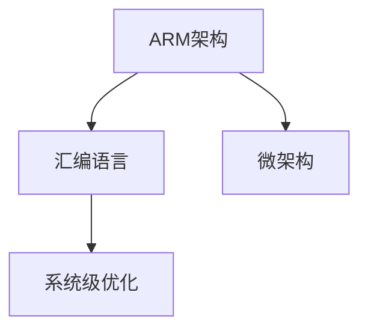

                 

# ARM汇编语言程序设计

> 关键词：ARM汇编,编程范式,微架构,系统级优化,实时系统

## 1. 背景介绍

在计算机体系结构领域，ARM汇编语言一直处于核心地位。ARM架构以其高效、低功耗、灵活性高而著称，广泛应用于嵌入式系统、移动设备、物联网等诸多领域。掌握ARM汇编语言的编程技巧，对于理解计算机底层原理、进行系统级优化、开发高效稳定的系统具有重要意义。本文章将系统讲解ARM汇编语言的设计思想、核心概念和典型应用，希望读者能从中找到学习和实践的灵感。

## 2. 核心概念与联系

### 2.1 核心概念概述

ARM汇编语言是一种针对ARM架构的低级编程语言，其核心概念包括：

- **ARM架构**：ARM是一种RISC（Reduced Instruction Set Computing）架构，以其精简的指令集、高速的执行效率和低功耗而闻名。ARM架构分为ARM、ARMv4、ARMv5、ARMv6、ARMv7、ARMv8等多个版本，每版本都有显著的性能提升和功能增强。
- **汇编语言**：ARM汇编语言是由汇编器将高级语言源代码翻译成机器指令的文本形式的语言，其指令可以更加贴近硬件特性，进行高效的编程。
- **微架构**：微架构是CPU的内部设计，决定了其性能和功耗。ARM架构微架构设计注重多核、缓存、流水线、分支预测等功能，以提高执行效率和并行处理能力。
- **系统级优化**：系统级优化是指通过优化程序的结构、算法、数据和硬件资源，达到提升系统性能、降低功耗、提高稳定性的目的。ARM汇编语言的编程对系统级优化尤为重要，因为每条指令都直接对硬件资源进行访问和操作。

这些概念之间的联系可以通过以下Mermaid流程图来展示：



## 3. 核心算法原理 & 具体操作步骤

### 3.1 算法原理概述

ARM汇编语言的编程基于RISC架构的指令集设计，其核心算法原理包括：

- **指令集设计**：ARM指令集包含算术、逻辑、数据传输、分支控制等常见指令，以及一些专门用于优化性能的特殊指令。
- **条件码与状态寄存器**：ARM架构的CCR（条件码与状态寄存器）记录了指令执行后的状态信息，如进位标志、零标志、负标志等，用于分支预测和条件执行。
- **流水线和中断**：ARM架构支持高效的多级流水线和中断机制，通过硬件并行和异步处理提升系统响应速度和处理能力。

### 3.2 算法步骤详解

ARM汇编语言的编程步骤如下：

**Step 1: 设计程序算法**

- 确定算法思路，将算法转换成伪代码。
- 将伪代码中的复杂逻辑拆分成基本操作单元，这些单元将成为汇编指令的基本单位。

**Step 2: 编写汇编程序**

- 使用ARM汇编器（如GNU Assembler）将伪代码翻译成ARM汇编代码。
- 编写包括指令、数据和跳转等基本元素，实现算法的功能逻辑。

**Step 3: 进行系统级优化**

- 使用ARM汇编语言的特性进行系统级优化，如调整数据对齐、选择合适的指令、优化条件分支、处理中断等。
- 通过模拟器或真实硬件进行测试，分析性能瓶颈，进一步优化程序。

**Step 4: 调试与优化**

- 使用调试工具（如GDB）进行汇编代码的调试和断点设置。
- 分析性能指标，如CPI（Cycles Per Instruction）、IPC（Instructions Per Cycle）等，进行优化调整。

**Step 5: 测试与部署**

- 在真实的硬件平台上进行测试，验证程序的性能和稳定性。
- 部署程序到目标设备，进行系统级优化和运行调优。

### 3.3 算法优缺点

ARM汇编语言的优点包括：

- **高效性**：ARM汇编语言直接访问硬件资源，优化机会多，执行效率高。
- **灵活性**：汇编语言可以根据具体需求进行精细调整，灵活度高。
- **可控性**：汇编语言对硬件控制更直接，可以更好地控制程序的行为。

缺点包括：

- **复杂性**：汇编语言对硬件特性要求高，学习难度大。
- **调试困难**：汇编程序的调试相对困难，需要具备较高的专业知识和经验。
- **可移植性差**：汇编代码针对具体硬件平台编写，可移植性较差。

### 3.4 算法应用领域

ARM汇编语言的应用领域包括：

- **嵌入式系统**：ARM架构的微控制器广泛应用于各种嵌入式设备，如智能卡、汽车电子、消费电子等。
- **移动设备**：ARM架构的智能手机、平板电脑等移动设备，对性能和功耗有高要求。
- **物联网**：物联网设备对低功耗和高效计算有较高需求，ARM汇编语言可以优化这些设备的功能。
- **实时系统**：ARM汇编语言具有高实时响应能力，适用于工业控制、医疗设备等对实时性要求高的应用。

## 4. 数学模型和公式 & 详细讲解 & 举例说明

### 4.1 数学模型构建

ARM汇编语言编程中，常用的数学模型包括：

- **流水线模型**：描述ARM架构的指令执行过程，包括取指、译码、执行、写回等阶段。
- **中断模型**：描述中断处理的流程，包括中断请求、中断响应、中断处理和返回等步骤。
- **性能模型**：评估程序的执行效率，包括CPI、IPC等指标，通过数学公式计算得出。

### 4.2 公式推导过程

以CPI（Cycles Per Instruction）的计算为例，ARM架构的CPI模型如下：

$$
\text{CPI} = \frac{\text{Cycles}}{\text{Instructions}}
$$

其中，Cycles表示执行指令所需的周期数，Instructions表示执行的指令数。

在实际计算中，可以通过如下方式得到CPI值：

1. 使用性能计数器记录指令执行的周期数。
2. 使用硬件指令计数器记录执行的指令数。
3. 计算CPI = 周期数 / 指令数。

### 4.3 案例分析与讲解

以ARMv8指令集为例，其指令分为两类：普通指令和扩展指令。普通指令用于基本的数据处理、控制流程等，扩展指令则用于特定的功能，如异常处理、向量计算等。以下是一个简单的ARMv8汇编程序，实现基本的加法操作：

```asm
.global main
text:
    add       x0, x1, x2        // 将x1与x2相加，结果存入x0
    ret
main:
    ldr x1, =text           // 加载程序入口地址到x1寄存器
    ldr x2, =data           // 加载数据地址到x2寄存器
    bl text                 // 跳转到text入口函数
    bx lr                 // 返回调用栈
data:
    .word 10
```

## 5. 项目实践：代码实例和详细解释说明

### 5.1 开发环境搭建

为了进行ARM汇编语言的编程和调试，需要搭建如下开发环境：

1. **ARM架构处理器**：可以是真实硬件设备，如STM32单片机，也可以是虚拟硬件，如QEMU模拟器。
2. **汇编器与调试器**：常用的工具有GNU Assembler和GDB。

### 5.2 源代码详细实现

以下是一个简单的ARM汇编程序，实现基本的加法操作：

```asm
.global main
text:
    add       x0, x1, x2        // 将x1与x2相加，结果存入x0
    ret
main:
    ldr x1, =text           // 加载程序入口地址到x1寄存器
    ldr x2, =data           // 加载数据地址到x2寄存器
    bl text                 // 跳转到text入口函数
    bx lr                 // 返回调用栈
data:
    .word 10
```

代码解释如下：

- `.text`：代码段，存放程序的机器码。
- `main`：入口函数名。
- `add x0, x1, x2`：将x1与x2相加，结果存入x0。
- `ldr x1, =text`：加载程序入口地址到x1寄存器。
- `ldr x2, =data`：加载数据地址到x2寄存器。
- `bl text`：跳转到text入口函数。
- `bx lr`：返回调用栈。
- `.data`：数据段，存放常量和变量。

### 5.3 代码解读与分析

通过上述代码，我们可以看到ARM汇编语言的基本结构：

- 程序入口函数（`main`）：程序从哪里开始执行。
- 数据段（`.data`）：存放常量和变量，位于程序的起始位置。
- 代码段（`.text`）：存放程序的可执行指令。
- 函数调用（`bl`）：通过函数名调用函数，使用返回地址保存当前函数的执行位置。
- 函数返回（`bx lr`）：返回调用栈，执行返回地址。

## 6. 实际应用场景

### 6.1 嵌入式系统

ARM汇编语言在嵌入式系统中的应用广泛，例如：

- **STM32单片机**：使用ARM汇编语言实现嵌入式系统的驱动程序，如GPIO、UART、I2C等。
- **物联网设备**：开发低功耗、高效计算的嵌入式系统程序，实现物联网设备的传感器数据采集、处理和通信。

### 6.2 移动设备

ARM汇编语言在移动设备中的应用包括：

- **Android系统**：使用ARM汇编语言实现Android设备的驱动程序，如GPU、触摸屏等。
- **Apple设备**：使用ARM汇编语言实现iOS设备的驱动程序，如相机、传感器等。

### 6.3 实时系统

ARM汇编语言在实时系统中的应用包括：

- **工业控制**：使用ARM汇编语言实现工业控制系统的驱动程序，如PLC、伺服器等。
- **医疗设备**：使用ARM汇编语言实现医疗设备的驱动程序，如心电图、超声波等。

## 7. 工具和资源推荐

### 7.1 学习资源推荐

为了深入学习ARM汇编语言，推荐以下资源：

- **《ARM汇编语言与嵌入式系统编程》**：介绍ARM汇编语言的基础知识和实际应用，包括嵌入式系统的编程技巧和调试方法。
- **《ARM嵌入式系统设计与开发》**：深入讲解ARM架构和嵌入式系统的设计，包括硬件接口、软件架构等。
- **《ARM微控制器及其编程》**：针对STM32等ARM微控制器，详细讲解其编程技巧和应用实例。
- **《ARM汇编语言程序设计》书籍**：系统讲解ARM汇编语言的设计思想、编程范式和实际应用，适合进阶学习。

### 7.2 开发工具推荐

为了提高ARM汇编语言编程的效率，推荐以下工具：

- **GNU Assembler**：常用的ARM汇编器，支持多种ARM架构版本。
- **GDB调试器**：强大的调试工具，支持ARM汇编语言的调试和断点设置。
- **QEMU模拟器**：虚拟ARM处理器，支持多种ARM架构版本，用于模拟和测试汇编程序。
- **STM32CubeIDE**：集成开发环境，支持STM32单片机的调试和开发，方便嵌入式系统的开发。

### 7.3 相关论文推荐

为了深入了解ARM汇编语言的最新研究进展，推荐以下论文：

- **《ARM Assembly Language Programming》**：介绍ARM汇编语言的编程技巧和应用实例，适合初学者和进阶学习。
- **《Optimizing ARM Assembly Code》**：介绍ARM汇编语言的系统级优化方法，适合高级开发者和研究人员。
- **《ARM Assembly Language Design》**：讲解ARM架构和汇编语言的设计思想，适合深入理解ARM汇编语言。

## 8. 总结：未来发展趋势与挑战

### 8.1 研究成果总结

ARM汇编语言在计算机体系结构和嵌入式系统领域具有重要的地位。通过掌握ARM汇编语言的编程技巧，开发者可以更好地理解计算机硬件特性，进行系统级优化，开发高效稳定的系统。

### 8.2 未来发展趋势

未来ARM汇编语言的发展趋势包括：

- **支持更多新特性**：ARM架构不断演进，新版本引入更多新特性，如向量计算、加密算法等。
- **优化工具和环境**：开发更多高效的工具和环境，支持ARM汇编语言的编程和调试。
- **支持更多平台**：支持更多ARM架构版本的平台，如Raspberry Pi、Apple M1等。

### 8.3 面临的挑战

ARM汇编语言在发展中也面临以下挑战：

- **学习难度高**：ARM汇编语言对硬件特性要求高，学习难度大。
- **工具和环境限制**：部分工具和环境支持有限，影响开发效率。
- **可移植性差**：汇编代码针对具体硬件平台编写，可移植性较差。

### 8.4 研究展望

未来的研究方向包括：

- **自动化优化工具**：开发自动化优化工具，如静态分析工具、代码生成器等，帮助开发者优化ARM汇编语言程序。
- **跨平台编译器**：开发跨平台的ARM汇编语言编译器，提高开发效率和可移植性。
- **新型指令集**：研究新型指令集设计，如Vector4、DSP指令集等，满足特定领域的需求。

## 9. 附录：常见问题与解答

**Q1：学习ARM汇编语言需要哪些基础知识？**

A: 学习ARM汇编语言需要具备以下基础知识：

- **计算机体系结构**：理解CPU的工作原理、指令集设计、流水线、缓存等。
- **操作系统基础**：理解操作系统的调度机制、进程管理、中断处理等。
- **C语言编程**：掌握C语言的编程技巧，理解数据结构和算法。

**Q2：ARM汇编语言与C语言的区别是什么？**

A: ARM汇编语言与C语言的区别如下：

- **指令与函数**：ARM汇编语言是低级语言，使用指令进行编程，而C语言是高级语言，使用函数进行编程。
- **数据类型**：ARM汇编语言使用寄存器、存储器等硬件资源进行数据处理，而C语言使用数据类型、变量等抽象概念进行数据处理。
- **控制流程**：ARM汇编语言使用跳转指令控制程序流程，而C语言使用条件语句、循环语句等控制结构。

**Q3：ARM汇编语言如何进行系统级优化？**

A: ARM汇编语言可以通过以下方式进行系统级优化：

- **指令选择**：选择高效的指令，如向量指令、优化指令等，提升程序执行效率。
- **数据对齐**：合理进行数据对齐，减少访问延迟和缓存未命中。
- **寄存器使用**：尽量使用寄存器进行数据处理，减少访存次数。
- **流水线优化**：优化指令流水线，提高并行处理能力。
- **中断优化**：优化中断处理流程，减少中断响应时间和处理开销。

**Q4：ARM汇编语言如何进行调试和断点设置？**

A: ARM汇编语言的调试和断点设置可以通过以下方式进行：

- **GDB调试器**：使用GDB调试器进行调试和断点设置，支持ARM汇编语言的调试功能。
- **LDBL调试器**：使用LDBL调试器进行调试和断点设置，支持ARM汇编语言的调试功能。
- **QEMU模拟器**：使用QEMU模拟器进行调试和断点设置，方便进行虚拟化调试。

通过以上章节的讲解，相信读者能够深入了解ARM汇编语言的设计思想、核心概念和编程技巧，能够将所学应用于实际开发中，实现高效、稳定的系统。

