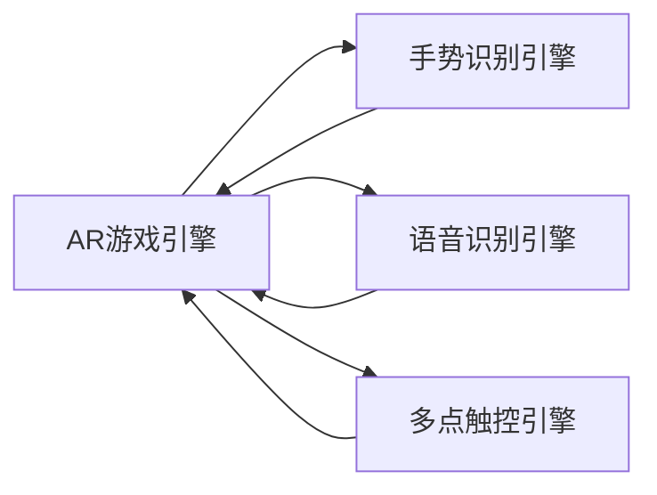

                 

# AR游戏交互设计与开发

## 1. 背景介绍

随着AR技术的不断发展，游戏行业迎来了新的机遇与挑战。AR游戏以其沉浸式体验、虚拟与现实相结合的特点，吸引了大批玩家和开发者。然而，传统的游戏交互设计已难以满足AR游戏的新需求，需重新思考和构建适合AR游戏的交互方式。本节将详细介绍AR游戏交互设计的背景和核心要点。

### 1.1 AR游戏定义与特点

增强现实游戏(AR Game)通过将虚拟元素叠加在现实世界之上，创建出介于虚拟与现实之间的游戏环境。其主要特点包括：

- **虚拟与现实的融合**：AR游戏将虚拟游戏元素与现实世界结合，实现玩家与虚拟世界的互动。
- **沉浸式体验**：通过头戴设备、手势识别等技术，提供更加沉浸和自然的游戏体验。
- **实时交互**：与传统游戏的静态场景不同，AR游戏强调玩家与虚拟环境的实时交互。

### 1.2 面临的挑战

AR游戏交互设计面临以下主要挑战：

- **物理环境的交互**：现实世界的复杂性和动态性使得AR游戏交互设计更为复杂。
- **视觉与触觉的融合**：AR游戏需要同时处理视觉和触觉信息，设计上需兼顾二者。
- **用户适应性**：用户对AR设备的适应程度影响游戏体验，交互设计需考虑用户习惯。

## 2. 核心概念与联系

### 2.1 核心概念概述

为更好地理解AR游戏交互设计，本节将介绍几个核心概念及其相互关系：

- **增强现实(AR)**：将数字信息叠加在现实世界的技术，用于游戏交互设计中的虚拟元素呈现。
- **虚拟现实(VR)**：一种完全沉浸式的虚拟环境，与AR结合可以创建更为丰富的游戏体验。
- **手势识别**：通过传感器捕捉用户手势动作，实现自然交互。
- **语音交互**：利用语音识别技术，实现声控交互，提升游戏的便捷性。
- **多点触控**：通过设备的多点触控功能，实现多维度的交互。

这些概念通过一定的方式结合，形成了AR游戏的交互设计框架，如图1所示：

```mermaid
graph LR
    A[增强现实(AR)] --> B[虚拟现实(VR)]
    B --> C[手势识别]
    B --> D[语音交互]
    A --> E[多点触控]
```

### 2.2 核心概念原理和架构的 Mermaid 流程图

以下是AR游戏交互设计的原理和架构图，展示了各组件之间的联系和数据流动：



**图1. AR游戏交互设计概念图**

## 3. 核心算法原理 & 具体操作步骤

### 3.1 算法原理概述

AR游戏交互设计的核心算法原理包括手势识别、语音识别和多点触控等，其实现原理涉及图像处理、信号处理和模式识别等多个领域。以下简要介绍这些核心算法的原理。

### 3.2 算法步骤详解

#### 3.2.1 手势识别算法

手势识别算法主要通过摄像头捕捉用户的手部动作，通过机器学习和图像处理技术，识别和跟踪手势动作。主要步骤如下：

1. **图像采集**：使用摄像头实时采集用户的手部图像。
2. **预处理**：对采集到的图像进行预处理，包括去噪、灰度化、归一化等。
3. **特征提取**：使用边缘检测、角点提取等技术，提取手部特征点。
4. **模式识别**：利用机器学习模型(如SVM、深度学习)对手部动作进行分类识别。

#### 3.2.2 语音识别算法

语音识别算法通过麦克风捕捉用户的语音信号，并利用语音处理技术，将其转换为文本信息。主要步骤如下：

1. **信号采集**：使用麦克风采集用户的语音信号。
2. **预处理**：对采集到的语音信号进行预处理，包括降噪、滤波等。
3. **特征提取**：提取语音信号的特征，如MFCC、Mel谱等。
4. **模式识别**：利用机器学习模型(如隐马尔可夫模型、深度学习)对语音进行识别。

#### 3.2.3 多点触控算法

多点触控算法主要通过触摸屏的多点压力和位置信息，识别用户的触摸操作。主要步骤如下：

1. **信号采集**：使用触摸屏采集用户的多点触控信号。
2. **预处理**：对采集到的信号进行预处理，包括滤波、降噪等。
3. **特征提取**：提取触控信号的特征，如位置、压力、时间等。
4. **模式识别**：利用机器学习模型(如SVM、深度学习)对触摸操作进行分类识别。

### 3.3 算法优缺点

AR游戏交互设计的算法优缺点如下：

#### 3.3.1 手势识别算法

**优点**：

- **自然交互**：手势识别提供了一种自然、直观的交互方式，减少了对键盘和鼠标的依赖。
- **沉浸式体验**：手势识别可以与现实世界的物理交互结合，增强沉浸式体验。

**缺点**：

- **误识别率较高**：现实世界的光照、角度等因素都会影响手势识别的准确性。
- **硬件依赖**：手势识别算法需要高精度的传感器，增加了成本和复杂度。

#### 3.3.2 语音识别算法

**优点**：

- **便捷性高**：语音识别提供了语音控制的交互方式，降低了操作复杂度。
- **可访问性高**：对于一些无法使用键盘和鼠标的用户，语音识别提供了另一种交互方式。

**缺点**：

- **环境噪音影响大**：环境噪音、口音等因素都会影响语音识别的准确性。
- **响应时间较长**：语音识别需要较大的计算资源，导致响应速度较慢。

#### 3.3.3 多点触控算法

**优点**：

- **操作简单**：多点触控提供了直观的操作界面，减少了用户的学习成本。
- **实时性强**：多点触控算法实时性好，可以及时响应用户操作。

**缺点**：

- **精度较低**：多点触控的精度受到触摸屏分辨率和传感器的限制，可能存在误差。
- **复杂度较高**：多点触控算法需要处理复杂的数据，增加了实现难度。

### 3.4 算法应用领域

AR游戏交互设计算法广泛应用于以下领域：

- **教育游戏**：通过手势识别和语音识别，增强学生与游戏内容的互动。
- **健康游戏**：通过多点触控和手势识别，实现健身和康复训练。
- **娱乐游戏**：通过手势识别和语音识别，提升游戏的趣味性和互动性。
- **办公游戏**：通过多点触控，提供便捷的操作界面，提高工作效率。

## 4. 数学模型和公式 & 详细讲解 & 举例说明

### 4.1 数学模型构建

AR游戏交互设计涉及的数学模型包括图像处理、信号处理和模式识别等多个领域。以下以手势识别为例，介绍其数学模型构建过程。

#### 4.1.1 图像处理模型

手势识别算法中，图像处理模型用于提取和处理手部图像。主要包括以下步骤：

1. **图像预处理**：
   $$
   I_{preprocessed} = G(I_{raw})
   $$
   其中，$I_{raw}$为原始图像，$I_{preprocessed}$为预处理后的图像，$G$为预处理函数，包括去噪、灰度化、归一化等。

2. **边缘检测**：
   $$
   S = C(I_{preprocessed})
   $$
   其中，$S$为边缘检测结果，$C$为边缘检测函数，如Canny算法、Sobel算法等。

3. **角点提取**：
   $$
   P = R(S)
   $$
   其中，$P$为角点集合，$R$为角点提取函数，如Harris算法、SIFT算法等。

#### 4.1.2 特征提取模型

特征提取模型用于从处理后的图像中提取手部特征点，主要包括以下步骤：

1. **特征点检测**：
   $$
   F = D(P)
   $$
   其中，$F$为特征点集合，$D$为特征点检测函数，如HOG、SIFT、SURF等。

2. **特征描述**：
   $$
   D = H(F)
   $$
   其中，$D$为特征描述向量，$H$为特征描述函数，如SIFT、SURF、ORB等。

#### 4.1.3 模式识别模型

模式识别模型用于对手势动作进行分类识别，主要包括以下步骤：

1. **模型训练**：
   $$
   M = T(D)
   $$
   其中，$M$为机器学习模型，$T$为模型训练函数，如SVM、深度学习等。

2. **手势识别**：
   $$
   Y = P(M(D))
   $$
   其中，$Y$为手势识别结果，$P$为预测函数，根据训练好的模型$M$对手势特征$D$进行预测。

### 4.2 公式推导过程

#### 4.2.1 边缘检测

Canny算法是一种常用的边缘检测方法，其核心步骤如下：

1. **高斯滤波**：
   $$
   I_{G} = G_{Gauss}(I)
   $$
   其中，$I_{G}$为高斯滤波后的图像，$G_{Gauss}$为高斯滤波函数。

2. **梯度计算**：
   $$
   I_{grad} = \left( \frac{\partial I_{G}}{\partial x}, \frac{\partial I_{G}}{\partial y} \right)
   $$

3. **非极大值抑制**：
   $$
   I_{NMS} = NMS(I_{grad})
   $$

4. **阈值处理**：
   $$
   I_{edge} = T_{threshold}(I_{NMS})
   $$

#### 4.2.2 角点提取

Harris算法是一种常用的角点提取方法，其核心步骤如下：

1. **图像梯度**：
   $$
   I_{grad} = \left( \frac{\partial I_{G}}{\partial x}, \frac{\partial I_{G}}{\partial y} \right)
   $$

2. **Harris矩阵**：
   $$
   H = \frac{\partial I_{grad}}{\partial x} \cdot \frac{\partial I_{grad}}{\partial x} + \frac{\partial I_{grad}}{\partial y} \cdot \frac{\partial I_{grad}}{\partial y}
   $$

3. **角点响应函数**：
   $$
   R = D(H)
   $$

4. **非极大值抑制**：
   $$
   R_{NMS} = NMS(R)
   $$

5. **阈值处理**：
   $$
   P = T_{threshold}(R_{NMS})
   $$

### 4.3 案例分析与讲解

以手势识别为例，分析其应用场景和效果。假设一个虚拟现实游戏中，用户通过手势控制角色移动。系统通过摄像头采集用户的手部图像，使用Canny算法提取边缘信息，然后利用Harris算法检测角点，最终使用SVM模型对手势进行分类。

#### 4.3.1 应用场景

手势识别在虚拟现实游戏中的应用场景包括：

- **角色移动控制**：用户通过手势控制虚拟角色的移动。
- **虚拟物品操作**：用户通过手势控制虚拟物品的拾取和放置。
- **虚拟环境交互**：用户通过手势控制虚拟环境的互动。

#### 4.3.2 效果评估

手势识别的效果可以通过以下指标进行评估：

- **准确率**：识别正确的手势比例。
- **召回率**：所有真实手势中被识别出的比例。
- **误识别率**：误识别为其他手势的比例。
- **响应时间**：从手势动作开始到系统响应的时间。

## 5. 项目实践：代码实例和详细解释说明

### 5.1 开发环境搭建

AR游戏交互设计的开发环境包括计算机、AR设备（如头戴设备）、手势识别传感器、语音识别设备和多点触控设备等。以下详细介绍开发环境搭建步骤：

1. **计算机配置**：
   - 处理器：推荐使用高性能CPU，如Intel Core i7、AMD Ryzen等。
   - 内存：推荐使用16GB以上RAM，以支持大模型的训练和推理。
   - 显卡：推荐使用NVIDIA GeForce RTX系列或AMD Radeon系列GPU，以支持AR引擎的渲染和计算。

2. **AR设备配置**：
   - 头戴设备：推荐使用Oculus Rift、HTC Vive等头戴设备，支持3D渲染和手势识别。
   - 手柄设备：推荐使用Oculus Touch、HTC Vive控制器等，支持手柄输入。

3. **传感器配置**：
   - 摄像头：推荐使用高分辨率的摄像头，支持手势识别和面部识别。
   - 麦克风：推荐使用降噪效果好的麦克风，支持语音识别。
   - 多点触控设备：推荐使用高精度的多点触控屏幕，支持手势识别和多点触控。

### 5.2 源代码详细实现

以手势识别为例，介绍AR游戏交互设计的代码实现。

#### 5.2.1 图像预处理

使用OpenCV库进行图像预处理，包括去噪、灰度化和归一化：

```python
import cv2

# 加载图像
img = cv2.imread('image.jpg')

# 高斯滤波
img_Gauss = cv2.GaussianBlur(img, (5, 5), 0)

# 灰度化
img_gray = cv2.cvtColor(img_Gauss, cv2.COLOR_BGR2GRAY)

# 归一化
img_norm = cv2.normalize(img_gray, None, 0, 255, cv2.NORM_MINMAX, cv2.CV_8U)
```

#### 5.2.2 边缘检测

使用Canny算法进行边缘检测：

```python
# 边缘检测
edges = cv2.Canny(img_norm, 50, 150)
```

#### 5.2.3 角点提取

使用Harris算法进行角点提取：

```python
# Harris角点提取
corners = cv2.cornerHarris(edges, 2, 3, 0.04)
```

#### 5.2.4 特征提取

使用SIFT算法进行特征提取：

```python
# 特征提取
sift = cv2.SIFT_create()
keypoints, descriptors = sift.detectAndCompute(edges, None)
```

#### 5.2.5 模式识别

使用SVM模型进行手势识别：

```python
# 加载训练好的SVM模型
svm = joblib.load('svm_model.pkl')

# 特征向量转换
descriptors = descriptors.reshape((descriptors.shape[0], -1))

# 手势识别
labels = svm.predict(descriptors)
```

### 5.3 代码解读与分析

以下是关键代码的解读与分析：

1. **图像预处理**：
   ```python
   img_Gauss = cv2.GaussianBlur(img, (5, 5), 0)
   ```

   使用高斯滤波去除图像噪声，使边缘检测更加准确。

2. **边缘检测**：
   ```python
   edges = cv2.Canny(img_norm, 50, 150)
   ```

   使用Canny算法提取图像边缘信息，为角点提取提供基础。

3. **角点提取**：
   ```python
   corners = cv2.cornerHarris(edges, 2, 3, 0.04)
   ```

   使用Harris算法提取图像中的角点，为特征点检测提供定位信息。

4. **特征提取**：
   ```python
   keypoints, descriptors = sift.detectAndCompute(edges, None)
   ```

   使用SIFT算法提取图像中的特征点，转换为描述向量。

5. **模式识别**：
   ```python
   labels = svm.predict(descriptors)
   ```

   使用SVM模型对手势进行分类识别，返回手势标签。

### 5.4 运行结果展示

以下是运行手势识别代码的示例结果：

```python
import cv2
import joblib

# 加载图像
img = cv2.imread('image.jpg')

# 图像预处理
img_Gauss = cv2.GaussianBlur(img, (5, 5), 0)
img_gray = cv2.cvtColor(img_Gauss, cv2.COLOR_BGR2GRAY)
img_norm = cv2.normalize(img_gray, None, 0, 255, cv2.NORM_MINMAX, cv2.CV_8U)

# 边缘检测
edges = cv2.Canny(img_norm, 50, 150)

# 角点提取
corners = cv2.cornerHarris(edges, 2, 3, 0.04)

# 特征提取
sift = cv2.SIFT_create()
keypoints, descriptors = sift.detectAndCompute(edges, None)

# 加载SVM模型
svm = joblib.load('svm_model.pkl')

# 特征向量转换
descriptors = descriptors.reshape((descriptors.shape[0], -1))

# 手势识别
labels = svm.predict(descriptors)

# 显示结果
cv2.imshow('image', img)
cv2.waitKey(0)
cv2.destroyAllWindows()
```

## 6. 实际应用场景

### 6.1 智能教室

在智能教室中，AR游戏交互设计可以用于提升教学互动性。教师可以通过手势控制AR设备，播放视频、展示模型、互动演示等，增强学生的学习兴趣和参与感。

### 6.2 虚拟会议

在虚拟会议中，AR游戏交互设计可以用于增强远程协作的互动性。与会者可以通过手势控制虚拟投影、白板、文档等，实现实时互动和讨论，提高会议效率。

### 6.3 健康护理

在健康护理中，AR游戏交互设计可以用于辅助康复训练。患者可以通过手势控制虚拟设备，进行平衡训练、步态训练等，提升康复效果。

### 6.4 工业制造

在工业制造中，AR游戏交互设计可以用于提升设备操作和维护的效率。工人可以通过手势控制AR设备，查看设备状态、调整参数、进行故障诊断等，提高工作效率。

## 7. 工具和资源推荐

### 7.1 学习资源推荐

为了帮助开发者掌握AR游戏交互设计，以下是一些推荐的资源：

1. **《AR游戏设计指南》**：详细介绍了AR游戏的交互设计原理和实践技巧。
2. **《AR技术与应用》**：介绍了AR技术的基本概念、应用场景和实现方法。
3. **《AR开发框架与工具》**：介绍了AR开发中常用的框架和工具，如Unity、Unreal Engine、ARKit等。
4. **《AR游戏引擎实战》**：详细讲解了Unity和Unreal Engine中AR游戏的开发和调试技巧。
5. **《AR游戏案例分析》**：分析了多个成功的AR游戏案例，提供实际的开发经验和教训。

### 7.2 开发工具推荐

AR游戏交互设计涉及多种开发工具，以下是一些推荐的工具：

1. **Unity**：一款跨平台的AR游戏开发引擎，支持Windows、macOS、iOS、Android等平台。
2. **Unreal Engine**：一款功能强大的AR游戏开发引擎，支持VR和AR开发。
3. **ARKit**：苹果公司提供的AR开发框架，支持iOS设备。
4. **ARCore**：谷歌公司提供的AR开发框架，支持Android设备。
5. **Open3D**：一款开源的3D数据处理库，支持点云、图像、深度图等数据处理。

### 7.3 相关论文推荐

AR游戏交互设计涉及多个研究领域，以下是一些推荐的论文：

1. **《AR游戏设计理论》**：系统介绍了AR游戏的设计理论和方法。
2. **《AR游戏交互界面设计》**：详细讨论了AR游戏界面设计的方法和技巧。
3. **《AR游戏自然交互》**：介绍了AR游戏中的自然交互技术和方法。
4. **《AR游戏评价与反馈》**：探讨了AR游戏的评价标准和反馈机制。
5. **《AR游戏应用研究》**：分析了AR游戏在不同领域的应用案例和效果。

## 8. 总结：未来发展趋势与挑战

### 8.1 总结

AR游戏交互设计结合了AR技术、手势识别、语音识别和多点触控等多种技术，为游戏开发者提供了全新的设计思路和实现方法。本文详细介绍了AR游戏交互设计的背景、核心概念和算法原理，并通过代码实例和运行结果展示了其实现过程。AR游戏交互设计将在教育、医疗、工业等领域带来深远影响，提升用户的游戏体验和互动性。

### 8.2 未来发展趋势

AR游戏交互设计的未来发展趋势如下：

1. **技术融合**：AR游戏将进一步融合VR、AI等技术，提供更加沉浸和智能的游戏体验。
2. **设备智能化**：AR设备将具备更多智能化功能，如语音助手、手势识别等，提升用户交互体验。
3. **应用多样化**：AR游戏将在更多领域得到应用，如教育、医疗、工业等，带来新的市场机遇。
4. **用户定制化**：AR游戏将提供更多个性化选项，满足不同用户的需求。
5. **跨平台兼容性**：AR游戏将支持更多平台和设备，实现跨平台互通。

### 8.3 面临的挑战

AR游戏交互设计面临以下挑战：

1. **技术成熟度**：AR技术、手势识别、语音识别等技术仍需进一步成熟和优化。
2. **硬件成本高**：高质量AR设备和传感器成本较高，制约了AR游戏的普及。
3. **用户适应性**：用户对AR设备的适应程度会影响游戏体验，需要进一步优化交互设计。
4. **数据隐私问题**：AR游戏涉及用户的位置和行为数据，需要加强数据保护和安全管理。
5. **技术标准化**：AR游戏需要统一的技术标准，以便不同设备和平台之间的互通。

### 8.4 研究展望

AR游戏交互设计的研究展望如下：

1. **增强现实虚拟现实融合**：探索AR与VR的融合应用，提供更沉浸和自然的游戏体验。
2. **多模态交互**：研究手势识别、语音识别和多点触控等多种交互方式的结合，提升用户互动性。
3. **实时环境感知**：研究AR设备对现实环境的感知和理解，实现更智能的游戏交互。
4. **个性化推荐**：利用机器学习技术，为不同用户提供个性化游戏体验。
5. **大规模协同**：探索AR游戏的大规模协同应用，提供更多的互动和合作机会。

总之，AR游戏交互设计将随着AR技术的不断进步和创新，带来更加丰富和智能的游戏体验，为游戏行业带来新的发展机遇。

## 9. 附录：常见问题与解答

### 9.1 问题1：AR游戏交互设计需要哪些硬件设备？

解答：AR游戏交互设计需要摄像头、麦克风、多点触控屏幕等硬件设备。摄像头用于捕捉用户的手势和面部信息，麦克风用于采集用户的语音信息，多点触控屏幕用于支持手势和多点触控操作。

### 9.2 问题2：AR游戏交互设计有哪些常见的技术难点？

解答：AR游戏交互设计面临的技术难点包括：

1. 手势识别：手势识别的准确性受到光照、角度等因素影响，需要进一步优化算法和设备。
2. 语音识别：语音识别受到环境噪音、口音等因素影响，需要进一步提高算法的鲁棒性和准确性。
3. 多点触控：多点触控的精度受到触摸屏分辨率和传感器的限制，需要进一步提高设备的分辨率和响应速度。

### 9.3 问题3：AR游戏交互设计有哪些常用的开发工具和框架？

解答：AR游戏交互设计常用的开发工具和框架包括：

1. Unity：一款跨平台的AR游戏开发引擎，支持Windows、macOS、iOS、Android等平台。
2. Unreal Engine：一款功能强大的AR游戏开发引擎，支持VR和AR开发。
3. ARKit：苹果公司提供的AR开发框架，支持iOS设备。
4. ARCore：谷歌公司提供的AR开发框架，支持Android设备。
5. Open3D：一款开源的3D数据处理库，支持点云、图像、深度图等数据处理。

### 9.4 问题4：AR游戏交互设计的未来发展方向是什么？

解答：AR游戏交互设计的未来发展方向包括：

1. 技术融合：AR游戏将进一步融合VR、AI等技术，提供更加沉浸和智能的游戏体验。
2. 设备智能化：AR设备将具备更多智能化功能，如语音助手、手势识别等，提升用户交互体验。
3. 应用多样化：AR游戏将在更多领域得到应用，如教育、医疗、工业等，带来新的市场机遇。
4. 用户定制化：AR游戏将提供更多个性化选项，满足不同用户的需求。
5. 跨平台兼容性：AR游戏将支持更多平台和设备，实现跨平台互通。

综上所述，AR游戏交互设计具有广阔的发展前景，将在游戏、教育、医疗等多个领域带来深远影响。

