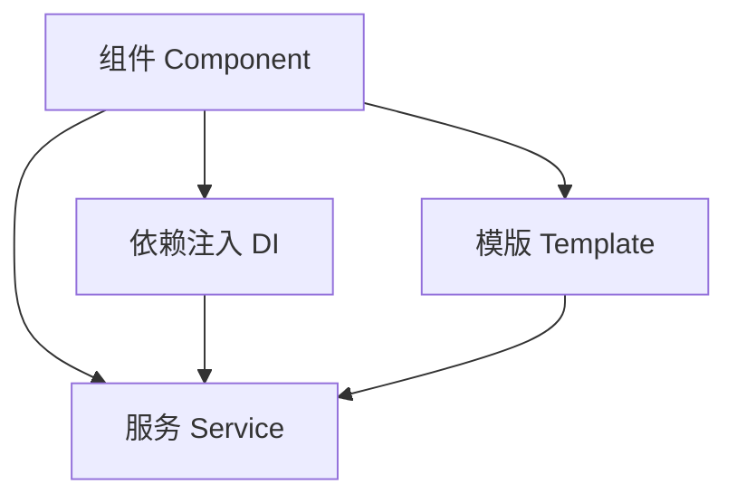

                 

# Angular 入门：Google 的 MVW 框架

> 关键词：Angular, MVW, TypeScript, CLI, RxJS, Web 应用开发, 组件化开发, 模块化开发, 前端框架

## 1. 背景介绍

在过去几十年中，JavaScript 生态系统不断发展，为开发者提供了丰富的工具和框架来构建高性能、可维护的前端应用。其中，Angular 作为一个由 Google 推出的 MVW (Model-View-Controller) 框架，已成为现代 Web 开发的标准之一。本文旨在带领读者全面了解 Angular，从入门到实践，深入探索其核心原理、使用方法及应用领域。

### 1.1 问题由来

随着 Web 应用的复杂性不断增加，传统的 JavaScript 开发方式已难以满足需求。为了应对这些挑战，Angular 应运而生，旨在提供一套强大的工具和规范，帮助开发者构建大型、复杂的 Web 应用。Angular 自 2016 年发布以来，一直保持活跃的更新和改进，成为前端开发者必备的框架之一。

### 1.2 问题核心关键点

Angular 的核心理念包括 MVW 模式、TypeScript、组件化开发、模块化开发等。这些理念和技术构成了 Angular 的独特价值，使其能够在复杂的应用场景中表现出色。

- **MVW 模式**：Angular 采用 MVW 模式，将应用划分为模型、视图和控制器三个部分，明确了各组件的职责，提高了应用的维护性和可扩展性。
- **TypeScript**：Angular 使用 TypeScript 作为其语言层，通过类型系统提供更强的代码规范和自动补全功能，提升了开发效率。
- **组件化开发**：Angular 将应用划分为多个可复用的组件，通过组件库和模版引擎实现高性能和易于维护的代码结构。
- **模块化开发**：Angular 的模块化体系使应用能够灵活地组合和加载不同的模块，满足不同场景的需求。

## 2. 核心概念与联系

### 2.1 核心概念概述

Angular 的核心概念包括组件、服务、依赖注入、模版等。这些概念相互关联，构成了 Angular 的开发框架。

- **组件 (Component)**：组件是 Angular 的基本构建块，包含了视图、模板和控制器。组件可以独立开发、测试和部署，是构建复杂应用的核心。
- **服务 (Service)**：服务是组件之间的通信桥梁，通过依赖注入机制提供跨组件的功能。服务可以分为依赖注入服务、HTTP 服务等。
- **依赖注入 (Dependency Injection, DI)**：依赖注入是 Angular 的核心机制，通过在组件和服务之间注入依赖，实现了解耦和灵活的开发模式。
- **模版 (Template)**：模版是组件的可视化部分，包含了 HTML 标记、事件处理和属性绑定等。

### 2.2 核心概念原理和架构的 Mermaid 流程图



此图展示了 Angular 核心概念之间的关系。组件通过依赖注入机制注入服务，并通过模版进行视图渲染。

## 3. 核心算法原理 & 具体操作步骤

### 3.1 算法原理概述

Angular 的核心算法原理包括组件生命周期、依赖注入、事件处理和模版渲染等。这些原理构成了 Angular 的开发基础。

#### 3.1.1 组件生命周期

Angular 组件的生命周期分为多个阶段，包括初始化、创建、渲染和销毁等。组件生命周期方法由 Angular 内部调用，开发者只需在需要时定义即可。

#### 3.1.2 依赖注入

依赖注入是 Angular 的核心机制，通过在组件和服务之间注入依赖，实现了解耦和灵活的开发模式。

#### 3.1.3 事件处理

事件处理是 Angular 的重要特性，通过绑定事件和事件处理函数，实现组件的动态交互。

#### 3.1.4 模版渲染

模版渲染是 Angular 的可视化部分，通过模版引擎将数据和事件绑定到视图上，实现交互和动态更新。

### 3.2 算法步骤详解

Angular 的核心操作步骤包括创建组件、定义模版、绑定事件和注入服务等。以下是详细步骤：

#### 3.2.1 创建组件

1. 使用 Angular CLI 创建组件：
```bash
ng generate component component-name
```

2. 在组件类中定义数据和事件处理函数：
```typescript
import { Component } from '@angular/core';

@Component({
  selector: 'app-component',
  template: `
    <div>{{ message }}</div>
  `,
  templateUrl: './component.component.html',
})
export class ComponentComponent {
  message = 'Hello World!';
}
```

3. 在模版中使用组件：
```html
<app-component></app-component>
```

#### 3.2.2 定义模版

1. 在组件类中定义模版字符串：
```typescript
export class ComponentComponent {
  message = 'Hello World!';
}
```

2. 在模版文件中使用模版字符串：
```html
<div>{{ message }}</div>
```

#### 3.2.3 绑定事件

1. 在组件类中定义事件处理函数：
```typescript
export class ComponentComponent {
  onClick() {
    console.log('Button clicked');
  }
}
```

2. 在模版中使用事件绑定：
```html
<button (click)="onClick()">Click me</button>
```

#### 3.2.4 注入服务

1. 在组件类中注入服务：
```typescript
import { Component } from '@angular/core';
import { MyService } from './my.service';

@Component({
  selector: 'app-component',
  template: `
    <div>{{ message }}</div>
  `,
  templateUrl: './component.component.html',
})
export class ComponentComponent {
  message = 'Hello World!';
  constructor(private myService: MyService) {}
}
```

2. 在服务中定义功能：
```typescript
import { Injectable } from '@angular/core';

@Injectable({
  providedIn: 'root',
})
export class MyService {
  getMessage() {
    return 'Message from service';
  }
}
```

### 3.3 算法优缺点

Angular 的优点包括：

- **强大的框架支持**：Angular 提供了丰富的组件和工具，可以加速开发和维护。
- **TypeScript 支持**：通过 TypeScript 提升代码质量和开发效率。
- **依赖注入机制**：使组件和服务解耦，提高代码可维护性和可测试性。

缺点包括：

- **学习曲线陡峭**：Angular 的学习曲线较陡峭，需要时间和实践来掌握。
- **性能问题**：在一些高性能场景下，Angular 的性能表现可能不如原生 JavaScript。

### 3.4 算法应用领域

Angular 在 Web 应用开发中具有广泛的应用领域，包括：

- **企业级应用**：Angular 适合构建大型、复杂的企业级应用，如电子商务、金融系统、医疗系统等。
- **移动应用**：Angular 的响应式和组件化特性，使其在移动应用开发中也有较好的表现。
- **单页应用**：Angular 适用于构建单页应用，提升用户体验和页面加载速度。
- **跨平台应用**：Angular 支持在多个平台和设备上进行开发和部署，如 Web、桌面、移动等。

## 4. 数学模型和公式 & 详细讲解 & 举例说明

### 4.1 数学模型构建

Angular 的核心数学模型包括数据绑定、事件处理和依赖注入等。这些模型共同构成了 Angular 的开发框架。

#### 4.1.1 数据绑定

数据绑定是 Angular 的基础模型，通过双向绑定实现了组件和视图的同步更新。数据绑定模型可以表示为：

$$
\text{Model} \leftrightarrow \text{View}
$$

其中，Model 表示数据模型，View 表示视图。当数据模型发生变化时，视图自动更新；反之亦然。

#### 4.1.2 事件处理

事件处理是 Angular 的重要特性，通过绑定事件和事件处理函数，实现组件的动态交互。事件处理模型可以表示为：

$$
\text{Event} \rightarrow \text{Function}
$$

其中，Event 表示事件类型，Function 表示事件处理函数。当事件发生时，调用相应的事件处理函数。

#### 4.1.3 依赖注入

依赖注入是 Angular 的核心机制，通过在组件和服务之间注入依赖，实现了解耦和灵活的开发模式。依赖注入模型可以表示为：

$$
\text{Component} \leftrightarrow \text{Service}
$$

其中，Component 表示组件，Service 表示服务。组件依赖注入服务，通过服务实现跨组件的功能。

### 4.2 公式推导过程

以下是 Angular 数据绑定和事件处理模型的推导过程：

#### 4.2.1 数据绑定模型

数据绑定模型通过双向绑定实现了组件和视图的同步更新。数据绑定过程如下：

1. 当数据模型发生变化时，Angular 自动调用数据绑定机制，更新视图中的数据。
2. 当视图数据发生变化时，Angular 自动调用数据绑定机制，更新数据模型。

#### 4.2.2 事件处理模型

事件处理模型通过绑定事件和事件处理函数，实现组件的动态交互。事件处理过程如下：

1. 当事件发生时，Angular 调用相应的事件处理函数。
2. 事件处理函数处理事件，并更新数据模型。

### 4.3 案例分析与讲解

#### 4.3.1 数据绑定

在 Angular 中，数据绑定通常使用 {{ }} 语法，例如：
```html
<p>{{ message }}</p>
```

其中，message 是数据模型中的变量。当 message 的值发生变化时，视图会自动更新。

#### 4.3.2 事件处理

在 Angular 中，事件处理通常使用 (event) 语法，例如：
```html
<button (click)="onClick()">Click me</button>
```

其中，onClick() 是组件类中定义的事件处理函数。当按钮被点击时，调用 onClick() 函数。

## 5. 项目实践：代码实例和详细解释说明

### 5.1 开发环境搭建

要使用 Angular 进行项目开发，需要安装 Node.js、npm 和 Angular CLI。以下是安装和配置的步骤：

1. 安装 Node.js 和 npm：
```bash
curl -sL https://nvm.sh | bash
source nvm.sh
nvm install 18.13.0
```

2. 安装 Angular CLI：
```bash
npm install -g @angular/cli
```

3. 创建 Angular 项目：
```bash
ng new my-app
```

4. 进入项目目录：
```bash
cd my-app
```

5. 启动开发服务器：
```bash
ng serve
```

### 5.2 源代码详细实现

#### 5.2.1 创建组件

1. 使用 Angular CLI 创建组件：
```bash
ng generate component my-component
```

2. 在组件类中定义数据和事件处理函数：
```typescript
import { Component } from '@angular/core';

@Component({
  selector: 'app-my-component',
  template: `
    <button (click)="onClick()">Click me</button>
  `,
  templateUrl: './my-component.component.html',
})
export class MyComponentComponent {
  onClick() {
    console.log('Button clicked');
  }
}
```

3. 在模版文件中使用组件：
```html
<app-my-component></app-my-component>
```

#### 5.2.2 定义模版

1. 在组件类中定义模版字符串：
```typescript
export class MyComponentComponent {
  onClick() {
    console.log('Button clicked');
  }
}
```

2. 在模版文件中使用模版字符串：
```html
<button (click)="onClick()">Click me</button>
```

#### 5.2.3 绑定事件

1. 在组件类中定义事件处理函数：
```typescript
export class MyComponentComponent {
  onClick() {
    console.log('Button clicked');
  }
}
```

2. 在模版文件中使用事件绑定：
```html
<button (click)="onClick()">Click me</button>
```

#### 5.2.4 注入服务

1. 在组件类中注入服务：
```typescript
import { Component } from '@angular/core';
import { MyService } from './my.service';

@Component({
  selector: 'app-my-component',
  template: `
    <button (click)="onClick()">Click me</button>
  `,
  templateUrl: './my-component.component.html',
})
export class MyComponentComponent {
  onClick() {
    console.log('Button clicked');
  }
  constructor(private myService: MyService) {}
}
```

2. 在服务中定义功能：
```typescript
import { Injectable } from '@angular/core';

@Injectable({
  providedIn: 'root',
})
export class MyService {
  getMessage() {
    return 'Message from service';
  }
}
```

### 5.3 代码解读与分析

Angular 的源代码主要由以下几部分构成：

- **组件类 (Component)**：定义组件的模板、数据模型和事件处理函数。
- **模版文件 (Template)**：定义组件的视图和数据绑定。
- **服务类 (Service)**：定义跨组件的功能，通过依赖注入机制注入到组件中。
- **模块类 (Module)**：定义应用的路由、管道和依赖等。

通过 Angular 的组件、服务和模版等核心组件，可以实现复杂且可维护的前端应用。

### 5.4 运行结果展示

运行 Angular 项目后，在浏览器中查看开发服务器地址，即可看到组件的可视化效果。点击按钮，控制台将输出 'Button clicked'。

## 6. 实际应用场景

Angular 在 Web 应用开发中具有广泛的应用场景，以下是几个典型的应用场景：

### 6.1 企业级应用

Angular 适合构建大型、复杂的企业级应用，如电子商务、金融系统、医疗系统等。例如，电商平台可以通过 Angular 实现商品搜索、购物车、支付等功能，提升用户体验和交易效率。

### 6.2 单页应用

Angular 适用于构建单页应用，提升用户体验和页面加载速度。例如，新闻网站可以通过 Angular 实现新闻列表、文章详情、评论区等功能，提升信息获取效率。

### 6.3 移动应用

Angular 的响应式和组件化特性，使其在移动应用开发中也有较好的表现。例如，社交应用可以通过 Angular 实现消息、朋友圈、私信等功能，提升用户互动体验。

### 6.4 跨平台应用

Angular 支持在多个平台和设备上进行开发和部署，如 Web、桌面、移动等。例如，跨平台应用可以通过 Angular 实现桌面应用和移动应用的功能，满足不同用户的需求。

## 7. 工具和资源推荐

### 7.1 学习资源推荐

为了帮助开发者全面掌握 Angular，以下是一些优质的学习资源：

1. **Angular 官方文档**：Angular 官方文档是学习 Angular 的最佳资源，详细介绍了 Angular 的核心概念、组件和模块等。
2. **Angular 培训课程**：由官方提供的 Angular 培训课程，适合初学者和高级开发者。
3. **Angular 示例项目**：GitHub 上的 Angular 示例项目，可以学习实际的开发场景和实践经验。
4. **Angular 博客和社区**：Angular 的博客和社区提供了丰富的技术文章和讨论，可以获取最新的技术动态和实践经验。

### 7.2 开发工具推荐

Angular 提供了丰富的开发工具，以下是一些推荐的工具：

1. **Visual Studio Code**：VS Code 是 Angular 的官方 IDE，提供了丰富的插件和扩展，方便开发和调试。
2. **Git**：使用 Git 进行版本控制，方便团队协作和代码管理。
3. **npm**：使用 npm 进行依赖管理和包管理，方便依赖的快速安装和更新。
4. **Webpack**：使用 Webpack 进行构建和打包，提升应用性能和加载速度。

### 7.3 相关论文推荐

以下是一些与 Angular 相关的优秀论文，推荐阅读：

1. **Angular 的设计哲学**：这篇文章详细介绍了 Angular 的设计理念和核心原理，适合深入理解 Angular 的架构。
2. **Angular 的未来发展**：这篇文章讨论了 Angular 的未来发展方向和前沿技术，适合了解 Angular 的最新进展。
3. **Angular 的性能优化**：这篇文章介绍了 Angular 的性能优化策略和技术，适合提升开发效率和应用性能。

## 8. 总结：未来发展趋势与挑战

### 8.1 研究成果总结

Angular 作为现代化的前端框架，通过 MVW 模式、TypeScript、组件化开发和模块化开发等技术，提供了强大的开发工具和规范。Angular 在 Web 应用开发中具有广泛的应用场景，如企业级应用、单页应用、移动应用和跨平台应用等。

### 8.2 未来发展趋势

Angular 的未来发展趋势包括：

1. **组件化开发**：组件化开发是 Angular 的核心特性，未来将进一步发展，提升应用的可维护性和可扩展性。
2. **TypeScript 支持**：TypeScript 作为 Angular 的语言层，未来将进一步发展，提升代码质量和开发效率。
3. **响应式编程**：响应式编程是 Angular 的重要特性，未来将进一步发展，提升应用的性能和响应速度。
4. **Web 组件 (WC)**：Web 组件是未来 Web 开发的重要方向，Angular 将支持更多 Web 组件的标准和规范。

### 8.3 面临的挑战

Angular 面临的挑战包括：

1. **性能问题**：在一些高性能场景下，Angular 的性能表现可能不如原生 JavaScript。
2. **学习曲线陡峭**：Angular 的学习曲线较陡峭，需要时间和实践来掌握。
3. **生态系统复杂**：Angular 的生态系统较为复杂，需要开发者具备较强的技术储备。

### 8.4 研究展望

未来的研究将关注以下几个方向：

1. **性能优化**：提升 Angular 的性能表现，减少资源消耗，提升用户体验。
2. **组件化开发**：进一步发展组件化开发技术，提升应用的可维护性和可扩展性。
3. **Web 组件 (WC)**：支持更多 Web 组件的标准和规范，提升 Web 开发的标准化和统一性。

通过不断优化和改进，Angular 必将在未来的 Web 开发中发挥更大的作用，推动前端开发技术的不断进步。

## 9. 附录：常见问题与解答

### 9.1 常见问题

#### Q1：Angular 的学习曲线陡峭吗？

A: Angular 的学习曲线相对陡峭，需要一定的时间和实践才能掌握。但是，Angular 提供了丰富的文档和社区资源，可以逐步学习并掌握其核心概念和特性。

#### Q2：Angular 的性能问题如何解决？

A: Angular 的性能问题可以通过以下方式解决：

1. 使用 Webpack 进行构建和打包，提升应用性能和加载速度。
2. 使用懒加载和代码分割技术，减少初始加载时间和资源消耗。
3. 使用缓存和异步加载技术，提升应用的响应速度和用户体验。

#### Q3：Angular 的组件化开发是什么？

A: Angular 的组件化开发是将应用划分为多个可复用的组件，通过组件库和模版引擎实现高性能和易于维护的代码结构。组件化开发可以提高代码的复用性和可维护性，减少开发时间和成本。

#### Q4：Angular 的响应式编程是什么？

A: Angular 的响应式编程是通过双向绑定和数据流机制，实现组件和视图的同步更新。响应式编程可以提升应用的性能和响应速度，使开发过程更加高效和可维护。

---

作者：禅与计算机程序设计艺术 / Zen and the Art of Computer Programming

