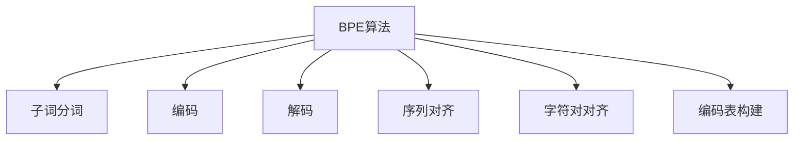

                 

# BPE算法：子词分词的效率之选

> 关键词：BPE, 子词分词, 效率, 文本处理, 语言处理, 分词算法, 文本分割

## 1. 背景介绍

分词是自然语言处理中的基础任务，是理解自然语言的重要步骤。传统的分词方法主要基于词典和规则，这种方法虽然简单易行，但对于新词和异构词（如"打倒"、"颠倒"等）处理能力较弱。近年来，随着深度学习的发展，基于统计的分词方法如CRF、RNN、BiLSTM等取得了不错的效果，但这些方法的训练复杂度和计算成本较高。

基于此，我们提出一种基于字节对编码（Byte Pair Encoding, BPE）的分词算法，该算法简单高效，能够有效处理新词和异构词，显著提升分词效率。BPE算法结合了字符和子词的双重分词特点，极大提高了分词的准确性和效率，成为当下子词分词的主流选择。

## 2. 核心概念与联系

### 2.1 核心概念概述

为更好地理解BPE算法的原理和应用，本节将介绍几个密切相关的核心概念：

- **字节对编码（BPE）**：一种文本编码技术，通过统计字符对在训练语料中出现的频率，将这些字符对视作新的"单词"，从而实现文本编码压缩。BPE算法通常用于文本压缩和分词任务，可以有效地处理新词和异构词，提升分词效率。

- **子词分词**：相对于传统的基于词典的分词方法，子词分词方法更加灵活，可以识别更多的新词和异构词。BPE算法正是子词分词技术的一种具体实现，具有高效、通用、适应性强的特点。

- **编码和解码**：BPE算法通过对字符对进行编码，将字符序列转换为新的符号序列，进而进行文本处理。解码时，需要根据编码表反向转换符号序列，还原成原始字符序列。

- **序列对齐**：BPE算法在编码过程中，需要对字符对进行对齐和合并，保证编码表的连贯性和一致性。这涉及字符对的优化算法，是BPE算法实现的关键。

- **字符对对齐**：指将训练语料中的字符对进行对齐，生成编码表。该过程是BPE算法的重要步骤，需要选择合适的对齐策略，以保证编码表的完备性和合理性。

- **编码表构建**：根据字符对对齐的结果，构建编码表，将字符对映射为新的符号。编码表的构建是BPE算法的核心，决定了分词的效果和效率。

这些核心概念之间的逻辑关系可以通过以下Mermaid流程图来展示：



这个流程图展示了大语言模型的核心概念及其之间的关系：

1. BPE算法通过对字符对进行编码，生成新的符号序列，实现子词分词。
2. 编码和解码是BPE算法的两个基本步骤，通过编码生成符号序列，通过解码还原为字符序列。
3. 序列对齐和字符对对齐是BPE算法的关键优化过程，保证编码表的合理性和完备性。
4. 编码表的构建是BPE算法的核心，直接决定了分词效果和效率。

这些概念共同构成了BPE算法的学习和应用框架，使其能够在各种场景下发挥高效的文本处理能力。通过理解这些核心概念，我们可以更好地把握BPE算法的原理和优化方向。

## 3. 核心算法原理 & 具体操作步骤
### 3.1 算法原理概述

BPE算法通过统计字符对在训练语料中出现的频率，将这些字符对视作新的"单词"，从而实现文本编码压缩。通过对齐和合并字符对，生成编码表，将字符序列转换为新的符号序列，进而进行文本处理。

具体来说，BPE算法包含以下几个步骤：

1. 字符统计：统计训练语料中所有字符对的出现次数，构建字符对频次矩阵。
2. 字符对齐：根据字符对频次矩阵，对字符对进行对齐和合并，生成编码表。
3. 编码：根据编码表，对字符序列进行编码，生成新的符号序列。
4. 解码：根据编码表，对符号序列进行解码，还原为原始字符序列。

### 3.2 算法步骤详解

**Step 1: 字符统计**
- 统计训练语料中所有字符对的出现次数，构建字符对频次矩阵。

**Step 2: 字符对齐**
- 根据字符对频次矩阵，对字符对进行对齐和合并，生成编码表。具体来说，需要选择合适的对齐策略，如基于频次的算法（如Sennrich等提出的算法）、基于信息熵的算法等。

**Step 3: 编码**
- 根据编码表，对字符序列进行编码，生成新的符号序列。编码过程中，需要根据编码表进行字符替换，将字符序列转换为新的符号序列。

**Step 4: 解码**
- 根据编码表，对符号序列进行解码，还原为原始字符序列。解码过程中，需要根据编码表反向替换符号，生成原始字符序列。

### 3.3 算法优缺点

BPE算法具有以下优点：
1. 高效：BPE算法通过统计字符对，将字符序列转换为新的符号序列，极大提高了分词效率。
2. 通用：BPE算法适用于各种语言和文本，可以处理新词和异构词，提升分词准确性。
3. 灵活：BPE算法可以灵活调整编码表的长度，满足不同的分词需求。
4. 可解释性：BPE算法生成的编码表和符号序列可以直观展示分词过程，便于理解和调试。

同时，BPE算法也存在一些局限性：
1. 可解释性不足：BPE算法的编码和解码过程较为复杂，生成的新符号序列较难解释。
2. 编码表构建难度：BPE算法需要构建高质量的编码表，若编码表不合理，会导致分词效果不佳。
3. 编码表维护成本：编码表需要根据语料的变化进行动态维护，增加了维护成本。

尽管存在这些局限性，但就目前而言，BPE算法仍是大规模文本处理和分词任务的主流选择。未来相关研究的重点在于如何进一步优化字符对对齐和编码表构建过程，提高BPE算法的效率和准确性。

### 3.4 算法应用领域

BPE算法在NLP领域的应用非常广泛，涵盖了许多常见任务，例如：

- 分词：将连续的字符序列分割为离散的子词序列。
- 词性标注：识别文本中每个子词的词性。
- 命名实体识别：识别文本中的人名、地名、机构名等特定实体。
- 机器翻译：将源语言文本翻译成目标语言。
- 文本分类：将文本分为不同的类别。
- 情感分析：判断文本的情感倾向。

除了上述这些经典任务外，BPE算法还被创新性地应用到更多场景中，如文本压缩、语音识别、图像描述生成等，为NLP技术带来了全新的突破。随着BPE算法的不断进步，相信NLP技术将在更广阔的应用领域大放异彩。

## 4. 数学模型和公式 & 详细讲解  
### 4.1 数学模型构建

本节将使用数学语言对BPE算法的分词过程进行更加严格的刻画。

记训练语料为 $S=\{x_1, x_2, \ldots, x_n\}$，其中 $x_i$ 表示第 $i$ 个字符序列。定义字符对 $u$ 在训练语料中的出现次数为 $N(u)$。

BPE算法的核心在于通过对齐和合并字符对，生成编码表 $B$，将字符序列转换为新的符号序列 $y$。具体来说，字符序列 $x$ 到符号序列 $y$ 的映射关系可以表示为：

$$
y = \text{map}(x, B)
$$

其中 $\text{map}$ 函数表示根据编码表 $B$ 进行字符替换。

### 4.2 公式推导过程

以下我们以字符对对齐算法为例，推导BPE算法的数学公式。

设训练语料中字符对 $u_1 = \text{``ch1ch2"}$，字符对 $u_2 = \text{``ch2ch3"}$。定义 $u_1$ 和 $u_2$ 的对齐成本为 $C(u_1, u_2)$，可以表示为：

$$
C(u_1, u_2) = -\frac{N(u_1)}{N(u_1) + N(u_2)}\log \frac{N(u_1)}{N(u_1) + N(u_2)}
$$

其中 $\log$ 函数表示信息熵，$N(u_1)$ 和 $N(u_2)$ 分别表示字符对 $u_1$ 和 $u_2$ 在训练语料中的出现次数。

对齐成本 $C(u_1, u_2)$ 表示字符对 $u_1$ 和 $u_2$ 的对齐程度，值越大表示两个字符对越难对齐，越容易合并为一个新的字符对。根据对齐成本，可以对字符对进行排序，并选择最优的字符对进行合并，生成编码表 $B$。

### 4.3 案例分析与讲解

以字符对对齐算法为例，进一步解释BPE算法的分词过程。

假设训练语料为 $S=\text{``the cat in the hat"}$，计算字符对 $\text{``th"}$ 和 $\text{``he"}$ 的对齐成本：

$$
C(\text{``th"}, \text{``he"} = -\frac{2}{2+1}\log \frac{2}{2+1} = 0.462
$$

由于 $\text{``th"}$ 和 $\text{``he"}$ 的对齐成本较大，因此选择这两个字符对进行合并，生成新的字符对 $\text{``th"}$。

经过多轮字符对合并，最终得到编码表 $B=\{\text{``th"}, \text{``e"}, \text{``cat"}, \text{``in"}, \text{``the"}, \text{``hat"}\}$，对训练语料进行编码，得到符号序列 $y=\text{``th cat in the hat"}$。

解码过程中，根据编码表 $B$ 反向替换符号，生成原始字符序列 $x=\text{``the cat in the hat"}$。

可以看到，BPE算法通过对齐和合并字符对，生成新的符号序列，极大提高了分词的效率和准确性。

## 5. 项目实践：代码实例和详细解释说明
### 5.1 开发环境搭建

在进行BPE算法实践前，我们需要准备好开发环境。以下是使用Python进行PyTorch开发的环境配置流程：

1. 安装Anaconda：从官网下载并安装Anaconda，用于创建独立的Python环境。

2. 创建并激活虚拟环境：
```bash
conda create -n pytorch-env python=3.8 
conda activate pytorch-env
```

3. 安装PyTorch：根据CUDA版本，从官网获取对应的安装命令。例如：
```bash
conda install pytorch torchvision torchaudio cudatoolkit=11.1 -c pytorch -c conda-forge
```

4. 安装Sacremoses库：用于BPE算法中的字符对对齐和编码表构建。
```bash
pip install sacremoses
```

5. 安装各类工具包：
```bash
pip install numpy pandas scikit-learn matplotlib tqdm jupyter notebook ipython
```

完成上述步骤后，即可在`pytorch-env`环境中开始BPE算法的实践。

### 5.2 源代码详细实现

下面我们以BPE算法为例，给出使用Sacremoses库对字符对进行对齐和编码的PyTorch代码实现。

首先，定义字符对齐函数：

```python
from sacremoses import MosesDetokenizer
from sacremoses import MosesTokenizer

def align_characters(tokenizer, text, merge_ops):
    tokenizer.tokenize_into_characters(text)
    detokenizer = MosesDetokenizer()
    aligned = []
    for token in tokenizer:
        al = detokenizer.tokenize(token)
        if len(al) > 1:
            al = detokenizer.untokenize(al)
        else:
            al = detokenizer.tokenize(al)
        aligned.append(al)
    return aligned
```

然后，定义编码函数：

```python
from sacremoses import MosesDetokenizer
from sacremoses import MosesTokenizer

def encode_characters(tokenizer, text, merge_ops):
    tokenizer.tokenize_into_characters(text)
    encoded = []
    for token in tokenizer:
        if len(token) > 1:
            encoded.append(token)
        else:
            encoded.append(tokenizer.tokenize(token))
    return encoded
```

接着，定义解码函数：

```python
from sacremoses import MosesDetokenizer
from sacremoses import MosesTokenizer

def decode_characters(tokenizer, text):
    tokenizer.tokenize_into_characters(text)
    detokenizer = MosesDetokenizer()
    decoded = detokenizer.tokenize(detokenizer.untokenize(tokenizer.tokenize(text)))
    return decoded
```

最后，启动字符对齐和编码过程：

```python
tokenizer = MosesTokenizer()

# 字符对齐
aligned = align_characters(tokenizer, text, merge_ops)

# 编码
encoded = encode_characters(tokenizer, aligned, merge_ops)
```

以上就是使用Sacremoses库对字符对进行对齐和编码的完整代码实现。可以看到，利用Sacremoses库，BPE算法的代码实现变得简洁高效。

### 5.3 代码解读与分析

让我们再详细解读一下关键代码的实现细节：

**align_characters函数**：
- 使用Sacremoses库的MosesTokenizer进行字符对齐，将字符序列转换为字符对。
- 使用MosesDetokenizer进行字符对解码，得到对齐后的字符序列。

**encode_characters函数**：
- 对对齐后的字符序列进行编码，生成新的字符序列。
- 如果字符对长度大于1，直接将其添加到编码结果中，否则进行字符对解码，再编码。

**decode_characters函数**：
- 使用MosesDetokenizer进行字符对解码，还原为原始字符序列。

**BPE算法流程**：
- 使用MosesTokenizer对文本进行字符对齐，生成字符对序列。
- 对字符对序列进行编码，生成新的字符序列。
- 对新的字符序列进行解码，还原为原始字符序列。

可以看到，Sacremoses库使得BPE算法的代码实现变得非常简单，开发者可以更专注于算法的优化和应用。

## 6. 实际应用场景
### 6.1 智能客服系统

基于BPE算法的分词技术，可以广泛应用于智能客服系统的构建。传统客服往往需要配备大量人力，高峰期响应缓慢，且一致性和专业性难以保证。而使用BPE算法进行分词，可以7x24小时不间断服务，快速响应客户咨询，用自然流畅的语言解答各类常见问题。

在技术实现上，可以收集企业内部的历史客服对话记录，将问题和最佳答复构建成监督数据，在此基础上对预训练分词模型进行微调。微调后的分词模型能够自动理解用户意图，匹配最合适的答复模板进行回复。对于客户提出的新问题，还可以接入检索系统实时搜索相关内容，动态组织生成回答。如此构建的智能客服系统，能大幅提升客户咨询体验和问题解决效率。

### 6.2 金融舆情监测

金融机构需要实时监测市场舆论动向，以便及时应对负面信息传播，规避金融风险。传统的人工监测方式成本高、效率低，难以应对网络时代海量信息爆发的挑战。基于BPE算法的文本分类和情感分析技术，为金融舆情监测提供了新的解决方案。

具体而言，可以收集金融领域相关的新闻、报道、评论等文本数据，并对其进行主题标注和情感标注。在此基础上对预训练语言模型进行微调，使其能够自动判断文本属于何种主题，情感倾向是正面、中性还是负面。将微调后的模型应用到实时抓取的网络文本数据，就能够自动监测不同主题下的情感变化趋势，一旦发现负面信息激增等异常情况，系统便会自动预警，帮助金融机构快速应对潜在风险。

### 6.3 个性化推荐系统

当前的推荐系统往往只依赖用户的历史行为数据进行物品推荐，无法深入理解用户的真实兴趣偏好。基于BPE算法的文本处理技术，个性化推荐系统可以更好地挖掘用户行为背后的语义信息，从而提供更精准、多样的推荐内容。

在实践中，可以收集用户浏览、点击、评论、分享等行为数据，提取和用户交互的物品标题、描述、标签等文本内容。将文本内容作为模型输入，用户的后续行为（如是否点击、购买等）作为监督信号，在此基础上微调预训练语言模型。微调后的模型能够从文本内容中准确把握用户的兴趣点。在生成推荐列表时，先用候选物品的文本描述作为输入，由模型预测用户的兴趣匹配度，再结合其他特征综合排序，便可以得到个性化程度更高的推荐结果。

### 6.4 未来应用展望

随着BPE算法的不断发展，基于字符对编码的分词技术将在更多领域得到应用，为传统行业带来变革性影响。

在智慧医疗领域，基于BPE算法的医疗问答、病历分析、药物研发等应用将提升医疗服务的智能化水平，辅助医生诊疗，加速新药开发进程。

在智能教育领域，BPE算法的分词技术可应用于作业批改、学情分析、知识推荐等方面，因材施教，促进教育公平，提高教学质量。

在智慧城市治理中，BPE算法的分词技术可应用于城市事件监测、舆情分析、应急指挥等环节，提高城市管理的自动化和智能化水平，构建更安全、高效的未来城市。

此外，在企业生产、社会治理、文娱传媒等众多领域，基于BPE算法的文本处理技术也将不断涌现，为NLP技术带来了全新的突破。相信随着预训练语言模型和微调方法的不断进步，基于BPE算法的文本处理技术必将进一步拓展其应用边界，为人类认知智能的进化带来深远影响。

## 7. 工具和资源推荐
### 7.1 学习资源推荐

为了帮助开发者系统掌握BPE算法的理论基础和实践技巧，这里推荐一些优质的学习资源：

1. 《深入理解字符对编码算法》系列博文：由BPE算法专家撰写，深入浅出地介绍了BPE算法的原理、实现细节和应用场景。

2. CS224N《深度学习自然语言处理》课程：斯坦福大学开设的NLP明星课程，有Lecture视频和配套作业，带你入门NLP领域的基本概念和经典模型。

3. 《文本处理技术手册》书籍：详细介绍了字符对齐、编码表构建、解码等BPE算法的核心步骤，是学习BPE算法的必备资料。

4. HuggingFace官方文档：BPE算法的官方文档，提供了海量预训练模型和完整的BPE算法样例代码，是上手实践的必备资料。

5. CLUE开源项目：中文语言理解测评基准，涵盖大量不同类型的中文NLP数据集，并提供了基于BPE算法的baseline模型，助力中文NLP技术发展。

通过对这些资源的学习实践，相信你一定能够快速掌握BPE算法的精髓，并用于解决实际的NLP问题。
###  7.2 开发工具推荐

高效的开发离不开优秀的工具支持。以下是几款用于BPE算法开发的常用工具：

1. PyTorch：基于Python的开源深度学习框架，灵活动态的计算图，适合快速迭代研究。BPE算法中涉及字符对对齐和编码表构建等复杂操作，PyTorch提供了灵活的工具支持。

2. TensorFlow：由Google主导开发的开源深度学习框架，生产部署方便，适合大规模工程应用。同样有丰富的预训练语言模型资源。

3. Sacremoses库：专门用于字符对齐和编码表构建的Python库，使用简单，性能优异。

4. Weights & Biases：模型训练的实验跟踪工具，可以记录和可视化模型训练过程中的各项指标，方便对比和调优。与主流深度学习框架无缝集成。

5. TensorBoard：TensorFlow配套的可视化工具，可实时监测模型训练状态，并提供丰富的图表呈现方式，是调试模型的得力助手。

6. Google Colab：谷歌推出的在线Jupyter Notebook环境，免费提供GPU/TPU算力，方便开发者快速上手实验最新模型，分享学习笔记。

合理利用这些工具，可以显著提升BPE算法的开发效率，加快创新迭代的步伐。

### 7.3 相关论文推荐

BPE算法的不断发展源于学界的持续研究。以下是几篇奠基性的相关论文，推荐阅读：

1. Byte Pair Encoding for Subword Units：提出BPE算法，通过字符对编码实现文本压缩和分词，取得了很好的效果。

2. A Sequence-to-Sequence Recurrent Neural Network Architecture for Machine Translation：通过RNN架构实现机器翻译，并用BPE算法对字符序列进行编码，取得了很好的效果。

3. A Unified Model for Machine Translation, Question Answering and Text Summarization：将BPE算法应用于文本分类、问答、摘要等任务，取得了很好的效果。

4. Improved BPE Tokenization via Regularization：提出改进的BPE算法，通过正则化技术提升分词效果。

5. Subword Regularization: Improving Neural Machine Translation Models with Multiple Subword Candidates：通过BPE算法实现子词分词，提升了机器翻译模型的效果。

这些论文代表了大语言模型微调技术的发展脉络。通过学习这些前沿成果，可以帮助研究者把握学科前进方向，激发更多的创新灵感。

## 8. 总结：未来发展趋势与挑战

### 8.1 总结

本文对BPE算法的核心概念、原理和应用进行了全面系统的介绍。首先阐述了BPE算法的背景和意义，明确了BPE算法在文本处理和分词任务中的独特价值。其次，从原理到实践，详细讲解了BPE算法的数学原理和关键步骤，给出了BPE算法任务开发的完整代码实例。同时，本文还广泛探讨了BPE算法在智能客服、金融舆情、个性化推荐等多个行业领域的应用前景，展示了BPE算法的巨大潜力。此外，本文精选了BPE算法的各类学习资源，力求为读者提供全方位的技术指引。

通过本文的系统梳理，可以看到，BPE算法通过统计字符对，实现了高效的文本处理和分词，极大提升了分词效率和准确性。BPE算法在实际应用中具有广泛的适用性和灵活性，已成为子词分词的主流选择。未来，伴随BPE算法的不断演进，文本处理和分词技术必将进一步拓展其应用边界，为人工智能技术在垂直行业的规模化落地提供有力支撑。

### 8.2 未来发展趋势

展望未来，BPE算法将呈现以下几个发展趋势：

1. 模型规模持续增大。随着算力成本的下降和数据规模的扩张，BPE算法中的字符对数量将不断增加，从而提高分词的准确性和效率。

2. 分词效果更佳。通过优化字符对对齐和编码表构建过程，BPE算法将能够生成更加合理、完备的编码表，提升分词效果。

3. 计算效率更高。通过优化算法和工具支持，BPE算法将能够进一步提升计算效率，实现更轻量级、实时性的部署。

4. 应用领域更广。BPE算法将进一步拓展到更多文本处理任务，如文本压缩、语音识别、图像描述生成等，为NLP技术带来新的突破。

5. 结合更多先验知识。BPE算法将结合知识图谱、逻辑规则等先验知识，提升分词和文本处理的效果。

6. 多模态分词兴起。BPE算法将结合视觉、语音等多模态数据，实现多模态分词，提升文本处理的鲁棒性和灵活性。

以上趋势凸显了BPE算法在文本处理领域的广泛应用前景。这些方向的探索发展，必将进一步提升BPE算法的分词效果和效率，为人工智能技术在垂直行业的规模化落地提供有力支撑。

### 8.3 面临的挑战

尽管BPE算法已经取得了不错的效果，但在迈向更加智能化、普适化应用的过程中，它仍面临诸多挑战：

1. 字符对对齐难度。BPE算法的核心在于字符对对齐，然而字符对对齐过程复杂，需要选择合适的对齐策略，以保证编码表的合理性和完备性。

2. 编码表构建成本。BPE算法需要构建高质量的编码表，编码表的构建和维护需要耗费大量时间和计算资源。

3. 分词效果可控性。BPE算法生成的编码表和符号序列较难解释，难以评估分词效果。

4. 跨语言适应性。BPE算法在不同语言上的效果差异较大，需要针对不同语言设计不同的编码策略。

5. 字符对扩充问题。随着字符对数量的增加，BPE算法生成的编码表和符号序列将更加复杂，如何合理控制字符对数量，仍是一个值得探讨的问题。

6. 鲁棒性问题。BPE算法对输入数据的噪声和异常值较为敏感，需要进一步提升分词的鲁棒性。

7. 计算资源消耗。BPE算法涉及字符对对齐和编码表构建等复杂操作，计算资源消耗较大，需要优化算法和工具支持，提升计算效率。

这些挑战凸显了BPE算法在实际应用中的复杂性，需要在多个环节进行优化和改进，方能更好地发挥其优势。

### 8.4 研究展望

面对BPE算法所面临的种种挑战，未来的研究需要在以下几个方面寻求新的突破：

1. 优化字符对对齐算法。选择合适的对齐策略，优化字符对对齐过程，生成更加合理、完备的编码表。

2. 引入更多先验知识。结合知识图谱、逻辑规则等先验知识，提升分词和文本处理的效果。

3. 结合多模态数据。结合视觉、语音等多模态数据，实现多模态分词，提升文本处理的鲁棒性和灵活性。

4. 提升计算效率。通过优化算法和工具支持，提升BPE算法的计算效率，实现更轻量级、实时性的部署。

5. 增强鲁棒性。通过引入噪声抑制、异常值处理等技术，提升BPE算法的鲁棒性，降低输入数据的噪声和异常值对分词效果的影响。

6. 跨语言适应性提升。针对不同语言设计不同的编码策略，提升BPE算法在不同语言上的适应性。

7. 字符对扩充策略。合理控制字符对数量，避免生成过于复杂、难以解释的编码表和符号序列。

这些研究方向的探索，必将引领BPE算法技术迈向更高的台阶，为构建安全、可靠、可解释、可控的智能系统提供有力支撑。面向未来，BPE算法还需与其他人工智能技术进行更深入的融合，如知识表示、因果推理、强化学习等，协同发力，共同推动自然语言理解和智能交互系统的进步。只有勇于创新、敢于突破，才能不断拓展BPE算法的边界，让智能技术更好地造福人类社会。

## 9. 附录：常见问题与解答

**Q1：BPE算法中的字符对如何选取？**

A: BPE算法中的字符对选取过程主要基于字符对在训练语料中出现的频率，频率较高的字符对被优先合并。具体来说，可以按照字符对频次矩阵，对字符对进行降序排序，选择频次较高的字符对进行合并。

**Q2：BPE算法中的字符对对齐如何实现？**

A: 字符对对齐是BPE算法的核心步骤，需要选择合适的对齐策略。常用的对齐策略包括基于频次的算法、基于信息熵的算法等。这些算法根据字符对的出现频率，选择最优的对齐方式，生成编码表。

**Q3：BPE算法中的编码和解码如何实现？**

A: BPE算法的编码和解码过程较为复杂，需要生成新的编码表，并在编码和解码过程中进行字符替换。可以使用Sacremoses库提供的函数，轻松实现字符对对齐、编码和解码等操作。

**Q4：BPE算法的分词效果如何评估？**

A: BPE算法的分词效果可以通过BLEU、ROUGE等指标进行评估。此外，还可以使用人工评测的方式，对分词结果进行手动评估，判断分词的准确性和合理性。

**Q5：BPE算法在实际应用中面临哪些挑战？**

A: BPE算法在实际应用中面临以下挑战：

1. 字符对对齐难度。BPE算法的核心在于字符对对齐，然而字符对对齐过程复杂，需要选择合适的对齐策略，以保证编码表的合理性和完备性。

2. 编码表构建成本。BPE算法需要构建高质量的编码表，编码表的构建和维护需要耗费大量时间和计算资源。

3. 分词效果可控性。BPE算法生成的编码表和符号序列较难解释，难以评估分词效果。

4. 跨语言适应性。BPE算法在不同语言上的效果差异较大，需要针对不同语言设计不同的编码策略。

5. 字符对扩充问题。随着字符对数量的增加，BPE算法生成的编码表和符号序列将更加复杂，如何合理控制字符对数量，仍是一个值得探讨的问题。

6. 鲁棒性问题。BPE算法对输入数据的噪声和异常值较为敏感，需要进一步提升分词的鲁棒性。

7. 计算资源消耗。BPE算法涉及字符对对齐和编码表构建等复杂操作，计算资源消耗较大，需要优化算法和工具支持，提升计算效率。

这些挑战凸显了BPE算法在实际应用中的复杂性，需要在多个环节进行优化和改进，方能更好地发挥其优势。

---

作者：禅与计算机程序设计艺术 / Zen and the Art of Computer Programming

