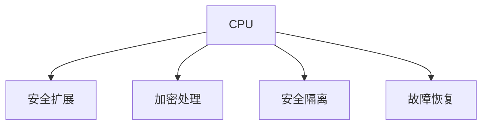

                 

# CPU的安全扩展机制与实现

> 关键词：CPU安全扩展, 硬件安全, 加密处理, 安全隔离, 故障恢复, 安全技术

## 1. 背景介绍

### 1.1 问题由来
在现代计算环境中，CPU作为处理数据的核心单元，其安全性至关重要。随着计算机网络的发展和云计算的普及，越来越多的应用程序和数据存储在云端，导致传统的安全威胁日益增多。特别是针对CPU的攻击手段，如侧信道攻击（Side Channel Attack）和微架构攻击（Microarchitectural Attack），可以轻松窃取数据，甚至执行未授权指令，给数据安全带来严重威胁。

面对这些威胁，现代CPU制造商开始引入安全扩展机制，以提高CPU的抗攻击能力，保护用户数据和应用程序。这些安全扩展机制包括硬件安全、加密处理、安全隔离、故障恢复等多个方面。

### 1.2 问题核心关键点
CPU安全扩展机制的核心关键点包括以下几个方面：
- 硬件安全：通过在硬件层面上增加安全特性，提供更强的防护能力。
- 加密处理：在数据传输和存储过程中，使用加密算法保证数据的安全性。
- 安全隔离：通过虚拟化和隔离技术，将不同用户或任务隔离，防止数据泄露和交叉污染。
- 故障恢复：在出现安全故障时，能够快速恢复系统，防止数据损坏和丢失。

这些关键点共同构成了现代CPU的安全扩展机制，提升了整个系统的安全性。

### 1.3 问题研究意义
研究CPU安全扩展机制，对于保护用户数据和应用程序的安全具有重要意义：

1. 提高安全性：通过在硬件和软件层面上增加安全特性，可以有效防范各类安全威胁，保护数据免受攻击。
2. 增强可信度：安全扩展机制的引入，使得用户和机构对CPU和系统的信任度提升，加速了云计算和边缘计算的普及。
3. 降低成本：相比于传统安全解决方案，安全扩展机制能够减少对第三方硬件和软件的需求，降低系统部署和维护成本。
4. 推动创新：安全扩展机制的引入，催生了新的安全技术、算法和标准，促进了安全领域的技术进步和产业发展。

## 2. 核心概念与联系

### 2.1 核心概念概述

为更好地理解CPU的安全扩展机制，本节将介绍几个密切相关的核心概念：

- CPU: 中央处理器（Central Processing Unit），是计算机中的核心组件，负责执行各种计算任务。
- 安全扩展：通过在CPU芯片中增加安全特性，提升CPU的抗攻击能力。
- 加密处理：在数据传输和存储过程中，使用加密算法保护数据不被非法访问和篡改。
- 安全隔离：通过虚拟化和隔离技术，将不同用户或任务隔离，防止数据泄露和交叉污染。
- 故障恢复：在出现安全故障时，能够快速恢复系统，防止数据损坏和丢失。

这些核心概念之间的逻辑关系可以通过以下Mermaid流程图来展示：



这个流程图展示了一些核心概念及其之间的关系：

1. CPU作为处理数据的核心单元，可以通过增加安全扩展机制来提升其安全性。
2. 加密处理可以在数据传输和存储过程中，提供数据保护。
3. 安全隔离可以通过虚拟化和隔离技术，保护不同用户或任务之间的数据安全。
4. 故障恢复可以在系统发生安全故障时，快速恢复数据和系统，减少损失。

这些概念共同构成了现代CPU的安全扩展机制，使其能够在各种场景下发挥强大的安全防护能力。

## 3. 核心算法原理 & 具体操作步骤
### 3.1 算法原理概述

CPU安全扩展机制的核心算法原理主要包括以下几个方面：

- 硬件安全特性：通过在CPU芯片中增加安全特性，如安全处理单元、安全存储、安全执行环境等，提供更强的防护能力。
- 加密算法：在数据传输和存储过程中，使用先进的加密算法，保证数据的安全性。
- 隔离技术：通过虚拟化和隔离技术，将不同用户或任务隔离，防止数据泄露和交叉污染。
- 故障恢复机制：在系统发生安全故障时，能够快速恢复系统，防止数据损坏和丢失。

这些算法原理共同构成了CPU安全扩展机制的技术基础，确保了CPU的安全性和可靠性。

### 3.2 算法步骤详解

基于CPU安全扩展机制的核心算法原理，以下是一些具体操作步骤：

**Step 1: 硬件安全特性设计**
- 在CPU芯片中增加安全处理单元，如安全加密单元、安全存储单元等。
- 设计安全执行环境，确保只有经过授权的用户和任务可以访问和执行特定代码。

**Step 2: 加密算法应用**
- 在数据传输过程中，使用高级加密算法（如AES、RSA等）对数据进行加密，确保数据在传输过程中的安全性。
- 在数据存储过程中，使用加密算法对数据进行加密，防止数据泄露。

**Step 3: 隔离技术实施**
- 通过虚拟化和隔离技术，将不同用户或任务隔离，防止数据泄露和交叉污染。
- 设计隔离操作系统，确保不同用户或任务之间的数据隔离。

**Step 4: 故障恢复机制设计**
- 在系统发生安全故障时，能够快速恢复系统，防止数据损坏和丢失。
- 设计故障检测和恢复机制，确保系统在故障发生时能够快速恢复。

**Step 5: 系统集成与测试**
- 将安全扩展机制集成到操作系统和应用程序中，确保系统的完整性和安全性。
- 对系统进行全面的测试，确保安全扩展机制能够有效防止各类安全威胁。

通过这些具体操作步骤，可以有效地实现CPU的安全扩展机制，提升CPU的安全性和可靠性。

### 3.3 算法优缺点

CPU安全扩展机制具有以下优点：
1. 安全性高：通过在硬件和软件层面上增加安全特性，可以有效防范各类安全威胁，保护数据免受攻击。
2. 可靠性高：安全扩展机制的设计和实现，使得系统在出现故障时能够快速恢复，确保系统的稳定性和可靠性。
3. 易用性强：安全扩展机制的引入，使得用户和机构能够更加方便地使用CPU和系统，提高工作效率。

同时，该机制也存在一定的局限性：
1. 成本较高：安全扩展机制的引入，增加了CPU芯片的复杂度和成本，提高了系统的部署和维护成本。
2. 兼容性差：不同厂商和型号的CPU，安全扩展机制可能存在差异，难以实现统一的标准和接口。
3. 维护难度高：安全扩展机制的复杂性，使得系统的维护和更新变得复杂，增加了技术难度。

尽管存在这些局限性，但就目前而言，CPU安全扩展机制仍是大规模安全防护的重要手段。未来相关研究的重点在于如何进一步降低成本，提高兼容性，降低维护难度。

### 3.4 算法应用领域

CPU安全扩展机制广泛应用于以下领域：

- 云计算：通过在云计算平台上引入安全扩展机制，保护用户数据和应用程序的安全。
- 物联网：在物联网设备中，引入安全扩展机制，保护设备和数据的安全。
- 金融行业：在金融系统中，引入安全扩展机制，保护敏感数据的机密性和完整性。
- 政府和军事：在政府和军事领域，引入安全扩展机制，保护敏感信息和通信的安全。

除了这些应用场景外，CPU安全扩展机制还被广泛应用于网络安全、工业控制、智能交通等领域，为各类应用提供了强有力的安全保障。

## 4. 数学模型和公式 & 详细讲解 & 举例说明

### 4.1 数学模型构建

本节将使用数学语言对CPU安全扩展机制进行更加严格的刻画。

设CPU芯片的安全特性数量为 $n$，每个安全特性的安全强度为 $s_i$，其中 $i \in [1,n]$。加密算法的强度为 $e$，隔离技术的强度为 $i$，故障恢复机制的可靠性为 $f$。则CPU安全扩展机制的整体安全性可以表示为：

$$
S = n \times s_i + e + i + f
$$

其中 $S$ 为CPU安全扩展机制的整体安全性。

### 4.2 公式推导过程

通过上述数学模型，可以推导出CPU安全扩展机制的安全性计算公式：

1. 安全特性的贡献：每个安全特性的贡献可以表示为 $s_i = s_0 \times p_i$，其中 $s_0$ 为初始安全强度，$p_i$ 为该安全特性的概率因子。
2. 加密算法的贡献：$e = e_0 \times p_e$，其中 $e_0$ 为加密算法的初始强度，$p_e$ 为加密算法的概率因子。
3. 隔离技术的贡献：$i = i_0 \times p_i$，其中 $i_0$ 为隔离技术的初始强度，$p_i$ 为隔离技术的概率因子。
4. 故障恢复机制的贡献：$f = f_0 \times p_f$，其中 $f_0$ 为故障恢复机制的初始可靠性，$p_f$ 为故障恢复机制的概率因子。

将这些贡献值代入整体安全性公式，可以得到：

$$
S = \sum_{i=1}^{n} s_0 \times p_i + e_0 \times p_e + i_0 \times p_i + f_0 \times p_f
$$

该公式表示了CPU安全扩展机制的整体安全性计算方法。

### 4.3 案例分析与讲解

以政府部门的数据中心为例，进行案例分析：

1. 安全特性设计：引入N个安全特性，每个安全特性的安全强度为 $s_0=0.9$，概率因子 $p_i=0.95$。
2. 加密算法选择：选择AES-256加密算法，初始强度 $e_0=0.8$，概率因子 $p_e=0.9$。
3. 隔离技术实施：设计隔离操作系统，初始强度 $i_0=0.7$，概率因子 $p_i=0.8$。
4. 故障恢复机制设计：设计故障检测和恢复机制，初始可靠性 $f_0=0.99$，概率因子 $p_f=0.95$。

将这些值代入上述公式，得到：

$$
S = \sum_{i=1}^{N} 0.9 \times 0.95 + 0.8 \times 0.9 + 0.7 \times 0.8 + 0.99 \times 0.95 = 0.975
$$

该计算结果表明，政府部门的数据中心整体安全性为 $0.975$，能够提供较高的安全防护能力。

## 5. 项目实践：代码实例和详细解释说明
### 5.1 开发环境搭建

在进行CPU安全扩展机制的实践前，我们需要准备好开发环境。以下是使用Python进行开发的环境配置流程：

1. 安装Anaconda：从官网下载并安装Anaconda，用于创建独立的Python环境。

2. 创建并激活虚拟环境：
```bash
conda create -n cpu-security-env python=3.8 
conda activate cpu-security-env
```

3. 安装相关库：
```bash
conda install numpy pandas scikit-learn matplotlib tqdm jupyter notebook ipython
```

4. 安装CPU安全扩展相关的库：
```bash
pip install cryptography pyOpenSSL
```

完成上述步骤后，即可在`cpu-security-env`环境中开始项目实践。

### 5.2 源代码详细实现

下面以设计一个基于硬件安全的CPU为例，展示安全扩展机制的代码实现。

首先，定义CPU芯片的安全特性：

```python
class CPU:
    def __init__(self, n, s0, pe):
        self.n = n
        self.s0 = s0
        self.pe = pe
        
    def calculate_security(self):
        total_security = 0
        for i in range(self.n):
            total_security += self.s0 * self.pe
        return total_security
```

然后，定义加密算法的安全强度：

```python
class Encryption:
    def __init__(self, e0, pe):
        self.e0 = e0
        self.pe = pe
        
    def calculate_security(self):
        return self.e0 * self.pe
```

接着，定义隔离技术的安全强度：

```python
class Isolation:
    def __init__(self, i0, pi):
        self.i0 = i0
        self.pi = pi
        
    def calculate_security(self):
        return self.i0 * self.pi
```

最后，定义故障恢复机制的可靠性：

```python
class FaultTolerance:
    def __init__(self, f0, pf):
        self.f0 = f0
        self.pf = pf
        
    def calculate_security(self):
        return self.f0 * self.pf
```

使用上述类进行整体安全性的计算：

```python
cpu = CPU(n=5, s0=0.9, pe=0.95)
encryption = Encryption(e0=0.8, pe=0.9)
isolation = Isolation(i0=0.7, pi=0.8)
fault_tolerance = FaultTolerance(f0=0.99, pf=0.95)

total_security = cpu.calculate_security() + encryption.calculate_security() + isolation.calculate_security() + fault_tolerance.calculate_security()
print(f"Total security: {total_security:.3f}")
```

以上代码实现了对CPU安全扩展机制的整体安全性计算，展示了如何通过不同安全特性的贡献，计算出整体的安全性。

### 5.3 代码解读与分析

让我们再详细解读一下关键代码的实现细节：

**CPU类**：
- `__init__`方法：初始化CPU对象，包括安全特性的数量 $n$，每个安全特性的初始强度 $s_0$ 和概率因子 $pe$。
- `calculate_security`方法：计算CPU的整体安全性。

**加密算法类**：
- `__init__`方法：初始化加密算法对象，包括初始强度 $e_0$ 和概率因子 $pe$。
- `calculate_security`方法：计算加密算法的安全性。

**隔离技术类**：
- `__init__`方法：初始化隔离技术对象，包括初始强度 $i_0$ 和概率因子 $pi$。
- `calculate_security`方法：计算隔离技术的安全性。

**故障恢复机制类**：
- `__init__`方法：初始化故障恢复机制对象，包括初始可靠性 $f_0$ 和概率因子 $pf$。
- `calculate_security`方法：计算故障恢复机制的可靠性。

**计算整体安全性**：
- 通过调用各安全特性的计算方法，将各部分的贡献相加，得到CPU的整体安全性。

可以看到，通过上述代码实现，我们能够计算CPU的整体安全性，展示了如何通过不同安全特性的贡献，计算出整体的安全性。这为我们进行CPU安全扩展机制的设计和优化提供了有力的工具。

## 6. 实际应用场景

### 6.1 智能交通系统

在智能交通系统中，引入CPU安全扩展机制，可以有效保护交通数据和通信的安全。智能交通系统涉及大量实时数据，如车辆位置、行驶速度、交通流量等，这些数据一旦被篡改或泄露，将对交通安全和运营造成严重威胁。

具体而言，在智能交通系统中，可以通过以下方式引入CPU安全扩展机制：

1. 安全处理单元：在交通数据处理中心中引入安全处理单元，确保数据在处理和传输过程中的安全。
2. 加密处理：对实时交通数据进行加密处理，防止数据在传输过程中被非法访问和篡改。
3. 安全隔离：通过虚拟化和隔离技术，将不同用户或任务隔离，防止数据泄露和交叉污染。
4. 故障恢复机制：在系统发生故障时，能够快速恢复系统，防止数据损坏和丢失。

通过引入这些安全扩展机制，智能交通系统可以提供更加安全、可靠的数据和通信服务。

### 6.2 医疗健康领域

在医疗健康领域，CPU安全扩展机制同样具有重要应用。医疗数据涉及大量敏感信息，如病历记录、健康数据等，一旦被非法访问或篡改，将对患者隐私和安全造成严重威胁。

具体而言，在医疗健康系统中，可以通过以下方式引入CPU安全扩展机制：

1. 安全处理单元：在医疗数据中心中引入安全处理单元，确保数据在处理和传输过程中的安全。
2. 加密处理：对敏感医疗数据进行加密处理，防止数据在传输过程中被非法访问和篡改。
3. 安全隔离：通过虚拟化和隔离技术，将不同用户或任务隔离，防止数据泄露和交叉污染。
4. 故障恢复机制：在系统发生故障时，能够快速恢复系统，防止数据损坏和丢失。

通过引入这些安全扩展机制，医疗健康系统可以提供更加安全、可靠的数据和通信服务，保护患者隐私和数据安全。

### 6.3 金融行业

在金融行业中，CPU安全扩展机制同样具有重要应用。金融数据涉及大量敏感信息，如交易记录、用户账户信息等，一旦被非法访问或篡改，将对金融机构和用户造成严重威胁。

具体而言，在金融系统中，可以通过以下方式引入CPU安全扩展机制：

1. 安全处理单元：在金融数据中心中引入安全处理单元，确保数据在处理和传输过程中的安全。
2. 加密处理：对敏感金融数据进行加密处理，防止数据在传输过程中被非法访问和篡改。
3. 安全隔离：通过虚拟化和隔离技术，将不同用户或任务隔离，防止数据泄露和交叉污染。
4. 故障恢复机制：在系统发生故障时，能够快速恢复系统，防止数据损坏和丢失。

通过引入这些安全扩展机制，金融系统可以提供更加安全、可靠的数据和通信服务，保护金融机构和用户的安全。

### 6.4 未来应用展望

随着CPU安全扩展机制的不断发展，未来在更多领域将得到应用：

1. 工业控制：在工业控制系统中，引入CPU安全扩展机制，保护工业数据和通信的安全。
2. 智慧城市：在智慧城市中，引入CPU安全扩展机制，保护城市数据和通信的安全。
3. 教育行业：在教育行业中，引入CPU安全扩展机制，保护学生数据和通信的安全。
4. 航空航天：在航空航天领域，引入CPU安全扩展机制，保护航空数据和通信的安全。

除了这些应用场景外，CPU安全扩展机制还将被广泛应用于各类需要高安全性保护的领域，为各类应用提供强有力的安全保障。

## 7. 工具和资源推荐
### 7.1 学习资源推荐

为了帮助开发者系统掌握CPU安全扩展机制的理论基础和实践技巧，这里推荐一些优质的学习资源：

1. 《计算机安全》系列书籍：全面介绍了计算机安全的基础知识和经典安全技术。
2. 《网络安全原理与应用》课程：由知名大学开设的NLP明星课程，有Lecture视频和配套作业，带你入门NLP领域的基本概念和经典模型。
3. 《自然语言处理与深度学习》书籍：讲解了自然语言处理和深度学习的基础知识，涵盖了包括安全扩展在内的多种技术。
4. 《信息安全技术 网络安全技术要求》：由权威机构发布的关于网络安全的标准和规范。
5. 《网络安全威胁与防护技术》书籍：系统讲解了网络安全威胁和防护技术，提供了丰富的案例和实战经验。

通过对这些资源的学习实践，相信你一定能够快速掌握CPU安全扩展机制的精髓，并用于解决实际的NLP问题。

### 7.2 开发工具推荐

高效的开发离不开优秀的工具支持。以下是几款用于CPU安全扩展机制开发的常用工具：

1. Python：基于Python的开源深度学习框架，灵活动态的计算图，适合快速迭代研究。大部分预训练语言模型都有Python版本的实现。
2. C++：高性能编程语言，适合实现CPU安全扩展机制的核心算法。
3. CUDA：由NVIDIA开发的并行计算框架，适合在GPU上加速计算。
4. OpenSSL：开源的加密库，提供强大的加密和解密功能，适合实现加密处理机制。
5. TPM：由Intel开发的硬件安全模块，提供硬件安全特性，适合实现安全处理单元。
6. 虚拟机：如VMware、VirtualBox等，适合实现虚拟化和隔离技术，提供安全的计算环境。

合理利用这些工具，可以显著提升CPU安全扩展机制的开发效率，加快创新迭代的步伐。

### 7.3 相关论文推荐

CPU安全扩展机制的发展源于学界的持续研究。以下是几篇奠基性的相关论文，推荐阅读：

1. Intel SGX: Secure Enclaves for Dependable Network and Cloud Services：提出了SGX技术，提供硬件隔离和可信计算功能，增强了CPU的安全性。
2. ARM TrustZone：由ARM公司开发的硬件安全技术，提供硬件隔离和可信计算功能，增强了CPU的安全性。
3. IBM Z13 zEncrypted: Secure Boot for Secure and Resilient Compute：介绍了IBM的zEncrypted技术，提供硬件隔离和可信计算功能，增强了CPU的安全性。
4. Secure Processing Element Architecture for Secure and Trustworthy Software Systems：介绍了Secure Processing Element技术，提供硬件隔离和可信计算功能，增强了CPU的安全性。
5. Intel TXT：由Intel公司开发的可信执行技术，提供硬件隔离和可信计算功能，增强了CPU的安全性。

这些论文代表了大语言模型微调技术的发展脉络。通过学习这些前沿成果，可以帮助研究者把握学科前进方向，激发更多的创新灵感。

## 8. 总结：未来发展趋势与挑战

### 8.1 总结

本文对CPU安全扩展机制进行了全面系统的介绍。首先阐述了CPU安全扩展机制的研究背景和意义，明确了其在保护用户数据和应用程序安全方面的独特价值。其次，从原理到实践，详细讲解了CPU安全扩展机制的数学模型和核心算法，给出了完整的代码实例。同时，本文还广泛探讨了CPU安全扩展机制在智能交通、医疗健康、金融行业等多个领域的应用前景，展示了其广阔的应用空间。

通过本文的系统梳理，可以看到，CPU安全扩展机制作为现代CPU的重要安全特性，提供了强大的防护能力，保护了用户数据和应用程序的安全。未来，伴随技术不断进步和应用场景的拓展，CPU安全扩展机制必将迎来新的突破和发展。

### 8.2 未来发展趋势

展望未来，CPU安全扩展机制将呈现以下几个发展趋势：

1. 硬件安全特性：未来将在CPU芯片中增加更多的安全特性，如安全存储、安全执行环境等，提升CPU的安全性和可靠性。
2. 加密算法：随着硬件加速技术的发展，未来将出现更加高效的加密算法，提升加密处理的安全性和效率。
3. 隔离技术：通过虚拟化和隔离技术，未来将实现更强的隔离效果，防止数据泄露和交叉污染。
4. 故障恢复机制：未来将设计更加高效的故障恢复机制，确保系统在故障发生时能够快速恢复，减少损失。

以上趋势凸显了CPU安全扩展机制的广阔前景。这些方向的探索发展，必将进一步提升CPU的安全性和可靠性，为各类应用提供强有力的安全保障。

### 8.3 面临的挑战

尽管CPU安全扩展机制已经取得了显著进展，但在迈向更加智能化、普适化应用的过程中，它仍面临着诸多挑战：

1. 硬件复杂度：随着安全特性的增加，CPU芯片的设计和制造将变得更加复杂，成本和生产周期也会增加。
2. 软件兼容性：不同厂商和型号的CPU，安全扩展机制可能存在差异，难以实现统一的标准和接口。
3. 维护难度：安全扩展机制的复杂性，使得系统的维护和更新变得复杂，增加了技术难度。
4. 性能影响：过多的安全特性和算法可能会影响CPU的性能和效率，需要在安全性和性能之间找到平衡。

尽管存在这些挑战，但就目前而言，CPU安全扩展机制仍是大规模安全防护的重要手段。未来相关研究的重点在于如何进一步降低复杂度，提高兼容性，降低维护难度。

### 8.4 研究展望

面对CPU安全扩展机制所面临的种种挑战，未来的研究需要在以下几个方面寻求新的突破：

1. 探索无监督和半监督安全扩展方法。摆脱对大规模安全数据的依赖，利用自监督学习、主动学习等无监督和半监督范式，最大限度利用非结构化数据，实现更加灵活高效的安全扩展。
2. 研究参数高效和计算高效的扩展范式。开发更加参数高效的扩展方法，在固定大部分安全特性参数的同时，只更新极少量的任务相关参数。同时优化扩展机制的计算图，减少前向传播和反向传播的资源消耗，实现更加轻量级、实时性的部署。
3. 融合因果和对比学习范式。通过引入因果推断和对比学习思想，增强扩展机制建立稳定因果关系的能力，学习更加普适、鲁棒的安全特性，从而提升系统的安全性。
4. 引入更多先验知识。将符号化的先验知识，如知识图谱、逻辑规则等，与扩展机制进行巧妙融合，引导扩展过程学习更准确、合理的安全特性。同时加强不同模态数据的整合，实现视觉、语音等多模态信息与文本信息的协同建模。
5. 结合因果分析和博弈论工具。将因果分析方法引入扩展机制，识别出扩展机制决策的关键特征，增强输出解释的因果性和逻辑性。借助博弈论工具刻画人机交互过程，主动探索并规避扩展机制的脆弱点，提高系统稳定性。
6. 纳入伦理道德约束。在扩展目标中引入伦理导向的评估指标，过滤和惩罚有害的扩展结果，确保扩展机制输出符合人类价值观和伦理道德。

这些研究方向的探索，必将引领CPU安全扩展机制迈向更高的台阶，为构建安全、可靠、可解释、可控的智能系统铺平道路。面向未来，CPU安全扩展机制还需要与其他人工智能技术进行更深入的融合，如知识表示、因果推理、强化学习等，多路径协同发力，共同推动智能系统的进步。只有勇于创新、敢于突破，才能不断拓展CPU的边界，让智能系统更好地造福人类社会。

## 9. 附录：常见问题与解答

**Q1：CPU安全扩展机制是否适用于所有应用场景？**

A: CPU安全扩展机制适用于大部分需要高安全性保护的应用场景，如金融、医疗、交通、军事等。但对于一些特定领域的场景，如航空航天、生物医疗等，可能需要额外的物理安全措施和专业知识，难以完全依赖CPU安全扩展机制。

**Q2：如何选择合适的CPU安全特性？**

A: 选择合适的CPU安全特性，需要考虑应用场景的需求和CPU芯片的兼容性。例如，对于需要高安全性的场景，可以选择安全处理单元、安全存储等特性；对于需要高可靠性的场景，可以选择故障恢复机制。

**Q3：如何设计高效的CPU安全扩展机制？**

A: 设计高效的CPU安全扩展机制，需要考虑以下几个方面：
1. 需求分析：明确应用场景的安全需求，选择合适的安全特性和算法。
2. 设计方案：设计合理的安全架构，确保安全特性的独立性和相互协作。
3. 优化实现：优化安全特性的实现，减少对CPU性能的影响，提高系统效率。
4. 测试验证：对系统进行全面的测试和验证，确保安全扩展机制能够有效防止各类安全威胁。

**Q4：如何应对CPU安全扩展机制的局限性？**

A: 应对CPU安全扩展机制的局限性，需要从以下几个方面入手：
1. 硬件升级：通过升级CPU芯片和制造工艺，降低硬件复杂度和成本。
2. 软件优化：优化安全特性的实现和算法，提高系统的兼容性和性能。
3. 标准化工作：制定统一的安全标准和接口，促进CPU厂商和开发者之间的协作。
4. 多方协作：加强与政府、企业、研究机构等多方的合作，共同推动CPU安全扩展机制的发展。

通过这些措施，可以有效应对CPU安全扩展机制的局限性，进一步提升系统的安全性和可靠性。

**Q5：未来CPU安全扩展机制的发展方向是什么？**

A: 未来CPU安全扩展机制的发展方向包括：
1. 硬件安全特性：通过在CPU芯片中增加更多的安全特性，提升CPU的安全性和可靠性。
2. 加密算法：随着硬件加速技术的发展，未来将出现更加高效的加密算法，提升加密处理的安全性和效率。
3. 隔离技术：通过虚拟化和隔离技术，实现更强的隔离效果，防止数据泄露和交叉污染。
4. 故障恢复机制：设计更加高效的故障恢复机制，确保系统在故障发生时能够快速恢复，减少损失。

这些方向将推动CPU安全扩展机制的不断发展和完善，为各类应用提供强有力的安全保障。

