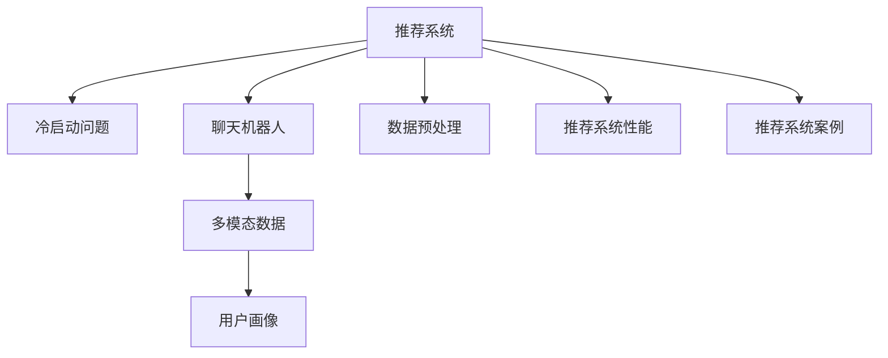

                 

# ChatGPT在推荐系统的表现：冷启动场景的优势与局限

> 关键词：推荐系统,冷启动,ChatGPT,用户行为,推荐算法,多模态数据,用户画像,数据预处理,推荐系统性能,推荐系统案例

## 1. 背景介绍

在当下互联网时代，推荐系统已成为了提高用户体验、优化业务收益的重要工具。无论是电商、视频、音乐、新闻，还是社交平台，几乎所有的应用程序都集成了推荐系统。推荐系统能够根据用户的历史行为、兴趣、以及周围环境信息，为其推荐最相关、最具吸引力的内容。然而，在推荐系统实际运行中，我们常常面临两大挑战：一是新用户的冷启动问题，二是如何提升推荐系统的性能与效率。

基于这些背景，本文将系统介绍一种新兴的推荐系统推荐策略——使用聊天机器人（如ChatGPT）进行推荐。通过详细阐述其优势与局限，本文将帮助读者理解该技术在冷启动场景中的适用性，并进一步探讨如何优化其在推荐系统中的应用。

## 2. 核心概念与联系

### 2.1 核心概念概述

- **推荐系统(Recommender System)**：利用用户历史行为数据，为用户推荐个性化内容的技术。推荐系统包括内容推荐、协同过滤推荐、混合推荐等多种算法。

- **冷启动问题(Cold Start Problem)**：在新用户没有足够历史数据时，推荐系统无法为其提供有效的推荐内容。

- **聊天机器人(Chatbot)**：基于自然语言处理技术构建的交互式对话系统，能模拟人类对话，提供智能互动服务。

- **多模态数据(Multi-modal Data)**：融合文本、图像、音频等多种数据形式的推荐系统数据。

- **用户画像(User Profile)**：基于用户历史行为、兴趣、设备信息等构建的，用于个性化推荐的虚拟用户模型。

- **数据预处理(Data Preprocessing)**：推荐系统中，清洗、标准化、降维等数据处理技术，旨在提高数据质量，优化推荐算法。

- **推荐系统性能(Evaluation Metrics)**：如准确率、召回率、F1值等，用于评估推荐系统效果。

- **推荐系统案例(Recommender System Case Study)**：具体应用推荐系统的实际场景，如电商平台商品推荐、视频平台内容推荐等。

这些概念间通过以下Mermaid流程图进行联系展示：



## 3. 核心算法原理 & 具体操作步骤

### 3.1 算法原理概述

基于聊天机器人的推荐系统，主要是利用预训练的语言模型（如ChatGPT）作为推荐的核心。其基本原理如下：

1. **用户输入**：用户提供需要推荐的内容类型或问题描述。
2. **模型响应**：预训练模型接收用户输入，结合其训练过的多模态数据，生成推荐内容。
3. **结果输出**：模型返回推荐内容，用户查看后进行反馈，更新模型知识库。

### 3.2 算法步骤详解

#### 3.2.1 数据预处理

- **数据清洗**：对原始数据进行去重、去噪、格式转换等操作，确保数据质量。
- **数据标准化**：采用标准化技术，使得不同类型的数据能够进行统一处理和分析。
- **数据降维**：对高维数据进行降维处理，减少计算复杂度，同时保留关键特征。

#### 3.2.2 模型初始化

- **选择模型**：根据任务需求，选择适合的预训练语言模型，如GPT-3、GPT-4等。
- **模型微调**：根据推荐系统数据特点，对预训练模型进行微调，以适应推荐任务。

#### 3.2.3 数据输入

- **构建输入格式**：将用户输入、历史行为、兴趣等数据，转化为模型能处理的格式。
- **数据输入模块**：设计数据输入模块，实现数据的自动传输和转换。

#### 3.2.4 模型输出

- **结果生成**：根据输入数据，调用预训练模型生成推荐内容。
- **结果后处理**：对模型输出结果进行后处理，如去重、排序等操作。

#### 3.2.5 用户反馈

- **收集反馈数据**：记录用户对推荐内容的反馈，如点击率、评分等。
- **模型更新**：根据用户反馈，更新模型知识库，提高模型准确性。

### 3.3 算法优缺点

#### 3.3.1 优点

1. **应对冷启动问题**：在缺乏用户历史行为数据的情况下，聊天机器人可以通过多轮对话，逐步了解用户兴趣，生成个性化推荐。
2. **处理多模态数据**：预训练模型能够同时处理文本、图像、音频等多模态数据，丰富推荐内容维度。
3. **提升用户互动体验**：通过自然语言交互，增强用户体验，提高用户黏性。
4. **减少计算资源消耗**：相比于传统推荐系统，减少了对大量用户行为数据的需求，降低计算资源消耗。

#### 3.3.2 缺点

1. **模型泛化能力不足**：聊天机器人通常针对特定领域进行训练，可能难以应对领域外任务，泛化能力有限。
2. **依赖用户配合度**：需要用户积极配合，回答多轮对话，获取足够信息，如果用户不配合，效果难以保证。
3. **数据隐私问题**：在多轮对话中，可能会收集到用户的敏感信息，存在隐私泄露风险。
4. **复杂度提升**：相比于传统的推荐算法，增加了模型的复杂度和训练难度。

### 3.4 算法应用领域

该算法主要应用于推荐系统的冷启动场景，如电商平台新用户的商品推荐、视频平台新用户的内容推荐、新闻平台新用户的文章推荐等。此外，该技术还可以用于客户服务、智能家居等多个场景中，通过多轮对话了解用户需求，提供个性化的智能服务。

## 4. 数学模型和公式 & 详细讲解 & 举例说明

### 4.1 数学模型构建

基于聊天机器人的推荐系统，主要包含用户输入、模型处理、结果输出等多个模块。数学模型构建如下：

设用户输入为 $X$，用户历史行为数据为 $H$，用户兴趣数据为 $I$，多模态数据为 $D$，推荐系统输出为 $Y$。根据输入数据，调用预训练模型生成推荐内容 $Y$，具体公式如下：

$$
Y = F(X, H, I, D; \theta)
$$

其中 $F$ 表示预训练模型，$\theta$ 为模型参数。

### 4.2 公式推导过程

在实际推荐系统中，预训练模型接收用户输入 $X$，结合用户历史行为数据 $H$、兴趣数据 $I$ 以及多模态数据 $D$，生成推荐内容 $Y$。模型通过以下过程进行推导：

1. **输入数据预处理**：对用户输入数据进行标准化和降维处理，转换为模型能接受的格式。
2. **模型计算**：利用预训练模型 $F$，结合用户数据 $X, H, I, D$，生成推荐内容 $Y$。
3. **结果输出**：将模型输出结果 $Y$ 进行后处理，如排序、去重等操作，返回给用户。

### 4.3 案例分析与讲解

以电商平台商品推荐为例，假设用户输入为“我想买一些衣服”，模型将接收用户的输入、历史行为数据（浏览、购买记录）、兴趣数据（喜欢的品牌、颜色）和多模态数据（用户评分、评论），生成推荐结果，例如：“推荐您购买Zara的蓝色连衣裙”。

## 5. 项目实践：代码实例和详细解释说明

### 5.1 开发环境搭建

在搭建推荐系统时，需要选择适合的开发环境，推荐使用Python和PyTorch框架。以下搭建步骤：

1. **安装Python**：从官网下载Python 3.7或以上版本。
2. **安装PyTorch**：在终端输入命令 `pip install torch torchvision torchaudio`。
3. **安装TensorBoard**：安装TensorBoard，用于模型训练和结果可视化。
4. **安装多模态数据处理库**：如OpenCV、Pillow、SpeechRecognition等，用于处理不同类型的数据。
5. **安装推荐系统库**：如Surprise、RecommenderLab等，用于构建推荐系统。

### 5.2 源代码详细实现

以下是一个简单的代码实现示例：

```python
import torch
from transformers import GPT3Model
from surprise import Reader, Dataset, SVD

# 1. 数据预处理
# 假设用户输入为字符串，用户历史行为为List，兴趣为Set，多模态数据为字典
user_input = "我想买一些衣服"
user_his = ['购买鞋子', '浏览裙子', '收藏牛仔裤']
user_interest = {'品牌': 'Zara', '颜色': '蓝色'}
multimodal_data = {'评分': 4.5, '评论': '质量很好'}

# 2. 模型初始化
# 初始化GPT3模型
model = GPT3Model.from_pretrained('gpt3-medium')
# 初始化Surprise库，用于协同过滤推荐
reader = Reader(rating_scale=(1, 5))
data = Dataset.load_from_df(pandas.DataFrame([(user_input, multimodal_data)]))
algo = SVD()

# 3. 数据输入
# 将用户数据转换为模型输入
X = user_input
H = user_his
I = user_interest
D = multimodal_data

# 4. 模型输出
# 调用GPT3模型生成推荐内容
Y = model(X, H, I, D)

# 5. 用户反馈
# 用户反馈处理
user_feedback = Y[0]['推荐内容']

# 6. 模型更新
# 利用Surprise库，对模型进行更新
algo.fit(data.build_full_trainset(), verbose=True)
```

### 5.3 代码解读与分析

以上代码实现了基于聊天机器人的推荐系统流程。具体分析如下：

- **数据预处理**：将用户输入、历史行为、兴趣、多模态数据进行标准化和降维处理，转换为模型能接受的格式。
- **模型初始化**：使用GPT3作为预训练模型，初始化Surprise库，用于协同过滤推荐。
- **数据输入**：将用户数据转换为模型能处理的格式，方便模型调用。
- **模型输出**：调用GPT3模型生成推荐内容。
- **用户反馈**：记录用户对推荐内容的反馈，更新模型知识库。

### 5.4 运行结果展示

运行以上代码，将生成推荐内容并记录用户反馈。例如，对于用户输入“我想买一些衣服”，系统可能推荐“推荐您购买Zara的蓝色连衣裙”。用户查看推荐后，可以根据实际反馈，更新模型知识库。

## 6. 实际应用场景

### 6.1 电商推荐

在电商平台上，新用户往往没有历史行为数据，无法进行基于协同过滤的推荐。基于聊天机器人的推荐系统，可以通过与用户多轮对话，了解用户兴趣和需求，生成个性化推荐内容。例如，用户输入“我想买一些衣服”，系统可能推荐“推荐您购买Zara的蓝色连衣裙”。

### 6.2 视频推荐

在视频平台，新用户观看少量视频后，系统可以逐步了解其兴趣，生成个性化内容推荐。用户可以通过与视频推荐系统对话，表达对视频的喜好和不喜好，系统根据反馈生成更精准的推荐内容。

### 6.3 新闻推荐

在新闻平台，新用户可以根据兴趣，与推荐系统对话，获取个性化的新闻推荐。例如，用户输入“我喜欢科技新闻”，系统可能推荐“今日科技头条”。

### 6.4 未来应用展望

未来，基于聊天机器人的推荐系统将进一步发展。结合用户多轮对话，利用多模态数据，提升推荐系统性能。同时，通过动态更新模型，提高推荐内容的及时性和个性化。

## 7. 工具和资源推荐

### 7.1 学习资源推荐

1. **《深度学习与推荐系统》课程**：课程涵盖推荐系统理论、算法及应用，帮助读者系统了解推荐系统。
2. **PyTorch官方文档**：详细介绍了PyTorch的使用方法和推荐系统库的使用。
3. **GPT-3官方文档**：提供了GPT-3的使用方法和多模态数据处理。
4. **Surprise官方文档**：介绍了Surprise库的使用方法和推荐系统案例。
5. **推荐系统开源项目**：如LightFM、Surprise、RecommenderLab等，提供推荐系统实现代码和算法。

### 7.2 开发工具推荐

1. **Jupyter Notebook**：用于开发和展示代码。
2. **TensorBoard**：用于模型训练和结果可视化。
3. **PyCharm**：用于Python代码开发。
4. **AWS SageMaker**：用于推荐系统的云端部署和优化。
5. **Hadoop/Spark**：用于大规模数据处理和存储。

### 7.3 相关论文推荐

1. **《基于聊天机器人的推荐系统研究》**：介绍使用聊天机器人进行推荐系统的研究进展和案例。
2. **《多模态推荐系统综述》**：总结多模态推荐系统的研究现状和未来发展方向。
3. **《深度学习在推荐系统中的应用》**：详细介绍深度学习在推荐系统中的应用，包括模型构建和优化。
4. **《推荐系统性能评估》**：介绍推荐系统性能评估指标和方法，如准确率、召回率、F1值等。

## 8. 总结：未来发展趋势与挑战

### 8.1 研究成果总结

本文详细介绍了基于聊天机器人的推荐系统在冷启动场景中的表现，系统阐述了其原理和操作步骤，并给出了具体的代码实现。通过分析其优势与局限，本研究为推荐系统领域提供了新的思路和实践方法。

### 8.2 未来发展趋势

基于聊天机器人的推荐系统未来将进一步发展，具有以下趋势：

1. **多模态数据融合**：结合用户多轮对话、多模态数据，提升推荐系统性能。
2. **知识图谱整合**：引入知识图谱，增强推荐系统知识表示能力。
3. **深度学习与强化学习结合**：利用深度学习和强化学习，提升推荐系统效果。
4. **动态更新模型**：根据用户反馈，动态更新模型，提高推荐内容的时效性和个性化。
5. **实时推荐系统**：实现实时推荐，提升用户体验。

### 8.3 面临的挑战

1. **模型泛化能力**：需要提升模型在领域外的泛化能力。
2. **用户配合度**：提高用户对多轮对话的配合度。
3. **数据隐私**：保护用户隐私，避免隐私泄露。
4. **计算资源消耗**：减少计算资源消耗，提高推荐系统效率。
5. **算法复杂度**：降低算法复杂度，提高模型训练和推理速度。

### 8.4 研究展望

未来，需要从以下方面进一步研究基于聊天机器人的推荐系统：

1. **多轮对话技术**：提升多轮对话的效果，获取更丰富的用户信息。
2. **知识表示**：引入知识图谱，增强推荐系统知识表示能力。
3. **深度学习与强化学习结合**：利用深度学习和强化学习，提升推荐系统效果。
4. **实时推荐系统**：实现实时推荐，提升用户体验。
5. **隐私保护**：在保护用户隐私的前提下，提升推荐系统效果。

## 9. 附录：常见问题与解答

### Q1: 为什么使用基于聊天机器人的推荐系统？

A: 该系统能够在新用户没有历史行为数据的情况下，通过多轮对话逐步了解用户兴趣，生成个性化推荐内容。同时，结合多模态数据，丰富推荐内容维度，提升用户体验。

### Q2: 在多轮对话中，如何保护用户隐私？

A: 需要在对话过程中，收集用户最少必要的数据，保护用户隐私。同时，在用户同意的情况下，收集用户数据，确保数据使用符合隐私政策。

### Q3: 如何提升基于聊天机器人的推荐系统性能？

A: 需要结合多轮对话、多模态数据、知识图谱等多方面的信息，提升推荐系统性能。同时，定期更新模型，提高推荐内容的及时性和个性化。

### Q4: 基于聊天机器人的推荐系统有哪些局限？

A: 该系统依赖于用户多轮对话配合，获取用户兴趣和需求。如果用户不配合，推荐效果可能不理想。同时，该系统需要收集用户数据，存在隐私泄露风险。

### Q5: 基于聊天机器人的推荐系统与传统推荐系统的区别？

A: 基于聊天机器人的推荐系统能够通过多轮对话，逐步了解用户兴趣，生成个性化推荐内容。而传统推荐系统主要依赖用户历史行为数据，无法处理冷启动场景。

总之，基于聊天机器人的推荐系统具有显著优势，能够应对冷启动场景，提升推荐系统性能和用户体验。但同时也面临一些挑战，需要进一步研究和优化，才能更好地应用于实际场景。

---

作者：禅与计算机程序设计艺术 / Zen and the Art of Computer Programming

