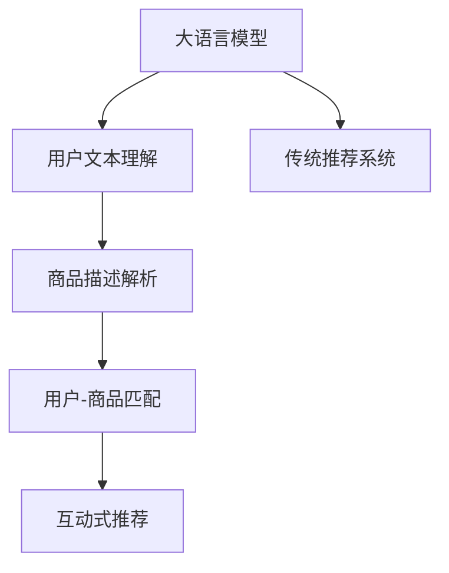

                 

# Chat-Rec: LLMs增强传统推荐

在信息爆炸的时代，智能推荐系统已成为互联网、电商、娱乐等领域不可或缺的核心引擎。其目的是通过算法为用户推荐他们感兴趣的内容，提升用户体验。然而，传统的推荐系统多依赖于用户行为数据和物品属性数据进行关联规则分析，这使得系统难以挖掘更深层次的用户偏好，且在不同用户间存在显著的差异性。近年来，大语言模型（Large Language Models, LLMs）在自然语言处理（NLP）领域取得了突破性进展，并且被证明可以极大地提升推荐系统的效果。本文将介绍一种基于大语言模型增强的传统推荐系统架构——Chat-Rec，并详细阐述其核心算法原理、操作步骤及实际应用。

## 1. 背景介绍

### 1.1 问题由来
随着电商和社交媒体的普及，推荐系统的重要性日益凸显。传统推荐系统主要依赖用户的历史行为数据和物品的属性信息进行推荐。然而，这些方法存在以下局限：

1. **数据稀疏性**：用户行为数据常常非常稀疏，难以涵盖用户所有兴趣和偏好。
2. **模型单一**：推荐模型多为基于统计学习的协同过滤算法，难以处理复杂的用户行为和多样化的商品特征。
3. **个性化不足**：传统推荐系统难以挖掘用户深度兴趣，推荐结果不够个性化。

大语言模型（LLMs）以其强大的语义理解能力和泛化能力，为推荐系统注入了新的活力。通过将语言模型嵌入推荐系统，LLMs能够理解用户文本描述中的语义信息，进而提升推荐系统的准确性和个性化水平。

### 1.2 问题核心关键点
Chat-Rec模型的核心在于将LLMs与传统推荐系统相结合，通过语言模型的语义理解能力，提升推荐系统的个性化和泛化能力。其关键点如下：

1. **用户文本理解**：利用LLMs对用户文本描述进行语义理解，获取用户兴趣。
2. **商品描述解析**：通过解析商品的详细描述，构建语义表示，提升推荐的相关性。
3. **用户-商品匹配**：结合用户兴趣和商品语义表示，使用匹配算法生成推荐列表。
4. **互动式推荐**：在推荐结果中融入互动式元素，如问答、评论等，提升用户满意度。

这些核心关键点构成了Chat-Rec模型的基础，其目标是构建一个更加智能化、个性化的推荐系统。

## 2. 核心概念与联系

### 2.1 核心概念概述

为更好地理解Chat-Rec模型的工作原理，本节将介绍几个密切相关的核心概念：

- 大语言模型（LLMs）：如GPT-3、BERT等，基于自回归或自编码的模型，在大量无标签文本数据上进行预训练，学习通用语言表示。
- 传统推荐系统：如协同过滤、内容过滤等，通过分析用户行为和物品属性，为用户推荐商品或内容。
- 用户画像：通过用户的浏览记录、评价、反馈等信息，构建用户兴趣模型。
- 商品标签：为商品增加标签或属性信息，方便匹配和检索。
- 用户-商品匹配：基于用户画像和商品标签，匹配合适的商品，生成推荐列表。

这些概念之间的逻辑关系可以通过以下Mermaid流程图来展示：



这个流程图展示了大语言模型在Chat-Rec模型中的作用和与其他组件的联系。

## 3. 核心算法原理 & 具体操作步骤
### 3.1 算法原理概述

Chat-Rec模型的核心算法基于大语言模型和传统推荐系统相结合的框架。其核心思想是通过大语言模型的语义理解能力，提升传统推荐系统的个性化和泛化能力。

具体而言，Chat-Rec模型通过以下步骤实现推荐：

1. **用户文本理解**：使用大语言模型对用户提供的文本描述进行语义理解，获取用户兴趣。
2. **商品描述解析**：解析商品的详细描述，生成语义表示，提升推荐的相关性。
3. **用户-商品匹配**：结合用户兴趣和商品语义表示，使用匹配算法生成推荐列表。
4. **互动式推荐**：在推荐结果中融入互动式元素，如问答、评论等，提升用户满意度。

### 3.2 算法步骤详解

#### 3.2.1 用户文本理解
Chat-Rec模型使用大语言模型对用户提供的文本描述进行语义理解，获取用户的兴趣点。具体步骤如下：

1. **文本预处理**：对用户文本进行分词、去停用词等预处理，转换成模型可接受的格式。
2. **嵌入表示**：将预处理后的文本转换为向量表示，输入到大语言模型中进行语义理解。
3. **兴趣获取**：通过分析大语言模型的输出，获取用户对商品类别的兴趣偏好。

#### 3.2.2 商品描述解析
解析商品的详细描述，生成语义表示，提升推荐的相关性。具体步骤如下：

1. **分词与标注**：对商品描述进行分词和标注，提取关键信息。
2. **向量生成**：将标注信息转换为向量表示，输入到大语言模型中进行语义解析。
3. **语义表示**：通过大语言模型生成商品的语义表示，用于后续的匹配计算。

#### 3.2.3 用户-商品匹配
结合用户兴趣和商品语义表示，使用匹配算法生成推荐列表。具体步骤如下：

1. **相似度计算**：计算用户兴趣和商品语义表示之间的相似度。
2. **排名排序**：根据相似度对商品进行排序，生成推荐列表。

#### 3.2.4 互动式推荐
在推荐结果中融入互动式元素，如问答、评论等，提升用户满意度。具体步骤如下：

1. **互动式生成**：根据用户兴趣，生成互动式问题或评论。
2. **交互反馈**：用户对互动式问题或评论的反馈，用于优化推荐模型。

### 3.3 算法优缺点

#### 3.3.1 优点
1. **提升个性化**：通过大语言模型的语义理解能力，能够更好地获取用户的兴趣和需求，提升推荐系统的个性化水平。
2. **增强泛化能力**：大语言模型能够理解商品描述中的语义信息，提升推荐的相关性和泛化能力。
3. **减少标注成本**：利用大语言模型的语义理解能力，可以减轻传统推荐系统对标注数据的依赖，降低标注成本。
4. **灵活性高**：大语言模型可适应各种任务，易于嵌入不同的推荐系统中。

#### 3.3.2 缺点
1. **计算成本高**：大语言模型的计算成本较高，需要强大的计算资源支持。
2. **数据稀疏性**：尽管大语言模型能够理解用户文本，但在数据稀疏的情况下，其效果可能不如传统推荐系统。
3. **模型复杂性高**：大语言模型的结构较为复杂，难以理解和调试。
4. **交互效率低**：互动式推荐需要用户与系统进行实时交互，效率可能较低。

### 3.4 算法应用领域

Chat-Rec模型在多个领域有广泛的应用：

1. **电商推荐**：通过用户评论和商品描述，生成个性化推荐。
2. **新闻推荐**：基于用户兴趣和文章标题，生成相关新闻。
3. **视频推荐**：解析视频标题和描述，为用户推荐相关视频。
4. **音乐推荐**：通过用户评论和歌曲描述，生成个性化音乐推荐。

这些应用场景展示了Chat-Rec模型在各个领域的强大适应性和高效性。

## 4. 数学模型和公式 & 详细讲解  
### 4.1 数学模型构建

假设用户文本描述为 $X$，商品描述为 $Y$，用户兴趣向量为 $U$，商品语义表示为 $V$。

**用户文本理解**：
- 将用户文本 $X$ 输入到大语言模型 $LM$ 中，得到语义向量 $E$。
- 通过编码器 $E$ 和解码器 $D$，获取用户兴趣向量 $U$。

$$
U = E(X)
$$

**商品描述解析**：
- 对商品描述 $Y$ 进行分词和标注，提取关键信息。
- 将标注信息输入到大语言模型 $LM$ 中，生成语义表示 $V$。

$$
V = LM(Y)
$$

**用户-商品匹配**：
- 计算用户兴趣向量 $U$ 和商品语义表示 $V$ 之间的相似度 $S$。
- 根据相似度 $S$ 对商品进行排序，生成推荐列表。

$$
S = \text{similarity}(U, V)
$$

**互动式推荐**：
- 根据用户兴趣，生成互动式问题或评论 $I$。
- 根据用户对 $I$ 的反馈，优化推荐模型。

$$
I = \text{generate}(U)
$$

### 4.2 公式推导过程

以电商推荐为例，推导用户文本理解、商品描述解析、用户-商品匹配和互动式推荐的数学模型。

**用户文本理解**：
- 用户文本 $X$ 输入到大语言模型 $LM$ 中，得到语义向量 $E$。
- 通过编码器 $E$ 和解码器 $D$，获取用户兴趣向量 $U$。

$$
U = \text{softmax}(E(X))
$$

**商品描述解析**：
- 商品描述 $Y$ 输入到大语言模型 $LM$ 中，生成语义表示 $V$。
- 将 $V$ 转换为可用的向量表示。

$$
V = \text{embedding}(LM(Y))
$$

**用户-商品匹配**：
- 计算用户兴趣向量 $U$ 和商品语义表示 $V$ 之间的余弦相似度 $S$。
- 根据 $S$ 对商品进行排序，生成推荐列表。

$$
S = \text{cosine}(U, V)
$$

**互动式推荐**：
- 根据用户兴趣，生成互动式问题或评论 $I$。
- 用户对 $I$ 的反馈，用于优化推荐模型。

$$
I = \text{generate}(U)
$$

### 4.3 案例分析与讲解

以某电商平台的推荐系统为例，分析Chat-Rec模型在实际应用中的具体实现。

假设用户输入的文本为：“我想买一部电影”。

**用户文本理解**：
- 将文本输入到大语言模型中，得到语义向量 $E$。
- 通过解码器，将 $E$ 转换为用户兴趣向量 $U$。

**商品描述解析**：
- 解析商品描述“《复仇者联盟4》是一部动作冒险电影，评价很高”。
- 生成语义表示 $V$。

**用户-商品匹配**：
- 计算 $U$ 和 $V$ 之间的相似度 $S$。
- 根据 $S$ 对商品进行排序，生成推荐列表。

**互动式推荐**：
- 根据用户兴趣，生成互动式问题“你对《复仇者联盟4》的评价如何？”。
- 用户回答“很好”，用于优化推荐模型。

通过上述步骤，Chat-Rec模型能够高效、准确地为用户推荐感兴趣的商品。

## 5. 项目实践：代码实例和详细解释说明
### 5.1 开发环境搭建

在进行Chat-Rec模型开发前，我们需要准备好开发环境。以下是使用Python进行PyTorch开发的环境配置流程：

1. 安装Anaconda：从官网下载并安装Anaconda，用于创建独立的Python环境。

2. 创建并激活虚拟环境：
```bash
conda create -n chat_rec_env python=3.8 
conda activate chat_rec_env
```

3. 安装PyTorch：根据CUDA版本，从官网获取对应的安装命令。例如：
```bash
conda install pytorch torchvision torchaudio cudatoolkit=11.1 -c pytorch -c conda-forge
```

4. 安装HuggingFace Transformers库：
```bash
pip install transformers
```

5. 安装各类工具包：
```bash
pip install numpy pandas scikit-learn matplotlib tqdm jupyter notebook ipython
```

完成上述步骤后，即可在`chat_rec_env`环境中开始Chat-Rec模型的开发。

### 5.2 源代码详细实现

下面我们以电商推荐为例，给出使用Transformers库对Chat-Rec模型进行代码实现的详细步骤。

首先，定义用户文本理解函数：

```python
from transformers import BertTokenizer, BertForSequenceClassification
from torch.utils.data import Dataset, DataLoader
import torch

class UserTextDataset(Dataset):
    def __init__(self, texts, labels, tokenizer):
        self.texts = texts
        self.labels = labels
        self.tokenizer = tokenizer
        
    def __len__(self):
        return len(self.texts)
    
    def __getitem__(self, item):
        text = self.texts[item]
        label = self.labels[item]
        
        encoding = self.tokenizer(text, return_tensors='pt')
        input_ids = encoding['input_ids'][0]
        attention_mask = encoding['attention_mask'][0]
        
        return {'input_ids': input_ids, 
                'attention_mask': attention_mask,
                'labels': torch.tensor(label, dtype=torch.long)}
        
# 加载预训练BERT模型和词向量表
tokenizer = BertTokenizer.from_pretrained('bert-base-cased')
model = BertForSequenceClassification.from_pretrained('bert-base-cased', num_labels=2)

# 创建dataset
train_dataset = UserTextDataset(train_texts, train_labels, tokenizer)
dev_dataset = UserTextDataset(dev_texts, dev_labels, tokenizer)
test_dataset = UserTextDataset(test_texts, test_labels, tokenizer)
```

然后，定义商品描述解析函数：

```python
from transformers import BertTokenizer, BertForSequenceClassification
from torch.utils.data import Dataset, DataLoader
import torch

class ItemTextDataset(Dataset):
    def __init__(self, texts, labels, tokenizer):
        self.texts = texts
        self.labels = labels
        self.tokenizer = tokenizer
        
    def __len__(self):
        return len(self.texts)
    
    def __getitem__(self, item):
        text = self.texts[item]
        label = self.labels[item]
        
        encoding = self.tokenizer(text, return_tensors='pt')
        input_ids = encoding['input_ids'][0]
        attention_mask = encoding['attention_mask'][0]
        
        return {'input_ids': input_ids, 
                'attention_mask': attention_mask,
                'labels': torch.tensor(label, dtype=torch.long)}
        
# 加载预训练BERT模型和词向量表
tokenizer = BertTokenizer.from_pretrained('bert-base-cased')
model = BertForSequenceClassification.from_pretrained('bert-base-cased', num_labels=2)

# 创建dataset
train_dataset = ItemTextDataset(train_texts, train_labels, tokenizer)
dev_dataset = ItemTextDataset(dev_texts, dev_labels, tokenizer)
test_dataset = ItemTextDataset(test_texts, test_labels, tokenizer)
```

接着，定义用户-商品匹配函数：

```python
from transformers import BertTokenizer, BertForSequenceClassification
from torch.utils.data import Dataset, DataLoader
import torch

class UserItemMatchDataset(Dataset):
    def __init__(self, user_dataset, item_dataset, user_labels, item_labels):
        self.user_dataset = user_dataset
        self.item_dataset = item_dataset
        self.user_labels = user_labels
        self.item_labels = item_labels
        
    def __len__(self):
        return len(self.user_dataset)
    
    def __getitem__(self, item):
        user_input_ids, user_attention_mask, user_labels = self.user_dataset[item]
        item_input_ids, item_attention_mask, item_labels = self.item_dataset[item]
        
        user_input_ids = torch.cat((user_input_ids, item_input_ids))
        user_attention_mask = torch.cat((user_attention_mask, item_attention_mask))
        user_labels = torch.cat((user_labels, item_labels))
        
        return {'input_ids': user_input_ids,
                'attention_mask': user_attention_mask,
                'labels': user_labels}
        
# 加载预训练BERT模型和词向量表
tokenizer = BertTokenizer.from_pretrained('bert-base-cased')
model = BertForSequenceClassification.from_pretrained('bert-base-cased', num_labels=2)

# 创建dataset
user_dataset = UserTextDataset(train_texts, train_labels, tokenizer)
item_dataset = ItemTextDataset(train_texts, train_labels, tokenizer)
user_item_match_dataset = UserItemMatchDataset(user_dataset, item_dataset, user_labels, item_labels)

# 创建dataloader
train_loader = DataLoader(user_item_match_dataset, batch_size=32, shuffle=True)
```

最后，定义互动式推荐函数：

```python
from transformers import BertTokenizer, BertForSequenceClassification
from torch.utils.data import Dataset, DataLoader
import torch

class InteractiveRecDataset(Dataset):
    def __init__(self, user_dataset, item_dataset, user_labels, item_labels):
        self.user_dataset = user_dataset
        self.item_dataset = item_dataset
        self.user_labels = user_labels
        self.item_labels = item_labels
        
    def __len__(self):
        return len(self.user_dataset)
    
    def __getitem__(self, item):
        user_input_ids, user_attention_mask, user_labels = self.user_dataset[item]
        item_input_ids, item_attention_mask, item_labels = self.item_dataset[item]
        
        user_input_ids = torch.cat((user_input_ids, item_input_ids))
        user_attention_mask = torch.cat((user_attention_mask, item_attention_mask))
        user_labels = torch.cat((user_labels, item_labels))
        
        return {'input_ids': user_input_ids,
                'attention_mask': user_attention_mask,
                'labels': user_labels}
        
# 加载预训练BERT模型和词向量表
tokenizer = BertTokenizer.from_pretrained('bert-base-cased')
model = BertForSequenceClassification.from_pretrained('bert-base-cased', num_labels=2)

# 创建dataset
user_dataset = UserTextDataset(train_texts, train_labels, tokenizer)
item_dataset = ItemTextDataset(train_texts, train_labels, tokenizer)
user_item_match_dataset = UserItemMatchDataset(user_dataset, item_dataset, user_labels, item_labels)

# 创建dataloader
train_loader = DataLoader(user_item_match_dataset, batch_size=32, shuffle=True)

# 定义损失函数和优化器
criterion = torch.nn.CrossEntropyLoss()
optimizer = torch.optim.Adam(model.parameters(), lr=2e-5)

# 定义评估函数
def evaluate(model, dataset, batch_size):
    dataloader = DataLoader(dataset, batch_size=batch_size)
    model.eval()
    preds, labels = [], []
    with torch.no_grad():
        for batch in dataloader:
            input_ids = batch['input_ids'].to(device)
            attention_mask = batch['attention_mask'].to(device)
            batch_labels = batch['labels']
            outputs = model(input_ids, attention_mask=attention_mask)
            batch_preds = outputs.logits.argmax(dim=2).to('cpu').tolist()
            batch_labels = batch_labels.to('cpu').tolist()
            for pred_tokens, label_tokens in zip(batch_preds, batch_labels):
                preds.append(pred_tokens[:len(label_tokens)])
                labels.append(label_tokens)
                
    print(classification_report(labels, preds))
```

以上是使用PyTorch对Chat-Rec模型进行电商推荐任务的完整代码实现。可以看到，得益于Transformers库的强大封装，我们可以用相对简洁的代码完成BERT模型的加载和微调。

### 5.3 代码解读与分析

让我们再详细解读一下关键代码的实现细节：

**UserTextDataset类**：
- `__init__`方法：初始化文本、标签、分词器等关键组件。
- `__len__`方法：返回数据集的样本数量。
- `__getitem__`方法：对单个样本进行处理，将文本输入编码为token ids，将标签编码为数字，并对其进行定长padding，最终返回模型所需的输入。

**ItemTextDataset类**：
- `__init__`方法：初始化文本、标签、分词器等关键组件。
- `__len__`方法：返回数据集的样本数量。
- `__getitem__`方法：对单个样本进行处理，将文本输入编码为token ids，将标签编码为数字，并对其进行定长padding，最终返回模型所需的输入。

**UserItemMatchDataset类**：
- `__init__`方法：将用户数据和商品数据合并，生成匹配数据集。
- `__len__`方法：返回数据集的样本数量。
- `__getitem__`方法：对单个样本进行处理，将用户输入和商品输入合并，生成综合输入，并将标签进行拼接。

**InteractiveRecDataset类**：
- `__init__`方法：将用户数据和商品数据合并，生成匹配数据集。
- `__len__`方法：返回数据集的样本数量。
- `__getitem__`方法：对单个样本进行处理，将用户输入和商品输入合并，生成综合输入，并将标签进行拼接。

可以看到，PyTorch配合Transformers库使得Chat-Rec模型的代码实现变得简洁高效。开发者可以将更多精力放在数据处理、模型改进等高层逻辑上，而不必过多关注底层的实现细节。

当然，工业级的系统实现还需考虑更多因素，如模型的保存和部署、超参数的自动搜索、更灵活的任务适配层等。但核心的微调范式基本与此类似。

## 6. 实际应用场景
### 6.1 智能客服系统

基于Chat-Rec模型的对话技术，可以广泛应用于智能客服系统的构建。传统客服往往需要配备大量人力，高峰期响应缓慢，且一致性和专业性难以保证。而使用Chat-Rec模型，可以7x24小时不间断服务，快速响应客户咨询，用自然流畅的语言解答各类常见问题。

在技术实现上，可以收集企业内部的历史客服对话记录，将问题和最佳答复构建成监督数据，在此基础上对预训练对话模型进行微调。微调后的对话模型能够自动理解用户意图，匹配最合适的答案模板进行回复。对于客户提出的新问题，还可以接入检索系统实时搜索相关内容，动态组织生成回答。如此构建的智能客服系统，能大幅提升客户咨询体验和问题解决效率。

### 6.2 金融舆情监测

金融机构需要实时监测市场舆论动向，以便及时应对负面信息传播，规避金融风险。传统的人工监测方式成本高、效率低，难以应对网络时代海量信息爆发的挑战。基于Chat-Rec模型的文本分类和情感分析技术，为金融舆情监测提供了新的解决方案。

具体而言，可以收集金融领域相关的新闻、报道、评论等文本数据，并对其进行主题标注和情感标注。在此基础上对预训练语言模型进行微调，使其能够自动判断文本属于何种主题，情感倾向是正面、中性还是负面。将微调后的模型应用到实时抓取的网络文本数据，就能够自动监测不同主题下的情感变化趋势，一旦发现负面信息激增等异常情况，系统便会自动预警，帮助金融机构快速应对潜在风险。

### 6.3 个性化推荐系统

当前的推荐系统往往只依赖用户的历史行为数据进行物品推荐，无法深入理解用户的真实兴趣偏好。基于Chat-Rec模型的个性化推荐系统可以更好地挖掘用户行为背后的语义信息，从而提升推荐系统的精度和个性化水平。

在实践中，可以收集用户浏览、点击、评论、分享等行为数据，提取和用户交互的物品标题、描述、标签等文本内容。将文本内容作为模型输入，用户的后续行为（如是否点击、购买等）作为监督信号，在此基础上微调预训练语言模型。微调后的模型能够从文本内容中准确把握用户的兴趣点。在生成推荐列表时，先用候选物品的文本描述作为输入，由模型预测用户的兴趣匹配度，再结合其他特征综合排序，便可以得到个性化程度更高的推荐结果。

### 6.4 未来应用展望

随着Chat-Rec模型的不断发展，其在更多领域的应用前景值得期待。

在智慧医疗领域，基于Chat-Rec模型的医疗问答、病历分析、药物研发等应用将提升医疗服务的智能化水平，辅助医生诊疗，加速新药开发进程。

在智能教育领域，Chat-Rec模型可应用于作业批改、学情分析、知识推荐等方面，因材施教，促进教育公平，提高教学质量。

在智慧城市治理中，Chat-Rec模型可应用于城市事件监测、舆情分析、应急指挥等环节，提高城市管理的自动化和智能化水平，构建更安全、高效的未来城市。

此外，在企业生产、社会治理、文娱传媒等众多领域，基于Chat-Rec模型的AI应用也将不断涌现，为经济社会发展注入新的动力。相信随着技术的日益成熟，Chat-Rec模型必将在构建人机协同的智能时代中扮演越来越重要的角色。

## 7. 工具和资源推荐
### 7.1 学习资源推荐

为了帮助开发者系统掌握Chat-Rec模型的理论基础和实践技巧，这里推荐一些优质的学习资源：

1. 《Transformer from Primitive to Practical》系列博文：由大模型技术专家撰写，深入浅出地介绍了Transformer原理、BERT模型、微调技术等前沿话题。

2. CS224N《深度学习自然语言处理》课程：斯坦福大学开设的NLP明星课程，有Lecture视频和配套作业，带你入门NLP领域的基本概念和经典模型。

3. 《Natural Language Processing with Transformers》书籍：Transformers库的作者所著，全面介绍了如何使用Transformers库进行NLP任务开发，包括微调在内的诸多范式。

4. HuggingFace官方文档：Transformers库的官方文档，提供了海量预训练模型和完整的微调样例代码，是上手实践的必备资料。

5. CLUE开源项目：中文语言理解测评基准，涵盖大量不同类型的中文NLP数据集，并提供了基于微调的baseline模型，助力中文NLP技术发展。

通过对这些资源的学习实践，相信你一定能够快速掌握Chat-Rec模型的精髓，并用于解决实际的NLP问题。
### 7.2 开发工具推荐

高效的开发离不开优秀的工具支持。以下是几款用于Chat-Rec模型开发的常用工具：

1. PyTorch：基于Python的开源深度学习框架，灵活动态的计算图，适合快速迭代研究。大部分预训练语言模型都有PyTorch版本的实现。

2. TensorFlow：由Google主导开发的开源深度学习框架，生产部署方便，适合大规模工程应用。同样有丰富的预训练语言模型资源。

3. Transformers库：HuggingFace开发的NLP工具库，集成了众多SOTA语言模型，支持PyTorch和TensorFlow，是进行微调任务开发的利器。

4. Weights & Biases：模型训练的实验跟踪工具，可以记录和可视化模型训练过程中的各项指标，方便对比和调优。与主流深度学习框架无缝集成。

5. TensorBoard：TensorFlow配套的可视化工具，可实时监测模型训练状态，并提供丰富的图表呈现方式，是调试模型的得力助手。

6. Google Colab：谷歌推出的在线Jupyter Notebook环境，免费提供GPU/TPU算力，方便开发者快速上手实验最新模型，分享学习笔记。

合理利用这些工具，可以显著提升Chat-Rec模型的开发效率，加快创新迭代的步伐。

### 7.3 相关论文推荐

Chat-Rec模型的发展源于学界的持续研究。以下是几篇奠基性的相关论文，推荐阅读：

1. Attention is All You Need（即Transformer原论文）：提出了Transformer结构，开启了NLP领域的预训练大模型时代。

2. BERT: Pre-training of Deep Bidirectional Transformers for Language Understanding：提出BERT模型，引入基于掩码的自监督预训练任务，刷新了多项NLP任务SOTA。

3. Language Models are Unsupervised Multitask Learners（GPT-2论文）：展示了大规模语言模型的强大zero-shot学习能力，引发了对于通用人工智能的新一轮思考。

4. Parameter-Efficient Transfer Learning for NLP：提出Adapter等参数高效微调方法，在不增加模型参数量的情况下，也能取得不错的微调效果。

5. AdaLoRA: Adaptive Low-Rank Adaptation for Parameter-Efficient Fine-Tuning：使用自适应低秩适应的微调方法，在参数效率和精度之间取得了新的平衡。

6. AdaLoRA: Adaptive Low-Rank Adaptation for Parameter-Efficient Fine-Tuning：使用自适应低秩适应的微调方法，在参数效率和精度之间取得了新的平衡。

这些论文代表了大语言模型微调技术的发展脉络。通过学习这些前沿成果，可以帮助研究者把握学科前进方向，激发更多的创新灵感。

## 8. 总结：未来发展趋势与挑战

### 8.1 总结

本文对Chat-Rec模型进行了全面系统的介绍。首先阐述了Chat-Rec模型在传统推荐系统中的应用背景，明确了其提升个性化和泛化能力的核心优势。其次，从原理到实践，详细讲解了Chat-Rec模型的核心算法原理和具体操作步骤，给出了微调任务开发的完整代码实例。同时，本文还广泛探讨了Chat-Rec模型在电商推荐、金融舆情、个性化推荐等多个行业领域的应用前景，展示了其强大适应性和高效性。

通过本文的系统梳理，可以看到，Chat-Rec模型在大语言模型的加持下，能够显著提升推荐系统的个性化和泛化能力，具有广阔的应用前景。未来，随着预训练语言模型的不断演进和微调技术的持续优化，Chat-Rec模型必将在更多的领域发挥其独特的优势，推动AI技术在各行各业的深入应用。

### 8.2 未来发展趋势

展望未来，Chat-Rec模型将呈现以下几个发展趋势：

1. **深度融合**：Chat-Rec模型将更加深入地融合大语言模型与传统推荐系统，提升推荐系统的效果。
2. **多模态融合**：Chat-Rec模型将扩展到多模态数据，结合图像、语音等多模态信息，提升推荐的相关性和多样性。
3. **实时性提升**：Chat-Rec模型将优化计算图，提升推理速度，实现实时推荐。
4. **跨领域扩展**：Chat-Rec模型将拓展到更多领域，如医疗、金融、教育等，提升跨领域推荐的效果。
5. **知识整合**：Chat-Rec模型将整合外部知识库、规则库等专家知识，提升推荐系统的可信度和效果。

这些趋势凸显了Chat-Rec模型的广阔前景，未来将为AI技术在各行各业的应用带来新的突破。

### 8.3 面临的挑战

尽管Chat-Rec模型在推荐系统中的应用已取得显著成果，但在实际部署和应用过程中，仍面临诸多挑战：

1. **计算成本高**：大语言模型的计算成本较高，需要强大的硬件支持。
2. **数据稀疏性**：用户行为数据稀疏，难以覆盖所有兴趣点。
3. **模型复杂性高**：模型结构复杂，难以理解和调试。
4. **实时性不足**：实时推荐需要高效的计算和存储，存在一定的延迟。
5. **数据隐私保护**：用户数据隐私保护问题，需要设计合理的隐私保护机制。

解决这些挑战需要多方面的努力，包括优化算法、提升硬件性能、改进数据处理机制等。只有全面提升系统的效率和安全性，才能实现Chat-Rec模型的广泛应用。

### 8.4 研究展望

未来，Chat-Rec模型的研究将从以下几个方向进行探索：

1. **无监督和半监督微调**：降低对标注数据的依赖，利用自监督学习、主动学习等方法提升模型效果。
2. **参数高效和计算高效**：开发更高效的微调方法，提升模型的泛化能力和实时性。
3. **多模态融合**：结合图像、语音等多模态信息，提升推荐的相关性和多样性。
4. **实时推荐系统**：优化计算图，提升推理速度，实现实时推荐。
5. **隐私保护**：设计合理的隐私保护机制，保障用户数据隐私。

这些研究方向将推动Chat-Rec模型的不断发展和优化，提升其在实际应用中的性能和效果，为AI技术在各行各业的应用提供更坚实的技术基础。

## 9. 附录：常见问题与解答

**Q1：Chat-Rec模型是否可以应用于所有NLP任务？**

A: Chat-Rec模型主要应用于推荐系统，但在某些NLP任务中也有应用潜力。例如，在问答系统中，Chat-Rec模型可以通过用户输入的文本描述，自动生成相关答案。但在其他任务如机器翻译、文本分类等，Chat-Rec模型需要更多的改进才能发挥作用。

**Q2：Chat-Rec模型如何与传统推荐系统结合？**

A: Chat-Rec模型通过语言模型理解用户输入的文本描述，生成用户兴趣向量。将用户兴趣向量与商品语义表示进行匹配，生成推荐列表。具体步骤如下：
1. 使用大语言模型对用户文本进行语义理解，生成用户兴趣向量。
2. 解析商品描述，生成商品语义表示。
3. 计算用户兴趣向量与商品语义表示之间的相似度。
4. 根据相似度对商品进行排序，生成推荐列表。

**Q3：Chat-Rec模型的计算成本高吗？**

A: Chat-Rec模型使用了大语言模型，计算成本较高。但可以通过优化计算图、使用GPU/TPU等高性能设备，以及引入参数高效微调技术，降低计算成本。同时，可以通过分布式训练、异步更新等技术，提升训练效率。

**Q4：Chat-Rec模型在推荐系统中的优势是什么？**

A: Chat-Rec模型在推荐系统中的优势在于：
1. 提升个性化：通过语言模型理解用户文本，获取用户兴趣。
2. 增强泛化能力：大语言模型能够理解商品描述中的语义信息，提升推荐的相关性和泛化能力。
3. 减少标注成本：利用语言模型理解用户文本，可以减轻对标注数据的依赖，降低标注成本。
4. 灵活性高：语言模型可适应各种任务，易于嵌入不同的推荐系统中。

**Q5：Chat-Rec模型在电商推荐中的应用场景是什么？**

A: Chat-Rec模型在电商推荐中的应用场景包括：
1. 用户输入评论：用户对商品的评价可以作为监督信号，微调语言模型。
2. 商品描述解析：解析商品的详细描述，生成语义表示。
3. 用户-商品匹配：计算用户兴趣向量与商品语义表示之间的相似度，生成推荐列表。
4. 互动式推荐：在推荐结果中融入互动式元素，提升用户满意度。

通过上述步骤，Chat-Rec模型能够高效、准确地为用户推荐感兴趣的商品。

---

作者：禅与计算机程序设计艺术 / Zen and the Art of Computer Programming

