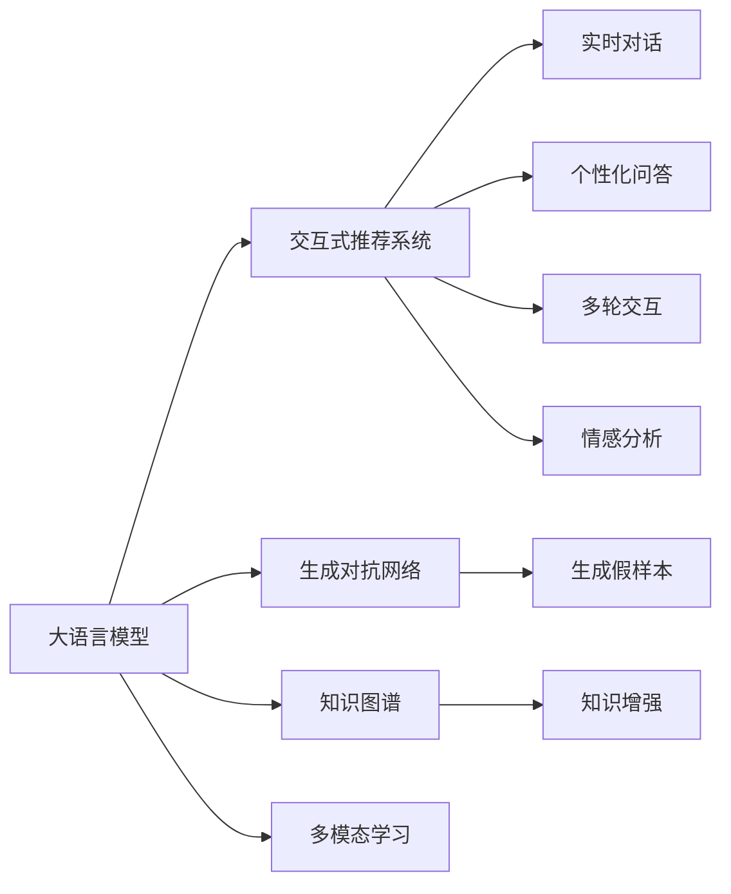

                 

# Chat-Rec：交互式推荐

## 1. 背景介绍

### 1.1 问题由来

推荐系统已经广泛应用在电商、视频、音乐、新闻等领域，是现代互联网应用中不可或缺的一部分。传统的推荐算法，如协同过滤、基于内容的推荐，主要依赖于用户的历史行为和物品属性。然而，这些算法在个性化推荐方面存在一定局限，例如难以处理稀疏数据、对长尾物品推荐效果不佳等问题。近年来，随着深度学习技术的发展，神经网络推荐系统开始受到更多关注，例如基于CNN、RNN的推荐系统等。

虽然这些方法在一定程度上提升了推荐效果，但在交互性方面仍存在不足。用户与系统的交互方式通常是单向的，用户输入查询后，系统直接返回推荐结果，难以实时响应用户的个性化需求。因此，我们需要一种新的推荐方式，使推荐系统具有更高的交互性和个性化，更能适应用户的实时需求。

### 1.2 问题核心关键点

在推荐系统中引入交互式元素，能大幅提升用户的满意度和系统的推荐效果。主要通过以下方式实现：

1. **实时对话**：推荐系统能够实时响应用户的提问，提供即时反馈，使推荐过程更加生动、自然。
2. **个性化问答**：推荐系统能够理解用户的真实需求，提供更个性化、更精准的推荐。
3. **多轮交互**：推荐系统能够持续跟踪用户的兴趣变化，提供多轮交互，构建更完整的用户画像。
4. **情感分析**：推荐系统能够理解用户的情感，提供符合用户情绪的推荐，提升用户满意度。

这些交互式推荐方式需要结合多轮对话系统和推荐算法，因此本文将重点探讨基于大语言模型（Large Language Model, LLM）的推荐系统，即Chat-Rec。

## 2. 核心概念与联系

### 2.1 核心概念概述

为了更好地理解基于大语言模型的交互式推荐系统，首先需要明确几个关键概念：

1. **大语言模型（LLM）**：以自回归（如GPT）或自编码（如BERT）模型为代表的预训练语言模型。通过在大规模无标签文本语料上进行预训练，学习通用的语言表示，具备强大的语言理解和生成能力。
2. **交互式推荐系统**：在推荐过程中，结合多轮对话和推荐算法，实时响应用户的个性化需求，提供更精准、更满意的推荐结果。
3. **生成对抗网络（GAN）**：一种通过对抗训练过程生成假样本的深度学习模型，能够在特定领域生成高质量的样本数据。
4. **知识图谱**：将知识元素按照一定的关系进行组织，构建出一个具有语义关系的知识网络。
5. **多模态学习**：结合视觉、语音、文本等多模态数据，进行联合建模，提升推荐系统的综合性能。

这些概念之间的逻辑关系可以通过以下Mermaid流程图来展示：



这个流程图展示了大语言模型的核心概念及其与交互式推荐系统的关系：

1. 大语言模型通过预训练获得基础能力。
2. 交互式推荐系统利用大语言模型构建多轮对话和个性化推荐。
3. 生成对抗网络生成模拟数据，用于模型训练和测试。
4. 知识图谱增强模型对领域知识的理解。
5. 多模态学习结合多种数据模态，提升推荐系统性能。

这些概念共同构成了交互式推荐系统的核心技术框架，使其能够在各种场景下提供更加个性化、智能化的推荐服务。

## 3. 核心算法原理 & 具体操作步骤
### 3.1 算法原理概述

基于大语言模型的交互式推荐系统，本质上是一个多轮对话和推荐算法结合的系统。其核心思想是：利用大语言模型在多轮对话中实时响应用户的提问，并根据对话内容生成推荐结果，同时将推荐结果作为后续对话的提示，进一步优化对话和推荐策略。

形式化地，假设推荐系统与用户进行多轮对话，对话内容为 $D=\{d_i\}_{i=1}^N$，其中 $d_i=(x_i, y_i)$ 为第 $i$ 轮对话，$x_i$ 为用户输入，$y_i$ 为系统回复。推荐系统在对话中实时生成推荐结果 $r_i$，并更新对话策略和推荐模型。推荐模型的优化目标是最小化推荐误差 $e_i$，即：

$$
\theta^* = \mathop{\arg\min}_{\theta} \sum_{i=1}^N e_i
$$

其中 $\theta$ 为推荐模型的参数，$e_i$ 为第 $i$ 轮对话的推荐误差。

### 3.2 算法步骤详解

基于大语言模型的交互式推荐系统一般包括以下几个关键步骤：

**Step 1: 准备数据集**
- 收集并整理用户的历史行为数据、物品属性数据、多轮对话数据等，构建数据集。
- 对数据集进行清洗和标注，确保数据的完整性和准确性。

**Step 2: 构建推荐模型**
- 选择合适的预训练语言模型，如GPT、BERT等，作为推荐模型的初始化参数。
- 设计推荐模型的架构，如基于RNN、Transformer等。
- 定义推荐模型的损失函数，如均方误差、交叉熵等。

**Step 3: 集成对话模块**
- 利用大语言模型构建对话模块，能够理解用户的输入并生成合适的回复。
- 将推荐结果作为对话模块的输入，引导模型输出更精准的推荐。

**Step 4: 设计对话策略**
- 设计对话策略，确定对话流程和轮次。
- 根据用户的历史行为和对话内容，动态调整对话策略，提高对话的个性化和互动性。

**Step 5: 生成推荐结果**
- 在对话过程中，实时生成推荐结果。
- 结合多轮对话和推荐结果，优化对话策略和推荐模型。

**Step 6: 模型评估与优化**
- 在测试集上评估推荐系统的性能，如准确率、召回率、覆盖率等。
- 根据评估结果，调整模型参数和对话策略，提高推荐系统的性能。

### 3.3 算法优缺点

基于大语言模型的交互式推荐系统具有以下优点：
1. 高度个性化。能够实时响应用户的提问，提供个性化的推荐，满足用户的即时需求。
2. 高交互性。通过多轮对话系统，提高用户的参与度和满意度，增强系统的用户体验。
3. 数据驱动。利用用户的反馈信息，动态调整推荐策略，提高推荐系统的准确性和效果。

同时，该系统也存在一定的局限性：
1. 依赖大模型。需要大规模预训练语言模型的支持，可能带来较大的计算和存储成本。
2. 对数据质量要求高。数据集的标注和清洗需要较高的技术和资源投入。
3. 对话策略复杂。对话策略的优化需要丰富的领域知识和实践经验。
4. 推荐算法复杂。推荐算法的设计和优化需要较强的理论基础和工程能力。

尽管存在这些局限性，但就目前而言，基于大语言模型的交互式推荐系统在推荐效果和用户体验方面都有显著的优势，是一个值得深入探索的技术方向。

### 3.4 算法应用领域

基于大语言模型的交互式推荐系统已经在电商、视频、新闻、旅游等多个领域得到了应用，覆盖了推荐、问答、多轮对话等多个场景，为用户的个性化需求提供了更加智能的解决方案。

- **电商推荐**：利用多轮对话和推荐算法，实时响应用户的查询，提供个性化的商品推荐，提升用户的购物体验。
- **视频推荐**：通过对话系统获取用户的兴趣和偏好，生成个性化视频推荐列表，增强用户的观看体验。
- **新闻推荐**：在用户阅读新闻过程中，实时获取用户的反馈信息，调整推荐策略，提供符合用户兴趣的新闻内容。
- **旅游推荐**：结合用户的多轮对话，生成个性化的旅游推荐方案，帮助用户制定出行计划。

除了这些典型应用场景，基于大语言模型的交互式推荐系统还能应用于更多领域，如金融、教育、医疗等，为这些领域提供更加智能、高效的服务。

## 4. 数学模型和公式 & 详细讲解 & 举例说明
### 4.1 数学模型构建

本节将使用数学语言对基于大语言模型的交互式推荐系统进行更加严格的刻画。

记推荐系统与用户进行 $N$ 轮对话 $D=\{d_i\}_{i=1}^N$，其中 $d_i=(x_i, y_i)$ 为第 $i$ 轮对话，$x_i$ 为用户输入，$y_i$ 为系统回复。假设推荐系统在每轮对话中生成的推荐结果为 $r_i$，推荐模型的参数为 $\theta$，推荐误差为 $e_i$。

定义推荐模型的损失函数为：

$$
\mathcal{L}(\theta) = \frac{1}{N}\sum_{i=1}^N e_i
$$

推荐模型的优化目标是最小化经验风险：

$$
\theta^* = \mathop{\arg\min}_{\theta} \mathcal{L}(\theta)
$$

在实践中，我们通常使用基于梯度的优化算法（如SGD、Adam等）来近似求解上述最优化问题。设 $\eta$ 为学习率，$n$ 为样本数量，则参数的更新公式为：

$$
\theta \leftarrow \theta - \eta \nabla_{\theta}\mathcal{L}(\theta)
$$

其中 $\nabla_{\theta}\mathcal{L}(\theta)$ 为损失函数对参数 $\theta$ 的梯度，可通过反向传播算法高效计算。

### 4.2 公式推导过程

以下我们以电商推荐为例，推导交互式推荐系统在电商推荐中的数学模型。

假设推荐系统在用户输入 $x_i$ 后，生成推荐结果 $r_i$。在电商推荐中，推荐结果 $r_i$ 可以表示为：

$$
r_i = \text{Recommender}(\theta, x_i)
$$

其中 $\text{Recommender}$ 为推荐模型，$\theta$ 为模型参数。推荐误差 $e_i$ 可以表示为：

$$
e_i = (r_i - r_{t_i})^2
$$

其中 $r_{t_i}$ 为第 $i$ 轮对话的实际推荐结果，即用户最终购买的商品。

则推荐系统的总损失函数为：

$$
\mathcal{L}(\theta) = \frac{1}{N}\sum_{i=1}^N (r_i - r_{t_i})^2
$$

根据链式法则，损失函数对参数 $\theta$ 的梯度为：

$$
\frac{\partial \mathcal{L}(\theta)}{\partial \theta} = \frac{2}{N}\sum_{i=1}^N (r_i - r_{t_i}) \frac{\partial \text{Recommender}(\theta, x_i)}{\partial \theta}
$$

其中 $\frac{\partial \text{Recommender}(\theta, x_i)}{\partial \theta}$ 可以进一步递归展开，利用自动微分技术完成计算。

在得到损失函数的梯度后，即可带入参数更新公式，完成模型的迭代优化。重复上述过程直至收敛，最终得到适应电商推荐任务的最优模型参数 $\theta^*$。

## 5. 项目实践：代码实例和详细解释说明
### 5.1 开发环境搭建

在进行交互式推荐系统开发前，我们需要准备好开发环境。以下是使用Python进行PyTorch开发的环境配置流程：

1. 安装Anaconda：从官网下载并安装Anaconda，用于创建独立的Python环境。

2. 创建并激活虚拟环境：
```bash
conda create -n rec-env python=3.8 
conda activate rec-env
```

3. 安装PyTorch：根据CUDA版本，从官网获取对应的安装命令。例如：
```bash
conda install pytorch torchvision torchaudio cudatoolkit=11.1 -c pytorch -c conda-forge
```

4. 安装Transformers库：
```bash
pip install transformers
```

5. 安装各类工具包：
```bash
pip install numpy pandas scikit-learn matplotlib tqdm jupyter notebook ipython
```

完成上述步骤后，即可在`rec-env`环境中开始交互式推荐系统的实践。

### 5.2 源代码详细实现

下面我们以电商推荐任务为例，给出使用Transformers库对GPT模型进行交互式推荐的PyTorch代码实现。

首先，定义电商推荐任务的数据处理函数：

```python
from transformers import T5Tokenizer, T5ForConditionalGeneration

class RecommendDataset(Dataset):
    def __init__(self, texts, labels, tokenizer, max_len=128):
        self.texts = texts
        self.labels = labels
        self.tokenizer = tokenizer
        self.max_len = max_len
        
    def __len__(self):
        return len(self.texts)
    
    def __getitem__(self, item):
        text = self.texts[item]
        label = self.labels[item]
        
        encoding = self.tokenizer(text, return_tensors='pt', max_length=self.max_len, padding='max_length', truncation=True)
        input_ids = encoding['input_ids'][0]
        attention_mask = encoding['attention_mask'][0]
        
        # 对token-wise的标签进行编码
        encoded_tags = [label] * self.max_len
        labels = torch.tensor(encoded_tags, dtype=torch.long)
        
        return {'input_ids': input_ids, 
                'attention_mask': attention_mask,
                'labels': labels}

# 标签与id的映射
tag2id = {'buy': 0, 'not_buy': 1}

# 创建dataset
tokenizer = T5Tokenizer.from_pretrained('t5-small')

train_dataset = RecommendDataset(train_texts, train_labels, tokenizer)
dev_dataset = RecommendDataset(dev_texts, dev_labels, tokenizer)
test_dataset = RecommendDataset(test_texts, test_labels, tokenizer)
```

然后，定义模型和优化器：

```python
from transformers import T5ForConditionalGeneration, AdamW

model = T5ForConditionalGeneration.from_pretrained('t5-small', num_labels=2)

optimizer = AdamW(model.parameters(), lr=2e-5)
```

接着，定义训练和评估函数：

```python
from torch.utils.data import DataLoader
from tqdm import tqdm
from sklearn.metrics import accuracy_score

device = torch.device('cuda') if torch.cuda.is_available() else torch.device('cpu')
model.to(device)

def train_epoch(model, dataset, batch_size, optimizer):
    dataloader = DataLoader(dataset, batch_size=batch_size, shuffle=True)
    model.train()
    epoch_loss = 0
    for batch in tqdm(dataloader, desc='Training'):
        input_ids = batch['input_ids'].to(device)
        attention_mask = batch['attention_mask'].to(device)
        labels = batch['labels'].to(device)
        model.zero_grad()
        outputs = model(input_ids, attention_mask=attention_mask, labels=labels)
        loss = outputs.loss
        epoch_loss += loss.item()
        loss.backward()
        optimizer.step()
    return epoch_loss / len(dataloader)

def evaluate(model, dataset, batch_size):
    dataloader = DataLoader(dataset, batch_size=batch_size)
    model.eval()
    preds, labels = [], []
    with torch.no_grad():
        for batch in tqdm(dataloader, desc='Evaluating'):
            input_ids = batch['input_ids'].to(device)
            attention_mask = batch['attention_mask'].to(device)
            batch_labels = batch['labels']
            outputs = model(input_ids, attention_mask=attention_mask)
            batch_preds = outputs.logits.argmax(dim=2).to('cpu').tolist()
            batch_labels = batch_labels.to('cpu').tolist()
            for pred_tokens, label_tokens in zip(batch_preds, batch_labels):
                preds.append(pred_tokens[:len(label_tokens)])
                labels.append(label_tokens)
                
    print(accuracy_score(labels, preds))
```

最后，启动训练流程并在测试集上评估：

```python
epochs = 5
batch_size = 16

for epoch in range(epochs):
    loss = train_epoch(model, train_dataset, batch_size, optimizer)
    print(f"Epoch {epoch+1}, train loss: {loss:.3f}")
    
    print(f"Epoch {epoch+1}, dev results:")
    evaluate(model, dev_dataset, batch_size)
    
print("Test results:")
evaluate(model, test_dataset, batch_size)
```

以上就是使用PyTorch对GPT进行电商推荐任务交互式推荐系统的完整代码实现。可以看到，得益于Transformers库的强大封装，我们可以用相对简洁的代码完成GPT模型的加载和微调。

### 5.3 代码解读与分析

让我们再详细解读一下关键代码的实现细节：

**RecommendDataset类**：
- `__init__`方法：初始化文本、标签、分词器等关键组件。
- `__len__`方法：返回数据集的样本数量。
- `__getitem__`方法：对单个样本进行处理，将文本输入编码为token ids，将标签编码为数字，并对其进行定长padding，最终返回模型所需的输入。

**tag2id和id2tag字典**：
- 定义了标签与数字id之间的映射关系，用于将token-wise的预测结果解码回真实的标签。

**训练和评估函数**：
- 使用PyTorch的DataLoader对数据集进行批次化加载，供模型训练和推理使用。
- 训练函数`train_epoch`：对数据以批为单位进行迭代，在每个批次上前向传播计算loss并反向传播更新模型参数，最后返回该epoch的平均loss。
- 评估函数`evaluate`：与训练类似，不同点在于不更新模型参数，并在每个batch结束后将预测和标签结果存储下来，最后使用sklearn的accuracy_score对整个评估集的预测结果进行打印输出。

**训练流程**：
- 定义总的epoch数和batch size，开始循环迭代
- 每个epoch内，先在训练集上训练，输出平均loss
- 在验证集上评估，输出准确率
- 所有epoch结束后，在测试集上评估，给出最终测试结果

可以看到，PyTorch配合Transformers库使得GPT微调的代码实现变得简洁高效。开发者可以将更多精力放在数据处理、模型改进等高层逻辑上，而不必过多关注底层的实现细节。

当然，工业级的系统实现还需考虑更多因素，如模型的保存和部署、超参数的自动搜索、更灵活的任务适配层等。但核心的交互式推荐范式基本与此类似。

## 6. 实际应用场景
### 6.1 智能客服系统

基于交互式推荐系统的智能客服系统，可以大大提升客户咨询体验。传统的客服系统往往需要配备大量人力，高峰期响应缓慢，且一致性和专业性难以保证。而使用交互式推荐系统构建的智能客服，能够7x24小时不间断服务，快速响应客户咨询，用自然流畅的语言解答各类常见问题。

在技术实现上，可以收集企业内部的历史客服对话记录，将问题和最佳答复构建成监督数据，在此基础上对预训练对话模型进行微调。微调后的对话模型能够自动理解用户意图，匹配最合适的答案模板进行回复。对于客户提出的新问题，还可以接入检索系统实时搜索相关内容，动态组织生成回答。如此构建的智能客服系统，能大幅提升客户咨询体验和问题解决效率。

### 6.2 金融舆情监测

金融机构需要实时监测市场舆论动向，以便及时应对负面信息传播，规避金融风险。传统的人工监测方式成本高、效率低，难以应对网络时代海量信息爆发的挑战。基于交互式推荐系统的文本分类和情感分析技术，为金融舆情监测提供了新的解决方案。

具体而言，可以收集金融领域相关的新闻、报道、评论等文本数据，并对其进行主题标注和情感标注。在此基础上对预训练语言模型进行微调，使其能够自动判断文本属于何种主题，情感倾向是正面、中性还是负面。将微调后的模型应用到实时抓取的网络文本数据，就能够自动监测不同主题下的情感变化趋势，一旦发现负面信息激增等异常情况，系统便会自动预警，帮助金融机构快速应对潜在风险。

### 6.3 个性化推荐系统

当前的推荐系统往往只依赖用户的历史行为数据进行物品推荐，无法深入理解用户的真实兴趣偏好。基于交互式推荐系统的推荐系统可以更好地挖掘用户行为背后的语义信息，从而提供更精准、更个性化的推荐。

在实践中，可以收集用户浏览、点击、评论、分享等行为数据，提取和用户交互的物品标题、描述、标签等文本内容。将文本内容作为模型输入，用户的后续行为（如是否点击、购买等）作为监督信号，在此基础上微调预训练语言模型。微调后的模型能够从文本内容中准确把握用户的兴趣点。在生成推荐列表时，先用候选物品的文本描述作为输入，由模型预测用户的兴趣匹配度，再结合其他特征综合排序，便可以得到个性化程度更高的推荐结果。

### 6.4 未来应用展望

随着交互式推荐系统的不断发展，其应用场景将不断拓展，为更多领域带来变革性影响。

在智慧医疗领域，基于交互式推荐系统的医疗问答、病历分析、药物研发等应用将提升医疗服务的智能化水平，辅助医生诊疗，加速新药开发进程。

在智能教育领域，交互式推荐系统可应用于作业批改、学情分析、知识推荐等方面，因材施教，促进教育公平，提高教学质量。

在智慧城市治理中，交互式推荐系统可应用于城市事件监测、舆情分析、应急指挥等环节，提高城市管理的自动化和智能化水平，构建更安全、高效的未来城市。

此外，在企业生产、社会治理、文娱传媒等众多领域，交互式推荐系统也将不断涌现，为传统行业数字化转型升级提供新的技术路径。相信随着技术的日益成熟，交互式推荐系统必将在构建人机协同的智能时代中扮演越来越重要的角色。

## 7. 工具和资源推荐
### 7.1 学习资源推荐

为了帮助开发者系统掌握交互式推荐系统的理论基础和实践技巧，这里推荐一些优质的学习资源：

1. 《深度学习自然语言处理》系列博文：由大模型技术专家撰写，深入浅出地介绍了自然语言处理领域的基本概念和前沿技术。

2. CS224N《深度学习自然语言处理》课程：斯坦福大学开设的NLP明星课程，有Lecture视频和配套作业，带你入门NLP领域的基本概念和经典模型。

3. 《Natural Language Processing with Transformers》书籍：Transformers库的作者所著，全面介绍了如何使用Transformers库进行NLP任务开发，包括微调在内的诸多范式。

4. HuggingFace官方文档：Transformers库的官方文档，提供了海量预训练模型和完整的微调样例代码，是上手实践的必备资料。

5. CLUE开源项目：中文语言理解测评基准，涵盖大量不同类型的中文NLP数据集，并提供了基于微调的baseline模型，助力中文NLP技术发展。

通过对这些资源的学习实践，相信你一定能够快速掌握交互式推荐系统的精髓，并用于解决实际的NLP问题。
###  7.2 开发工具推荐

高效的开发离不开优秀的工具支持。以下是几款用于交互式推荐系统开发的常用工具：

1. PyTorch：基于Python的开源深度学习框架，灵活动态的计算图，适合快速迭代研究。大部分预训练语言模型都有PyTorch版本的实现。

2. TensorFlow：由Google主导开发的开源深度学习框架，生产部署方便，适合大规模工程应用。同样有丰富的预训练语言模型资源。

3. Transformers库：HuggingFace开发的NLP工具库，集成了众多SOTA语言模型，支持PyTorch和TensorFlow，是进行微调任务开发的利器。

4. Weights & Biases：模型训练的实验跟踪工具，可以记录和可视化模型训练过程中的各项指标，方便对比和调优。与主流深度学习框架无缝集成。

5. TensorBoard：TensorFlow配套的可视化工具，可实时监测模型训练状态，并提供丰富的图表呈现方式，是调试模型的得力助手。

6. Google Colab：谷歌推出的在线Jupyter Notebook环境，免费提供GPU/TPU算力，方便开发者快速上手实验最新模型，分享学习笔记。

合理利用这些工具，可以显著提升交互式推荐系统的开发效率，加快创新迭代的步伐。

### 7.3 相关论文推荐

交互式推荐系统的发展源于学界的持续研究。以下是几篇奠基性的相关论文，推荐阅读：

1. Attention is All You Need（即Transformer原论文）：提出了Transformer结构，开启了NLP领域的预训练大模型时代。

2. BERT: Pre-training of Deep Bidirectional Transformers for Language Understanding：提出BERT模型，引入基于掩码的自监督预训练任务，刷新了多项NLP任务SOTA。

3. Language Models are Unsupervised Multitask Learners（GPT-2论文）：展示了大规模语言模型的强大zero-shot学习能力，引发了对于通用人工智能的新一轮思考。

4. Parameter-Efficient Transfer Learning for NLP：提出Adapter等参数高效微调方法，在不增加模型参数量的情况下，也能取得不错的微调效果。

5. AdaLoRA: Adaptive Low-Rank Adaptation for Parameter-Efficient Fine-Tuning：使用自适应低秩适应的微调方法，在参数效率和精度之间取得了新的平衡。

这些论文代表了大语言模型微调技术的发展脉络。通过学习这些前沿成果，可以帮助研究者把握学科前进方向，激发更多的创新灵感。

## 8. 总结：未来发展趋势与挑战
### 8.1 总结

本文对基于大语言模型的交互式推荐系统进行了全面系统的介绍。首先阐述了交互式推荐系统的研究背景和意义，明确了交互式推荐系统在推荐效果和用户体验方面带来的显著提升。其次，从原理到实践，详细讲解了交互式推荐系统的数学模型和关键步骤，给出了交互式推荐任务开发的完整代码实例。同时，本文还广泛探讨了交互式推荐系统在电商、智能客服、金融、医疗等多个领域的应用前景，展示了交互式推荐技术的广阔潜力。此外，本文精选了交互式推荐技术的各类学习资源，力求为读者提供全方位的技术指引。

通过本文的系统梳理，可以看到，基于大语言模型的交互式推荐系统正在成为NLP领域的重要范式，极大地拓展了预训练语言模型的应用边界，催生了更多的落地场景。受益于大规模语料的预训练，交互式推荐系统以更低的时间和标注成本，在小样本条件下也能取得不俗的效果，有力推动了NLP技术的产业化进程。未来，伴随预训练语言模型和交互式推荐方法的持续演进，相信NLP技术将在更广阔的应用领域大放异彩，深刻影响人类的生产生活方式。

### 8.2 未来发展趋势

展望未来，交互式推荐系统将呈现以下几个发展趋势：

1. 模型规模持续增大。随着算力成本的下降和数据规模的扩张，预训练语言模型的参数量还将持续增长。超大规模语言模型蕴含的丰富语言知识，有望支撑更加复杂多变的推荐任务。

2. 微调方法日趋多样。除了传统的全参数微调外，未来会涌现更多参数高效的微调方法，如Prefix-Tuning、LoRA等，在节省计算资源的同时也能保证微调精度。

3. 持续学习成为常态。随着数据分布的不断变化，交互式推荐系统也需要持续学习新知识以保持性能。如何在不遗忘原有知识的同时，高效吸收新样本信息，将成为重要的研究课题。

4. 标注样本需求降低。受启发于提示学习(Prompt-based Learning)的思路，未来的交互式推荐系统将更好地利用大模型的语言理解能力，通过更加巧妙的任务描述，在更少的标注样本上也能实现理想的推荐效果。

5. 多模态学习蓬勃发展。当前的交互式推荐系统主要聚焦于文本数据，未来会进一步拓展到图像、视频、语音等多模态数据，多模态信息的融合，将显著提升推荐系统的综合性能。

6. 生成对抗网络在推荐中的应用。生成对抗网络（GAN）能够生成高质量的模拟数据，用于模型训练和测试，弥补真实数据的不足，提高推荐系统的泛化性能。

以上趋势凸显了交互式推荐系统的广阔前景。这些方向的探索发展，必将进一步提升交互式推荐系统的推荐效果和用户体验，为推荐系统带来新的突破。

### 8.3 面临的挑战

尽管交互式推荐系统已经取得了瞩目成就，但在迈向更加智能化、普适化应用的过程中，它仍面临着诸多挑战：

1. 标注成本瓶颈。尽管微调方法在一定程度上降低了标注数据的需求，但对于长尾应用场景，难以获得充足的高质量标注数据，成为制约微调性能的瓶颈。如何进一步降低微调对标注样本的依赖，将是一大难题。

2. 模型鲁棒性不足。交互式推荐系统面对域外数据时，泛化性能往往大打折扣。对于测试样本的微小扰动，推荐系统的性能也可能发生波动。如何提高推荐系统的鲁棒性，避免灾难性遗忘，还需要更多理论和实践的积累。

3. 推荐算法复杂。交互式推荐系统需要结合多轮对话和推荐算法，设计复杂的决策模型，增加了系统实现的复杂度。如何简化推荐算法，提高系统的可维护性和可扩展性，将是重要的研究课题。

4. 对话策略复杂。交互式推荐系统需要设计复杂的对话策略，能够实时响应用户的个性化需求，提高用户的参与度和满意度。如何设计高效、灵活的对话策略，提升系统的用户体验，需要丰富的领域知识和实践经验。

5. 推荐效果波动。在多轮对话中，用户意图和行为可能会发生变化，导致推荐效果波动。如何设计稳定的对话策略和推荐算法，保持推荐效果的稳定性，需要持续优化和迭代。

6. 推荐系统的可解释性不足。交互式推荐系统往往是"黑盒"系统，难以解释其内部工作机制和决策逻辑。对于医疗、金融等高风险应用，算法的可解释性和可审计性尤为重要。如何赋予推荐系统更强的可解释性，将是亟待攻克的难题。

这些挑战表明，交互式推荐系统在应用过程中仍需不断地进行优化和改进。唯有通过技术创新和工程实践的不断打磨，才能充分发挥其潜在的价值，为用户带来更优质的服务体验。

### 8.4 研究展望

面对交互式推荐系统所面临的种种挑战，未来的研究需要在以下几个方面寻求新的突破：

1. 探索无监督和半监督微调方法。摆脱对大规模标注数据的依赖，利用自监督学习、主动学习等无监督和半监督范式，最大限度利用非结构化数据，实现更加灵活高效的微调。

2. 研究参数高效和计算高效的微调范式。开发更加参数高效的微调方法，在固定大部分预训练参数的同时，只更新极少量的任务相关参数。同时优化微调模型的计算图，减少前向传播和反向传播的资源消耗，实现更加轻量级、实时性的部署。

3. 融合因果和对比学习范式。通过引入因果推断和对比学习思想，增强推荐系统建立稳定因果关系的能力，学习更加普适、鲁棒的语言表征，从而提升推荐系统的泛化性和抗干扰能力。

4. 引入更多先验知识。将符号化的先验知识，如知识图谱、逻辑规则等，与神经网络模型进行巧妙融合，引导推荐过程学习更准确、合理的语言模型。同时加强不同模态数据的整合，实现视觉、语音等多模态信息与文本信息的协同建模。

5. 结合因果分析和博弈论工具。将因果分析方法引入推荐系统，识别出推荐决策的关键特征，增强推荐结果的因果性和逻辑性。借助博弈论工具刻画人机交互过程，主动探索并规避推荐系统的脆弱点，提高系统稳定性。

6. 纳入伦理道德约束。在推荐系统的设计目标中引入伦理导向的评估指标，过滤和惩罚有害的推荐结果，确保推荐系统符合人类价值观和伦理道德。同时加强人工干预和审核，建立推荐行为的监管机制，确保系统的安全性。

这些研究方向的探索，必将引领交互式推荐系统走向更高的台阶，为构建智能推荐系统带来新的突破。面向未来，交互式推荐系统还需要与其他人工智能技术进行更深入的融合，如知识表示、因果推理、强化学习等，多路径协同发力，共同推动推荐系统的进步。只有勇于创新、敢于突破，才能不断拓展推荐系统的边界，让推荐系统更好地服务于人类社会。

## 9. 附录：常见问题与解答

**Q1：交互式推荐系统与传统推荐系统有何不同？**

A: 交互式推荐系统与传统推荐系统的最大不同在于其交互性。交互式推荐系统能够实时响应用户的个性化需求，通过多轮对话系统，提升用户的参与度和满意度。而传统推荐系统通常是单向推荐，缺乏与用户的实时互动，难以提供个性化的推荐结果。

**Q2：如何优化交互式推荐系统的对话策略？**

A: 交互式推荐系统的对话策略设计需要丰富的领域知识和实践经验。通常可以从以下几个方面进行优化：
1. 对话流程设计：设计合理的对话流程，确保对话的自然流畅性。
2. 对话轮次控制：根据用户的反馈和兴趣，动态调整对话轮次，减少用户疲劳。
3. 对话内容引导：通过对话模板和上下文信息，引导用户输入更准确的描述，提高推荐效果。
4. 对话策略迭代：通过持续跟踪用户行为和反馈，不断优化对话策略，提升系统的互动性和效果。

**Q3：交互式推荐系统的推荐算法有哪些？**

A: 交互式推荐系统的推荐算法多种多样，常见的有以下几种：
1. 协同过滤：利用用户历史行为数据，推荐相似物品。
2. 基于内容的推荐：利用物品属性，推荐相关物品。
3. 深度学习推荐：利用深度神经网络，学习用户-物品关系，推荐相关物品。
4. 混合推荐算法：结合多种推荐方法，提升推荐效果。

**Q4：交互式推荐系统的可解释性不足，如何解决？**

A: 交互式推荐系统的可解释性不足是一个重要问题，可以通过以下方法进行改进：
1. 解释性模型：使用可解释性更强的模型，如决策树、线性回归等，提升推荐结果的可解释性。
2. 因果分析：引入因果分析方法，识别推荐决策的关键特征，解释推荐结果的生成过程。
3. 交互式解释：通过多轮对话，与用户互动，解释推荐结果的生成原因。
4. 可视化工具：使用可视化工具展示推荐系统的决策过程，增强系统的可解释性。

**Q5：交互式推荐系统在电商推荐中的应用有哪些？**

A: 交互式推荐系统在电商推荐中的应用主要体现在以下几个方面：
1. 实时推荐：通过多轮对话，实时响应用户查询，提供个性化的商品推荐。
2. 个性化推荐：利用用户的多轮对话记录，学习用户的兴趣和偏好，生成个性化的推荐列表。
3. 购物助手：通过对话系统，帮助用户制定购物清单，提供购物建议。
4. 客服系统：结合电商推荐和智能客服，提升客户的购物体验，减少客服成本。

**Q6：如何衡量交互式推荐系统的性能？**

A: 交互式推荐系统的性能可以从多个方面进行评估，常见的有以下几种指标：
1. 准确率：推荐结果与用户真实购买行为的匹配度。
2. 召回率：推荐结果覆盖用户购买行为的全面性。
3. 覆盖率：推荐结果中不同物品的多样性。
4. 用户满意度：用户对推荐结果的满意度和接受度。
5. 用户参与度：用户与系统的互动频率和深度。

**Q7：交互式推荐系统的训练和优化过程有哪些？**

A: 交互式推荐系统的训练和优化过程主要包括以下几个步骤：
1. 数据收集和标注：收集用户的历史行为数据和物品属性数据，进行标注。
2. 模型构建和训练：选择合适的模型架构，使用大量标注数据进行训练，优化模型参数。
3. 对话模块设计：设计多轮对话模块，能够理解用户的输入和生成合适的回复。
4. 对话策略设计：设计对话策略，确定对话流程和轮次。
5. 模型评估和优化：在测试集上评估推荐系统的性能，根据评估结果调整模型参数和对话策略，提升推荐效果。

通过这些方法的综合应用，可以显著提升交互式推荐系统的性能和用户体验，使其更好地服务于用户。

---

作者：禅与计算机程序设计艺术 / Zen and the Art of Computer Programming

