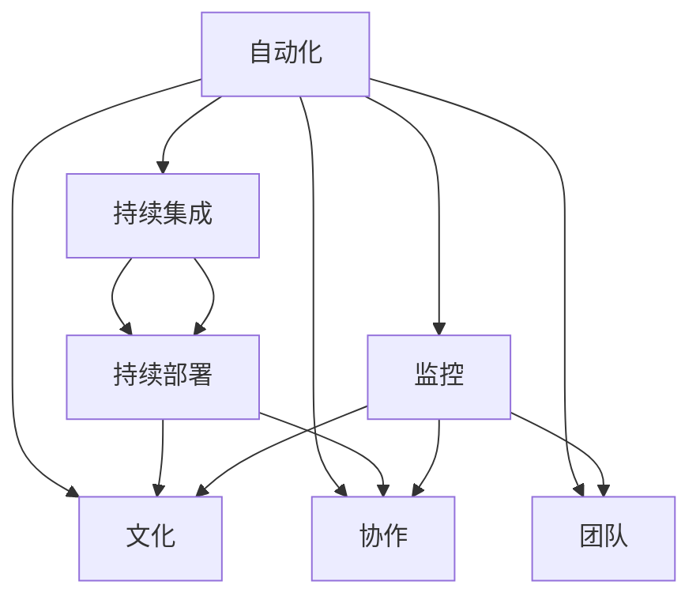

                 

# DevOps 文化：理解开发和运营的结合

> 关键词：DevOps, 自动化, 持续集成, 持续部署, 监控, 文化, 协作, 团队

## 1. 背景介绍

随着软件工业的快速发展，软件开发和运维（DevOps）成为了软件项目成功的重要保障。DevOps文化强调跨部门协作，通过持续集成（CI）和持续部署（CD）自动化流程，实现快速部署、可靠运维和高效反馈。本文将从背景、概念和实践三个方面，深入探讨DevOps文化的内涵及其对软件开发和运维的影响。

## 2. 核心概念与联系

### 2.1 核心概念概述

DevOps文化涉及到软件开发和运维的多个核心概念，包括自动化、持续集成、持续部署、监控、文化、协作和团队等。以下将逐一介绍这些概念及其相互联系。

- **自动化**：通过自动化工具和流程，减少手工操作，提升效率和质量。
- **持续集成**（Continuous Integration, CI）：开发团队定期将代码提交到共享仓库，并自动运行测试，以便及时发现和修复问题。
- **持续部署**（Continuous Deployment, CD）：在通过测试的代码被合并后，自动部署到生产环境。
- **监控**：实时跟踪系统运行状况，及时发现和解决问题。
- **文化**：构建共享价值观，促进团队协作和持续改进。
- **协作**：跨部门协作，包括开发、测试、运维等团队。
- **团队**：构建高效的跨职能团队，提高工作效率和质量。

### 2.2 核心概念原理和架构的 Mermaid 流程图



这个流程图展示了自动化、持续集成、持续部署、监控、文化、协作和团队之间的逻辑关系：

1. 自动化是基础，提供工具和流程支持。
2. 持续集成和持续部署建立在自动化的基础上，实现快速交付。
3. 监控贯穿整个流程，确保系统稳定。
4. 文化、协作和团队是文化氛围和社会结构的支持。

## 3. 核心算法原理 & 具体操作步骤

### 3.1 算法原理概述

DevOps的实践并非基于特定的算法，而是通过一系列的流程和工具实现。其核心思想是通过自动化和持续反馈，实现快速、可靠的软件交付。

### 3.2 算法步骤详解

1. **自动化部署**：
   - 配置自动化脚本，自动拉取代码、构建和部署应用。
   - 使用Jenkins、Travis CI等工具进行自动化部署。

2. **持续集成**：
   - 配置CI流水线，定期拉取代码，自动运行测试。
   - 使用Jenkins Pipeline、GitHub Actions等工具进行持续集成。

3. **持续部署**：
   - 配置CD流程，在测试通过后自动部署到生产环境。
   - 使用Ansible、Kubernetes等工具进行持续部署。

4. **监控和反馈**：
   - 使用Prometheus、Grafana等工具进行监控。
   - 通过监控结果，及时反馈问题并进行优化。

### 3.3 算法优缺点

**优点**：
- 提高开发效率和质量，缩短产品上市时间。
- 持续反馈机制，及时发现和解决问题。
- 提升团队协作和沟通效率。

**缺点**：
- 初始实施成本高，需要投入大量时间和资源。
- 需要持续维护和优化，避免流程中断。

### 3.4 算法应用领域

DevOps文化广泛应用于软件开发和运维的各个阶段，具体包括：

- 应用程序开发
- 服务器配置管理
- 数据库管理
- 云服务管理
- 安全管理
- 持续交付与部署

## 4. 数学模型和公式 & 详细讲解 & 举例说明

### 4.1 数学模型构建

DevOps文化中的许多步骤都是基于流程模型的，流程模型可以用有限状态机来描述。以下是一个简化版的DevOps流程模型：

$$
\begin{array}{c|c|c}
\text{状态} & \text{动作} & \text{下一个状态} \\
\hline
\text{待开发} & \text{编写代码} & \text{待测试} \\
\text{待测试} & \text{自动化测试} & \text{待部署} \\
\text{待部署} & \text{自动化部署} & \text{生产环境} \\
\text{生产环境} & \text{实时监控} & \text{持续优化} \\
\text{持续优化} & \text{持续改进} & \text{待开发} \\
\end{array}
$$

### 4.2 公式推导过程

由于DevOps涉及的流程和工具众多，这里以一个具体的CI/CD流程为例进行公式推导：

1. 代码推送（Push）
2. 自动化构建（Build）
3. 自动化测试（Test）
4. 自动化部署（Deploy）

对于每个步骤，可以设置触发条件和动作，例如：

$$
\begin{aligned}
&\text{代码推送} \rightarrow \text{自动化构建} \\
&\text{自动化构建} \rightarrow \text{自动化测试} \\
&\text{自动化测试} \rightarrow \text{自动化部署} \\
\end{aligned}
$$

使用工作流引擎（如Jenkins Pipeline），可以将这些步骤自动化，并根据条件进行分支和合并。

### 4.3 案例分析与讲解

以GitHub Actions为例，GitHub Actions是GitHub提供的一项持续集成服务，能够自动化执行工作流程，包括拉取代码、构建、测试和部署等。

**案例分析**：

- **触发条件**：
  - 代码推送到仓库。
  - 分支触发特定事件。

- **工作流程**：
  - 拉取最新代码。
  - 运行单元测试。
  - 运行集成测试。
  - 推送构建后的代码到部署环境。

- **监控**：
  - 实时监控CI/CD流程，确保各环节顺利进行。

## 5. 项目实践：代码实例和详细解释说明

### 5.1 开发环境搭建

在进行DevOps实践时，首先需要搭建开发环境。以下是一个简单的开发环境搭建流程：

1. 安装Docker：
   ```bash
   sudo apt-get update
   sudo apt-get install docker.io
   ```

2. 配置Docker：
   ```bash
   docker run hello-world
   ```

3. 安装Jenkins：
   ```bash
   sudo apt-get install openjdk-11-jdk-headless
   sudo apt-get install default-jdk
   ```

4. 安装GitHub Actions：
   ```bash
   sudo apt-get install git
   ```

5. 安装Prometheus和Grafana：
   ```bash
   sudo apt-get install prometheus prometheus-node-exporter
   sudo apt-get install grafana
   ```

### 5.2 源代码详细实现

以下是一个使用Jenkins实现持续集成的示例代码：

```python
from jenkins import Jenkins
from jenkinsapi import Jenkins

# 创建Jenkins对象
jenkins = Jenkins('http://jenkins.example.com/', username='your_username', password='your_password')

# 添加CI流水线
jenkins.build('job_name', parameters={'branch_name': 'master'}, extra_params={'force': 'true'})

# 触发CI流水线
jenkins.add_build('job_name', force=True)
```

**代码解读与分析**：
- 首先创建Jenkins对象，指定Jenkins服务器地址、用户名和密码。
- 通过Jenkins对象，添加CI流水线，指定分支名称。
- 触发CI流水线，确保自动化流程能够正常运行。

### 5.3 运行结果展示

运行以上代码，Jenkins将自动拉取代码，运行测试，并生成测试报告。

## 6. 实际应用场景

### 6.1 云服务管理

云服务提供商如AWS、Google Cloud、Microsoft Azure等，广泛应用DevOps实践，通过持续集成和持续部署，实现快速交付和管理云服务。

### 6.2 持续交付与部署

DevOps实践帮助企业实现快速交付和部署新功能，如SAP、IBM、Google等公司均采用DevOps方法，提升软件交付效率和质量。

### 6.3 监控和故障排查

DevOps文化中的持续监控和实时反馈，使得企业能够及时发现和解决问题，提高系统可靠性和稳定性。

## 7. 工具和资源推荐

### 7.1 学习资源推荐

- **《DevOps实战》**：O'Reilly出版社，详细介绍了DevOps的实施方法和最佳实践。
- **《持续交付：构建、测试和部署》**：Patrick Debois、Jez Humble等著，介绍了持续交付的原理和工具。
- **《自动化运维》**：Gary McLean等著，介绍了自动化运维的流程和技术。

### 7.2 开发工具推荐

- **Jenkins**：开源的持续集成和持续部署工具，支持插件和脚本化配置。
- **GitHub Actions**：GitHub提供的持续集成服务，支持多种编程语言和平台。
- **Docker**：容器化技术，实现跨平台应用部署和管理。

### 7.3 相关论文推荐

- **《DevOps 文化与实践》**：Kelly Johnson、Mark Tate、Mike McCulloh等著，探讨了DevOps文化的演变和应用。
- **《持续交付：构建、测试和部署》**：Jez Humble、David Farley著，介绍了持续交付的原理和实践。
- **《敏捷软件开发实践》**：Bob Larson著，介绍了敏捷开发的实践方法和工具。

## 8. 总结：未来发展趋势与挑战

### 8.1 研究成果总结

DevOps文化推动了软件开发和运维的自动化、协作和持续改进。其核心思想是实现快速、可靠的软件交付，提升团队协作效率和系统可靠性。

### 8.2 未来发展趋势

- 自动化程度进一步提升，减少人工操作。
- 持续集成和持续部署更加普及。
- 实时监控和反馈机制更加完善。
- DevOps与云计算、大数据等新兴技术深度融合。

### 8.3 面临的挑战

- 工具和流程的复杂性，需要持续优化和维护。
- 跨团队协作的困难，需要建立有效的沟通机制。
- 安全性和合规性问题，需要制定严格的规范和标准。

### 8.4 研究展望

未来DevOps文化将更加注重安全和合规性，以及与新兴技术的深度融合。同时，将进一步优化流程和工具，提升开发和运维的自动化水平。

## 9. 附录：常见问题与解答

**Q1: DevOps文化和传统开发模式有哪些区别？**

A: DevOps文化强调自动化、持续集成和持续部署，能够快速交付和响应变化。传统开发模式则依赖人工测试和部署，速度较慢，反馈不及时。

**Q2: 如何实现DevOps中的持续监控？**

A: 使用Prometheus和Grafana等监控工具，实时收集系统性能数据，生成可视化图表，便于分析和预警。

**Q3: DevOps文化对团队协作有哪些要求？**

A: 团队需要具备跨职能协作的能力，包括开发、测试、运维等角色的紧密合作。同时需要建立共享的价值观和规范，促进持续改进。

**Q4: DevOps工具和流程的复杂性如何应对？**

A: 通过持续优化和标准化流程，减少工具和配置的复杂性。同时建立自动化测试和部署流程，确保系统稳定可靠。

**Q5: 如何确保DevOps文化中的安全性和合规性？**

A: 制定严格的安全和合规性规范，使用安全工具进行自动化测试和审计。定期进行安全培训，提升团队的安全意识。

---

作者：禅与计算机程序设计艺术 / Zen and the Art of Computer Programming

