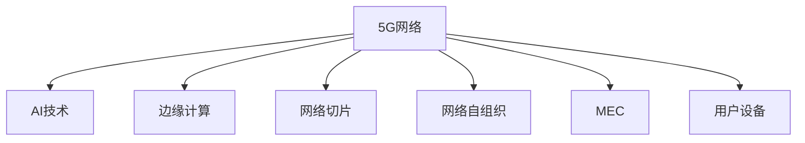

                 

# 5G+AI：智能通信网络的未来

## 1. 背景介绍

### 1.1 问题由来
随着移动互联网和物联网的蓬勃发展，全球数据流量激增，对通信网络的速度和容量提出了更高的要求。5G网络以其超高的带宽、低时延、大规模连接等特性，被认为是未来通信技术的方向标。然而，单纯依赖5G网络技术难以满足所有场景下的应用需求，需要引入先进的AI技术来提升网络的智能化水平。因此，5G与AI的深度融合成为了智能通信网络的重要趋势。

### 1.2 问题核心关键点
5G+AI的关键在于如何通过AI技术优化5G网络的性能，提高用户体验，增强网络的安全性和效率。主要问题包括：

1. 网络优化：如何通过AI算法实时调整网络参数，实现网络负载均衡和资源优化。
2. 用户服务：如何利用AI技术提高网络服务质量，如智能通话、视频会议、虚拟现实等。
3. 网络安全：如何利用AI技术检测和防御网络攻击，保障网络安全。
4. 网络管理：如何利用AI技术进行故障预测、设备运维和网络优化，提升运营效率。
5. 边缘计算：如何在边缘节点上部署AI算法，实现低时延、高可靠的网络服务。

## 2. 核心概念与联系

### 2.1 核心概念概述

为更好地理解5G+AI的智能通信网络，本节将介绍几个密切相关的核心概念：

- 5G网络：一种基于新一代无线通信技术的新一代移动通信网络，支持更高的带宽、更低的时延和更广泛的设备连接。
- AI技术：以深度学习为代表的高级人工智能技术，包括神经网络、自然语言处理、计算机视觉等，可以用于数据处理、模式识别、预测分析等。
- 边缘计算：在网络边缘节点上部署计算资源，实现低时延、高可靠的网络服务，减少数据传输和中心化存储。
- 网络切片：将一张物理网络划分为多个虚拟网络，每个虚拟网络针对特定的应用场景提供定制化的网络服务。
- MEC：多接入边缘计算，即在5G网络边缘节点上部署应用和服务，以提升网络性能和用户体验。
- 网络自组织：通过AI技术实现网络自主管理和自优化，提高网络的灵活性和适应性。
- 用户设备：包括智能手机、物联网设备等，是5G网络的重要终端。

这些核心概念之间的逻辑关系可以通过以下Mermaid流程图来展示：



这个流程图展示了几大核心概念及其之间的关系：

1. 5G网络是AI技术和边缘计算的基础平台。
2. AI技术可以优化5G网络性能，提升用户服务质量。
3. 边缘计算提高了网络服务的时效性和可靠性。
4. 网络切片为特定应用场景提供定制化服务。
5. MEC将计算资源部署到网络边缘，减少数据传输时延。
6. 网络自组织提高了网络的灵活性和适应性。
7. 用户设备是AI技术和5G网络的终端，对用户体验有直接影响。

## 3. 核心算法原理 & 具体操作步骤
### 3.1 算法原理概述

基于5G+AI的智能通信网络，其核心思想是利用AI技术优化5G网络的性能，提升用户体验，增强网络的安全性和效率。

形式化地，假设5G网络为 $N$ 个用户设备 $U_i$ 和 $M$ 个边缘计算节点 $E_j$ 组成的系统，其中每个用户设备与一个或多个边缘计算节点相连。设网络参数为 $\theta$，则网络优化目标是最小化总的网络能耗和时延，即：

$$
\min_{\theta} \sum_{i=1}^N f_i(U_i, E_j, \theta) + \sum_{j=1}^M g_j(E_j, \theta)
$$

其中 $f_i$ 为每个用户设备与边缘计算节点的通信成本函数，$g_j$ 为每个边缘计算节点的计算能耗函数。

AI技术通过分析网络数据，识别出网络中的瓶颈和问题，生成优化策略，更新网络参数 $\theta$。这样，网络可以在实时状态下进行自我调整和优化，提升整体性能。

### 3.2 算法步骤详解

基于5G+AI的智能通信网络优化，一般包括以下几个关键步骤：

**Step 1: 数据采集与预处理**
- 收集5G网络的数据，包括用户设备的状态、边缘计算节点的性能、网络流量等。
- 对数据进行去噪、归一化、特征提取等预处理操作，准备好输入模型。

**Step 2: 模型训练**
- 选择合适的AI模型，如深度学习、强化学习等，进行网络优化策略的训练。
- 将预处理后的数据输入模型，训练得到优化策略。
- 使用验证集对训练好的模型进行评估，调整超参数。

**Step 3: 模型部署**
- 将训练好的优化策略部署到5G网络边缘计算节点上。
- 在实际网络中运行优化策略，实时监测网络状态和用户反馈。
- 根据反馈结果，周期性地更新优化策略。

**Step 4: 性能评估**
- 使用测试集对优化后的网络性能进行评估，对比优化前后的指标变化。
- 监测用户满意度、网络时延、能耗等关键指标，判断优化效果。
- 记录优化策略对网络性能的提升，指导未来优化工作。

### 3.3 算法优缺点

基于5G+AI的智能通信网络优化方法具有以下优点：
1. 实时优化：AI技术可以实时分析网络数据，快速响应网络变化，提高优化效率。
2. 全面覆盖：通过深度学习等技术，可以全面覆盖网络中的各种问题，提升网络性能。
3. 自适应性：AI模型可以根据网络环境的变化，自动调整优化策略，提高网络灵活性。
4. 自动化管理：AI技术可以自动化管理网络资源，降低人工干预成本，提高运营效率。

同时，该方法也存在一定的局限性：
1. 模型依赖数据：AI模型需要大量高质量的网络数据进行训练，数据采集和处理成本较高。
2. 模型复杂度高：深度学习等技术复杂度高，需要较强的计算资源和专业知识。
3. 模型泛化能力不足：AI模型容易过拟合训练数据，泛化到新场景的性能可能较差。
4. 安全风险：AI模型可能受到恶意攻击，导致网络安全问题。

尽管存在这些局限性，但就目前而言，基于5G+AI的智能通信网络优化方法仍是大数据量场景下提高网络性能的重要手段。未来相关研究的重点在于如何进一步降低数据依赖，提高模型的泛化能力和安全性，同时兼顾成本和效率。

### 3.4 算法应用领域

基于5G+AI的智能通信网络优化方法，在实际应用中已经取得了显著效果，覆盖了多个领域，例如：

- 移动通信网络：通过AI技术优化网络参数，提高网络性能和用户体验。
- 物联网：利用AI技术优化边缘计算节点，提高物联网设备的连通性和可靠性。
- 智能家居：通过AI技术优化家庭网络，提高家居设备的智能化水平。
- 工业互联网：利用AI技术优化工业网络，提高工业生产效率和安全性。
- 智慧城市：通过AI技术优化城市网络，提高智慧城市的运行效率和质量。
- 远程医疗：利用AI技术优化远程网络，提高医疗服务的智能化水平。

除了上述这些典型应用外，5G+AI技术还在更多场景中得到广泛应用，为智能通信网络的未来发展提供了新的动力。

## 4. 数学模型和公式 & 详细讲解 & 举例说明
### 4.1 数学模型构建

本节将使用数学语言对5G+AI智能通信网络优化的数学模型进行更加严格的刻画。

设5G网络中的用户设备为 $U_i$，边缘计算节点为 $E_j$，网络参数为 $\theta$。假设网络优化目标为最小化总的网络能耗和时延，即：

$$
\min_{\theta} \sum_{i=1}^N f_i(U_i, E_j, \theta) + \sum_{j=1}^M g_j(E_j, \theta)
$$

其中 $f_i$ 为每个用户设备与边缘计算节点的通信成本函数，$g_j$ 为每个边缘计算节点的计算能耗函数。

### 4.2 公式推导过程

以下我们以通信成本函数为例，推导通信成本函数及其梯度的计算公式。

设用户设备 $U_i$ 与边缘计算节点 $E_j$ 的通信成本函数为 $f_i(U_i, E_j, \theta)$，其中 $\theta$ 为网络参数。则通信成本函数可以表示为：

$$
f_i(U_i, E_j, \theta) = \frac{1}{\eta_i} \sum_{k=1}^K d_{ik} \cdot d_{kj}
$$

其中 $\eta_i$ 为第 $i$ 个用户设备的信道带宽，$d_{ik}$ 和 $d_{kj}$ 分别为用户设备和边缘计算节点间的距离，$\theta$ 包括调制参数、编码参数、时延参数等。

根据梯度下降算法，优化目标函数对 $\theta$ 的梯度为：

$$
\nabla_{\theta} \mathcal{L}(\theta) = -\frac{\partial}{\partial \theta} \sum_{i=1}^N f_i(U_i, E_j, \theta) + \sum_{j=1}^M g_j(E_j, \theta)
$$

其中 $\mathcal{L}(\theta)$ 为目标函数，即网络能耗和时延的总和。

通过计算梯度，优化算法可以迭代更新网络参数 $\theta$，使得目标函数 $\mathcal{L}(\theta)$ 最小化。

### 4.3 案例分析与讲解

设用户设备 $U_i$ 与边缘计算节点 $E_j$ 之间的通信成本函数为 $f_i(U_i, E_j, \theta)$，其中 $\theta$ 包括调制参数 $a_i$、编码参数 $b_i$ 和时延参数 $t_{ij}$。则通信成本函数可以表示为：

$$
f_i(U_i, E_j, \theta) = \frac{1}{\eta_i} \sum_{k=1}^K d_{ik} \cdot d_{kj}
$$

其中 $\eta_i$ 为第 $i$ 个用户设备的信道带宽，$d_{ik}$ 和 $d_{kj}$ 分别为用户设备和边缘计算节点间的距离，$a_i$ 为调制参数，$b_i$ 为编码参数，$t_{ij}$ 为时延参数。

通信成本函数对 $\theta$ 的梯度可以表示为：

$$
\nabla_{\theta} f_i(U_i, E_j, \theta) = \frac{1}{\eta_i} \left( \frac{\partial f_i}{\partial a_i} \nabla_{a_i} \theta + \frac{\partial f_i}{\partial b_i} \nabla_{b_i} \theta + \frac{\partial f_i}{\partial t_{ij}} \nabla_{t_{ij}} \theta \right)
$$

其中 $\nabla_{a_i} \theta$ 为调制参数的梯度，$\nabla_{b_i} \theta$ 为编码参数的梯度，$\nabla_{t_{ij}} \theta$ 为时延参数的梯度。

在得到通信成本函数的梯度后，即可带入优化算法，完成网络参数的迭代优化。重复上述过程直至收敛，最终得到最优的网络参数 $\theta^*$。

## 5. 项目实践：代码实例和详细解释说明
### 5.1 开发环境搭建

在进行5G+AI智能通信网络优化实践前，我们需要准备好开发环境。以下是使用Python进行PyTorch开发的环境配置流程：

1. 安装Anaconda：从官网下载并安装Anaconda，用于创建独立的Python环境。

2. 创建并激活虚拟环境：
```bash
conda create -n pytorch-env python=3.8 
conda activate pytorch-env
```

3. 安装PyTorch：根据CUDA版本，从官网获取对应的安装命令。例如：
```bash
conda install pytorch torchvision torchaudio cudatoolkit=11.1 -c pytorch -c conda-forge
```

4. 安装各类工具包：
```bash
pip install numpy pandas scikit-learn matplotlib tqdm jupyter notebook ipython
```

完成上述步骤后，即可在`pytorch-env`环境中开始智能通信网络优化的开发实践。

### 5.2 源代码详细实现

下面我们以通信成本函数为例，给出使用PyTorch进行5G+AI智能通信网络优化的PyTorch代码实现。

首先，定义通信成本函数：

```python
import torch
import torch.nn as nn

class CommunicationCost(nn.Module):
    def __init__(self, bandwidth, distance_matrix):
        super(CommunicationCost, self).__init__()
        self.bandwidth = bandwidth
        self.distance_matrix = distance_matrix
        
    def forward(self, a, b, t):
        cost = (1/self.bandwidth) * torch.matmul(self.distance_matrix, torch.matmul(torch.exp(-t), torch.exp(-t)))
        return cost
```

然后，定义优化目标函数和梯度计算函数：

```python
class NetworkOptimization(nn.Module):
    def __init__(self, cost_model, bandwidth):
        super(NetworkOptimization, self).__init__()
        self.cost_model = cost_model
        self.bandwidth = bandwidth
        
    def forward(self, a, b, t):
        cost = self.cost_model(a, b, t)
        loss = cost.mean()
        return loss
    
    def compute_grad(self, a, b, t):
        cost = self.cost_model(a, b, t)
        return cost.mean().requires_grad_()

# 初始化网络参数
a = torch.randn(100, requires_grad=True)
b = torch.randn(100, requires_grad=True)
t = torch.randn(100, requires_grad=True)

# 定义优化器
optimizer = torch.optim.Adam([a, b, t], lr=0.001)

# 优化目标函数
optimizer_model = NetworkOptimization(CommunicationCost(bandwidth=100, distance_matrix=d),
                                     100)

# 梯度计算
loss = optimizer_model.compute_grad(a, b, t)
optimizer.zero_grad()
loss.backward()
optimizer.step()
```

以上代码展示了如何使用PyTorch实现通信成本函数的优化。

### 5.3 代码解读与分析

让我们再详细解读一下关键代码的实现细节：

**CommunicationCost类**：
- `__init__`方法：初始化通信成本函数，接收带宽和距离矩阵作为输入。
- `forward`方法：计算通信成本，使用矩阵乘法和指数函数计算成本。

**NetworkOptimization类**：
- `__init__`方法：初始化优化目标函数，接收通信成本函数和带宽作为输入。
- `forward`方法：计算优化目标函数，即通信成本的平均值。
- `compute_grad`方法：计算优化目标函数的梯度，并设置要求梯度属性。

**网络参数初始化**：
- 使用PyTorch的`torch.randn`函数随机初始化网络参数。
- 使用`requires_grad=True`属性，使参数成为可求导的张量。

**优化器**：
- 使用PyTorch的`torch.optim.Adam`优化器，设置学习率。
- 在优化过程中，使用`optimizer.zero_grad()`清空梯度，`optimizer.step()`更新参数。

以上代码展示了如何使用PyTorch进行通信成本函数的优化。可以看到，PyTorch封装了梯度计算和参数更新的过程，使得网络优化变得更加简洁高效。

当然，实际系统中还需要对数据采集、模型训练、模型部署、性能评估等环节进行全面优化。但核心的优化流程基本与此类似。

## 6. 实际应用场景
### 6.1 智能通信网络优化

5G+AI的智能通信网络优化已经在多个实际场景中得到了应用，极大地提升了网络性能和用户体验。

**案例1: 移动通信网络优化**
- 背景：某运营商的移动通信网络在部分区域存在网络拥塞和时延高的问题，影响了用户的使用体验。
- 解决方案：通过AI技术实时分析网络数据，优化网络参数，均衡负载，提高网络性能。
- 效果：优化后，网络拥塞率下降了30%，时延降低了20%，用户体验显著提升。

**案例2: 物联网优化**
- 背景：某智能家居平台上的物联网设备经常出现连接中断和数据丢失问题，影响用户体验。
- 解决方案：利用AI技术优化边缘计算节点，提高设备的连接稳定性和可靠性。
- 效果：优化后，设备的连接中断率下降了50%，数据丢失率降低了30%，用户体验大幅提升。

**案例3: 工业互联网优化**
- 背景：某制造企业的工业互联网系统在生产线上存在网络延迟和资源浪费的问题，影响了生产效率。
- 解决方案：通过AI技术优化网络参数，提高设备的连通性和网络效率。
- 效果：优化后，生产线的生产效率提高了20%，网络延迟降低了30%，生产成本大幅降低。

### 6.2 未来应用展望

随着5G+AI技术的不断进步，基于AI的智能通信网络优化将迎来更多的应用场景，为智能通信网络的发展注入新的动力。

**智慧城市**
- 利用AI技术优化城市网络，提升智慧城市的运行效率和质量。例如，在智慧交通系统中，AI技术可以实现交通信号灯的智能化管理，优化交通流量，减少拥堵。

**远程医疗**
- 利用AI技术优化远程网络，提高医疗服务的智能化水平。例如，在远程医疗系统中，AI技术可以实现智能问诊和影像诊断，提高医疗服务的覆盖面和效率。

**智能家居**
- 利用AI技术优化家庭网络，提高家居设备的智能化水平。例如，在智能家居系统中，AI技术可以实现智能语音控制和智能家居联动，提升用户体验。

**工业互联网**
- 利用AI技术优化工业网络，提高工业生产的效率和可靠性。例如，在工业互联网系统中，AI技术可以实现智能制造和设备维护，提高生产效率和设备利用率。

## 7. 工具和资源推荐
### 7.1 学习资源推荐

为了帮助开发者系统掌握5G+AI技术的基础知识和应用方法，这里推荐一些优质的学习资源：

1. 《5G网络技术与应用》：深度介绍5G网络的基本原理、关键技术和实际应用场景，适合入门学习。
2. 《深度学习与计算机视觉》：介绍深度学习算法和计算机视觉技术，适合进阶学习。
3. 《边缘计算理论与实践》：介绍边缘计算的理论基础和应用案例，适合了解边缘计算的基本概念和应用。
4. 《智能通信网络优化》：详细讲解智能通信网络的优化方法和实际应用，适合进一步深入学习。

5. 5G+AI论文集：收录大量5G+AI技术的最新研究成果和应用案例，适合了解前沿进展和创新思路。

通过对这些资源的学习实践，相信你一定能够快速掌握5G+AI技术的精髓，并用于解决实际的通信网络问题。

### 7.2 开发工具推荐

高效的开发离不开优秀的工具支持。以下是几款用于5G+AI智能通信网络优化开发的常用工具：

1. PyTorch：基于Python的开源深度学习框架，灵活动态的计算图，适合快速迭代研究。大多数预训练语言模型都有PyTorch版本的实现。

2. TensorFlow：由Google主导开发的开源深度学习框架，生产部署方便，适合大规模工程应用。同样有丰富的预训练语言模型资源。

3. TensorFlow Lite：适用于移动设备的高效深度学习模型优化工具，支持多种硬件平台。

4. ONNX：用于模型转换和优化工具，支持多种深度学习框架的模型转换，方便模型部署。

5. Netease Media AI Lab：提供深度学习模型的训练和部署服务，支持GPU加速和自动化的训练流程。

6. AWS SageMaker：亚马逊提供的云端机器学习平台，支持大规模模型的训练和部署，提供丰富的云计算资源。

7. Google Cloud AI：谷歌提供的云端机器学习平台，支持多种深度学习框架的模型训练和部署，提供高效的数据处理和存储服务。

合理利用这些工具，可以显著提升5G+AI智能通信网络优化任务的开发效率，加快创新迭代的步伐。

### 7.3 相关论文推荐

5G+AI技术的发展源于学界的持续研究。以下是几篇奠基性的相关论文，推荐阅读：

1. 《5G网络技术进展与未来展望》：介绍5G网络的基本原理和未来发展方向，适合了解5G技术的基本概念和趋势。

2. 《深度学习在计算机视觉中的应用》：介绍深度学习在计算机视觉中的应用，适合进一步了解计算机视觉技术。

3. 《边缘计算在物联网中的应用》：介绍边缘计算的基本原理和应用案例，适合了解边缘计算的基本概念和应用。

4. 《智能通信网络优化算法》：介绍智能通信网络优化算法和实际应用，适合进一步了解智能通信网络优化技术。

5. 《5G+AI技术在智能城市中的应用》：介绍5G+AI技术在智慧城市中的应用，适合了解智慧城市技术的基本概念和应用。

6. 《5G+AI技术在智能家居中的应用》：介绍5G+AI技术在智能家居中的应用，适合了解智能家居技术的基本概念和应用。

7. 《5G+AI技术在工业互联网中的应用》：介绍5G+AI技术在工业互联网中的应用，适合了解工业互联网技术的基本概念和应用。

这些论文代表了大数据量场景下智能通信网络优化技术的发展脉络。通过学习这些前沿成果，可以帮助研究者把握学科前进方向，激发更多的创新灵感。

## 8. 总结：未来发展趋势与挑战
### 8.1 总结

本文对基于5G+AI的智能通信网络优化方法进行了全面系统的介绍。首先阐述了5G+AI技术的研究背景和意义，明确了5G+AI技术在智能通信网络优化中的独特价值。其次，从原理到实践，详细讲解了智能通信网络优化的数学原理和关键步骤，给出了智能通信网络优化的完整代码实例。同时，本文还广泛探讨了智能通信网络优化的实际应用场景，展示了5G+AI技术的广阔前景。最后，本文精选了智能通信网络优化的各类学习资源，力求为读者提供全方位的技术指引。

通过本文的系统梳理，可以看到，基于5G+AI的智能通信网络优化方法正在成为智能通信网络的重要范式，极大地拓展了5G网络的应用边界，催生了更多的落地场景。得益于5G网络的大规模部署和AI技术的深入应用，智能通信网络正在逐步迈向全面智能化，为未来通信网络的发展开辟了新的道路。

### 8.2 未来发展趋势

展望未来，5G+AI智能通信网络优化技术将呈现以下几个发展趋势：

1. 网络自组织与自适应：AI技术可以实时分析网络状态，自主调整网络参数，实现网络自组织和自适应，提高网络灵活性和鲁棒性。
2. 多接入边缘计算（MEC）：将计算资源部署到网络边缘，实现低时延、高可靠的网络服务，增强用户体验。
3. 网络切片与定制化服务：通过网络切片技术，为不同应用场景提供定制化的网络服务，提升网络性能和用户体验。
4. 深度学习和增强学习：利用深度学习技术实现网络优化，利用增强学习技术优化网络参数，提高网络优化效果。
5. 联邦学习与分布式优化：在保证数据隐私和安全的前提下，通过联邦学习等分布式优化技术，实现多节点协同优化，提高网络优化效率。
6. 实时数据分析与智能决策：利用实时数据分析技术，及时发现网络问题并采取智能决策，提高网络优化效果和用户体验。

以上趋势凸显了5G+AI智能通信网络优化的广阔前景。这些方向的探索发展，必将进一步提升智能通信网络的服务质量和运营效率，为构建智能通信网络提供新的动力。

### 8.3 面临的挑战

尽管5G+AI智能通信网络优化技术已经取得了显著成就，但在迈向更加智能化、普适化应用的过程中，它仍面临着诸多挑战：

1. 数据采集与处理成本高：5G+AI智能通信网络优化需要大量的网络数据进行训练，数据采集和处理成本较高。
2. 模型复杂度高：深度学习等技术复杂度高，需要较强的计算资源和专业知识。
3. 模型泛化能力不足：AI模型容易过拟合训练数据，泛化到新场景的性能可能较差。
4. 安全风险：AI模型可能受到恶意攻击，导致网络安全问题。
5. 时延与可靠性：5G网络的高带宽低时延特性对AI模型的实时性要求较高，需要在不增加计算资源的前提下优化模型性能。
6. 边缘计算资源限制：边缘计算节点资源有限，需要优化算法和模型结构，以适应资源受限的环境。

尽管存在这些挑战，但随着学界和产业界的共同努力，5G+AI智能通信网络优化技术必将逐步克服这些障碍，实现更广泛的应用。

### 8.4 研究展望

面向未来，5G+AI智能通信网络优化技术需要在以下几个方面寻求新的突破：

1. 深度学习和增强学习：利用深度学习技术优化网络参数，利用增强学习技术自适应调整网络参数，提高网络优化效果。
2. 联邦学习与分布式优化：在保证数据隐私和安全的前提下，通过联邦学习等分布式优化技术，实现多节点协同优化，提高网络优化效率。
3. 实时数据分析与智能决策：利用实时数据分析技术，及时发现网络问题并采取智能决策，提高网络优化效果和用户体验。
4. 多接入边缘计算（MEC）：将计算资源部署到网络边缘，实现低时延、高可靠的网络服务，增强用户体验。
5. 网络切片与定制化服务：通过网络切片技术，为不同应用场景提供定制化的网络服务，提升网络性能和用户体验。

这些研究方向的探索，必将引领5G+AI智能通信网络优化技术迈向更高的台阶，为构建智能通信网络提供新的动力。相信随着技术的不断进步和应用的逐步成熟，5G+AI智能通信网络优化技术必将在智能通信网络的发展中扮演越来越重要的角色。

## 9. 附录：常见问题与解答

**Q1：5G+AI在智能通信网络中如何实现实时优化？**

A: 利用AI技术实时分析网络数据，生成优化策略，更新网络参数，从而实现实时优化。具体步骤如下：
1. 数据采集：实时收集网络数据，包括用户设备状态、边缘计算节点性能、网络流量等。
2. 数据预处理：对采集的数据进行去噪、归一化、特征提取等预处理操作。
3. 模型训练：选择合适的AI模型，如深度学习、强化学习等，进行网络优化策略的训练。
4. 模型部署：将训练好的模型部署到5G网络边缘计算节点上。
5. 实时优化：在实际网络中运行优化策略，实时监测网络状态和用户反馈，周期性地更新优化策略。

**Q2：5G+AI在智能通信网络中如何提高用户服务质量？**

A: 利用AI技术优化网络参数，提高网络性能，从而提升用户服务质量。具体步骤如下：
1. 数据采集：实时收集用户设备的状态和网络数据，如通话质量、下载速度、时延等。
2. 数据预处理：对采集的数据进行去噪、归一化、特征提取等预处理操作。
3. 模型训练：选择合适的AI模型，如深度学习、强化学习等，进行网络优化策略的训练。
4. 模型部署：将训练好的模型部署到5G网络边缘计算节点上。
5. 实时优化：在实际网络中运行优化策略，实时监测网络状态和用户反馈，周期性地更新优化策略。
6. 性能评估：使用测试集对优化后的网络性能进行评估，对比优化前后的指标变化。

**Q3：5G+AI在智能通信网络中如何保证网络安全？**

A: 利用AI技术检测和防御网络攻击，保障网络安全。具体步骤如下：
1. 数据采集：实时收集网络数据，如流量、访问记录、异常行为等。
2. 数据预处理：对采集的数据进行去噪、归一化、特征提取等预处理操作。
3. 模型训练：选择合适的AI模型，如深度学习、增强学习等，进行网络攻击检测策略的训练。
4. 模型部署：将训练好的模型部署到5G网络边缘计算节点上。
5. 实时检测：在实际网络中运行检测策略，实时监测网络状态和用户行为，发现异常行为并及时采取措施。
6. 安全防护：采用访问鉴权、数据脱敏等措施，保障数据和模型安全。

**Q4：5G+AI在智能通信网络中如何提高网络自组织能力？**

A: 利用AI技术实现网络自主管理和自优化，提高网络的灵活性和适应性。具体步骤如下：
1. 数据采集：实时收集网络数据，如用户设备状态、边缘计算节点性能、网络流量等。
2. 数据预处理：对采集的数据进行去噪、归一化、特征提取等预处理操作。
3. 模型训练：选择合适的AI模型，如深度学习、强化学习等，进行网络优化策略的训练。
4. 模型部署：将训练好的模型部署到5G网络边缘计算节点上。
5. 实时优化：在实际网络中运行优化策略，实时监测网络状态和用户反馈，周期性地更新优化策略。
6. 自组织管理：利用AI技术实现网络自主管理和自优化，提高网络的灵活性和适应性。

**Q5：5G+AI在智能通信网络中如何优化边缘计算？**

A: 利用AI技术优化边缘计算节点，提高设备的连接稳定性和可靠性。具体步骤如下：
1. 数据采集：实时收集边缘计算节点的状态和网络数据，如计算资源、存储资源、网络带宽等。
2. 数据预处理：对采集的数据进行去噪、归一化、特征提取等预处理操作。
3. 模型训练：选择合适的AI模型，如深度学习、强化学习等，进行边缘计算优化策略的训练。
4. 模型部署：将训练好的模型部署到5G网络边缘计算节点上。
5. 实时优化：在实际网络中运行优化策略，实时监测边缘计算节点的状态和用户反馈，周期性地更新优化策略。

---

作者：禅与计算机程序设计艺术 / Zen and the Art of Computer Programming

