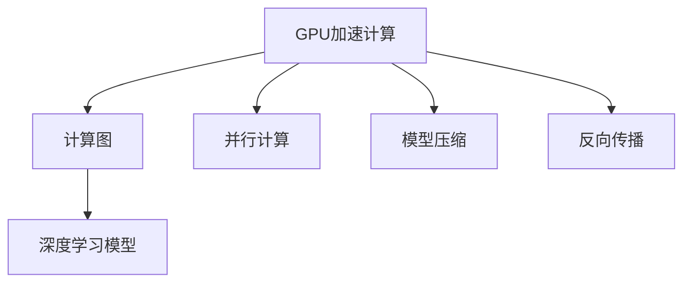

                 

# GPU 加速计算：加速深度学习

> 关键词：GPU加速,深度学习,计算图,并行计算,模型优化,机器学习,神经网络,计算性能

## 1. 背景介绍

### 1.1 问题由来
随着深度学习技术在各领域的广泛应用，模型的复杂度和数据量迅速增长，传统的单核CPU已经难以满足深度学习模型的计算需求。为了提升计算效率，GPU加速计算应运而生。GPU以其强大的并行计算能力和丰富的计算指令集，成为现代深度学习计算的核心硬件。

### 1.2 问题核心关键点
GPU加速计算通过并行计算、计算图优化和模型压缩等技术，显著提升了深度学习模型的训练和推理速度，大幅降低了计算成本，为大规模深度学习模型的应用提供了强有力的支持。GPU加速计算的核心在于其特殊的硬件架构和高度优化的计算指令集。

## 2. 核心概念与联系

### 2.1 核心概念概述

为更好地理解GPU加速计算，本节将介绍几个密切相关的核心概念：

- **GPU加速计算**：利用GPU的并行计算能力，加速深度学习模型的训练和推理过程。GPU加速计算的核心在于其强大的并行处理能力和高效的计算指令集。

- **计算图**：深度学习模型通过计算图描述其计算流程。计算图是一种有向无环图，用于表示输入、中间计算结果和输出之间的依赖关系。

- **并行计算**：将大任务分解为多个小任务并行执行，以提高计算效率。并行计算是GPU加速计算的核心技术之一。

- **模型压缩**：通过剪枝、量化、蒸馏等方法，减少模型参数量和计算复杂度，以提升GPU加速计算的效率。

- **反向传播**：深度学习模型利用反向传播算法更新模型参数，以最小化损失函数。GPU加速反向传播可以大幅提高训练速度。

这些核心概念之间的逻辑关系可以通过以下Mermaid流程图来展示：



这个流程图展示了大规模深度学习模型的GPU加速计算过程及其核心技术。

## 3. 核心算法原理 & 具体操作步骤
### 3.1 算法原理概述

GPU加速计算的本质是通过GPU的并行计算能力，高效地执行深度学习模型的计算图。GPU加速计算的算法原理包括以下几个关键步骤：

1. **计算图划分**：将深度学习模型的计算图划分为多个并行子图，以便在GPU上进行并行计算。
2. **并行计算执行**：利用GPU的多个计算单元，并行执行各子图的计算任务。
3. **计算图优化**：通过计算图优化技术，减少重复计算和数据传输，提高计算效率。
4. **模型压缩**：采用模型压缩技术，减少模型参数量和计算复杂度，以适应GPU硬件的限制。
5. **反向传播加速**：利用GPU的强大计算能力，加速反向传播算法的计算过程，以提升模型训练速度。

### 3.2 算法步骤详解

**Step 1: 模型选择与计算图构建**
- 选择适合的深度学习框架（如TensorFlow、PyTorch等），并构建计算图。
- 根据GPU硬件的并行计算能力，合理划分计算图。

**Step 2: 计算图优化**
- 应用计算图优化技术，如图剪枝、图融合、循环展开等，减少计算图中的冗余操作。
- 使用混合精度训练（如FP16、FP32），减少计算精度要求，提高计算效率。

**Step 3: 模型压缩**
- 使用模型压缩技术，如剪枝、量化、蒸馏等，减少模型参数量，降低计算复杂度。
- 采用参数共享和分块技术，提高模型并行计算的效率。

**Step 4: 数据准备与输入优化**
- 将数据集分批次加载，并进行预处理（如归一化、数据增强等），以便GPU高效处理。
- 使用GPU内存优化技术，减少数据传输和存储的开销。

**Step 5: 模型训练与推理**
- 将计算图和数据加载到GPU上，进行并行计算。
- 应用反向传播算法，更新模型参数。
- 在测试集上对模型进行推理测试，评估计算性能。

**Step 6: 性能调优与优化**
- 根据计算性能的测试结果，进行性能调优。
- 优化计算图、模型参数、数据输入等，以进一步提升计算效率。

### 3.3 算法优缺点

GPU加速计算具有以下优点：
1. 大幅提升计算效率：GPU并行计算和高效的计算图优化技术可以显著提升深度学习模型的计算速度。
2. 降低计算成本：GPU硬件的计算能力使得深度学习模型的训练和推理成本大幅降低。
3. 提升模型精度：GPU加速计算提高了反向传播的计算精度，提升了深度学习模型的训练效果。

同时，该方法也存在一些局限性：
1. 对硬件要求高：GPU加速计算依赖于GPU硬件的计算能力和存储性能。
2. 编程复杂度增加：GPU编程需要熟悉并行计算和优化技术，编程难度较大。
3. 开发成本高：GPU硬件和优化技术需要额外的开发和调试成本。
4. 模型兼容性问题：并非所有深度学习模型都适合GPU加速计算，需要进行相应的模型优化。

尽管存在这些局限性，但GPU加速计算已经成为现代深度学习计算的重要方式，广泛应用于各种复杂模型的训练和推理过程中。

### 3.4 算法应用领域

GPU加速计算在深度学习领域有广泛的应用，主要包括以下几个方面：

- **计算机视觉**：GPU加速图像分类、目标检测、图像生成等计算机视觉任务的计算。
- **自然语言处理**：GPU加速文本分类、语言建模、机器翻译等自然语言处理任务的计算。
- **语音识别**：GPU加速语音识别、语音合成等语音处理任务的计算。
- **推荐系统**：GPU加速推荐系统的计算，提升推荐效果和响应速度。
- **自动驾驶**：GPU加速自动驾驶系统中的深度学习模型计算，提升驾驶安全性。
- **科学计算**：GPU加速复杂科学计算任务，提升计算速度和效率。

此外，GPU加速计算还在生物信息学、金融分析、工业控制等多个领域得到广泛应用，极大地提升了相关领域的计算能力和数据处理速度。

## 4. 数学模型和公式 & 详细讲解 & 举例说明
### 4.1 数学模型构建

本节将使用数学语言对GPU加速计算的过程进行更加严格的刻画。

假设深度学习模型的计算图为 $G=(V,E)$，其中 $V$ 为节点集，$E$ 为边集。每个节点 $v_i$ 表示一个计算操作，如加、乘、卷积等。每个边 $e_{ij}$ 表示节点 $v_i$ 和 $v_j$ 之间的数据依赖关系。

### 4.2 公式推导过程

深度学习模型的反向传播算法可以表示为：

$$
\frac{\partial L}{\partial w} = \frac{\partial L}{\partial z^{[L]}} \cdot \frac{\partial z^{[L]}}{\partial w^{[L]}} \cdot \frac{\partial z^{[L-1]}}{\partial z^{[L]}} \cdot \frac{\partial z^{[L-1]}}{\partial w^{[L-1]}} \cdot \ldots \cdot \frac{\partial z^{[1]}}{\partial z^{[2]}} \cdot \frac{\partial z^{[1]}}{\partial w^{[1]}}
$$

其中 $L$ 表示模型深度，$w$ 表示模型参数，$z$ 表示计算图中的中间结果。

在GPU加速计算中，反向传播算法的计算可以通过并行计算和计算图优化技术实现。具体而言，可以将反向传播过程拆分为多个并行子图，每个子图计算一层的梯度，然后并行执行各层计算，最后合并结果。

### 4.3 案例分析与讲解

以下是一个简单的卷积神经网络（CNN）的反向传播过程的案例分析：


在这个计算图中，共有5层卷积层和2层全连接层。反向传播过程需要从输出层开始，依次计算每一层的梯度，并更新模型参数。

假设使用2个GPU进行并行计算，则反向传播过程可以并行执行如下：


在实际计算中，可以将输入数据分成多个块，并行加载到各个GPU上进行计算。同时，可以利用计算图优化技术，减少重复计算和数据传输，提高计算效率。

## 5. 项目实践：代码实例和详细解释说明
### 5.1 开发环境搭建

在进行GPU加速计算的实践前，我们需要准备好开发环境。以下是使用Python进行PyTorch开发的环境配置流程：

1. 安装Anaconda：从官网下载并安装Anaconda，用于创建独立的Python环境。

2. 创建并激活虚拟环境：
```bash
conda create -n pytorch-env python=3.8 
conda activate pytorch-env
```

3. 安装PyTorch：根据CUDA版本，从官网获取对应的安装命令。例如：
```bash
conda install pytorch torchvision torchaudio cudatoolkit=11.1 -c pytorch -c conda-forge
```

4. 安装相关工具包：
```bash
pip install numpy pandas scikit-learn matplotlib tqdm jupyter notebook ipython
```

完成上述步骤后，即可在`pytorch-env`环境中开始GPU加速计算的实践。

### 5.2 源代码详细实现

下面我们以卷积神经网络（CNN）为例，给出使用PyTorch和CUDA进行GPU加速计算的代码实现。

首先，定义卷积神经网络的模型结构：

```python
import torch
import torch.nn as nn
import torch.optim as optim
import torch.nn.functional as F

class CNN(nn.Module):
    def __init__(self):
        super(CNN, self).__init__()
        self.conv1 = nn.Conv2d(3, 32, 3, padding=1)
        self.conv2 = nn.Conv2d(32, 64, 3, padding=1)
        self.pool = nn.MaxPool2d(2, 2)
        self.fc1 = nn.Linear(64 * 8 * 8, 128)
        self.fc2 = nn.Linear(128, 10)

    def forward(self, x):
        x = F.relu(self.conv1(x))
        x = F.max_pool2d(x, 2)
        x = F.relu(self.conv2(x))
        x = F.max_pool2d(x, 2)
        x = x.view(-1, 64 * 8 * 8)
        x = F.relu(self.fc1(x))
        x = self.fc2(x)
        return F.log_softmax(x, dim=1)
```

然后，定义GPU环境：

```python
import torch.cuda

if torch.cuda.is_available():
    torch.cuda.set_device(0)
    print('Using GPU:', torch.cuda.get_device_name())
```

接着，定义模型、损失函数和优化器：

```python
device = torch.device("cuda:0" if torch.cuda.is_available() else "cpu")

model = CNN().to(device)
criterion = nn.CrossEntropyLoss()
optimizer = optim.SGD(model.parameters(), lr=0.01)
```

最后，启动训练流程并在测试集上评估：

```python
epochs = 10
batch_size = 64

for epoch in range(epochs):
    for i, (inputs, labels) in enumerate(train_loader):
        inputs = inputs.to(device)
        labels = labels.to(device)
        
        optimizer.zero_grad()
        outputs = model(inputs)
        loss = criterion(outputs, labels)
        loss.backward()
        optimizer.step()
        
        if (i+1) % 100 == 0:
            print('Epoch [{}/{}], Step [{}/{}], Loss: {:.4f}'.format(
                epoch+1, epochs, i+1, len(train_loader), loss.item()))
            
    print('Epoch [{}/{}], Loss: {:.4f}'.format(epoch+1, epochs, loss.item()))

print('Training finished.')
```

以上就是在PyTorch和CUDA上进行GPU加速计算的完整代码实现。可以看到，通过简单地将模型移动到GPU，就可以利用GPU的强大计算能力进行模型训练。

### 5.3 代码解读与分析

让我们再详细解读一下关键代码的实现细节：

**CNN定义**：
- `__init__`方法：定义卷积层、池化层、全连接层等组件。
- `forward`方法：定义计算图的正向传播过程。

**GPU环境定义**：
- `torch.cuda.is_available()`：判断是否可用GPU。
- `torch.cuda.set_device(0)`：设置当前使用的GPU设备。
- `torch.cuda.get_device_name()`：获取当前使用的GPU设备名称。

**模型、损失函数和优化器定义**：
- `device = torch.device("cuda:0" if torch.cuda.is_available() else "cpu")`：定义模型使用的设备（GPU或CPU）。
- `model.to(device)`：将模型迁移到指定的设备上。
- `criterion = nn.CrossEntropyLoss()`：定义交叉熵损失函数。
- `optimizer = optim.SGD(model.parameters(), lr=0.01)`：定义随机梯度下降优化器。

**训练流程**：
- `train_loader`：定义训练数据的批次加载器。
- `inputs = inputs.to(device)` 和 `labels = labels.to(device)`：将输入和标签迁移到指定的设备上。
- `optimizer.zero_grad()`：清除所有优化器的梯度。
- `outputs = model(inputs)`：计算模型的前向传播。
- `loss = criterion(outputs, labels)`：计算损失函数。
- `loss.backward()`：反向传播计算梯度。
- `optimizer.step()`：更新模型参数。
- 打印训练过程中的损失值。

可以看到，PyTorch和CUDA的结合使得GPU加速计算的实现变得简洁高效。开发者可以将更多精力放在模型改进和训练策略上，而不必过多关注底层的实现细节。

当然，工业级的系统实现还需考虑更多因素，如模型保存和部署、超参数调优、更灵活的计算图优化等。但核心的GPU加速计算流程基本与此类似。

## 6. 实际应用场景
### 6.1 实际应用场景

GPU加速计算已经在深度学习领域得到了广泛应用，覆盖了几乎所有常见任务，例如：

- **计算机视觉**：GPU加速图像分类、目标检测、图像生成等计算机视觉任务的计算。
- **自然语言处理**：GPU加速文本分类、语言建模、机器翻译等自然语言处理任务的计算。
- **语音识别**：GPU加速语音识别、语音合成等语音处理任务的计算。
- **推荐系统**：GPU加速推荐系统的计算，提升推荐效果和响应速度。
- **自动驾驶**：GPU加速自动驾驶系统中的深度学习模型计算，提升驾驶安全性。
- **科学计算**：GPU加速复杂科学计算任务，提升计算速度和效率。

此外，GPU加速计算还在生物信息学、金融分析、工业控制等多个领域得到广泛应用，极大地提升了相关领域的计算能力和数据处理速度。

### 6.2 未来应用展望

随着深度学习技术的发展和硬件计算能力的提升，GPU加速计算将在更多的领域得到应用，为各行各业带来变革性影响：

1. **医疗健康**：GPU加速计算可以用于医学图像分析、疾病预测、药物发现等任务，提升医疗健康领域的智能化水平。
2. **自动驾驶**：GPU加速计算可以用于自动驾驶中的深度学习模型计算，提升自动驾驶系统的安全性、可靠性。
3. **金融分析**：GPU加速计算可以用于金融数据处理、风险预测、投资策略等任务，提升金融行业的决策效率和精准度。
4. **游戏娱乐**：GPU加速计算可以用于游戏场景渲染、动态生成游戏内容等任务，提升游戏娱乐体验。
5. **工业控制**：GPU加速计算可以用于工业数据处理、预测性维护、智能制造等任务，提升工业生产的智能化水平。

GPU加速计算的广泛应用将带来全新的技术变革，推动各行各业的数字化转型升级。相信随着技术的不断进步，GPU加速计算将在更广阔的领域发挥更大的作用。

## 7. 工具和资源推荐
### 7.1 学习资源推荐

为了帮助开发者系统掌握GPU加速计算的理论基础和实践技巧，这里推荐一些优质的学习资源：

1. **《深度学习入门：基于TensorFlow实现》系列博文**：由大模型技术专家撰写，深入浅出地介绍了深度学习原理和实践，包括GPU加速计算的内容。
2. **CS231n《卷积神经网络》课程**：斯坦福大学开设的计算机视觉课程，有Lecture视频和配套作业，是学习深度学习模型的经典入门课程。
3. **《Deep Learning Specialization》系列课程**：由Coursera推出的深度学习专项课程，涵盖深度学习理论和实践，包括GPU加速计算的内容。
4. **HuggingFace官方文档**：提供了大量基于PyTorch和CUDA的深度学习模型和优化器的样例代码，是学习GPU加速计算的重要参考。
5. **CUDA官方文档**：NVIDIA提供的CUDA计算平台的官方文档，包含丰富的编程示例和技术指南，是学习GPU编程的重要资源。

通过对这些资源的学习实践，相信你一定能够快速掌握GPU加速计算的精髓，并用于解决实际的深度学习问题。

### 7.2 开发工具推荐

高效的开发离不开优秀的工具支持。以下是几款用于GPU加速计算开发的常用工具：

1. **PyTorch**：基于Python的开源深度学习框架，灵活动态的计算图，适合快速迭代研究。TensorFlow GPU版本的实现同样广泛应用。
2. **TensorFlow**：由Google主导开发的开源深度学习框架，生产部署方便，适合大规模工程应用。支持CUDA计算。
3. **NVIDIA CUDA SDK**：NVIDIA提供的GPU计算平台的开发工具，包含丰富的库函数和编程示例，是学习GPU编程的重要工具。
4. **NVIDIA cuDNN库**：NVIDIA提供的深度学习加速库，提供高效的卷积和池化等操作，是深度学习框架中的常用组件。
5. **NVIDIA TensorRT库**：NVIDIA提供的深度学习推理优化库，可以加速深度学习模型的推理计算，提高计算效率。
6. **Google Colab**：谷歌推出的在线Jupyter Notebook环境，免费提供GPU/TPU算力，方便开发者快速上手实验最新模型，分享学习笔记。

合理利用这些工具，可以显著提升GPU加速计算的开发效率，加快创新迭代的步伐。

### 7.3 相关论文推荐

GPU加速计算的发展源于学界的持续研究。以下是几篇奠基性的相关论文，推荐阅读：

1. **CUDA: A Parallel Computing Platform and Language**：NVIDIA开发的CUDA计算平台，详细介绍了CUDA编程模型和技术。
2. **Parallelizing Deep Learning with CUDA**：NVIDIA的官方文档，介绍了如何使用CUDA加速深度学习模型的计算。
3. **Deep Learning Architectures with CUDA**：NVIDIA的官方文档，介绍了深度学习模型在CUDA平台上的优化方法和技巧。
4. **Efficient Deep Learning with CUDA**：NVIDIA的官方文档，介绍了如何使用CUDA优化深度学习模型的计算性能。
5. **TensorFlow on CUDA**：TensorFlow的官方文档，介绍了如何使用CUDA加速TensorFlow模型的计算。
6. **PyTorch on CUDA**：PyTorch的官方文档，介绍了如何使用CUDA加速PyTorch模型的计算。

这些论文代表了大规模深度学习计算的发展脉络。通过学习这些前沿成果，可以帮助研究者把握学科前进方向，激发更多的创新灵感。

## 8. 总结：未来发展趋势与挑战

### 8.1 总结

本文对GPU加速计算进行了全面系统的介绍。首先阐述了GPU加速计算的研究背景和意义，明确了其在提升深度学习模型计算效率方面的独特价值。其次，从原理到实践，详细讲解了GPU加速计算的数学模型、核心算法和具体操作步骤，给出了GPU加速计算任务开发的完整代码实例。同时，本文还广泛探讨了GPU加速计算在计算机视觉、自然语言处理、语音识别等众多领域的应用前景，展示了GPU加速计算的巨大潜力。此外，本文精选了GPU加速计算的学习资源，力求为读者提供全方位的技术指引。

通过本文的系统梳理，可以看到，GPU加速计算已经成为深度学习领域的重要技术，极大地提升了深度学习模型的计算效率和性能。GPU加速计算为大规模深度学习模型的应用提供了强有力的支持，使得深度学习技术能够在大数据、高维度、大样本的应用场景中发挥更大的作用。未来，随着GPU硬件性能的提升和优化技术的进步，GPU加速计算将进一步推动深度学习技术的发展，成为现代人工智能计算的重要组成部分。

### 8.2 未来发展趋势

展望未来，GPU加速计算的发展趋势包括：

1. **多GPU并行计算**：随着多GPU并行计算技术的不断发展，GPU硬件和软件平台的并行性能将进一步提升。多GPU并行计算可以显著提高深度学习模型的计算速度，支持更大规模、更复杂模型的训练和推理。
2. **混合精度计算**：混合精度计算技术（如FP16、FP32）可以显著提高GPU加速计算的效率，同时保持计算精度的稳定。未来混合精度计算将成为深度学习计算的标配。
3. **异构计算**：异构计算结合GPU和CPU的优势，可以提升深度学习计算的灵活性和可扩展性。GPU加速计算将与CPU计算协同工作，形成更加高效的数据处理和计算体系。
4. **自动微调和自动混合精度**：未来的深度学习框架将具备自动微调和自动混合精度功能，自动选择最适合的计算方式，提升GPU加速计算的性能和灵活性。
5. **GPU计算平台优化**：NVIDIA等硬件厂商将继续优化GPU计算平台，提升GPU硬件的性能和能效比。同时，GPU加速计算也将与其他计算平台（如TPU、FPGA等）进行协同优化，形成更加完善的计算体系。

以上趋势凸显了GPU加速计算的广阔前景。这些方向的探索发展，必将进一步提升深度学习模型的计算效率和性能，为AI技术的落地应用提供更强大的计算基础。

### 8.3 面临的挑战

尽管GPU加速计算已经取得了显著成就，但在迈向更加智能化、普适化应用的过程中，它仍面临着诸多挑战：

1. **算力成本高**：GPU硬件和优化技术需要高昂的开发和部署成本，尤其是大规模模型的训练和推理。如何降低算力成本，提高计算效率，将是未来的重要课题。
2. **编程复杂度高**：GPU编程需要熟悉并行计算和优化技术，编程难度较大。如何降低编程复杂度，提高开发效率，将是未来的重要研究方向。
3. **模型兼容性问题**：并非所有深度学习模型都适合GPU加速计算，需要进行相应的模型优化。如何提升模型的GPU兼容性，将是未来的重要研究方向。
4. **硬件瓶颈问题**：GPU硬件的计算能力和存储性能有限，可能会成为计算瓶颈。如何提升GPU硬件性能，扩展计算能力，将是未来的重要课题。
5. **数据迁移问题**：如何将数据高效地迁移到GPU上进行计算，将是未来的重要研究方向。

尽管存在这些挑战，但GPU加速计算已经成为了深度学习计算的重要方式，广泛应用于各种复杂模型的训练和推理过程中。相信随着技术的不断进步和优化，GPU加速计算将更好地适应大规模深度学习模型的计算需求，推动AI技术的进一步发展。

### 8.4 研究展望

面向未来，GPU加速计算的研究方向包括：

1. **深度学习模型的GPU优化**：优化深度学习模型的计算图，减少重复计算和数据传输，提高计算效率。
2. **GPU加速算法的研究**：研究高效的GPU加速算法，提升深度学习模型的训练和推理速度。
3. **混合精度计算的研究**：研究混合精度计算技术，提升GPU加速计算的效率和精度。
4. **异构计算的研究**：研究GPU和CPU的异构计算技术，提升深度学习计算的灵活性和可扩展性。
5. **自动化优化技术的研究**：研究自动微调和自动混合精度技术，提升GPU加速计算的性能和灵活性。
6. **GPU计算平台的研究**：研究GPU计算平台的优化和扩展技术，提升GPU硬件的性能和能效比。

这些研究方向将推动GPU加速计算技术的发展，为深度学习技术的应用提供更强大的计算基础，推动人工智能技术的不断进步。

## 9. 附录：常见问题与解答

**Q1：GPU加速计算是如何实现深度学习模型的并行计算的？**

A: GPU加速计算通过其特殊的硬件架构，可以实现深度学习模型的并行计算。GPU拥有多个计算单元，可以同时执行多个计算任务。通过将深度学习模型的计算图划分多个并行子图，每个子图在GPU上进行计算，可以显著提升计算效率。

**Q2：GPU加速计算是否适用于所有深度学习模型？**

A: 并不是所有深度学习模型都适合GPU加速计算，部分模型（如分布式随机梯度下降等）可能会因为通信开销过大而效率低下。对于深度学习模型的GPU兼容性问题，需要在模型设计时进行充分的考虑和优化。

**Q3：GPU加速计算的编程复杂度如何？**

A: GPU加速计算的编程复杂度较高，需要开发者熟悉并行计算和优化技术。但随着深度学习框架的不断优化，GPU编程的复杂度正在逐步降低。开发人员可以通过学习相关的编程技术和工具，降低编程复杂度，提升开发效率。

**Q4：GPU加速计算是否只适用于训练过程？**

A: GPU加速计算不仅可以用于深度学习模型的训练过程，也可以用于模型的推理计算。通过将计算图迁移到GPU上，可以显著提升深度学习模型的推理速度，提高应用的实时性。

**Q5：GPU加速计算是否只适用于静态模型？**

A: GPU加速计算同样适用于动态模型，如基于TensorRT的动态推理。通过优化计算图和模型参数，可以实现高效的动态推理计算。

通过本文的系统梳理，可以看到，GPU加速计算已经成为深度学习计算的重要方式，极大地提升了深度学习模型的计算效率和性能。随着深度学习技术的不断发展和硬件计算能力的提升，GPU加速计算将在更多的领域得到应用，为各行各业带来变革性影响。相信随着技术的不断进步和优化，GPU加速计算将更好地适应大规模深度学习模型的计算需求，推动AI技术的进一步发展。

