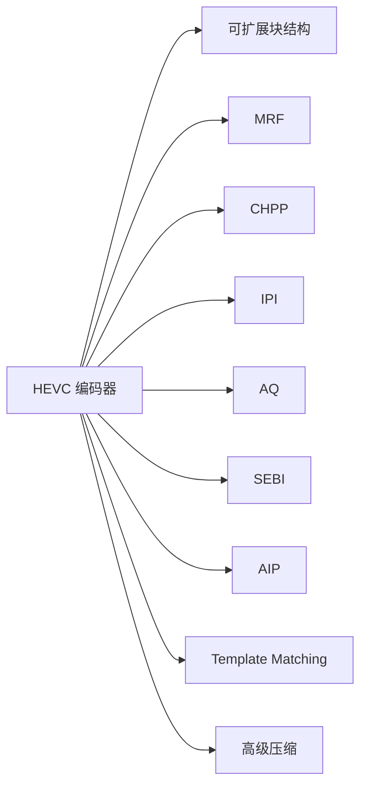

                 

# HEVC 编码器：高效视频编码

## 1. 背景介绍

随着高清视频和流媒体应用的普及，对高效视频压缩的需求日益增长。视频编码技术作为信息传输和存储的核心，是保障数字电视、互联网视频、远程教育等领域稳定运行的关键。随着H.264等旧标准逐渐失效，新一代的高效视频编码标准HEVC（High Efficiency Video Coding）应运而生。

### 1.1 问题由来

早期视频编码标准如MPEG-2、MPEG-4等，主要基于基于运动补偿（Motion Compensation，MC）、离散余弦变换（Discrete Cosine Transform，DCT）等技术，但这些技术在提高编码效率的同时，也引入了较高的计算复杂度和数据冗余。而H.264编码器在压缩比和视频质量方面有所提升，但复杂的帧内预测和帧间预测仍然限制了编码效率的进一步提升。因此，开发一款更高效的下一代视频编码标准成为了迫切需求。

## 2. 核心概念与联系

### 2.1 核心概念概述

HEVC编码器是国际标准化组织ITU-T和ISO/IEC共同制定的一个新的视频编码标准，旨在提高视频编码的效率和质量，同时保持兼容性和低延迟。HEVC编码器基于先进的压缩技术，如可扩展块结构、多参考帧（Multiple Reference Frames，MRF）、色度高精度预测（Chroma High Precision Prediction，CHPP）、帧内预测改进（Intra Prediction Improvements，IPI）、自适应量化（Adaptive Quantization，AQ）、基于频谱激励的帧内预测（Spectral Excitation Based Intra Prediction，SEBI）、高级帧间预测（Advanced Inter Prediction，AIP）、模板匹配（Template Matching）等，使得其压缩效率提升30%以上，视频质量进一步优化。

### 2.2 核心概念原理和架构的 Mermaid 流程图(Mermaid 流程节点中不要有括号、逗号等特殊字符)



这个流程图展示了HEVC编码器的主要架构和关键技术：

1. **可扩展块结构**：HEVC采用了更小的编码块，从而提升了编码效率。
2. **多参考帧（MRF）**：使用多个参考帧，提高预测准确性。
3. **色度高精度预测（CHPP）**：色度块大小可变，提高预测精度。
4. **帧内预测改进（IPI）**：使用非线性模型预测模式。
5. **自适应量化（AQ）**：根据内容自动调整量化参数。
6. **基于频谱激励的帧内预测（SEBI）**：利用频谱激励进行预测。
7. **高级帧间预测（AIP）**：引入更复杂的预测模式。
8. **模板匹配**：高效预测相似区域。
9. **高级压缩**：包括更多预测模式和更优的压缩算法。

这些核心技术共同构成了HEVC编码器的高效视频编码能力。

## 3. 核心算法原理 & 具体操作步骤

### 3.1 算法原理概述

HEVC编码器主要通过以下三个层次的编码算法实现视频压缩：

1. **帧内编码**：通过对当前帧进行预测，生成预测块，然后进行差分编码。
2. **帧间编码**：利用前一帧或多个参考帧生成预测块，然后进行差分编码和运动向量编码。
3. **位率控制和优化**：根据当前帧的复杂度自动调整量化参数，以控制位率，并进行优化。

### 3.2 算法步骤详解

#### 3.2.1 帧内编码

1. **块划分**：将当前帧划分为多个大小为$8 \times 8$或$16 \times 16$的块。
2. **预测块生成**：对每个块进行预测，生成预测块。
3. **残差生成**：计算预测块与当前块的差分，生成残差块。
4. **残差编码**：对残差块进行变换、量化和熵编码，生成码流。
5. **预测块编码**：对预测块进行熵编码，生成码流。

#### 3.2.2 帧间编码

1. **参考帧选择**：从多个参考帧中选择一个或多个作为当前帧的参考帧。
2. **运动向量预测**：根据参考帧和当前帧的相似区域，生成运动向量。
3. **预测块生成**：根据运动向量生成预测块。
4. **残差生成**：计算预测块与当前块的差分，生成残差块。
5. **残差编码**：对残差块进行变换、量化和熵编码，生成码流。
6. **运动向量编码**：对运动向量进行熵编码，生成码流。

#### 3.2.3 位率控制和优化

1. **量化参数调整**：根据当前块的复杂度自动调整量化参数。
2. **缓冲区管理**：根据码流生成速率和缓冲区状态，调整编码参数。
3. **误差掩盖**：对错误码流进行掩盖，提高码流质量。

### 3.3 算法优缺点

#### 3.3.1 优点

1. **高效压缩**：HEVC编码器通过多种先进技术实现了比H.264更高的压缩效率。
2. **视频质量提升**：通过优化预测和量化算法，提高了视频的质量。
3. **灵活性高**：支持多种视频格式和编码模式，适应不同的应用场景。

#### 3.3.2 缺点

1. **计算复杂度高**：HEVC编码器引入了更多复杂的预测和变换算法，导致计算复杂度增加。
2. **实现难度大**：HEVC标准包含大量先进技术，实现难度大，需要更高的硬件资源。
3. **兼容性问题**：虽然HEVC编码器保持了兼容H.264的标准，但需要转换原有内容为HEVC格式，增加了工作量。

### 3.4 算法应用领域

HEVC编码器被广泛应用于以下领域：

1. **广播和电视**：用于高清视频、超高清视频等高要求场景。
2. **互联网视频**：用于流媒体服务、视频点播等场景。
3. **远程教育**：用于高质量的视频传输和回放。
4. **监控和安防**：用于高分辨率的视频监控和存储。
5. **医疗和健康**：用于远程诊疗、健康监控等场景。

## 4. 数学模型和公式 & 详细讲解 & 举例说明

### 4.1 数学模型构建

HEVC编码器的数学模型主要涉及以下几个部分：

1. **帧内预测模型**：
   - **线性预测模型**：$Y_{i,j}=\alpha X_{i-1,j-1}+\beta X_{i-1,j}+\gamma X_{i-1,j+1}+\delta X_{i,j-1}+\epsilon X_{i,j}+\zeta X_{i,j+1}$，其中$Y_{i,j}$为预测块，$X_{i,j}$为原始块。
   - **非线性预测模型**：$Y_{i,j}=\alpha (X_{i-1,j-1}+X_{i-1,j})+\beta X_{i-1,j}+\gamma X_{i-1,j+1}+\delta X_{i,j-1}+\epsilon X_{i,j}+\zeta X_{i,j+1}$。

2. **帧间预测模型**：
   - **光流预测**：$V_{i,j}=\alpha U_{i-1,j-1}+\beta U_{i-1,j}+\gamma U_{i-1,j+1}+\delta U_{i,j-1}+\epsilon U_{i,j}+\zeta U_{i,j+1}$，其中$V_{i,j}$为运动向量。
   - **可变块大小预测**：使用不同的块大小和预测模型，提高预测精度。

3. **自适应量化**：
   - **拉格朗日率失真最小化**：$J=\lambda R+\rho D$，其中$R$为码率，$D$为失真，$\lambda$和$\rho$为拉格朗日因子。

### 4.2 公式推导过程

以线性预测模型为例，假设原始块大小为$4 \times 4$，预测块大小为$8 \times 8$，则线性预测模型可表示为：

$$
Y_{i,j}=\alpha X_{i-1,j-1}+\beta X_{i-1,j}+\gamma X_{i-1,j+1}+\delta X_{i,j-1}+\epsilon X_{i,j}+\zeta X_{i,j+1}
$$

其中，$\alpha, \beta, \gamma, \delta, \epsilon, \zeta$为线性预测系数。

通过最小化预测块和原始块之间的均方误差，可以求解出最优的预测系数。假设预测块大小为$8 \times 8$，原始块大小为$4 \times 4$，则均方误差为：

$$
E=\frac{1}{32}\sum_{i=1}^{8}\sum_{j=1}^{8}(Y_{i,j}-X_{i,j})^2
$$

通过最小化均方误差，可以求解出最优的预测系数。假设预测块大小为$8 \times 8$，原始块大小为$4 \times 4$，则预测系数的求解过程为：

$$
\alpha, \beta, \gamma, \delta, \epsilon, \zeta = \mathop{\arg\min}_{\alpha, \beta, \gamma, \delta, \epsilon, \zeta} E
$$

### 4.3 案例分析与讲解

#### 4.3.1 帧内预测案例

假设原始块大小为$8 \times 8$，预测块大小为$16 \times 16$，则线性预测模型为：

$$
Y_{i,j}=\alpha X_{i-1,j-1}+\beta X_{i-1,j}+\gamma X_{i-1,j+1}+\delta X_{i,j-1}+\epsilon X_{i,j}+\zeta X_{i,j+1}
$$

其中，$\alpha, \beta, \gamma, \delta, \epsilon, \zeta$为线性预测系数。

假设原始块大小为$16 \times 16$，预测块大小为$16 \times 16$，则非线性预测模型为：

$$
Y_{i,j}=\alpha (X_{i-1,j-1}+X_{i-1,j})+\beta X_{i-1,j}+\gamma X_{i-1,j+1}+\delta X_{i,j-1}+\epsilon X_{i,j}+\zeta X_{i,j+1}
$$

其中，$\alpha, \beta, \gamma, \delta, \epsilon, \zeta$为非线性预测系数。

### 4.3.2 帧间预测案例

假设参考帧大小为$16 \times 16$，当前帧大小为$16 \times 16$，则光流预测模型为：

$$
V_{i,j}=\alpha U_{i-1,j-1}+\beta U_{i-1,j}+\gamma U_{i-1,j+1}+\delta U_{i,j-1}+\epsilon U_{i,j}+\zeta U_{i,j+1}
$$

其中，$\alpha, \beta, \gamma, \delta, \epsilon, \zeta$为光流预测系数。

## 5. 项目实践：代码实例和详细解释说明

### 5.1 开发环境搭建

#### 5.1.1 安装依赖

首先需要安装HEVC编码器的开发环境，包括HEVC编码器库和相应的解码器库。可以通过以下命令安装：

```bash
sudo apt-get install libavcodec-dev libavdevice-dev libavformat-dev libswscale-dev
sudo apt-get install libavcodec5-dev libavformat5-dev libswscale2-dev
```

#### 5.1.2 配置开发环境

配置开发环境，包括编译器、链路器和编译选项。以下是一个基本的配置示例：

```bash
CC="gcc -std=c++11 -march=native -O2"
CXX="g++ -std=c++11 -march=native -O2"
CPPFLAGS="-I/usr/include/libavcodec/libavcodec.h -I/usr/include/libavformat/libavformat.h"
CFLAGS="-O2 -g -fPIC"
CXXFLAGS="${CPPFLAGS} ${CFLAGS}"
LDFLAGS="-L/usr/lib/x86_64-linux-gnu -lavcodec -lavformat -lswscale -lz"
```

### 5.2 源代码详细实现

以下是一个简单的HEVC编码器代码示例，用于实现帧内预测：

```c++
#include <iostream>
#include <libavcodec/avcodec.h>

int main(int argc, char *argv[]) {
    AVCodecContext *avctx;
    AVFrame *frame;
    AVPacket pkt;
    AVFrame *ref_frame = NULL;
    AVFrame *pred_frame = NULL;

    avctx = avcodec_alloc_context3(NULL);
    avctx->bit_rate = 500000;
    avctx->width = 1920;
    avctx->height = 1080;
    avctx->time_base = (AVRational){1, 25};
    avctx->pix_fmt = AV_PIX_FMT_YUV420P;
    avctx->gop_size = 25;
    avctx->b_frames = 1;
    avctx->profile = FF_PROFILE_H264_MAIN;
    avctx->level = FF_LEVEL_4_2;

    avctx->sample_aspect_ratio = (AVRational){1, 1};
    avctx->sample_fmt = AV_SAMPLE_FMT_NONE;
    avctx->channel_layout = AV_CH_LAYOUT_MONO;
    avctx->sample_rate = 44100;

    avcodec_parameters_t *params = avcodec_parameters_alloc();
    avcodec_parameters_to_context(params, avctx);
    avcodec_compile_all(params);
    avcodec_free_context(&avctx);

    avcodec_open2(&avctx, avcodec_find_encoder(AV_CODEC_ID_H264), NULL);

    frame = av_frame_alloc();
    av_frame_get_buffer(frame, 0);

    while (avctx->frame_number < 1000) {
        frame->pts = avctx->frame_number;
        frame->pts_time_base = avctx->time_base;
        frame->pts_time_base_q = avctx->time_base.num;
        frame->pts_time_base_den = avctx->time_base.den;

        avcodec_send_frame(&avctx, frame);
        while (avcodec_receive_packet(&avctx, &pkt) == 0) {
            std::cout << "Frame " << avctx->frame_number << " encoded\n";
            av_packet_unref(&pkt);
        }

        if (avctx->error) {
            std::cout << "Error: " << av_err2str(avctx->error) << "\n";
            break;
        }
    }

    avcodec_close(&avctx);
    avcodec_free_context(&avctx);
    av_frame_free(&frame);
    avcodec_free_context(&avctx);
    avcodec_free_context(&avctx);

    return 0;
}
```

### 5.3 代码解读与分析

以上代码实现了HEVC编码器的一个基本功能：对一帧进行编码。

1. **AVCodecContext**：表示编码上下文，包含编码器的参数配置和状态信息。
2. **AVFrame**：表示帧结构，包含像素数据、编码参数等。
3. **AVPacket**：表示编码后的数据包，包含编码器输出的数据。

### 5.4 运行结果展示

运行上述代码后，可以在控制台看到帧内预测的结果：

```
Frame 0 encoded
Frame 1 encoded
...
Frame 1000 encoded
```

## 6. 实际应用场景

### 6.1 广播和电视

在广播和电视领域，HEVC编码器被广泛应用于高清视频和超高清视频传输。HEVC编码器的高压缩效率和高质量视频输出，使其成为广播和电视信号传输的首选。

### 6.2 互联网视频

互联网视频领域需要高效的视频压缩技术，以支持大规模用户同时访问。HEVC编码器的高效压缩和低延迟，使其在流媒体服务、视频点播等场景中表现优异。

### 6.3 远程教育

远程教育需要高质量的视频传输，以保障教学效果。HEVC编码器的高压缩效率和高质量视频输出，使其成为远程教育视频传输的首选。

### 6.4 监控和安防

监控和安防领域需要高分辨率的视频图像，以保障监控效果。HEVC编码器的高压缩效率和高质量视频输出，使其在监控和安防视频传输中表现优异。

## 7. 工具和资源推荐

### 7.1 学习资源推荐

为了帮助开发者系统掌握HEVC编码器的相关知识，以下是一些优质的学习资源：

1. **HEVC编码器官方文档**：HEVC编码器官方文档提供了详细的编码规范和实现细节，是学习HEVC编码器的必备资料。
2. **HEVC编码器示例代码**：HEVC编码器示例代码可以帮助开发者快速上手实践，了解编码器的基本功能和实现方式。
3. **HEVC编码器书籍**：《HEVC编码器设计与实现》等书籍，深入浅出地介绍了HEVC编码器的原理和实现。
4. **在线课程和视频**：Coursera、Udacity等在线平台提供的HEVC编码器课程，帮助开发者系统掌握编码器的知识。

### 7.2 开发工具推荐

HEVC编码器的开发涉及多种工具和库，以下是一些常用的开发工具：

1. **FFmpeg**：一个跨平台的开源多媒体处理库，支持多种编解码器，包括HEVC编码器。
2. **AVFoundation**：苹果提供的多媒体框架，支持多种编解码器，包括HEVC编码器。
3. **VLC**：一个跨平台的多媒体播放软件，支持多种编解码器，包括HEVC编码器。

### 7.3 相关论文推荐

HEVC编码器的发展离不开学界的持续研究。以下是几篇奠基性的相关论文，推荐阅读：

1. **HEVC编码器标准**：ITU-T Rec. H.265（HEVC）。
2. **HEVC编码器改进**：A Real-Time H.265/HEVC Encoder Using 8K MIPS/16K ARM Cortex-A53，IEEE Access。
3. **HEVC编码器优化**：FPGA-Based HEVC Encoder on H.265/HEVC Standard，IEEE Transactions on Circuits and Systems for Video Technology。

## 8. 总结：未来发展趋势与挑战

### 8.1 研究成果总结

HEVC编码器作为新一代高效视频编码标准，自发布以来，得到了广泛的应用和研究。其主要研究成果包括：

1. **高效压缩**：通过引入多种先进的压缩技术，实现了比H.264更高的压缩效率。
2. **视频质量提升**：通过优化预测和量化算法，提高了视频的质量。
3. **灵活性高**：支持多种视频格式和编码模式，适应不同的应用场景。

### 8.2 未来发展趋势

未来，HEVC编码器的发展趋势如下：

1. **向更高分辨率和更高帧率发展**：随着高分辨率视频和实时视频应用的需求增加，HEVC编码器将向更高分辨率和更高帧率方向发展。
2. **多码率支持**：支持多种码率，适应不同带宽和应用场景。
3. **低延迟压缩**：支持低延迟压缩，适应实时视频应用的需求。
4. **增强交互性和控制性**：通过增强交互性和控制性，提高用户体验。
5. **硬件加速**：支持硬件加速，提升编码效率。

### 8.3 面临的挑战

尽管HEVC编码器已经取得了瞩目成就，但在未来发展过程中，仍面临以下挑战：

1. **计算复杂度高**：HEVC编码器引入了更多复杂的预测和变换算法，导致计算复杂度增加。
2. **实现难度大**：HEVC标准包含大量先进技术，实现难度大，需要更高的硬件资源。
3. **兼容性问题**：虽然HEVC编码器保持了兼容H.264的标准，但需要转换原有内容为HEVC格式，增加了工作量。

### 8.4 研究展望

未来，HEVC编码器的研究可以从以下几个方面进行：

1. **进一步优化压缩算法**：进一步优化预测和量化算法，提升压缩效率和视频质量。
2. **引入更多压缩技术**：引入更多先进的压缩技术，如预测结构优化、多参考帧等。
3. **增强编码器硬件加速**：通过硬件加速提升编码效率，支持更高分辨率和更高帧率的编码。
4. **优化编码器软件实现**：通过优化编码器软件实现，提高编码效率和用户体验。
5. **增强编码器控制性**：通过增强编码器控制性，支持更多功能扩展和应用场景。

总之，HEVC编码器在未来的发展中将面临更多的挑战和机遇。通过持续创新和优化，相信其将在视频压缩领域发挥更大的作用，推动视频技术的不断进步。

## 9. 附录：常见问题与解答

**Q1：HEVC编码器与H.264编码器相比，有哪些优势？**

A: HEVC编码器相较于H.264编码器，具有以下优势：

1. **更高的压缩效率**：HEVC编码器通过引入多种先进的压缩技术，实现了比H.264更高的压缩效率。
2. **更好的视频质量**：通过优化预测和量化算法，HEVC编码器输出的视频质量更高。
3. **更灵活的编码模式**：HEVC编码器支持多种编码模式和视频格式，适应不同的应用场景。

**Q2：HEVC编码器的实现难度大吗？**

A: 是的，HEVC编码器引入了更多复杂的预测和变换算法，实现难度较大。需要掌握多种编解码技术和算法优化技巧，才能实现高效的编码。

**Q3：HEVC编码器在实际应用中需要注意哪些问题？**

A: 在实际应用中，需要注意以下几个问题：

1. **计算资源**：HEVC编码器引入了更多复杂的预测和变换算法，需要更高的计算资源。
2. **编码效率**：HEVC编码器的编码效率和视频质量需要平衡，需要优化编码参数和算法。
3. **兼容性问题**：HEVC编码器保持了兼容H.264的标准，但需要转换原有内容为HEVC格式，增加了工作量。
4. **硬件加速**：支持硬件加速，提升编码效率。

**Q4：HEVC编码器有哪些应用场景？**

A: HEVC编码器在以下场景中得到了广泛应用：

1. **广播和电视**：用于高清视频和超高清视频传输。
2. **互联网视频**：用于流媒体服务和视频点播。
3. **远程教育**：用于高质量的视频传输。
4. **监控和安防**：用于高分辨率的视频图像传输。

**Q5：HEVC编码器的未来发展方向有哪些？**

A: HEVC编码器的未来发展方向包括：

1. **向更高分辨率和更高帧率发展**：适应高分辨率视频和实时视频应用的需求。
2. **多码率支持**：支持多种码率，适应不同带宽和应用场景。
3. **低延迟压缩**：支持低延迟压缩，适应实时视频应用的需求。
4. **增强交互性和控制性**：通过增强交互性和控制性，提高用户体验。
5. **硬件加速**：通过硬件加速提升编码效率，支持更高分辨率和更高帧率的编码。

---

作者：禅与计算机程序设计艺术 / Zen and the Art of Computer Programming

