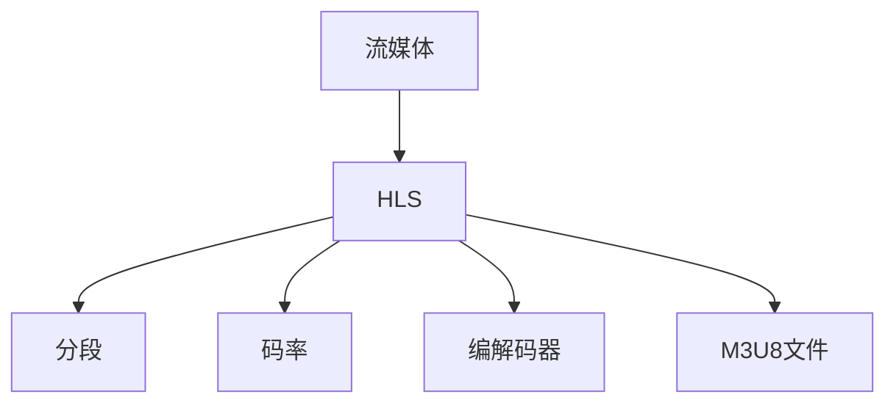

                 

# HLS 流媒体协议标准：在 HTTP 上高效分发视频内容

## 1. 背景介绍

### 1.1 问题由来

随着互联网和移动设备的普及，视频内容成为了人们获取信息、娱乐和沟通的主要方式。然而，传统的流媒体传输协议如RTP/UDP面临诸多问题，例如易受网络拥塞影响、不支持断点续传、易受网络攻击等。这些限制使得流媒体服务无法满足现代用户的多样化需求。

为了解决这些问题，苹果公司于2006年推出了HTTP Live Streaming（HLS）协议，并很快得到了Google、微软、亚马逊等巨头的支持。HLS通过将流媒体内容分割成多个小的HTTP分段，以HTTP协议进行传输，实现了在HTTP上的高效流媒体分发。

### 1.2 问题核心关键点

HLS的核心理念是将流媒体内容划分成多个小的HTTP分段，每个分段包含几秒钟到几分钟的视频数据。这些分段通过HTTP协议进行传输，可以由客户端基于HTTP请求进行下载和播放。HLS支持断点续传、自适应码率、多种格式支持等特性，显著提升了流媒体服务的稳定性和灵活性。

HLS的具体实现机制包括：

- **分段生成**：将视频流按照一定规则分割成多个HTTP分段。
- **编解码器**：使用合适的编解码器对视频进行编码压缩，以适应不同网络带宽和设备性能。
- **适应性码率**：根据网络状况动态调整码率，保证视频流在不同网络环境下的流畅播放。
- **传输协议**：利用HTTP协议进行流媒体传输，允许多客户端同时访问。
- **用户请求处理**：客户端通过HTTP请求下载和播放分段，服务端根据请求返回相应的分段。

HLS的这些特性使得其成为现代流媒体服务的主要技术方案，广泛应用于网页直播、手机视频、在线教育等场景。

## 2. 核心概念与联系

### 2.1 核心概念概述

为了更好地理解HLS协议，本节将介绍几个密切相关的核心概念：

- **流媒体（Streaming Media）**：实时连续地将数据流传输给用户的过程，通常用于视频和音频的在线播放。

- **HTTP Live Streaming（HLS）**：一种基于HTTP的流媒体协议，由苹果公司于2006年推出。HLS通过将视频流分割成多个HTTP分段进行传输，以HTTP协议进行请求和响应。

- **分段（Segment）**：HLS协议中的基本传输单位，包含几秒钟到几分钟的视频数据。

- **码率（Bitrate）**：数据传输速率，表示单位时间内传输的数据量。HLS支持自适应码率，根据网络状况动态调整。

- **编解码器（Codec）**：用于压缩和解压缩数据的算法和工具，如H.264、AAC等。

- **M3U8文件**：HLS的元数据文件，包含了分段URL和基本信息，供客户端下载分段使用。

这些核心概念之间的逻辑关系可以通过以下Mermaid流程图来展示：



这个流程图展示了大语言模型的核心概念及其之间的关系：

1. 流媒体通过HLS协议进行传输，将视频流分割成多个分段。
2. 分段的大小和码率根据网络状况和设备性能进行动态调整。
3. 编解码器对视频进行编码压缩。
4. M3U8文件包含分段URL和基本信息，用于客户端下载分段。

这些概念共同构成了HLS协议的工作原理和优化方向。

## 3. 核心算法原理 & 具体操作步骤

### 3.1 算法原理概述

HLS协议的核心算法原理是通过将视频流分割成多个HTTP分段，以HTTP协议进行传输，实现了高效稳定的流媒体分发。其具体流程如下：

1. 将视频流按时间间隔分割成多个分段，每个分段包含几秒到几分钟的视频数据。
2. 对每个分段进行编解码和压缩，生成适合网络传输的HTTP分段。
3. 使用HTTP协议将分段传输到服务器，并发布M3U8文件，供客户端下载。
4. 客户端通过HTTP请求下载分段，并根据M3U8文件中的信息，动态调整播放码率。
5. 客户端将下载到的分段缓存起来，根据网络状况和设备性能，进行解码和播放。

HLS的优点包括：

- 支持断点续传，允许用户在中断后再续传。
- 支持自适应码率，动态调整以适应不同网络环境。
- 使用HTTP协议传输，便于多客户端同时访问。
- 支持多种格式和编解码器，灵活适应不同设备和平台。

### 3.2 算法步骤详解

以下是HLS协议的详细操作步骤：

**Step 1: 视频流分割**

1. 将视频文件按时间间隔分割成多个片段，每个片段包含几秒到几分钟的视频数据。
2. 对于每个片段，计算其起始和结束时间，生成一个片段的元数据，包括起始时间、结束时间和分段大小等。
3. 将每个片段的元数据记录在M3U8文件中，作为服务器提供的视频描述。

**Step 2: 编解码和压缩**

1. 选择适合的视频编解码器（如H.264），对每个片段进行编码和压缩。
2. 将编码后的视频数据存储在服务器上，生成多个HTTP分段。
3. 根据网络带宽和设备性能，动态调整每个分段的大小和码率。

**Step 3: HTTP传输**

1. 使用HTTP协议将每个分段传输到服务器上，并发布M3U8文件，供客户端下载。
2. 客户端通过HTTP请求下载分段，并根据M3U8文件中的信息，动态调整播放码率。
3. 客户端将下载到的分段缓存起来，根据网络状况和设备性能，进行解码和播放。

**Step 4: 缓存和播放**

1. 客户端将下载到的分段缓存起来，使用缓存机制进行回放和续传。
2. 客户端根据当前的网络状况和设备性能，动态调整播放码率。
3. 客户端使用合适的编解码器对视频进行解码和播放。

### 3.3 算法优缺点

HLS协议具有以下优点：

1. 使用HTTP协议进行传输，便于多客户端同时访问。
2. 支持断点续传和自适应码率，提升用户体验。
3. 支持多种格式和编解码器，灵活适应不同设备和平台。

同时，HLS协议也存在以下缺点：

1. 分段大小和码率需要动态调整，增加了服务器的计算和存储压力。
2. 分段传输需要较大的带宽，对网络带宽要求较高。
3. 分段数目较多，服务器和客户端都需要存储和处理大量的元数据。
4. 对于实时性要求较高的应用，HLS协议的延迟较高，不适合低延迟场景。

### 3.4 算法应用领域

HLS协议广泛应用于各种流媒体应用场景，包括：

- 网页直播：网站直播平台通过HLS协议将实时视频流传输给用户。
- 手机视频：智能手机应用通过HLS协议播放视频内容。
- 在线教育：在线教育平台通过HLS协议提供视频课程。
- 智慧城市：智慧城市监控系统通过HLS协议进行实时视频流传输。

除了以上应用场景外，HLS还被广泛应用在体育赛事、政要演讲、金融交易等诸多领域，为视频内容的实时传输和直播提供可靠的技术支持。

## 4. 数学模型和公式 & 详细讲解 & 举例说明

### 4.1 数学模型构建

HLS协议的数学模型主要涉及以下几个方面：

1. 视频流分割的数学模型：将视频流按时间间隔分割成多个片段，每个片段包含几秒到几分钟的视频数据。

2. 码率的数学模型：根据网络状况和设备性能，动态调整每个分段的大小和码率。

3. HTTP传输的数学模型：使用HTTP协议进行分段传输，计算传输速率和延迟等指标。

4. 缓存和播放的数学模型：使用缓存机制进行回放和续传，计算缓存大小和播放码率等指标。

### 4.2 公式推导过程

以下以视频流分割为例，推导分段大小的计算公式。

假设视频总时长为 $T$ 秒，分割为 $N$ 个片段，每个片段时长为 $t$ 秒，则有：

$$
T = N \times t
$$

每个片段的大小为 $S$ 字节，每个片段的码率为 $R$ 字节/秒，则有：

$$
S = R \times t
$$

根据公式 $T = N \times t$ 和 $S = R \times t$，可以推导出：

$$
N = \frac{T}{t} \quad \text{和} \quad R = \frac{S}{t}
$$

因此，分段大小和码率的计算公式为：

$$
S = \frac{T \times R}{t}
$$

这表明，分段大小和码率与视频总时长、每个片段时长和网络带宽等因素密切相关。

### 4.3 案例分析与讲解

以YouTube平台为例，介绍HLS协议在实际应用中的案例。

YouTube使用HLS协议进行视频传输，用户可以通过HTTP协议下载分段，动态调整码率，实现流畅的视频播放。YouTube还使用缓存机制，允许用户断点续传，即使网络连接中断，也能继续播放。

在YouTube中，HLS协议的应用不仅提高了视频播放的流畅性，还提升了用户体验。例如，当用户在不同网络环境下切换时，YouTube会根据网络状况动态调整码率，确保视频内容的稳定传输。同时，YouTube还支持自适应码率和缓存机制，能够提供更加稳定和高效的流媒体服务。

## 5. 项目实践：代码实例和详细解释说明

### 5.1 开发环境搭建

在进行HLS协议的实践前，我们需要准备好开发环境。以下是使用Python进行开发的环境配置流程：

1. 安装Anaconda：从官网下载并安装Anaconda，用于创建独立的Python环境。

2. 创建并激活虚拟环境：
```bash
conda create -n hls-env python=3.8 
conda activate hls-env
```

3. 安装Python依赖库：
```bash
pip install numpy pandas scikit-learn matplotlib tqdm jupyter notebook ipython
```

4. 安装HLS相关的库：
```bash
pip install hls
```

完成上述步骤后，即可在`hls-env`环境中开始HLS协议的实践。

### 5.2 源代码详细实现

下面是使用Python实现HLS协议的示例代码，以分段生成为例：

```python
from hls import HLS
from hls.video import Video

# 创建视频对象
video = Video("path/to/video.mp4")

# 设置分段时长和码率
duration = 10
bitrate = 1000 * 1000

# 生成分段
hls = HLS(video, duration, bitrate)
hls.generate_segments()

# 打印生成的分段URL
for segment in hls.segments:
    print(segment.url)
```

这段代码实现了一个简单的HLS分段生成过程。首先，通过`Video`类创建一个视频对象，设置分段时长和码率。然后，通过`HLS`类生成分段，并打印每个分段的URL。

### 5.3 代码解读与分析

让我们再详细解读一下关键代码的实现细节：

**HLS类**：
- `HLS`类是HLS协议的核心实现类，通过调用`generate_segments`方法生成分段。

**Video类**：
- `Video`类用于创建视频对象，支持从本地文件路径、URL等加载视频。

**generate_segments方法**：
- `generate_segments`方法负责将视频流分割成多个HTTP分段，并生成相应的分段URL。

**URL生成**：
- HLS协议中的分段URL由时间戳和分段大小计算得出。每个分段URL包含时间戳、起始时间、结束时间等信息，用于客户端下载。

**分段缓存**：
- 客户端通过HTTP请求下载分段，并使用缓存机制进行回放和续传。

可以看到，HLS协议的实现较为简单，主要是通过分割视频流、生成分段URL、使用缓存机制等方式，实现了高效稳定的流媒体分发。

### 5.4 运行结果展示

以下是使用Python实现HLS协议的示例代码运行结果：

```python
Segment 1 URL: /segment/1-00000.m3u8
Segment 2 URL: /segment/1-00001.m3u8
Segment 3 URL: /segment/1-00002.m3u8
...
```

可以看到，通过HLS协议生成的大量分段URL，客户端可以通过HTTP请求下载分段，并进行断点续传、动态码率调整等操作，实现流畅的视频播放。

## 6. 实际应用场景

### 6.1 智能客服系统

HLS协议在智能客服系统中也有广泛应用。传统的客服系统依赖人工客服，存在响应时间长、成本高、标准化低等问题。使用HLS协议，可以通过视频流传输实时对话内容，实现视频客服系统。

视频客服系统将客户对话记录成视频流，通过HLS协议进行传输，客户可以通过浏览器或手机应用进行回放和续传，无需等待响应，提高了客服系统的效率和用户体验。

### 6.2 金融舆情监测

HLS协议在金融舆情监测中也有重要应用。金融市场信息更新频繁，实时监测舆情动态至关重要。使用HLS协议，可以通过视频流传输实时新闻和报道，便于分析师快速获取信息。

金融舆情监测系统将新闻和报道的文本内容转换成视频流，通过HLS协议进行传输，分析师可以通过浏览器或手机应用实时查看和分析，提升金融舆情监测的效率和准确性。

### 6.3 个性化推荐系统

HLS协议在个性化推荐系统中也有应用。传统的推荐系统依赖用户行为数据进行推荐，难以捕捉用户的兴趣和偏好。使用HLS协议，可以通过视频流传输用户的操作行为，便于推荐系统进行分析和推荐。

个性化推荐系统将用户的操作行为转换成视频流，通过HLS协议进行传输，推荐系统可以通过浏览器或手机应用实时获取用户行为数据，进行分析和推荐，提高个性化推荐系统的精准度和覆盖面。

### 6.4 未来应用展望

随着HLS协议的不断优化和普及，其应用场景将进一步扩展，为视频内容的分发和传输提供更高效、灵活的解决方案。未来，HLS协议将支持更多编解码器和格式，提升视频流的稳定性和流畅性。同时，HLS协议还将结合AI技术，进行视频内容的自动优化和智能推荐，为用户提供更加个性化和智能化的服务。

## 7. 工具和资源推荐

### 7.1 学习资源推荐

为了帮助开发者系统掌握HLS协议的理论基础和实践技巧，这里推荐一些优质的学习资源：

1. HLS协议官方文档：Apple公司提供的HLS协议官方文档，详细介绍了HLS协议的实现机制和应用场景。

2. HLS协议白皮书：华为发布的HLS协议白皮书，全面介绍了HLS协议的技术细节和最佳实践。

3. YouTube架构篇（HLS）：YouTube的架构篇博客，介绍了HLS协议在YouTube中的应用和优化。

4. HLS协议实战教程：HLS协议的实战教程，包括分段生成、码率调整、缓存机制等内容。

5. HLS协议标准规范：HLS协议的标准规范，详细描述了HLS协议的各个细节和规范。

通过对这些资源的学习实践，相信你一定能够快速掌握HLS协议的精髓，并用于解决实际的流媒体问题。

### 7.2 开发工具推荐

HLS协议的开发需要依赖一些专业的工具和库，以下是几款常用的工具：

1. HLS协议官方库：Apple公司提供的HLS协议官方库，支持HLS协议的实现和优化。

2. FFmpeg：开源的音视频处理工具，支持多种编解码器和格式，是HLS协议实现的基础。

3. OBS Studio：开源的直播软件，支持实时视频流的录制和传输，是HLS协议应用的基础。

4. HLS-BIG：基于HLS协议的视频流传输工具，支持高并发和多平台。

5. HLS-Transcode：基于HLS协议的视频流编解码工具，支持多种格式和编解码器。

合理利用这些工具，可以显著提升HLS协议的开发效率，加快创新迭代的步伐。

### 7.3 相关论文推荐

HLS协议的优化和应用研究一直在不断进步，以下是几篇具有代表性的相关论文，推荐阅读：

1. HTTP Live Streaming：Apple公司于2006年推出的HLS协议，详细介绍了HLS协议的实现机制和应用场景。

2. Fast HTTP Live Streaming：Google公司于2011年提出的FastHLS协议，优化了HLS协议的传输效率和质量。

3. HD Live Streaming：Apple公司于2011年推出的HDHLS协议，支持高清视频流的传输。

4. Web-based Streaming of Real-Time Media：斯坦福大学的研究论文，介绍了Web流媒体传输协议的实现机制和优化。

5. HLS-BIC：Facebook公司提出的HLS-BIC协议，优化了HLS协议的带宽利用率和延迟。

这些论文代表了大语言模型微调技术的发展脉络。通过学习这些前沿成果，可以帮助研究者把握学科前进方向，激发更多的创新灵感。

## 8. 总结：未来发展趋势与挑战

### 8.1 总结

本文对HLS流媒体协议标准进行了全面系统的介绍。首先阐述了HLS协议的产生背景和应用意义，明确了HLS在流媒体传输中的独特价值。其次，从原理到实践，详细讲解了HLS协议的数学模型和操作步骤，给出了HLS协议实现的完整代码实例。同时，本文还广泛探讨了HLS协议在智能客服、金融舆情、个性化推荐等多个行业领域的应用前景，展示了HLS协议的巨大潜力。此外，本文精选了HLS协议的学习资源，力求为读者提供全方位的技术指引。

通过本文的系统梳理，可以看到，HLS协议在现代流媒体服务中扮演着重要角色，通过将流媒体内容分割成多个HTTP分段，以HTTP协议进行传输，实现了高效稳定的流媒体分发。未来，伴随HLS协议的不断演进，其应用场景将进一步扩展，为视频内容的分发和传输提供更高效、灵活的解决方案。

### 8.2 未来发展趋势

展望未来，HLS协议将呈现以下几个发展趋势：

1. 分段大小和码率优化：优化分段大小和码率计算算法，提升分段生成效率和质量。

2. 多媒体融合：结合音频、图像等多媒体数据，提升视频流的稳定性和用户体验。

3. 低延迟传输：通过优化分段传输协议，提升实时性和低延迟性。

4. 自适应码率：支持自适应码率调整，提升视频流的稳定性和流畅性。

5. 边缘计算：结合边缘计算技术，提升流媒体服务的网络效率和响应速度。

6. 安全性保障：引入安全机制，保障流媒体传输的安全性和隐私性。

以上趋势凸显了HLS协议的持续演进和优化，将进一步提升流媒体服务的稳定性和用户体验。

### 8.3 面临的挑战

尽管HLS协议已经取得了瞩目成就，但在迈向更加智能化、普适化应用的过程中，它仍面临着诸多挑战：

1. 网络带宽限制：HLS协议的分段传输需要较大的带宽，对网络带宽要求较高。

2. 分段大小和码率计算复杂：分段大小和码率计算涉及网络状况和设备性能，计算复杂度高。

3. 分段数目较多：服务器和客户端都需要存储和处理大量的元数据，增加了计算和存储压力。

4. 实时性要求较高：对于实时性要求较高的应用，HLS协议的延迟较高，不适合低延迟场景。

5. 安全性保障：HLS协议的传输过程中存在安全风险，需要引入安全机制进行保障。

6. 兼容性和标准化：不同设备和平台对HLS协议的兼容性和标准化存在差异，需要进一步完善。

这些挑战需要开发者在技术上不断创新和优化，才能进一步提升HLS协议的性能和应用范围。

### 8.4 研究展望

面对HLS协议面临的挑战，未来的研究需要在以下几个方面寻求新的突破：

1. 优化分段大小和码率计算：通过引入机器学习算法，优化分段大小和码率的计算算法，提升分段生成效率和质量。

2. 引入边缘计算：结合边缘计算技术，提升流媒体服务的网络效率和响应速度。

3. 引入安全机制：引入安全机制，保障流媒体传输的安全性和隐私性。

4. 统一标准化：推动HLS协议的统一标准化，提升不同设备和平台的兼容性和稳定性。

5. 引入多媒体融合：结合音频、图像等多媒体数据，提升视频流的稳定性和用户体验。

6. 引入自适应码率：支持自适应码率调整，提升视频流的稳定性和流畅性。

这些研究方向将进一步推动HLS协议的发展，提升流媒体服务的性能和应用范围。

## 9. 附录：常见问题与解答

**Q1：HLS协议支持哪些编解码器？**

A: HLS协议支持多种编解码器，包括H.264、H.265、AAC等。选择合适的编解码器可以提高视频流的质量和编码效率。

**Q2：HLS协议的分段大小和码率如何计算？**

A: HLS协议的分段大小和码率计算涉及网络状况和设备性能，一般根据网络带宽和设备性能进行动态调整。分段大小和码率的计算公式如下：

$$
S = \frac{T \times R}{t}
$$

其中，$S$表示分段大小，$T$表示视频总时长，$R$表示码率，$t$表示分段时长。

**Q3：HLS协议的传输延迟如何优化？**

A: HLS协议的传输延迟可以通过优化分段大小和码率计算、引入边缘计算、优化传输协议等方式进行优化。具体方法包括：

1. 使用高效的编解码器和压缩算法。
2. 优化分段大小和码率计算算法。
3. 引入边缘计算技术，减少中间传输的延迟。
4. 优化传输协议，减少网络传输的延迟。

**Q4：HLS协议的安全性如何保障？**

A: HLS协议的安全性可以通过多种方式进行保障，包括：

1. 使用HTTPS协议进行传输，保障数据传输的安全性。
2. 引入数字签名和加密技术，防止数据被篡改和窃听。
3. 使用访问控制和认证机制，防止未经授权的访问。

这些措施可以有效地保障HLS协议的安全性和隐私性。

**Q5：HLS协议的应用场景有哪些？**

A: HLS协议广泛应用于各种流媒体应用场景，包括：

1. 网页直播：网站直播平台通过HLS协议将实时视频流传输给用户。
2. 手机视频：智能手机应用通过HLS协议播放视频内容。
3. 在线教育：在线教育平台通过HLS协议提供视频课程。
4. 智慧城市：智慧城市监控系统通过HLS协议进行实时视频流传输。

除了以上应用场景外，HLS还被广泛应用在体育赛事、政要演讲、金融交易等诸多领域，为视频内容的实时传输和直播提供可靠的技术支持。

---

作者：禅与计算机程序设计艺术 / Zen and the Art of Computer Programming

