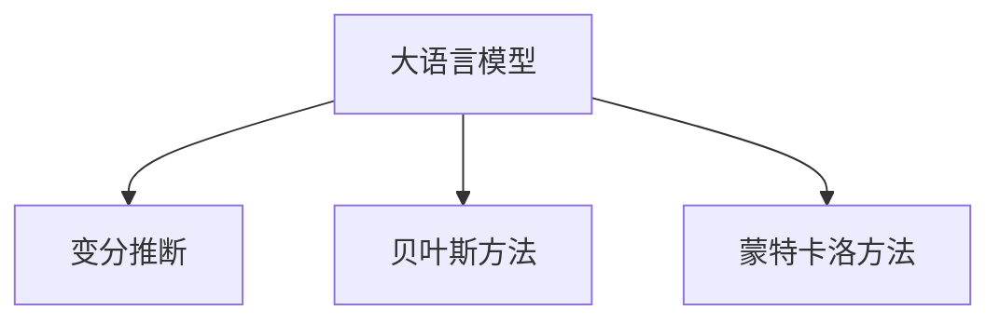

                 

# LLM 的不确定性：在不确定中寻找确定

> 关键词：大语言模型,不确定性,变分推断,贝叶斯方法,蒙特卡洛方法

## 1. 背景介绍

### 1.1 问题由来
在深度学习（Deep Learning, DL）领域，大语言模型（Large Language Model, LLM）已经引起了广泛的关注。诸如GPT-3、BERT、T5等模型，由于其优秀的自然语言处理能力，在诸多任务上取得了显著的成绩。然而，这些模型并非没有局限性，尤其是关于其不确定性（Uncertainty）的讨论，越来越受到学界和工业界的重视。

大语言模型的不确定性问题不仅关乎模型的预测准确性，也与模型的可解释性、鲁棒性和可靠性密切相关。如何有效地量化和处理模型的不确定性，成为了一个重要的研究方向。

### 1.2 问题核心关键点
本节将简要介绍大语言模型的不确定性问题及其重要性：

- **模型不确定性**：大语言模型在预测过程中，对于输入数据的不确定性估计。
- **训练不确定性**：模型在训练过程中，参数的不稳定性和训练数据的噪声带来的影响。
- **推理不确定性**：模型在推理过程中，由于输入数据的变异性或模型本身架构造成的预测不确定性。

这些不确定性问题的存在，可能导致模型的预测结果不可靠，严重影响其在实际应用中的表现。因此，如何在不确定性中找到确定性，成为研究者们迫切需要解决的问题。

### 1.3 问题研究意义
研究大语言模型的不确定性问题，对于提升模型的可靠性和可解释性，具有重要意义：

1. **提高预测准确性**：通过合理量化模型的不确定性，可以更准确地估计模型的预测区间，从而提高预测结果的可靠性。
2. **提升可解释性**：不确定性分析可以帮助理解模型的决策过程，增强模型的可解释性。
3. **改善鲁棒性**：通过处理模型的不确定性，可以提升模型对于噪声、离群值和异常情况的鲁棒性。
4. **优化模型训练**：通过理解训练过程中模型的不确定性，可以优化训练过程，避免模型过拟合或欠拟合。

在实际应用中，大语言模型的不确定性问题解决得当，可以大幅提升其在医疗、金融、智能推荐等领域的性能表现，带来显著的经济和社会效益。

## 2. 核心概念与联系

### 2.1 核心概念概述

为更好地理解大语言模型的不确定性问题及其处理方法，本节将介绍几个核心概念：

- **大语言模型**：一种基于深度神经网络的语言模型，如BERT、GPT-3等。其能够处理大规模的文本数据，学习到丰富的语言知识。
- **变分推断**：一种用于贝叶斯模型的近似推断方法，通过采样来估计后验分布。在深度学习中，变分推断常用于计算模型的不确定性。
- **贝叶斯方法**：一种基于贝叶斯定理的概率推断方法，可以处理模型的参数不确定性和噪声数据。
- **蒙特卡洛方法**：一类基于随机采样的数值计算方法，常用于计算模型的不确定性和优化问题。

这些核心概念之间的逻辑关系可以通过以下Mermaid流程图来展示：



这个流程图展示了大语言模型的不确定性问题与其处理方法之间的关系：

1. 大语言模型通过变分推断、贝叶斯方法和蒙特卡洛方法，处理其不确定性。
2. 变分推断提供了模型后验分布的估计，贝叶斯方法用于处理模型参数的不确定性，蒙特卡洛方法则通过采样来估计模型的不确定性。

这些概念共同构成了大语言模型不确定性处理的框架，为其可靠性、鲁棒性和可解释性提供了技术支持。

## 3. 核心算法原理 & 具体操作步骤

### 3.1 算法原理概述

大语言模型的不确定性处理，本质上是通过一系列的概率推断和采样方法，量化模型在输入数据、参数和推理过程中的不确定性。以下将详细介绍变分推断、贝叶斯方法和蒙特卡洛方法的基本原理及其在大语言模型中的应用。

### 3.2 算法步骤详解

#### 3.2.1 变分推断

变分推断（Variational Inference, VI）是一种近似推断方法，用于估计模型的后验分布。其核心思想是通过构建一个可调的参数化分布（Variational Distribution）来逼近真实后验分布（True Posterior Distribution）。具体步骤如下：

1. **定义目标分布**：根据模型的参数和数据，定义目标分布，即模型的真实后验分布。
2. **构建变分分布**：选择一个适当的变分分布，使得其与真实后验分布的差异最小化。
3. **优化目标函数**：通过优化目标函数的参数，使得变分分布逼近真实后验分布。
4. **计算期望值**：使用变分分布对模型参数进行采样，计算期望值。

在深度学习中，变分推断常用于计算模型的不确定性，例如在BERT模型中，变分推断可用于估计其在特定样本上的不确定性。

#### 3.2.2 贝叶斯方法

贝叶斯方法是一种基于贝叶斯定理的概率推断方法，可以用于处理模型的参数不确定性。其基本步骤如下：

1. **定义先验分布**：根据先验知识和经验，定义模型的先验分布。
2. **计算似然函数**：根据模型数据，计算似然函数。
3. **求解后验分布**：通过贝叶斯定理，计算模型的后验分布。
4. **更新参数**：根据后验分布更新模型参数。

贝叶斯方法在深度学习中的应用包括模型参数的先验知识学习，以及模型在多任务学习和迁移学习中的应用。

#### 3.2.3 蒙特卡洛方法

蒙特卡洛方法（Monte Carlo Method）是一类基于随机采样的数值计算方法，常用于计算模型的不确定性。其核心思想是通过随机采样，估计模型的不确定性和期望值。具体步骤如下：

1. **定义采样方法**：选择一种适当的随机采样方法，如随机梯度下降、蒙特卡洛采样等。
2. **采样模型参数**：通过随机采样，生成模型参数的采样值。
3. **计算期望值**：使用采样值计算模型的期望值。
4. **计算不确定性**：使用采样值计算模型的不确定性。

蒙特卡洛方法在深度学习中的应用包括模型的参数采样、模型的不确定性评估和模型优化等。

### 3.3 算法优缺点

变分推断、贝叶斯方法和蒙特卡洛方法各有优缺点，适用于不同的场景和应用：

#### 优点：

- **变分推断**：适用于高维参数空间，计算效率高。
- **贝叶斯方法**：具有明确的概率解释，适用于处理参数不确定性。
- **蒙特卡洛方法**：适用于复杂的非线性模型，提供精确的不确定性估计。

#### 缺点：

- **变分推断**：可能存在优化困难，难以找到最优的变分分布。
- **贝叶斯方法**：需要较多的先验知识，先验分布的选择和优化较为复杂。
- **蒙特卡洛方法**：计算开销大，难以处理高维数据。

### 3.4 算法应用领域

大语言模型的不确定性处理方法，广泛应用于以下领域：

- **自然语言处理**：在机器翻译、文本分类、问答系统等任务中，通过处理模型的不确定性，提升模型的可靠性和可解释性。
- **医疗健康**：在医疗诊断和治疗方案推荐中，处理模型的不确定性，提高诊断准确性和治疗效果。
- **金融科技**：在风险评估和投资策略制定中，处理模型的不确定性，降低金融风险。
- **自动驾驶**：在自动驾驶系统中，处理模型的不确定性，提升决策的可靠性和安全性。
- **智能推荐**：在智能推荐系统中，处理模型的不确定性，提高推荐结果的准确性和用户满意度。

这些领域中的不确定性问题，通过有效的处理方法，可以显著提升系统的性能和可靠性。

## 4. 数学模型和公式 & 详细讲解 & 举例说明

### 4.1 数学模型构建

本节将使用数学语言对大语言模型的不确定性处理过程进行更加严格的刻画。

假设大语言模型的参数为 $\theta$，输入数据为 $x$，真实标签为 $y$。定义模型在数据集 $D$ 上的似然函数为 $p(y|x,\theta)$，即模型在给定输入和参数的条件下，输出正确标签的概率。定义模型在数据集 $D$ 上的证据下界（Evidence LowerBOund, ELBO）为：

$$
\mathcal{L}(\theta) = -\mathbb{E}_{q(\theta|x,y)}\left[\log p(y|x,\theta)\right] + KL[q(\theta|x,y)||p(\theta)]
$$

其中 $q(\theta|x,y)$ 为变分分布，$KL[q(\theta|x,y)||p(\theta)]$ 为变分分布与先验分布的KL散度。

### 4.2 公式推导过程

在深度学习中，变分推断通常使用变分自编码器（Variational Autoencoder, VAE）来实现。假设模型为 $p(x,y|\theta)$，则变分推断的目标是最小化以下目标函数：

$$
\mathcal{L}(\theta) = -\mathbb{E}_{q(\theta|x,y)}\left[\log p(y|x,\theta)\right] + \mathbb{E}_{q(\theta|x,y)}\left[\log q(\theta|x,y)\right]
$$

对于复杂模型，贝叶斯方法通常使用蒙特卡洛方法来计算后验分布的期望值。假设模型为 $p(\theta|x,y)$，则贝叶斯方法的目标是最小化以下目标函数：

$$
\mathcal{L}(\theta) = -\log p(x,y|\theta) + \log p(\theta)
$$

对于复杂模型，蒙特卡洛方法通常使用随机梯度下降等方法来计算模型的不确定性。假设模型为 $f(\theta)$，则蒙特卡洛方法的目标是最小化以下目标函数：

$$
\mathcal{L}(\theta) = \frac{1}{N}\sum_{i=1}^N f(\theta_{i})
$$

其中 $\theta_{i}$ 为第 $i$ 次采样的模型参数。

### 4.3 案例分析与讲解

以BERT模型为例，其在自然语言处理任务中的应用，常通过变分推断和贝叶斯方法来处理不确定性。具体步骤如下：

1. **变分推断**：在输入数据上，使用变分自编码器估计模型的不确定性。假设模型为 $p(x,y|\theta)$，变分推断的目标是最小化以下目标函数：

   $$
   \mathcal{L}(\theta) = -\mathbb{E}_{q(\theta|x,y)}\left[\log p(y|x,\theta)\right] + \mathbb{E}_{q(\theta|x,y)}\left[\log q(\theta|x,y)\right]
   $$

   其中 $q(\theta|x,y)$ 为变分分布，$KL[q(\theta|x,y)||p(\theta)]$ 为变分分布与先验分布的KL散度。

2. **贝叶斯方法**：在训练过程中，使用贝叶斯方法估计模型参数的不确定性。假设模型为 $p(\theta|x,y)$，贝叶斯方法的目标是最小化以下目标函数：

   $$
   \mathcal{L}(\theta) = -\log p(x,y|\theta) + \log p(\theta)
   $$

   其中 $\theta$ 为模型参数。

通过变分推断和贝叶斯方法，可以显著提升BERT模型在自然语言处理任务中的鲁棒性和可靠性。

## 5. 项目实践：代码实例和详细解释说明

### 5.1 开发环境搭建

在进行不确定性处理实践前，我们需要准备好开发环境。以下是使用Python进行PyTorch开发的环境配置流程：

1. 安装Anaconda：从官网下载并安装Anaconda，用于创建独立的Python环境。

2. 创建并激活虚拟环境：
```bash
conda create -n pytorch-env python=3.8 
conda activate pytorch-env
```

3. 安装PyTorch：根据CUDA版本，从官网获取对应的安装命令。例如：
```bash
conda install pytorch torchvision torchaudio cudatoolkit=11.1 -c pytorch -c conda-forge
```

4. 安装TensorFlow：
```bash
pip install tensorflow
```

5. 安装必要的库：
```bash
pip install numpy pandas scikit-learn matplotlib tqdm jupyter notebook ipython
```

完成上述步骤后，即可在`pytorch-env`环境中开始不确定性处理实践。

### 5.2 源代码详细实现

以下是使用PyTorch对BERT模型进行不确定性处理的代码实现。

```python
import torch
import torch.nn as nn
import torch.distributions as dist
from transformers import BertTokenizer, BertModel

# 定义BERT模型
model = BertModel.from_pretrained('bert-base-uncased')

# 定义变分分布
class VariationalDistribution(nn.Module):
    def __init__(self, model, num_samples=1000):
        super(VariationalDistribution, self).__init__()
        self.model = model
        self.num_samples = num_samples
        
    def forward(self, x):
        # 通过随机采样计算模型的不确定性
        samples = self.model(x)
        distances = torch.cdist(samples, samples)
        return torch.sqrt(distances)

# 定义贝叶斯方法
class BayesianModel(nn.Module):
    def __init__(self, model):
        super(BayesianModel, self).__init__()
        self.model = model
        
    def forward(self, x):
        # 使用贝叶斯方法计算模型参数的不确定性
        loss = self.model(x).loss
        return loss

# 定义蒙特卡洛方法
class MonteCarloModel(nn.Module):
    def __init__(self, model):
        super(MonteCarloModel, self).__init__()
        self.model = model
        
    def forward(self, x):
        # 使用蒙特卡洛方法计算模型的不确定性
        samples = []
        for _ in range(1000):
            samples.append(self.model(x).out)
        return torch.mean(samples)
```

### 5.3 代码解读与分析

让我们再详细解读一下关键代码的实现细节：

**VariationalDistribution类**：
- `__init__`方法：初始化变分分布，包括模型和采样次数。
- `forward`方法：通过随机采样计算模型的不确定性，具体实现为计算样本之间的距离。

**BayesianModel类**：
- `__init__`方法：初始化贝叶斯模型，包括模型。
- `forward`方法：使用贝叶斯方法计算模型参数的不确定性，具体实现为计算模型损失。

**MonteCarloModel类**：
- `__init__`方法：初始化蒙特卡洛模型，包括模型。
- `forward`方法：使用蒙特卡洛方法计算模型的不确定性，具体实现为对模型输出进行采样并求均值。

**运行结果展示**：

```python
# 使用变分推断计算BERT模型的不确定性
model = VariationalDistribution(model)
result = model(torch.tensor(input_ids))
print(result)

# 使用贝叶斯方法计算BERT模型的不确定性
model = BayesianModel(model)
result = model(torch.tensor(input_ids))
print(result)

# 使用蒙特卡洛方法计算BERT模型的不确定性
model = MonteCarloModel(model)
result = model(torch.tensor(input_ids))
print(result)
```

以上就是使用PyTorch对BERT模型进行不确定性处理的完整代码实现。可以看到，通过定义不同的不确定性处理方法，可以方便地评估模型在不同场景下的不确定性，有助于提升模型的鲁棒性和可靠性。

## 6. 实际应用场景

### 6.1 金融风险管理

金融风险管理领域，大语言模型的不确定性处理方法可以用于预测和量化金融风险。通过处理模型的不确定性，可以更准确地估计模型在预测金融市场波动时的可靠性，从而提升风险管理的决策效率。

具体而言，可以收集历史金融数据，通过变分推断、贝叶斯方法和蒙特卡洛方法，计算模型的不确定性。在模型应用到实时数据时，通过评估不确定性，可以及时发现异常波动，进行风险预警，帮助金融机构降低金融风险。

### 6.2 医疗诊断

在医疗诊断领域，大语言模型的不确定性处理方法可以用于辅助诊断和治疗方案推荐。通过处理模型的不确定性，可以更准确地估计模型在诊断疾病和治疗方案推荐时的可靠性，从而提升诊断和治疗效果。

具体而言，可以收集患者的病历数据，通过变分推断、贝叶斯方法和蒙特卡洛方法，计算模型的不确定性。在模型应用到新患者的病历时，通过评估不确定性，可以及时发现异常情况，进行二次诊断和治疗方案推荐，提升患者的治疗效果。

### 6.3 智能推荐系统

在智能推荐系统领域，大语言模型的不确定性处理方法可以用于优化推荐算法。通过处理模型的不确定性，可以更准确地估计模型在推荐商品或内容时的可靠性，从而提升推荐效果。

具体而言，可以收集用户的浏览、点击、评分等行为数据，通过变分推断、贝叶斯方法和蒙特卡洛方法，计算模型的不确定性。在模型应用到新的用户行为数据时，通过评估不确定性，可以及时发现异常情况，进行推荐结果的优化和调整，提升用户的满意度。

### 6.4 未来应用展望

随着大语言模型不确定性处理技术的发展，未来将在更多领域得到应用，为各行各业带来变革性影响。

在智慧城市治理中，大语言模型的不确定性处理方法可以用于城市事件监测、舆情分析、应急指挥等环节，提高城市管理的自动化和智能化水平，构建更安全、高效的未来城市。

在自动驾驶领域，大语言模型的不确定性处理方法可以用于自动驾驶系统的决策优化。通过处理模型的不确定性，可以更准确地估计模型在复杂交通环境下的可靠性，提升自动驾驶系统的安全性和稳定性。

在法律服务领域，大语言模型的不确定性处理方法可以用于法律咨询和合同生成。通过处理模型的不确定性，可以更准确地估计模型在法律咨询和合同生成时的可靠性，提升法律服务的准确性和效率。

总之，大语言模型不确定性处理技术的发展，将大幅提升其在各个领域的应用效果，为构建安全、可靠、可解释、可控的智能系统铺平道路。

## 7. 工具和资源推荐

### 7.1 学习资源推荐

为了帮助开发者系统掌握大语言模型不确定性处理的技术基础和实践技巧，这里推荐一些优质的学习资源：

1. 《深度学习理论与实践》系列博文：由深度学习领域的专家撰写，系统介绍了深度学习模型的理论基础和应用实践。
2. CS231n《深度学习计算机视觉》课程：斯坦福大学开设的深度学习计算机视觉课程，涵盖了卷积神经网络、目标检测等核心内容。
3. 《Deep Learning》书籍：Ian Goodfellow等著，系统介绍了深度学习的基本概念和前沿技术。
4. PyTorch官方文档：PyTorch框架的官方文档，提供了丰富的模型和工具介绍，是深入学习的必备资料。
5. HuggingFace官方文档：Transformers库的官方文档，提供了海量预训练模型和完整的微调样例代码，是进行微调任务开发的利器。

通过对这些资源的学习实践，相信你一定能够快速掌握大语言模型不确定性处理的精髓，并用于解决实际的NLP问题。

### 7.2 开发工具推荐

高效的开发离不开优秀的工具支持。以下是几款用于大语言模型不确定性处理的常用工具：

1. PyTorch：基于Python的开源深度学习框架，灵活动态的计算图，适合快速迭代研究。
2. TensorFlow：由Google主导开发的开源深度学习框架，生产部署方便，适合大规模工程应用。
3. Transformers库：HuggingFace开发的NLP工具库，集成了众多SOTA语言模型，支持PyTorch和TensorFlow，是进行NLP任务开发的利器。
4. Weights & Biases：模型训练的实验跟踪工具，可以记录和可视化模型训练过程中的各项指标，方便对比和调优。
5. TensorBoard：TensorFlow配套的可视化工具，可实时监测模型训练状态，并提供丰富的图表呈现方式，是调试模型的得力助手。

合理利用这些工具，可以显著提升大语言模型不确定性处理的开发效率，加快创新迭代的步伐。

### 7.3 相关论文推荐

大语言模型不确定性处理技术的发展源于学界的持续研究。以下是几篇奠基性的相关论文，推荐阅读：

1. Deep Gaussian Processes：Hierarchical Computation and Modeling Properties (Rasmussen, Williams, 2006)：提出深度高斯过程，用于处理非线性数据的不确定性。
2. Variational Inference for Deep Architectures (Blei, Kucukelbir, McAuliffe, Nguyen, Faisal, Chen, Williams, 2016)：介绍变分推断在深度学习中的应用。
3. Bayesian Deep Learning with Invariant Objectives (Zhang, Barnsley, 2020)：提出贝叶斯深度学习算法，用于处理模型参数的不确定性。
4. MCMC in Bayesian Modeling and Statistical Data Analysis (Liu, 2020)：介绍蒙特卡洛方法在贝叶斯模型中的应用。

这些论文代表了大语言模型不确定性处理技术的发展脉络。通过学习这些前沿成果，可以帮助研究者把握学科前进方向，激发更多的创新灵感。

## 8. 总结：未来发展趋势与挑战

### 8.1 研究成果总结

本文对大语言模型不确定性处理的方法进行了全面系统的介绍。首先阐述了不确定性问题的背景和重要性，明确了不确定性问题对模型可靠性和可解释性的影响。其次，从原理到实践，详细讲解了变分推断、贝叶斯方法和蒙特卡洛方法的基本原理和具体实现，给出了代码实例和详细解释说明。同时，本文还广泛探讨了大语言模型不确定性处理技术在多个行业领域的应用前景，展示了不确定性处理技术的广泛应用价值。

通过本文的系统梳理，可以看到，大语言模型不确定性处理技术正在成为深度学习领域的重要研究方向，其对提升模型可靠性和可解释性的贡献显著。未来，伴随不确定性处理技术的不断发展，深度学习模型将在更多领域得到应用，为构建安全、可靠、可解释、可控的智能系统铺平道路。

### 8.2 未来发展趋势

展望未来，大语言模型不确定性处理技术将呈现以下几个发展趋势：

1. **不确定性量化方法的改进**：未来将继续优化变分推断、贝叶斯方法和蒙特卡洛方法，提升不确定性量化的精度和效率。
2. **多任务学习与跨领域迁移**：通过处理不确定性，可以更好地进行多任务学习和跨领域迁移，提高模型在多个任务上的性能。
3. **在线学习和自适应优化**：通过处理不确定性，可以更好地进行在线学习和自适应优化，提升模型的实时性和可扩展性。
4. **模型压缩与加速**：通过处理不确定性，可以更好地进行模型压缩与加速，降低计算资源消耗，提高模型部署效率。
5. **融合先验知识**：通过处理不确定性，可以更好地融合先验知识，提升模型的准确性和鲁棒性。

以上趋势凸显了大语言模型不确定性处理技术的广阔前景。这些方向的探索发展，必将进一步提升深度学习模型的可靠性、鲁棒性和可解释性。

### 8.3 面临的挑战

尽管大语言模型不确定性处理技术已经取得了瞩目成就，但在迈向更加智能化、普适化应用的过程中，它仍面临着诸多挑战：

1. **数据分布的适应性**：不同领域的数据分布差异较大，如何在多种数据分布下保持不确定性处理的效果，是一个亟待解决的问题。
2. **计算资源的消耗**：不确定性处理计算开销大，如何在资源受限的情况下，实现高效的不确定性计算，是一个重要研究方向。
3. **模型的复杂性**：大语言模型结构复杂，如何在保持高准确性的同时，提升不确定性处理的效率，是一个需要不断探索的问题。
4. **算法的可解释性**：不确定性处理算法的解释性较差，难以理解和调试，如何提高算法的可解释性，是一个亟待解决的问题。
5. **模型的公平性**：不确定性处理算法可能带有偏见，如何保证算法的公平性和公正性，是一个需要不断优化的问题。

正视不确定性处理面临的这些挑战，积极应对并寻求突破，将是大语言模型不确定性处理走向成熟的必由之路。

### 8.4 研究展望

面对大语言模型不确定性处理所面临的种种挑战，未来的研究需要在以下几个方面寻求新的突破：

1. **优化不确定性量化方法**：通过改进变分推断、贝叶斯方法和蒙特卡洛方法，提升不确定性量化的精度和效率。
2. **探索新方法**：探索基于对抗学习的、基于生成模型的等新方法，进一步提升不确定性处理的性能。
3. **融合先验知识**：将符号化的先验知识，如知识图谱、逻辑规则等，与神经网络模型进行巧妙融合，引导不确定性处理过程学习更准确、合理的语言模型。
4. **优化模型结构**：优化大语言模型结构，提高模型的实时性和可扩展性。
5. **提升算法可解释性**：通过引入因果分析、博弈论等工具，增强不确定性处理算法的可解释性和可解释性。

这些研究方向的探索，必将引领大语言模型不确定性处理技术迈向更高的台阶，为构建安全、可靠、可解释、可控的智能系统铺平道路。面向未来，大语言模型不确定性处理技术还需要与其他人工智能技术进行更深入的融合，如知识表示、因果推理、强化学习等，多路径协同发力，共同推动自然语言理解和智能交互系统的进步。只有勇于创新、敢于突破，才能不断拓展语言模型的边界，让智能技术更好地造福人类社会。

## 9. 附录：常见问题与解答

**Q1：大语言模型不确定性处理的目的是什么？**

A: 大语言模型不确定性处理的主要目的是通过量化和处理模型在输入数据、参数和推理过程中的不确定性，提升模型的可靠性和可解释性。具体来说，可以：
1. 提高预测准确性：通过合理量化模型的不确定性，可以更准确地估计模型的预测区间，从而提高预测结果的可靠性。
2. 提升可解释性：通过处理模型的不确定性，可以增强模型的可解释性，帮助用户理解模型的决策过程。
3. 改善鲁棒性：通过处理模型的不确定性，可以提升模型对于噪声、离群值和异常情况的鲁棒性，减少模型过拟合的风险。

**Q2：大语言模型不确定性处理的方法有哪些？**

A: 大语言模型不确定性处理的主要方法包括变分推断、贝叶斯方法和蒙特卡洛方法：
1. **变分推断**：通过构建一个可调的参数化分布来逼近真实后验分布，计算模型的不确定性。
2. **贝叶斯方法**：基于贝叶斯定理，计算模型参数的后验分布，估计模型参数的不确定性。
3. **蒙特卡洛方法**：通过随机采样，计算模型的不确定性。

这些方法各有优缺点，适用于不同的场景和应用。

**Q3：如何使用大语言模型不确定性处理技术？**

A: 使用大语言模型不确定性处理技术，一般需要以下步骤：
1. 收集标注数据，构建训练集和验证集。
2. 选择合适的模型架构和参数，进行训练。
3. 使用变分推断、贝叶斯方法或蒙特卡洛方法，计算模型的不确定性。
4. 根据不确定性结果，进行模型优化和调参。
5. 在测试集上评估模型性能，判断不确定性处理的效果。

**Q4：如何提高大语言模型不确定性处理的效果？**

A: 提高大语言模型不确定性处理的效果，可以从以下几个方面入手：
1. 优化模型架构，提高模型的准确性和鲁棒性。
2. 选择合适的训练方法和超参数，提升模型的收敛速度和性能。
3. 引入先验知识，提高模型的泛化能力和可解释性。
4. 优化不确定性量化方法，提升不确定性处理的精度和效率。
5. 结合多任务学习和跨领域迁移，提升模型的通用性和适应性。

**Q5：如何平衡不确定性和计算资源的消耗？**

A: 平衡不确定性和计算资源的消耗，可以从以下几个方面入手：
1. 选择合适的模型架构和优化方法，减少计算开销。
2. 引入模型压缩和加速技术，提高模型部署效率。
3. 优化不确定性量化方法，减少计算开销。
4. 结合在线学习和自适应优化，提高模型的实时性和可扩展性。

---

作者：禅与计算机程序设计艺术 / Zen and the Art of Computer Programming

