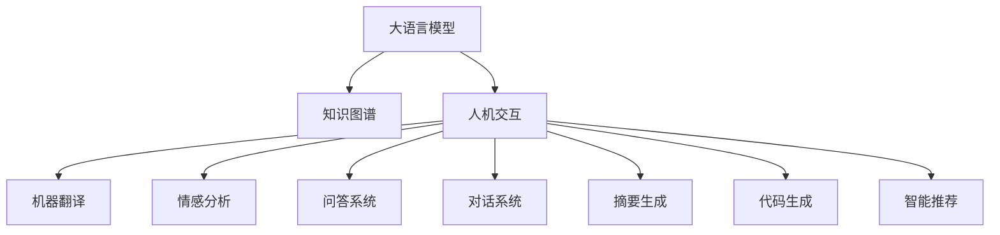

                 

## 1. 背景介绍

### 1.1 问题由来

随着人工智能技术的飞速发展，特别是大语言模型（Large Language Models，LLMs）的兴起，人类与机器协作的方式正在经历一场革命。LLMs已经展现出了在自然语言处理（NLP）、知识获取和推理、生成文本等方面的强大能力，可以辅助甚至在某些任务上取代人类的工作。例如，GPT-3可以在问答系统、摘要生成、代码生成、情感分析等多个领域表现优异，令业界惊叹。

然而，这种技术变革带来了许多挑战。如何确保人工智能助手能够理解人类的真实需求，并提供切实可行的帮助？如何让LLMs更好地融入实际工作流程中，从而最大化其价值？这些问题需要我们深入探讨。本文将从LLM与人类协作的角度，探讨这种新工作模式的特点、应用、挑战及未来发展趋势。

### 1.2 问题核心关键点

当前LLM与人类协作的核心关键点包括：

- 人工智能助手如何在不同场景中理解和适应人类需求，提高沟通效率。
- 如何构建高效的人机交互界面，让用户能够轻松使用LLMs。
- 如何确保LLMs在复杂多变环境中表现稳定，避免误导性输出。
- 如何保护用户隐私和数据安全，确保AI技术在伦理和安全方面的合规性。
- 如何通过持续学习和反馈机制，不断提升AI助手的智能水平。

## 2. 核心概念与联系

### 2.1 核心概念概述

为了更好地理解LLM与人类协作的工作原理和优化方向，本节将介绍几个关键概念及其相互联系：

- **大语言模型**：以自回归（如GPT）或自编码（如BERT）模型为代表的大规模预训练语言模型。通过在大规模无标签文本语料上进行预训练，学习通用的语言表示，具备强大的语言理解和生成能力。

- **知识图谱**：一种结构化知识表示方法，用于描述实体、关系和属性，支持复杂的推理和查询。

- **人机交互**：人类与计算机系统之间的信息交换和互动过程，涉及界面设计、自然语言理解和生成、用户反馈等。

- **机器翻译**：将一种语言的文本转换为另一种语言的文本，是LLM在语言理解上的重要应用。

- **情感分析**：对文本中表达的情感进行识别和分类，常用于舆情监控、用户反馈分析等。

- **问答系统**：回答用户提出的问题，通常采用预训练和微调相结合的方法。

- **对话系统**：与用户进行自然对话，涉及多轮对话管理、意图识别、响应生成等。

- **摘要生成**：对长篇文本进行压缩，提取关键信息，生成简短摘要。

- **代码生成**：根据用户需求生成程序代码，常用于自动化软件开发和代码审查。

- **智能推荐**：根据用户行为和偏好，推荐相关内容，用于电商、娱乐、教育等多个领域。

这些概念之间的逻辑关系可以通过以下Mermaid流程图来展示：



这个流程图展示了大语言模型的核心概念及其与人类协作的应用场景：

1. 大语言模型通过预训练获得基础能力。
2. 知识图谱为模型提供结构化知识，增强推理和生成能力。
3. 人机交互界面负责处理用户输入和输出，提高系统可用性。
4. 机器翻译、情感分析、问答、对话、摘要、代码生成、推荐等多个任务，均可在LLM的基础上进行微调或直接应用。

## 3. 核心算法原理 & 具体操作步骤

### 3.1 算法原理概述

LLM与人类协作的本质是一种多模态信息处理过程。在协作过程中，LLM将接收来自人类的输入信息，进行理解和生成，然后输出结果供人类使用。这一过程包括自然语言处理、知识获取、推理和生成等多个环节。

形式化地，假设LLM在输入文本$X$上的输出为$Y$，则协作过程可以表示为：

$$ Y = f(X; \theta) $$

其中，$f$为LLM的计算函数，$\theta$为模型参数。通过优化$\theta$，使得$Y$尽可能符合人类的需求。

在实际应用中，协作过程往往涉及多个轮次的交互。例如，在问答系统中，用户输入问题$Q$，LLM输出答案$A$，然后用户根据回答反馈进一步提问。在对话系统中，LLM需要处理多轮对话历史，保持对话连贯性和一致性。

### 3.2 算法步骤详解

基于LLM与人类协作的算法步骤，大致可以分为以下几个关键环节：

**Step 1: 输入理解与提取**

- 接收人类输入信息，通常为文本、语音、图像等多模态数据。
- 对输入进行预处理，如分词、去除噪声等。
- 提取关键特征，如词向量、句法结构、上下文信息等。

**Step 2: 模型推理**

- 将提取的特征输入LLM，进行语言理解和推理。
- 在知识图谱的辅助下，进行复杂推理和关系抽取。
- 根据任务类型，输出预测结果，如分类、生成文本、问答等。

**Step 3: 反馈与迭代**

- 接收人类对预测结果的反馈，如修正、确认、追加问题等。
- 根据反馈信息，调整LLM的输出，进行迭代优化。
- 在长期协作中，通过数据积累和模型优化，不断提升智能水平。

### 3.3 算法优缺点

基于LLM与人类协作的算法具有以下优点：

- 强大的语言理解能力：LLM能够处理复杂的自然语言输入，理解语义和上下文。
- 高效的计算能力：深度学习模型的并行计算能力，使得LLM能够在短时间内处理大量数据。
- 丰富的应用场景：LLM可以应用于问答、翻译、对话、摘要、推荐等多个领域，提供多样化的服务。

然而，该算法也存在以下缺点：

- 依赖高质量数据：LLM的效果很大程度上取决于训练数据的质量和多样性，高质量数据的获取成本较高。
- 推理过程中的不确定性：LLM在复杂推理和生成过程中，可能出现推理错误或生成冗余信息。
- 模型风险：LLM的输出可能带有偏见、有害信息，需要仔细设计和验证，确保输出结果的伦理和安全性。
- 数据隐私和安全问题：LLM处理用户数据时，可能存在隐私泄露和数据安全风险。

### 3.4 算法应用领域

基于LLM与人类协作的算法，已经在多个领域得到了广泛应用，例如：

- **智能客服**：使用LLM进行问题识别和回答，提高客服效率和用户体验。
- **智能翻译**：将一种语言的文本翻译成另一种语言，如谷歌翻译、百度翻译等。
- **智能助理**：如Siri、Alexa、小爱同学等，能够进行日程管理、信息查询、娱乐互动等。
- **智能推荐**：如Netflix、Amazon等电商平台，根据用户行为和偏好推荐商品。
- **自然语言处理**：如情感分析、命名实体识别、关系抽取等，广泛应用于舆情监控、客户分析等。
- **语音识别与合成**：如语音助手、智能音箱等，实现语音输入和输出。
- **图像识别**：如医学影像分析、自动驾驶等，辅助人类进行决策。

## 4. 数学模型和公式 & 详细讲解 & 举例说明

### 4.1 数学模型构建

本节将使用数学语言对LLM与人类协作的算法进行更加严格的刻画。

记LLM在输入文本$X$上的输出为$Y$，则协作过程可以表示为：

$$ Y = f(X; \theta) $$

其中，$f$为LLM的计算函数，$\theta$为模型参数。假设LLM的计算函数$f$可以表示为：

$$ f(X; \theta) = \mathcal{H}(\mathcal{E}(X; \omega), \theta) $$

其中，$\mathcal{E}$为编码器函数，将输入$X$编码为隐状态$\mathcal{E}(X; \omega)$；$\mathcal{H}$为解码器函数，根据隐状态和模型参数$\theta$输出结果$Y$。

在实际应用中，$\omega$通常需要与$\theta$进行联合优化，以提高模型的整体性能。例如，在机器翻译任务中，$\omega$可能包括语言模型的参数，而$\theta$可能包括解码器的参数。

### 4.2 公式推导过程

以机器翻译为例，假设输入为源语言文本$X$，输出为目标语言文本$Y$。在LLM与人类协作中，输入$X$首先经过编码器$\mathcal{E}$，得到隐状态$\mathcal{E}(X; \omega)$。然后，将隐状态与模型参数$\theta$一起输入解码器$\mathcal{H}$，输出目标语言文本$Y$。

假设解码器$\mathcal{H}$为Transformer模型，则解码器函数$f$可以表示为：

$$ f(X; \theta) = \mathcal{H}(\mathcal{E}(X; \omega), \theta) = \mathcal{H}([X; \mathcal{E}(X; \omega)]; \theta) $$

其中，$[X; \mathcal{E}(X; \omega)]$表示将源语言文本$X$和隐状态$\mathcal{E}(X; \omega)$拼接在一起，输入解码器。

假设解码器$\mathcal{H}$包含$n$个Transformer层，每层包含$k$个多头注意力机制。则解码器函数$f$可以表示为：

$$ f(X; \theta) = \mathcal{H}([X; \mathcal{E}(X; \omega)]; \theta) = \bigoplus_{i=1}^n \mathcal{H}_i([X; \mathcal{E}(X; \omega)]; \theta_i) $$

其中，$\oplus$表示并行计算。每一层的解码器函数$\mathcal{H}_i$可以表示为：

$$ \mathcal{H}_i([X; \mathcal{E}(X; \omega)]; \theta_i) = \mathcal{M}_i(\mathcal{V}_i(\mathcal{Q}_i(X; \omega), \mathcal{K}_i(X; \omega), \mathcal{V}_i(X; \omega)); \theta_i $$

其中，$\mathcal{Q}_i$、$\mathcal{K}_i$、$\mathcal{V}_i$为多头注意力机制的查询、键、值矩阵。

通过上述公式，我们可以清晰地看到LLM与人类协作的计算过程，以及不同组件在协作中的作用。

### 4.3 案例分析与讲解

以问答系统为例，假设输入为问题$Q$，输出为答案$A$。在LLM与人类协作中，首先对问题$Q$进行预处理，如分词、去除噪声等。然后，将预处理后的文本输入LLM，得到隐状态$\mathcal{E}(Q; \omega)$。接着，将隐状态与模型参数$\theta$一起输入解码器$\mathcal{H}$，输出答案$A$。

假设解码器$\mathcal{H}$为BERT模型，则解码器函数$f$可以表示为：

$$ f(Q; \theta) = \mathcal{H}(\mathcal{E}(Q; \omega), \theta) = \mathcal{H}([Q; \mathcal{E}(Q; \omega)]; \theta) $$

其中，$[Q; \mathcal{E}(Q; \omega)]$表示将问题$Q$和隐状态$\mathcal{E}(Q; \omega)$拼接在一起，输入解码器。

假设解码器$\mathcal{H}$包含$n$个Transformer层，每层包含$k$个多头注意力机制。则解码器函数$f$可以表示为：

$$ f(Q; \theta) = \mathcal{H}([Q; \mathcal{E}(Q; \omega)]; \theta) = \bigoplus_{i=1}^n \mathcal{H}_i([Q; \mathcal{E}(Q; \omega)]; \theta_i) $$

通过上述公式，我们可以清晰地看到LLM与人类协作的计算过程，以及不同组件在协作中的作用。

## 5. 项目实践：代码实例和详细解释说明

### 5.1 开发环境搭建

在进行LLM与人类协作的项目实践前，我们需要准备好开发环境。以下是使用Python进行PyTorch开发的环境配置流程：

1. 安装Anaconda：从官网下载并安装Anaconda，用于创建独立的Python环境。

2. 创建并激活虚拟环境：
```bash
conda create -n llm-env python=3.8 
conda activate llm-env
```

3. 安装PyTorch：根据CUDA版本，从官网获取对应的安装命令。例如：
```bash
conda install pytorch torchvision torchaudio cudatoolkit=11.1 -c pytorch -c conda-forge
```

4. 安装Transformers库：
```bash
pip install transformers
```

5. 安装各类工具包：
```bash
pip install numpy pandas scikit-learn matplotlib tqdm jupyter notebook ipython
```

完成上述步骤后，即可在`llm-env`环境中开始项目实践。

### 5.2 源代码详细实现

下面我们以问答系统为例，给出使用Transformers库对BERT模型进行协作训练的PyTorch代码实现。

首先，定义问答系统任务的数据处理函数：

```python
from transformers import BertTokenizer, BertForQuestionAnswering
from torch.utils.data import Dataset
import torch

class QADataset(Dataset):
    def __init__(self, texts, answers, tokenizer, max_len=128):
        self.texts = texts
        self.answers = answers
        self.tokenizer = tokenizer
        self.max_len = max_len
        
    def __len__(self):
        return len(self.texts)
    
    def __getitem__(self, item):
        text = self.texts[item]
        answer = self.answers[item]
        
        encoding = self.tokenizer(text, return_tensors='pt', max_length=self.max_len, padding='max_length', truncation=True)
        input_ids = encoding['input_ids'][0]
        attention_mask = encoding['attention_mask'][0]
        
        # 对答案进行编码
        answer_tokenized = self.tokenizer(answer, return_tensors='pt')
        answer_ids = answer_tokenized['input_ids'][0]
        answer_mask = answer_tokenized['attention_mask'][0]
        
        return {'input_ids': input_ids, 
                'attention_mask': attention_mask,
                'answer_ids': answer_ids,
                'answer_mask': answer_mask}
```

然后，定义模型和优化器：

```python
from transformers import BertForQuestionAnswering, AdamW

model = BertForQuestionAnswering.from_pretrained('bert-base-cased')
optimizer = AdamW(model.parameters(), lr=2e-5)
```

接着，定义训练和评估函数：

```python
from torch.utils.data import DataLoader
from tqdm import tqdm
from sklearn.metrics import accuracy_score

device = torch.device('cuda') if torch.cuda.is_available() else torch.device('cpu')
model.to(device)

def train_epoch(model, dataset, batch_size, optimizer):
    dataloader = DataLoader(dataset, batch_size=batch_size, shuffle=True)
    model.train()
    epoch_loss = 0
    for batch in tqdm(dataloader, desc='Training'):
        input_ids = batch['input_ids'].to(device)
        attention_mask = batch['attention_mask'].to(device)
        answer_ids = batch['answer_ids'].to(device)
        answer_mask = batch['answer_mask'].to(device)
        model.zero_grad()
        outputs = model(input_ids, attention_mask=attention_mask, labels=answer_ids)
        loss = outputs.loss
        epoch_loss += loss.item()
        loss.backward()
        optimizer.step()
    return epoch_loss / len(dataloader)

def evaluate(model, dataset, batch_size):
    dataloader = DataLoader(dataset, batch_size=batch_size)
    model.eval()
    preds, labels = [], []
    with torch.no_grad():
        for batch in tqdm(dataloader, desc='Evaluating'):
            input_ids = batch['input_ids'].to(device)
            attention_mask = batch['attention_mask'].to(device)
            batch_labels = batch['answer_ids'].to(device)
            batch_labels_mask = batch['answer_mask'].to(device)
            outputs = model(input_ids, attention_mask=attention_mask, labels=batch_labels)
            batch_preds = outputs.logits.argmax(dim=2).to('cpu').tolist()
            batch_labels = batch_labels.to('cpu').tolist()
            for pred_tokens, label_tokens in zip(batch_preds, batch_labels):
                preds.append(pred_tokens[:len(label_tokens)])
                labels.append(label_tokens)
                
    print(accuracy_score(labels, preds))
```

最后，启动训练流程并在验证集上评估：

```python
epochs = 5
batch_size = 16

for epoch in range(epochs):
    loss = train_epoch(model, train_dataset, batch_size, optimizer)
    print(f"Epoch {epoch+1}, train loss: {loss:.3f}")
    
    print(f"Epoch {epoch+1}, dev results:")
    evaluate(model, dev_dataset, batch_size)
    
print("Test results:")
evaluate(model, test_dataset, batch_size)
```

以上就是使用PyTorch对BERT进行协作问答系统的微调训练的完整代码实现。可以看到，得益于Transformers库的强大封装，我们可以用相对简洁的代码完成BERT模型的加载和微调。

### 5.3 代码解读与分析

让我们再详细解读一下关键代码的实现细节：

**QADataset类**：
- `__init__`方法：初始化文本、答案、分词器等关键组件。
- `__len__`方法：返回数据集的样本数量。
- `__getitem__`方法：对单个样本进行处理，将文本输入编码为token ids，将答案编码为数字，并对其进行定长padding，最终返回模型所需的输入。

**模型和优化器**：
- 使用PyTorch的`BertForQuestionAnswering`模型，将BERT应用于问答任务。
- 设置AdamW优化器，调整学习率为2e-5，适用于微调任务。

**训练和评估函数**：
- 使用PyTorch的DataLoader对数据集进行批次化加载，供模型训练和推理使用。
- 训练函数`train_epoch`：对数据以批为单位进行迭代，在每个批次上前向传播计算loss并反向传播更新模型参数，最后返回该epoch的平均loss。
- 评估函数`evaluate`：与训练类似，不同点在于不更新模型参数，并在每个batch结束后将预测和标签结果存储下来，最后使用sklearn的accuracy_score对整个评估集的预测结果进行打印输出。

**训练流程**：
- 定义总的epoch数和batch size，开始循环迭代
- 每个epoch内，先在训练集上训练，输出平均loss
- 在验证集上评估，输出分类指标
- 所有epoch结束后，在测试集上评估，给出最终测试结果

可以看到，PyTorch配合Transformers库使得BERT协作问答系统的微调训练的代码实现变得简洁高效。开发者可以将更多精力放在数据处理、模型改进等高层逻辑上，而不必过多关注底层的实现细节。

当然，工业级的系统实现还需考虑更多因素，如模型的保存和部署、超参数的自动搜索、更灵活的任务适配层等。但核心的协作微调范式基本与此类似。

## 6. 实际应用场景

### 6.1 智能客服系统

基于LLM与人类协作的对话技术，可以广泛应用于智能客服系统的构建。传统客服往往需要配备大量人力，高峰期响应缓慢，且一致性和专业性难以保证。而使用LLM协作的对话模型，可以7x24小时不间断服务，快速响应客户咨询，用自然流畅的语言解答各类常见问题。

在技术实现上，可以收集企业内部的历史客服对话记录，将问题和最佳答复构建成监督数据，在此基础上对预训练对话模型进行协作微调。协作微调后的对话模型能够自动理解用户意图，匹配最合适的答案模板进行回复。对于客户提出的新问题，还可以接入检索系统实时搜索相关内容，动态组织生成回答。如此构建的智能客服系统，能大幅提升客户咨询体验和问题解决效率。

### 6.2 金融舆情监测

金融机构需要实时监测市场舆论动向，以便及时应对负面信息传播，规避金融风险。传统的人工监测方式成本高、效率低，难以应对网络时代海量信息爆发的挑战。基于LLM协作的文本分类和情感分析技术，为金融舆情监测提供了新的解决方案。

具体而言，可以收集金融领域相关的新闻、报道、评论等文本数据，并对其进行主题标注和情感标注。在此基础上对预训练语言模型进行协作微调，使其能够自动判断文本属于何种主题，情感倾向是正面、中性还是负面。将协作微调后的模型应用到实时抓取的网络文本数据，就能够自动监测不同主题下的情感变化趋势，一旦发现负面信息激增等异常情况，系统便会自动预警，帮助金融机构快速应对潜在风险。

### 6.3 个性化推荐系统

当前的推荐系统往往只依赖用户的历史行为数据进行物品推荐，无法深入理解用户的真实兴趣偏好。基于LLM协作的个性化推荐系统可以更好地挖掘用户行为背后的语义信息，从而提供更精准、多样的推荐内容。

在实践中，可以收集用户浏览、点击、评论、分享等行为数据，提取和用户交互的物品标题、描述、标签等文本内容。将文本内容作为模型输入，用户的后续行为（如是否点击、购买等）作为监督信号，在此基础上协作微调预训练语言模型。协作微调后的模型能够从文本内容中准确把握用户的兴趣点。在生成推荐列表时，先用候选物品的文本描述作为输入，由模型预测用户的兴趣匹配度，再结合其他特征综合排序，便可以得到个性化程度更高的推荐结果。

### 6.4 未来应用展望

随着LLM协作技术的不断发展，基于协作微调的方法将在更多领域得到应用，为传统行业带来变革性影响。

在智慧医疗领域，基于协作微调的医疗问答、病历分析、药物研发等应用将提升医疗服务的智能化水平，辅助医生诊疗，加速新药开发进程。

在智能教育领域，协作微调技术可应用于作业批改、学情分析、知识推荐等方面，因材施教，促进教育公平，提高教学质量。

在智慧城市治理中，协作微调模型可应用于城市事件监测、舆情分析、应急指挥等环节，提高城市管理的自动化和智能化水平，构建更安全、高效的未来城市。

此外，在企业生产、社会治理、文娱传媒等众多领域，基于LLM协作的AI应用也将不断涌现，为经济社会发展注入新的动力。相信随着技术的日益成熟，协作微调方法将成为AI落地应用的重要范式，推动AI技术在各个行业的规模化落地。

## 7. 工具和资源推荐

### 7.1 学习资源推荐

为了帮助开发者系统掌握LLM协作的理论基础和实践技巧，这里推荐一些优质的学习资源：

1. 《Transformers from the Inside》系列博文：由LLM技术专家撰写，深入浅出地介绍了Transformer原理、协作技术等前沿话题。

2. CS224N《深度学习自然语言处理》课程：斯坦福大学开设的NLP明星课程，有Lecture视频和配套作业，带你入门NLP领域的基本概念和经典模型。

3. 《Natural Language Processing with Transformers》书籍：Transformers库的作者所著，全面介绍了如何使用Transformers库进行NLP任务开发，包括协作微调在内的诸多范式。

4. HuggingFace官方文档：Transformers库的官方文档，提供了海量预训练模型和完整的协作微调样例代码，是上手实践的必备资料。

5. CLUE开源项目：中文语言理解测评基准，涵盖大量不同类型的中文NLP数据集，并提供了基于协作微调的baseline模型，助力中文NLP技术发展。

通过对这些资源的学习实践，相信你一定能够快速掌握LLM协作的精髓，并用于解决实际的NLP问题。

### 7.2 开发工具推荐

高效的开发离不开优秀的工具支持。以下是几款用于LLM协作开发的常用工具：

1. PyTorch：基于Python的开源深度学习框架，灵活动态的计算图，适合快速迭代研究。大部分预训练语言模型都有PyTorch版本的实现。

2. TensorFlow：由Google主导开发的开源深度学习框架，生产部署方便，适合大规模工程应用。同样有丰富的预训练语言模型资源。

3. Transformers库：HuggingFace开发的NLP工具库，集成了众多SOTA语言模型，支持PyTorch和TensorFlow，是进行协作微调任务开发的利器。

4. Weights & Biases：模型训练的实验跟踪工具，可以记录和可视化模型训练过程中的各项指标，方便对比和调优。与主流深度学习框架无缝集成。

5. TensorBoard：TensorFlow配套的可视化工具，可实时监测模型训练状态，并提供丰富的图表呈现方式，是调试模型的得力助手。

6. Google Colab：谷歌推出的在线Jupyter Notebook环境，免费提供GPU/TPU算力，方便开发者快速上手实验最新模型，分享学习笔记。

合理利用这些工具，可以显著提升LLM协作任务的开发效率，加快创新迭代的步伐。

### 7.3 相关论文推荐

LLM协作技术的发展源于学界的持续研究。以下是几篇奠基性的相关论文，推荐阅读：

1. Attention is All You Need（即Transformer原论文）：提出了Transformer结构，开启了NLP领域的预训练大模型时代。

2. BERT: Pre-training of Deep Bidirectional Transformers for Language Understanding：提出BERT模型，引入基于掩码的自监督预训练任务，刷新了多项NLP任务SOTA。

3. Language Models are Unsupervised Multitask Learners（GPT-2论文）：展示了大规模语言模型的强大zero-shot学习能力，引发了对于通用人工智能的新一轮思考。

4. Parameter-Efficient Transfer Learning for NLP：提出Adapter等参数高效微调方法，在不增加模型参数量的情况下，也能取得不错的协作微调效果。

5. AdaLoRA: Adaptive Low-Rank Adaptation for Parameter-Efficient Fine-Tuning：使用自适应低秩适应的协作微调方法，在参数效率和精度之间取得了新的平衡。

这些论文代表了大语言模型协作微调技术的发展脉络。通过学习这些前沿成果，可以帮助研究者把握学科前进方向，激发更多的创新灵感。

## 8. 总结：未来发展趋势与挑战

### 8.1 总结

本文对基于LLM与人类协作的算法进行了全面系统的介绍。首先阐述了LLM协作技术的研究背景和意义，明确了协作技术在拓展预训练模型应用、提升下游任务性能方面的独特价值。其次，从原理到实践，详细讲解了协作微调的数学原理和关键步骤，给出了协作任务开发的完整代码实例。同时，本文还广泛探讨了协作技术在智能客服、金融舆情、个性化推荐等多个行业领域的应用前景，展示了协作技术的巨大潜力。此外，本文精选了协作技术的各类学习资源，力求为读者提供全方位的技术指引。

通过本文的系统梳理，可以看到，基于LLM协作技术正在成为NLP领域的重要范式，极大地拓展了预训练语言模型的应用边界，催生了更多的落地场景。受益于大规模语料的预训练和协作微调的加持，LLM协作模型以更低的时间和标注成本，在小样本条件下也能取得不俗的效果，有力推动了NLP技术的产业化进程。未来，伴随预训练语言模型和协作微调方法的持续演进，相信NLP技术将在更广阔的应用领域大放异彩，深刻影响人类的生产生活方式。

### 8.2 未来发展趋势

展望未来，LLM协作技术将呈现以下几个发展趋势：

1. 模型规模持续增大。随着算力成本的下降和数据规模的扩张，预训练语言模型的参数量还将持续增长。超大规模语言模型蕴含的丰富语言知识，有望支撑更加复杂多变的下游任务协作。

2. 协作方法日趋多样。除了传统的全参数协作外，未来会涌现更多参数高效的协作方法，如Prefix-Tuning、LoRA等，在节省计算资源的同时也能保证协作精度。

3. 持续学习成为常态。随着数据分布的不断变化，协作模型也需要持续学习新知识以保持性能。如何在不遗忘原有知识的同时，高效吸收新样本信息，将成为重要的研究课题。

4. 标注样本需求降低。受启发于提示学习(Prompt-based Learning)的思路，未来的协作方法将更好地利用大模型的语言理解能力，通过更加巧妙的任务描述，在更少的标注样本上也能实现理想的协作效果。

5. 多模态协作崛起。当前的协作主要聚焦于纯文本数据，未来会进一步拓展到图像、视频、语音等多模态数据协作。多模态信息的融合，将显著提升语言模型对现实世界的理解和建模能力。

6. 模型通用性增强。经过海量数据的预训练和多领域任务的协作，未来的语言模型将具备更强大的常识推理和跨领域迁移能力，逐步迈向通用人工智能(AGI)的目标。

以上趋势凸显了LLM协作技术的广阔前景。这些方向的探索发展，必将进一步提升NLP系统的性能和应用范围，为人类认知智能的进化带来深远影响。

### 8.3 面临的挑战

尽管LLM协作技术已经取得了瞩目成就，但在迈向更加智能化、普适化应用的过程中，它仍面临着诸多挑战：

1. 标注成本瓶颈。虽然协作微调大大降低了标注数据的需求，但对于长尾应用场景，难以获得充足的高质量标注数据，成为制约协作性能的瓶颈。如何进一步降低协作对标注样本的依赖，将是一大难题。

2. 模型鲁棒性不足。当前协作模型面对域外数据时，泛化性能往往大打折扣。对于测试样本的微小扰动，协作模型的预测也容易发生波动。如何提高协作模型的鲁棒性，避免灾难性遗忘，还需要更多理论和实践的积累。

3. 推理效率有待提高。大规模语言模型虽然精度高，但在实际部署时往往面临推理速度慢、内存占用大等效率问题。如何在保证性能的同时，简化模型结构，提升推理速度，优化资源占用，将是重要的优化方向。

4. 可解释性亟需加强。当前协作模型更像是"黑盒"系统，难以解释其内部工作机制和决策逻辑。对于医疗、金融等高风险应用，算法的可解释性和可审计性尤为重要。如何赋予协作模型更强的可解释性，将是亟待攻克的难题。

5. 安全性有待保障。预训练语言模型难免会学习到有偏见、有害的信息，通过协作传递到下游任务，产生误导性、歧视性的输出，给实际应用带来安全隐患。如何从数据和算法层面消除模型偏见，避免恶意用途，确保输出的安全性，也将是重要的研究课题。

6. 知识整合能力不足。现有的协作模型往往局限于任务内数据，难以灵活吸收和运用更广泛的先验知识。如何让协作过程更好地与外部知识库、规则库等专家知识结合，形成更加全面、准确的信息整合能力，还有很大的想象空间。

正视协作面临的这些挑战，积极应对并寻求突破，将是大语言模型协作技术走向成熟的必由之路。相信随着学界和产业界的共同努力，这些挑战终将一一被克服，LLM协作技术必将在构建人机协同的智能时代中扮演越来越重要的角色。

### 8.4 未来突破

面对LLM协作所面临的种种挑战，未来的研究需要在以下几个方面寻求新的突破：

1. 探索无监督和半监督协作方法。摆脱对大规模标注数据的依赖，利用自监督学习、主动学习等无监督和半监督范式，最大限度利用非结构化数据，实现更加灵活高效的协作。

2. 研究参数高效和计算高效的协作范式。开发更加参数高效的协作方法，在固定大部分预训练参数的同时，只更新极少量的任务相关参数。同时优化协作模型的计算图，减少前向传播和反向传播的资源消耗，实现更加轻量级、实时性的部署。

3. 融合因果和对比学习范式。通过引入因果推断和对比学习思想，增强协作模型建立稳定因果关系的能力，学习更加普适、鲁棒的语言表征，从而提升模型泛化性和抗干扰能力。

4. 引入更多先验知识。将符号化的先验知识，如知识图谱、逻辑规则等，与神经网络模型进行巧妙融合，引导协作过程学习更准确、合理的语言模型。同时加强不同模态数据的整合，实现视觉、语音等多模态信息与文本信息的协同建模。

5. 结合因果分析和博弈论工具。将因果分析方法引入协作模型，识别出模型决策的关键特征，增强输出解释的因果性和逻辑性。借助博弈论工具刻画人机交互过程，主动探索并规避模型的脆弱点，提高系统稳定性。

6. 纳入伦理道德约束。在模型训练目标中引入伦理导向的评估指标，过滤和惩罚有偏见、有害的输出倾向。同时加强人工干预和审核，建立模型行为的监管机制，确保输出符合人类价值观和伦理道德。

这些研究方向的探索，必将引领LLM协作技术迈向更高的台阶，为构建安全、可靠、可解释、可控的智能系统铺平道路。面向未来，LLM协作技术还需要与其他人工智能技术进行更深入的融合，如知识表示、因果推理、强化学习等，多路径协同发力，共同推动自然语言理解和智能交互系统的进步。只有勇于创新、敢于突破，才能不断拓展语言模型的边界，让智能技术更好地造福人类社会。

## 9. 附录：常见问题与解答

**Q1：LLM协作过程中如何处理用户输入的不确定性？**

A: 用户输入的不确定性是协作过程中不可避免的问题。为了提高系统鲁棒性和用户满意度，可以采取以下措施：
1. 用户输入验证：对输入进行格式、语义等方面的验证，确保输入的有效性和合法性。
2. 上下文理解：利用上下文信息，对用户意图进行推断和修正，减少歧义和误解。
3. 多轮对话管理：在多轮对话中保持对话连贯性和一致性，通过对话历史记录辅助理解。
4. 自然语言理解：利用先进的自然语言理解技术，提高系统对用户输入的理解能力。
5. 异常处理：在遇到异常输入或错误提示时，提供友好的反馈和引导，让用户能够纠正输入。

通过以上措施，可以显著提升LLM协作系统的鲁棒性和用户满意度。

**Q2：LLM协作中如何保证输出结果的准确性和可靠性？**

A: 保证LLM协作输出结果的准确性和可靠性，需要从数据、模型和算法等多个方面进行优化。具体措施包括：
1. 数据清洗和标注：确保训练数据的准确性和多样性，避免数据偏见和噪声。
2. 模型优化：采用参数高效的协作方法，如Adapter、Prefix等，减少过拟合风险。同时进行超参数调优，找到最佳的模型配置。
3. 反馈机制：建立有效的反馈和迭代机制，根据用户反馈不断优化模型和算法。
4. 多模型集成：训练多个协作模型，取平均输出，减少单一模型的错误率。
5. 知识库集成：将外部知识库和规则库与协作模型结合，提高系统的常识推理和知识抽取能力。

通过以上措施，可以有效提升LLM协作系统的准确性和可靠性，为用户提供更加精准和可靠的服务。

**Q3：LLM协作模型在应用中如何保护用户隐私和数据安全？**

A: 保护用户隐私和数据安全是LLM协作模型应用中的重要问题。以下是一些关键措施：
1. 数据脱敏：对用户数据进行匿名化和脱敏处理，防止数据泄露。
2. 数据加密：在数据传输和存储过程中，采用加密技术保护用户隐私。
3. 访问控制：设置严格的访问权限，防止未经授权的访问和数据滥用。
4. 审计和监控：对系统进行定期的审计和监控，及时发现和应对安全漏洞。
5. 合规性保障：确保系统的设计和应用符合相关的隐私和数据保护法律法规。

通过以上措施，可以有效保护用户隐私和数据安全，确保LLM协作系统的合规性和可靠性。

**Q4：LLM协作模型在实际应用中如何优化推理速度？**

A: 优化LLM协作模型的推理速度，可以从多个方面进行：
1. 模型裁剪：去除不必要的层和参数，减小模型尺寸，加快推理速度。
2. 量化加速：将浮点模型转为定点模型，压缩存储空间，提高计算效率。
3. 硬件加速：利用GPU/TPU等高性能设备进行推理加速，提高计算能力。
4. 分布式计算：利用分布式计算框架，如Dask、Ray等，加速大规模模型的推理。
5. 算法优化：优化推理算法，如剪枝、蒸馏等，提高推理效率。

通过以上措施，可以有效提升LLM协作模型的推理速度，满足实际应用的需求。

**Q5：LLM协作模型在实际应用中如何增强可解释性？**

A: 增强LLM协作模型的可解释性，可以从以下几个方面进行：
1. 特征可视化：对模型内部的特征进行可视化，帮助理解模型的推理过程。
2. 模型推理链：记录和展示模型的推理链，解释模型的决策依据。
3. 解释性模型：采用可解释性强的模型结构，如线性回归、决策树等，增强模型的可解释性。
4. 用户反馈：收集用户对模型输出的反馈，分析模型的推理错误和不足，进行改进。
5. 多模型解释：结合多种解释方法，如文本解释、图像解释等，提供多角度的解释。

通过以上措施，可以有效增强LLM协作模型的可解释性，提升系统的透明度和用户信任度。

---

作者：禅与计算机程序设计艺术 / Zen and the Art of Computer Programming

