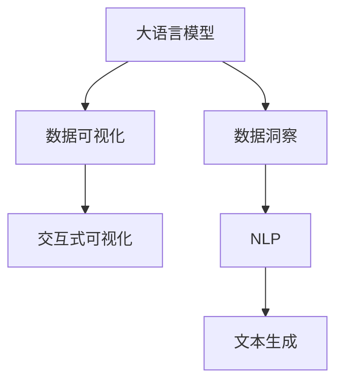

                 

# LLM与传统数据可视化技术的结合：数据洞察新方式

> 关键词：大语言模型,数据可视化,数据洞察,交互式可视化,数据探索

## 1. 背景介绍

### 1.1 问题由来
大数据时代的来临，数据量呈现出爆炸式增长，企业、研究机构需要从海量数据中提取关键信息、洞察趋势，以做出更加精准的决策。然而，数据量巨大且结构复杂，仅凭人力难以在海量数据中发现规律和洞见。如何高效地进行数据探索和洞察，成为摆在当前数据科学家面前的一大挑战。

### 1.2 问题核心关键点
数据可视化（Data Visualization）技术作为一种有效的数据展现手段，能够在交互式图表、动态图、信息图表等多种形式下，直观展现数据分布、变化规律、关系网络等信息，帮助用户快速理解和发现数据中的规律和洞见。然而，传统数据可视化往往依赖于结构化数据，对于非结构化数据的处理能力有限。

近年来，随着大语言模型（Large Language Models, LLMs）的快速发展，其在自然语言处理（Natural Language Processing, NLP）、文本生成等领域已展现出强大能力。利用大语言模型的强大语义理解和生成能力，可以结合传统数据可视化技术，构建出更加智能化、交互式的可视化应用，实现从海量数据中提取关键洞察的目的。

### 1.3 问题研究意义
结合大语言模型与传统数据可视化技术，可以构建出智能化的数据洞察工具，帮助用户快速高效地从复杂数据中提取有价值的信息。这种结合可以提升数据探索的效率，促进数据驱动决策的实施，并在数据分析、智能应用、科学计算等领域带来革命性的影响。

本文聚焦于大语言模型与传统数据可视化的结合，旨在探讨如何将大语言模型的语言生成能力，与传统数据可视化技术相结合，以实现对非结构化数据的智能化探索与洞察。

## 2. 核心概念与联系

### 2.1 核心概念概述

为更好地理解本文讨论的技术原理和实现方法，本节将介绍几个关键概念：

- **大语言模型(Large Language Models, LLMs)**：指能够理解并生成自然语言文本的深度学习模型，如GPT、BERT等。通过大规模语料预训练，LLMs学习到了丰富的语言知识和常识，具备强大的自然语言处理能力。

- **数据可视化(Data Visualization)**：指将数据通过图表、动画等形式直观展现的技术，帮助用户快速理解数据特征和规律。常见的可视化方式包括散点图、条形图、热力图等。

- **数据洞察(Data Insights)**：指通过数据探索和分析，从数据中提取出具有实际意义和价值的信息。数据洞察是数据分析的重要目标，有助于决策制定和知识发现。

- **交互式可视化(Interactive Visualization)**：指可交互的可视化界面，用户可以通过鼠标操作、滑动等方式，动态查看数据变化和趋势，增强数据分析的体验。

- **自然语言处理(Natural Language Processing, NLP)**：指使用计算机对人类语言进行处理的技术，包括文本分类、情感分析、机器翻译等。

这些概念之间的逻辑关系可以通过以下Mermaid流程图来展示：



这个流程图展示了各个概念之间的联系：

1. 大语言模型通过预训练获得强大的语言理解能力，能生成具有语义意义的文本。
2. 数据可视化通过图表、动画等形式展现数据，帮助用户理解数据特征。
3. 数据洞察通过分析数据，提取有价值的信息和规律。
4. 交互式可视化通过动态交互方式，增强数据分析体验。
5. 自然语言处理涉及文本生成、分类、情感分析等任务，与大语言模型结合生成描述性文本。

## 3. 核心算法原理 & 具体操作步骤
### 3.1 算法原理概述

结合大语言模型与传统数据可视化的核心算法原理，是将大语言模型的语义理解能力和生成能力，与传统数据可视化的展现形式相结合，构建出能够自动生成描述性文本的交互式可视化应用。

具体而言，包括以下步骤：

1. **数据预处理**：对输入数据进行清洗、转换、聚合等预处理，生成适合数据可视化的形式。

2. **数据探索**：利用数据可视化技术对数据进行初步探索，发现数据中的关键特征和规律。

3. **自然语言生成**：将数据探索结果转化为自然语言文本，描述数据中的关键洞察。

4. **可视化展示**：将生成的自然语言文本在可视化界面中进行展示，支持用户交互。

5. **用户反馈**：用户通过交互界面对展示的文本和可视化结果进行反馈，进一步优化生成文本和可视化形式。

### 3.2 算法步骤详解

结合大语言模型与传统数据可视化的具体操作步骤如下：

**Step 1: 数据预处理**
- 对输入数据进行清洗、转换、聚合等预处理，生成适合数据可视化的形式。如将文本数据转化为数值数据，进行归一化、标准化等处理。

**Step 2: 数据探索**
- 利用数据可视化技术对数据进行初步探索，发现数据中的关键特征和规律。可以使用散点图、热力图、箱线图等常见形式，探索数据分布、趋势、异常值等。

**Step 3: 自然语言生成**
- 利用大语言模型对数据探索结果进行语义描述，生成自然语言文本。如使用GPT-3等模型，根据可视化结果生成描述性文本。

**Step 4: 可视化展示**
- 将生成的自然语言文本在可视化界面中进行展示，支持用户交互。可以采用拖放、滑动、点击等方式，动态调整可视化界面和生成文本。

**Step 5: 用户反馈**
- 用户通过交互界面对展示的文本和可视化结果进行反馈，进一步优化生成文本和可视化形式。

### 3.3 算法优缺点

结合大语言模型与传统数据可视化的算法，具有以下优点：

1. **高效性**：自动化数据探索和描述性文本生成，显著提升数据洞察的效率。
2. **互动性**：用户通过交互界面，可以动态调整数据探索和文本生成，提升数据分析体验。
3. **准确性**：大语言模型生成文本的准确性和语义丰富性，有助于提取关键洞见。
4. **可扩展性**：结合不同数据类型和应用场景，可以灵活应用到各种数据分析任务中。

同时，该方法也存在一些缺点：

1. **依赖大模型**：需要大语言模型的支持，预训练模型需满足高质量、泛化能力强的要求。
2. **复杂性**：系统集成难度较大，涉及数据预处理、模型生成、可视化展示等多个环节。
3. **语义理解限制**：大语言模型生成的文本可能出现语义模糊或错误，影响洞察结果的准确性。
4. **交互界面设计**：用户交互界面的复杂度与可用性，需进行精心设计和优化。

### 3.4 算法应用领域

结合大语言模型与传统数据可视化技术的算法，已成功应用于多个领域，包括但不限于：

1. **金融分析**：通过可视化展示股票市场数据、交易记录等，结合自然语言生成，提取市场趋势和投资策略。
2. **市场营销**：将消费者行为数据可视化，生成描述性文本，帮助市场团队洞察客户需求和产品偏好。
3. **科学计算**：对科研数据进行可视化展示，生成科学论文和报告，帮助科研人员发现研究规律。
4. **健康医疗**：利用医疗数据可视化，结合自然语言生成，描述疾病特征和治疗方法，辅助医生诊断。
5. **智能制造**：将制造流程数据可视化，生成生产报告和优化建议，提升生产效率和质量。

## 4. 数学模型和公式 & 详细讲解 & 举例说明

### 4.1 数学模型构建

本节将使用数学语言对结合大语言模型与传统数据可视化的过程进行严格的数学建模。

记输入数据集为 $D=\{(x_i,y_i)\}_{i=1}^N$，其中 $x_i$ 为数值数据，$y_i$ 为文本描述。设大语言模型的参数为 $\theta$，自然语言生成的模型为 $P(w|c)$，其中 $w$ 为生成的文本，$c$ 为可视化结果。目标函数为最大化文本生成和可视化展示的匹配度：

$$
\max_{\theta} \prod_{i=1}^N P(y_i|c_i)
$$

其中 $c_i$ 为数据点 $x_i$ 对应的可视化结果。

### 4.2 公式推导过程

以下我们以股票市场数据分析为例，推导生成自然语言文本的公式。

假设股市每天的收盘价 $P_t$ 记录为一个时间序列 $D_t=\{P_t^1, P_t^2, ..., P_t^N\}$，通过可视化技术，得到每天的涨跌幅度 $A_t=\{A_t^1, A_t^2, ..., A_t^N\}$。

对于某天的可视化结果 $c_t$，自然语言生成的目标函数为：

$$
\max_{\theta} \log P(A_t|c_t)
$$

其中 $A_t$ 为涨跌幅度，$c_t$ 为可视化结果。自然语言生成的目标是对 $A_t$ 生成描述性文本，如“今天股市下跌2%”。

自然语言生成的过程可以表示为：

$$
P(A_t|c_t) = \prod_{i=1}^N P(A_t^i|c_t)
$$

其中 $P(A_t^i|c_t)$ 表示在可视化结果 $c_t$ 下，生成描述 $A_t^i$ 的概率。

结合生成模型和可视化结果，最终的优化目标为：

$$
\max_{\theta} \sum_{i=1}^N \log P(A_t^i|c_t)
$$

在实际应用中，可以使用如GPT-3等大语言模型，通过训练学习 $P(A_t|c_t)$ 的映射关系，从而实现自然语言生成。

### 4.3 案例分析与讲解

在金融分析应用中，可以通过可视化展示股票市场数据，结合自然语言生成，帮助分析师快速了解市场趋势和关键洞见。

具体步骤如下：

1. 对每日股票市场数据进行清洗和转换，生成可视化图表，展示股价变化和交易量。

2. 利用大语言模型生成描述性文本，如“本周股市整体下跌2%”。

3. 将文本与可视化结果结合，展示在交互式界面中，支持用户交互调整可视化形式和生成文本。

通过这种结合方式，可以大大提升金融数据分析的效率和准确性，帮助分析师及时发现市场动向，做出投资决策。

## 5. 项目实践：代码实例和详细解释说明

### 5.1 开发环境搭建

在进行结合大语言模型与传统数据可视化的实践前，我们需要准备好开发环境。以下是使用Python进行PyTorch开发的环境配置流程：

1. 安装Anaconda：从官网下载并安装Anaconda，用于创建独立的Python环境。

2. 创建并激活虚拟环境：
```bash
conda create -n pytorch-env python=3.8 
conda activate pytorch-env
```

3. 安装PyTorch：根据CUDA版本，从官网获取对应的安装命令。例如：
```bash
conda install pytorch torchvision torchaudio cudatoolkit=11.1 -c pytorch -c conda-forge
```

4. 安装Natural Language Toolkit：
```bash
pip install nltk
```

5. 安装TensorFlow：
```bash
pip install tensorflow
```

6. 安装Pandas和Matplotlib：
```bash
pip install pandas matplotlib
```

7. 安装plotly：
```bash
pip install plotly
```

完成上述步骤后，即可在`pytorch-env`环境中开始结合大语言模型与传统数据可视化的实践。

### 5.2 源代码详细实现

下面我们以股票市场数据分析为例，给出使用PyTorch和plotly进行结合大语言模型与传统数据可视化的Python代码实现。

```python
import torch
import pandas as pd
import matplotlib.pyplot as plt
import plotly.express as px
from transformers import GPT3LMHeadModel, GPT3Tokenizer

# 加载数据
data = pd.read_csv('stock_data.csv')

# 数据预处理
data['close_price'] = data['close_price'].astype(float)
data['change'] = data['close_price'].pct_change()

# 数据探索
fig = px.line(data, x='date', y='close_price', title='Stock Price Trend')
fig.show()

# 自然语言生成
tokenizer = GPT3Tokenizer.from_pretrained('gpt3')
model = GPT3LMHeadModel.from_pretrained('gpt3', output_attentions=True)

input_ids = tokenizer.encode("本周股市整体下跌2%")
attention_mask = [1] * len(input_ids)
output = model.generate(input_ids=input_ids, attention_mask=attention_mask, max_length=32, num_return_sequences=1)
description = tokenizer.decode(output[0])

# 可视化展示
fig.add_annotation(
    text=description,
    xref='paper', yref='paper', x=0.5, y=0.5,
    showarrow=False
)
fig.show()
```

### 5.3 代码解读与分析

让我们再详细解读一下关键代码的实现细节：

**数据预处理**：
- 加载股票市场数据，并进行清洗和转换。将收盘价转换为数值类型，计算每天的涨跌幅度。

**数据探索**：
- 使用plotly生成股价变化的折线图，展示市场趋势。

**自然语言生成**：
- 使用GPT3生成描述性文本，描述市场的整体变化情况。

**可视化展示**：
- 将生成文本作为注释，添加到折线图中，展示在交互式界面中。

可以看到，通过这种结合方式，可以构建出智能化的数据洞察工具，帮助用户快速高效地从复杂数据中提取有价值的信息。

## 6. 实际应用场景

### 6.1 金融分析

在金融分析中，通过可视化展示股票市场数据，结合自然语言生成，可以显著提升数据洞察的效率和准确性。

具体而言，可以收集金融市场的历史交易记录、股价变化等数据，通过可视化技术，生成趋势图、波动图等形式，帮助分析师快速理解市场动态。同时，利用大语言模型生成描述性文本，描述市场整体趋势、热点事件等关键洞见。将文本与可视化结果结合，展示在交互式界面中，支持用户交互调整，进一步提升数据分析体验。

### 6.2 市场营销

在市场营销中，通过可视化展示消费者行为数据，结合自然语言生成，可以洞察客户需求和产品偏好，辅助制定营销策略。

具体而言，可以收集消费者在社交媒体上的行为数据，如点赞、评论、分享等，通过可视化技术，生成用户行为分布图、趋势图等形式。同时，利用大语言模型生成描述性文本，描述用户的兴趣点、消费偏好等。将文本与可视化结果结合，展示在交互式界面中，支持用户交互调整，提升市场营销的精准性和效率。

### 6.3 科学计算

在科学计算中，通过可视化展示科研数据，结合自然语言生成，可以辅助科研人员发现研究规律，提升科研效率。

具体而言，可以收集科研实验数据，如实验结果、统计数据等，通过可视化技术，生成数据分布图、趋势图等形式。同时，利用大语言模型生成描述性文本，描述实验结果、研究趋势等。将文本与可视化结果结合，展示在交互式界面中，支持用户交互调整，提升科研分析的准确性和深度。

### 6.4 未来应用展望

随着大语言模型和数据可视化技术的不断发展，结合两者的方法将在更多领域得到应用，带来革命性的影响。

1. **智慧城市治理**：结合大语言模型与城市数据分析，可以提升城市管理的自动化和智能化水平，构建更安全、高效的未来城市。
2. **智能制造**：利用大语言模型对制造流程数据进行自然语言生成，生成生产报告和优化建议，提升生产效率和质量。
3. **智能医疗**：结合大语言模型与医疗数据分析，生成医疗报告和诊断建议，辅助医生诊断和治疗。
4. **智能教育**：通过可视化展示学习数据，结合自然语言生成，帮助教师和学生发现学习规律和改进方法，提升教育质量。

## 7. 工具和资源推荐

### 7.1 学习资源推荐

为了帮助开发者系统掌握结合大语言模型与传统数据可视化的技术原理和实践技巧，这里推荐一些优质的学习资源：

1. 《数据可视化实战指南》系列博文：由数据可视化专家撰写，深入浅出地介绍了数据可视化技术的基本原理和实现方法。

2. 《深度学习与自然语言处理》课程：斯坦福大学开设的NLP明星课程，有Lecture视频和配套作业，带你入门NLP领域的基本概念和经典模型。

3. 《Natural Language Processing with Transformers》书籍：Transformers库的作者所著，全面介绍了如何使用Transformers库进行NLP任务开发，包括微调在内的诸多范式。

4. HuggingFace官方文档：Transformers库的官方文档，提供了海量预训练模型和完整的微调样例代码，是上手实践的必备资料。

5. Kaggle：数据科学和机器学习竞赛平台，提供大量数据集和实战案例，帮助你快速掌握数据可视化和自然语言处理技能。

通过对这些资源的学习实践，相信你一定能够快速掌握结合大语言模型与传统数据可视化的精髓，并用于解决实际的NLP问题。

### 7.2 开发工具推荐

高效的开发离不开优秀的工具支持。以下是几款用于结合大语言模型与传统数据可视化的常用工具：

1. PyTorch：基于Python的开源深度学习框架，灵活动态的计算图，适合快速迭代研究。大部分预训练语言模型都有PyTorch版本的实现。

2. TensorFlow：由Google主导开发的开源深度学习框架，生产部署方便，适合大规模工程应用。同样有丰富的预训练语言模型资源。

3. plotly：可视化工具库，支持多种交互式图表形式，方便数据展示和分析。

4. Weights & Biases：模型训练的实验跟踪工具，可以记录和可视化模型训练过程中的各项指标，方便对比和调优。与主流深度学习框架无缝集成。

5. Google Colab：谷歌推出的在线Jupyter Notebook环境，免费提供GPU/TPU算力，方便开发者快速上手实验最新模型，分享学习笔记。

合理利用这些工具，可以显著提升结合大语言模型与传统数据可视化的开发效率，加快创新迭代的步伐。

### 7.3 相关论文推荐

结合大语言模型与传统数据可视化的研究源于学界的持续研究。以下是几篇奠基性的相关论文，推荐阅读：

1. "Visualization as a Tool for Exploratory Data Analysis"（期刊文章）：介绍数据可视化技术在探索性数据分析中的重要作用。

2. "Textual Data Visualization with GPT-3"（会议论文）：展示利用GPT-3生成文本描述，结合可视化技术展示数据的案例。

3. "Data Storytelling with Large Language Models"（期刊文章）：探讨利用大语言模型生成描述性文本，结合可视化技术进行数据解释和传播的方法。

4. "Natural Language Generation for Data Visualization"（会议论文）：研究大语言模型在生成自然语言文本方面的应用，提升数据可视化的互动性和可解释性。

5. "Leveraging Large Language Models for Data Exploration"（会议论文）：探讨结合大语言模型与传统数据可视化技术，提升数据探索效率和准确性的方法。

这些论文代表了大语言模型与数据可视化结合技术的发展脉络。通过学习这些前沿成果，可以帮助研究者把握学科前进方向，激发更多的创新灵感。

## 8. 总结：未来发展趋势与挑战

### 8.1 总结

本文对结合大语言模型与传统数据可视化的技术进行了全面系统的介绍。首先阐述了结合大语言模型与传统数据可视化的研究背景和意义，明确了这一技术在提升数据分析效率和质量方面的独特价值。其次，从原理到实践，详细讲解了结合大语言模型与传统数据可视化的数学原理和实现方法，给出了结合大语言模型与传统数据可视化的完整代码实例。同时，本文还广泛探讨了这一技术在金融分析、市场营销、科学计算等多个领域的应用前景，展示了其广阔的潜力。

通过本文的系统梳理，可以看到，结合大语言模型与传统数据可视化技术，正在成为数据探索和洞察的重要手段，大幅提升了数据分析的效率和准确性，为决策制定和知识发现带来了新的可能性。

### 8.2 未来发展趋势

展望未来，结合大语言模型与传统数据可视化的技术将呈现以下几个发展趋势：

1. **自动化程度提升**：未来，结合大语言模型与数据可视化的自动化水平将进一步提升，实现从数据预处理到结果生成的一体化自动化，减少人工干预，提高分析效率。

2. **可视化形式丰富**：结合大语言模型与数据可视化技术的结合方式将更加多样化，支持更多形式的交互式可视化展示，提升用户体验。

3. **跨领域应用拓展**：随着技术的不断进步，结合大语言模型与数据可视化技术将在更多领域得到应用，如智慧城市治理、智能医疗、智能制造等，为这些领域的智能化升级带来新的可能性。

4. **增强可解释性**：未来，结合大语言模型与数据可视化的系统将更加注重模型的可解释性，通过自然语言生成技术，提升系统输出的可解释性和可审计性。

5. **提升实时性**：结合大语言模型与数据可视化的系统将更加注重实时性，通过优化数据处理和可视化展示的效率，实现更加快速和灵活的数据探索。

这些趋势凸显了结合大语言模型与数据可视化技术的广阔前景。这些方向的探索发展，将进一步提升数据分析的效率和质量，为更多领域带来智能化升级。

### 8.3 面临的挑战

尽管结合大语言模型与数据可视化技术已取得诸多进展，但在迈向更加智能化、普适化应用的过程中，仍面临诸多挑战：

1. **数据隐私和安全**：结合大语言模型与数据可视化技术的系统涉及大量敏感数据，如何保护数据隐私和安全是一个重要问题。

2. **模型性能提升**：大语言模型生成的文本质量和准确性，对系统的整体性能影响较大，需要进一步提升模型的质量和泛化能力。

3. **交互界面设计**：用户交互界面的复杂度与可用性，需要精心设计和优化，才能提升用户的使用体验。

4. **数据预处理复杂度**：不同数据类型和格式的处理复杂度较高，需要更加自动化和智能化的预处理机制。

5. **计算资源消耗**：结合大语言模型与数据可视化技术的应用，对计算资源消耗较大，需要进一步优化系统性能。

正视这些挑战，积极应对并寻求突破，将是大语言模型与数据可视化技术走向成熟的必由之路。相信随着学界和产业界的共同努力，这些挑战终将一一被克服，结合大语言模型与数据可视化技术必将在构建人机协同的智能时代中扮演越来越重要的角色。

### 8.4 研究展望

面向未来，结合大语言模型与数据可视化技术的研究方向需要进一步拓展，以应对更多的应用需求和挑战：

1. **融合更多模态数据**：结合大语言模型与数据可视化技术，支持图像、视频、音频等多模态数据的处理和展示，提升系统的多模态融合能力。

2. **引入更多先验知识**：将符号化的先验知识，如知识图谱、逻辑规则等，与自然语言生成结合，提升系统输出的准确性和全面性。

3. **增强自动化水平**：开发更加自动化和智能化的数据预处理和可视化展示机制，减少人工干预，提升系统效率。

4. **优化实时性**：通过优化数据处理和可视化展示的效率，提升系统的实时性和响应速度，满足用户的实时分析需求。

5. **提高安全性**：引入数据加密、访问控制等机制，确保系统的数据安全和隐私保护。

6. **增强可解释性**：通过自然语言生成技术，提升系统输出的可解释性和可审计性，增强系统的可信度。

这些研究方向将进一步推动结合大语言模型与数据可视化技术的发展，为构建更加智能化、普适化的数据洞察工具奠定坚实基础。

## 9. 附录：常见问题与解答

**Q1：结合大语言模型与数据可视化技术在实际应用中需要注意哪些问题？**

A: 结合大语言模型与数据可视化技术在实际应用中需要注意以下问题：

1. 数据隐私和安全：结合大语言模型与数据可视化技术的系统涉及大量敏感数据，需要采取严格的隐私保护措施，如数据加密、访问控制等。

2. 模型性能提升：大语言模型生成的文本质量和准确性，对系统的整体性能影响较大，需要进一步提升模型的质量和泛化能力。

3. 交互界面设计：用户交互界面的复杂度与可用性，需要精心设计和优化，才能提升用户的使用体验。

4. 数据预处理复杂度：不同数据类型和格式的处理复杂度较高，需要更加自动化和智能化的预处理机制。

5. 计算资源消耗：结合大语言模型与数据可视化技术的应用，对计算资源消耗较大，需要进一步优化系统性能。

**Q2：如何提升结合大语言模型与数据可视化技术的性能？**

A: 提升结合大语言模型与数据可视化技术的性能，可以从以下几个方面进行：

1. 优化模型结构：优化大语言模型的结构，提升模型的泛化能力和性能。

2. 提升数据预处理效率：采用自动化和智能化的数据预处理机制，减少人工干预，提升数据处理效率。

3. 改进可视化算法：优化可视化算法的性能，提升可视化的实时性和交互性。

4. 引入更多先验知识：将符号化的先验知识，如知识图谱、逻辑规则等，与自然语言生成结合，提升系统输出的准确性和全面性。

5. 增强系统可解释性：通过自然语言生成技术，提升系统输出的可解释性和可审计性，增强系统的可信度。

**Q3：结合大语言模型与数据可视化技术的应用前景如何？**

A: 结合大语言模型与数据可视化技术的应用前景非常广阔，可以应用于多个领域：

1. 金融分析：通过可视化展示股票市场数据，结合自然语言生成，提升数据分析效率和准确性。

2. 市场营销：通过可视化展示消费者行为数据，结合自然语言生成，洞察客户需求和产品偏好，辅助制定营销策略。

3. 科学计算：通过可视化展示科研数据，结合自然语言生成，辅助科研人员发现研究规律，提升科研效率。

4. 智慧城市治理：结合大语言模型与城市数据分析，提升城市管理的自动化和智能化水平，构建更安全、高效的未来城市。

5. 智能制造：利用大语言模型对制造流程数据进行自然语言生成，生成生产报告和优化建议，提升生产效率和质量。

6. 智能医疗：结合大语言模型与医疗数据分析，生成医疗报告和诊断建议，辅助医生诊断和治疗。

7. 智能教育：通过可视化展示学习数据，结合自然语言生成，帮助教师和学生发现学习规律和改进方法，提升教育质量。

总之，结合大语言模型与数据可视化技术的结合方式，可以提升多个领域的智能化水平，带来革命性的影响。

---

作者：禅与计算机程序设计艺术 / Zen and the Art of Computer Programming

