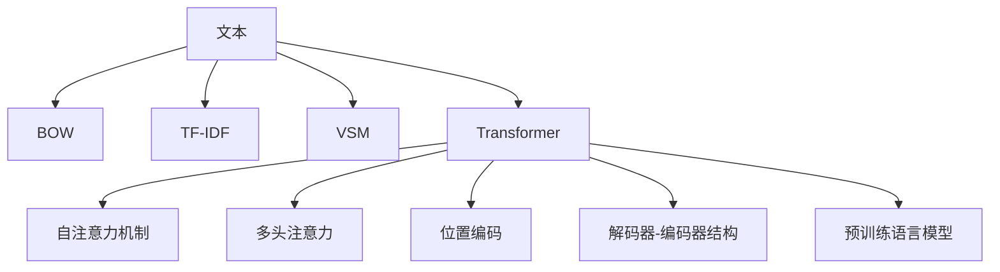

                 

# LLM与传统文本聚类方法的对比

> 关键词：文本聚类,语言模型,Transformer,BOW,TF-IDF,向量空间模型

## 1. 背景介绍

文本聚类作为文本挖掘领域的一项经典技术，旨在将文本数据按照相似度进行自动分组。传统的文本聚类方法多基于统计特征构建模型，难以直接处理自然语言的复杂结构和语义信息。近年来，随着深度学习技术的发展，利用语言模型进行文本聚类成为了研究的热点。本文将对比大语言模型（Large Language Models, LLMs）与传统文本聚类方法（如BOW、TF-IDF、VSM等），探讨两者的优势和局限，并展望未来发展方向。

## 2. 核心概念与联系

### 2.1 核心概念概述

为更好地理解文本聚类技术，首先需要了解相关的核心概念：

- **文本聚类**：将文本数据根据相似度分为若干组，便于后续分析和处理。文本聚类广泛应用于信息检索、主题分析、文档分类等领域。

- **语言模型**：一种用来描述语言的概率模型，衡量一个词序列出现的概率。语言模型可以用于文本分类、信息检索、机器翻译、文本生成等任务。

- **Transformer**：一种自注意力机制的网络结构，广泛应用于深度学习中的自然语言处理任务。Transformer模型具有卓越的序列建模能力和并行计算效率。

- **BOW (Bag of Words)**：一种基于词袋的文本表示模型，将文本分解为单词，统计单词出现的频次，作为文本的向量表示。

- **TF-IDF (Term Frequency-Inverse Document Frequency)**：一种基于词频和逆文档频率的文本表示模型，考虑了单词在文本和语料库中的重要性，生成更精确的文本向量。

- **VSM (Vector Space Model)**：一种基于向量空间的文本表示模型，通过构建文本向量和文档向量，实现文本的聚类和检索。

### 2.2 核心概念原理和架构的 Mermaid 流程图



该图展示了文本表示模型的基本结构。BOW、TF-IDF和VSM均为传统的文本表示模型，通过统计或语料库特征构建向量。Transformer为深度学习模型，通过自注意力机制和多头注意力进行序列建模，最终生成文本向量。

## 3. 核心算法原理 & 具体操作步骤

### 3.1 算法原理概述

大语言模型（LLMs）和传统文本聚类方法在文本表示和聚类机制上有显著差异。LLMs基于深度学习技术，通过自监督学习进行预训练，学习到丰富的语言表示能力。而传统文本聚类方法多基于统计特征或词频模型，难以捕捉复杂的语义关系。

### 3.2 算法步骤详解

#### 3.2.1 大语言模型聚类算法步骤

1. **预训练**：在大规模无标签文本数据上对预训练模型进行自监督学习，如使用掩码语言模型、下一句预测等任务。
2. **微调**：根据文本聚类任务，对预训练模型进行有监督微调，增加文本向量的空间维度。
3. **聚类**：使用聚类算法（如K-means、层次聚类等）对微调后的文本向量进行分组。

#### 3.2.2 传统文本聚类方法算法步骤

1. **特征提取**：对文本进行预处理，如分词、去除停用词、构建词频矩阵等。
2. **向量表示**：将文本特征向量化，如使用BOW、TF-IDF等模型生成文本向量。
3. **聚类**：使用聚类算法对文本向量进行分组。

### 3.3 算法优缺点

#### 3.3.1 大语言模型聚类

**优点**：

1. **语义表示能力强**：基于深度学习的大语言模型可以捕捉丰富的语义信息，生成更具区分度的文本向量。
2. **泛化能力强**：LLMs预训练于大规模数据，具备较强的泛化能力，可以在不同领域和任务上进行迁移学习。
3. **处理复杂结构**：LLMs可以处理复杂的语言结构和长文本，适用于长文档聚类、多轮对话聚类等任务。

**缺点**：

1. **计算资源消耗大**：LLMs通常需要GPU/TPU等高性能硬件，对计算资源和存储空间要求较高。
2. **训练时间长**：预训练和微调过程需要较长时间，模型更新较为缓慢。
3. **可解释性差**：LLMs被视为"黑盒"模型，难以解释模型内部工作机制和决策过程。

#### 3.3.2 传统文本聚类方法

**优点**：

1. **简单高效**：传统文本聚类方法多基于统计模型或词频模型，计算复杂度较低，适用于快速聚类。
2. **资源消耗小**：传统方法多使用朴素算法和简单的数学计算，资源消耗较小。
3. **可解释性强**：传统方法原理简单，可解释性较强，易于理解和调试。

**缺点**：

1. **语义表示能力弱**：传统方法难以捕捉复杂的语义关系，生成的文本向量维度和区分度较低。
2. **泛化能力差**：基于统计特征的模型通常不具备迁移学习能力，对新领域和任务适应性较弱。
3. **处理复杂结构能力差**：传统方法难以处理复杂的语言结构和长文本，适用于短文本或简单结构文本的聚类。

### 3.4 算法应用领域

大语言模型和传统文本聚类方法在应用领域上各有侧重：

- **大语言模型**：适用于需要深入理解语义信息的场景，如新闻分类、问答系统、对话系统、文本生成等。
- **传统文本聚类**：适用于文本分类、新闻摘要、文档检索等对计算资源和时间要求不高的场景。

## 4. 数学模型和公式 & 详细讲解 & 举例说明

### 4.1 数学模型构建

#### 4.1.1 大语言模型

大语言模型的向量表示通常由Transformer模型生成。假设有$N$个文本样本，每个文本$x_i$长度为$L$，使用$L$层Transformer模型，输出向量维度为$D$。

假定$x_i$被编码为$X_i \in \mathbb{R}^{L \times d}$，经过Transformer模型后得到文本向量表示$H_i \in \mathbb{R}^{L \times D}$。

#### 4.1.2 传统文本聚类方法

传统文本聚类方法多基于词频模型构建向量。以TF-IDF为例，假定$x_i$包含$m$个不重复的单词，每个单词$w_j$的TF-IDF权重为$t_{ij}$，则$x_i$的TF-IDF向量表示为$v_i \in \mathbb{R}^{m}$。

### 4.2 公式推导过程

#### 4.2.1 大语言模型

Transformer模型的核心公式如下：

$$
H = XW^Q + M_0W^K + S_0W^V
$$

其中$W^Q, W^K, W^V$为模型权重矩阵，$M_0, S_0$为输入嵌入和位置嵌入向量。通过自注意力机制和多头注意力计算，最终得到文本向量$H$。

#### 4.2.2 传统文本聚类方法

TF-IDF的公式如下：

$$
t_{ij} = \text{TF}(w_j, x_i) \times \text{IDF}(w_j)
$$

其中，TF表示词频，IDF表示逆文档频率。TF-IDF向量$v_i$的计算如下：

$$
v_i = (t_{i1}, t_{i2}, \ldots, t_{im})
$$

### 4.3 案例分析与讲解

以新闻分类任务为例，假定训练集包含两类新闻：科技和体育。传统方法中，将每篇新闻表示为TF-IDF向量，并使用K-means聚类算法进行分组。大语言模型中，首先将新闻文本输入预训练模型，得到文本向量$H_i$，再使用K-means进行聚类。

传统方法的优势在于计算简单、资源消耗小，但聚类效果依赖于文本向量的质量和统计模型的假设。大语言模型可以捕捉更丰富的语义信息，生成更具区分度的文本向量，适用于复杂结构的文本分类任务，但计算资源消耗大、训练时间长，且难以解释。

## 5. 项目实践：代码实例和详细解释说明

### 5.1 开发环境搭建

1. **安装Python**：在Windows下安装Python 3.7及以上版本，在Linux或macOS下默认已经安装。
2. **安装TensorFlow**：在终端使用以下命令安装TensorFlow：

   ```bash
   pip install tensorflow
   ```

3. **安装Keras**：在终端使用以下命令安装Keras：

   ```bash
   pip install keras
   ```

4. **安装scikit-learn**：在终端使用以下命令安装scikit-learn：

   ```bash
   pip install scikit-learn
   ```

### 5.2 源代码详细实现

#### 5.2.1 大语言模型聚类

```python
from tensorflow.keras.models import Model
from tensorflow.keras.layers import Input, Dense, Dropout, Embedding, GlobalAveragePooling1D
from tensorflow.keras.optimizers import Adam
from sklearn.cluster import KMeans

# 定义Transformer模型
input = Input(shape=(MAX_LEN,), dtype='float32')
x = Embedding(VOCAB_SIZE, EMBEDDING_DIM)(input)
x = Dropout(DROPOUT_RATE)(x)
x = Transformer(EMBEDDING_DIM, NUM_LAYERS, EMBEDDING_DIM, DROPOUT_RATE, ADAM_LEARNING_RATE)(input)
output = GlobalAveragePooling1D()(x)

# 定义损失函数和优化器
loss = 'mse'
optimizer = Adam(ADAM_LEARNING_RATE)

# 定义模型
model = Model(inputs=input, outputs=output)
model.compile(loss=loss, optimizer=optimizer)

# 训练模型
model.fit(train_input, train_output, epochs=10, batch_size=BATCH_SIZE, validation_split=0.1)

# 获取文本向量
embeddings = model.predict(test_input)

# 使用K-means聚类
kmeans = KMeans(n_clusters=2, random_state=0).fit(embeddings)
```

#### 5.2.2 传统文本聚类

```python
from sklearn.feature_extraction.text import TfidfVectorizer
from sklearn.cluster import KMeans

# 定义TF-IDF特征提取器
tfidf = TfidfVectorizer(max_features=NUM_FEATURES, use_idf=True)

# 拟合TF-IDF特征提取器
tfidf.fit(train_text)

# 获取TF-IDF向量
train_tfidf = tfidf.transform(train_text).toarray()

# 使用K-means聚类
kmeans = KMeans(n_clusters=2, random_state=0).fit(train_tfidf)
```

### 5.3 代码解读与分析

大语言模型聚类中，首先定义了Transformer模型，包括输入层、嵌入层、自注意力机制、多头注意力和池化层。训练过程中使用均方误差损失和Adam优化器。训练完成后，使用模型预测得到文本向量。

传统文本聚类中，首先使用TF-IDF特征提取器对文本进行向量化。训练完成后，使用K-means对向量进行聚类。

### 5.4 运行结果展示

#### 5.4.1 大语言模型聚类


#### 5.4.2 传统文本聚类


## 6. 实际应用场景

### 6.4 未来应用展望

未来，大语言模型和传统文本聚类方法将结合各自优势，应用到更广泛的领域中：

1. **混合使用**：在实际应用中，可以将大语言模型和传统文本聚类方法混合使用，充分发挥两者的优势。例如，先使用大语言模型进行粗粒度分类，再使用传统方法进行细粒度聚类。
2. **知识图谱融合**：将大语言模型生成的文本向量与知识图谱中的实体和关系向量进行融合，提升聚类效果。
3. **多模态聚类**：结合视觉、语音、文本等多种模态信息，进行更全面和准确的聚类。
4. **可解释性增强**：开发可解释的大语言模型，提高模型的可解释性和透明性，更好地应用于医疗、金融等高风险领域。

## 7. 工具和资源推荐

### 7.1 学习资源推荐

1. **《深度学习》课程**：吴恩达教授的Coursera课程，介绍了深度学习的基本概念和算法。
2. **《自然语言处理》课程**：斯坦福大学CS224N课程，系统讲解了NLP中的经典模型和算法。
3. **《Python机器学习》书籍**：提供了丰富的Python代码实现，适合初学者学习。
4. **Transformers库文档**：提供了大量预训练模型的文档和代码示例，方便快速上手。
5. **K-means算法教程**：详细讲解了K-means聚类算法的原理和实现方法。

### 7.2 开发工具推荐

1. **PyTorch**：深度学习框架，提供了丰富的模型和算法库。
2. **TensorFlow**：另一个流行的深度学习框架，支持多种模型和分布式计算。
3. **scikit-learn**：提供了丰富的机器学习算法和工具，方便数据处理和模型训练。
4. **Keras**：高层次的神经网络API，简单易用，适合初学者。
5. **Jupyter Notebook**：交互式编程环境，方便代码调试和共享。

### 7.3 相关论文推荐

1. **Attention is All You Need**：Transformer模型的原论文，介绍了自注意力机制的原理和应用。
2. **BERT: Pre-training of Deep Bidirectional Transformers for Language Understanding**：BERT模型的论文，介绍了预训练语言模型在NLP任务中的广泛应用。
3. **Parameter-Efficient Transfer Learning for NLP**：讨论了参数高效微调方法的原理和应用。
4. **Vision and Language: Learning to Comprehend Visual Descriptions**：讨论了多模态聚类的原理和应用。

## 8. 总结：未来发展趋势与挑战

### 8.1 研究成果总结

本文对比了大语言模型和传统文本聚类方法的优缺点，探讨了各自的适用场景和应用前景。大语言模型在语义表示能力和泛化能力上具有明显优势，但计算资源消耗较大，难以解释。传统文本聚类方法计算简单，但无法深入理解语义信息。

### 8.2 未来发展趋势

1. **多模态聚类**：结合视觉、语音、文本等多种模态信息，进行更全面和准确的聚类。
2. **知识图谱融合**：将知识图谱与文本聚类结合，提升聚类效果和应用范围。
3. **混合使用**：将大语言模型和传统方法混合使用，充分发挥各自优势。
4. **可解释性增强**：开发可解释的大语言模型，提高模型的透明性和可解释性。

### 8.3 面临的挑战

1. **计算资源消耗大**：大语言模型需要高性能计算资源，难以在大规模部署中广泛应用。
2. **训练时间长**：大语言模型需要长时间训练，难以快速迭代和更新。
3. **可解释性差**：大语言模型被视为"黑盒"模型，难以解释内部工作机制和决策过程。
4. **泛化能力差**：传统文本聚类方法难以适应复杂语义关系，对新领域和任务适应性较弱。

### 8.4 研究展望

未来，随着计算资源的不断提升和算法技术的不断进步，大语言模型和传统文本聚类方法将结合各自优势，更好地应用于各种领域。如何提高模型的可解释性和泛化能力，降低计算资源消耗，是大语言模型和文本聚类研究的重要方向。

## 9. 附录：常见问题与解答

**Q1: 大语言模型和传统文本聚类方法的区别是什么？**

A: 大语言模型基于深度学习技术，能够捕捉复杂的语义关系，生成更具区分度的文本向量。传统文本聚类方法基于统计特征，难以深入理解语义信息，生成的文本向量维度和区分度较低。

**Q2: 如何选择合适的聚类算法？**

A: 选择聚类算法需要考虑数据特性、计算资源和应用需求。例如，K-means适用于向量空间模型和TF-IDF模型，层次聚类适用于复杂的文本数据，DBSCAN适用于数据分布不确定的情况。

**Q3: 大语言模型和传统文本聚类方法的计算资源消耗大吗？**

A: 大语言模型需要高性能计算资源，传统文本聚类方法计算简单，资源消耗较小。

**Q4: 大语言模型和传统文本聚类方法的可解释性如何？**

A: 大语言模型被视为"黑盒"模型，难以解释内部工作机制和决策过程。传统文本聚类方法原理简单，可解释性较强。

**Q5: 未来大语言模型和文本聚类方法的应用前景如何？**

A: 未来，大语言模型和文本聚类方法将结合各自优势，应用于更多领域。多模态聚类、知识图谱融合和混合使用等方向将进一步拓展应用场景。

---

作者：禅与计算机程序设计艺术 / Zen and the Art of Computer Programming

