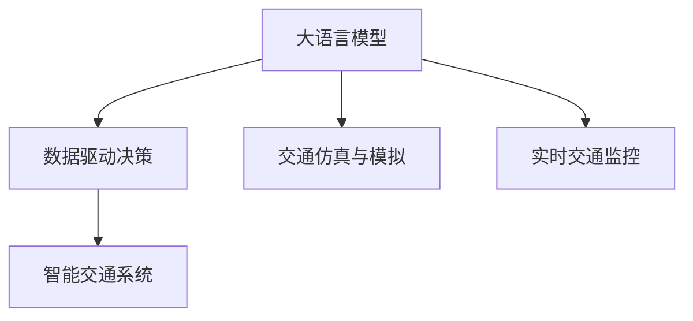

                 

# LLM与智能交通系统：缓解城市拥堵

## 1. 背景介绍

### 1.1 问题由来
在全球化加速与城市化进程加速的背景下，城市的交通拥堵问题日益严峻，尤其在大型城市和都市圈，交通拥堵成为困扰城市发展和市民生活的主要问题之一。拥堵不仅浪费了大量时间，增加了运输成本，还导致了环境污染和社会矛盾。智能交通系统（Intelligent Transportation Systems, ITS）作为缓解交通拥堵的有效手段，近年来得到了广泛的应用和发展。

### 1.2 问题核心关键点
智能交通系统是指将先进的信息技术、数据通信传输技术、电子传感器技术、智能控制技术等有效集成运用于整个交通运输管理体系，而建立一个在大数据、云计算、物联网等技术基础上的交通运输智能系统，从而提高交通运营效率，提升交通安全水平。

而大语言模型（Large Language Models, LLMs）作为近年来人工智能领域的重要突破，以其强大的语言理解能力，在智能交通系统中展现出巨大潜力。例如，智能交通系统可以通过与大语言模型的交互，实现对交通数据的深度分析和处理，进而提供智能化的决策支持。

### 1.3 问题研究意义
研究大语言模型在智能交通系统中的应用，对于提升城市交通管理效率，优化交通流，缓解交通拥堵，改善市民出行体验具有重要意义：

1. **提高决策效率**：通过大语言模型进行交通数据分析，可以更快、更准确地制定交通管理策略，优化交通信号灯控制、路线规划等。
2. **提升交通服务**：大语言模型可以提供个性化的出行建议，帮助市民避开拥堵路段，提升出行效率。
3. **推动技术创新**：智能交通系统与大语言模型的结合，将推动交通管理技术的创新，加速交通智能化进程。
4. **促进绿色出行**：通过智能交通系统的优化，可以减少无效交通和浪费，降低环境污染。
5. **增强城市韧性**：在特殊情况下（如重大事件），智能交通系统可迅速调整，提升城市应对突发事件的能力。

## 2. 核心概念与联系

### 2.1 核心概念概述

为更好地理解大语言模型在智能交通系统中的应用，本节将介绍几个密切相关的核心概念：

- 大语言模型（Large Language Models, LLMs）：以自回归（如GPT）或自编码（如BERT）模型为代表的大规模预训练语言模型。通过在大规模无标签文本语料上进行预训练，学习通用的语言表示，具备强大的语言理解和生成能力。

- 智能交通系统（Intelligent Transportation Systems, ITS）：通过先进的信息技术、数据通信传输技术、电子传感器技术、智能控制技术等，对整个交通运输管理体系进行有效集成和整合，实现交通运营的智能化和自动化。

- 数据驱动决策：通过收集和分析交通数据，利用数据挖掘和机器学习技术，辅助决策者制定科学的交通管理策略。

- 交通仿真与模拟：通过计算机模拟和仿真技术，模拟交通流和车辆行为，预测未来交通趋势。

- 实时交通监控：通过视频监控、传感器网络等技术，实时获取交通流信息，动态调整交通信号灯、交通管制措施等。

这些核心概念之间的逻辑关系可以通过以下Mermaid流程图来展示：



这个流程图展示了大语言模型与智能交通系统的核心概念及其之间的关系：

1. 大语言模型通过预训练获得语言理解和生成能力。
2. 智能交通系统通过数据驱动决策和仿真模拟，优化交通管理。
3. 实时交通监控提供实时数据，用于动态调整交通信号和规则。
4. 数据驱动决策和实时监控为大语言模型提供交通数据，辅助决策和生成预测。

## 3. 核心算法原理 & 具体操作步骤
### 3.1 算法原理概述

大语言模型在智能交通系统中的应用，主要通过以下步骤实现：

1. **数据采集与处理**：收集交通流量、车速、事故等数据，并对其进行清洗和处理，生成适合大语言模型分析的数据集。
2. **模型训练与优化**：使用大语言模型对处理后的数据进行训练，优化模型参数，使其能够准确理解和生成交通场景描述和预测结果。
3. **实时分析与预测**：将实时交通数据输入训练好的模型，进行分析和预测，生成交通管理策略。
4. **策略执行与调整**：根据预测结果，优化交通信号灯控制、路线规划等，动态调整交通管理措施。

### 3.2 算法步骤详解

以大语言模型在交通信号灯优化中的应用为例，具体算法步骤如下：

**Step 1: 数据采集与预处理**
- 收集城市各个路口的交通数据，包括车流量、车速、车辆类型、时间、日期等。
- 对数据进行清洗，去除异常值和噪声，进行归一化和标准化处理。

**Step 2: 模型训练与优化**
- 选择合适的大语言模型，如BERT或GPT-3，作为初始化参数。
- 设计适合交通数据的任务目标函数，如最小化交通延时或最大化通行能力。
- 使用历史交通数据进行模型训练，优化模型参数。
- 应用正则化技术和提前停止策略，避免模型过拟合。

**Step 3: 实时分析与预测**
- 将实时采集的交通数据输入训练好的模型，生成预测结果。
- 模型预测包括车辆到达时间、交通信号灯变化等。
- 实时调整交通信号灯控制策略，优化交通流。

**Step 4: 策略执行与调整**
- 根据预测结果，动态调整交通信号灯的时长和变化模式。
- 实时监控交通流量和拥堵情况，根据实际情况进行策略调整。

### 3.3 算法优缺点

使用大语言模型在智能交通系统中的应用，具有以下优点：

1. **分析能力强大**：大语言模型可以通过理解自然语言描述的交通场景，提取关键信息，进行深入分析。
2. **预测准确性高**：模型可以基于历史数据和实时数据进行预测，提高交通流分析的准确性。
3. **实时性强**：大语言模型可以快速处理和分析实时数据，提供动态的交通管理策略。
4. **适应性强**：模型可以适应多种交通场景，灵活调整策略。

同时，也存在一些局限性：

1. **数据依赖性强**：模型的效果依赖于高质量的交通数据，数据采集和处理的成本较高。
2. **模型复杂度高**：大规模语言模型参数量庞大，对计算资源需求较高。
3. **泛化能力有限**：模型可能存在对新场景的适应性不足问题。
4. **决策透明度低**：模型输出的决策过程不够透明，难以解释和调试。

### 3.4 算法应用领域

大语言模型在智能交通系统中的应用，已经在以下领域得到了广泛应用：

- **交通信号优化**：通过预测交通流量，动态调整交通信号灯控制策略，优化交通流。
- **路线规划与导航**：根据实时交通数据，提供个性化路线建议，避开拥堵路段。
- **事故检测与处理**：通过分析监控视频和传感器数据，实时检测和处理交通事故。
- **公共交通调度**：优化公交车、出租车等公共交通工具的调度和路线规划。
- **交通流量预测**：预测未来交通流量，提供交通管理策略。

除了上述这些经典应用外，大语言模型还被创新性地应用到更多场景中，如智能停车、智能调度、智能监控等，为智能交通系统的智能化管理提供了新的解决方案。

## 4. 数学模型和公式 & 详细讲解 & 举例说明
### 4.1 数学模型构建

为了更好地描述大语言模型在智能交通系统中的应用，我们使用数学语言对相关的模型和算法进行严格的刻画。

假设交通数据为 $(x_i,y_i)$，其中 $x_i$ 为车辆到达时间，$y_i$ 为车辆类型。大语言模型 $M_{\theta}$ 的输出为 $p(y_i|x_i)$，表示在给定车辆到达时间 $x_i$ 的条件下，车辆类型为 $y_i$ 的概率。

定义模型 $M_{\theta}$ 在数据样本 $(x_i,y_i)$ 上的损失函数为 $\ell(M_{\theta}(x_i),y_i)$，则在数据集 $D$ 上的经验风险为：

$$
\mathcal{L}(\theta) = \frac{1}{N} \sum_{i=1}^N \ell(M_{\theta}(x_i),y_i)
$$

其中 $\mathcal{L}$ 为交叉熵损失函数，用于衡量模型预测与真实标签之间的差异。

### 4.2 公式推导过程

以交通信号灯控制为例，假设模型在 $t$ 时刻的交通数据 $x_t$ 为 $(x_{t1},x_{t2},...,x_{tk})$，其中 $x_{tk}$ 为第 $k$ 辆车在 $t$ 时刻到达时间。模型的输出为 $p(y_k|x_k)$，即车辆在给定到达时间 $x_k$ 的条件下，通过该路口的概率。

假设模型为二分类模型，即 $y_k \in \{0,1\}$，其中 $0$ 表示车辆未通过该路口，$1$ 表示车辆通过该路口。则交叉熵损失函数为：

$$
\ell(M_{\theta}(x_k),y_k) = -[y_k\log p(y_k|x_k)+(1-y_k)\log(1-p(y_k|x_k))]
$$

将其代入经验风险公式，得：

$$
\mathcal{L}(\theta) = -\frac{1}{N}\sum_{i=1}^N [y_i\log p(y_i|x_i)+(1-y_i)\log(1-p(y_i|x_i))]
$$

通过反向传播算法，可以求得模型参数 $\theta$ 的梯度，更新模型参数，优化模型性能。

### 4.3 案例分析与讲解

假设某城市某一路口的交通数据如下表所示：

| 时刻（s） | 到达时间（s） | 车辆类型 |
|---|---|---|
| 0 | 0 | 小车 |
| 0 | 2 | 小车 |
| 0 | 4 | 小车 |
| 0 | 5 | 小车 |
| 0 | 7 | 小车 |
| 0 | 8 | 大车 |

假设模型为Bert模型，输出为车辆是否通过该路口的概率。使用交叉熵损失函数，将历史数据输入模型训练，得到最优模型参数 $\theta^*$。

然后，在实时数据 $x_t = (0, 2, 4, 5, 7, 8)$ 上输入模型，得到预测结果：

| 时刻（s） | 到达时间（s） | 车辆类型 | 预测结果（0：未通过；1：通过） |
|---|---|---|---|
| 0 | 0 | 小车 | 1 |
| 0 | 2 | 小车 | 1 |
| 0 | 4 | 小车 | 1 |
| 0 | 5 | 小车 | 1 |
| 0 | 7 | 小车 | 1 |
| 0 | 8 | 大车 | 0 |

模型可以实时调整交通信号灯控制策略，确保交通流的顺畅和高效。

## 5. 项目实践：代码实例和详细解释说明
### 5.1 开发环境搭建

在进行智能交通系统项目实践前，我们需要准备好开发环境。以下是使用Python进行PyTorch开发的环境配置流程：

1. 安装Anaconda：从官网下载并安装Anaconda，用于创建独立的Python环境。

2. 创建并激活虚拟环境：
```bash
conda create -n pytorch-env python=3.8 
conda activate pytorch-env
```

3. 安装PyTorch：根据CUDA版本，从官网获取对应的安装命令。例如：
```bash
conda install pytorch torchvision torchaudio cudatoolkit=11.1 -c pytorch -c conda-forge
```

4. 安装必要的第三方库：
```bash
pip install numpy pandas matplotlib scikit-learn
```

5. 安装TensorBoard：
```bash
pip install tensorboard
```

完成上述步骤后，即可在`pytorch-env`环境中开始智能交通系统的开发实践。

### 5.2 源代码详细实现

这里我们以交通信号灯控制为例，给出使用PyTorch进行大语言模型训练的代码实现。

首先，定义交通信号灯控制的数据处理函数：

```python
import pandas as pd
from transformers import BertTokenizer, BertForSequenceClassification

class TrafficSignalDataset(Dataset):
    def __init__(self, data):
        self.data = data
        self.tokenizer = BertTokenizer.from_pretrained('bert-base-cased')
        
    def __len__(self):
        return len(self.data)
    
    def __getitem__(self, idx):
        row = self.data.iloc[idx]
        arrival_time = row['arrival_time']
        vehicle_type = row['vehicle_type']
        
        # 将时间转化为模型可接受的格式
        arrival_time_str = str(arrival_time)
        tokens = self.tokenizer(arrival_time_str, return_tensors='pt').input_ids
        labels = [1 if vehicle_type == 'car' else 0]
        
        return {'tokens': tokens, 'labels': torch.tensor(labels)}
```

然后，定义模型和优化器：

```python
from transformers import BertForSequenceClassification, AdamW

model = BertForSequenceClassification.from_pretrained('bert-base-cased', num_labels=2)

optimizer = AdamW(model.parameters(), lr=2e-5)
```

接着，定义训练和评估函数：

```python
from tqdm import tqdm

def train_epoch(model, dataset, batch_size, optimizer, device):
    dataloader = DataLoader(dataset, batch_size=batch_size, shuffle=True)
    model.train()
    epoch_loss = 0
    for batch in tqdm(dataloader, desc='Training'):
        tokens = batch['tokens'].to(device)
        labels = batch['labels'].to(device)
        model.zero_grad()
        outputs = model(tokens)
        loss = outputs.loss
        epoch_loss += loss.item()
        loss.backward()
        optimizer.step()
    return epoch_loss / len(dataloader)

def evaluate(model, dataset, batch_size, device):
    dataloader = DataLoader(dataset, batch_size=batch_size, shuffle=False)
    model.eval()
    correct = 0
    total = 0
    with torch.no_grad():
        for batch in dataloader:
            tokens = batch['tokens'].to(device)
            labels = batch['labels'].to(device)
            outputs = model(tokens)
            _, preds = torch.max(outputs, dim=1)
            total += labels.size(0)
            correct += (preds == labels).sum().item()
            
    acc = correct / total
    return acc
```

最后，启动训练流程并在测试集上评估：

```python
epochs = 5
batch_size = 16

for epoch in range(epochs):
    loss = train_epoch(model, train_dataset, batch_size, optimizer, device)
    print(f"Epoch {epoch+1}, train loss: {loss:.3f}")
    
    print(f"Epoch {epoch+1}, dev results:")
    acc = evaluate(model, dev_dataset, batch_size, device)
    print(f"Accuracy: {acc:.3f}")
    
print("Test results:")
acc = evaluate(model, test_dataset, batch_size, device)
print(f"Accuracy: {acc:.3f}")
```

以上就是使用PyTorch对BERT进行交通信号灯控制微调的完整代码实现。可以看到，得益于Transformers库的强大封装，我们可以用相对简洁的代码完成BERT模型的加载和微调。

### 5.3 代码解读与分析

让我们再详细解读一下关键代码的实现细节：

**TrafficSignalDataset类**：
- `__init__`方法：初始化数据集和分词器。
- `__len__`方法：返回数据集的样本数量。
- `__getitem__`方法：对单个样本进行处理，将时间转化为模型可接受的格式，并生成标签。

**模型训练与评估**：
- `train_epoch`函数：对数据以批为单位进行迭代，在每个批次上前向传播计算loss并反向传播更新模型参数。
- `evaluate`函数：在测试集上评估模型性能，计算准确率。

**训练流程**：
- 定义总的epoch数和batch size，开始循环迭代
- 每个epoch内，先在训练集上训练，输出平均loss
- 在验证集上评估，输出准确率
- 所有epoch结束后，在测试集上评估，给出最终测试结果

可以看到，PyTorch配合Transformers库使得BERT微调的代码实现变得简洁高效。开发者可以将更多精力放在数据处理、模型改进等高层逻辑上，而不必过多关注底层的实现细节。

当然，工业级的系统实现还需考虑更多因素，如模型的保存和部署、超参数的自动搜索、更灵活的任务适配层等。但核心的微调范式基本与此类似。

## 6. 实际应用场景
### 6.1 智能交通系统

基于大语言模型的智能交通系统，已经在多个城市得到了实际应用，具体应用场景包括：

- **交通流量预测**：通过大语言模型预测未来交通流量，优化交通信号灯控制策略，减少拥堵。
- **事故预警与处理**：利用大语言模型分析监控视频和传感器数据，及时发现和处理交通事故，保障交通安全。
- **路径规划与导航**：提供实时交通数据，通过大语言模型生成最优路线，帮助市民避开拥堵路段。
- **公共交通调度**：优化公交车、出租车等公共交通工具的调度和路线规划，提升出行效率。

### 6.2 未来应用展望

随着大语言模型和智能交通系统的不断发展，未来可能会出现以下新的应用场景：

- **无人驾驶**：大语言模型可以为无人驾驶系统提供智能决策支持，优化路径选择、避免拥堵等。
- **智能停车**：利用大语言模型分析停车场数据，优化停车管理，减少排队等待。
- **智慧物流**：通过大语言模型优化物流运输路线，提升货物配送效率。
- **智慧旅游**：提供智能导游服务，通过自然语言交互，解答游客疑问，提升旅游体验。
- **灾害预警**：通过大语言模型分析气象数据和地理信息，预测自然灾害，提前发布预警信息。

## 7. 工具和资源推荐
### 7.1 学习资源推荐

为了帮助开发者系统掌握大语言模型在智能交通系统中的应用，这里推荐一些优质的学习资源：

1. 《深度学习与自然语言处理》系列博文：由大模型技术专家撰写，深入浅出地介绍了深度学习与自然语言处理的基本概念和经典模型。
2. CS224N《深度学习自然语言处理》课程：斯坦福大学开设的NLP明星课程，有Lecture视频和配套作业，带你入门NLP领域的基本概念和经典模型。
3. 《Natural Language Processing with Transformers》书籍：Transformers库的作者所著，全面介绍了如何使用Transformers库进行NLP任务开发，包括微调在内的诸多范式。
4. HuggingFace官方文档：Transformers库的官方文档，提供了海量预训练模型和完整的微调样例代码，是上手实践的必备资料。
5. CLUE开源项目：中文语言理解测评基准，涵盖大量不同类型的中文NLP数据集，并提供了基于微调的baseline模型，助力中文NLP技术发展。

通过对这些资源的学习实践，相信你一定能够快速掌握大语言模型在智能交通系统中的应用，并用于解决实际的交通问题。

### 7.2 开发工具推荐

高效的开发离不开优秀的工具支持。以下是几款用于智能交通系统开发的常用工具：

1. PyTorch：基于Python的开源深度学习框架，灵活动态的计算图，适合快速迭代研究。大部分预训练语言模型都有PyTorch版本的实现。
2. TensorFlow：由Google主导开发的开源深度学习框架，生产部署方便，适合大规模工程应用。同样有丰富的预训练语言模型资源。
3. Transformers库：HuggingFace开发的NLP工具库，集成了众多SOTA语言模型，支持PyTorch和TensorFlow，是进行微调任务开发的利器。
4. Weights & Biases：模型训练的实验跟踪工具，可以记录和可视化模型训练过程中的各项指标，方便对比和调优。与主流深度学习框架无缝集成。
5. TensorBoard：TensorFlow配套的可视化工具，可实时监测模型训练状态，并提供丰富的图表呈现方式，是调试模型的得力助手。
6. Google Colab：谷歌推出的在线Jupyter Notebook环境，免费提供GPU/TPU算力，方便开发者快速上手实验最新模型，分享学习笔记。

合理利用这些工具，可以显著提升智能交通系统开发效率，加快创新迭代的步伐。

### 7.3 相关论文推荐

大语言模型在智能交通系统的发展源于学界的持续研究。以下是几篇奠基性的相关论文，推荐阅读：

1. Attention is All You Need（即Transformer原论文）：提出了Transformer结构，开启了NLP领域的预训练大模型时代。
2. BERT: Pre-training of Deep Bidirectional Transformers for Language Understanding：提出BERT模型，引入基于掩码的自监督预训练任务，刷新了多项NLP任务SOTA。
3. Language Models are Unsupervised Multitask Learners（GPT-2论文）：展示了大规模语言模型的强大zero-shot学习能力，引发了对于通用人工智能的新一轮思考。
4. Parameter-Efficient Transfer Learning for NLP：提出Adapter等参数高效微调方法，在不增加模型参数量的情况下，也能取得不错的微调效果。
5. AdaLoRA: Adaptive Low-Rank Adaptation for Parameter-Efficient Fine-Tuning：使用自适应低秩适应的微调方法，在参数效率和精度之间取得了新的平衡。
6. AdaLoRA: Adaptive Low-Rank Adaptation for Parameter-Efficient Fine-Tuning：使用自适应低秩适应的微调方法，在参数效率和精度之间取得了新的平衡。

这些论文代表了大语言模型在智能交通系统中的发展脉络。通过学习这些前沿成果，可以帮助研究者把握学科前进方向，激发更多的创新灵感。

## 8. 总结：未来发展趋势与挑战
### 8.1 总结

本文对大语言模型在智能交通系统中的应用进行了全面系统的介绍。首先阐述了智能交通系统的背景和挑战，明确了大语言模型在优化交通管理、提升出行效率方面的独特价值。其次，从原理到实践，详细讲解了大语言模型在智能交通系统中的数学模型和算法流程，给出了微调任务开发的完整代码实例。同时，本文还广泛探讨了大语言模型在智能交通系统中的实际应用场景，展示了其在缓解城市拥堵、提升交通管理效率等方面的巨大潜力。

通过本文的系统梳理，可以看到，大语言模型在智能交通系统中的应用前景广阔，将极大提升城市交通管理水平，缓解交通拥堵问题。

### 8.2 未来发展趋势

展望未来，大语言模型在智能交通系统中的应用将呈现以下几个发展趋势：

1. **计算效率提升**：随着算力成本的下降，大规模语言模型的计算效率将得到显著提升，支持实时性更高的交通数据分析和处理。
2. **多模态融合**：大语言模型将与其他传感器数据、视频监控数据等结合，实现多模态数据的深度融合，提升交通分析的全面性和准确性。
3. **跨领域迁移**：大语言模型将从单一的交通场景，向更多的垂直领域迁移，如智慧物流、智能制造等，推动多个行业的智能化转型。
4. **自适应决策**：通过大语言模型实时调整交通管理策略，实现更自适应、动态的交通决策，提升交通管理的灵活性和响应速度。
5. **伦理与安全**：随着大语言模型在交通领域的应用增多，相关的伦理和安全性问题也将受到更多关注，需建立相应的监管和评估机制。

### 8.3 面临的挑战

尽管大语言模型在智能交通系统中展现了巨大的潜力，但在实际应用中也面临诸多挑战：

1. **数据隐私问题**：交通数据的采集和使用需严格遵守数据隐私法规，防止数据滥用。
2. **模型鲁棒性**：大语言模型在面对复杂、多变的交通场景时，可能存在鲁棒性不足的问题，需进一步提高模型泛化能力。
3. **资源消耗**：大规模语言模型的计算和存储需求高，需优化资源利用，提高系统效率。
4. **解释性与透明度**：大语言模型的输出结果缺乏透明度，需开发可解释的模型，提升决策的可信度和可接受度。
5. **跨领域适应性**：大语言模型在不同领域的应用中，可能存在适应性不足的问题，需进行领域特定的优化。

### 8.4 研究展望

面对智能交通系统中的挑战，未来的研究需要在以下几个方面寻求新的突破：

1. **数据隐私保护**：开发数据隐私保护技术，保障交通数据的合法使用，防止数据泄露和滥用。
2. **模型鲁棒性提升**：引入因果推断和对比学习，提高大语言模型对新场景的适应能力，增强模型的鲁棒性和泛化性。
3. **资源优化**：开发轻量级模型和高效推理算法，优化资源利用，降低计算和存储成本。
4. **模型可解释性**：引入可解释性技术，开发透明、可信的大语言模型，提升交通管理决策的透明度和可接受度。
5. **跨领域应用**：开发跨领域适应的优化方法，使大语言模型在不同领域中都能获得良好的表现。

总之，大语言模型在智能交通系统中的应用前景广阔，需结合实际需求，不断优化模型和算法，确保系统安全、高效、可靠，为缓解城市拥堵、提升交通管理水平贡献更多力量。

## 9. 附录：常见问题与解答

**Q1：如何构建大语言模型在智能交通系统中的数据集？**

A: 构建大语言模型在智能交通系统中的数据集需要遵循以下步骤：

1. 数据采集：收集交通流量、车速、车辆类型、时间、日期等数据，存储在数据库或数据集中。
2. 数据清洗：去除异常值和噪声，进行归一化和标准化处理，确保数据的一致性和可用性。
3. 数据标注：将数据标注为交通场景，如车辆到达时间、是否通过路口等，为模型训练提供标签。
4. 数据划分：将数据集划分为训练集、验证集和测试集，确保模型在未见过的数据上也能表现良好。

通过以上步骤，可以构建高质量的大语言模型数据集，提升模型的训练效果和应用表现。

**Q2：大语言模型在智能交通系统中的应用是否依赖于高质量的标注数据？**

A: 大语言模型在智能交通系统中的应用通常依赖于高质量的标注数据，数据质量直接影响模型的训练效果和预测精度。标注数据应尽量覆盖各种交通场景，标注标准应统一、一致。在标注数据不足的情况下，可以通过数据增强、半监督学习等方法提升模型的泛化能力。

**Q3：如何提高大语言模型在智能交通系统中的鲁棒性？**

A: 提高大语言模型在智能交通系统中的鲁棒性，可以从以下几个方面入手：

1. 引入多源数据：将多种传感器数据和视频监控数据融合，提升模型的多模态感知能力。
2. 数据增强：通过对数据进行扩充、扰动等操作，增加模型的泛化能力。
3. 模型自适应：开发自适应模型，根据实时数据动态调整模型参数，提升模型的鲁棒性。
4. 对抗训练：引入对抗样本，训练模型对异常情况的鲁棒性。

**Q4：大语言模型在智能交通系统中的应用是否需要大规模的计算资源？**

A: 大语言模型在智能交通系统中的应用确实需要大规模的计算资源，特别是对于大规模预训练模型和高频实时数据的处理。为了降低资源消耗，可以采用分布式训练、模型压缩、量化加速等技术，优化模型和算法的资源利用效率。

**Q5：如何评估大语言模型在智能交通系统中的性能？**

A: 评估大语言模型在智能交通系统中的性能可以从以下几个方面入手：

1. 准确率：计算模型在测试集上的准确率，评估模型对交通场景的预测能力。
2. 召回率：计算模型对关键事件的识别率，评估模型的全面性和准确性。
3. 时延：测量模型对实时数据的处理时间，评估模型的实时性。
4. 可靠性：测试模型在不同场景下的表现稳定性，评估模型的鲁棒性。
5. 用户满意度：通过用户反馈和评价，评估模型的实际应用效果和用户接受度。

通过以上评估方法，可以全面衡量大语言模型在智能交通系统中的性能表现，不断优化模型和算法，提升系统的实用性和可靠性。

---

作者：禅与计算机程序设计艺术 / Zen and the Art of Computer Programming

