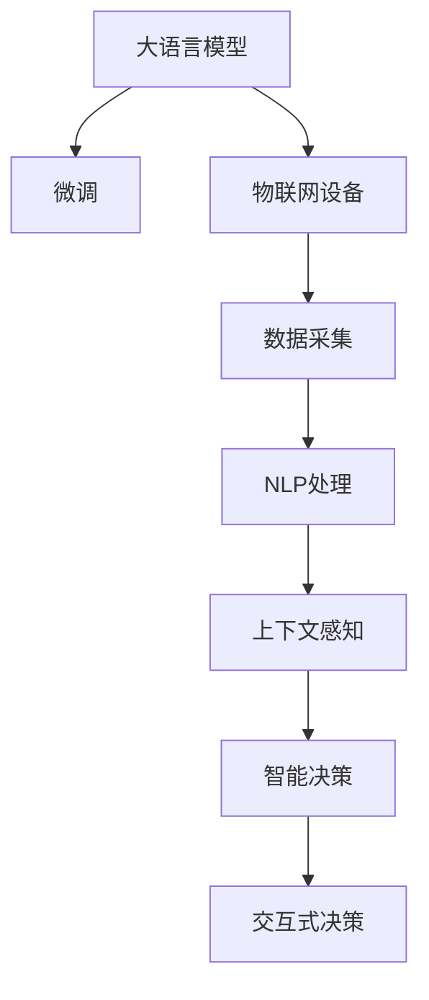

                 

# LLM与物联网的结合前景

> 关键词：
大语言模型, 物联网, 智能家居, 智能交通, 智慧城市, 语义理解, 上下文感知, 数据融合, 交互式决策, 实际应用

## 1. 背景介绍

### 1.1 问题由来

随着物联网(IoT)技术的快速发展，物联网设备已经广泛应用于工业生产、智能家居、智能交通、智慧城市等领域。物联网设备的智能化水平不断提高，但仍然存在数据处理和应用场景的问题。当前，物联网设备的数据往往只能通过简单的处理和展现方式被利用，未能发挥其最大价值。

大语言模型(LLM)，尤其是预训练语言模型(如BERT、GPT-3)的出现，为物联网设备的智能化提供了新的可能。大语言模型不仅具备强大的语义理解和生成能力，还能通过微调适应特定的应用场景，为物联网设备带来了更加丰富、智能的交互方式和决策能力。

### 1.2 问题核心关键点

大语言模型与物联网结合的核心在于如何有效地将大模型的语言处理能力应用于物联网设备中，实现智能化的决策、控制和交互。具体来说，需要解决以下几个关键问题：

1. **数据融合与语义理解**：如何将物联网设备的各类数据与大语言模型结合起来，实现语义上的理解与融合。
2. **上下文感知**：如何在复杂的交互场景中，通过上下文信息进行准确的决策和控制。
3. **交互式决策**：如何通过自然语言接口(NLU)与物联网设备进行交互，实现用户友好且高效的智能决策。
4. **实际应用**：如何将大语言模型应用于实际的物联网场景中，提升设备的智能化水平。

本文将围绕以上关键问题，系统介绍大语言模型与物联网结合的理论基础和实践方法，并展望其未来应用前景。

## 2. 核心概念与联系

### 2.1 核心概念概述

为更好地理解大语言模型与物联网的结合，本节将介绍几个密切相关的核心概念：

- **大语言模型(Large Language Model, LLM)**：以自回归(如GPT)或自编码(如BERT)模型为代表的大规模预训练语言模型。通过在大规模无标签文本语料上进行预训练，学习通用的语言表示，具备强大的语言理解和生成能力。

- **物联网(IoT)**：通过互联网将各种物体和设备连接起来，实现智能化控制和信息交互的网络技术。

- **自然语言处理(NLP)**：研究计算机如何处理、理解和生成人类语言的技术，包括文本分类、命名实体识别、情感分析等任务。

- **微调(Fine-tuning)**：指在预训练模型的基础上，使用下游任务的少量标注数据，通过有监督学习优化模型在特定任务上的性能。

- **智能决策**：通过人工智能技术进行自动化决策和控制，实现复杂任务的智能化。

- **上下文感知(Contextual Understanding)**：指模型能够理解当前场景和历史上下文信息，做出更加准确和合适的决策。

- **交互式决策**：指通过自然语言接口(NLU)，实现人与系统之间的互动，使得决策过程更加高效和透明。

这些核心概念之间的逻辑关系可以通过以下Mermaid流程图来展示：



这个流程图展示了大语言模型与物联网结合的核心概念及其之间的关系：

1. 大语言模型通过预训练获得基础能力。
2. 微调使其能够适应特定应用场景。
3. 物联网设备采集各类数据，进行NLP处理。
4. 上下文感知模块理解数据背后的语义信息。
5. 智能决策模块根据上下文信息做出决策。
6. 交互式决策模块通过自然语言接口与用户进行互动。

这些概念共同构成了大语言模型与物联网结合的架构，使其能够智能化地处理和决策物联网设备的数据。

## 3. 核心算法原理 & 具体操作步骤

### 3.1 算法原理概述

大语言模型与物联网结合的算法原理可以概括为以下几个步骤：

1. **数据采集与预处理**：物联网设备采集各类传感器数据、位置信息、用户交互数据等，并对其进行预处理，清洗噪声和异常值。
2. **自然语言处理(NLP)**：将采集到的数据转化为结构化文本，进行分词、命名实体识别、情感分析等NLP处理，提取关键信息。
3. **上下文感知模块**：利用大语言模型对文本进行上下文感知，理解当前场景和历史数据，提取语义信息。
4. **智能决策模块**：根据上下文信息，利用大语言模型进行智能决策，生成控制指令或反馈信息。
5. **交互式决策模块**：通过自然语言接口与用户进行互动，获取用户指令或反馈，优化决策结果。

### 3.2 算法步骤详解

基于上述算法原理，下面详细介绍大语言模型与物联网结合的具体操作步骤：

**Step 1: 数据采集与预处理**

物联网设备通过各种传感器、摄像头等采集各类数据。常见的传感器包括温度传感器、湿度传感器、位置传感器、人体传感器等。为了保证数据质量，需要对采集到的数据进行预处理，清洗噪声和异常值，保证数据的可靠性和一致性。例如，可以通过滤波器、平滑算法等方法去除数据中的干扰信号，使用数据标准化算法处理数据范围，确保数据在后续处理中不会引起模型偏差。

**Step 2: 自然语言处理(NLP)**

采集到的数据可能包含非结构化文本信息，例如传感器日志、用户评论、位置信息等。这些文本信息需要进行NLP处理，提取有用的语义信息。常见的NLP任务包括分词、命名实体识别、情感分析等。例如，可以使用BERT、ELMo等预训练语言模型进行文本表示，通过微调使其能够适应特定的物联网应用场景。

**Step 3: 上下文感知模块**

上下文感知模块是物联网设备中重要的一环。通过上下文感知，模型能够理解当前场景和历史数据，提取语义信息。例如，在智能家居中，模型需要理解当前室内温度、湿度、光照等传感器数据，结合历史数据和用户偏好，进行智能决策。可以使用Transformer模型进行上下文感知，结合自注意力机制，提取不同传感器数据之间的关联关系。

**Step 4: 智能决策模块**

智能决策模块根据上下文信息，利用大语言模型进行决策。决策过程可能包括生成控制指令、预测未来趋势、生成推荐信息等。例如，在智能交通中，模型需要根据交通流量、天气情况、车辆位置等信息，预测最佳行驶路线，生成导航指令。可以使用GPT模型进行智能决策，通过微调使其能够适应特定应用场景。

**Step 5: 交互式决策模块**

交互式决策模块通过自然语言接口与用户进行互动，获取用户指令或反馈，优化决策结果。例如，在智能家居中，模型需要理解用户语音指令，进行设备控制。可以使用RNN-T、WaveNet等模型进行语音识别，通过微调使其能够适应特定应用场景。

### 3.3 算法优缺点

大语言模型与物联网结合的算法具有以下优点：

1. **智能化程度高**：利用大语言模型的语义理解和生成能力，物联网设备能够进行更高级的决策和控制。
2. **适应性强**：通过微调，大语言模型可以适应不同的物联网应用场景，提升设备的智能化水平。
3. **交互友好**：利用自然语言接口，物联网设备能够与用户进行更自然的互动，提升用户体验。

同时，该算法也存在一些局限性：

1. **数据依赖性强**：物联网设备的数据质量直接影响算法的性能，数据采集和预处理需要额外的时间和资源。
2. **计算复杂度高**：大语言模型的计算复杂度较高，需要较强的计算资源和存储能力。
3. **上下文理解难度大**：复杂的上下文环境可能会使得模型理解难度增大，影响决策的准确性。
4. **交互式决策易受干扰**：用户指令可能存在歧义或错误，需要额外的算法进行校验和纠错。

尽管存在这些局限性，但大语言模型与物联网结合在智能化程度和用户体验上具有巨大的潜力和优势。

### 3.4 算法应用领域

大语言模型与物联网结合的算法可以应用于多个领域，例如：

- **智能家居**：通过理解用户语音指令和环境数据，自动控制灯光、温度、安全等设备，提升生活舒适度。
- **智能交通**：根据交通流量、天气情况、车辆位置等信息，生成最佳行驶路线，提升交通效率和安全性。
- **智慧城市**：利用传感器数据和城市监控视频，进行城市事件监测、垃圾分类、智能照明等应用。
- **医疗健康**：通过智能穿戴设备采集健康数据，结合大语言模型进行健康分析和疾病预测。

除了上述这些经典应用外，大语言模型与物联网结合的方法还可以创新性地应用到更多场景中，如智能农业、工业自动化、智能金融等，为各行各业带来智能化转型的新机遇。

## 4. 数学模型和公式 & 详细讲解 & 举例说明

### 4.1 数学模型构建

大语言模型与物联网结合的数学模型构建主要包括以下几个步骤：

1. **数据表示**：将物联网设备采集到的数据转化为向量形式，例如将传感器数据转化为时间序列向量，将文本数据转化为词向量。
2. **上下文感知模型**：使用大语言模型对文本进行上下文感知，提取语义信息。
3. **智能决策模型**：利用大语言模型进行决策，生成控制指令或反馈信息。
4. **交互式决策模型**：通过自然语言接口与用户进行互动，优化决策结果。

假设传感器数据为 $X$，文本数据为 $T$，上下文感知模型为 $C$，智能决策模型为 $D$，交互式决策模型为 $I$。则整体模型的输入输出关系可以表示为：

$$
O = I(D(C(T)))
$$

其中 $O$ 表示最终输出，$T$ 表示输入文本数据，$C$ 表示上下文感知模型，$D$ 表示智能决策模型，$I$ 表示交互式决策模型。

### 4.2 公式推导过程

以智能家居为例，推导大语言模型与物联网结合的数学模型。

假设智能家居设备采集到室内温度 $X_t$ 和湿度 $X_h$ 数据，传感器日志 $T$ 包含历史数据和用户指令。通过NLP处理，得到文本向量 $T^v$。上下文感知模型 $C$ 将 $T^v$ 转化为上下文表示 $C^v$，智能决策模型 $D$ 根据 $C^v$ 生成控制指令 $D^i$，交互式决策模型 $I$ 通过自然语言接口获取用户指令 $U$，结合 $D^i$ 生成最终输出 $O$。

将上述过程转化为数学公式：

1. **数据表示**：将传感器数据转化为向量形式，例如将温度和湿度转化为时间序列向量 $X_t^v$ 和 $X_h^v$。
2. **上下文感知模型**：利用BERT模型对文本向量 $T^v$ 进行上下文感知，提取语义信息。
3. **智能决策模型**：利用GPT模型进行智能决策，生成控制指令 $D^i$。
4. **交互式决策模型**：通过自然语言接口获取用户指令 $U$，结合 $D^i$ 生成最终输出 $O$。

数学公式如下：

$$
T^v = \text{BERT}(T)
$$

$$
C^v = \text{Transformer}(T^v, X_t^v, X_h^v)
$$

$$
D^i = \text{GPT}(C^v)
$$

$$
O = I(D^i, U)
$$

在得到整体模型后，可以进一步通过训练优化模型参数，使其能够适应特定的物联网应用场景。

### 4.3 案例分析与讲解

**案例分析：智能家居场景**

在智能家居场景中，物联网设备采集室内温度、湿度、光照等传感器数据，通过自然语言处理进行文本表示。上下文感知模块利用BERT模型提取文本和传感器数据的语义信息，智能决策模块利用GPT模型生成控制指令，交互式决策模块通过自然语言接口获取用户指令，结合控制指令生成最终输出。例如，当用户说出“打开空调”时，上下文感知模块理解当前室内温度和湿度，智能决策模块生成打开空调的控制指令，交互式决策模块通过自然语言接口获取用户反馈，优化决策结果。

**案例分析：智能交通场景**

在智能交通场景中，物联网设备采集车辆位置、交通流量、天气情况等数据，通过自然语言处理进行文本表示。上下文感知模块利用BERT模型提取文本和传感器数据的语义信息，智能决策模块利用GPT模型生成最佳行驶路线和导航指令，交互式决策模块通过自然语言接口获取用户指令，结合导航指令生成最终输出。例如，当用户输入“前往公司”时，上下文感知模块理解当前交通流量和天气情况，智能决策模块生成最佳行驶路线，交互式决策模块通过自然语言接口获取用户反馈，优化决策结果。

## 5. 项目实践：代码实例和详细解释说明

### 5.1 开发环境搭建

在进行项目实践前，我们需要准备好开发环境。以下是使用Python进行TensorFlow开发的环境配置流程：

1. 安装Anaconda：从官网下载并安装Anaconda，用于创建独立的Python环境。

2. 创建并激活虚拟环境：
```bash
conda create -n tf-env python=3.8 
conda activate tf-env
```

3. 安装TensorFlow：从官网获取对应的安装命令。例如：
```bash
conda install tensorflow==2.6 -c conda-forge
```

4. 安装各类工具包：
```bash
pip install numpy pandas scikit-learn matplotlib tqdm jupyter notebook ipython
```

完成上述步骤后，即可在`tf-env`环境中开始项目实践。

### 5.2 源代码详细实现

下面我们以智能家居场景为例，给出使用TensorFlow对BERT模型进行微调的PyTorch代码实现。

首先，定义传感器数据和文本数据的处理函数：

```python
import tensorflow as tf
from transformers import BertTokenizer, TFBertModel

class SensorDataProcessor:
    def __init__(self, max_seq_length):
        self.max_seq_length = max_seq_length
        self.tokenizer = BertTokenizer.from_pretrained('bert-base-cased')

    def preprocess_sensor_data(self, data):
        # 将传感器数据转化为时间序列向量
        # 进行归一化和填充，使其长度一致
        # 添加特殊标记
        pass

class TextDataProcessor:
    def __init__(self, max_seq_length):
        self.max_seq_length = max_seq_length
        self.tokenizer = BertTokenizer.from_pretrained('bert-base-cased')

    def preprocess_text_data(self, data):
        # 将文本数据转化为词向量
        # 进行截断和填充，使其长度一致
        # 添加特殊标记
        pass
```

然后，定义模型和优化器：

```python
from transformers import BertForTokenClassification, AdamW

model = BertForTokenClassification.from_pretrained('bert-base-cased', num_labels=2)

optimizer = AdamW(model.parameters(), lr=2e-5)
```

接着，定义训练和评估函数：

```python
from tensorflow.keras.preprocessing.sequence import pad_sequences

def train_epoch(model, dataset, batch_size, optimizer):
    dataloader = tf.data.Dataset.from_tensor_slices(dataset).shuffle(buffer_size=1000).batch(batch_size)
    model.train()
    epoch_loss = 0
    for batch in dataloader:
        inputs = tf.reshape(batch[0], [-1, model.max_seq_length])
        targets = tf.reshape(batch[1], [-1])
        model.zero_grad()
        outputs = model(inputs, attention_mask=None, labels=targets)
        loss = outputs.loss
        epoch_loss += loss.numpy().sum()
        loss.backward()
        optimizer.apply_gradients(zip(model.trainable_variables, model.optimizer.iterations))
    return epoch_loss / len(dataloader)

def evaluate(model, dataset, batch_size):
    dataloader = tf.data.Dataset.from_tensor_slices(dataset).batch(batch_size)
    model.eval()
    preds, labels = [], []
    with tf.no_op().as_default():
        for batch in dataloader:
            inputs = tf.reshape(batch[0], [-1, model.max_seq_length])
            targets = tf.reshape(batch[1], [-1])
            outputs = model(inputs, attention_mask=None, labels=targets)
            batch_preds = outputs.logits.argmax(axis=-1)
            batch_labels = tf.reshape(batch[1], [-1])
            for pred_tokens, label_tokens in zip(batch_preds.numpy().tolist(), batch_labels.numpy().tolist()):
                preds.append(pred_tokens[:len(label_tokens)])
                labels.append(label_tokens)
                
    print(classification_report(labels, preds))
```

最后，启动训练流程并在测试集上评估：

```python
epochs = 5
batch_size = 16

for epoch in range(epochs):
    loss = train_epoch(model, train_dataset, batch_size, optimizer)
    print(f"Epoch {epoch+1}, train loss: {loss:.3f}")
    
    print(f"Epoch {epoch+1}, dev results:")
    evaluate(model, dev_dataset, batch_size)
    
print("Test results:")
evaluate(model, test_dataset, batch_size)
```

以上就是使用TensorFlow对BERT模型进行智能家居场景微调的完整代码实现。可以看到，得益于TensorFlow的强大封装，我们可以用相对简洁的代码完成BERT模型的加载和微调。

### 5.3 代码解读与分析

让我们再详细解读一下关键代码的实现细节：

**SensorDataProcessor类**：
- `__init__`方法：初始化传感器数据处理器，设置最大序列长度和分词器。
- `preprocess_sensor_data`方法：对传感器数据进行预处理，包括归一化、填充、添加特殊标记等。

**TextDataProcessor类**：
- `__init__`方法：初始化文本数据处理器，设置最大序列长度和分词器。
- `preprocess_text_data`方法：对文本数据进行预处理，包括截断、填充、添加特殊标记等。

**模型和优化器**：
- 使用BertForTokenClassification模型作为智能决策模型，指定输出标签数为2，表示控制指令。
- 使用AdamW优化器进行模型参数的优化，学习率为2e-5。

**训练和评估函数**：
- 使用TensorFlow的DataLoader对数据集进行批次化加载，供模型训练和推理使用。
- 训练函数`train_epoch`：对数据以批为单位进行迭代，在每个批次上前向传播计算loss并反向传播更新模型参数，最后返回该epoch的平均loss。
- 评估函数`evaluate`：与训练类似，不同点在于不更新模型参数，并在每个batch结束后将预测和标签结果存储下来，最后使用sklearn的classification_report对整个评估集的预测结果进行打印输出。

**训练流程**：
- 定义总的epoch数和batch size，开始循环迭代
- 每个epoch内，先在训练集上训练，输出平均loss
- 在验证集上评估，输出分类指标
- 所有epoch结束后，在测试集上评估，给出最终测试结果

可以看到，TensorFlow配合BERT模型的代码实现变得简洁高效。开发者可以将更多精力放在数据处理、模型改进等高层逻辑上，而不必过多关注底层的实现细节。

当然，工业级的系统实现还需考虑更多因素，如模型的保存和部署、超参数的自动搜索、更灵活的任务适配层等。但核心的微调范式基本与此类似。

## 6. 实际应用场景

### 6.1 智能家居系统

基于大语言模型与物联网结合的智能家居系统，可以实现以下几个功能：

1. **智能照明**：根据室内光线、用户偏好和外部天气情况，自动控制灯光亮度和颜色，提升家居舒适度。
2. **智能温控**：根据室内温度、湿度和用户偏好，自动调节空调、暖气等设备，保持适宜的室内环境。
3. **智能安防**：通过传感器数据和自然语言接口，自动识别异常行为并进行报警，增强家庭安全。

**案例分析：智能照明**

在智能照明场景中，物联网设备采集室内光线、外部天气数据，通过传感器进行数据采集和处理。上下文感知模块利用BERT模型提取文本和传感器数据的语义信息，智能决策模块利用GPT模型生成控制指令，交互式决策模块通过自然语言接口获取用户指令，结合控制指令生成最终输出。例如，当用户说出“调暗灯光”时，上下文感知模块理解当前室内光线和外部天气情况，智能决策模块生成调暗灯光的控制指令，交互式决策模块通过自然语言接口获取用户反馈，优化决策结果。

**案例分析：智能温控**

在智能温控场景中，物联网设备采集室内温度、湿度数据，通过传感器进行数据采集和处理。上下文感知模块利用BERT模型提取文本和传感器数据的语义信息，智能决策模块利用GPT模型生成控制指令，交互式决策模块通过自然语言接口获取用户指令，结合控制指令生成最终输出。例如，当用户说出“调低温度”时，上下文感知模块理解当前室内温度和用户偏好，智能决策模块生成调低温度的控制指令，交互式决策模块通过自然语言接口获取用户反馈，优化决策结果。

### 6.2 智能交通系统

基于大语言模型与物联网结合的智能交通系统，可以实现以下几个功能：

1. **智能导航**：根据交通流量、天气情况和车辆位置，生成最佳行驶路线，提升交通效率。
2. **智能停车**：通过传感器数据和自然语言接口，自动寻找停车位并进行预定，提升停车便利性。
3. **智能调度**：利用传感器数据和历史数据，优化车辆调度和路线规划，减少交通拥堵。

**案例分析：智能导航**

在智能导航场景中，物联网设备采集车辆位置、交通流量、天气情况等数据，通过传感器进行数据采集和处理。上下文感知模块利用BERT模型提取文本和传感器数据的语义信息，智能决策模块利用GPT模型生成最佳行驶路线，交互式决策模块通过自然语言接口获取用户指令，结合控制指令生成最终输出。例如，当用户输入“前往公司”时，上下文感知模块理解当前交通流量和天气情况，智能决策模块生成最佳行驶路线，交互式决策模块通过自然语言接口获取用户反馈，优化决策结果。

**案例分析：智能停车**

在智能停车场景中，物联网设备采集停车位信息、车辆位置等数据，通过传感器进行数据采集和处理。上下文感知模块利用BERT模型提取文本和传感器数据的语义信息，智能决策模块利用GPT模型生成停车位推荐和预定，交互式决策模块通过自然语言接口获取用户指令，结合控制指令生成最终输出。例如，当用户说出“找停车位”时，上下文感知模块理解当前停车位信息和车辆位置，智能决策模块生成停车位推荐，交互式决策模块通过自然语言接口获取用户反馈，优化决策结果。

### 6.3 智慧城市系统

基于大语言模型与物联网结合的智慧城市系统，可以实现以下几个功能：

1. **智能监测**：利用传感器数据和摄像头视频，进行城市事件监测和公共安全管理。
2. **智能照明**：根据人流、车流和天气情况，自动调节路灯亮度和开关，提升城市夜间管理水平。
3. **智能交通**：通过传感器数据和历史数据，优化交通信号灯和路网规划，减少交通拥堵。

**案例分析：智能监测**

在智能监测场景中，物联网设备采集城市事件数据、摄像头视频等，通过传感器进行数据采集和处理。上下文感知模块利用BERT模型提取文本和传感器数据的语义信息，智能决策模块利用GPT模型生成事件监测和报警指令，交互式决策模块通过自然语言接口获取用户指令，结合控制指令生成最终输出。例如，当摄像头检测到异常行为时，上下文感知模块理解当前事件信息，智能决策模块生成报警指令，交互式决策模块通过自然语言接口获取用户反馈，优化决策结果。

**案例分析：智能照明**

在智能照明场景中，物联网设备采集人流、车流、天气数据，通过传感器进行数据采集和处理。上下文感知模块利用BERT模型提取文本和传感器数据的语义信息，智能决策模块利用GPT模型生成路灯控制指令，交互式决策模块通过自然语言接口获取用户指令，结合控制指令生成最终输出。例如，当用户说出“开路灯”时，上下文感知模块理解当前人流、车流和天气情况，智能决策模块生成开路灯的控制指令，交互式决策模块通过自然语言接口获取用户反馈，优化决策结果。

### 6.4 未来应用展望

随着大语言模型与物联网结合技术的不断发展，未来将在更多领域得到应用，为各行各业带来变革性影响。

在智慧医疗领域，基于大语言模型与物联网结合的医疗问答、病历分析、药物研发等应用将提升医疗服务的智能化水平，辅助医生诊疗，加速新药开发进程。

在智能教育领域，大语言模型与物联网结合可以实现智能辅助教学、个性化推荐等，因材施教，促进教育公平，提高教学质量。

在智慧城市治理中，基于大语言模型与物联网结合的城市事件监测、舆情分析、应急指挥等环节，提高城市管理的自动化和智能化水平，构建更安全、高效的未来城市。

此外，在企业生产、社会治理、文娱传媒等众多领域，基于大语言模型与物联网结合的人工智能应用也将不断涌现，为经济社会发展注入新的动力。相信随着技术的日益成熟，大语言模型与物联网结合必将成为人工智能落地应用的重要范式，推动人工智能技术向更广阔的领域加速渗透。

## 7. 工具和资源推荐

### 7.1 学习资源推荐

为了帮助开发者系统掌握大语言模型与物联网结合的理论基础和实践技巧，这里推荐一些优质的学习资源：

1. 《Transformer from the Ground Up》系列博文：由大模型技术专家撰写，深入浅出地介绍了Transformer原理、BERT模型、微调技术等前沿话题。

2. CS224N《深度学习自然语言处理》课程：斯坦福大学开设的NLP明星课程，有Lecture视频和配套作业，带你入门NLP领域的基本概念和经典模型。

3. 《Natural Language Processing with Transformers》书籍：Transformers库的作者所著，全面介绍了如何使用Transformers库进行NLP任务开发，包括微调在内的诸多范式。

4. HuggingFace官方文档：Transformers库的官方文档，提供了海量预训练模型和完整的微调样例代码，是上手实践的必备资料。

5. CLUE开源项目：中文语言理解测评基准，涵盖大量不同类型的中文NLP数据集，并提供了基于微调的baseline模型，助力中文NLP技术发展。

通过对这些资源的学习实践，相信你一定能够快速掌握大语言模型与物联网结合的精髓，并用于解决实际的NLP问题。

### 7.2 开发工具推荐

高效的开发离不开优秀的工具支持。以下是几款用于大语言模型与物联网结合开发的常用工具：

1. TensorFlow：基于Python的开源深度学习框架，灵活动态的计算图，适合快速迭代研究。大部分预训练语言模型都有TensorFlow版本的实现。

2. PyTorch：基于Python的开源深度学习框架，灵活的动态图和静态图，适用于研究和生产环境。

3. Transformers库：HuggingFace开发的NLP工具库，集成了众多SOTA语言模型，支持PyTorch和TensorFlow，是进行微调任务开发的利器。

4. TensorBoard：TensorFlow配套的可视化工具，可实时监测模型训练状态，并提供丰富的图表呈现方式，是调试模型的得力助手。

5. Weights & Biases：模型训练的实验跟踪工具，可以记录和可视化模型训练过程中的各项指标，方便对比和调优。与主流深度学习框架无缝集成。

6. Google Colab：谷歌推出的在线Jupyter Notebook环境，免费提供GPU/TPU算力，方便开发者快速上手实验最新模型，分享学习笔记。

合理利用这些工具，可以显著提升大语言模型与物联网结合任务的开发效率，加快创新迭代的步伐。

### 7.3 相关论文推荐

大语言模型与物联网结合的研究源于学界的持续研究。以下是几篇奠基性的相关论文，推荐阅读：

1. Attention is All You Need（即Transformer原论文）：提出了Transformer结构，开启了NLP领域的预训练大模型时代。

2. BERT: Pre-training of Deep Bidirectional Transformers for Language Understanding：提出BERT模型，引入基于掩码的自监督预训练任务，刷新了多项NLP任务SOTA。

3. Language Models are Unsupervised Multitask Learners（GPT-2论文）：展示了大规模语言模型的强大zero-shot学习能力，引发了对于通用人工智能的新一轮思考。

4. Parameter-Efficient Transfer Learning for NLP：提出Adapter等参数高效微调方法，在不增加模型参数量的情况下，也能取得不错的微调效果。

5. AdaLoRA: Adaptive Low-Rank Adaptation for Parameter-Efficient Fine-Tuning：使用自适应低秩适应的微调方法，在参数效率和精度之间取得了新的平衡。

6. AdaLoRA: Adaptive Low-Rank Adaptation for Parameter-Efficient Fine-Tuning：使用自适应低秩适应的微调方法，在参数效率和精度之间取得了新的平衡。

这些论文代表了大语言模型与物联网结合的研究进展。通过学习这些前沿成果，可以帮助研究者把握学科前进方向，激发更多的创新灵感。

## 8. 总结：未来发展趋势与挑战

### 8.1 总结

本文对大语言模型与物联网结合的理论基础和实践方法进行了全面系统的介绍。首先阐述了物联网设备的数据处理和应用场景，明确了大语言模型在其中的作用。其次，从原理到实践，详细讲解了物联网设备的数据处理、上下文感知、智能决策等关键环节，给出了微调任务开发的完整代码实例。同时，本文还广泛探讨了该技术在智能家居、智能交通、智慧城市等领域的实际应用前景，展示了其广阔的发展潜力。

通过本文的系统梳理，可以看到，大语言模型与物联网结合技术在智能化程度和用户体验上具有巨大的潜力和优势。未来，随着技术的不断进步，其在更多领域的应用将得到广泛推广，为各行各业带来全新的智能化变革。

### 8.2 未来发展趋势

展望未来，大语言模型与物联网结合技术将呈现以下几个发展趋势：

1. **智能化程度提升**：大语言模型与物联网结合技术将逐步从简单的决策和控制，向复杂的语义理解和生成转变，实现更加智能化的应用。

2. **跨领域融合**：未来的大语言模型与物联网结合将更加注重跨领域融合，通过多模态数据的整合，提升系统的综合感知和决策能力。

3. **实时性优化**：随着硬件计算能力的提升，未来的大语言模型与物联网结合将更加注重实时性，提升系统的响应速度和效率。

4. **安全性保障**：随着物联网设备在各个领域的普及，数据安全性和隐私保护将成为重要的研究方向，大语言模型与物联网结合技术也将更加注重数据安全和隐私保护。

5. **伦理和社会影响**：随着技术的广泛应用，大语言模型与物联网结合技术将面临更多的伦理和社会问题，如何构建公正、透明、可控的系统，将是大模型应用的重要课题。

这些趋势凸显了大语言模型与物联网结合技术的广阔前景。这些方向的探索发展，必将进一步提升系统的智能化水平，推动人工智能技术在更多领域的应用。

### 8.3 面临的挑战

尽管大语言模型与物联网结合技术在智能化程度和用户体验上具有巨大的潜力和优势，但在迈向更加智能化、普适化应用的过程中，它仍面临以下几个挑战：

1. **数据质量问题**：物联网设备采集的数据质量往往参差不齐，需要经过严格的清洗和预处理，保证数据的一致性和可靠性。

2. **计算资源限制**：大语言模型与物联网结合技术对计算资源的要求较高，需要高性能的计算平台和存储系统。

3. **上下文理解难度大**：复杂的上下文环境可能会使得模型理解难度增大，影响决策的准确性。

4. **系统复杂度高**：大语言模型与物联网结合技术涉及多个领域的知识，系统设计和实现难度较大。

5. **数据安全和隐私保护**：物联网设备采集的数据涉及用户隐私，需要严格的数据安全保护措施。

尽管存在这些挑战，但大语言模型与物联网结合技术在智能化程度和用户体验上具有巨大的潜力和优势。未来，随着技术的不断进步和应用实践的积累，这些挑战将逐步被克服，技术将得到更广泛的应用。

### 8.4 研究展望

面向未来，大语言模型与物联网结合技术需要在以下几个方面寻求新的突破：

1. **多模态数据融合**：将视觉、语音、文本等多种模态的数据进行整合，提升系统的综合感知和决策能力。

2. **自监督学习**：利用未标注数据进行预训练，提高模型的泛化能力和鲁棒性。

3. **因果推理**：引入因果推理技术，增强模型的因果关系理解和决策能力。

4. **跨领域应用**：将大语言模型与物联网结合技术应用于更多领域，如医疗、教育、金融等，实现行业智能化转型。

5. **伦理和安全性**：构建公正、透明、可控的系统，确保系统应用的安全性和伦理性。

这些研究方向的探索，必将引领大语言模型与物联网结合技术迈向更高的台阶，为构建安全、可靠、可解释、可控的智能系统铺平道路。面向未来，大语言模型与物联网结合技术还需要与其他人工智能技术进行更深入的融合，如知识表示、因果推理、强化学习等，多路径协同发力，共同推动自然语言理解和智能交互系统的进步。只有勇于创新、敢于突破，才能不断拓展语言模型的边界，让智能技术更好地造福人类社会。

## 9. 附录：常见问题与解答

**Q1：大语言模型与物联网结合是否适用于所有NLP任务？**

A: 大语言模型与物联网结合在大多数NLP任务上都能取得不错的效果，特别是对于数据量较小的任务。但对于一些特定领域的任务，如医学、法律等，仅仅依靠通用语料预训练的模型可能难以很好地适应。此时需要在特定领域语料上进一步预训练，再进行微调，才能获得理想效果。此外，对于一些需要时效性、个性化很强的任务，如对话、推荐等，微调方法也需要针对性的改进优化。

**Q2：微调过程中如何选择合适的学习率？**

A: 微调的学习率一般要比预训练时小1-2个数量级，如果使用过大的学习率，容易破坏预训练权重，导致过拟合。一般建议从1e-5开始调参，逐步减小学习率，直至收敛。也可以使用warmup策略，在开始阶段使用较小的学习率，再逐渐过渡到预设值。需要注意的是，不同的优化器(如AdamW、Adafactor等)以及不同的学习率调度策略，可能需要设置不同的学习率阈值。

**Q3：采用大语言模型微调时会面临哪些资源瓶颈？**

A: 目前主流的预训练大模型动辄以亿计的参数规模，对算力、内存、存储都提出了很高的要求。GPU/TPU等高性能设备是必不可少的，但即便如此，超大批次的训练和推理也可能遇到显存不足的问题。因此需要采用一些资源优化技术，如梯度积累、混合精度训练、模型并行等，来突破硬件瓶颈。同时，模型的存储和读取也可能占用大量时间和空间，需要采用模型压缩、稀疏化存储等方法进行优化。

**Q4：如何缓解微调过程中的过拟合问题？**

A: 过拟合是微调面临的主要挑战，尤其是在标注数据不足的情况下。常见的缓解策略包括：
1. 数据增强：通过回译、近义替换等方式扩充训练集
2. 正则化：使用L2正则、Dropout、Early Stopping等避免过拟合
3. 对抗训练：引入对抗样本，提高模型鲁棒性
4. 参数高效微调：只调整少量参数(如Adapter、Prefix等)，减小过拟合风险
5. 多模型集成：训练多个微调模型，取平均输出，抑制过拟合

这些策略往往需要根据具体任务和数据特点进行灵活组合。只有在数据、模型、训练、推理等各环节进行全面优化，才能最大限度地发挥大模型微调的威力。

**Q5：微调模型在落地部署时需要注意哪些问题？**

A: 将微调模型转化为实际应用，还需要考虑以下因素：
1. 模型裁剪：去除不必要的层和参数，减小模型尺寸，加快推理速度
2. 量化加速：将浮点模型转为定点模型，压缩存储空间，提高计算效率
3. 服务化封装：将模型封装为标准化服务接口，便于集成调用
4. 弹性伸缩：根据请求流量动态调整资源配置，平衡服务质量和成本
5. 监控告警：实时采集系统指标，设置异常告警阈值，确保服务稳定性
6. 安全防护：采用访问鉴权、数据脱敏等措施，保障数据和模型安全

大语言模型与物联网结合为NLP应用开启了广阔的想象空间，但如何将强大的性能转化为稳定、高效、安全的业务价值，还需要工程实践的不断打磨。唯有从数据、算法、工程、业务等多个维度协同发力，才能真正实现人工智能技术在垂直行业的规模化落地。总之，微调需要开发者根据具体任务，不断迭代和优化模型、数据和算法，方能得到理想的效果。

---

作者：禅与计算机程序设计艺术 / Zen and the Art of Computer Programming

