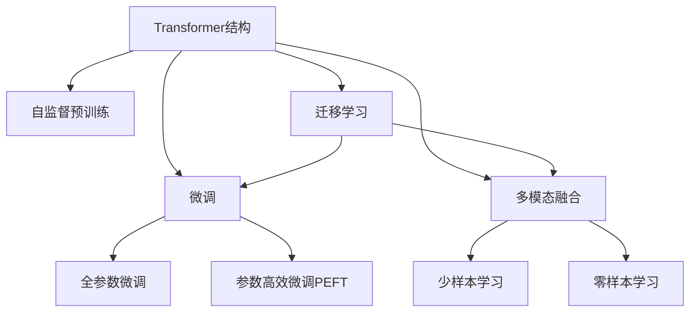

                 

# LLM内核:支撑智能应用的基石

大语言模型（Large Language Model, LLM）作为人工智能（AI）领域的核心技术之一，近年来取得了突破性进展。LLM内核，即大语言模型的核心算法和结构，为支撑智能应用提供了基石。本文将深入探讨LLM内核的核心概念、算法原理和具体实现，并结合实际应用场景，阐述其重要性、未来趋势与挑战，以期为开发者和研究者提供全面而深入的视角。

## 1. 背景介绍

### 1.1 问题由来
随着深度学习技术的快速发展，特别是Transformer结构的应用，大语言模型（LLM）在自然语言处理（NLP）领域取得了显著进展。LLM通过在海量数据上进行自监督学习，获得了强大的语言理解和生成能力，能够完成包括文本分类、问答、翻译、摘要等多种任务。其核心在于能够从大规模无标签数据中学习到语言的通用表示，并通过微调（Fine-Tuning）等方法，适应特定领域的需求。

### 1.2 问题核心关键点
LLM内核包括Transformer结构、自监督预训练、微调、参数高效微调、多模态融合等核心技术。这些技术共同构成了LLM的内核，支撑其在各种智能应用中的广泛使用。

## 2. 核心概念与联系

### 2.1 核心概念概述

为了更好地理解LLM内核，我们首先需要了解几个关键概念：

- **Transformer结构**：一种基于自注意力机制的神经网络结构，能有效解决传统RNN在处理长序列时效率低下的问题。
- **自监督预训练**：在大规模无标签数据上进行的预训练过程，学习通用语言表示，如BERT、GPT等。
- **微调（Fine-Tuning）**：通过少量标注数据，在下游任务上进行有监督的优化，提升模型在该任务上的性能。
- **参数高效微调（Parameter-Efficient Fine-Tuning, PEFT）**：仅更新部分模型参数，减少计算资源的消耗。
- **多模态融合**：将文本、图像、语音等多模态数据结合，提升模型的泛化能力和应用范围。

这些概念之间的联系可以通过以下Mermaid流程图来展示：



这个流程图展示了LLM内核的核心概念及其之间的联系。

## 3. 核心算法原理 & 具体操作步骤

### 3.1 算法原理概述

LLM内核的核心算法原理可以简述为：通过自监督预训练学习通用语言表示，然后通过微调适应特定任务，并利用参数高效微调等技术，优化模型参数，提升模型性能。

### 3.2 算法步骤详解

1. **数据准备**：收集大量无标签文本数据，如维基百科、书籍、互联网文本等，用于自监督预训练。

2. **模型初始化**：选择合适的预训练模型（如BERT、GPT等），初始化模型参数。

3. **自监督预训练**：在无标签数据上，通过掩码语言模型、下一句预测等任务进行自监督预训练，学习语言的通用表示。

4. **微调**：在特定任务的数据集上进行微调，如文本分类、问答、翻译等。根据任务需求，设计合适的输出层和损失函数。

5. **参数高效微调**：仅更新部分模型参数，如顶层分类器、解码器等，减少计算资源的消耗。

6. **模型评估**：在验证集和测试集上评估微调后的模型性能，进行参数优化。

7. **部署应用**：将微调后的模型部署到实际应用中，进行推理和预测。

### 3.3 算法优缺点

**优点**：

- 自监督预训练学习到的通用语言表示，能提升模型在多种任务上的泛化能力。
- 微调过程简单高效，只需少量标注数据即可快速提升模型性能。
- 参数高效微调技术，在保证性能的同时，显著减少计算资源的消耗。

**缺点**：

- 对标注数据的依赖，标注数据质量直接影响模型性能。
- 模型可能存在偏见和有害信息，需要仔细处理。
- 模型推理速度较慢，计算资源消耗较大。

### 3.4 算法应用领域

LLM内核在NLP、计算机视觉、语音识别等多个领域都有广泛应用：

- **NLP**：文本分类、问答系统、机器翻译、摘要生成等。
- **计算机视觉**：图像分类、目标检测、图像生成等。
- **语音识别**：语音转文本、文本转语音等。
- **多模态融合**：结合文本、图像、语音等多模态数据，提升模型的泛化能力。

## 4. 数学模型和公式 & 详细讲解

### 4.1 数学模型构建

假设预训练模型为 $M_{\theta}$，其中 $\theta$ 为预训练得到的模型参数。对于特定任务 $T$，其标注数据集为 $D=\{(x_i, y_i)\}_{i=1}^N$，$x_i$ 为输入，$y_i$ 为标签。微调的目标是最小化损失函数：

$$
\hat{\theta}=\mathop{\arg\min}_{\theta} \mathcal{L}(M_{\theta},D)
$$

其中 $\mathcal{L}$ 为任务 $T$ 的损失函数，如交叉熵损失、均方误差等。

### 4.2 公式推导过程

以二分类任务为例，假设模型 $M_{\theta}$ 的输出为 $\hat{y}=M_{\theta}(x)$，则二分类交叉熵损失函数为：

$$
\ell(M_{\theta}(x),y) = -[y\log \hat{y} + (1-y)\log (1-\hat{y})]
$$

微调的目标是最小化该损失函数，通过梯度下降等优化算法更新模型参数。

### 4.3 案例分析与讲解

假设有一个情感分析任务，我们可以使用预训练的BERT模型进行微调。首先，将数据集分为训练集、验证集和测试集。然后，对模型进行微调，设计合适的输出层和损失函数。例如，对于BERT模型，可以在顶层添加全连接层和softmax层，以输出情感类别。

在微调过程中，选择适当的学习率、批大小、迭代轮数等参数。同时，应用正则化技术（如L2正则、Dropout、Early Stopping等），防止过拟合。最后，在测试集上评估模型性能，调整模型参数，直到模型达到满意的性能。

## 5. 项目实践：代码实例和详细解释说明

### 5.1 开发环境搭建

1. 安装Python环境。
2. 安装TensorFlow和Keras。
3. 下载预训练模型BERT。
4. 准备数据集，包含文本和标签。
5. 编写代码进行微调。

### 5.2 源代码详细实现

```python
from transformers import TFBertForSequenceClassification, TFBertTokenizer
import tensorflow as tf

# 初始化模型和tokenizer
model = TFBertForSequenceClassification.from_pretrained('bert-base-uncased')
tokenizer = TFBertTokenizer.from_pretrained('bert-base-uncased')

# 准备数据集
train_data = tokenizer(train_texts, return_tensors='tf')
test_data = tokenizer(test_texts, return_tensors='tf')

# 定义损失函数和优化器
loss_fn = tf.keras.losses.SparseCategoricalCrossentropy(from_logits=True)
optimizer = tf.keras.optimizers.Adam(learning_rate=5e-5)

# 微调模型
@tf.function
def train_step(text, label):
    with tf.GradientTape() as tape:
        outputs = model(text)
        loss = loss_fn(label, outputs.logits)
    gradients = tape.gradient(loss, model.trainable_variables)
    optimizer.apply_gradients(zip(gradients, model.trainable_variables))

# 训练模型
for epoch in range(epochs):
    for text, label in train_dataset:
        train_step(text, label)
```

### 5.3 代码解读与分析

以上代码展示了使用TensorFlow和Keras进行BERT情感分析任务的微调过程。其中，tokenizer将文本转换为模型可以处理的格式，模型输出logits，通过交叉熵损失函数计算损失，并使用Adam优化器更新模型参数。

## 6. 实际应用场景

### 6.1 智能客服系统

智能客服系统可以通过微调BERT模型来实现。具体而言，收集历史客服对话记录，将问题和最佳答复构建成监督数据，对预训练的BERT模型进行微调。微调后的模型可以自动理解用户意图，匹配最合适的答案模板进行回复。

### 6.2 金融舆情监测

金融舆情监测可以通过微调BERT模型来实现。收集金融领域相关的新闻、报道、评论等文本数据，进行情感标注。在预训练的BERT模型上进行微调，使其能够自动判断文本情感倾向，实时监测舆情变化。

### 6.3 个性化推荐系统

个性化推荐系统可以通过微调BERT模型来实现。收集用户浏览、点击、评论、分享等行为数据，提取和用户交互的物品标题、描述、标签等文本内容。使用BERT模型进行预训练，再对模型进行微调，使其能够从文本内容中准确把握用户的兴趣点，生成个性化推荐列表。

### 6.4 未来应用展望

随着LLM内核技术的不断进步，其在更多领域的应用前景广阔：

- **智慧医疗**：微调BERT模型用于医疗问答、病历分析、药物研发等。
- **智能教育**：微调BERT模型用于作业批改、学情分析、知识推荐等。
- **智慧城市治理**：微调BERT模型用于城市事件监测、舆情分析、应急指挥等。
- **企业生产**：微调BERT模型用于物料推荐、工艺优化、质量检测等。

## 7. 工具和资源推荐

### 7.1 学习资源推荐

1. 《Transformer从原理到实践》系列博文。
2. CS224N《深度学习自然语言处理》课程。
3. 《Natural Language Processing with Transformers》书籍。
4. HuggingFace官方文档。
5. CLUE开源项目。

### 7.2 开发工具推荐

1. TensorFlow。
2. Keras。
3. TensorBoard。
4. Weights & Biases。
5. Google Colab。

### 7.3 相关论文推荐

1. Attention is All You Need。
2. BERT: Pre-training of Deep Bidirectional Transformers for Language Understanding。
3. Language Models are Unsupervised Multitask Learners。
4. Parameter-Efficient Transfer Learning for NLP。
5. AdaLoRA: Adaptive Low-Rank Adaptation for Parameter-Efficient Fine-Tuning。

## 8. 总结：未来发展趋势与挑战

### 8.1 研究成果总结

LLM内核技术在自然语言处理等领域取得了显著进展，其核心在于Transformer结构、自监督预训练、微调等技术。这些技术的应用，使得大语言模型能够适应多种智能应用场景，并取得了优异的效果。

### 8.2 未来发展趋势

1. **模型规模增大**：预训练模型参数量不断增加，提升模型的泛化能力和性能。
2. **微调方法多样**：开发更多参数高效微调方法，减少计算资源消耗。
3. **持续学习成为常态**：模型能够持续学习新知识，适应数据分布变化。
4. **标注数据需求降低**：利用提示学习等技术，减少微调对标注数据的需求。
5. **多模态融合**：将文本、图像、语音等多模态数据结合，提升模型的泛化能力。

### 8.3 面临的挑战

1. **标注成本瓶颈**：微调需要大量标注数据，标注成本高。
2. **模型鲁棒性不足**：模型面对域外数据时泛化性能下降。
3. **推理效率有待提高**：大模型推理速度慢，计算资源消耗大。
4. **可解释性亟需加强**：模型内部机制难以解释，影响应用可信度。
5. **安全性有待保障**：模型可能学习到有害信息，造成安全风险。

### 8.4 研究展望

未来研究需要在以下几个方面寻求突破：

1. **探索无监督和半监督微调方法**：摆脱对大规模标注数据的依赖。
2. **研究参数高效和计算高效的微调范式**：减少计算资源消耗。
3. **引入更多先验知识**：提升模型的泛化能力和泛化性。
4. **结合因果分析和博弈论工具**：增强模型稳定性和鲁棒性。
5. **纳入伦理道德约束**：确保模型输出符合伦理道德。

这些研究方向将推动LLM内核技术不断进步，为构建安全、可靠、可解释、可控的智能系统铺平道路。

## 9. 附录：常见问题与解答

**Q1: 如何选择合适的预训练模型？**

A: 选择合适的预训练模型需要考虑任务的复杂度、数据规模等因素。通常，BERT、GPT等通用的预训练模型适用于大多数任务，但对于特定领域，可能需要选择适合的领域预训练模型。

**Q2: 微调过程中如何设置超参数？**

A: 微调过程中需要设置学习率、批大小、迭代轮数等超参数。通常建议从预设值开始调参，逐步调整以获得最佳性能。

**Q3: 如何缓解微调过程中的过拟合问题？**

A: 过拟合问题可以通过数据增强、正则化、对抗训练等技术缓解。具体方法取决于数据集和任务的特点。

**Q4: 微调模型在落地部署时需要注意哪些问题？**

A: 在部署微调模型时，需要注意模型裁剪、量化加速、服务化封装、弹性伸缩、监控告警、安全防护等问题。

**Q5: 微调模型在实际应用中的效果如何？**

A: 微调模型在实际应用中能够显著提升模型的性能，适用于文本分类、问答系统、个性化推荐等多种任务。但需要注意标注数据的质量和数量，以避免过拟合等问题。

---

作者：禅与计算机程序设计艺术 / Zen and the Art of Computer Programming

