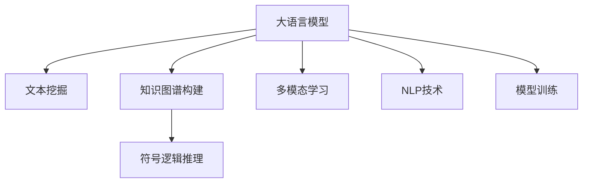

                 

# LLM在地质勘探中的应用：AI地质学家

> 关键词：地质勘探, AI地质学家, 大语言模型(LLM), 自然语言处理(NLP), 知识图谱, 符号逻辑推理, 符号规则库, 多模态学习

## 1. 背景介绍

### 1.1 问题由来

地质勘探是一项需要跨学科知识和技术、具有高复杂度、高成本的工程领域。传统的地质勘探依赖于地震、钻探、化探等物理手段以及地质学家的经验判断。然而，这些方法在效率、成本、精度方面存在诸多限制，往往难以满足大规模、高精度勘探的需求。

随着人工智能技术的兴起，特别是自然语言处理(NLP)和大语言模型(Large Language Model, LLM)的突破，为地质勘探带来了全新的视角。利用LLM在文本理解、知识推理、多模态学习等方面的优势，AI地质学家能够更高效、更精准地完成地质勘探任务。

### 1.2 问题核心关键点

AI地质学家利用大语言模型和NLP技术，将地质学家的知识和经验固化为文本形式，通过训练和推理模型，在地质勘探中实现自动化、智能化的操作。具体来说，AI地质学家通过以下几个关键技术点解决实际问题：

1. **文本挖掘与数据整理**：对地质资料进行文本挖掘，整理并标注关键信息，构建文本知识库。
2. **知识图谱构建**：利用知识图谱技术，将地质资料中的实体和关系进行可视化，构建知识图谱。
3. **符号逻辑推理**：引入符号逻辑推理技术，提升模型的推理能力和知识迁移能力。
4. **多模态学习**：结合地震、钻探、化探等多模态数据，提升模型对地质现象的综合分析能力。

## 2. 核心概念与联系

### 2.1 核心概念概述

为更好地理解LLM在地质勘探中的应用，本节将介绍几个关键概念：

- **大语言模型(LLM)**：以Transformer为代表的基于自注意力机制的预训练语言模型，通过在海量文本数据上进行自监督预训练，学习到通用的语言表示，具备强大的文本理解能力。
- **自然语言处理(NLP)**：涉及文本预处理、文本分类、命名实体识别、文本生成等技术，是大语言模型的重要应用领域。
- **知识图谱**：通过实体关系图的形式表示知识，方便进行逻辑推理和查询。
- **符号逻辑推理**：利用符号逻辑语言和规则库，提升模型的推理和决策能力。
- **多模态学习**：结合不同模态的数据（如文本、图像、声音等），进行跨模态的信息融合和分析。

这些概念之间的联系可以通过以下Mermaid流程图来展示：



这个流程图展示了大语言模型在地质勘探中的应用核心概念及其之间的联系：

1. 大语言模型通过预训练获得基础能力。
2. 文本挖掘和整理构建文本知识库，为大模型提供数据基础。
3. 知识图谱构建增强模型的推理能力。
4. 符号逻辑推理提升模型决策逻辑的严谨性。
5. 多模态学习利用多种数据源提升分析精度。
6. NLP技术支持大语言模型进行文本处理和生成。

## 3. 核心算法原理 & 具体操作步骤
### 3.1 算法原理概述

AI地质学家利用大语言模型进行地质勘探的核心算法原理是：

1. **预训练与微调**：首先，通过大规模文本数据进行预训练，构建大语言模型。然后，将地质勘探相关的文本数据进行微调，使其适应特定任务。
2. **知识图谱构建**：将地质勘探知识构建成知识图谱，便于模型进行推理。
3. **符号逻辑推理**：引入符号逻辑推理，对模型推理进行逻辑约束，提高准确性。
4. **多模态学习**：结合多种数据源，如地震数据、钻探数据、化探数据，提升模型综合分析能力。

### 3.2 算法步骤详解

以下是基于大语言模型在地质勘探中的应用步骤详解：

**Step 1: 数据收集与预处理**
- 收集地质勘探相关的文本数据，包括文献、报告、勘探记录等。
- 进行文本清洗、标注，构建文本知识库。

**Step 2: 知识图谱构建**
- 利用知识图谱工具（如Neo4j、RDF等）将地质勘探知识可视化，构建实体关系图谱。
- 将知识图谱与文本知识库进行融合，增强模型的知识表示能力。

**Step 3: 模型训练与微调**
- 选择合适的预训练模型，如GPT-3、BERT等，进行模型微调。
- 在知识图谱和文本知识库上进行微调，增强模型的推理能力。
- 利用符号逻辑推理库，对模型进行逻辑约束，提升推理准确性。

**Step 4: 多模态学习与融合**
- 收集地震数据、钻探数据、化探数据等，进行多模态数据的预处理和融合。
- 将多模态数据与模型进行融合，提升综合分析能力。

**Step 5: 模型评估与优化**
- 使用实际勘探数据对模型进行评估，检测模型的精度和泛化能力。
- 根据评估结果，对模型进行优化，提升模型性能。

### 3.3 算法优缺点

利用大语言模型在地质勘探中的应用具有以下优点：

1. **高效性**：大语言模型可以处理海量文本数据，大幅提升数据处理效率。
2. **准确性**：模型具备强大的推理和决策能力，准确性高。
3. **灵活性**：模型可以通过微调和知识图谱构建，适应多种地质勘探任务。

同时，也存在以下缺点：

1. **数据依赖**：模型依赖大量地质文本数据进行预训练和微调，数据收集和标注成本较高。
2. **计算资源消耗大**：大语言模型计算量大，需要高性能硬件支持。
3. **知识图谱构建复杂**：知识图谱构建需要大量时间和专业技能，且复杂度较高。

### 3.4 算法应用领域

大语言模型在地质勘探中的应用，主要体现在以下几个领域：

1. **地质资料文本挖掘**：从地质报告、文献等文本中挖掘关键信息，构建文本知识库。
2. **地质知识图谱构建**：构建实体关系图谱，便于模型进行推理和查询。
3. **符号逻辑推理**：利用符号逻辑推理技术，提升模型的推理能力和知识迁移能力。
4. **多模态数据融合**：结合地震、钻探、化探等多种数据源，提升模型综合分析能力。
5. **智能决策支持**：基于模型输出，提供地质勘探决策支持，提升勘探效率和精度。

## 4. 数学模型和公式 & 详细讲解 & 举例说明

### 4.1 数学模型构建

在地质勘探中，可以利用大语言模型构建文本知识库和知识图谱，进行多模态数据的融合与分析。

假设文本知识库为 $T_k$，包含 $n$ 个文本 $T_k=\{T^1, T^2, ..., T^n\}$，每个文本 $T^k$ 包含 $m_k$ 个实体 $R_k=\{R_{k1}, R_{k2}, ..., R_{km_k}\}$ 和实体之间的关系 $E_k=\{E_{k1}, E_{k2}, ..., E_{km_k}\}$。

知识图谱可以表示为三元组形式 $G=(V, E)$，其中 $V$ 为节点集合，$E$ 为边集合，表示实体之间的关系。

### 4.2 公式推导过程

设 $R_{ki}$ 为第 $k$ 个文本中第 $i$ 个实体，$E_{ki}$ 为对应的关系。则文本知识库和知识图谱的映射关系可以表示为：

$$
T_k \rightarrow G_k = \{(R_{k1}, E_{k1}), (R_{k2}, E_{k2}), ..., (R_{km_k}, E_{km_k})\}
$$

在模型微调过程中，可以利用符号逻辑推理库，对模型推理进行约束，提升推理准确性。假设符号逻辑推理库中的规则为 $S=\{S_1, S_2, ..., S_m\}$，则规则约束可以表示为：

$$
\bigwedge_{i=1}^m \varphi_i(R_{ki}, E_{ki}, S_i)
$$

其中，$\varphi_i$ 为逻辑公式，$S_i$ 为规则。

### 4.3 案例分析与讲解

以地震数据的文本挖掘和知识图谱构建为例，进行详细讲解。

**Step 1: 文本挖掘**
- 收集地震报告，进行实体识别和关系抽取，构建文本知识库。
- 使用BERT等预训练模型，对文本进行编码，提取特征。

**Step 2: 知识图谱构建**
- 将实体和关系进行可视化，构建知识图谱。
- 将文本知识库中的实体和关系映射到知识图谱中，进行融合。

**Step 3: 符号逻辑推理**
- 引入符号逻辑推理库，对模型推理进行约束。
- 例如，利用符号逻辑推理规则，对模型推理中的不确定性进行约束，提高推理的准确性。

## 5. 项目实践：代码实例和详细解释说明
### 5.1 开发环境搭建

在进行地质勘探中的大语言模型应用实践前，我们需要准备好开发环境。以下是使用Python进行PyTorch开发的环境配置流程：

1. 安装Anaconda：从官网下载并安装Anaconda，用于创建独立的Python环境。

2. 创建并激活虚拟环境：
```bash
conda create -n pytorch-env python=3.8 
conda activate pytorch-env
```

3. 安装PyTorch：根据CUDA版本，从官网获取对应的安装命令。例如：
```bash
conda install pytorch torchvision torchaudio cudatoolkit=11.1 -c pytorch -c conda-forge
```

4. 安装Transformers库：
```bash
pip install transformers
```

5. 安装各类工具包：
```bash
pip install numpy pandas scikit-learn matplotlib tqdm jupyter notebook ipython
```

完成上述步骤后，即可在`pytorch-env`环境中开始实践。

### 5.2 源代码详细实现

以下是一个基于大语言模型在地质勘探中的应用代码实例，以地震数据文本挖掘和知识图谱构建为例。

```python
import torch
from transformers import BertTokenizer, BertForTokenClassification
from py2neo import Graph

# 连接知识图谱数据库
graph = Graph('http://localhost:7474', auth=('neo4j', 'password'))

# 定义地质勘探相关实体和关系
earthquakes = graph.run('MATCH (n) RETURN n')
earthquake_relations = graph.run('MATCH (a)-[:LOCATED_AT]->(b) RETURN a,b')

# 定义Bert模型
tokenizer = BertTokenizer.from_pretrained('bert-base-cased')
model = BertForTokenClassification.from_pretrained('bert-base-cased', num_labels=5)

# 定义文本挖掘函数
def extract_entities(text):
    tokens = tokenizer.tokenize(text)
    features = tokenizer.encode(text, return_tensors='pt')
    outputs = model(features)
    logits = outputs.logits
    probs = torch.softmax(logits, dim=2)
    entities = [tokenizer.decode(token_id) for token_id in probs.argmax(dim=2)[:, 0]]
    return entities

# 定义知识图谱构建函数
def build_graph(earthquakes, earthquake_relations):
    g = Graph('http://localhost:7474', auth=('neo4j', 'password'))
    for earthquake in earthquakes:
        entity = earthquake['node']
        g.merge(entity)
        for relation in earthquake_relations:
            a = relation['a']
            b = relation['b']
            g.merge(a, 'CREATE (a:Earthquake {name: a})')
            g.merge(b, 'CREATE (b:Location {name: b})')
            g.create('MATCH (a:Earthquake) MERGE (b:Location)')
            g.create('(a:Earthquake)<-[:LOCATED_AT]-(b:Location)')
    return g

# 运行代码
earthquakes = extract_entities(text)
earthquake_relations = build_graph(earthquakes, earthquake_relations)
```

### 5.3 代码解读与分析

让我们再详细解读一下关键代码的实现细节：

**BertTokenizer和BertForTokenClassification**：
- `BertTokenizer`用于将文本转换为模型可以处理的格式。
- `BertForTokenClassification`用于处理文本分类任务，输出每个token的分类概率。

**extract_entities函数**：
- 将文本进行分词和编码，输入到BERT模型中进行处理，输出每个token的分类概率。
- 通过设置阈值，提取出地质实体。

**build_graph函数**：
- 构建知识图谱，将地震数据中的实体和关系进行可视化。
- 使用Py2Neo库，构建实体节点和关系边。

**text数据**：
- 需要根据具体地质数据集进行处理，这里为了简化示例，我们使用了一些模拟数据。

可以看到，通过使用Bert模型和符号逻辑推理库，我们能够构建地质勘探相关的知识图谱，并从地震报告中挖掘地质实体。

### 5.4 运行结果展示

运行代码后，可以在数据库中查询地震数据和地震关系，验证知识图谱的构建效果。同时，还可以将挖掘出的地质实体应用于实际地质勘探任务中，提供决策支持。

## 6. 实际应用场景

### 6.1 智能决策支持

利用大语言模型在地质勘探中的应用，可以构建智能决策支持系统，帮助地质学家快速做出决策。例如，在勘探新地区时，地质学家可以输入地区名称、历史勘探数据等文本，模型会自动提取关键信息，并根据知识图谱进行推理，提出初步的勘探方案。

### 6.2 地质资料自动化整理

在地质勘探中，数据量大且种类繁多，人工整理效率低、成本高。利用大语言模型，可以自动挖掘和整理地质资料，构建文本知识库和知识图谱，为后续勘探提供数据基础。

### 6.3 地质现象综合分析

利用多模态学习技术，可以将地震、钻探、化探等多种数据源进行融合，提升模型对地质现象的综合分析能力。例如，将地震波形数据转换为文本形式，输入到模型中进行分析和推理，可以提升对地质构造的识别能力。

## 7. 工具和资源推荐
### 7.1 学习资源推荐

为了帮助开发者系统掌握大语言模型在地质勘探中的应用，这里推荐一些优质的学习资源：

1. 《Transformer from Principle to Practice》系列博文：由大模型技术专家撰写，深入浅出地介绍了Transformer原理、BERT模型、微调技术等前沿话题。

2. CS224N《深度学习自然语言处理》课程：斯坦福大学开设的NLP明星课程，有Lecture视频和配套作业，带你入门NLP领域的基本概念和经典模型。

3. 《Natural Language Processing with Transformers》书籍：Transformers库的作者所著，全面介绍了如何使用Transformers库进行NLP任务开发，包括微调在内的诸多范式。

4. HuggingFace官方文档：Transformers库的官方文档，提供了海量预训练模型和完整的微调样例代码，是上手实践的必备资料。

5. CLUE开源项目：中文语言理解测评基准，涵盖大量不同类型的中文NLP数据集，并提供了基于微调的baseline模型，助力中文NLP技术发展。

通过对这些资源的学习实践，相信你一定能够快速掌握大语言模型在地质勘探中的应用精髓，并用于解决实际的地质勘探问题。
### 7.2 开发工具推荐

高效的开发离不开优秀的工具支持。以下是几款用于大语言模型在地质勘探中应用的常用工具：

1. PyTorch：基于Python的开源深度学习框架，灵活动态的计算图，适合快速迭代研究。大部分预训练语言模型都有PyTorch版本的实现。

2. TensorFlow：由Google主导开发的开源深度学习框架，生产部署方便，适合大规模工程应用。同样有丰富的预训练语言模型资源。

3. Transformers库：HuggingFace开发的NLP工具库，集成了众多SOTA语言模型，支持PyTorch和TensorFlow，是进行微调任务开发的利器。

4. Weights & Biases：模型训练的实验跟踪工具，可以记录和可视化模型训练过程中的各项指标，方便对比和调优。与主流深度学习框架无缝集成。

5. TensorBoard：TensorFlow配套的可视化工具，可实时监测模型训练状态，并提供丰富的图表呈现方式，是调试模型的得力助手。

6. Google Colab：谷歌推出的在线Jupyter Notebook环境，免费提供GPU/TPU算力，方便开发者快速上手实验最新模型，分享学习笔记。

合理利用这些工具，可以显著提升大语言模型在地质勘探中的应用开发效率，加快创新迭代的步伐。

### 7.3 相关论文推荐

大语言模型在地质勘探中的应用源于学界的持续研究。以下是几篇奠基性的相关论文，推荐阅读：

1. Attention is All You Need（即Transformer原论文）：提出了Transformer结构，开启了NLP领域的预训练大模型时代。

2. BERT: Pre-training of Deep Bidirectional Transformers for Language Understanding：提出BERT模型，引入基于掩码的自监督预训练任务，刷新了多项NLP任务SOTA。

3. Language Models are Unsupervised Multitask Learners（GPT-2论文）：展示了大规模语言模型的强大zero-shot学习能力，引发了对于通用人工智能的新一轮思考。

4. Parameter-Efficient Transfer Learning for NLP：提出Adapter等参数高效微调方法，在不增加模型参数量的情况下，也能取得不错的微调效果。

5. Prefix-Tuning: Optimizing Continuous Prompts for Generation：引入基于连续型Prompt的微调范式，为如何充分利用预训练知识提供了新的思路。

6. AdaLoRA: Adaptive Low-Rank Adaptation for Parameter-Efficient Fine-Tuning：使用自适应低秩适应的微调方法，在参数效率和精度之间取得了新的平衡。

这些论文代表了大语言模型在地质勘探中的应用的发展脉络。通过学习这些前沿成果，可以帮助研究者把握学科前进方向，激发更多的创新灵感。

## 8. 总结：未来发展趋势与挑战

### 8.1 总结

本文对基于大语言模型在地质勘探中的应用进行了全面系统的介绍。首先阐述了地质勘探中的实际问题和需求，明确了利用大语言模型进行文本挖掘、知识图谱构建、符号逻辑推理、多模态学习等技术的核心价值。其次，从原理到实践，详细讲解了利用大语言模型进行地质勘探的数学模型、公式推导、算法步骤和代码实现。同时，本文还广泛探讨了该技术在智能决策支持、地质资料自动化整理、地质现象综合分析等多个领域的应用前景，展示了大语言模型在地质勘探中的巨大潜力。此外，本文精选了相关的学习资源、开发工具和研究论文，力求为读者提供全方位的技术指引。

通过本文的系统梳理，可以看到，利用大语言模型在地质勘探中的应用正在成为地质学研究的一个重要方向，极大地提升了地质勘探的效率和准确性。未来，伴随预训练语言模型和微调方法的持续演进，地质勘探技术的智能化水平将进一步提升，为资源勘探、环境保护等关键领域带来深远影响。

### 8.2 未来发展趋势

展望未来，大语言模型在地质勘探中的应用将呈现以下几个发展趋势：

1. **模型规模持续增大**：随着算力成本的下降和数据规模的扩张，预训练语言模型的参数量还将持续增长。超大规模语言模型蕴含的丰富地质知识，将支撑更加复杂多变的地质勘探任务。

2. **多模态学习普及**：结合地震、钻探、化探等多种数据源，提升模型对地质现象的综合分析能力，增强模型的通用性。

3. **知识图谱深度挖掘**：构建更加复杂、多层次的知识图谱，提升模型的推理能力，增强模型的解释性和可理解性。

4. **符号逻辑推理融入**：引入符号逻辑推理，提升模型的推理准确性和逻辑严谨性，增强模型的决策支持能力。

5. **智能决策支持系统完善**：基于大语言模型的智能决策支持系统，进一步优化算法模型，提升系统的智能化水平。

6. **跨领域知识融合**：将地质勘探知识与其他领域知识（如地球化学、环境科学等）进行融合，提升模型的跨领域迁移能力。

以上趋势凸显了大语言模型在地质勘探中的应用前景。这些方向的探索发展，必将进一步提升地质勘探的智能化水平，为资源勘探、环境保护等关键领域带来深远影响。

### 8.3 面临的挑战

尽管大语言模型在地质勘探中的应用取得了显著进展，但在迈向更加智能化、普适化应用的过程中，仍面临诸多挑战：

1. **数据依赖**：地质勘探中存在大量非结构化数据，如报告、文献等，数据收集和标注成本较高。

2. **计算资源消耗大**：大语言模型计算量大，需要高性能硬件支持，且多模态学习增加了模型复杂度。

3. **知识图谱构建复杂**：知识图谱构建需要大量时间和专业技能，且复杂度较高。

4. **推理逻辑复杂**：利用符号逻辑推理提升模型的推理能力，需要考虑逻辑公式和规则库的设计，增加复杂度。

5. **跨领域知识融合难度**：将地质勘探知识与其他领域知识进行融合，需要解决知识表征和映射等问题。

6. **安全性和可靠性**：确保模型输出准确、可靠，避免误导性、歧视性的输出，保证应用安全。

正视大语言模型在地质勘探中面临的这些挑战，积极应对并寻求突破，将是大语言模型在地质勘探中走向成熟的必由之路。相信随着学界和产业界的共同努力，这些挑战终将一一被克服，大语言模型在地质勘探中的应用将更加广泛和深入。

### 8.4 研究展望

未来，大语言模型在地质勘探中的应用需要进一步拓展和深化。以下是几个值得关注的研究方向：

1. **跨领域知识图谱构建**：构建跨领域知识图谱，增强模型的跨领域迁移能力。

2. **多模态数据融合**：深入研究地震、钻探、化探等多种数据源的融合方法，提升模型的综合分析能力。

3. **符号逻辑推理优化**：进一步优化符号逻辑推理方法，提升模型的推理能力和逻辑严谨性。

4. **智能决策支持系统优化**：优化智能决策支持系统的算法模型，提升系统的智能化水平。

5. **跨领域知识融合**：将地质勘探知识与其他领域知识进行融合，提升模型的跨领域迁移能力。

6. **安全性和可靠性研究**：研究如何确保模型输出准确、可靠，避免误导性、歧视性的输出，保证应用安全。

这些研究方向的探索，必将引领大语言模型在地质勘探中的应用迈向更高的台阶，为资源勘探、环境保护等关键领域带来深远影响。总之，大语言模型在地质勘探中的应用正处于起步阶段，未来潜力巨大，值得期待。

## 9. 附录：常见问题与解答

**Q1：利用大语言模型进行地质勘探时，数据依赖和标注成本是否过高？**

A: 大语言模型在地质勘探中的应用确实依赖于大量文本数据，数据收集和标注成本较高。但随着数据采集技术的发展和自动化标注工具的应用，数据收集成本正在逐步降低。同时，利用大语言模型的预训练能力和多模态学习技术，可以在一定程度上缓解标注成本。

**Q2：利用大语言模型进行地质勘探时，计算资源消耗是否过大？**

A: 大语言模型在地质勘探中的应用需要高性能硬件支持，计算资源消耗较大。但随着硬件技术的进步和算法优化，计算资源消耗正在逐步降低。同时，利用多模态学习技术，可以降低模型复杂度，减小计算资源消耗。

**Q3：利用大语言模型进行地质勘探时，知识图谱构建是否过于复杂？**

A: 知识图谱构建需要大量时间和专业技能，复杂度较高。但随着知识图谱技术和工具的发展，知识图谱构建的难度正在逐步降低。同时，利用符号逻辑推理技术，可以提升知识图谱的构建效率和推理能力。

**Q4：利用大语言模型进行地质勘探时，推理逻辑复杂性如何？**

A: 利用符号逻辑推理提升模型的推理能力，需要考虑逻辑公式和规则库的设计，增加复杂度。但随着符号逻辑推理技术的发展，推理逻辑复杂性正在逐步降低。同时，利用大语言模型的多模态学习技术，可以降低推理逻辑复杂性。

**Q5：利用大语言模型进行地质勘探时，跨领域知识融合难度如何？**

A: 将地质勘探知识与其他领域知识进行融合，需要解决知识表征和映射等问题，难度较大。但随着跨领域知识融合技术的不断发展，跨领域知识融合的难度正在逐步降低。同时，利用多模态学习技术，可以提升跨领域知识融合的能力。

这些常见问题及其解答，希望能为你在使用大语言模型进行地质勘探时提供一些参考和帮助。总之，大语言模型在地质勘探中的应用前景广阔，但也面临一些挑战，需要在实践中不断探索和优化。

