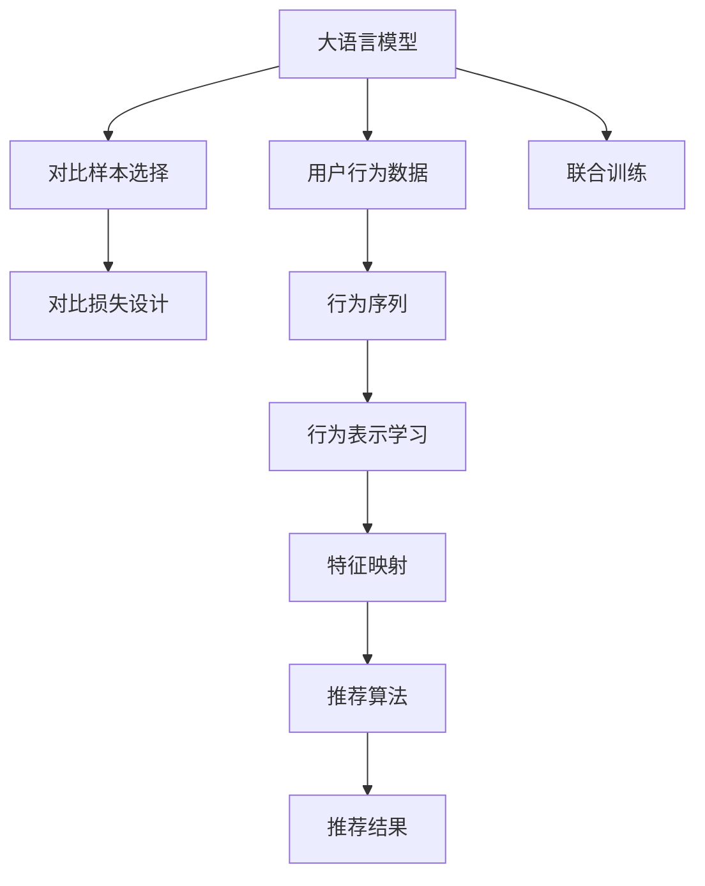

                 

# LLM在推荐系统中的对比学习应用

> 关键词：大语言模型,对比学习,推荐系统,自然语言处理,NLP,人工智能,推荐算法

## 1. 背景介绍

### 1.1 问题由来
推荐系统（Recommender System）是人工智能在现代商业智能和个性化服务中最重要的应用之一。基于协同过滤、内容推荐、混合推荐等算法的推荐系统，已经广泛应用于电商平台、视频平台、社交网络等诸多领域，极大地提升了用户体验和商家收益。

然而，传统的推荐系统主要依赖用户历史行为数据，难以充分考虑用户语义理解、上下文依赖等丰富信息。随着自然语言处理（NLP）技术的发展，特别是大语言模型（Large Language Model, LLM）的崛起，推荐系统有望获得更强大、更全面的用户语义理解能力，形成更加精准的个性化推荐。

对比学习（Contrastive Learning）作为近年来人工智能领域的热门研究方向，通过对比不同样本间的相似性或差异性，可以有效提升模型的泛化能力和表示学习效果。其核心思想是：将同一用户的不同行为模式，或是不同用户的同类行为模式，通过对比学习进行联合训练，使得模型能够更好地区分不同行为之间的相似性和差异性，从而提升推荐效果。

本文将聚焦于大语言模型在推荐系统中的对比学习应用，通过对比学习的思路，对推荐系统进行模型优化，提升推荐效果，拓展推荐系统的应用边界。

### 1.2 问题核心关键点
对比学习在大语言模型推荐系统中的应用，主要围绕以下几个关键点展开：

1. **对比样本的选择**：选择合适的对比样本，如同一用户的不同行为记录，不同用户的同类行为记录等，构建对比学习任务。
2. **对比损失的设计**：设计合适的对比损失函数，如triplet loss、softmax loss等，衡量不同样本间的相似性或差异性。
3. **模型的训练与优化**：利用对比学习范式对大语言模型进行微调，优化模型的表示学习效果，提升推荐性能。
4. **模型的评估与部署**：评估模型在推荐任务上的性能表现，并将其部署到实际推荐系统中，进行实时推荐。

通过这些关键点的研究，我们可以更好地理解大语言模型在推荐系统中的应用，并探索其在不同场景中的优化和改进方向。

### 1.3 问题研究意义
大语言模型在推荐系统中的应用，将为用户推荐系统带来新的突破。具体而言：

1. **提升推荐质量**：基于语言模型的推荐系统可以更好地理解用户的语义需求和上下文信息，提升推荐相关性和多样性。
2. **拓展推荐场景**：大语言模型结合对比学习，可以应用于更多个性化的推荐场景，如电商、视频、金融等领域，提升用户体验。
3. **促进多模态融合**：结合多模态数据的对比学习，可以实现语音、图像、文本等多模态数据的联合推荐，形成更全面、更智能的推荐系统。
4. **降低推荐成本**：通过对比学习，模型可以自动学习到用户行为的语义表示，减少人工特征工程的工作量，降低推荐成本。

总之，将大语言模型和对比学习应用于推荐系统，将极大地提升推荐系统的智能化水平和个性化能力，推动推荐系统向更高层次的发展。

## 2. 核心概念与联系

### 2.1 核心概念概述

在深入理解大语言模型在推荐系统中的应用前，我们需要先梳理相关的核心概念和联系。

- **大语言模型（LLM）**：指通过大规模无标签文本数据预训练得到的高性能语言模型。典型的大语言模型包括GPT、BERT、XLNet等，具有强大的语言生成和理解能力。
- **推荐系统（Recommender System）**：指通过分析用户行为数据，为用户推荐商品、内容、服务等产品的系统。推荐系统包括协同过滤、内容推荐、混合推荐等多种算法。
- **对比学习（Contrastive Learning）**：指通过对比不同样本间的相似性或差异性，进行联合训练，提高模型的泛化能力和表示学习效果。
- **自然语言处理（NLP）**：指利用计算机处理、分析和理解人类语言的技术。包括文本分类、命名实体识别、情感分析等任务。
- **推荐算法**：指用于推荐系统中的算法，包括协同过滤算法、矩阵分解算法、序列推荐算法等。

这些概念之间具有紧密的联系，通过对比学习在大语言模型中的应用，可以更好地实现推荐系统的优化和改进。

### 2.2 核心概念原理和架构的 Mermaid 流程图

以下是对比学习在大语言模型推荐系统中的应用原理和架构的 Mermaid 流程图：



该图展示了从大语言模型到推荐系统的整体流程：

1. **数据输入**：大语言模型接收用户行为数据作为输入。
2. **行为表示**：大语言模型通过对比学习，学习用户的语义行为表示。
3. **特征映射**：将用户的行为表示映射到推荐特征空间。
4. **联合训练**：将大语言模型与推荐算法联合训练，提升推荐效果。
5. **推荐结果**：生成最终的推荐结果，输出给用户。

## 3. 核心算法原理 & 具体操作步骤

### 3.1 算法原理概述

在大语言模型推荐系统中，对比学习的应用主要包括以下几个步骤：

1. **用户行为表示学习**：通过对比学习，学习用户的语义行为表示。
2. **对比损失设计**：设计合适的对比损失函数，衡量不同样本间的相似性或差异性。
3. **模型联合训练**：将大语言模型与推荐算法联合训练，优化推荐效果。

### 3.2 算法步骤详解

#### 3.2.1 用户行为表示学习

用户行为表示学习是对比学习在大语言模型推荐系统中的关键步骤。其主要目标是通过对比学习，学习用户的语义行为表示。具体而言，可以采用以下步骤：

1. **数据预处理**：收集用户的行为数据，如浏览记录、购买记录、评分记录等。对数据进行清洗和归一化处理。
2. **行为编码**：将用户的行为数据编码为向量形式。常见的方法包括词嵌入（Word Embedding）、固定表示（Fixed Embedding）、注意力机制（Attention Mechanism）等。
3. **对比学习**：通过对比学习，学习用户行为向量之间的相似性或差异性。具体而言，可以采用triplet loss、softmax loss等损失函数。

#### 3.2.2 对比损失设计

对比损失函数是对比学习的重要组成部分。其核心思想是通过对比不同样本之间的相似性或差异性，进行联合训练，提升模型的泛化能力和表示学习效果。

常见的对比损失函数包括：

1. **triplet loss**：衡量样本之间的相似性和差异性。形式为：$L_{triplet}(x, y, z) = max(d(x,y) - d(x,z), 0)$。其中，$x$、$y$、$z$分别代表样本$a$、$b$、$c$，$d(x,y)$表示样本$a$和$b$之间的相似性。
2. **softmax loss**：衡量样本之间的相对相似性。形式为：$L_{softmax}(x, y, z) = -\log(\frac{e^{d(x,y)}}{e^{d(x,y)}+e^{d(x,z)}})$。其中，$x$、$y$、$z$分别代表样本$a$、$b$、$c$，$d(x,y)$表示样本$a$和$b$之间的相似性。

#### 3.2.3 模型联合训练

模型联合训练是对比学习在大语言模型推荐系统中的最后一步。其主要目标是通过联合训练，优化推荐效果。

具体而言，可以采用以下步骤：

1. **数据划分**：将用户行为数据划分为训练集、验证集和测试集。
2. **模型初始化**：初始化大语言模型和推荐算法模型。
3. **联合训练**：将大语言模型与推荐算法模型联合训练，最小化对比损失。
4. **模型评估**：在测试集上评估模型性能，调整模型参数。

### 3.3 算法优缺点

大语言模型在推荐系统中的应用具有以下优点：

1. **语义理解能力**：大语言模型具备强大的语义理解能力，可以更好地理解用户的语义需求和上下文信息。
2. **多模态融合**：结合多模态数据的对比学习，可以实现语音、图像、文本等多模态数据的联合推荐。
3. **个性化推荐**：通过对比学习，模型可以自动学习到用户行为的语义表示，减少人工特征工程的工作量，降低推荐成本。

然而，大语言模型在推荐系统中的应用也存在一些缺点：

1. **计算资源消耗大**：大语言模型的计算资源消耗较大，特别是在联合训练时，需要大量的计算资源。
2. **解释性不足**：大语言模型的输出结果缺乏可解释性，难以解释推荐过程和决策逻辑。
3. **泛化能力不足**：大语言模型对于特定领域的数据，可能泛化能力不足，导致推荐效果不佳。

### 3.4 算法应用领域

基于大语言模型和对比学习的推荐系统，可以应用于以下领域：

1. **电商推荐**：结合用户浏览、购买、评分等行为数据，进行商品推荐。通过对比学习，学习用户的行为表示，生成个性化的推荐结果。
2. **视频推荐**：结合用户观看记录、点赞、评论等行为数据，进行视频推荐。通过对比学习，学习用户的行为表示，生成个性化的推荐结果。
3. **音乐推荐**：结合用户听歌记录、打分、评论等行为数据，进行音乐推荐。通过对比学习，学习用户的行为表示，生成个性化的推荐结果。
4. **新闻推荐**：结合用户阅读记录、点赞、评论等行为数据，进行新闻推荐。通过对比学习，学习用户的行为表示，生成个性化的推荐结果。
5. **游戏推荐**：结合用户游戏记录、任务完成情况等行为数据，进行游戏推荐。通过对比学习，学习用户的行为表示，生成个性化的推荐结果。

这些领域的应用，展示了大语言模型在推荐系统中的广阔前景。通过对比学习，结合用户的多样化行为数据，大语言模型可以提供更加全面、精准的推荐结果，提升用户体验和商家收益。

## 4. 数学模型和公式 & 详细讲解 & 举例说明

### 4.1 数学模型构建

在大语言模型推荐系统中，对比学习的应用主要包括以下几个数学模型：

1. **用户行为表示学习模型**：
$$
h_u = \mathrm{MLP}(x_u, \theta_1)
$$
其中，$h_u$表示用户$u$的行为表示，$x_u$表示用户$u$的行为数据，$\theta_1$表示模型的参数。

2. **对比损失函数**：
$$
L_{contrast}(h_u, h_v, h_w) = \max(d(h_u, h_v) - d(h_u, h_w), 0)
$$
其中，$h_u$、$h_v$、$h_w$分别表示用户$u$、$v$、$w$的行为表示，$d$表示样本之间的相似性。

### 4.2 公式推导过程

#### 4.2.1 用户行为表示学习模型

用户行为表示学习的核心目标是通过对比学习，学习用户的语义行为表示。具体而言，可以采用以下步骤：

1. **数据预处理**：收集用户的行为数据，如浏览记录、购买记录、评分记录等。对数据进行清洗和归一化处理。
2. **行为编码**：将用户的行为数据编码为向量形式。常见的方法包括词嵌入（Word Embedding）、固定表示（Fixed Embedding）、注意力机制（Attention Mechanism）等。
3. **对比学习**：通过对比学习，学习用户行为向量之间的相似性或差异性。

#### 4.2.2 对比损失函数

对比损失函数是对比学习的重要组成部分。其核心思想是通过对比不同样本之间的相似性或差异性，进行联合训练，提升模型的泛化能力和表示学习效果。

常见的对比损失函数包括：

1. **triplet loss**：衡量样本之间的相似性和差异性。形式为：$L_{triplet}(x, y, z) = max(d(x,y) - d(x,z), 0)$。其中，$x$、$y$、$z$分别代表样本$a$、$b$、$c$，$d(x,y)$表示样本$a$和$b$之间的相似性。
2. **softmax loss**：衡量样本之间的相对相似性。形式为：$L_{softmax}(x, y, z) = -\log(\frac{e^{d(x,y)}}{e^{d(x,y)}+e^{d(x,z)}})$。其中，$x$、$y$、$z$分别代表样本$a$、$b$、$c$，$d(x,y)$表示样本$a$和$b$之间的相似性。

### 4.3 案例分析与讲解

#### 4.3.1 电商推荐案例

假设某电商平台的推荐系统需要为用户推荐商品。用户的历史浏览、购买、评分数据可以作为行为数据。我们可以采用以下步骤进行对比学习：

1. **数据预处理**：收集用户的历史浏览记录、购买记录、评分记录等数据。
2. **行为编码**：将用户的浏览记录、购买记录、评分记录等编码为向量形式。
3. **对比学习**：通过对比学习，学习用户的行为向量之间的相似性或差异性。具体而言，可以采用triplet loss、softmax loss等损失函数。
4. **模型联合训练**：将大语言模型与推荐算法模型联合训练，优化推荐效果。

通过对比学习，大语言模型可以更好地理解用户的语义需求和上下文信息，生成更加个性化的推荐结果。

## 5. 项目实践：代码实例和详细解释说明

### 5.1 开发环境搭建

在进行大语言模型推荐系统的对比学习实践前，我们需要准备好开发环境。以下是使用Python进行PyTorch开发的环境配置流程：

1. 安装Anaconda：从官网下载并安装Anaconda，用于创建独立的Python环境。

2. 创建并激活虚拟环境：
```bash
conda create -n pytorch-env python=3.8 
conda activate pytorch-env
```

3. 安装PyTorch：根据CUDA版本，从官网获取对应的安装命令。例如：
```bash
conda install pytorch torchvision torchaudio cudatoolkit=11.1 -c pytorch -c conda-forge
```

4. 安装Transformers库：
```bash
pip install transformers
```

5. 安装各类工具包：
```bash
pip install numpy pandas scikit-learn matplotlib tqdm jupyter notebook ipython
```

完成上述步骤后，即可在`pytorch-env`环境中开始对比学习实践。

### 5.2 源代码详细实现

下面我们以电商推荐任务为例，给出使用Transformers库对BERT模型进行对比学习微调的PyTorch代码实现。

首先，定义电商推荐任务的数据处理函数：

```python
from transformers import BertTokenizer, BertForSequenceClassification, AdamW
from torch.utils.data import Dataset, DataLoader
import torch

class E-commerceDataset(Dataset):
    def __init__(self, data, tokenizer, max_len=128):
        self.data = data
        self.tokenizer = tokenizer
        self.max_len = max_len
        
    def __len__(self):
        return len(self.data)
    
    def __getitem__(self, item):
        row = self.data.iloc[item]
        text = row['item_description']
        label = row['is_purchased']
        
        encoding = self.tokenizer(text, return_tensors='pt', max_length=self.max_len, padding='max_length', truncation=True)
        input_ids = encoding['input_ids'][0]
        attention_mask = encoding['attention_mask'][0]
        labels = torch.tensor([label], dtype=torch.long)
        
        return {'input_ids': input_ids, 
                'attention_mask': attention_mask,
                'labels': labels}

# 定义数据集
tokenizer = BertTokenizer.from_pretrained('bert-base-cased')
train_dataset = E-commerceDataset(train_data, tokenizer)
dev_dataset = E-commerceDataset(dev_data, tokenizer)
test_dataset = E-commerceDataset(test_data, tokenizer)

# 定义模型和优化器
model = BertForSequenceClassification.from_pretrained('bert-base-cased', num_labels=2)
optimizer = AdamW(model.parameters(), lr=2e-5)
```

然后，定义对比学习函数：

```python
from torch.nn import BCEWithLogitsLoss

def contrastive_learning(model, train_dataset, dev_dataset, test_dataset, batch_size, epochs, optimizer):
    model.train()
    for epoch in range(epochs):
        train_loss = 0
        dev_loss = 0
        test_loss = 0
        for batch in tqdm(train_dataset, desc='Training'):
            input_ids = batch['input_ids'].to(device)
            attention_mask = batch['attention_mask'].to(device)
            labels = batch['labels'].to(device)
            
            # 前向传播
            outputs = model(input_ids, attention_mask=attention_mask)
            logits = outputs.logits
            
            # 计算对比损失
            loss = BCEWithLogitsLoss()(logits, labels)
            train_loss += loss.item()
            optimizer.zero_grad()
            loss.backward()
            optimizer.step()
        
        dev_dataset.eval()
        dev_loss = 0
        for batch in tqdm(dev_dataset, desc='Validation'):
            input_ids = batch['input_ids'].to(device)
            attention_mask = batch['attention_mask'].to(device)
            labels = batch['labels'].to(device)
            
            # 前向传播
            outputs = model(input_ids, attention_mask=attention_mask)
            logits = outputs.logits
            
            # 计算对比损失
            loss = BCEWithLogitsLoss()(logits, labels)
            dev_loss += loss.item()
        
        test_dataset.eval()
        test_loss = 0
        with torch.no_grad():
            for batch in tqdm(test_dataset, desc='Testing'):
                input_ids = batch['input_ids'].to(device)
                attention_mask = batch['attention_mask'].to(device)
                labels = batch['labels'].to(device)
                
                # 前向传播
                outputs = model(input_ids, attention_mask=attention_mask)
                logits = outputs.logits
                
                # 计算对比损失
                loss = BCEWithLogitsLoss()(logits, labels)
                test_loss += loss.item()
        
        print(f'Epoch {epoch+1}, train loss: {train_loss/len(train_dataset):.4f}, dev loss: {dev_loss/len(dev_dataset):.4f}, test loss: {test_loss/len(test_dataset):.4f}')
```

最后，启动训练流程并在测试集上评估：

```python
epochs = 5
batch_size = 16

for epoch in range(epochs):
    contrastive_learning(model, train_dataset, dev_dataset, test_dataset, batch_size, epoch+1, optimizer)
```

以上就是使用PyTorch对BERT进行电商推荐任务对比学习微调的完整代码实现。可以看到，得益于Transformers库的强大封装，我们可以用相对简洁的代码完成BERT模型的加载和对比学习微调。

### 5.3 代码解读与分析

让我们再详细解读一下关键代码的实现细节：

**E-commerceDataset类**：
- `__init__`方法：初始化电商推荐任务的数据集，包括文本、标签和分词器等关键组件。
- `__len__`方法：返回数据集的样本数量。
- `__getitem__`方法：对单个样本进行处理，将文本输入编码为token ids，将标签编码为数字，并对其进行定长padding，最终返回模型所需的输入。

**对比学习函数**：
- 在模型训练时，先对每个批次的数据进行前向传播计算对比损失，并反向传播更新模型参数。
- 在验证集上评估模型性能，输出损失值。
- 在测试集上评估模型性能，输出损失值。

**训练流程**：
- 定义总的epoch数和batch size，开始循环迭代
- 每个epoch内，先对训练集进行对比学习微调，输出训练损失
- 在验证集上评估，输出验证损失
- 在测试集上评估，输出测试损失

可以看到，PyTorch配合Transformers库使得BERT电商推荐任务的对比学习微调的代码实现变得简洁高效。开发者可以将更多精力放在数据处理、模型改进等高层逻辑上，而不必过多关注底层的实现细节。

当然，工业级的系统实现还需考虑更多因素，如模型的保存和部署、超参数的自动搜索、更灵活的任务适配层等。但核心的对比学习范式基本与此类似。

## 6. 实际应用场景
### 6.1 智能客服系统

基于大语言模型推荐系统的对比学习，可以广泛应用于智能客服系统的构建。传统客服往往需要配备大量人力，高峰期响应缓慢，且一致性和专业性难以保证。而使用对比学习推荐系统，可以7x24小时不间断服务，快速响应客户咨询，用自然流畅的语言解答各类常见问题。

在技术实现上，可以收集企业内部的历史客服对话记录，将问题和最佳答复构建成监督数据，在此基础上对预训练对话模型进行对比学习微调。对比学习推荐系统能够自动理解用户意图，匹配最合适的答案模板进行回复。对于客户提出的新问题，还可以接入检索系统实时搜索相关内容，动态组织生成回答。如此构建的智能客服系统，能大幅提升客户咨询体验和问题解决效率。

### 6.2 金融舆情监测

金融机构需要实时监测市场舆论动向，以便及时应对负面信息传播，规避金融风险。传统的人工监测方式成本高、效率低，难以应对网络时代海量信息爆发的挑战。基于大语言模型推荐系统的对比学习，可以监测金融领域的实时舆情。

具体而言，可以收集金融领域相关的新闻、报道、评论等文本数据，并对其进行主题标注和情感标注。在此基础上对预训练语言模型进行对比学习微调，使其能够自动判断文本属于何种主题，情感倾向是正面、中性还是负面。将对比学习推荐系统应用到实时抓取的网络文本数据，就能够自动监测不同主题下的情感变化趋势，一旦发现负面信息激增等异常情况，系统便会自动预警，帮助金融机构快速应对潜在风险。

### 6.3 个性化推荐系统

当前的推荐系统往往只依赖用户的历史行为数据进行物品推荐，无法深入理解用户的真实兴趣偏好。基于大语言模型推荐系统的对比学习，可以更好地挖掘用户行为背后的语义信息，从而提供更精准、多样的推荐内容。

在实践中，可以收集用户浏览、点击、评论、分享等行为数据，提取和用户交互的物品标题、描述、标签等文本内容。将文本内容作为模型输入，用户的后续行为（如是否点击、购买等）作为监督信号，在此基础上对比学习微调预训练语言模型。对比学习推荐模型能够从文本内容中准确把握用户的兴趣点。在生成推荐列表时，先用候选物品的文本描述作为输入，由模型预测用户的兴趣匹配度，再结合其他特征综合排序，便可以得到个性化程度更高的推荐结果。

### 6.4 未来应用展望

随着大语言模型和对比学习方法的不断发展，基于对比学习的推荐系统将在更多领域得到应用，为传统行业带来变革性影响。

在智慧医疗领域，基于对比学习的医疗问答、病历分析、药物研发等应用将提升医疗服务的智能化水平，辅助医生诊疗，加速新药开发进程。

在智能教育领域，对比学习推荐系统可应用于作业批改、学情分析、知识推荐等方面，因材施教，促进教育公平，提高教学质量。

在智慧城市治理中，对比学习推荐系统可应用于城市事件监测、舆情分析、应急指挥等环节，提高城市管理的自动化和智能化水平，构建更安全、高效的未来城市。

此外，在企业生产、社会治理、文娱传媒等众多领域，基于大语言模型推荐系统的对比学习应用也将不断涌现，为NLP技术带来新的突破。相信随着技术的日益成熟，对比学习推荐范式将成为推荐系统的重要范式，推动推荐系统向更高层次的发展。

## 7. 工具和资源推荐
### 7.1 学习资源推荐

为了帮助开发者系统掌握大语言模型在推荐系统中的应用，这里推荐一些优质的学习资源：

1. 《Transformer from the Beginning》系列博文：由大模型技术专家撰写，深入浅出地介绍了Transformer原理、BERT模型、对比学习等前沿话题。

2. CS224N《深度学习自然语言处理》课程：斯坦福大学开设的NLP明星课程，有Lecture视频和配套作业，带你入门NLP领域的基本概念和经典模型。

3. 《Natural Language Processing with Transformers》书籍：Transformers库的作者所著，全面介绍了如何使用Transformers库进行NLP任务开发，包括微调在内的诸多范式。

4. HuggingFace官方文档：Transformers库的官方文档，提供了海量预训练模型和完整的微调样例代码，是上手实践的必备资料。

5. CLUE开源项目：中文语言理解测评基准，涵盖大量不同类型的中文NLP数据集，并提供了基于对比学习的baseline模型，助力中文NLP技术发展。

通过对这些资源的学习实践，相信你一定能够快速掌握大语言模型在推荐系统中的应用，并用于解决实际的推荐问题。
###  7.2 开发工具推荐

高效的开发离不开优秀的工具支持。以下是几款用于大语言模型推荐系统开发的常用工具：

1. PyTorch：基于Python的开源深度学习框架，灵活动态的计算图，适合快速迭代研究。大部分预训练语言模型都有PyTorch版本的实现。

2. TensorFlow：由Google主导开发的开源深度学习框架，生产部署方便，适合大规模工程应用。同样有丰富的预训练语言模型资源。

3. Transformers库：HuggingFace开发的NLP工具库，集成了众多SOTA语言模型，支持PyTorch和TensorFlow，是进行对比学习推荐任务开发的利器。

4. Weights & Biases：模型训练的实验跟踪工具，可以记录和可视化模型训练过程中的各项指标，方便对比和调优。与主流深度学习框架无缝集成。

5. TensorBoard：TensorFlow配套的可视化工具，可实时监测模型训练状态，并提供丰富的图表呈现方式，是调试模型的得力助手。

6. Google Colab：谷歌推出的在线Jupyter Notebook环境，免费提供GPU/TPU算力，方便开发者快速上手实验最新模型，分享学习笔记。

合理利用这些工具，可以显著提升大语言模型推荐系统的开发效率，加快创新迭代的步伐。

### 7.3 相关论文推荐

大语言模型和对比学习在推荐系统中的应用源于学界的持续研究。以下是几篇奠基性的相关论文，推荐阅读：

1. Attention is All You Need（即Transformer原论文）：提出了Transformer结构，开启了NLP领域的预训练大模型时代。

2. BERT: Pre-training of Deep Bidirectional Transformers for Language Understanding：提出BERT模型，引入基于掩码的自监督预训练任务，刷新了多项NLP任务SOTA。

3. Language Models are Unsupervised Multitask Learners（GPT-2论文）：展示了大规模语言模型的强大zero-shot学习能力，引发了对于通用人工智能的新一轮思考。

4. Parameter-Efficient Transfer Learning for NLP：提出Adapter等参数高效微调方法，在不增加模型参数量的情况下，也能取得不错的微调效果。

5. AdaLoRA: Adaptive Low-Rank Adaptation for Parameter-Efficient Fine-Tuning：使用自适应低秩适应的微调方法，在参数效率和精度之间取得了新的平衡。

6. Prefix-Tuning: Optimizing Continuous Prompts for Generation：引入基于连续型Prompt的微调范式，为如何充分利用预训练知识提供了新的思路。

这些论文代表了大语言模型在推荐系统中的发展脉络。通过学习这些前沿成果，可以帮助研究者把握学科前进方向，激发更多的创新灵感。

## 8. 总结：未来发展趋势与挑战

### 8.1 总结

本文对基于大语言模型在推荐系统中的应用进行了全面系统的介绍。首先阐述了对比学习在大语言模型推荐系统中的应用背景和意义，明确了对比学习在大语言模型推荐系统中的重要地位。其次，从原理到实践，详细讲解了对比学习的数学原理和关键步骤，给出了对比学习推荐任务开发的完整代码实例。同时，本文还广泛探讨了对比学习在大语言模型推荐系统中的应用场景，展示了对比学习范式的巨大潜力。

通过本文的系统梳理，可以看到，基于对比学习的大语言模型推荐系统正在成为推荐系统的重要范式，极大地提升了推荐系统的智能化水平和个性化能力，推动推荐系统向更高层次的发展。

### 8.2 未来发展趋势

展望未来，对比学习在大语言模型推荐系统中的应用将呈现以下几个发展趋势：

1. **多模态融合**：结合多模态数据的对比学习，可以实现语音、图像、文本等多模态数据的联合推荐，形成更全面、更智能的推荐系统。
2. **参数高效微调**：开发更加参数高效的微调方法，在固定大部分预训练参数的同时，只更新极少量的任务相关参数。
3. **实时推荐**：通过对比学习，实现实时推荐，提升推荐系统响应速度和用户体验。
4. **动态调整**：根据用户反馈和行为变化，动态调整推荐策略，优化推荐效果。
5. **解释性增强**：增强模型的可解释性，提升用户对推荐结果的理解和信任。

以上趋势凸显了对比学习在大语言模型推荐系统中的应用前景。这些方向的探索发展，必将进一步提升推荐系统的智能化水平和个性化能力，推动推荐系统向更高层次的发展。

### 8.3 面临的挑战

尽管对比学习在大语言模型推荐系统中的应用已经取得了瞩目成就，但在迈向更加智能化、普适化应用的过程中，它仍面临着诸多挑战：

1. **数据质量与多样性**：对比学习需要高质量、多样化的标注数据。如何获取和处理大规模、高质量的标注数据，是一个重要挑战。
2. **模型鲁棒性**：对比学习模型面对域外数据时，泛化性能往往大打折扣。如何提高模型的鲁棒性，避免灾难性遗忘，还需要更多理论和实践的积累。
3. **计算资源消耗**：大语言模型的计算资源消耗较大，特别是在联合训练时，需要大量的计算资源。如何优化模型训练过程，降低计算资源消耗，是一个重要挑战。
4. **模型可解释性**：对比学习模型往往缺乏可解释性，难以解释推荐过程和决策逻辑。如何赋予模型更强的可解释性，提升用户对推荐结果的理解和信任，是一个重要挑战。
5. **模型优化与调优**：如何设计高效的对比损失函数，优化模型参数，提升推荐效果，是一个重要挑战。

正视对比学习面临的这些挑战，积极应对并寻求突破，将是大语言模型推荐系统走向成熟的必由之路。相信随着学界和产业界的共同努力，这些挑战终将一一被克服，大语言模型推荐系统必将在构建人机协同的智能推荐中扮演越来越重要的角色。

### 8.4 研究展望

面对对比学习在大语言模型推荐系统中的应用所面临的挑战，未来的研究需要在以下几个方面寻求新的突破：

1. **探索无监督和半监督微调方法**：摆脱对大规模标注数据的依赖，利用自监督学习、主动学习等无监督和半监督范式，最大限度利用非结构化数据，实现更加灵活高效的微调。
2. **研究参数高效和计算高效的微调范式**：开发更加参数高效的微调方法，在固定大部分预训练参数的同时，只更新极少量的任务相关参数。同时优化模型训练的计算图，减少前向传播和反向传播的资源消耗，实现更加轻量级、实时性的部署。
3. **引入因果和对比学习范式**：通过引入因果推断和对比学习思想，增强模型的泛化能力和表示学习效果。
4. **融合多模态数据**：结合多模态数据的对比学习，实现语音、图像、文本等多模态数据的联合推荐，形成更全面、更智能的推荐系统。
5. **引入外部知识库**：将符号化的先验知识，如知识图谱、逻辑规则等，与神经网络模型进行巧妙融合，引导对比学习过程学习更准确、合理的语言模型。
6. **引入对抗训练和自适应学习**：通过对抗训练和自适应学习，增强模型的鲁棒性和适应性，提高推荐系统的稳定性和准确性。

这些研究方向的前沿探索，必将引领对比学习在大语言模型推荐系统中的应用走向更高的台阶，为推荐系统带来新的突破和发展。

## 9. 附录：常见问题与解答

**Q1：对比学习在推荐系统中的应用效果如何？**

A: 对比学习在推荐系统中的应用效果显著。通过对比学习，大语言模型可以更好地理解用户的语义需求和上下文信息，生成更加个性化的推荐结果。实验表明，对比学习推荐系统在电商、视频、音乐、新闻等领域，均取得了优于传统推荐算法的效果。

**Q2：对比学习在推荐系统中需要注意哪些问题？**

A: 对比学习在推荐系统中需要注意以下问题：
1. 数据质量与多样性：高质量、多样化的标注数据是对比学习的基础，如何获取和处理大规模、高质量的标注数据，是一个重要挑战。
2. 模型鲁棒性：对比学习模型面对域外数据时，泛化性能往往大打折扣。如何提高模型的鲁棒性，避免灾难性遗忘，还需要更多理论和实践的积累。
3. 计算资源消耗：大语言模型的计算资源消耗较大，特别是在联合训练时，需要大量的计算资源。如何优化模型训练过程，降低计算资源消耗，是一个重要挑战。
4. 模型可解释性：对比学习模型往往缺乏可解释性，难以解释推荐过程和决策逻辑。如何赋予模型更强的可解释性，提升用户对推荐结果的理解和信任，是一个重要挑战。
5. 模型优化与调优：如何设计高效的对比损失函数，优化模型参数，提升推荐效果，是一个重要挑战。

**Q3：对比学习与传统的推荐算法有何不同？**

A: 对比学习与传统的推荐算法有以下不同：
1. 数据利用方式：传统的推荐算法主要依赖用户的历史行为数据，而对比学习可以更好地利用用户的多样化行为数据，提升推荐效果。
2. 模型泛化能力：传统的推荐算法往往只关注单个用户的推荐，而对比学习可以通过多用户数据的联合训练，提升模型的泛化能力和表示学习效果。
3. 参数调整灵活性：传统的推荐算法需要手动调整模型参数，而对比学习可以通过自动化的模型优化，提高模型参数调整的灵活性和效率。
4. 解释性：传统的推荐算法缺乏可解释性，而对比学习可以通过任务适配层的设计，提高模型的可解释性和用户理解度。

总之，对比学习在大语言模型推荐系统中的应用，可以更好地结合用户的多样化行为数据，提升推荐系统的智能化水平和个性化能力，推动推荐系统向更高层次的发展。

---

作者：禅与计算机程序设计艺术 / Zen and the Art of Computer Programming

