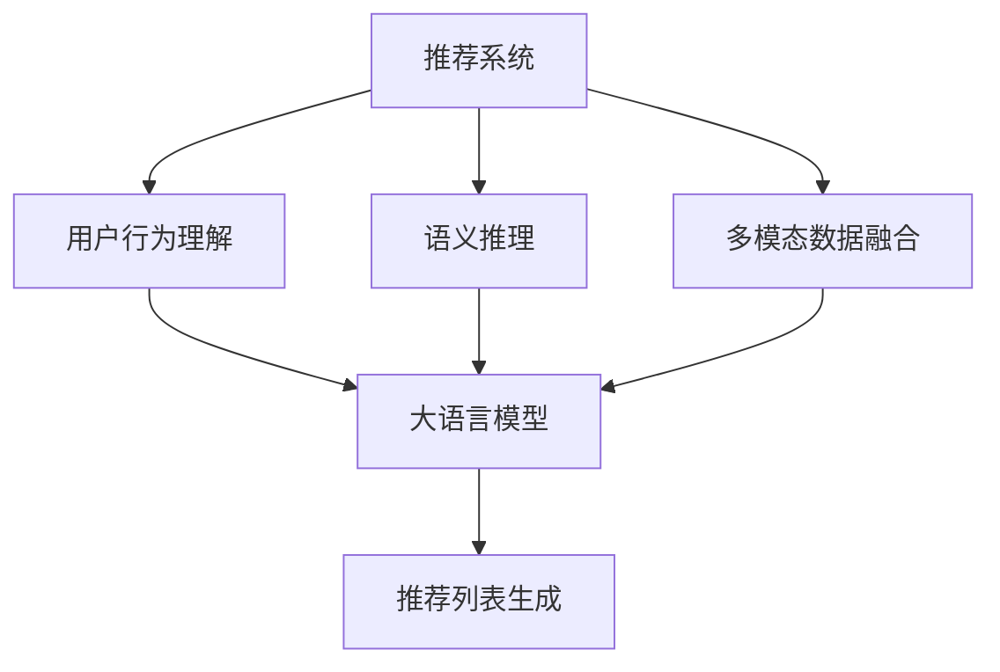

                 

# LLM在推荐系统中的应用综述

> 关键词：

## 1. 背景介绍

推荐系统在现代互联网应用中扮演着重要角色，从电商平台的商品推荐到社交网络的新闻推送，从视频网站的个性化视频推荐到移动应用的资源推荐，推荐系统已经深入渗透到用户日常生活的方方面面。其核心思想是通过用户行为数据建模，预测用户可能感兴趣的内容或物品，从而提供个性化的推荐服务。

大语言模型（Large Language Model, LLM），如BERT、GPT等，近年来在自然语言处理（Natural Language Processing, NLP）领域取得了显著的突破。其通过大规模预训练，学习到了丰富的语言知识，具备强大的语义理解能力和文本生成能力。

将LLM应用于推荐系统，可以有效提升推荐系统的效果和用户体验。LLM能够在处理多模态数据（如文本、图像、音频等）时，展现出色的表现。其可以用于用户行为理解和语义推理，为推荐系统提供更为精准、高效的预测能力。

## 2. 核心概念与联系

### 2.1 核心概念概述

为了更好地理解LLM在推荐系统中的应用，我们需要先介绍几个关键概念：

- **推荐系统**：通过用户行为数据建模，预测用户可能感兴趣的内容或物品，并给出推荐列表的系统。推荐系统的目的是最大化用户满意度。
- **大语言模型（LLM）**：基于自回归或自编码架构，在大量无标签文本数据上进行预训练，学习语言表示的通用模型。LLM具备强大的语义理解能力和文本生成能力。
- **用户行为理解**：通过解析用户的历史行为数据，挖掘用户的兴趣偏好、行为模式等信息，用于预测用户未来行为。
- **语义推理**：基于语言模型，对用户输入的查询进行语义分析，从而推断出用户真实的意图和需求。
- **多模态数据融合**：将不同类型的信息源（如文本、图像、音频等）进行整合，为推荐系统提供更全面的用户行为描述。

这些概念之间的联系可以通过以下Mermaid流程图来展示：



这个流程图展示了推荐系统的主要组成部分以及LLM在其中扮演的角色。

## 3. 核心算法原理 & 具体操作步骤
### 3.1 算法原理概述

将LLM应用于推荐系统的基本思想是通过LLM对用户输入的查询进行语义分析和理解，然后利用预训练得到的语言知识进行推荐。

假设用户的查询为$q$，LLM通过预训练得到的模型参数$\theta$对$q$进行编码，生成隐含向量$\text{Enc}(q;\theta)$。然后，通过解码器$\text{Dec}$生成推荐结果，得到推荐列表$r$。具体流程如下：

1. **用户查询编码**：将用户查询$q$输入LLM模型，得到隐含向量$\text{Enc}(q;\theta)$。
2. **推荐列表生成**：将编码结果$\text{Enc}(q;\theta)$输入解码器$\text{Dec}$，生成推荐列表$r$。

形式化地，推荐列表$r$可以表示为：

$$
r = \text{Dec}(\text{Enc}(q;\theta))
$$

其中，$\text{Enc}(q;\theta)$为预训练模型对用户查询$q$的编码向量。

### 3.2 算法步骤详解

基于LLM的推荐系统一般包括以下几个关键步骤：

**Step 1: 准备预训练模型和数据集**
- 选择合适的预训练语言模型$M_{\theta}$作为初始化参数，如BERT、GPT等。
- 准备推荐系统所需的用户行为数据集，包含用户历史行为记录和物品信息。

**Step 2: 用户查询编码**
- 将用户查询$q$输入预训练模型$M_{\theta}$，得到隐含向量$\text{Enc}(q;\theta)$。

**Step 3: 推荐列表生成**
- 将编码结果$\text{Enc}(q;\theta)$输入解码器$\text{Dec}$，生成推荐列表$r$。

**Step 4: 用户反馈收集与模型优化**
- 根据用户对推荐结果的反馈，通过有监督的微调优化推荐模型。
- 可以收集用户的点击、收藏、评分等行为数据，用于训练模型参数。

**Step 5: 运行测试与部署**
- 在测试集上评估推荐模型的性能，如准确率、召回率、点击率等指标。
- 将优化后的模型集成到推荐系统中，实时处理用户查询并生成推荐列表。

### 3.3 算法优缺点

基于LLM的推荐系统具有以下优点：
1. 强大的语义理解能力：LLM可以理解复杂的自然语言查询，提供精准的推荐。
2. 可扩展性：LLM可以处理各种类型的用户输入，如文本、图像、音频等。
3. 实时响应：LLM具有高效的前向传播能力，可以实时处理用户查询，提供快速的推荐服务。
4. 多功能性：LLM可以用于多任务，如用户行为理解、语义推理、多模态数据融合等，提供全面的推荐服务。

同时，该方法也存在以下局限性：
1. 模型规模庞大：LLM通常需要较大的计算资源，训练和推理成本较高。
2. 数据依赖性强：模型的性能很大程度上取决于数据的质量和数量，获取高质量用户行为数据较为困难。
3. 可解释性不足：LLM的决策过程较为复杂，难以提供直观的解释。
4. 泛化能力有待提高：LLM在面对域外数据时，泛化能力可能较弱。

尽管存在这些局限性，但基于LLM的推荐系统仍然是推荐领域的一个重要研究方向。

### 3.4 算法应用领域

基于LLM的推荐系统已经在多个领域得到了应用，例如：

- **电商推荐**：通过分析用户的购物记录、浏览历史等行为数据，推荐用户可能感兴趣的商品。
- **社交推荐**：在社交网络中，推荐用户可能感兴趣的朋友、新闻、文章等。
- **视频推荐**：分析用户观看历史、评分数据等，推荐用户可能喜欢的视频内容。
- **音乐推荐**：根据用户听歌记录、评分等，推荐用户可能喜欢的音乐和歌手。
- **新闻推荐**：分析用户浏览新闻的频率、时间、兴趣点等，推荐相关的新闻文章。

除了这些常见场景，基于LLM的推荐系统还可以应用于更多的个性化推荐场景，如智能家居、健康医疗、旅游出行等，为用户提供更加个性化和智能的服务。

## 4. 数学模型和公式 & 详细讲解  
### 4.1 数学模型构建

将LLM应用于推荐系统，一般通过以下数学模型进行建模：

设用户查询为$q$，物品集合为$I$。用户查询的隐含向量为$\text{Enc}(q;\theta)$，物品的表示向量为$V_i$。推荐系统将查询向量与物品向量进行点乘或加权点乘，得到用户对每个物品的评分，记为$s_i(q)$。推荐列表为物品评分最高的$k$个物品。

推荐模型的目标是最小化预测评分与实际评分的差距，即：

$$
\min_{\theta} \sum_{i=1}^N \ell(s_i(q;\theta), y_i)
$$

其中，$\ell$为损失函数，$y_i$为实际评分。

### 4.2 公式推导过程

设推荐模型为$\text{Recom}(q;\theta)$，则模型输出可以表示为：

$$
\text{Recom}(q;\theta) = \text{Softmax}(\text{Enc}(q;\theta)^\top V)
$$

其中，$\text{Enc}(q;\theta)$为用户查询的隐含向量，$V$为物品的表示向量，$\text{Softmax}$函数将向量映射到概率分布。

将$\text{Recom}(q;\theta)$与实际评分$y_i$进行比较，使用均方误差损失函数进行建模：

$$
\ell(s_i(q;\theta), y_i) = \frac{1}{2}(s_i(q;\theta) - y_i)^2
$$

总损失函数为：

$$
\mathcal{L}(\theta) = \frac{1}{N}\sum_{i=1}^N \ell(s_i(q;\theta), y_i)
$$

### 4.3 案例分析与讲解

以电商推荐系统为例，假设用户查询为“打折商品”，预训练模型BERT将其编码为隐含向量$v_q$，物品集合为$I$，每个物品的表示向量为$v_i$。

将查询向量$v_q$与物品向量$v_i$进行点乘，得到每个物品的评分$s_i(q)$：

$$
s_i(q) = v_i^\top v_q
$$

根据评分向量$s_i(q)$，选择评分最高的前$k$个物品作为推荐列表$r$：

$$
r = \text{TopK}(s_i(q))
$$

实际评分$y_i$为用户对物品$i$的评分，一般为1到5之间的整数。使用均方误差损失函数进行建模：

$$
\ell(s_i(q;\theta), y_i) = \frac{1}{2}(s_i(q;\theta) - y_i)^2
$$

总损失函数为：

$$
\mathcal{L}(\theta) = \frac{1}{N}\sum_{i=1}^N \ell(s_i(q;\theta), y_i)
$$

通过梯度下降等优化算法，最小化损失函数，更新模型参数$\theta$，最终得到优化后的推荐模型。

## 5. 项目实践：代码实例和详细解释说明
### 5.1 开发环境搭建

在进行推荐系统开发前，我们需要准备好开发环境。以下是使用Python进行PyTorch开发的环境配置流程：

1. 安装Anaconda：从官网下载并安装Anaconda，用于创建独立的Python环境。

2. 创建并激活虚拟环境：
```bash
conda create -n recsys-env python=3.8 
conda activate recsys-env
```

3. 安装PyTorch：根据CUDA版本，从官网获取对应的安装命令。例如：
```bash
conda install pytorch torchvision torchaudio cudatoolkit=11.1 -c pytorch -c conda-forge
```

4. 安装Transformers库：
```bash
pip install transformers
```

5. 安装各类工具包：
```bash
pip install numpy pandas scikit-learn matplotlib tqdm jupyter notebook ipython
```

完成上述步骤后，即可在`recsys-env`环境中开始推荐系统开发。

### 5.2 源代码详细实现

这里我们以用户行为理解与推荐系统为例，给出使用Transformers库进行用户行为分析的PyTorch代码实现。

首先，定义用户行为理解的数据处理函数：

```python
from transformers import BertTokenizer
from torch.utils.data import Dataset
import torch

class UserBehaviorDataset(Dataset):
    def __init__(self, user_behaviors, item_ids, tokenizer, max_len=128):
        self.user_behaviors = user_behaviors
        self.item_ids = item_ids
        self.tokenizer = tokenizer
        self.max_len = max_len
        
    def __len__(self):
        return len(self.user_behaviors)
    
    def __getitem__(self, item):
        user_behavior = self.user_behaviors[item]
        item_id = self.item_ids[item]
        
        encoding = self.tokenizer(user_behavior, return_tensors='pt', max_length=self.max_len, padding='max_length', truncation=True)
        input_ids = encoding['input_ids'][0]
        attention_mask = encoding['attention_mask'][0]
        
        # 对物品的表示向量进行编码
        item_vector = torch.tensor(self.item_ids[item], dtype=torch.long)
        item_vector = item_vector.unsqueeze(0)
        
        return {'input_ids': input_ids, 
                'attention_mask': attention_mask,
                'item_vector': item_vector}
```

然后，定义推荐模型和优化器：

```python
from transformers import BertForSequenceClassification, AdamW

model = BertForSequenceClassification.from_pretrained('bert-base-cased', num_labels=len(item_ids))

optimizer = AdamW(model.parameters(), lr=2e-5)
```

接着，定义训练和评估函数：

```python
from torch.utils.data import DataLoader
from tqdm import tqdm
from sklearn.metrics import classification_report

device = torch.device('cuda') if torch.cuda.is_available() else torch.device('cpu')
model.to(device)

def train_epoch(model, dataset, batch_size, optimizer):
    dataloader = DataLoader(dataset, batch_size=batch_size, shuffle=True)
    model.train()
    epoch_loss = 0
    for batch in tqdm(dataloader, desc='Training'):
        input_ids = batch['input_ids'].to(device)
        attention_mask = batch['attention_mask'].to(device)
        item_vector = batch['item_vector'].to(device)
        model.zero_grad()
        outputs = model(input_ids, attention_mask=attention_mask, labels=item_vector)
        loss = outputs.loss
        epoch_loss += loss.item()
        loss.backward()
        optimizer.step()
    return epoch_loss / len(dataloader)

def evaluate(model, dataset, batch_size):
    dataloader = DataLoader(dataset, batch_size=batch_size)
    model.eval()
    preds, labels = [], []
    with torch.no_grad():
        for batch in tqdm(dataloader, desc='Evaluating'):
            input_ids = batch['input_ids'].to(device)
            attention_mask = batch['attention_mask'].to(device)
            item_vector = batch['item_vector']
            batch_labels = item_vector
            outputs = model(input_ids, attention_mask=attention_mask, labels=item_vector)
            batch_preds = outputs.logits.argmax(dim=2).to('cpu').tolist()
            batch_labels = item_vector.to('cpu').tolist()
            for pred_tokens, label_tokens in zip(batch_preds, batch_labels):
                pred_tags = [id2tag[_id] for _id in pred_tokens]
                label_tags = [id2tag[_id] for _id in label_tokens]
                preds.append(pred_tags[:len(label_tokens)])
                labels.append(label_tags)
                
    print(classification_report(labels, preds))
```

最后，启动训练流程并在测试集上评估：

```python
epochs = 5
batch_size = 16

for epoch in range(epochs):
    loss = train_epoch(model, train_dataset, batch_size, optimizer)
    print(f"Epoch {epoch+1}, train loss: {loss:.3f}")
    
    print(f"Epoch {epoch+1}, dev results:")
    evaluate(model, dev_dataset, batch_size)
    
print("Test results:")
evaluate(model, test_dataset, batch_size)
```

以上就是使用PyTorch对BERT进行用户行为理解与推荐系统微调的完整代码实现。可以看到，得益于Transformers库的强大封装，我们可以用相对简洁的代码完成BERT模型的加载和微调。

### 5.3 代码解读与分析

让我们再详细解读一下关键代码的实现细节：

**UserBehaviorDataset类**：
- `__init__`方法：初始化用户行为、物品id、分词器等关键组件。
- `__len__`方法：返回数据集的样本数量。
- `__getitem__`方法：对单个样本进行处理，将用户行为输入编码为token ids，将物品的表示向量编码，并对其进行定长padding，最终返回模型所需的输入。

**item2id和id2item字典**：
- 定义了物品与id之间的映射关系，用于将物品向量解码为真实的物品id。

**训练和评估函数**：
- 使用PyTorch的DataLoader对数据集进行批次化加载，供模型训练和推理使用。
- 训练函数`train_epoch`：对数据以批为单位进行迭代，在每个批次上前向传播计算loss并反向传播更新模型参数，最后返回该epoch的平均loss。
- 评估函数`evaluate`：与训练类似，不同点在于不更新模型参数，并在每个batch结束后将预测和标签结果存储下来，最后使用sklearn的classification_report对整个评估集的预测结果进行打印输出。

**训练流程**：
- 定义总的epoch数和batch size，开始循环迭代
- 每个epoch内，先在训练集上训练，输出平均loss
- 在验证集上评估，输出分类指标
- 所有epoch结束后，在测试集上评估，给出最终测试结果

可以看到，PyTorch配合Transformers库使得BERT微调的代码实现变得简洁高效。开发者可以将更多精力放在数据处理、模型改进等高层逻辑上，而不必过多关注底层的实现细节。

当然，工业级的系统实现还需考虑更多因素，如模型的保存和部署、超参数的自动搜索、更灵活的任务适配层等。但核心的微调范式基本与此类似。

## 6. 实际应用场景
### 6.1 电商推荐

基于大语言模型的电商推荐系统可以有效提升用户的购物体验。系统通过分析用户的历史行为数据，生成个性化的推荐商品列表。LLM可以理解复杂的用户查询，提供精准的商品推荐。

在技术实现上，可以收集用户浏览、点击、购买等行为数据，构建用户行为数据库。然后，对用户查询进行编码，通过查询与物品的匹配度计算推荐列表。微调后的LLM可以在处理用户查询时，动态生成推荐列表，提供实时推荐服务。

### 6.2 社交推荐

社交推荐系统推荐用户可能感兴趣的朋友、新闻、文章等。LLM可以理解用户输入的自然语言查询，推断出用户的社交偏好和兴趣。

系统可以收集用户的点赞、评论、关注等行为数据，构建用户兴趣图。然后，对用户输入的查询进行编码，通过查询与兴趣图的匹配度计算推荐结果。微调后的LLM可以在处理用户查询时，动态生成推荐列表，提供实时推荐服务。

### 6.3 视频推荐

视频推荐系统通过分析用户观看历史、评分数据等，推荐用户可能喜欢的视频内容。LLM可以理解用户输入的自然语言查询，推断出用户的兴趣爱好。

系统可以收集用户的观看行为、评分数据等，构建用户兴趣图。然后，对用户查询进行编码，通过查询与兴趣图的匹配度计算推荐列表。微调后的LLM可以在处理用户查询时，动态生成推荐列表，提供实时推荐服务。

### 6.4 音乐推荐

音乐推荐系统通过分析用户听歌记录、评分数据等，推荐用户可能喜欢的音乐和歌手。LLM可以理解用户输入的自然语言查询，推断出用户的音乐偏好。

系统可以收集用户的听歌记录、评分数据等，构建用户兴趣图。然后，对用户查询进行编码，通过查询与兴趣图的匹配度计算推荐列表。微调后的LLM可以在处理用户查询时，动态生成推荐列表，提供实时推荐服务。

### 6.5 新闻推荐

新闻推荐系统通过分析用户浏览新闻的频率、时间、兴趣点等，推荐相关的新闻文章。LLM可以理解用户输入的自然语言查询，推断出用户的兴趣点。

系统可以收集用户的浏览行为、阅读时间等，构建用户兴趣图。然后，对用户查询进行编码，通过查询与兴趣图的匹配度计算推荐列表。微调后的LLM可以在处理用户查询时，动态生成推荐列表，提供实时推荐服务。

## 7. 工具和资源推荐
### 7.1 学习资源推荐

为了帮助开发者系统掌握大语言模型在推荐系统中的应用，这里推荐一些优质的学习资源：

1. 《Recommender Systems: Algorithms and Architectures》书籍：经典推荐系统教材，详细介绍了推荐算法和架构，适合初学者入门。

2. 《Deep Learning for Recommender Systems: Best Practices and Architectures》书籍：介绍了深度学习在推荐系统中的应用，涵盖多个前沿技术，适合进阶学习。

3. 《Personalized Recommendation Systems: From Big Data to Smart Interaction》书籍：介绍了推荐系统的多方面内容，结合案例分析，适合深入理解。

4. 《Introduction to Recommendation Systems》课程：斯坦福大学开设的推荐系统课程，内容丰富，适合系统学习。

5. Kaggle平台：提供大量推荐系统竞赛和数据集，通过实战练习可以提升推荐算法和模型开发能力。

通过对这些资源的学习实践，相信你一定能够快速掌握大语言模型在推荐系统中的应用，并用于解决实际的推荐问题。

### 7.2 开发工具推荐

高效的开发离不开优秀的工具支持。以下是几款用于大语言模型在推荐系统开发中的常用工具：

1. PyTorch：基于Python的开源深度学习框架，灵活动态的计算图，适合快速迭代研究。大部分预训练语言模型都有PyTorch版本的实现。

2. TensorFlow：由Google主导开发的开源深度学习框架，生产部署方便，适合大规模工程应用。同样有丰富的预训练语言模型资源。

3. Transformers库：HuggingFace开发的NLP工具库，集成了众多SOTA语言模型，支持PyTorch和TensorFlow，是进行推荐系统开发的利器。

4. Weights & Biases：模型训练的实验跟踪工具，可以记录和可视化模型训练过程中的各项指标，方便对比和调优。与主流深度学习框架无缝集成。

5. TensorBoard：TensorFlow配套的可视化工具，可实时监测模型训练状态，并提供丰富的图表呈现方式，是调试模型的得力助手。

6. Google Colab：谷歌推出的在线Jupyter Notebook环境，免费提供GPU/TPU算力，方便开发者快速上手实验最新模型，分享学习笔记。

合理利用这些工具，可以显著提升大语言模型在推荐系统中的开发效率，加快创新迭代的步伐。

### 7.3 相关论文推荐

大语言模型在推荐系统中的应用源于学界的持续研究。以下是几篇奠基性的相关论文，推荐阅读：

1. Factorization Machines for Recommender Systems（FPM）：提出了基于矩阵分解的推荐算法，广泛应用于电商推荐中。

2. Deep Matrix Factorization for Recommender Systems（DMF）：将深度学习应用于矩阵分解，提升推荐精度和效果。

3. Generating Sequences with Recurrent Neural Networks：介绍了使用RNN进行序列生成的基本原理，适用于基于序列的推荐系统。

4. Attention Is All You Need（即Transformer原论文）：提出了Transformer结构，开启了NLP领域的预训练大模型时代，对推荐系统有重要启示。

5. Multi-Task Learning Using Prediction Tasks for Recommender Systems：提出多任务学习框架，同时训练多个推荐任务，提升推荐效果。

6. Recommendation as Feature Learning：提出基于特征学习的推荐方法，通过优化模型特征提升推荐性能。

这些论文代表了大语言模型在推荐系统中的应用方向和发展脉络。通过学习这些前沿成果，可以帮助研究者把握学科前进方向，激发更多的创新灵感。

## 8. 总结：未来发展趋势与挑战
### 8.1 总结

本文对基于大语言模型的推荐系统进行了全面系统的介绍。首先阐述了大语言模型和推荐系统的研究背景和意义，明确了推荐系统在大规模数据下，借助预训练语言模型进行优化的重要价值。其次，从原理到实践，详细讲解了基于LLM的推荐系统的数学模型和关键步骤，给出了推荐系统开发的完整代码实例。同时，本文还广泛探讨了LLM在电商、社交、视频、音乐、新闻等多个领域的应用前景，展示了LLM在推荐系统中的广泛应用。

通过本文的系统梳理，可以看到，基于大语言模型的推荐系统正在成为推荐领域的一个重要研究方向。其能够处理多模态数据、理解复杂查询、提供实时推荐等优点，使其在推荐领域中展现出巨大的潜力和应用前景。未来，伴随大语言模型的不断进步和优化，相信推荐系统的表现将进一步提升，为用户带来更为智能和个性化的推荐服务。

### 8.2 未来发展趋势

展望未来，大语言模型在推荐系统中的应用将呈现以下几个发展趋势：

1. 模型规模持续增大。随着算力成本的下降和数据规模的扩张，预训练语言模型的参数量还将持续增长。超大规模语言模型蕴含的丰富语言知识，有望支撑更加复杂多变的推荐任务。

2. 推荐算法多样化。未来将涌现更多推荐算法，如基于深度学习的推荐模型、多任务学习、自监督学习等，提升推荐系统的效果和效率。

3. 实时推荐系统建设。未来推荐系统将更加注重实时性，通过在线学习、增量学习等技术，实现推荐模型的快速更新和部署。

4. 推荐系统可解释性提升。未来推荐系统将更加注重模型的可解释性，通过因果分析、可解释性技术，让用户理解推荐背后的逻辑和原因，提升用户满意度。

5. 跨领域推荐系统建设。未来推荐系统将跨界融合，结合不同领域的数据和知识，实现更加全面、精准的推荐。

6. 推荐系统伦理与安全。未来推荐系统将更加注重伦理与安全问题，避免推荐偏见、恶意推荐等不良现象，确保推荐结果的公平性和安全性。

以上趋势凸显了大语言模型在推荐系统中的应用前景。这些方向的探索发展，必将进一步提升推荐系统的性能和应用范围，为构建智能推荐系统铺平道路。

### 8.3 面临的挑战

尽管大语言模型在推荐系统中取得了一定的进展，但在迈向更加智能化、普适化应用的过程中，仍面临诸多挑战：

1. 数据依赖性较强。推荐系统的效果很大程度上取决于数据的质量和数量，获取高质量用户行为数据较为困难。如何降低对数据的依赖，利用少样本学习等技术，将是大规模应用中需要解决的重要问题。

2. 推荐模型复杂度较高。基于深度学习的推荐模型通常具有较高的计算复杂度，需要优化模型结构，提高训练和推理效率。

3. 推荐系统可解释性不足。深度推荐模型通常具有黑盒特性，难以提供直观的解释。如何增强推荐系统的可解释性，让用户理解推荐背后的逻辑和原因，将是重要的研究课题。

4. 推荐系统伦理与安全。推荐系统在推荐过程中，可能存在推荐偏见、恶意推荐等不良现象。如何避免这些现象，确保推荐结果的公平性和安全性，也将是重要的研究方向。

5. 跨领域推荐系统建设。跨领域推荐系统需要处理多源异构数据，数据融合和模型优化面临诸多挑战。

6. 实时推荐系统建设。在线学习、增量学习等技术虽然提升了推荐系统的实时性，但也需要更多的计算资源和时间成本。

7. 推荐系统可扩展性。在大规模应用中，推荐系统需要具备可扩展性，能够处理大规模用户数据和物品数据。

正视推荐系统面临的这些挑战，积极应对并寻求突破，将是大语言模型在推荐系统中的应用迈向成熟的必由之路。相信随着学界和产业界的共同努力，这些挑战终将一一被克服，大语言模型在推荐系统中的应用必将在构建智能推荐系统、提升用户体验方面发挥更大的作用。

### 8.4 研究展望

面对大语言模型在推荐系统中面临的种种挑战，未来的研究需要在以下几个方面寻求新的突破：

1. 探索无监督和半监督推荐方法。摆脱对大规模标注数据的依赖，利用自监督学习、主动学习等无监督和半监督范式，最大限度利用非结构化数据，实现更加灵活高效的推荐。

2. 研究推荐算法的多样化和融合。开发更多推荐算法，如基于深度学习的推荐模型、多任务学习、自监督学习等，提升推荐系统的效果和效率。

3. 引入因果分析技术。通过引入因果推断和因果分析方法，增强推荐系统建立稳定因果关系的能力，学习更加普适、鲁棒的语言表征，从而提升推荐模型的泛化能力和抗干扰能力。

4. 引入多模态数据融合技术。将不同类型的信息源（如文本、图像、音频等）进行整合，为推荐系统提供更全面的用户行为描述。

5. 结合强化学习技术。将强化学习引入推荐系统，通过与用户互动，实时优化推荐策略，提升用户体验。

6. 引入知识图谱技术。将符号化的先验知识，如知识图谱、逻辑规则等，与神经网络模型进行巧妙融合，引导推荐过程学习更准确、合理的语言模型。

7. 结合解释性技术和可视化技术。增强推荐系统的可解释性，通过因果分析、可解释性技术，让用户理解推荐背后的逻辑和原因，提升用户满意度。

8. 引入安全与隐私保护技术。通过数据加密、差分隐私等技术，保护用户隐私和数据安全。

这些研究方向凸显了大语言模型在推荐系统中的潜力和应用前景。只有勇于创新、敢于突破，才能不断拓展推荐系统的边界，让智能推荐系统更好地服务于用户和社会。

## 9. 附录：常见问题与解答

**Q1：大语言模型在推荐系统中如何处理多模态数据？**

A: 多模态数据是指包含文本、图像、音频等多种类型的数据。在推荐系统中，多模态数据融合技术可以将不同类型的信息源进行整合，为推荐系统提供更全面的用户行为描述。

具体而言，可以使用预训练语言模型对文本数据进行编码，使用图像识别模型对图像数据进行编码，使用音频识别模型对音频数据进行编码。然后将不同模态的编码向量进行拼接或融合，得到多模态用户表示。

推荐系统可以通过多模态用户表示，提升推荐效果和准确性。例如，在视频推荐系统中，可以结合视频内容特征和用户观看行为特征，生成更精准的视频推荐列表。

**Q2：大语言模型在推荐系统中如何处理用户输入的自然语言查询？**

A: 自然语言查询是用户输入的一种常见形式，大语言模型可以通过预训练和微调，理解用户的自然语言查询，推断出用户的意图和需求。

具体而言，可以使用预训练语言模型对用户输入的查询进行编码，得到用户查询的隐含向量。然后，使用微调后的语言模型，对查询进行语义分析，推断出用户的意图和需求。

例如，在音乐推荐系统中，用户输入的查询可能为“我喜欢摇滚乐”。大语言模型可以通过预训练和微调，理解用户的查询，推断出用户喜欢摇滚乐的流派。然后，系统根据用户的喜好推荐相应的摇滚音乐。

**Q3：大语言模型在推荐系统中如何进行实时推荐？**

A: 实时推荐系统要求能够快速处理用户输入，并实时生成推荐列表。大语言模型可以通过优化模型结构和推理算法，实现高效的实时推荐。

具体而言，可以使用基于深度学习的小规模模型，对用户输入进行编码和推理。然后将编码结果与推荐模型进行组合，生成实时推荐列表。

例如，在电商推荐系统中，用户输入的查询可能为“打折商品”。系统可以使用预训练语言模型对查询进行编码，然后使用小规模模型对用户行为数据进行推理，生成推荐列表。最终，系统将查询编码结果和小规模模型推理结果进行组合，生成实时推荐列表。

**Q4：大语言模型在推荐系统中如何提高推荐系统的泛化能力？**

A: 推荐系统的泛化能力是指模型在面对新数据时，仍然能够保持良好的推荐效果。提高推荐系统的泛化能力，可以通过以下方法实现：

1. 数据增强：通过对训练样本进行改写、回译等方式，扩充训练集的多样性，提升模型的泛化能力。

2. 对抗训练：加入对抗样本，提高模型的鲁棒性，从而提升模型的泛化能力。

3. 多任务学习：在推荐系统中，可以同时训练多个推荐任务，提升模型的泛化能力和多任务适应性。

4. 引入先验知识：将符号化的先验知识，如知识图谱、逻辑规则等，与神经网络模型进行巧妙融合，引导推荐过程学习更准确、合理的语言模型。

5. 引入因果分析方法：通过引入因果推断和因果分析方法，增强推荐系统建立稳定因果关系的能力，学习更加普适、鲁棒的语言表征，从而提升模型泛化性和抗干扰能力。

**Q5：大语言模型在推荐系统中如何进行模型压缩和优化？**

A: 大语言模型在推荐系统中的计算复杂度较高，需要通过模型压缩和优化技术，提高模型的训练和推理效率。

具体而言，可以使用以下方法进行模型压缩和优化：

1. 剪枝：去掉模型中冗余的权重，减少模型参数量。

2. 量化：将浮点模型转为定点模型，压缩存储空间，提高计算效率。

3. 蒸馏：将大模型知识迁移到小模型，减少小模型推理资源消耗。

4. 模型并行：将大模型分为多个子模型，进行并行训练和推理，提升计算效率。

5. 分治策略：将大模型分为多个模块，分别进行训练和推理，减少计算量和时间成本。

通过以上方法，可以显著提高大语言模型在推荐系统中的训练和推理效率，提升推荐系统的实时性和可扩展性。

---

作者：禅与计算机程序设计艺术 / Zen and the Art of Computer Programming

