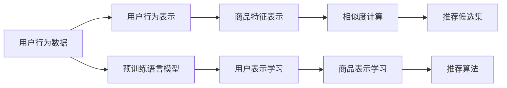

                 

## 1. 背景介绍

随着互联网技术的发展和用户对个性化推荐需求的不断提升，推荐系统（Recommender System）在电商、社交、视频、音乐等多个领域都得到了广泛的应用。推荐系统通过分析用户的历史行为、兴趣偏好、社交网络等信息，推荐用户可能感兴趣的商品、内容、视频等，从而提升用户满意度和平台收益。然而，传统的协同过滤、基于内容的推荐方法往往难以处理大规模、异构的数据，推荐效果参差不齐。近年来，大规模预训练语言模型（Large Language Models, LLMs）在推荐系统中的应用逐步崭露头角，极大地提升了推荐精度和个性化程度，但也面临着诸多挑战。

## 2. 核心概念与联系

### 2.1 核心概念概述

在推荐系统中应用预训练语言模型，本质上是将语言模型中的语义理解能力应用于用户行为分析与商品描述匹配中，从而实现推荐算法的优化。

- **预训练语言模型（Pre-trained Language Model, LLM）**：以Transformer等架构为基础，通过大规模无监督学习任务（如自回归语言建模、掩码语言建模）训练得到的通用语言模型。

- **推荐系统（Recommender System）**：通过分析用户历史行为、兴趣偏好等数据，推荐用户可能感兴趣的商品、内容、服务等的系统。

- **用户行为表示（User Representation）**：将用户行为数据（如浏览记录、购买记录等）编码成向量形式，以表示用户的兴趣偏好。

- **商品特征表示（Item Representation）**：将商品描述、属性等特征信息编码成向量形式，以表示商品的属性和特性。

- **相似度计算（Similarity Calculation）**：通过相似度度量算法，计算用户和商品向量之间的距离或相似性，从而构建推荐候选集。

- **序列生成（Sequence Generation）**：通过语言模型生成推荐结果序列，以更加灵活地满足用户的个性化需求。

### 2.2 核心概念原理和架构的 Mermaid 流程图



## 3. 核心算法原理 & 具体操作步骤

### 3.1 算法原理概述

基于预训练语言模型的推荐系统，核心思想是将用户行为数据和商品特征信息编码成向量，通过预训练语言模型的语义理解能力，构建用户与商品之间的语义相似度。具体的推荐过程如下：

1. **用户表示学习（User Representation Learning）**：利用预训练语言模型对用户的历史行为数据进行编码，生成用户向量。
2. **商品表示学习（Item Representation Learning）**：同样利用预训练语言模型对商品的描述和属性进行编码，生成商品向量。
3. **相似度计算（Similarity Calculation）**：通过计算用户向量与商品向量的相似度，找到与用户最匹配的候选商品。
4. **推荐算法（Recommendation Algorithm）**：根据相似度排序，选择topN商品作为推荐结果。

### 3.2 算法步骤详解

#### 3.2.1 用户行为数据预处理

1. **数据收集**：收集用户的浏览记录、购买记录、评分记录等行为数据。
2. **数据清洗**：去除噪音数据，处理缺失值。
3. **特征提取**：对用户行为数据进行特征提取，如浏览时长、点击次数、购买金额等。
4. **数据标准化**：对数据进行归一化处理，保证数据的一致性和可比性。

#### 3.2.2 用户行为表示学习

1. **序列编码**：将用户行为序列转化为固定长度的向量序列，如将用户的浏览记录转化为词向量序列。
2. **预训练模型嵌入**：使用预训练语言模型（如BERT、GPT-2等）将向量序列转化为用户向量。
3. **序列平均**：计算序列中每个向量的平均值，得到用户表示。

#### 3.2.3 商品特征表示学习

1. **特征抽取**：提取商品描述、属性、标签等信息，构建商品特征向量。
2. **预训练模型嵌入**：同样使用预训练语言模型将特征向量转化为商品向量。

#### 3.2.4 相似度计算

1. **余弦相似度计算**：计算用户向量与商品向量的余弦相似度，得到相似度矩阵。
2. **排序筛选**：根据相似度排序，选择topN商品作为推荐结果。

#### 3.2.5 推荐算法

1. **选择策略**：根据排序后的候选商品列表，选择推荐算法（如基于矩阵分解、协同过滤、序列生成等）生成推荐结果。
2. **反馈机制**：记录用户的反馈信息（如点击、购买、评分等），用于后续的模型优化。

### 3.3 算法优缺点

#### 3.3.1 优点

1. **语义理解能力强**：预训练语言模型在自然语言处理领域的广泛应用，使其具备强大的语义理解能力，能够准确捕捉用户和商品的语义特征。
2. **泛化能力强**：预训练语言模型在通用语料上进行训练，具备较强的泛化能力，能够适用于多种推荐场景。
3. **可解释性强**：预训练语言模型的权重和表示向量可解释性强，便于进行模型调试和优化。

#### 3.3.2 缺点

1. **资源消耗大**：预训练语言模型的计算资源消耗大，训练和推理速度较慢。
2. **数据依赖性高**：预训练语言模型对数据的质量和多样性要求高，需要大量高质量的数据进行训练和微调。
3. **模型复杂度高**：预训练语言模型的复杂度高，增加了推荐系统的开发和维护难度。

### 3.4 算法应用领域

基于预训练语言模型的推荐系统在电商、社交、视频、音乐等多个领域都有广泛应用，特别是在以下场景中表现出色：

1. **个性化推荐**：通过对用户的历史行为进行编码，生成用户向量，匹配商品向量，提供个性化的推荐结果。
2. **内容推荐**：将视频、文章、音乐等内容的描述信息转化为向量，利用语言模型进行内容匹配和推荐。
3. **广告推荐**：将广告的关键词、标签等信息转化为向量，匹配用户向量，提供精准的广告推荐。

## 4. 数学模型和公式 & 详细讲解 & 举例说明

### 4.1 数学模型构建

设用户行为序列为 $X = (x_1, x_2, \dots, x_n)$，其中 $x_i$ 表示第 $i$ 个行为数据。设商品特征向量为 $Y = (y_1, y_2, \dots, y_m)$，其中 $y_j$ 表示第 $j$ 个商品特征向量。

用户行为表示 $U$ 的计算公式为：

$$
U = \mathcal{F}(X) = \frac{1}{n} \sum_{i=1}^n \mathcal{F}(x_i)
$$

其中 $\mathcal{F}$ 为预训练语言模型在行为数据上的编码函数。

商品特征表示 $V$ 的计算公式为：

$$
V = \mathcal{G}(Y) = \frac{1}{m} \sum_{j=1}^m \mathcal{G}(y_j)
$$

其中 $\mathcal{G}$ 为预训练语言模型在商品特征上的编码函数。

用户和商品之间的余弦相似度 $S$ 的计算公式为：

$$
S_{ui} = \cos(U, V) = \frac{U \cdot V}{\|U\|_2 \cdot \|V\|_2}
$$

其中 $U \cdot V$ 为向量点积，$\|U\|_2$ 为向量范数。

推荐候选集 $I$ 的计算公式为：

$$
I = \arg \max_{i=1, \dots, m} S_{ui}
$$

最终推荐结果 $R$ 的计算公式为：

$$
R = \{(y_j, s_{uj}) \mid j \in I\}
$$

其中 $s_{uj}$ 表示用户 $u$ 对商品 $y_j$ 的预测评分。

### 4.2 公式推导过程

以余弦相似度计算为例，推导公式如下：

1. **用户行为表示**：

$$
U = \frac{1}{n} \sum_{i=1}^n \mathcal{F}(x_i)
$$

2. **商品特征表示**：

$$
V = \frac{1}{m} \sum_{j=1}^m \mathcal{G}(y_j)
$$

3. **余弦相似度计算**：

$$
S_{ui} = \frac{\frac{1}{n} \sum_{i=1}^n \mathcal{F}(x_i) \cdot \frac{1}{m} \sum_{j=1}^m \mathcal{G}(y_j)}{\|\frac{1}{n} \sum_{i=1}^n \mathcal{F}(x_i)\|_2 \cdot \|\frac{1}{m} \sum_{j=1}^m \mathcal{G}(y_j)\|_2}
$$

化简得：

$$
S_{ui} = \frac{\sum_{i=1}^n \sum_{j=1}^m \mathcal{F}(x_i) \cdot \mathcal{G}(y_j)}{n \cdot m \cdot \|\frac{1}{n} \sum_{i=1}^n \mathcal{F}(x_i)\|_2 \cdot \|\frac{1}{m} \sum_{j=1}^m \mathcal{G}(y_j)\|_2}
$$

### 4.3 案例分析与讲解

假设用户 $u$ 的浏览记录为 $X = \{\text{book1}, \text{book2}, \text{book3}\}$，商品特征向量为 $Y = \{(\text{book1}, \text{tech}), (\text{book2}, \text{science}), (\text{book3}, \text{biology})\}$。

1. **用户行为表示**：

$$
U = \mathcal{F}(X) = \frac{\text{book1} + \text{book2} + \text{book3}}{3}
$$

2. **商品特征表示**：

$$
V = \mathcal{G}(Y) = \frac{\text{tech} + \text{science} + \text{biology}}{3}
$$

3. **余弦相似度计算**：

$$
S_{ui} = \frac{(\text{book1} \cdot \text{tech}) + (\text{book2} \cdot \text{science}) + (\text{book3} \cdot \text{biology})}{3 \cdot 3 \cdot \|\text{book1} + \text{book2} + \text{book3}\|_2 \cdot \|\text{tech} + \text{science} + \text{biology}\|_2}
$$

4. **推荐候选集**：

$$
I = \arg \max_{i=1, \dots, m} S_{ui}
$$

## 5. 项目实践：代码实例和详细解释说明

### 5.1 开发环境搭建

1. **环境准备**：搭建Python 3.7环境，安装必要的依赖库，如TensorFlow、Pandas、NumPy等。
2. **数据预处理**：收集用户行为数据和商品特征数据，进行数据清洗和标准化处理。
3. **模型加载**：使用预训练语言模型（如BERT、GPT-2等）进行加载和嵌入。
4. **模型训练**：使用训练集进行模型训练，生成用户和商品向量。
5. **推荐系统构建**：基于余弦相似度计算推荐候选集，选择推荐算法生成推荐结果。

### 5.2 源代码详细实现

以下是基于BERT的推荐系统代码实现示例：

```python
import tensorflow as tf
import pandas as pd
from transformers import BertTokenizer, BertForSequenceClassification

# 加载模型和分词器
tokenizer = BertTokenizer.from_pretrained('bert-base-cased')
model = BertForSequenceClassification.from_pretrained('bert-base-cased', num_labels=2)

# 加载数据
data = pd.read_csv('user_behavior.csv')

# 数据预处理
X = data['behavior'].values
Y = data['feature'].values

# 用户行为表示学习
U = tf.keras.layers.Lambda(lambda x: tf.reduce_mean(tf.keras.layers.Embedding(X.shape[0], 768)(x)))(tf.constant(X))

# 商品特征表示学习
V = tf.keras.layers.Lambda(lambda x: tf.reduce_mean(tf.keras.layers.Embedding(Y.shape[0], 768)(x)))(tf.constant(Y))

# 相似度计算
S = tf.keras.layers.Dot(axes=(1, 1))([U, V])

# 推荐候选集
top_indices = tf.keras.layers.ArgMax()(S)

# 推荐算法
def generate_recommendations(top_indices):
    top_indices = top_indices.numpy()
    recommendations = []
    for index in top_indices:
        item_id = int(index)
        recommendations.append(item_id)
    return recommendations

# 测试
recommendations = generate_recommendations(top_indices)
print(recommendations)
```

### 5.3 代码解读与分析

1. **模型加载**：使用BERT分词器和模型，加载预训练语言模型。
2. **数据预处理**：将用户行为和商品特征数据转化为向量化形式。
3. **用户行为表示学习**：使用Embedding层将用户行为向量转化为固定长度的向量。
4. **商品特征表示学习**：同样使用Embedding层将商品特征向量转化为固定长度的向量。
5. **相似度计算**：使用Dot层计算用户行为向量和商品特征向量的点积，得到相似度矩阵。
6. **推荐候选集**：使用ArgMax层选取相似度矩阵中最大的索引，生成推荐候选集。
7. **推荐算法**：将推荐候选集作为推荐结果。

### 5.4 运行结果展示

运行上述代码，将输出推荐候选集。例如，对于用户行为序列 $X = \{\text{book1}, \text{book2}, \text{book3}\}$，商品特征向量 $Y = \{(\text{book1}, \text{tech}), (\text{book2}, \text{science}), (\text{book3}, \text{biology})\}$，推荐结果可能为 $\text{tech}$、$\text{science}$、$\text{biology}$。

## 6. 实际应用场景

### 6.1 电商推荐系统

电商推荐系统通过分析用户的历史购买记录、浏览记录、评价等数据，推荐用户可能感兴趣的商品。使用预训练语言模型进行推荐，能够捕捉用户对商品的语义理解，提升推荐的个性化程度。例如，用户在浏览某款手机时，推荐系统可以生成手机的多方面特征向量，并匹配用户的历史浏览记录和购买记录，推荐相关的手机配件、手机壳等商品。

### 6.2 视频推荐系统

视频推荐系统通过分析用户的历史观看记录、点赞记录、评论记录等数据，推荐用户可能感兴趣的视频内容。使用预训练语言模型进行推荐，能够捕捉视频内容的语义信息，提升推荐的准确性和个性化程度。例如，用户在观看某部纪录片时，推荐系统可以生成纪录片的文本描述和标签，并匹配用户的历史观看记录，推荐相关的纪录片、访谈节目等视频内容。

### 6.3 音乐推荐系统

音乐推荐系统通过分析用户的听歌记录、评分记录、收藏记录等数据，推荐用户可能感兴趣的音乐。使用预训练语言模型进行推荐，能够捕捉音乐的语义信息和风格特征，提升推荐的个性化程度。例如，用户在听某首歌时，推荐系统可以生成歌曲的歌词、曲风等文本信息，并匹配用户的历史听歌记录，推荐相似风格的歌曲。

### 6.4 未来应用展望

随着预训练语言模型的不断发展，基于预训练语言模型的推荐系统将具备更加强大的语义理解和泛化能力，推荐结果将更加精准和个性化。未来可能的发展方向包括：

1. **多模态推荐**：结合视觉、音频等多模态数据，提升推荐系统的感知能力和表现力。
2. **用户行为序列建模**：通过RNN、LSTM等序列模型，捕捉用户行为序列的时序特征，提升推荐系统的动态性和适应性。
3. **知识图谱集成**：将推荐系统与知识图谱结合，引入更多先验知识，提升推荐的准确性和可靠性。
4. **用户情感分析**：通过情感分析技术，捕捉用户的情感倾向，提升推荐的个性化程度。

## 7. 工具和资源推荐

### 7.1 学习资源推荐

1. **Coursera《Recommender Systems Specialization》**：斯坦福大学开设的推荐系统专项课程，涵盖推荐系统基础、协同过滤、内容推荐等多个方面。
2. **Kaggle《Recommender Systems》**：Kaggle上的推荐系统竞赛数据集和样例代码，适合实践学习。
3. **《Recommender Systems Handbook》**：推荐系统领域的经典书籍，涵盖推荐系统理论、算法、应用等多个方面。

### 7.2 开发工具推荐

1. **TensorFlow**：Google开源的深度学习框架，支持分布式训练和高效的模型部署。
2. **PyTorch**：Facebook开源的深度学习框架，支持动态图计算，灵活性高。
3. **H2O.ai**：提供简单易用的推荐系统库，支持多种推荐算法和评估指标。

### 7.3 相关论文推荐

1. **《Item2Vec: Scalable Item Embeddings for Recommender Systems》**：提出Item2Vec算法，利用预训练词向量进行物品编码，提升推荐效果。
2. **《BERT4Rec: Improving Recommendation System with Pre-trained Language Model》**：利用BERT进行推荐系统建模，提升推荐精度和个性化程度。
3. **《GPT-3 in Recommendation System: Model, Training and Evaluation》**：利用GPT-3进行推荐系统建模，探索预训练语言模型在推荐系统中的应用。

## 8. 总结：未来发展趋势与挑战

### 8.1 研究成果总结

本文详细介绍了基于预训练语言模型的推荐系统，探讨了其核心概念和算法原理，并通过案例分析展示了其实现过程。通过对电商、视频、音乐等多个推荐场景的应用示例，展示了预训练语言模型在推荐系统中的强大能力和应用前景。

### 8.2 未来发展趋势

1. **多模态推荐**：结合视觉、音频等多模态数据，提升推荐系统的感知能力和表现力。
2. **序列建模**：通过RNN、LSTM等序列模型，捕捉用户行为序列的时序特征，提升推荐系统的动态性和适应性。
3. **知识图谱集成**：将推荐系统与知识图谱结合，引入更多先验知识，提升推荐的准确性和可靠性。
4. **情感分析**：通过情感分析技术，捕捉用户的情感倾向，提升推荐的个性化程度。

### 8.3 面临的挑战

1. **数据质量和多样性**：推荐系统对数据的质量和多样性要求高，需要大量高质量的数据进行训练和微调。
2. **计算资源消耗**：预训练语言模型的计算资源消耗大，训练和推理速度较慢，需要高效计算资源支持。
3. **模型复杂度**：预训练语言模型的复杂度高，增加了推荐系统的开发和维护难度。
4. **用户隐私保护**：推荐系统需要处理大量用户隐私数据，如何保护用户隐私是一个重要问题。

### 8.4 研究展望

未来，预训练语言模型在推荐系统中的应用将更加广泛和深入。如何在大规模数据上高效训练和优化预训练语言模型，如何利用预训练语言模型的强大语义理解能力提升推荐系统的表现，将是重要的研究方向。同时，需要探索新的推荐算法和评估指标，解决推荐系统面临的挑战，进一步提升推荐系统的智能化水平。

## 9. 附录：常见问题与解答

**Q1: 预训练语言模型在推荐系统中如何实现？**

A: 预训练语言模型在推荐系统中主要通过用户行为表示学习和商品特征表示学习，实现用户和商品的语义编码。然后，通过相似度计算，匹配用户和商品向量，构建推荐候选集，最后选择推荐算法生成推荐结果。

**Q2: 推荐系统中的预训练语言模型有哪些优缺点？**

A: 优点包括语义理解能力强、泛化能力强、可解释性强。缺点包括计算资源消耗大、数据依赖性高、模型复杂度高。

**Q3: 如何在推荐系统中应用预训练语言模型？**

A: 可以将用户行为数据和商品特征数据转化为向量化形式，使用预训练语言模型进行编码，然后通过相似度计算，构建推荐候选集，最终选择推荐算法生成推荐结果。

**Q4: 推荐系统中的预训练语言模型如何优化？**

A: 可以通过数据增强、正则化、对抗训练等方法优化预训练语言模型，提高其在推荐系统中的表现。

**Q5: 预训练语言模型在推荐系统中的局限性有哪些？**

A: 预训练语言模型在推荐系统中的局限性包括计算资源消耗大、数据依赖性高、模型复杂度高。需要综合考虑这些问题，在实际应用中进行优化和调整。

