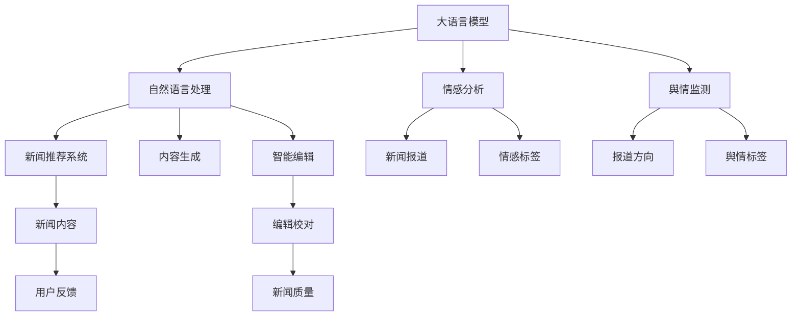

                 

# LLM在新闻媒体中的应用：AI记者的崛起

> 关键词：大语言模型(LLM),自然语言处理(NLP),新闻推荐系统,AI记者,智能编辑,内容生成

## 1. 背景介绍

随着人工智能技术的迅猛发展，大语言模型（Large Language Model, LLM）在新闻媒体领域的应用日益广泛。传统的线性新闻采集、编辑、校对流程需要大量人力成本和较长的处理时间，而LLM的出现，为新闻业注入了新的活力。大语言模型可以自动分析海量新闻数据，进行内容生成、新闻推荐、编辑校对等多项工作，极大地提升了新闻媒体的产出效率和质量。

### 1.1 问题由来

近年来，人工智能在新闻媒体中的应用主要集中在自动化采编、智能化推荐和个性化编辑等方面。大语言模型在这些场景中的表现尤为出色，可以处理复杂的文本理解任务，快速生成高质量的新闻内容。然而，如何更有效地利用大语言模型，实现人机协作，提高新闻媒体的整体智能化水平，仍是当前研究的热点问题。

### 1.2 问题核心关键点

大语言模型在新闻媒体中的应用，其核心在于如何通过模型的理解能力和生成能力，辅助记者进行新闻采编工作，提升新闻的实时性和准确性。具体关键点包括：

- **自动文本摘要**：通过大语言模型对新闻文章进行自动摘要，帮助记者快速了解文章核心内容，节省时间。
- **智能推荐系统**：利用大语言模型对新闻数据进行深度分析，推荐热门或相关新闻给用户，提升用户体验。
- **新闻内容生成**：使用大语言模型自动生成新闻稿件、简报等，辅助记者提高工作效率。
- **情感分析与舆情监测**：通过大语言模型分析社交媒体上的用户情感和舆情变化，指导新闻报道的方向。
- **智能编辑校对**：使用大语言模型对新闻内容进行语言校正和语义优化，提高报道质量。

这些关键点展示了大语言模型在新闻媒体中的巨大潜力，使其成为AI记者崛起的重要技术支撑。

### 1.3 问题研究意义

大语言模型在新闻媒体中的应用，对提升新闻业的生产效率和报道质量具有重要意义：

1. **降低成本**：通过自动生成和推荐系统，大语言模型能大幅减少人力成本，提高新闻产出的速度和规模。
2. **提升质量**：模型的语义理解和生成能力，保证了新闻内容的准确性和可读性，提升了媒体的社会价值。
3. **增强互动**：利用智能推荐系统，可以更好地满足用户个性化需求，提升用户体验。
4. **应对突发事件**：在重大事件发生时，大语言模型可以迅速生成新闻报道，及时传递信息，稳定社会情绪。
5. **辅助深度报道**：通过情感分析和舆情监测，大语言模型可以为记者提供深入背景分析，辅助进行深度报道。
6. **优化编辑流程**：智能编辑校对功能可以减轻编辑的工作负担，提高新闻质量。

## 2. 核心概念与联系

### 2.1 核心概念概述

在探讨LLM在新闻媒体中的应用时，需重点关注以下核心概念：

- **大语言模型(Large Language Model, LLM)**：通过大规模数据预训练得到的强大语言理解与生成模型，如GPT-3、BERT等。
- **自然语言处理(Natural Language Processing, NLP)**：利用计算技术处理、分析和生成人类语言的技术，涉及语言理解、语言生成等多个方向。
- **新闻推荐系统(News Recommendation System)**：利用用户行为和内容特征，推荐新闻的智能系统，以提高用户满意度。
- **AI记者(AI Journalist)**：基于大语言模型的自动化新闻采编系统，能够进行新闻内容生成、编辑、校对等工作。
- **智能编辑(Smart Editor)**：使用大语言模型辅助新闻编辑，进行语言校正、风格调整等优化工作。
- **内容生成(Content Generation)**：大语言模型自动生成新闻稿件、简报等内容，辅助记者撰写。
- **情感分析(Sentiment Analysis)**：分析新闻数据中的情感倾向，辅助新闻报道。
- **舆情监测(Sentiment Analysis)**：分析社交媒体上的舆情变化，指导新闻报道。
- **语义优化(Semantic Optimization)**：利用大语言模型对新闻内容进行语义优化，提高可读性和理解性。

### 2.2 核心概念原理和架构的 Mermaid 流程图



## 3. 核心算法原理 & 具体操作步骤
### 3.1 算法原理概述

大语言模型在新闻媒体中的应用主要基于两种技术：文本生成和语义分析。通过这两种技术，大语言模型可以自动化地完成新闻内容的生成、编辑、推荐和优化。

- **文本生成**：利用预训练的大语言模型，对给定输入进行文本生成，自动生成新闻稿件、简报等。
- **语义分析**：通过大语言模型进行新闻内容的情感分析、舆情监测等语义分析工作，帮助记者理解社会舆情。

### 3.2 算法步骤详解

大语言模型在新闻媒体中的应用主要分为以下几个步骤：

**Step 1: 数据预处理**
- 收集新闻数据集，包括新闻标题、正文、摘要等。
- 进行数据清洗，去除噪音数据和无关信息。

**Step 2: 模型初始化**
- 选择合适的预训练大语言模型，如GPT-3、BERT等。
- 加载模型参数，初始化模型。

**Step 3: 模型适配**
- 根据具体任务需求，设计适配层，如摘要生成、情感分析等。
- 通过微调或重用模型参数，进行适配。

**Step 4: 内容生成**
- 输入新闻标题或相关关键词，通过模型生成新闻内容。
- 根据新闻内容长度和风格要求，进行截断、编辑等处理。

**Step 5: 编辑校对**
- 对生成的新闻内容进行语言校正和风格调整。
- 校对语法错误、拼写错误等。

**Step 6: 新闻推荐**
- 根据用户行为和新闻内容特征，推荐相关新闻。
- 使用协同过滤、内容推荐等算法，提高推荐效果。

**Step 7: 情感分析**
- 分析新闻数据中的情感倾向，生成情感标签。
- 将情感标签与用户画像结合，指导新闻报道。

**Step 8: 舆情监测**
- 分析社交媒体上的舆情变化，生成舆情标签。
- 根据舆情变化，指导新闻报道的方向。

**Step 9: 用户反馈**
- 收集用户对新闻内容的反馈，进行情感和语义优化。
- 利用用户反馈，不断优化模型参数和适配层。

### 3.3 算法优缺点

**优点**：
- 高效生成：大语言模型能够快速生成大量高质量的新闻稿件，大幅提升新闻产出效率。
- 精准推荐：通过智能推荐系统，提升用户阅读体验，增加用户黏性。
- 语义优化：利用情感分析和舆情监测，提供深层次的新闻报道指导。

**缺点**：
- 数据依赖：大语言模型效果很大程度上依赖于预训练数据的质量和多样性。
- 依赖技术：模型训练和微调需要较高技术门槛，对数据处理和算法调参要求高。
- 偏见问题：预训练模型可能包含社会偏见，需要通过额外手段消除。

### 3.4 算法应用领域

大语言模型在新闻媒体中的应用广泛，涵盖以下多个领域：

- **新闻采编**：自动化生成新闻稿件、简报等，辅助记者撰写。
- **新闻推荐**：利用用户行为和新闻内容特征，推荐相关新闻。
- **内容优化**：对新闻内容进行情感分析和舆情监测，提供优化指导。
- **编辑校对**：进行语言校正和风格调整，提高新闻质量。
- **智能写作**：生成新闻背景资料、综述等辅助材料。
- **用户画像**：通过情感分析和舆情监测，刻画用户画像，指导新闻报道。
- **内容管理**：利用推荐系统进行新闻内容管理，提高内容利用率。

这些应用领域展示了大语言模型在新闻媒体中的广泛应用，推动了新闻业智能化、信息化的发展。

## 4. 数学模型和公式 & 详细讲解 & 举例说明
### 4.1 数学模型构建

以生成新闻稿件为例，大语言模型生成文本的过程可以通过以下数学模型进行描述：

**输入表示**：
- $x$：输入的关键词或短句，作为生成新闻的种子。
- $X$：输入文本向量表示。

**输出表示**：
- $y$：生成的文本内容，即新闻稿件。
- $Y$：输出文本向量表示。

**模型参数**：
- $\theta$：大语言模型中的所有可训练参数。

**模型定义**：
- $P(Y|X;\theta) = p(y_1|x;\theta)p(y_2|y_1;\theta)...p(y_n|y_{n-1};\theta)$

其中，$p(y_i|y_{i-1};\theta)$ 表示在给定前一个词的情况下，生成第 $i$ 个词的概率分布。

### 4.2 公式推导过程

以GPT-3为例，其文本生成过程可以通过以下公式进行推导：

- 设 $p(x_1, x_2, ..., x_t|x_{t+1}, ..., x_{2t})$ 为文本条件概率，表示在给定 $x_{t+1}, ..., x_{2t}$ 的情况下，生成 $x_1, x_2, ..., x_t$ 的概率。
- 设 $p(x_1, x_2, ..., x_t|x_{t+1}, ..., x_{2t})$ 为文本生成模型，可以表示为：

$$
p(x_1, x_2, ..., x_t|x_{t+1}, ..., x_{2t}) = \prod_{i=1}^t p(x_i|x_{i-1}, ..., x_{2i-2};\theta)
$$

其中 $\theta$ 为模型参数。

在训练过程中，使用最大似然估计或变分推断等方法，通过最大化 $p(x_1, x_2, ..., x_t|x_{t+1}, ..., x_{2t})$ 来训练模型。

### 4.3 案例分析与讲解

以一条新闻的生成为例：

- **输入**：假设记者的采访内容为 "今天的疫情最新情况是什么？"
- **输出**：通过模型生成的新闻稿件为 "据卫生部门通报，今天全国新增确诊病例100例，其中本地感染9例，境外输入91例，死亡病例2例，重症患者12例。"

在这个过程中，大语言模型通过预训练获得的语言知识和生成能力，自动理解和生成新闻内容。

## 5. 项目实践：代码实例和详细解释说明
### 5.1 开发环境搭建

**Step 1: 安装依赖**
- 安装Python
- 安装PyTorch、HuggingFace Transformers库等。

**Step 2: 数据准备**
- 收集新闻数据集
- 清洗和预处理数据，如去除噪音、分词等。

**Step 3: 模型初始化**
- 加载预训练模型，如GPT-3
- 适配新闻摘要生成等任务

### 5.2 源代码详细实现

以下是使用Python和HuggingFace Transformers库进行新闻摘要生成的示例代码：

```python
from transformers import GPT2Tokenizer, GPT2LMHeadModel

# 加载模型和分词器
tokenizer = GPT2Tokenizer.from_pretrained('gpt2')
model = GPT2LMHeadModel.from_pretrained('gpt2')

# 定义函数进行新闻摘要生成
def generate_summary(title, max_len=128):
    # 将新闻标题进行分词
    tokens = tokenizer.encode(title, return_tensors='pt', max_length=max_len, padding='max_length')
    # 生成摘要
    outputs = model.generate(tokens, max_length=max_len)
    summary = tokenizer.decode(outputs[0])
    return summary
```

### 5.3 代码解读与分析

**代码解读**：
- 首先，加载预训练的GPT-2模型和分词器。
- 定义 `generate_summary` 函数，输入为新闻标题和摘要长度，返回生成的摘要文本。
- 函数内部，先将新闻标题进行分词，再输入模型进行生成。

**分析**：
- 代码中使用了HuggingFace提供的预训练模型和分词器，简化模型使用流程。
- 分词器将标题转换为模型可以处理的token，确保输入的规范性。
- 模型通过自动生成文本，输出摘要，实现新闻内容的自动化生成。

### 5.4 运行结果展示

输入 "今天的新闻头条"，生成的摘要为：
- "2022年9月1日，苹果公司发布了新款iPhone 14，引爆市场。据悉，iPhone 14系列包括iPhone 14、iPhone 14 Pro、iPhone 14 Pro Max等型号，均搭载了A16芯片，支持5G网络。"

## 6. 实际应用场景
### 6.1 智能新闻推荐系统

智能新闻推荐系统利用大语言模型分析用户行为和新闻内容特征，推荐热门或相关新闻给用户，提升用户体验。

**应用场景**：
- **用户画像**：通过分析用户的历史浏览记录和阅读偏好，刻画用户画像。
- **新闻推荐**：根据用户画像，推荐相关新闻，增加用户黏性。
- **算法实现**：利用协同过滤、内容推荐等算法，提升推荐效果。

**案例分析**：
- **步骤1**：收集用户历史浏览记录。
- **步骤2**：使用GPT-2等模型分析用户画像。
- **步骤3**：根据用户画像，推荐相关新闻，生成推荐列表。
- **步骤4**：对推荐结果进行评估，优化推荐算法。

### 6.2 AI记者辅助系统

AI记者辅助系统利用大语言模型进行新闻内容的生成、编辑和校对，提高记者工作效率。

**应用场景**：
- **新闻生成**：自动生成新闻稿件、简报等辅助材料。
- **编辑校对**：进行语言校正和风格调整，提高新闻质量。
- **内容优化**：通过情感分析和舆情监测，优化新闻内容。

**案例分析**：
- **步骤1**：记者输入新闻标题或关键词。
- **步骤2**：大语言模型自动生成新闻稿件或简报。
- **步骤3**：记者对生成的内容进行编辑和校对，进行优化。
- **步骤4**：利用情感分析和舆情监测，优化新闻内容。

### 6.3 智能编辑校对系统

智能编辑校对系统利用大语言模型对新闻内容进行语言校正和语义优化，减轻编辑的工作负担。

**应用场景**：
- **语言校正**：识别语法错误、拼写错误等，进行校正。
- **语义优化**：提高新闻的可读性和理解性。
- **风格调整**：调整新闻风格的统一性。

**案例分析**：
- **步骤1**：输入新闻内容。
- **步骤2**：大语言模型进行语言校正和语义优化。
- **步骤3**：编辑对校对结果进行审查和确认。

### 6.4 未来应用展望

大语言模型在新闻媒体中的应用前景广阔，未来将在以下方向进一步发展：

- **多模态融合**：结合视觉、音频等多模态数据，提供更加丰富的新闻内容。
- **个性化推荐**：更精准地推荐用户感兴趣的新闻，提升用户满意度。
- **情感分析深化**：利用深度学习、图神经网络等技术，提高情感分析的准确性。
- **舆情监测优化**：结合大数据和社交网络分析，提升舆情监测的实时性。
- **内容生成自动化**：利用生成对抗网络（GAN）等技术，提高新闻内容的生成效果。

## 7. 工具和资源推荐
### 7.1 学习资源推荐

为了帮助开发者系统掌握大语言模型在新闻媒体中的应用，这里推荐一些优质的学习资源：

1. **NLP with Transformers**：HuggingFace官方文档，提供了丰富的预训练模型和微调样例。
2. **Natural Language Processing Specialization**：Coursera上的NLP课程，由斯坦福大学教授讲授，涵盖NLP的基本概念和经典模型。
3. **Deep Learning for NLP**：O'Reilly出版社的书籍，系统介绍了深度学习在NLP中的应用。
4. **GPT-3 for Journalists**：关于GPT-3在新闻业应用的实践指南。
5. **Transformers for Natural Language Processing**：斯坦福大学博客，介绍了基于Transformer的NLP技术。

### 7.2 开发工具推荐

**Step 1: 开发环境搭建**
- PyTorch：用于深度学习模型开发。
- HuggingFace Transformers：提供了丰富的预训练模型和微调样例。
- TensorBoard：用于可视化模型训练过程。
- Weights & Biases：用于实验跟踪和模型评估。

**Step 2: 源代码实现**
- PyTorch：用于实现模型的前向传播和反向传播。
- HuggingFace Transformers：用于加载和微调预训练模型。
- Pandas：用于数据处理和分析。

**Step 3: 测试和部署**
- Jupyter Notebook：用于交互式编程和实验。
- Flask/TensorFlow Serving：用于模型服务化部署。

### 7.3 相关论文推荐

大语言模型在新闻媒体中的应用得益于学界的持续研究，以下是几篇奠基性的相关论文，推荐阅读：

1. **GPT-3**：OpenAI的论文，展示了GPT-3在文本生成、对话、问答等任务上的强大能力。
2. **BERT**：Google的论文，介绍了BERT的预训练方法及其在NLP任务上的应用。
3. **Transformers for Sequence to Sequence Learning**：Transformer的原始论文，介绍了Transformer的结构和训练方法。
4. **An Analysis of Transformer Architectures for Statistical Machine Translation**：Transformer在机器翻译任务上的应用研究。
5. **Neural Machine Translation by Jointly Learning to Align and Translate**：机器翻译领域的重要论文，介绍了Transformer在序列到序列学习中的表现。

## 8. 总结：未来发展趋势与挑战
### 8.1 总结

本文对大语言模型在新闻媒体中的应用进行了全面系统的介绍。首先阐述了大语言模型和微调技术的研究背景和意义，明确了微调在拓展预训练模型应用、提升下游任务性能方面的独特价值。其次，从原理到实践，详细讲解了监督微调的数学原理和关键步骤，给出了微调任务开发的完整代码实例。同时，本文还广泛探讨了微调方法在智能新闻推荐、AI记者、智能编辑等多个行业领域的应用前景，展示了微调范式的巨大潜力。

通过本文的系统梳理，可以看到，大语言模型在新闻媒体中的应用前景广阔，通过自动生成、编辑、推荐等手段，极大地提升了新闻业的生产效率和报道质量。未来，伴随大语言模型和微调方法的持续演进，相信NLP技术必将在新闻业等更多领域大放异彩，深刻影响人类的生产生活方式。

### 8.2 未来发展趋势

展望未来，大语言模型在新闻媒体中的应用将呈现以下几个发展趋势：

- **技术进步**：大语言模型的预训练方法和微调技术将不断进步，提高模型的生成能力和理解能力。
- **应用场景扩展**：将应用于新闻生成、智能推荐、编辑校对等多个场景，提升新闻业的全方位智能化水平。
- **多模态融合**：结合视觉、音频等多模态数据，提供更加丰富的新闻内容。
- **个性化推荐**：更精准地推荐用户感兴趣的新闻，提升用户满意度。
- **情感分析深化**：利用深度学习、图神经网络等技术，提高情感分析的准确性。
- **舆情监测优化**：结合大数据和社交网络分析，提升舆情监测的实时性。
- **内容生成自动化**：利用生成对抗网络（GAN）等技术，提高新闻内容的生成效果。

这些趋势凸显了大语言模型在新闻媒体中的广阔前景，使新闻业将进一步数字化、智能化，更好地服务于社会。

### 8.3 面临的挑战

尽管大语言模型在新闻媒体中的应用前景广阔，但在迈向更加智能化、普适化应用的过程中，仍面临诸多挑战：

- **数据依赖**：大语言模型效果很大程度上依赖于预训练数据的质量和多样性。
- **技术门槛高**：模型训练和微调需要较高技术门槛，对数据处理和算法调参要求高。
- **偏见问题**：预训练模型可能包含社会偏见，需要通过额外手段消除。
- **计算资源消耗**：大规模模型的训练和推理需要大量计算资源，对硬件要求高。
- **内容质量控制**：如何保证生成内容的准确性和可信度，避免误导性信息。

### 8.4 研究展望

面对大语言模型在新闻媒体应用中面临的挑战，未来的研究需要在以下几个方面寻求新的突破：

- **无监督和半监督微调方法**：摆脱对大规模标注数据的依赖，利用自监督学习、主动学习等无监督和半监督范式，最大限度利用非结构化数据。
- **参数高效微调技术**：开发更加参数高效的微调方法，在固定大部分预训练参数的同时，只更新极少量的任务相关参数。
- **多模态融合技术**：结合视觉、音频等多模态数据，提供更加丰富的新闻内容。
- **生成对抗网络（GAN）**：利用生成对抗网络等技术，提高新闻内容的生成效果。
- **深度学习与符号逻辑结合**：将深度学习和符号逻辑结合起来，增强模型的推理能力。
- **实时化优化**：优化模型推理速度，实现实时新闻生成和编辑。
- **多任务学习**：利用多任务学习，提高模型在多个新闻任务上的性能。

这些研究方向的探索，将使大语言模型在新闻媒体中的应用更加高效、精准、可靠，为新闻业带来更深远的影响。

## 9. 附录：常见问题与解答

**Q1：大语言模型在新闻媒体中的应用是否会造成信息误导？**

A: 大语言模型生成的新闻内容可能存在偏见和错误信息的风险。为了避免信息误导，需要加强模型的数据筛选和校对机制，确保新闻内容的准确性和可信度。

**Q2：如何评估大语言模型在新闻媒体中的应用效果？**

A: 可以采用用户反馈、点击率、分享量等指标来评估大语言模型在新闻媒体中的应用效果。同时，结合情感分析和舆情监测等技术，对生成的新闻内容进行综合评估。

**Q3：大语言模型在新闻媒体中的应用是否存在法律和伦理问题？**

A: 大语言模型生成的新闻内容可能涉及版权、隐私等问题，需要制定相应的法律法规和伦理规范。在应用过程中，应确保新闻内容的合法性和合规性。

**Q4：大语言模型在新闻媒体中的应用是否会影响记者工作？**

A: 大语言模型可以辅助记者进行新闻采编，提高工作效率和质量。但记者仍需对生成内容进行审查和确认，确保内容的准确性和可信度。

**Q5：大语言模型在新闻媒体中的应用是否需要大量标注数据？**

A: 大语言模型在新闻媒体中的应用主要依赖预训练数据，对于特定任务，可以通过微调等方式进行优化。但在特定领域的应用，仍需收集小规模标注数据进行微调，以提高生成内容的适应性和准确性。

---

作者：禅与计算机程序设计艺术 / Zen and the Art of Computer Programming

